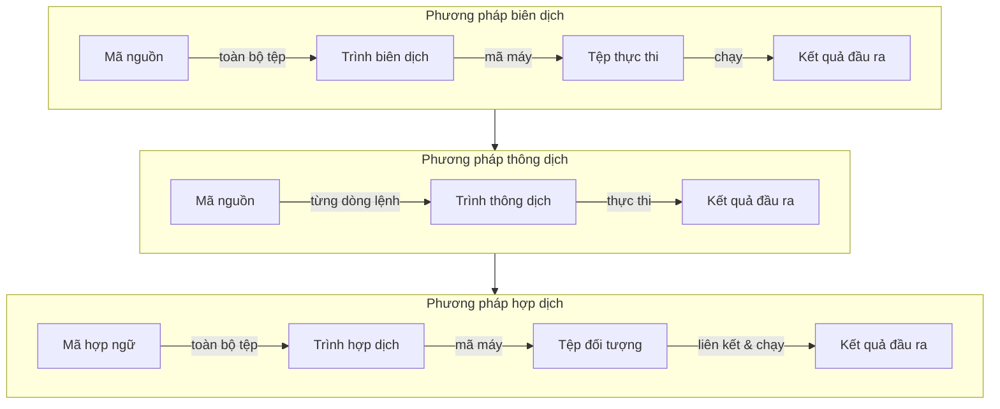
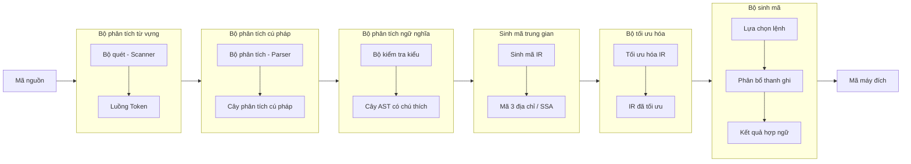
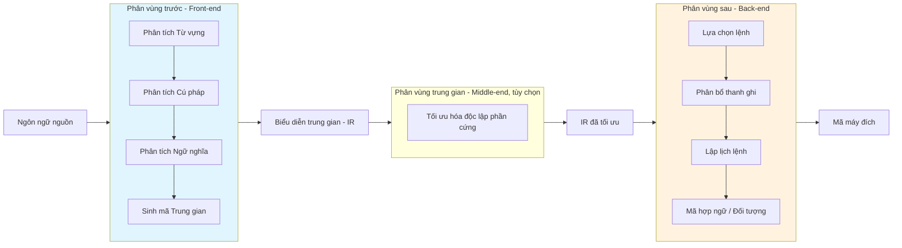
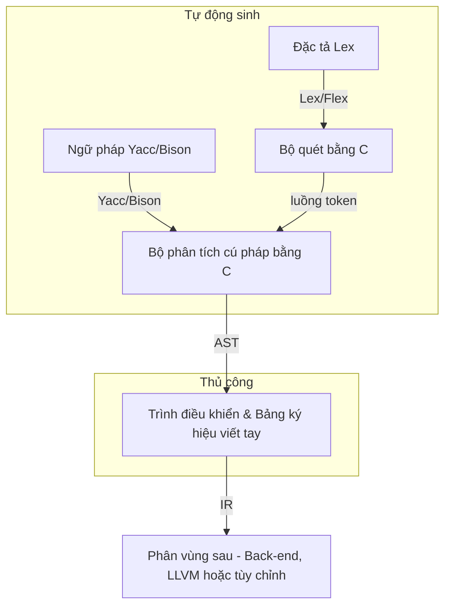

## Chương 1: Giới thiệu về Trình biên dịch (Introduction to Compilers)

### 1. Trình biên dịch (Compiler) là gì?

Một **trình biên dịch** (*compiler*) là một phần mềm hệ thống thực hiện dịch một chương trình được viết bằng **ngôn ngữ nguồn** (*source language* - ví dụ: C, Java) thành một chương trình tương đương bằng **ngôn ngữ đích** (*target language* - thường là mã máy hoặc hợp ngữ) **trước khi thực thi**. Quá trình dịch này được thực hiện dưới dạng một quy trình xử lý hàng loạt duy nhất (batch process), tạo ra một tệp thực thi độc lập có thể chạy độc lập.

Để hiểu rõ hơn về trình biên dịch, chúng ta cần so sánh chúng với **trình thông dịch** (*interpreter*) và **trình hợp dịch** (*assembler*).

| Đặc điểm | Trình biên dịch (Compiler) | Trình thông dịch (Interpreter) | Trình hợp dịch (Assembler) |
| :--- | :--- | :--- | :--- |
| **Cơ chế dịch** | Toàn bộ mã nguồn → mã máy đích | Từng câu lệnh một → thực thi ngay lập tức | Mã hợp ngữ (từ gợi nhớ) → mã máy |
| **Tốc độ thực thi** | Nhanh hơn (không mất thời gian dịch lúc chạy) | Chậm hơn (phải dịch đi dịch lại mỗi câu lệnh) | Rất nhanh (ánh xạ trực tiếp 1-1) |
| **Sử dụng bộ nhớ** | Cao hơn (cần lưu mã đối tượng + hệ thống runtime) | Thấp hơn (chỉ cần trình thông dịch và mã nguồn) | Thấp (tạo ra mã đối tượng rất nhỏ gọn) |
| **Phát hiện lỗi** | Lỗi lúc biên dịch (cú pháp, kiểu dữ liệu) | Lỗi lúc thực thi (dễ gỡ lỗi tương tác) | Lỗi cú pháp trong các từ gợi nhớ / chỉ thị |
| **Kết quả đầu ra** | Tệp thực thi độc lập | Không có tệp đầu ra vĩnh viễn – tính toán trực tiếp | Mã đối tượng (có thể định vị lại hoặc tuyệt đối) |
| **Ví dụ thực tế** | GCC, Clang, javac | Python, Ruby, JavaScript (truyền thống) | NASM, MASM, GNU as |

Sơ đồ dưới đây minh họa sự khác biệt cốt lõi giữa ba phương pháp tiếp cận này:

### 2. Nhu cầu sử dụng trình biên dịch

Các ngôn ngữ lập trình bậc cao được thiết kế để con người dễ đọc, tăng năng suất viết mã và tăng tính di động. Tuy nhiên, các bộ vi xử lý của máy tính chỉ hiểu **mã máy nhị phân** (*binary machine code*) chuyên biệt cho từng kiến trúc tập lệnh (ví dụ: x86, ARM). Trình biên dịch thu hẹp khoảng cách ngữ nghĩa này bằng cách thực hiện **dịch từ ngôn ngữ nguồn sang ngôn ngữ đích** với các lợi ích cốt lõi sau:

- **Tính trừu tượng (Abstraction)** – Lập trình viên có thể viết mã bằng các ngôn ngữ có tính biểu đạt cao, an toàn kiểu dữ liệu (type-safe) và tự động quản lý bộ nhớ mà không cần lo lắng về việc phân bổ thanh ghi hay lập lịch thực thi lệnh.
- **Tính di động (Portability)** – Cùng một mã nguồn có thể được biên dịch lại cho các kiến trúc CPU khác nhau (ví dụ: Windows chạy x86 vs. hệ thống nhúng chạy ARM) mà không cần chỉnh sửa mã nguồn.
- **Tối ưu hóa (Optimization)** – Trình biên dịch áp dụng các phép biến đổi phức tạp (trải vòng lặp, chèn nội tuyến hàm, gộp hằng số) để tạo ra mã máy tối ưu hiệu năng nhất, thường vượt trội hơn cả việc viết hợp ngữ thủ công.
- **Bảo mật & Chẩn đoán lỗi (Security & Diagnostics)** – Các bước kiểm tra khi biên dịch (kiểm tra kiểu nhất quán, phát hiện mã không thể tiếp cận, an toàn bộ nhớ) giúp phát hiện lỗi sớm trước khi triển khai hệ thống.

### 3. Các pha chính của một Trình biên dịch

Một trình biên dịch thường được chia thành nhiều **pha** (*phases*), mỗi pha biến đổi biểu diễn của chương trình từ dạng trừu tượng này sang dạng trừu tượng tiếp theo. Sáu pha kinh điển (cộng thêm bộ tối ưu hóa tùy chọn) là:

#### Mô tả chi tiết từng pha:

1. **Phân tích Từ vựng (Lexical Analysis - Scanning)**  
   Đọc luồng ký tự mã nguồn, nhóm các ký tự lại thành các **lexeme** (từ vựng), và tạo ra một luồng các **token** (thẻ từ vựng - ví dụ: `IDENTIFIER`, `NUMBER`, `PLUS`). Pha này cũng loại bỏ khoảng trắng và các chú thích (comments).  
   *Ví dụ:* `x = 42 + y` → `<ID,x> <ASSIGN> <NUM,42> <PLUS> <ID,y>`

2. **Phân tích Cú pháp (Syntax Analysis - Parsing)**  
   Kiểm tra luồng token nhận được so với ngữ pháp của ngôn ngữ nguồn, từ đó xây dựng một **cây phân tích cú pháp (parse tree)** hoặc **cây cú pháp trừu tượng (Abstract Syntax Tree - AST)**. Pha này báo cáo các lỗi cú pháp (ví dụ: thiếu dấu chấm phẩy, ngoặc đơn không đóng).

3. **Phân tích Ngữ nghĩa (Semantic Analysis)**  
   Xác minh các quy tắc phụ thuộc ngữ cảnh: khả năng tương thích kiểu dữ liệu, khai báo/sử dụng biến, quy tắc tầm vực (scope) và tính kế thừa. Pha này bổ sung thông tin từ bảng ký hiệu vào cây AST và thực hiện kiểm tra kiểu (type checking).  
   *Ví dụ:* Từ chối phép cộng giữa một chuỗi ký tự (string) và một số nguyên (integer).

4. **Sinh mã Trung gian (Intermediate Code Generation)**  
   Dịch cây AST đã được xác minh ngữ nghĩa thành một dạng **biểu diễn trung gian độc lập phần cứng (Intermediate Representation - IR)**, ví dụ như mã ba địa chỉ (three-address code - TAC), dạng gán đơn tĩnh (Static Single Assignment - SSA), hoặc bytecode. Mã IR giúp việc tối ưu hóa và chuyển đổi sang các nền tảng khác dễ dàng hơn.

5. **Tối ưu hóa mã nguồn (Optimization - Middle‑end)**  
   Áp dụng các phép biến đổi cấu trúc để cải thiện mã IR nhằm tăng tốc độ chạy hoặc giảm dung lượng bộ nhớ mà không làm thay đổi ngữ nghĩa gốc của chương trình. Các kỹ thuật tối ưu phổ biến: gộp hằng số, loại bỏ mã chết, đưa mã bất biến ra ngoài vòng lặp, chèn nội tuyến hàm.

6. **Sinh mã nguồn (Code Generation - Back-end)**  
   Ánh xạ mã IR đã tối ưu hóa thành các lệnh máy thực tế của kiến trúc đích. Quá trình này bao gồm lựa chọn lệnh máy, phân bổ thanh ghi và lập lịch thực thi lệnh. Kết quả đầu ra là mã hợp ngữ hoặc mã đối tượng có thể định vị lại.

### 4. Lượt dịch: Trình biên dịch Một lượt vs. Nhiều lượt

Một **lượt dịch** (*pass*) là một quá trình duyệt qua toàn bộ biểu diễn chương trình (mã nguồn, cây AST, hoặc mã IR) để thực hiện một tác vụ cụ thể. Trình biên dịch được phân loại dựa trên số lượt dịch này.

| Khía cạnh | Trình biên dịch Một lượt (Single-Pass) | Trình biên dịch Nhiều lượt (Multi-Pass) |
| :--- | :--- | :--- |
| **Số lần duyệt** | Duyệt qua mã nguồn duy nhất một lần | Duyệt nhiều lần qua các dạng biểu diễn trung gian |
| **Sử dụng bộ nhớ** | Rất thấp (không cần lưu trữ toàn bộ cây AST trong bộ nhớ) | Cao hơn (lưu trữ mã IR hoặc cây AST giữa các lượt dịch) |
| **Hỗ trợ ngôn ngữ** | Các ngôn ngữ đơn giản (tập con của Pascal, ngôn ngữ C thời kỳ đầu) | Tất cả các ngôn ngữ hiện đại (C++, Java, Rust) |
| **Tham chiếu tiến (Forward references)** | Không cho phép hoặc yêu cầu kỹ thuật backpatching phức tạp | Hỗ trợ tự nhiên và dễ dàng |
| **Tối ưu hóa** | Rất hạn chế (chỉ tối ưu hóa lỗ nhìn cục bộ - peephole) | Có thể tối ưu hóa toàn cục và tối ưu hóa liên thủ tục phức tạp |

```mermaid
flowchart TD
    subgraph SinglePass [Biên dịch Một lượt]
        S1[Mã nguồn] -->|một lượt quét| S2[Quét + Phân tích + Sinh mã] --> S3[Mã đối tượng]
        S2 -.->|thông tin giới hạn| S3
    end

    subgraph MultiPass [Biên dịch Nhiều lượt]
        M1[Mã nguồn] --> M2[Quét → Phân tích → AST]
        M2 --> M3[Lượt Ngữ nghĩa]
        M3 --> M4[Lượt Sinh mã IR]
        M4 --> M5[Lượt Tối ưu 1]
        M5 --> M6[Lượt Tối ưu N]
        M6 --> M7[Lượt Sinh mã nguồn]
        M7 --> M8[Mã đối tượng]
    end
```

Hầu hết các trình biên dịch thực tế hiện nay (như GCC, LLVM, javac) đều là **nhiều lượt** (*multi‑pass*), vì chúng cần thực hiện các kỹ thuật tối ưu hóa chuyên sâu và hỗ trợ các tính năng ngôn ngữ phức tạp (như tham chiếu tiến của lớp, kiểu generic).

### 5. Phân vùng trước (Front-end) vs. Phân vùng sau (Back-end)

Trình biên dịch được chia một cách logic thành hai phần chính: **Front‑end** (Phân vùng trước) và **Back‑end** (Phân vùng sau), được phân tách bằng ngôn ngữ biểu diễn trung gian (IR). Sự phân chia này cho phép tối đa hóa khả năng tái sử dụng: một front-end có thể hỗ trợ nhiều ngôn ngữ nguồn khác nhau, và một back-end có thể sinh mã cho nhiều kiến trúc máy đích khác nhau.

- **Front‑end** – Phụ thuộc vào ngôn ngữ nguồn nhưng độc lập với kiến trúc phần cứng máy đích. Thực hiện phân tích từ vựng, cú pháp, ngữ nghĩa và sinh mã IR.
- **Back‑end** – Phụ thuộc vào cấu trúc phần cứng máy đích nhưng độc lập với ngôn ngữ nguồn. Thực hiện sinh mã máy thực tế, phân bổ thanh ghi và tối ưu hóa đặc thù phần cứng.
- **Middle‑end** (Tùy chọn, thường là một phần của back-end) – Thực hiện các tối ưu hóa độc lập phần cứng trên mã IR (như lan truyền hằng số, loại bỏ mã chết).

### 6. Các công cụ xây dựng trình biên dịch

Các trình biên dịch hiện đại hiếm khi được viết thủ công hoàn toàn từ đầu. Các công cụ tự động hóa được gọi là **compiler-compiler** (trình biên dịch của trình biên dịch) hỗ trợ sinh tự động các pha ở Front-end.

| Công cụ | Mục đích sử dụng | Đầu vào nhận vào | Kết quả sinh ra |
| :--- | :--- | :--- | :--- |
| **Lex** / **Flex** | Sinh bộ phân tích từ vựng | Biểu thức chính quy (định nghĩa token) | Mã nguồn C cho bộ quét (ơ-tô-mát hữu hạn) |
| **Yacc** / **Bison** | Sinh bộ phân tích cú pháp (LALR(1)) | Ngữ pháp phi ngữ cảnh (luật sinh) | Mã nguồn C cho bộ phân tích (dịch-thu gọn) |
| **ANTLR** | Sinh bộ phân tích cú pháp (LL(*)) | Ngữ pháp mở rộng kèm hành vi lập trình | Bộ phân tích bằng Java, C++, Python, v.v. |
| **LLVM** | Khung hạ tầng IR, tối ưu hóa và back-end | Mã biểu diễn trung gian (LLVM bitcode) | Mã máy tối ưu cho nhiều loại CPU |
| **libpopt** / **gperf** | Thư viện hỗ trợ bảng ký hiệu, bảng băm... | – | – |

Quy trình sử dụng phổ biến trong một dự án trình biên dịch thực tế:

- **Lex** sinh ra một ơ-tô-mát hữu hạn giúp nhận diện các token từ luồng ký tự và kích hoạt các hành động do người dùng định nghĩa (ví dụ: trả về kiểu token).
- **Yacc** (Yet Another Compiler Compiler) tạo ra bộ phân tích cú pháp LALR(1) gọi bộ quét để lấy token và xây dựng cây phân tích dựa trên các quy tắc ngữ pháp.
- Sự kết hợp giữa hai công cụ này giúp các nhà phát triển giải phóng khỏi việc tự viết mã phân tích cú pháp và từ vựng, từ đó tập trung vào phân tích ngữ nghĩa và tối ưu hóa chuyên sâu.

---

### Tóm tắt (Summary)

Chương này đã giới thiệu vai trò cơ bản của trình biên dịch dưới tư cách là một bộ dịch ngôn ngữ lập trình, phân biệt nó với trình thông dịch và trình hợp dịch, đồng thời giải thích sự cần thiết của biên dịch nhằm mang lại tính trừu tượng, tính di động và hiệu năng vượt trội cho phần mềm. Sáu pha lớn—từ vựng, cú pháp, ngữ nghĩa, sinh mã trung gian, tối ưu hóa và sinh mã máy—tạo nên quy trình xử lý kinh điển của trình biên dịch. Khái niệm về kiến trúc một lượt vs. nhiều lượt cũng như sự phân tách rõ ràng giữa Front-end và Back-end là nền tảng kỹ thuật để xây dựng các trình biên dịch tối ưu hóa đa nền tảng. Cuối cùng, các công cụ tự động hóa như Lex và Yacc giúp giảm thiểu công sức xây dựng bộ phân tích, cho phép phát triển nhanh các trình biên dịch chất lượng thương mại.
