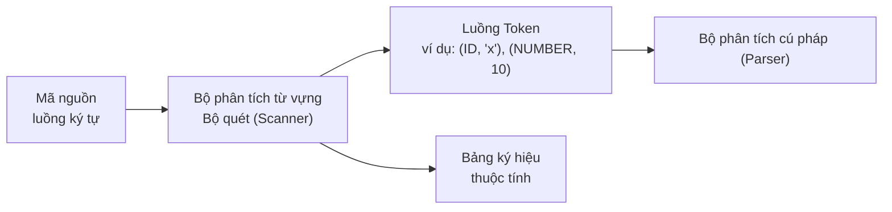
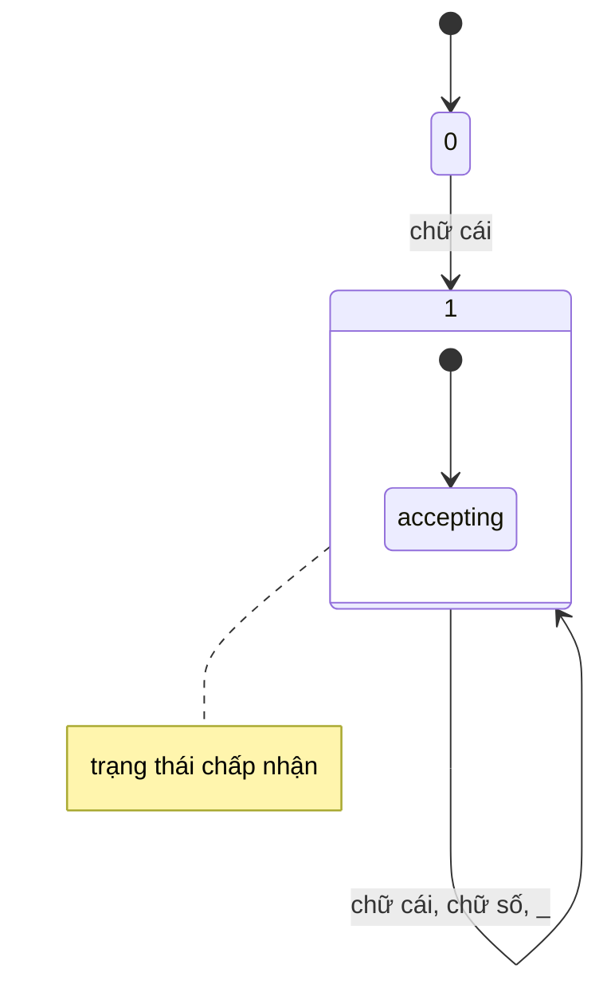
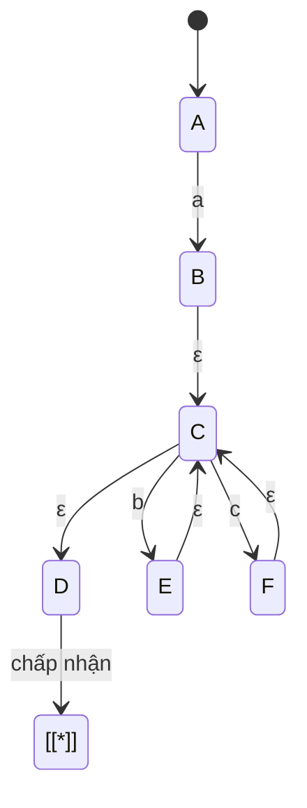
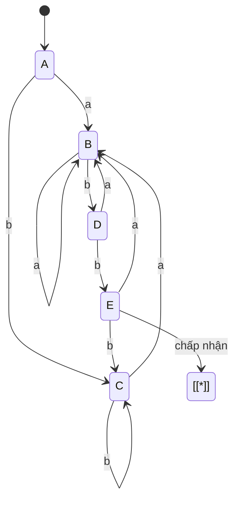
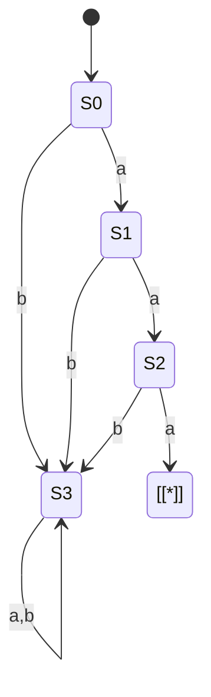
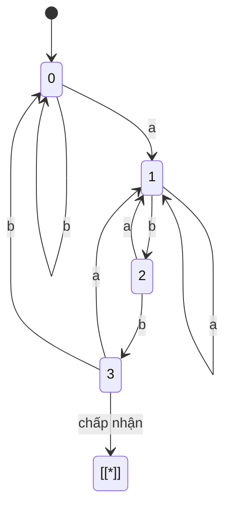
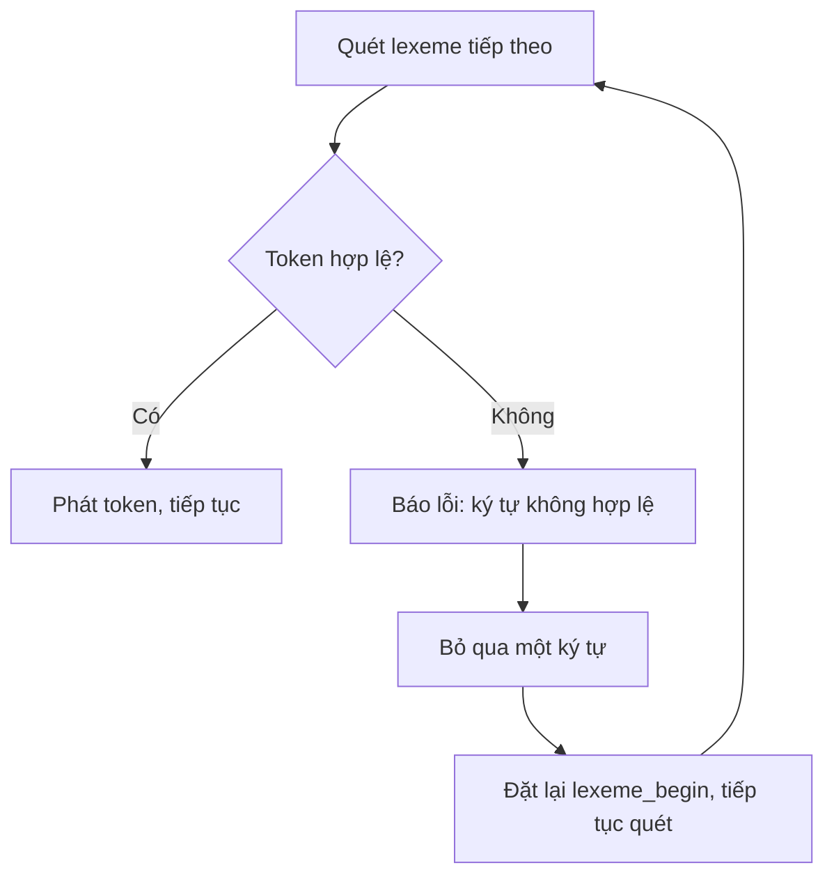

## Chương 2: Phân tích Từ vựng (Lexical Analysis)

### 1. Vai trò của Bộ phân tích từ vựng (Lexical Analyzer / Scanner)

Bộ phân tích từ vựng (*lexical analyzer / scanner*) là pha đầu tiên trong quá trình biên dịch. Nhiệm vụ chính của nó là đọc luồng ký tự mã nguồn, nhóm các ký tự này thành các **lexeme** (từ vựng), và tạo ra một luồng các **token** (thẻ từ vựng) để cung cấp cho bộ phân tích cú pháp (*parser*). Ngoài ra, bộ phân tích từ vựng còn loại bỏ các khoảng trắng/chú thích không cần thiết và xử lý các lỗi từ vựng đầu vào.

**Ví dụ:**  
Đoạn mã: `if (x > 10) result = 5;`  
Các token được sinh ra: `<KEYWORD, if>`, `<LPAREN>`, `<IDENT, x>`, `<GT>`, `<NUMBER, 10>`, `<RPAREN>`, `<IDENT, result>`, `<ASSIGN>`, `<NUMBER, 5>`, `<SEMICOLON>`

---

### 2. Cơ chế đệm đầu vào (Input Buffering)

Để phân tích từ vựng hiệu quả, bộ quét thường cần đọc trước một vài ký tự (lookahead) để đưa ra quyết định (ví dụ: phân biệt dấu gán `=` với toán tử so sánh bằng `==`). Giải pháp tiêu chuẩn thường được sử dụng là **Sơ đồ hai bộ đệm kết hợp ký tự lính canh** (Two‑buffer + sentinel scheme).

**Sơ đồ hai bộ đệm với ký tự lính canh:**  
Hai bộ đệm có cùng kích thước *N* được sử dụng thay thế nhau. Một ký tự lính canh (thường là ký tự kết thúc tệp `EOF` hoặc một ký tự đặc biệt) được đặt ở cuối mỗi bộ đệm. Khi con trỏ duyệt ký tự `forward` chạm đến ký tự lính canh này, bộ quét sẽ tự động nạp dữ liệu mới vào bộ đệm còn lại.

```mermaid
flowchart TD
    subgraph Buffer1 [Bộ đệm 1]
        B1["... x > = y ... &#124; KÝ TỰ LÍNH CANH"]
    end
    subgraph Buffer2 [Bộ đệm 2]
        B2["... phần tiếp theo ... &#124; KÝ TỰ LÍNH CANH"]
    end
    P1["lexeme_begin"] --> B1
    P2["forward"] --> B1
    
    P2 -- "forward gặp lính canh" --> Decision{Nạp tiếp?}
    Decision -- "chưa hết tệp" --> Refill["Nạp khối tiếp theo vào Bộ đệm 2"]
    Refill --> Reset["Đặt lại lexeme_begin, forward"]
```

Việc sử dụng **Ký tự lính canh (Sentinels)** giúp loại bỏ việc kiểm tra biên bộ đệm liên tục cho mỗi ký tự được đọc – ký tự lính canh chỉ cần được kiểm tra khi con trỏ quét chạm vào nó.

---

### 3. Token, Pattern, Lexeme

| Thuật ngữ | Định nghĩa | Ví dụ |
| :--- | :--- | :--- |
| **Token** | Danh mục phân loại của đơn vị từ vựng | `IDENTIFIER`, `NUMBER`, `IF` |
| **Pattern (Mẫu)** | Quy tắc (thường là biểu thức chính quy) mô tả tập hợp các lexeme của token đó | `letter (letter \| digit)*` |
| **Lexeme** | Chuỗi ký tự thực tế khớp với mẫu (pattern) trong mã nguồn | `count`, `123`, `if` |

**Ví dụ:**  
Câu lệnh `total = 0;` → chuỗi ký tự `total` là một lexeme khớp với mẫu `letter+`, được phân loại vào nhóm token `IDENTIFIER`.

---

### 4. Đặc tả Token bằng Biểu thức chính quy

Biểu thức chính quy (*Regular Expressions - RE*) được dùng để định nghĩa mẫu của các token. Các phép toán cơ bản bao gồm:

| Phép toán | Ký hiệu | Ý nghĩa |
| :--- | :--- | :--- |
| **Phép ghép nối (Concatenation)** | `r s` | Chuỗi khớp với `r` sau đó là `s` |
| **Phép lựa chọn (Alternation)** | `r \| s` | Chuỗi khớp với `r` hoặc `s` |
| **Bao đóng Kleene (Kleene star)** | `r*` | Khớp với `r` lặp lại từ 0 hoặc nhiều lần |
| **Bao đóng tích cực (Positive closure)** | `r+` | Khớp với `r` lặp lại từ 1 hoặc nhiều lần (`r r*`) |
| **Tùy chọn (Optional)** | `r?` | Khớp với `r` xuất hiện 0 hoặc 1 lần (`r \| ε`) |

**Các mẫu từ vựng phổ biến:**
- Tên định danh (Identifier): `[a-zA-Z_][a-zA-Z0-9_]*`
- Số nguyên (Integer): `[0-9]+`
- Số thực (Float): `[0-9]+\.[0-9]+((E|e)(+|-)?[0-9]+)?`

---

### 5. Ơ-tô-mát Hữu hạn (Finite Automata)

#### 5.1 Ơ-tô-mát Hữu hạn Đơn định (Deterministic Finite Automaton - DFA)

Được định nghĩa bởi bộ 5 `(Q, Σ, δ, q0, F)` với hàm chuyển trạng thái `δ: Q × Σ → Q` (đơn định, duy nhất). Không chứa các bước chuyển trạng thái rỗng ε (ε‑moves).

**Ví dụ DFA cho tên định danh (chấp nhận chữ cái, chữ số, dấu gạch dưới):**

#### 5.2 Ơ-tô-mát Hữu hạn Phi Đơn định (Non‑deterministic Finite Automaton - NFA)

Được định nghĩa với hàm chuyển trạng thái `δ: Q × (Σ ∪ {ε}) → P(Q)` – một trạng thái có thể có nhiều chuyển dịch tiếp theo cho cùng một ký hiệu đầu vào, bao gồm cả dịch chuyển rỗng ε.

**Ví dụ NFA cho biểu thức chính quy `a(b|c)*`:**

#### 5.3 Thuật toán chuyển đổi: NFA → DFA (Xây dựng tập con - Subset Construction)

**Các bước thuật toán:**
1. Tính **bao đóng ε (ε‑closure)** của các trạng thái ban đầu của NFA.
2. Với mỗi trạng thái của DFA (thực chất là một tập hợp các trạng thái NFA) và mỗi ký hiệu đầu vào `c`, tính `ε‑closure(move(T, c))` để tạo ra trạng thái DFA mới.
3. Lặp lại cho đến khi không sinh thêm trạng thái mới nào.

**Ví dụ: Chuyển đổi NFA của biểu thức `(a|b)*abb` thành DFA**

Ý nghĩa các trạng thái (ví dụ):
- A = ε‑closure({0})
- B = ε‑closure(move(A, a))
- C = ε‑closure(move(A, b))
- D = ε‑closure(move(B, b))
- E = ε‑closure(move(D, b)) (đây là trạng thái chấp nhận vì nó chứa trạng thái chấp nhận của NFA gốc)

#### 5.4 Tối thiểu hóa DFA (Thuật toán Hopcroft – Mặt khái niệm)

**Ý tưởng:** Chia tập hợp các trạng thái DFA thành các nhóm **không thể phân biệt** (indistinguishable groups). Ban đầu, phân chia thành 2 nhóm: nhóm trạng thái chấp nhận và nhóm trạng thái không chấp nhận. Tiếp tục phân chia nhỏ các nhóm nếu trạng thái trong nhóm dịch chuyển bởi một ký hiệu đầu vào dẫn tới các nhóm khác nhau.

**Ví dụ DFA trước khi tối thiểu hóa (chứa trạng thái dư thừa):**

Sau khi tối thiểu hóa, các trạng thái như S1 và S2 có thể được hợp nhất nếu chúng có hành vi chuyển dịch hoàn toàn giống nhau. DFA tối thiểu hóa sẽ có số lượng trạng thái ít nhất nhưng vẫn chấp nhận cùng một ngôn ngữ.

---

### 6. Xây dựng DFA từ Biểu thức chính quy

**Có 2 con đường chính:**

#### Con đường 1: RE → NFA (Thompson) → DFA (Subset construction)

Cấu trúc Thompson xây dựng NFA theo phương pháp quy nạp:

```mermaid
flowchart LR
    subgraph Base [Trường hợp cơ sở]
        direction LR
        E1[ε] --> E1F(( ))
        A[a] --> AF(( ))
    end
    subgraph Induction [Quy nạp]
        direction TB
        R1[ r ] --> C1[ phép ghép nối - concatenation ]
        R2[ s ] --> C1
        R1 --> Alt["phép lựa chọn r&#124;s"]
        R2 --> Alt
        R1 --> Star["bao đóng Kleene r*"]
    end
```

**Ví dụ:** Xây dựng NFA cho biểu thức `(a|b)*abb`, sau đó chuyển đổi sang DFA (kết quả cuối cùng xem tại mục 5.3).

#### Con đường 2: Xây dựng trực tiếp RE → DFA (Dựa trên đạo hàm Brzozowski hoặc dùng hàm **followpos** từ cây cú pháp của RE)

**DFA tối thiểu cuối cùng cho `(a|b)*abb`:**

DFA này chấp nhận chính xác tất cả các chuỗi ký tự kết thúc bằng cụm `abb`.

---

### 7. Lỗi từ vựng và Phục hồi lỗi

**Các lỗi từ vựng thường gặp:**
- Xuất hiện ký tự không hợp lệ (ví dụ: `@` trong ngôn ngữ C)
- Chuỗi ký tự không đóng dấu nháy (`"hello`)
- Chú thích không có dấu đóng (`/* comment`)
- Định danh hoặc chữ số quá dài (vượt quá giới hạn cho phép của hệ thống)

**Phục hồi lỗi chế độ hoảng loạn (Panic‑mode recovery - đơn giản và phổ biến nhất):**
- Khi phát hiện lỗi, bộ quét sẽ bỏ qua (xóa bỏ) các ký tự đầu vào từng ký tự một cho đến khi tìm thấy một ký tự hợp lệ có thể bắt đầu một token mới.
- Báo cáo chính xác lỗi cho lexeme vi phạm.

**Ví dụ:**  
Mã nguồn: `int @x = 5;`  
Bộ quét phát hiện `@` không hợp lệ → báo lỗi "Ký tự không hợp lệ '@' bị bỏ qua". Hệ thống loại bỏ ký tự này, sau đó tiếp tục quét `x` dưới dạng một định danh hợp lệ.

---

## Bảng Tổng kết Chương

| Chủ đề | Điểm cốt lõi |
| :--- | :--- |
| **Vai trò của bộ quét** | Sinh luồng token, loại bỏ khoảng trắng/chú thích, xử lý lỗi từ vựng ban đầu. |
| **Đệm đầu vào** | Sơ đồ hai bộ đệm + ký tự lính canh giúp loại bỏ kiểm tra biên liên tục trên từng ký tự. |
| **Token / Pattern / Lexeme** | Token: phân loại; Pattern: quy tắc; Lexeme: văn bản thực tế trong mã nguồn. |
| **Biểu thức chính quy (RE)** | Công cụ hình thức mô tả các mẫu token (phép nối, phép lựa chọn, bao đóng). |
| **DFA** | Đơn định, thời gian chạy tuyến tính O(n), không chứa dịch chuyển rỗng ε. |
| **NFA** | Phi đơn định, dễ xây dựng trực tiếp từ biểu thức chính quy. |
| **NFA → DFA** | Thuật toán xây dựng tập con (Subset construction - độ phức tạp xấu nhất là hàm mũ nhưng cực kỳ hiếm gặp trong thực tế). |
| **Tối thiểu hóa DFA** | Thuật toán Hopcroft hợp nhất các trạng thái không thể phân biệt nhằm tối ưu số lượng trạng thái. |
| **RE → DFA** | Chuyển đổi qua trung gian NFA (Thompson) hoặc xây dựng trực tiếp bằng cây cú pháp (followpos). |
| **Lỗi từ vựng** | Ký tự không hợp lệ, chuỗi không đóng; phục hồi bằng chế độ hoảng loạn. |

Nền tảng lý thuyết này giúp xây dựng các bộ phân tích từ vựng hiệu năng cực cao, thường được sinh tự động bằng các công cụ như **lex** / **flex** thông qua việc chuyển đổi các đặc tả biểu thức chính quy thành DFA tối thiểu.
