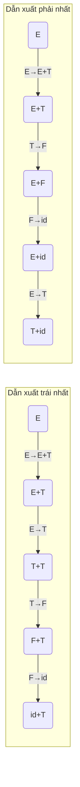
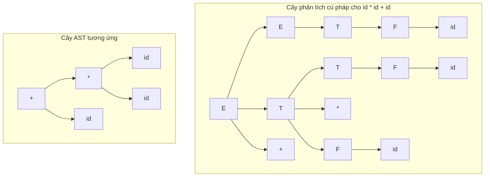
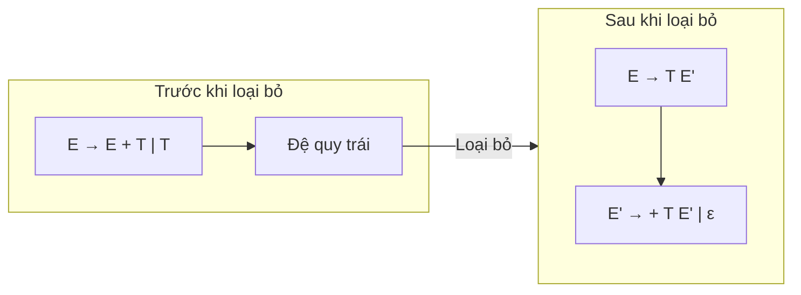
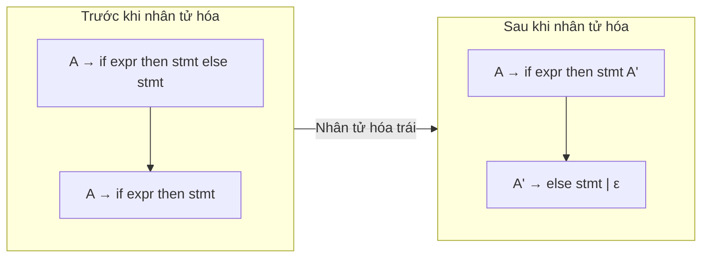
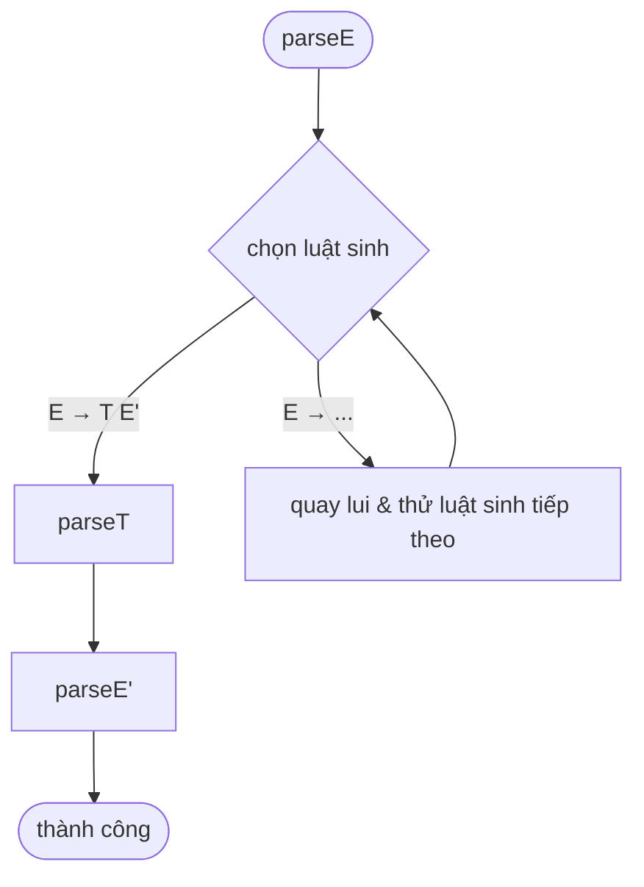
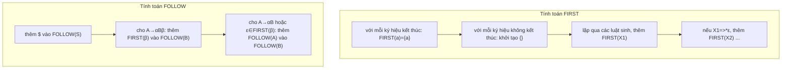
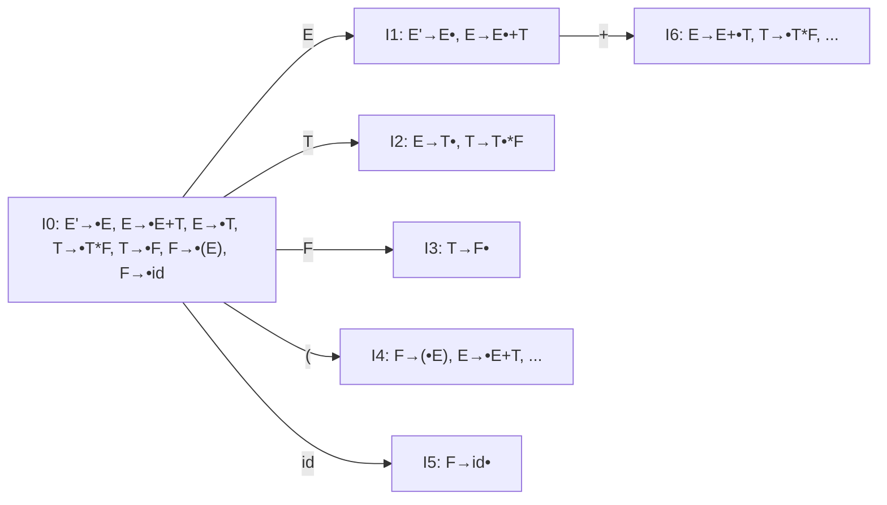
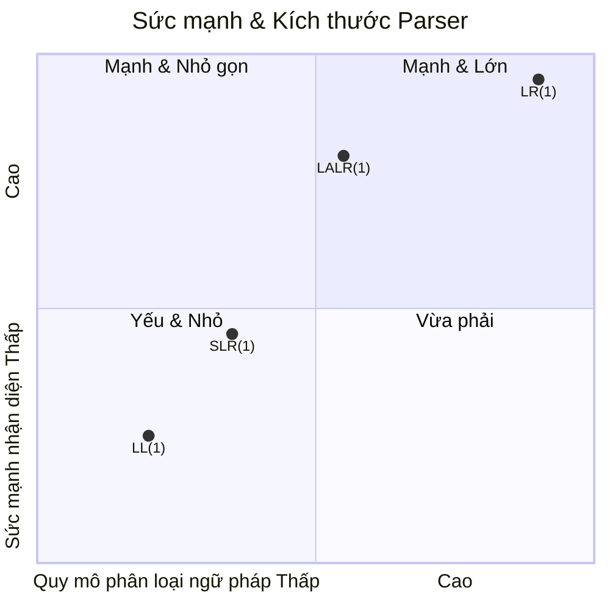

# Chương 03: Phân tích Cú pháp (Syntax Analysis / Parsing)

Tài liệu tham khảo toàn diện và chuyên sâu về phân tích cú pháp (*parsing*) trong thiết kế trình biên dịch. Hướng dẫn này bao gồm lý thuyết về ngữ pháp phi ngữ cảnh, phân tích cú pháp từ trên xuống (LL(1)), phân tích cú pháp từ dưới lên (họ LR), và các chiến lược phục hồi lỗi cú pháp. Tài liệu được thiết kế tối ưu cho sinh viên, kỹ sư và những người đam mê trình biên dịch.

---

## 1. Ngữ pháp Phi ngữ cảnh (Context‑Free Grammars - CFG)

Một **Ngữ pháp Phi ngữ cảnh** là một bộ 4 ký hiệu $G = (N, T, P, S)$ trong đó:
- $N$ : tập hữu hạn các **ký hiệu không kết thúc (non‑terminals)**
- $T$ : tập hữu hạn các **ký hiệu kết thúc (terminals)** (các token được trả về từ bộ phân tích từ vựng)
- $P$ : tập hữu hạn các **luật sinh (productions)** có dạng $A \to \alpha$ (với $A \in N, \alpha \in (N \cup T)^*$ )
- $S \in N$ : **ký hiệu bắt đầu (start symbol)**

**Ví dụ ngữ pháp phi ngữ cảnh cho biểu thức số học:**
```text
E → E + T | T
T → T * F | F
F → ( E ) | id
```

### 1.1 Dẫn xuất (Derivations)
Dẫn xuất là quá trình thay thế một ký hiệu không kết thúc bằng vế phải của một luật sinh tương ứng.

- **Dẫn xuất trái nhất (Leftmost derivation)** – thay thế ký hiệu không kết thúc nằm ngoài cùng bên trái tại mỗi bước.
- **Dẫn xuất phải nhất (Rightmost derivation)** – thay thế ký hiệu không kết thúc nằm ngoài cùng bên phải tại mỗi bước.



### 1.2 Cây phân tích cú pháp và Cây cú pháp trừu tượng (AST)

- **Cây phân tích cú pháp (Parse Tree)** (còn gọi là cây cú pháp cụ thể) biểu diễn quá trình dẫn xuất dưới dạng đồ thị trực quan, với tất cả các ký hiệu ngữ pháp làm nút cây.
- **Cây cú pháp trừu tượng (AST)** loại bỏ các dấu câu và các chi tiết cú pháp không liên quan, chỉ giữ lại cấu trúc ngữ nghĩa cốt lõi của chương trình.



### 1.3 Tính nhập nhằng của Ngữ pháp (Ambiguity)
Một ngữ pháp là **nhập nhằng (ambiguous)** nếu tồn tại một chuỗi đầu vào có thể tạo ra hai cây phân tích cú pháp khác nhau (hoặc hai dẫn xuất trái nhất khác nhau).

**Ví dụ kinh điển – Vấn đề dangling‑else (else mồ côi):**
```text
stmt → if expr then stmt | if expr then stmt else stmt | other
```
Với chuỗi đầu vào `if e1 then if e2 then s1 else s2`, chúng ta có thể tạo ra hai cây phân tích cú pháp khác nhau tùy thuộc vào việc dấu `else` được liên kết với `if` thứ nhất hay thứ hai.

**Cách loại bỏ tính nhập nhằng:** Viết lại ngữ pháp để bắt buộc áp dụng quy tắc (ví dụ: `else` phải luôn khớp với `if` gần nhất chưa được khớp trước đó).
```text
stmt → matched_stmt | unmatched_stmt
matched_stmt → if expr then matched_stmt else matched_stmt | other
unmatched_stmt → if expr then stmt | if expr then matched_stmt else unmatched_stmt
```

### 1.4 Loại bỏ đệ quy trái (Eliminating Left Recursion)
Đệ quy trái ($A \to A\alpha \mid \beta$) gây ra vòng lặp vô hạn trong các bộ phân tích cú pháp từ trên xuống (top-down parsers).

**Thuật toán loại bỏ đệ quy trái trực tiếp:**
Thay thế luật sinh đệ quy trái:
$$
A \to A\alpha_1 \mid A\alpha_2 \mid \dots \mid A\alpha_m \mid \beta_1 \mid \beta_2 \mid \dots \mid \beta_n
$$
bằng tập hợp luật sinh tương đương:
$$
\begin{aligned}
A &\to \beta_1 A' \mid \beta_2 A' \mid \dots \mid \beta_n A' \\
A' &\to \alpha_1 A' \mid \alpha_2 A' \mid \dots \mid \alpha_m A' \mid \varepsilon
\end{aligned}
$$



**Ví dụ:**
```text
Ngữ pháp gốc:                   Ngữ pháp sau khi loại bỏ đệ quy trái:
E → E + T | T      chuyển thành: E → T E'
T → T * F | F                    E' → + T E' | ε
F → (E) | id                     T → F T'
                                 T' → * F T' | ε
                                 F → (E) | id
```

### 1.5 Nhân tử hóa trái (Left Factoring)
Khi hai hoặc nhiều luật sinh của một ký hiệu không kết thúc chia sẻ chung một tiền tố, nhân tử hóa trái trì hoãn quyết định chọn luật sinh bằng cách tách tiền tố chung đó ra ngoài:
$$
A \to \alpha\beta_1 \mid \alpha\beta_2 \quad\Rightarrow\quad A \to \alpha A',\; A' \to \beta_1 \mid \beta_2
$$



---

## 2. Phân tích Cú pháp Từ Trên Xuống (Top‑Down Parsing)

Bộ phân tích cú pháp từ trên xuống xây dựng cây phân tích cú pháp từ nút gốc (ký hiệu bắt đầu) đi dần xuống các nút lá, sử dụng phương pháp dẫn xuất trái nhất.

### 2.1 Phân tích Cú pháp Đệ quy đi xuống có quay lui (Recursive Descent Parsing with Backtracking)
Đây là cách tiếp cận sử dụng một tập hợp các hàm đệ quy, mỗi hàm đại diện cho một ký hiệu không kết thúc. Thuật toán sẽ quay lui (backtracking) để thử luật sinh khác nếu luật sinh hiện tại gặp thất bại trong quá trình khớp.



**Nhược điểm:** Độ phức tạp thời gian tăng theo hàm mũ và việc báo cáo chính xác vị trí lỗi gặp nhiều khó khăn.

### 2.2 Phân tích Cú pháp Dự đoán không quay lui (Predictive Parsing)
Sử dụng một **bảng phân tích cú pháp (parsing table)** và một ngăn xếp (stack) để điều phối quá trình phân tích mà không cần quay lui. Yêu cầu bắt buộc là ngữ pháp phải thuộc lớp **LL(1)**.

### 2.3 Cách tính tập FIRST và FOLLOW

- **FIRST(α)** – Tập hợp các ký hiệu kết thúc bắt đầu các chuỗi được dẫn xuất từ α.
- **FOLLOW(A)** – Tập hợp các ký hiệu kết thúc có thể xuất hiện ngay bên phải của A trong một số dẫn xuất nào đó.

**Quy tắc xây dựng tập FIRST:**
1. Nếu $a \in T$ (ký hiệu kết thúc), thì $\text{FIRST}(a) = \{a\}$.
2. Nếu luật sinh $A \to \varepsilon$, thì $\varepsilon \in \text{FIRST}(A)$.
3. Nếu luật sinh $A \to X_1 X_2 \dots X_k$, thêm $\text{FIRST}(X_1)$ vào $\text{FIRST}(A)$. Nếu $X_1 \Rightarrow^* \varepsilon$, tiếp tục thêm $\text{FIRST}(X_2)$, và lặp lại như vậy.

**Quy tắc xây dựng tập FOLLOW:**
1. Thêm ký hiệu kết thúc đầu vào $\$ \in \text{FOLLOW}(S)$ (trong đó $S$ là ký hiệu bắt đầu).
2. Nếu tồn tại luật sinh $A \to \alpha B \beta$, thì toàn bộ tập $\text{FIRST}(\beta) \setminus \{\varepsilon\} \subseteq \text{FOLLOW}(B)$.
3. Nếu tồn tại luật sinh $A \to \alpha B$ hoặc $A \to \alpha B \beta$ mà $\varepsilon \in \text{FIRST}(\beta)$, thì toàn bộ tập $\text{FOLLOW}(A) \subseteq \text{FOLLOW}(B)$.



### 2.4 Ngữ pháp LL(1)
Một ngữ pháp phi ngữ cảnh được phân loại là **LL(1)** nếu và chỉ nếu với mọi cặp luật sinh dạng $A \to \alpha \mid \beta$:
- $\text{FIRST}(\alpha) \cap \text{FIRST}(\beta) = \emptyset$
- Nếu $\varepsilon \in \text{FIRST}(\alpha)$, thì $\text{FIRST}(\beta) \cap \text{FOLLOW}(A) = \emptyset$ (và ngược lại)

**Cách xây dựng bảng phân tích cú pháp LL(1):**
- Với mỗi luật sinh dạng $A \to \alpha$:
  - Với mỗi ký hiệu kết thúc $t \in \text{FIRST}(\alpha)$, đặt ô bảng $M[A, t] = A \to \alpha$.
  - Nếu $\varepsilon \in \text{FIRST}(\alpha)$, thì với mỗi ký hiệu kết thúc $b \in \text{FOLLOW}(A)$, đặt ô bảng $M[A, b] = A \to \alpha$.

### 2.5 Thuật toán phân tích cú pháp LL(1) dựa trên Ngăn xếp

```mermaid
flowchart TD
    start([Khởi tạo ngăn xếp với $ và S]) --> read[Đọc token tiếp theo a]
    read --> loop{đỉnh ngăn xếp X}
    loop -->|X là ký hiệu kết thúc & X==a| popAdv[pop X, duyệt tiếp đầu vào]
    popAdv --> check{đầu vào rỗng?}
    check -->|đúng| accept([Chấp nhận])
    check -->|sai| read
    loop -->|X là ký hiệu kết thúc & X!=a| error([Báo lỗi])
    loop -->|X là ký hiệu không kết thúc| table[M[X,a] = luật sinh?]
    table -->|đúng| replace[pop X, push phần thân luật sinh theo thứ tự đảo ngược]
    replace --> read
    table -->|sai| error
```

**Ví dụ bảng phân tích cú pháp cho ngữ pháp biểu thức rút gọn:**

| Ký hiệu | id | + | * | ( | ) | $ |
| :--- | :--- | :--- | :--- | :--- | :--- | :--- |
| **E** | E → T E' | | | E → T E' | | |
| **E'** | | E' → + T E'| | | E' → ε | E' → ε |
| **T** | T → F T' | | | T → F T' | | |
| **T'** | | T' → ε | T' → * F T'| | T' → ε | T' → ε |
| **F** | F → id | | | F → ( E ) | | |

### 2.6 Cơ chế phục hồi lỗi trong LL(1)

- **Chế độ hoảng loạn (Panic mode):** Bỏ qua các token đầu vào cho đến khi gặp một **token đồng bộ** (ví dụ: dấu `;` hoặc `}`) thuộc tập FOLLOW của ký hiệu không kết thúc vừa bị pop khỏi ngăn xếp.
- **Phục hồi cấp cụm từ (Phrase-level recovery):** Thực hiện chèn/xóa ký hiệu tại chỗ dựa trên bảng phân tích cú pháp để tiếp tục quá trình quét.
- **Luật sinh chứa lỗi (Error productions):** Bổ sung thêm các luật sinh để trực tiếp bắt và xử lý các lỗi cú pháp thường gặp của lập trình viên.

```mermaid
flowchart LR
    subgraph "Phục hồi chế độ hoảng loạn"
        P1[Lỗi tại đỉnh ngăn xếp A] --> P2[Bỏ qua token đến khi t thuộc FOLLOW(A)]
        P2 --> P3[Pop A, tiếp tục phân tích]
    end
    subgraph "Phục hồi cấp cụm từ"
        R1[Phát hiện lỗi] --> R2[Thêm/xóa token tối thiểu]
        R2 --> R3[Tiếp tục với đầu vào đã sửa]
    end
```

---

## 3. Phân tích Cú pháp Từ Dưới Lên (Bottom‑Up Parsing)

Bộ phân tích cú pháp từ dưới lên xây dựng cây phân tích cú pháp từ các nút lá (luồng token đầu vào) đi dần lên nút gốc (ký hiệu bắt đầu). Lớp thuật toán phổ biến nhất cho cơ chế này là **Bộ phân tích cú pháp LR (LR Parsers)**.

### 3.1 Thu gọn tay cầm (Handle Pruning)
Một **tay cầm (handle)** là một chuỗi con khớp với vế phải của một luật sinh và việc thu gọn tay cầm đó sẽ đưa chúng ta tiến gần hơn tới ký hiệu bắt đầu của ngữ pháp. Quá trình thu gọn tay cầm là quá trình thay thế tay cầm đó bằng ký hiệu không kết thúc tương ứng (đây là quá trình đảo ngược của dẫn xuất phải nhất).

**Tiền tố khả thi (Viable prefix)** – Là tiền tố của một dạng câu bên phải (right-sentential form) có thể xuất hiện hợp lệ trên ngăn xếp của bộ phân tích cú pháp dịch-thu gọn (shift-reduce parser).

### 3.2 Tổng quan về Phân tích Cú pháp LR

Bộ phân tích cú pháp LR sử dụng:
- Một **ngăn xếp (stack)** (chứa các trạng thái và các ký hiệu ngữ pháp).
- Một **bảng phân tích cú pháp (parsing table)** gồm 2 phần: ACTION và GOTO.
- Một **bộ đệm đầu vào (input buffer)**.

**Các item LR:** Là một luật sinh đi kèm một dấu chấm (•) để chỉ ra tiến trình phân tích đã thực hiện đến đâu.  
*Ví dụ:* Item $A \to \alpha \cdot \beta$ nghĩa là bộ phân tích đã quét xong chuỗi $\alpha$ và đang kỳ vọng chuỗi $\beta$ tiếp theo.

- **Hàm Closure(I)** – Bổ sung các item mới có thể tiếp cận được khi dấu chấm (•) nằm ngay trước một ký hiệu không kết thúc.
- **Hàm Goto(I, X)** – Dịch chuyển dấu chấm (•) qua ký hiệu $X$ đối với tất cả các item thuộc tập $I$ có $X$ nằm ngay sau dấu chấm.

### 3.3 Ơ-tô-mát LR(0)
Các trạng thái trong ơ-tô-mát chính là các tập hợp của các item LR(0). Các bước dịch chuyển trạng thái tương ứng với kết quả của hàm GOTO.



### 3.4 Phân tích cú pháp SLR(1) (Simple LR)
Sử dụng các tập hợp item LR(0) kết hợp với các tập FOLLOW để giải quyết các xung đột trong bảng phân tích cú pháp.

**Cách xây dựng bảng phân tích cú pháp SLR(1):**
1. Xây dựng ơ-tô-mát LR(0) chứa tập các trạng thái.
2. Thiết lập hành động `ACTION[i, t] = dịch chuyển sang trạng thái j (shift j)` nếu có bước chuyển `GOTO(i, t) = j` (với $t$ là ký hiệu kết thúc).
3. Thiết lập hành động `ACTION[i, $] = chấp nhận (accept)` nếu trạng thái $i$ chứa item dạng $S' \to S \cdot$.
4. Với mỗi item dạng $A \to \alpha \cdot$ nằm trong trạng thái $i$, với mỗi ký hiệu $b \in \text{FOLLOW}(A)$, thiết lập hành động `ACTION[i, b] = thu gọn theo luật sinh A → α (reduce A → α)`.
5. Đặt ô `GOTO[i, A] = j` nếu có bước chuyển `GOTO(i, A) = j` (với $A$ là ký hiệu không kết thúc).

**Các loại xung đột thường gặp:**
- **Xung đột dịch-thu gọn (Shift‑reduce conflict)** – Một trạng thái chứa cả hành động dịch chuyển (shift) và hành động thu gọn (reduce) cho cùng một ký hiệu kết thúc đầu vào.
- **Xung đột thu gọn-thu gọn (Reduce‑reduce conflict)** – Một trạng thái chứa hai hành động thu gọn khác nhau cho cùng một ký hiệu kết thúc đầu vào.

```mermaid
flowchart TD
    Start[Ngữ pháp] --> Aug[Ngữ pháp mở rộng]
    Aug --> LR0[Các item LR(0) & ơ-tô-mát]
    LR0 --> Follow[Tính các tập FOLLOW]
    Follow --> BuildSLR[Xây dựng bảng SLR bằng tập FOLLOW]
    BuildSLR --> Check{Xung đột?}
    Check -->|Có| NotSLR[Ngữ pháp không phải SLR(1)]
    Check -->|Không| SLR1[Ngữ pháp SLR(1)]
```

### 3.5 Các item LR(1) chính tắc (Canonical LR(1))
Các item LR(1) bổ sung thêm một thông tin **lookahead** (đọc trước) vào cấu trúc item. Có dạng: $[A \to \alpha \cdot \beta, a]$ trong đó $a$ là một ký hiệu kết thúc hoặc ký hiệu kết thúc dòng \$.  
Hành động thu gọn chỉ được phép thực hiện khi token đầu vào tiếp theo trùng khớp với ký hiệu lookahead tương ứng. Cách tiếp cận này mạnh hơn SLR(1) rất nhiều nhưng đòi hỏi số lượng trạng thái lớn hơn đáng kể.

### 3.6 Phân tích Cú pháp LALR(1) (Lookahead LR)
LALR(1) giảm thiểu số lượng trạng thái bằng cách hợp nhất các trạng thái có cùng phần lõi item LR(0) (bỏ qua thông tin lookahead) từ ơ-tô-mát LR(1) chính tắc.  
- **Sức mạnh nhận diện:** $\text{LL}(1) < \text{SLR}(1) < \text{LALR}(1) < \text{LR}(1)$.  
- Hầu hết các công cụ sinh bộ phân tích cú pháp thực tế hiện nay (như YACC, Bison, ANTLR) đều sinh ra bảng phân tích cú pháp thuộc lớp LALR(1).

### 3.7 Chi tiết về Xung đột Dịch-Thu gọn & Thu gọn-Thu gọn

| Loại xung đột | Ý nghĩa | Ví dụ thực tế |
| :--- | :--- | :--- |
| **Dịch-Thu gọn (Shift-Reduce)** | Bộ phân tích phân vân giữa việc đọc tiếp token hoặc thu gọn biểu thức | $E \to E + E \cdot$ khi gặp dấu $+$ tiếp theo |
| **Thu gọn-Thu gọn (Reduce-Reduce)** | Tồn tại hai luật sinh khác nhau có thể được thu gọn từ cùng một chuỗi ký hiệu | Trạng thái chứa đồng thời $A \to \alpha \cdot$ và $B \to \alpha \cdot$ trên cùng một ký hiệu lookahead |

**Các phương pháp giải quyết xung đột:**
- Ưu tiên hành động dịch chuyển (shift) mặc định (để giải quyết vấn đề dangling‑else).
- Khai báo độ ưu tiên (precedence) và tính liên kết (associativity) cho các toán tử.
- Viết lại ngữ pháp để loại bỏ hoàn toàn cấu trúc gây xung đột.

### 3.8 So sánh tổng quan: LL(1) vs SLR(1) vs LALR(1) vs LR(1)



| Đặc điểm | LL(1) | SLR(1) | LALR(1) | LR(1) |
| :--- | :--- | :--- | :--- | :--- |
| **Hướng phân tích** | Từ trên xuống (Top-down) | Từ dưới lên (Bottom-up) | Từ dưới lên (Bottom-up) | Từ dưới lên (Bottom-up) |
| **Kích thước bảng** | Nhỏ gọn | Vừa phải | Vừa phải | Rất lớn |
| **Phạm vi ngữ pháp** | Hẹp nhất | Khá rộng | Rộng hơn SLR(1) | Rộng nhất |
| **Cơ chế phát hiện** | Sử dụng tập FIRST/FOLLOW | Sử dụng tập FOLLOW | Sử dụng Lookahead | Sử dụng Lookahead đầy đủ |
| **Triển khai phổ biến** | Đệ quy đi xuống | Dựa trên bảng trạng thái | Công cụ YACC/Bison | Lý thuyết nghiên cứu |

---

## 4. Xử lý Lỗi trong Phân tích Cú pháp

### 4.1 Phục hồi lỗi chế độ hoảng loạn (Panic Mode Recovery)
Khi phát hiện lỗi cú pháp, bộ phân tích cú pháp bỏ qua các token đầu vào cho đến khi gặp một **token đồng bộ** (ví dụ: dấu `;`, `}`). Sau đó, hệ thống sẽ thực hiện pop các trạng thái ra khỏi ngăn xếp cho đến khi tìm thấy trạng thái có bước chuyển GOTO hợp lệ trên token đồng bộ đó để tiếp tục phân tích.


### 4.2 Phục hồi cấp cụm từ (Phrase-Level Recovery)
Cố gắng sửa chữa lỗi cục bộ bằng cách chèn, xóa hoặc thay thế các token ngay tại vị trí lỗi. Phương pháp này thường được hiện thực hóa bằng cách sửa đổi trực tiếp các ô lỗi trong bảng phân tích cú pháp hoặc xây dựng các luật sinh chứa lỗi chuyên biệt.

### 4.3 Luật sinh chứa lỗi (Error Productions)
Thiết lập các luật sinh có chủ đích chứa từ khóa `error` để gom và xử lý các lỗi thường gặp, ví dụ:
```text
stmt → error ;        # bỏ qua toàn bộ biểu thức lỗi cho đến dấu chấm phẩy
stmt → if expr then stmt else error
```

Sử dụng luật sinh chứa lỗi giúp bộ phân tích cú pháp tiếp tục hoạt động mượt mà và đưa ra thông báo lỗi chi tiết, thân thiện cho người dùng.

---

## Bảng Tổng kết Chương

| Chủ đề | Điểm cốt lõi cần nhớ |
| :--- | :--- |
| **Ngữ pháp phi ngữ cảnh (CFG)** | Định nghĩa hình thức mô tả cú pháp của ngôn ngữ. |
| **Loại bỏ đệ quy trái** | Điều kiện tiên quyết để áp dụng bộ phân tích cú pháp từ trên xuống. |
| **Nhân tử hóa trái** | Trì hoãn quyết định chọn luật sinh, tránh việc phải quay lui. |
| **Tập FIRST/FOLLOW** | Công cụ toán học cốt lõi để xây dựng bảng phân tích cú pháp LL(1). |
| **LL(1)** | Bộ phân tích cú pháp dự đoán; thực thi rất nhanh, bảng trạng thái nhỏ gọn. |
| **Ơ-tô-mát LR(0)** | Nền tảng cấu trúc của tất cả các bộ phân tích cú pháp họ LR. |
| **SLR(1)** | Đơn giản, sử dụng thông tin tập FOLLOW để đưa ra quyết định thu gọn. |
| **LR(1)** | Nhận diện ngữ pháp mạnh nhất nhờ tích hợp đầy đủ thông tin lookahead, nhưng bảng trạng thái rất khổng lồ. |
| **LALR(1)** | Sự kết hợp hoàn hảo giữa kích thước bảng nhỏ gọn và sức mạnh nhận diện, là tiêu chuẩn công nghiệp hiện nay. |
| **Xung đột** | Xung đột Dịch-Thu gọn hoặc Thu gọn-Thu gọn; xử lý bằng khai báo độ ưu tiên toán tử hoặc viết lại ngữ pháp. |
| **Phục hồi lỗi** | Các chiến lược hoảng loạn (panic mode), cấp cụm từ, và sử dụng luật sinh chứa lỗi để tăng tính bền bỉ cho compiler. |

Tài liệu này là cẩm nang tham khảo đầy đủ về quá trình phân tích cú pháp. Bạn có thể tự mình nhân bản (clone) kho lưu trữ và thử nghiệm viết các ngữ pháp, chạy các thuật toán để làm sâu sắc hơn kiến thức chuyên môn của mình.
