# Chương 1: Giới thiệu về Mạng máy tính (Introduction to Computer Networks)

Chào mừng bạn đến với thế giới của mạng máy tính! Trong chương này, chúng ta sẽ tìm hiểu mạng máy tính là gì, tại sao chúng ta cần sử dụng chúng, cách đánh giá chất lượng của một hệ thống mạng, cũng như các dạng sơ đồ liên kết và kiến trúc mạng phổ biến hiện nay.

---

## 1.1 Định nghĩa và Mục tiêu của Mạng máy tính

**Định nghĩa:**  
Một **mạng máy tính** (computer network) là một tập hợp gồm hai hoặc nhiều máy tính (hoặc các thiết bị khác như máy in, điện thoại thông minh, máy chơi game) được kết nối với nhau để có thể chia sẻ thông tin và tài nguyên.

Bạn có thể hình dung nó giống như một khu dân cư với các ngôi nhà được kết nối bằng đường giao thông – đường sá giúp mọi người ghé thăm nhau, trao đổi tin tức hoặc chia sẻ công cụ làm việc. Tương tự, mạng máy tính cho phép các thiết bị truyền và nhận dữ liệu qua lại.

**Các mục tiêu chính của mạng máy tính:**

1. **Chia sẻ tài nguyên (Resource sharing)** – Cho phép chia sẻ phần cứng (máy in, máy quét), phần mềm (ứng dụng) và dữ liệu (tài liệu, hình ảnh) giữa nhiều máy tính khác nhau.  
   *Ví dụ: Trong một văn phòng, 10 nhân viên có thể dùng chung một máy in kết nối mạng thay vì phải mua 10 máy in riêng biệt.*

2. **Truyền thông (Communication)** – Hỗ trợ con người gửi thư điện tử (email), nhắn tin chat, thực hiện các cuộc gọi video hoặc cùng nhau làm việc trực tuyến trên cùng một tài liệu.  
   *Ví dụ: Các cuộc gọi Zoom hay tin nhắn WhatsApp được truyền đi và kết nối nhờ hệ thống mạng.*

3. **Tiết kiệm chi phí (Cost reduction)** – Việc dùng chung các thiết bị đắt tiền và quản lý lưu trữ dữ liệu tập trung giúp tiết kiệm được rất nhiều chi phí.  
   *Ví dụ: Trường học lưu trữ toàn bộ hồ sơ học sinh trên một máy chủ trung tâm thay vì lưu trữ riêng lẻ trên máy tính của từng giáo viên.*

4. **Độ tin cậy (Reliability)** – Nếu một máy tính trong mạng gặp sự cố sập nguồn, các máy tính khác có thể ngay lập tức tiếp quản công việc (nhờ các hệ thống dự phòng).  
   *Ví dụ: Các trang web lớn như Google sử dụng hàng ngàn máy chủ song song, do đó nếu một vài máy chủ bị hỏng thì trang web vẫn hoạt động bình thường.*

5. **Khả năng mở rộng (Scalability)** – Bạn có thể dễ dàng thêm mới các máy tính hoặc thiết bị vào hệ thống mà không làm ảnh hưởng hay gián đoạn mạng lưới hiện tại.  
   *Ví dụ: Wi‑Fi gia đình của bạn hôm nay kết nối 2 chiếc điện thoại, tháng sau có thể kết nối thêm 5 chiếc khác mà vẫn hoạt động bình thường.*

---

## 1.2 Các tiêu chí đánh giá chất lượng mạng (Network Criteria)

Không phải tất cả các hệ thống mạng đều có chất lượng như nhau. Chúng ta đánh giá hiệu quả của một mạng máy tính dựa trên ba tiêu chí cốt lõi: **Hiệu năng (Performance)**, **Độ tin cậy (Reliability)** và **Bảo mật (Security)**.

### 1.2.1 Hiệu năng (Performance)

- **Băng thông thực tế (Throughput / Thông lượng)** – Lượng dữ liệu thực tế được truyền đi thành công trong một giây (đo bằng đơn vị Mbps hoặc Gbps).  
- **Độ trễ (Delay / Latency)** – Khoảng thời gian cần thiết để một gói dữ liệu di chuyển từ nguồn đến đích.  
- **Biến động trễ (Jitter)** – Sự thay đổi hay không đồng đều về độ trễ của các gói tin. Đối với các cuộc gọi thoại/video, chỉ số jitter thấp là cực kỳ quan trọng để tránh giật hình, mất tiếng.  
- **Số lượng người dùng** – Càng nhiều người truy cập và dùng chung một mạng thì tốc độ mạng đó thường có xu hướng chậm đi.

### 1.2.2 Độ tin cậy (Reliability)

- **Khả năng chịu lỗi (Fault tolerance)** – Khả năng mạng vẫn duy trì hoạt động bình thường ngay cả khi một số thành phần hoặc đường kết nối bị lỗi.  
- **Tỷ lệ lỗi (Error rate)** – Tần suất dữ liệu bị hỏng hóc hoặc sai lệch trong quá trình truyền tải qua đường dây.  
- **Thời gian hoạt động (Uptime)** – Tỷ lệ phần trăm thời gian mà mạng luôn ở trạng thái sẵn sàng phục vụ người dùng.

### 1.2.3 Bảo mật (Security)

- **Tính bí mật (Confidentiality)** – Đảm bảo chỉ những người được cấp quyền mới có thể tiếp cận và đọc được dữ liệu.  
- **Tính toàn vẹn (Integrity)** – Đảm bảo dữ liệu không bị thay đổi, sửa xóa ngoài ý muốn (vô tình hoặc cố ý) trong quá trình truyền đi.  
- **Tính khả dụng (Availability)** – Đảm bảo những người dùng hợp pháp luôn có thể truy cập mạng bất cứ khi nào họ cần.  
- **Xác thực (Authentication)** – Cơ chế xác minh danh tính của người dùng hoặc thiết bị khi kết nối vào mạng xem có đúng như họ khai báo hay không.

---

## 1.3 Các phân loại mạng máy tính (Types of Networks)

| Phân loại | Tên đầy đủ (Tiếng Anh) | Phạm vi hoạt động | Ứng dụng phổ biến |
|------|-----------|-------|--------------|
| **PAN** | Personal Area Network (Mạng cá nhân) | Vài mét | Kết nối điện thoại, máy tính xách tay, đồng hồ thông minh với nhau |
| **LAN** | Local Area Network (Mạng cục bộ) | Một tòa nhà hoặc khuôn viên | Chia sẻ tệp, máy in, Internet trong một văn phòng, trường học |
| **MAN** | Metropolitan Area Network (Mạng đô thị) | Một thành phố | Kết nối các tòa nhà của trường đại học hoặc các cơ quan chính phủ trong một đô thị |
| **WAN** | Wide Area Network (Mạng diện rộng) | Các quốc gia hoặc châu lục | Kết nối mạng Internet toàn cầu, hoặc mạng lưới nội bộ của các tập đoàn đa quốc gia |
| **WLAN** | Wireless Local Area Network (Mạng cục bộ không dây) | Tương tự LAN nhưng truyền bằng sóng không dây | Wi‑Fi gia đình, Wi‑Fi quán cà phê, sân bay |

### 1.3.1 PAN (Personal Area Network - Mạng cá nhân)

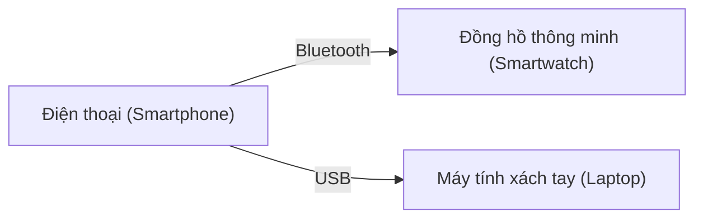

### 1.3.2 LAN (Local Area Network - Mạng cục bộ)

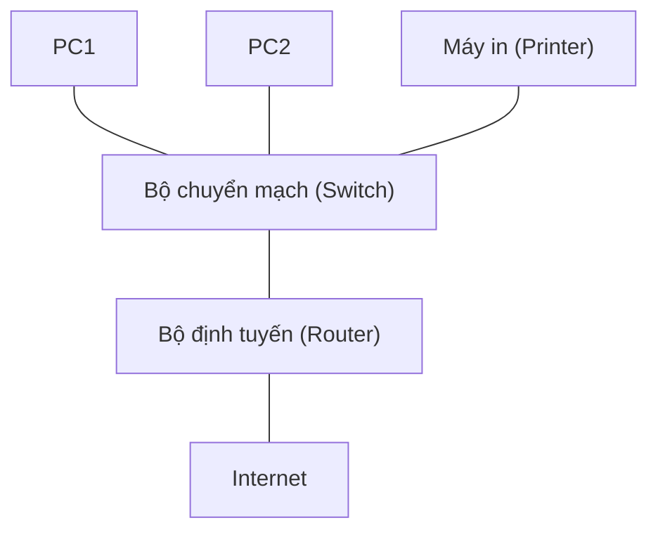

### 1.3.3 MAN (Metropolitan Area Network - Mạng đô thị)

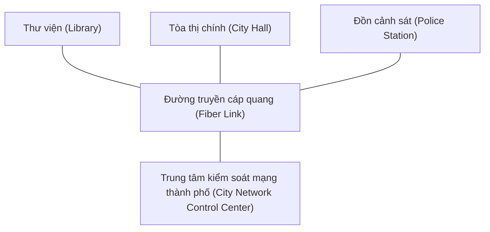

### 1.3.4 WAN (Wide Area Network - Mạng diện rộng)

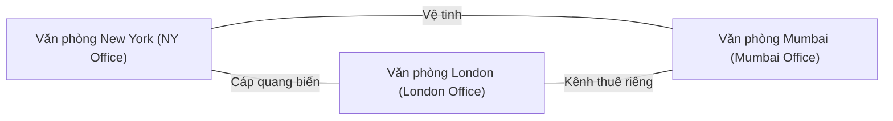

### 1.3.5 WLAN (Wireless Local Area Network - Mạng cục bộ không dây)

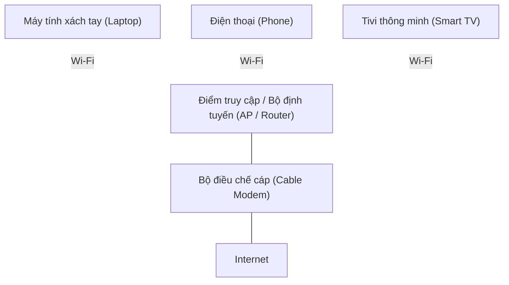

---

## 1.4 Sơ đồ cấu trúc mạng (Network Topologies)

### 1.4.1 Cấu trúc hình tuyến (Bus Topology)

Tất cả các thiết bị dùng chung một sợi cáp trung tâm duy nhất (đường trục - bus). Dữ liệu được truyền đi theo cả hai hướng; mọi thiết bị đều có thể nhìn thấy dữ liệu trôi qua, nhưng chỉ thiết bị đích được chỉ định mới thực hiện tiếp nhận thông tin đó.

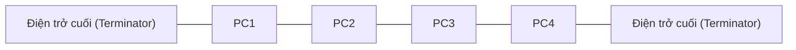

- **Ưu điểm:** Giá thành rẻ, dễ dàng lắp đặt thiết lập ban đầu, tốn rất ít dây cáp truyền dẫn.
- **Nhược điểm:** Nếu sợi cáp trung tâm bị đứt ở bất kỳ điểm nào, toàn bộ hệ thống mạng sẽ bị tê liệt hoàn toàn. Chỉ có duy nhất một thiết bị được phép gửi dữ liệu tại một thời điểm.
- **Ví dụ thực tế:** Các mạng Ethernet thế hệ rất cũ – hiện nay hầu như không còn được sử dụng.

### 1.4.2 Cấu trúc hình sao (Star Topology)

Mọi thiết bị trong mạng đều được kết nối trực tiếp vào một thiết bị trung tâm (thường là bộ chuyển mạch - switch hoặc bộ tập trung - hub). Tất cả các thông điệp trao đổi bắt buộc phải đi qua thiết bị trung tâm này.

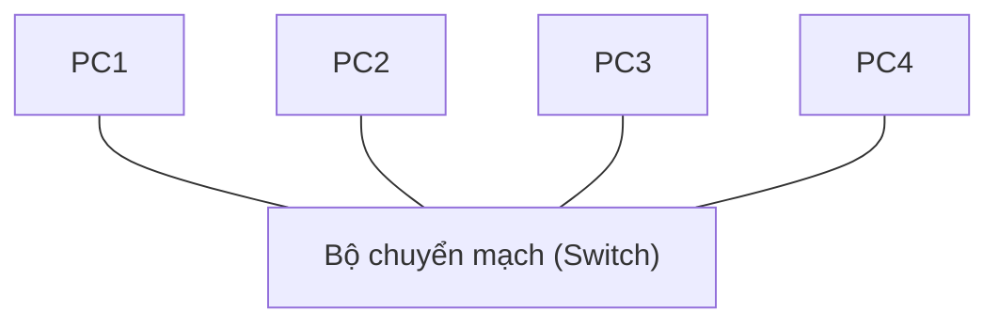

- **Ưu điểm:** Nếu sợi cáp của một máy tính bị hỏng, chỉ máy tính đó bị mất kết nối, các thiết bị khác vẫn hoạt động bình thường. Dễ dàng thêm bớt thiết bị mới và khoanh vùng xác định sự cố.
- **Nhược điểm:** Thiết bị trung tâm (switch/hub) là điểm yếu cốt tử – nếu thiết bị này bị hỏng, toàn bộ mạng sẽ bị sập hoàn toàn. Tốn nhiều cáp kết nối hơn so với cấu trúc hình bus.
- **Ví dụ thực tế:** Hầu hết các mạng gia đình và văn phòng hiện nay (sử dụng switch Ethernet hoặc điểm truy cập Wi‑Fi).

### 1.4.3 Cấu trúc hình vòng (Ring Topology)

Các thiết bị được kết nối tuần tuân tạo thành một vòng khép kín. Dữ liệu di chuyển theo một hướng cố định (hoặc cả hai hướng trong một số mạng vòng kép) từ thiết bị này sang thiết bị khác tiếp theo.

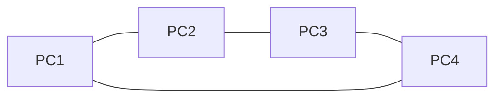

- **Ưu điểm:** Truyền dữ liệu có trật tự và tuần tự (không xảy ra xung đột/va chạm gói tin). Mỗi thiết bị đóng vai trò như một bộ lặp (repeater) giúp khuếch đại tín hiệu để truyền đi khoảng cách xa hơn.
- **Nhược điểm:** Nếu vòng truyền bị đứt hoặc một thiết bị trong vòng bị hỏng, toàn bộ mạng sẽ bị ngắt kết nối (ngoại trừ khi sử dụng cấu trúc vòng kép dự phòng).
- **Ví dụ thực tế:** Các mạng Token Ring cổ điển của IBM, hoặc một số vòng cáp quang đường dài (SONET).

### 1.4.4 Cấu trúc dạng lưới (Mesh Topology)

Mỗi thiết bị đều có đường kết nối vật lý trực tiếp đến tất cả các thiết bị còn lại trong mạng. Điều này tạo ra rất nhiều đường truyền dự phòng song song.

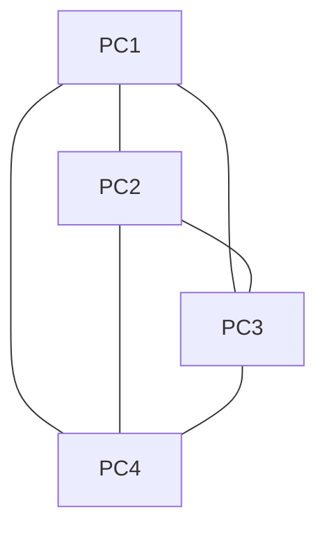

- **Ưu điểm:** Độ tin cậy cực kỳ cao – nếu một vài đường truyền bị đứt, dữ liệu vẫn dễ dàng đi vòng qua các ngả khác để đến đích. Không có điểm lỗi duy nhất (no single point of failure).
- **Nhược điểm:** Rất tốn kém chi phí mua dây cáp và trang bị cổng kết nối. Cấu hình thiết lập vô cùng phức tạp.
- **Ví dụ thực tế:** Mạng xương sống Internet toàn cầu (Internet backbone), mạng truyền thông quân sự, các trung tâm dữ liệu cực lớn.

### 1.4.5 Cấu trúc hỗn hợp (Hybrid Topology)

Sự kết hợp từ hai hoặc nhiều cấu trúc mạng cơ bản kể trên với nhau (ví dụ: các mạng hình sao được liên kết lại với nhau thông qua một đường cáp trục hình bus).

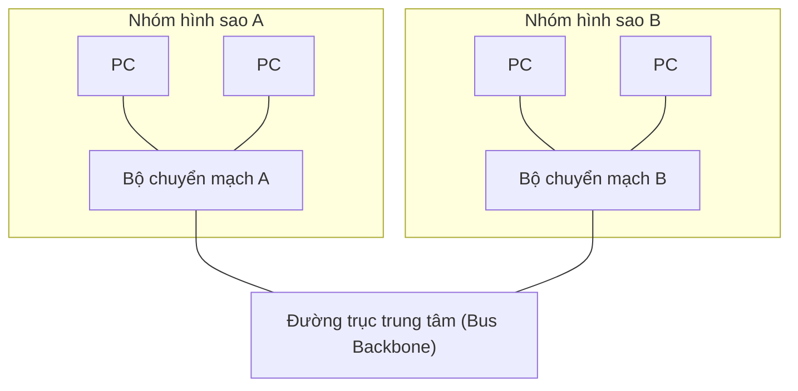

- **Ưu điểm:** Cực kỳ linh hoạt, dễ dàng mở rộng và tùy biến thiết kế theo nhu cầu thực tế của từng khu vực.
- **Nhược điểm:** Phức tạp trong thiết kế, chi phí cao và khó khăn hơn khi tiến hành sửa lỗi sự cố.
- **Ví dụ thực tế:** Mạng của các doanh nghiệp lớn (mỗi phòng ban được thiết kế theo dạng hình sao, sau đó liên kết với nhau bằng đường trục bus hoặc ring).

---

## 1.5 Các mô hình mạng (Network Models)

### 1.5.1 Mô hình Khách - Chủ (Client‑Server Model)

- **Máy chủ (Server)** – Một máy tính có cấu hình mạnh mẽ (hoặc phần mềm chuyên dụng) chạy liên tục để cung cấp dịch vụ, lưu trữ dữ liệu.
- **Máy khách (Client)** – Bất kỳ thiết bị đầu cuối nào gửi yêu cầu đến máy chủ để sử dụng dịch vụ.

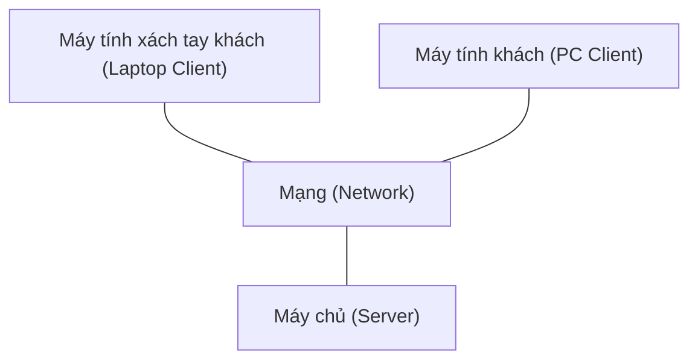

**Cơ chế hoạt động:**  
Máy khách gửi một yêu cầu dữ liệu (ví dụ: "hãy cho tôi xem tệp tài liệu này"). Máy chủ tiếp nhận, xử lý yêu cầu và gửi trả lại kết quả phản hồi cho máy khách.

**Ví dụ thực tế:** Duyệt web (web server phục vụ trình duyệt), gửi/nhận email, hệ thống ngân hàng trực tuyến.

**Ưu điểm:** Quản lý tài nguyên tập trung dễ dàng, kiểm soát quyền truy cập chặt chẽ bảo mật tốt, tận dụng sức mạnh xử lý của các máy chủ lớn.  
**Nhược điểm:** Máy chủ là điểm yếu duy nhất (nếu sập máy chủ, dịch vụ dừng hoạt động); chi phí thiết lập và vận hành máy chủ đắt đỏ; cần quản trị viên chuyên nghiệp vận hành.

### 1.5.2 Mô hình Ngang hàng (Peer‑to‑Peer - P2P Model)

Mọi máy tính (các nút mạng - peer) trong mạng đều bình đẳng như nhau. Mỗi máy vừa có thể đóng vai trò là máy khách (khi đi yêu cầu tải file) vừa là máy chủ (khi chia sẻ file cho máy khác tải). Không cần máy chủ trung tâm quản trị.

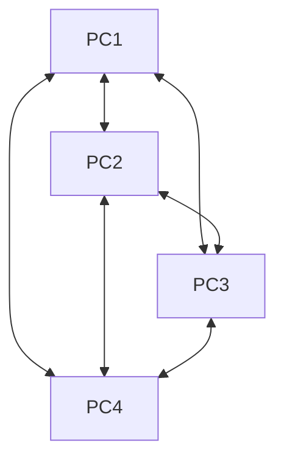

(Các mũi tên hai chiều thể hiện việc bất kỳ hai nút mạng nào cũng có thể truyền thông tin trực tiếp với nhau.)

**Ví dụ thực tế:** Hệ thống chia sẻ tệp BitTorrent, mạng làm việc nhóm nhỏ trong gia đình hoặc văn phòng nhỏ.

**Ưu điểm:** Không tốn chi phí trang bị máy chủ đắt tiền, cực kỳ dễ cài đặt thiết lập, khả năng mở rộng tốt (càng nhiều người tham gia mạng càng truyền nhanh).  
**Nhược điểm:** Khó kiểm soát an ninh bảo mật, không có cơ chế sao lưu dữ liệu tập trung, hiệu năng của mạng phụ thuộc nhiều vào tốc độ của nút mạng chậm nhất.

### Bảng so sánh tổng hợp

| Đặc điểm | Mô hình Khách - Chủ (Client-Server) | Mô hình Ngang hàng (Peer-to-Peer) |
|---------|---------------|---------------|
| **Quản lý tập trung** | Có (quản lý hoàn toàn từ máy chủ) | Không có máy chủ quản lý |
| **Chi phí đầu tư** | Cao hơn (phải đầu tư phần cứng/phần mềm máy chủ) | Thấp hơn nhiều |
| **Tính bảo mật** | Tốt hơn (áp dụng các chính sách bảo mật tập trung) | Yếu hơn, dễ bị lây lan mã độc |
| **Độ tin cậy** | Có điểm lỗi duy nhất (sập máy chủ là ngắt dịch vụ) | Không lo sập mạng (nhưng các nút có thể rời mạng bất cứ lúc nào) |
| **Ví dụ điển hình** | Trang web, email, cơ sở dữ liệu lớn | BitTorrent, mạng chia sẻ file cục bộ |

---

## Tóm tắt chương

- Một **mạng máy tính** kết nối các thiết bị lại với nhau nhằm mục đích chia sẻ tài nguyên và hỗ trợ truyền thông liên lạc.
- Ba **tiêu chí** quan trọng để đánh giá chất lượng mạng là: hiệu năng, độ tin cậy và tính bảo mật.
- **Phân loại mạng** trải dài từ phạm vi cá nhân siêu nhỏ (PAN) cho đến toàn cầu (WAN); trong đó mạng cục bộ LAN và mạng không dây WLAN là phổ biến nhất.
- **Sơ đồ cấu trúc mạng** (Topology) mô tả cách bố trí các dây và thiết bị: Bus, Sao (Star), Vòng (Ring), Lưới (Mesh) và Hỗn hợp (Hybrid). Hiện nay, cấu trúc hình Sao là phổ biến nhất.
- **Mô hình kiến trúc mạng** gồm có Khách - Chủ (Client-Server - tập trung) hoặc Ngang hàng (Peer-to-Peer - phân tán). Mỗi mô hình đều có những điểm mạnh và hạn chế riêng.

Bây giờ bạn đã có một nền tảng kiến thức vững chắc về cách xây dựng cấu trúc mạng máy tính. Trong chương tiếp theo, chúng ta sẽ cùng khám phá cách dữ liệu thực sự được truyền tải qua các hệ thống mạng này thông qua việc phân chia các tầng (layer), các giao thức (protocol) và các loại địa chỉ.
