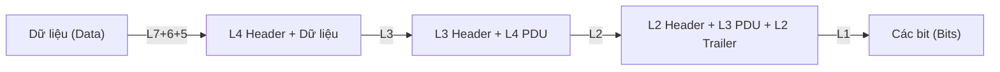
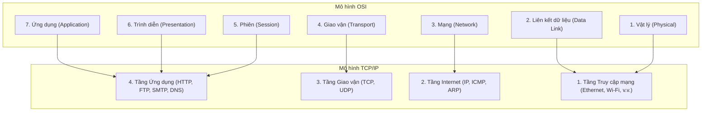
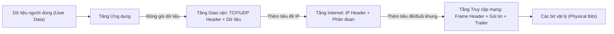

# Chương 2: Các mô hình mạng (OSI và TCP/IP) (Network Models)

Trong chương này, chúng ta sẽ tìm hiểu về hai mô hình vô cùng quan trọng giúp chúng ta hiểu rõ cách thức hoạt động của mạng máy tính: **Mô hình OSI** (OSI Model) và **Mô hình TCP/IP** (TCP/IP Model). Các mô hình này chia quá trình truyền thông mạng phức tạp thành các tầng (layer) nhỏ hơn, đơn giản hơn. Mỗi tầng đảm nhận một nhiệm vụ cụ thể. Chúng ta cũng sẽ tìm hiểu cách thức dữ liệu được bọc gói (đóng gói - encapsulation) và tháo gỡ bọc gói (giải đóng gói - decapsulation) khi di chuyển qua mạng.

---

## 2.1 Tại sao chúng ta cần các mô hình mạng?

Hãy tưởng tượng bạn đang gửi một bức thư tay. Bạn không chỉ đơn giản là ném tờ giấy đi – bạn phải bỏ tờ giấy vào trong một phong bì, viết địa chỉ người gửi/người nhận, dán tem, bỏ vào hòm thư, và dịch vụ bưu điện sẽ lo phần còn lại. Các mô hình mạng hoạt động theo cách tương tự: chúng chia toàn bộ công việc truyền tải dữ liệu thành các bước (tầng) riêng biệt. Mỗi tầng chỉ giao tiếp với các tầng nằm trực tiếp ngay trên và ngay dưới nó. Cách phân chia này giúp việc thiết kế mạng trở nên dễ dàng hơn rất nhiều, và những thay đổi ở một tầng sẽ không làm ảnh hưởng đến các tầng khác.

---

## 2.2 Mô hình OSI (Open Systems Interconnection)

Mô hình tham chiếu OSI bao gồm **7 tầng**. Đây là một mô hình lý thuyết được phát triển bởi Tổ chức Tiêu chuẩn hóa Quốc tế (ISO) nhằm giúp các nhà sản xuất và nhà phát triển thiết kế ra các sản phẩm mạng có khả năng tương tương thích và tương tác được với nhau (interoperable).

### 2.2.1 7 Tầng của mô hình OSI – Từ thấp đến cao

Chúng ta sẽ bắt đầu tìm hiểu từ tầng dưới cùng (nằm gần với phần cứng vật lý nhất) và di chuyển dần lên trên đến tầng ứng dụng (nằm gần với người dùng nhất).

| Lớp # | Tên lớp | Chức năng (diễn giải đơn giản) |
|---------|------------|----------------------------|
| 1 | Vật lý (Physical) | Truyền tải các bit thô (0 và 1) qua phương tiện vật lý (cáp, sóng vô tuyến, sợi quang). |
| 2 | Liên kết dữ liệu (Data Link) | Tổ chức các bit thành các khung dữ liệu (frame); xử lý định vị vật lý (địa chỉ MAC); phát hiện lỗi. |
| 3 | Mạng (Network) | Định tuyến các gói tin (packet) từ nguồn đến đích qua nhiều mạng khác nhau; sử dụng địa chỉ logic (địa chỉ IP). |
| 4 | Giao vận (Transport) | Cung cấp dịch vụ truyền dữ liệu tin cậy hoặc không tin cậy; phục hồi lỗi; kiểm soát luồng; sử dụng số hiệu cổng (port number). |
| 5 | Phiên (Session) | Quản lý các phiên làm việc (cuộc hội thoại) giữa các ứng dụng; thiết lập, duy trì và ngắt kết nối. |
| 6 | Trình diễn (Presentation) | Biên dịch định dạng dữ liệu (bao gồm mã hóa/giải mã, nén dữ liệu, mã hóa ký tự). |
| 7 | Ứng dụng (Application) | Cung cấp các dịch vụ mạng trực tiếp cho các ứng dụng của người dùng (ví dụ: trình duyệt web, phần mềm email). |

### 2.2.2 Chức năng chi tiết kèm ví dụ của từng lớp

#### Lớp 1 – Tầng Vật lý (Physical Layer)

- **Chức năng:** Chuyển đổi các bit dữ liệu thành các tín hiệu điện, xung ánh sáng hoặc sóng vô tuyến. Định nghĩa tiêu chuẩn về các loại cáp truyền dẫn, đầu nối đầu cắm, mức điện áp xung nhịp và tốc độ truyền dữ liệu.
- **Ví dụ về giao thức/công nghệ:** Cáp Ethernet (phần dây vật lý), USB, sóng Bluetooth, sợi cáp quang, đường truyền DSL.
- **So sánh thực tế:** Giống như làn đường giao thông hoặc đường ray tàu hỏa vật lý để các phương tiện (các bit) có thể di chuyển qua lại.

#### Lớp 2 – Tầng Liên kết dữ liệu (Data Link Layer)

- **Chức năng:** Gom các bit nhận được từ tầng vật lý thành các **khung dữ liệu (frame)**. Bổ sung thêm thông tin **địa chỉ MAC** (địa chỉ phần cứng vật lý) của máy gửi và máy nhận. Thực hiện phát hiện lỗi truyền dẫn (và sửa lỗi nếu có). Kiểm soát quyền truy cập vào phương tiện truyền dẫn dùng chung (ví dụ: cơ chế CSMA/CD của mạng cáp Ethernet).
- **Gồm hai phân lớp:** LLC (Logical Link Control - Điều khiển liên kết logic) và MAC (Media Access Control - Kiểm soát truy cập phương tiện).
- **Ví dụ:** Ethernet (chuẩn IEEE 802.3), Wi‑Fi (chuẩn IEEE 802.11), giao thức PPP (Point‑to‑Point Protocol).
- **So sánh thực tế:** Dịch vụ chuyển phát thư trong nội bộ một thành phố – nó biết cách giao một bức thư đến chính xác số nhà cụ thể (địa chỉ MAC) nằm trên con đường đó.

#### Lớp 3 – Tầng Mạng (Network Layer)

- **Chức năng:** Định tuyến hành trình cho các **gói tin (packet)** di chuyển qua nhiều mạng khác nhau. Sử dụng **địa chỉ IP** (địa chỉ logic) để tìm ra đường đi tối ưu nhất đến đích. Tiến hành phân mảnh (fragment) các gói tin quá lớn nếu cần thiết.
- **Ví dụ:** IP (giao thức Internet gồm IPv4 và IPv6), ICMP (dùng cho lệnh ping), các giao thức định tuyến RIP, OSPF.
- **So sánh thực tế:** Hệ thống đường cao tốc liên bang và bản đồ định vị GPS – giúp tìm ra lộ trình đi tốt nhất đi từ Hà Nội vào TP. Hồ Chí Minh chứ không chỉ loanh quanh trong một thành phố.

#### Lớp 4 – Tầng Giao vận (Transport Layer)

- **Chức năng:** Cung cấp dịch vụ truyền dữ liệu đầu-cuối (end-to-end) trực tiếp giữa các ứng dụng. Sử dụng **số hiệu cổng (port number)** (ví dụ: cổng 80 cho web thường HTTP, 443 cho web bảo mật HTTPS). Gồm hai giao thức chính:
  - **TCP** (Transmission Control Protocol) – Giao thức hướng kết nối, đảm bảo truyền tin cậy, có kiểm tra lỗi và giao dữ liệu đúng thứ tự.
  - **UDP** (User Datagram Protocol) – Giao thức không kết nối, truyền tốc độ cực nhanh nhưng không đảm bảo độ tin cậy (thích hợp cho truyền phát video trực tuyến, chơi game).
- **Ví dụ:** TCP, UDP, SCTP.
- **So sánh thực tế:** Dịch vụ chuyển phát thư bảo đảm có ký nhận và theo dõi hành trình gói hàng, gửi lại nếu bị thất lạc (TCP) so với gửi một tấm bưu thiếp thông thường có thể bị thất lạc dọc đường nhưng gửi đi rất nhanh (UDP).

#### Lớp 5 – Tầng Phiên (Session Layer)

- **Chức năng:** Thiết lập, quản lý và kết thúc các **phiên làm việc (session)** (cuộc hội thoại) giữa các ứng dụng chạy trên các máy tính khác nhau. Kiểm soát quyền nói của từng bên trong cuộc hội thoại (kiểm soát đối thoại). Bổ sung các điểm kiểm tra (checkpoint) vào quá trình truyền các tệp dữ liệu lớn (để nếu bị ngắt kết nối giữa chừng, hệ thống có thể truyền tiếp từ điểm kiểm tra gần nhất thay vì truyền lại từ đầu).
- **Ví dụ:** NetBIOS, RPC (Gọi thủ tục từ xa), PPTP (giao thức điều khiển kết nối VPN).
- **So sánh thực tế:** Một người chủ trì cuộc họp đứng ra điều phối để quyết định khi nào thì cuộc họp bắt đầu/kết thúc và ai là người được phép phát biểu tại từng thời điểm.

#### Lớp 6 – Tầng Trình diễn (Presentation Layer)

- **Chức năng:** Biên dịch dữ liệu qua lại giữa định dạng của ứng dụng sử dụng và định dạng chuẩn của mạng. Đảm nhận việc **mã hóa/giải mã (encryption/decryption)** bảo mật, **nén dữ liệu (compression)** để truyền nhanh hơn, và chuyển đổi **bảng mã ký tự** (ví dụ: ASCII, UTF‑8, EBCDIC).
- **Ví dụ:** SSL/TLS (giao thức bảo mật mật mã – dù trên thực tế thường được tích hợp ở tầng phiên hoặc giao vận), định dạng ảnh JPEG, GIF, bảng mã ASCII, EBCDIC.
- **So sánh thực tế:** Một thông dịch viên thực hiện dịch ngôn ngữ từ tiếng Anh sang tiếng Pháp và đồng thời mã hóa nội dung đó thành một mật thư bảo mật trước khi gửi đi.

#### Lớp 7 – Tầng Ứng dụng (Application Layer)

- **Chức năng:** Cung cấp các dịch vụ mạng trực tiếp cho các phần mềm ứng dụng của người dùng (ví dụ: trình duyệt web, phần mềm gửi nhận mail, công cụ truyền file). Đây là tầng tương tác trực tiếp gần nhất với người sử dụng.
- **Ví dụ:** HTTP (web), HTTPS, FTP (truyền file), SMTP (gửi email), POP3/IMAP (nhận email), DNS (hệ thống phân giải tên miền), Telnet, SSH.
- **So sánh thực tế:** Bản thân bức thư bạn viết – chính là nội dung thực tế của cuộc trao đổi thông tin.

---

## 2.3 Quá trình Đóng gói và Giải đóng gói (Encapsulation and Decapsulation)

Khi dữ liệu di chuyển từ máy gửi đến máy nhận, mỗi tầng ở phía gửi sẽ thêm vào một thông tin **tiêu đề (header)** (và đôi khi là một đuôi trailer). Quá trình này được gọi là **đóng gói (encapsulation)**. Ở phía nhận, quá trình diễn ra ngược lại, mỗi tầng sẽ bóc tách và loại bỏ phần tiêu đề tương ứng của nó – gọi là **giải đóng gói (decapsulation)**.

**Sơ đồ tóm tắt:**

### Ví dụ thực tế: Gửi dòng chữ “Hello” qua giao thức HTTP

1. **Tầng Ứng dụng (HTTP)** – Từ "Hello" là dữ liệu gốc của người dùng.
2. **Tầng Trình diễn** – Có thể thực hiện nén hoặc mã hóa dữ liệu này (nội dung vẫn là "Hello").
3. **Tầng Phiên** – Thêm định danh phiên làm việc (ví dụ: "session 123").
4. **Tầng Giao vận (TCP)** – Bổ sung thêm cổng nguồn (ví dụ: 5000) và cổng đích (80). Tạo thành một phân đoạn TCP segment.
5. **Tầng Mạng (IP)** – Bổ sung thêm địa chỉ IP nguồn (192.168.1.2) và địa chỉ IP đích (8.8.8.8). Tạo thành một gói tin IP packet.
6. **Tầng Liên kết dữ liệu (Ethernet)** – Bổ sung địa chỉ MAC nguồn (AA:BB:CC:DD:EE:FF) và địa chỉ MAC đích (địa chỉ của bộ định tuyến chặng tiếp theo). Đồng thời thêm phần đuôi trailer chứa mã kiểm tra lỗi (FCS). Tạo thành một khung dữ liệu Ethernet frame.
7. **Tầng Vật lý** – Chuyển đổi toàn bộ khung dữ liệu thành các bit 0 và 1 thô, truyền đi dưới dạng các xung tín hiệu điện/ánh sáng.

Tại máy nhận, quá trình diễn ra ngược lại: mỗi tầng sẽ bóc phần tiêu đề thuộc phạm vi của nó rồi chuyển tiếp phần dữ liệu còn lại lên tầng phía trên.

---

## 2.4 Các giao thức tại mỗi tầng của mô hình OSI

Dưới đây là bảng tổng hợp các giao thức và công nghệ phổ biến tương ứng với từng tầng trong mô hình tham chiếu OSI (một số giao thức có thể mở rộng ranh giới qua nhiều tầng, nhưng cách phân chia dưới đây là phổ biến nhất):

| Lớp OSI | Các giao thức / Công nghệ điển hình |
|-----------|----------------------------------|
| 7 – Ứng dụng (Application) | HTTP, HTTPS, FTP, SMTP, POP3, IMAP, DNS, SSH, Telnet, SNMP |
| 6 – Trình diễn (Presentation) | SSL/TLS (thường được xếp ở đây), JPEG, MPEG, ASCII, EBCDIC |
| 5 – Phiên (Session) | NetBIOS, RPC, PPTP, SMB (một phần thuộc lớp phiên) |
| 4 – Giao vận (Transport) | TCP, UDP, SCTP, DCCP |
| 3 – Mạng (Network) | IPv4, IPv6, ICMP, IGMP, ARP (thường được xếp giữa L2/L3), OSPF, RIP |
| 2 – Liên kết dữ liệu (Data Link) | Ethernet (802.3), Wi‑Fi (802.11), PPP, HDLC, Frame Relay, Token Ring |
| 1 – Vật lý (Physical) | Ethernet (cáp truyền dẫn, bộ lặp repeater), DSL, SONET/SDH, Bluetooth, USB |

---

## 2.5 Mô hình TCP/IP (TCP/IP Model)

Mô hình TCP/IP là một mô hình thực tiễn, đơn giản hơn và được sử dụng làm nền tảng hoạt động chính cho mạng Internet ngày nay. Mô hình này gồm **4 tầng** (đôi khi được chia thành 5 tầng tùy thuộc vào cách đếm). Mô hình ban đầu được phát triển bởi Bộ Quốc phòng Hoa Kỳ (dùng trong mạng ARPANET).

### Ánh xạ giữa mô hình TCP/IP và mô hình tham chiếu OSI

### 2.5.1 Chức năng của từng tầng trong mô hình TCP/IP

| Tầng TCP/IP | Chức năng chính | Các lớp OSI tương đương | Các giao thức điển hình |
|--------------|----------|----------------------|-------------------|
| **Ứng dụng** (Application) | Cung cấp các dịch vụ mạng trực tiếp cho ứng dụng người dùng. Gộp các lớp 5, 6, 7 của OSI lại. | Ứng dụng, Trình diễn, Phiên | HTTP, HTTPS, FTP, SMTP, DNS, SSH |
| **Giao vận** (Transport) | Đảm bảo tính tin cậy đầu-cuối, kiểm soát luồng, ghép kênh (sử dụng số hiệu cổng port). | Giao vận | TCP, UDP |
| **Internet** | Định tuyến các gói tin qua các mạng khác nhau, sử dụng định danh logic (IP). | Mạng | IPv4, IPv6, ICMP, ARP (đôi khi được xếp ở đây) |
| **Truy cập mạng** (Network Access - hoặc tầng Liên kết) | Gửi các khung dữ liệu (frame) qua phương tiện vật lý, định vị địa chỉ phần cứng. | Liên kết dữ liệu + Vật lý | Ethernet, Wi‑Fi, PPP, DSL |

### 2.5.2 Quá trình đóng gói dữ liệu trong mô hình TCP/IP

Quy trình đóng gói tương tự như trong mô hình OSI nhưng được rút gọn qua 4 tầng chính:

### 2.5.3 Bảng so sánh tổng hợp: OSI với TCP/IP

| Đặc điểm | Mô hình OSI | Mô hình TCP/IP |
|---------|-----------|---------------|
| **Số lượng tầng** | 7 tầng | 4 tầng (hoặc 5 tầng nếu tách riêng tầng vật lý) |
| **Phát triển bởi** | ISO (Tổ chức Tiêu chuẩn hóa Quốc tế) | DARPA (Bộ Quốc phòng Hoa Kỳ) |
| **Tính chất lý thuyết / thực tiễn** | Thuần lý thuyết (mô hình tham chiếu) | Mang tính thực tiễn cao (sử dụng thực tế trên Internet) |
| **Lớp Phiên & Trình diễn** | Tách biệt thành các lớp riêng | Được tích hợp gộp vào trong lớp Ứng dụng |
| **Lớp Vật lý & Liên kết dữ liệu** | Tách biệt thành các lớp riêng | Được gộp chung lại thành tầng Truy cập mạng |
| **Sự phụ thuộc giao thức** | Độc lập không phụ thuộc vào giao thức cụ thể | Được thiết kế tối ưu xoay quanh bộ giao thức TCP và IP |
| **Mức độ phổ biến** | Chủ yếu dùng trong giảng dạy và viết tài liệu kỹ thuật | Sử dụng trực tiếp trên mọi thiết bị và hệ thống mạng thực tế |

---

## 2.6 Tại sao cả hai mô hình vẫn cực kỳ quan trọng ngày nay?

- **Mô hình OSI** là công cụ đắc lực giúp bạn **thấu hiểu** sâu sắc chức năng mạng theo từng lớp rõ ràng. Đây là mô hình giảng dạy cực kỳ tốt giúp đơn giản hóa việc học tập thiết kế hệ thống và định vị, sửa lỗi sự cố mạng.
- **Mô hình TCP/IP** là mô hình **vận hành thực tế** của toàn bộ mạng Internet toàn cầu. Khi bạn truy cập một trang web, gửi email, hay xem video trực tuyến, bạn đang trực tiếp sử dụng bộ giao thức TCP/IP.

Khi các kỹ sư mạng trao đổi về "thiết bị chuyển mạch Lớp 2" (Layer 2 switch) hay "bộ định tuyến Lớp 3" (Layer 3 router), họ đang dùng hệ quy chiếu các lớp của mô hình OSI (Data Link và Network). Tương tự, khái niệm "TCP port 80" xuất phát trực tiếp từ tầng Giao vận trong mô hình TCP/IP.

---

## Tóm tắt chương

- **Mô hình tham chiếu OSI** gồm 7 tầng: Vật lý, Liên kết dữ liệu, Mạng, Giao vận, Phiên, Trình diễn, Ứng dụng.
- Mỗi tầng đảm nhiệm một công việc chuyên biệt và vận hành các giao thức tương ứng.
- **Quá trình đóng gói (Encapsulation)** thêm các phần tiêu đề header tại mỗi tầng ở phía gửi; **quá trình giải đóng gói (Decapsulation)** gỡ bỏ chúng tại phía nhận.
- **Mô hình TCP/IP** gồm 4 tầng: Truy cập mạng, Internet, Giao vận, Ứng dụng. Đây là mô hình chuẩn thực tế chạy mạng Internet ngày nay.
- Cả hai mô hình đều là những nền tảng quan trọng giúp chúng ta thiết kế, thấu hiểu cấu trúc và xử lý sự cố trong mạng máy tính.

Trong chương tiếp theo, chúng ta sẽ đi sâu vào chi tiết của **Tầng Vật lý (Physical Layer)**: tìm hiểu các loại dây cáp truyền dẫn, các loại đầu kết nối, cách mã hóa tín hiệu và cách thức các bit thực sự di chuyển trên đường truyền vật lý.
