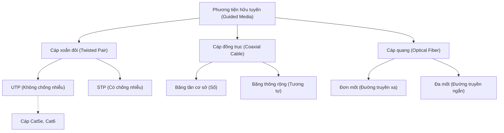
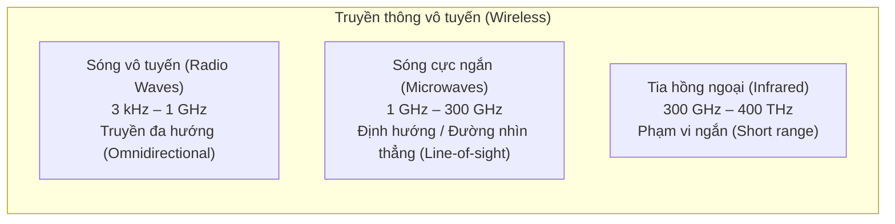
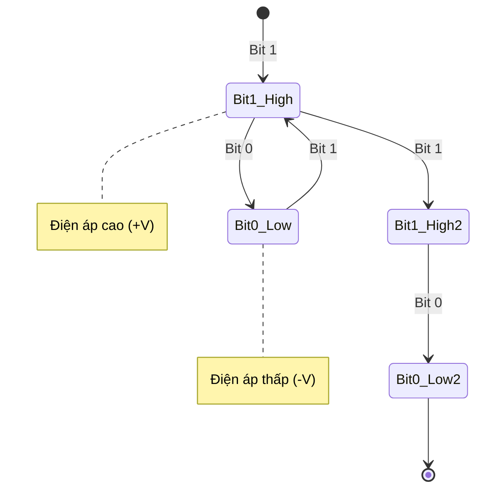
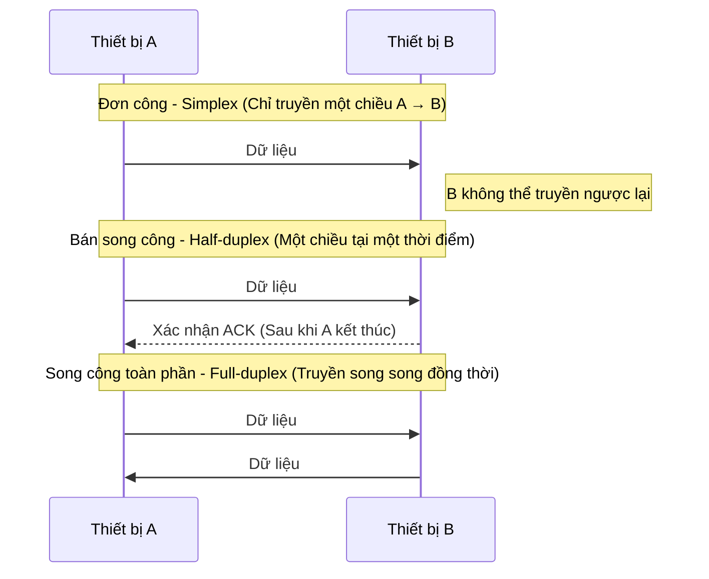
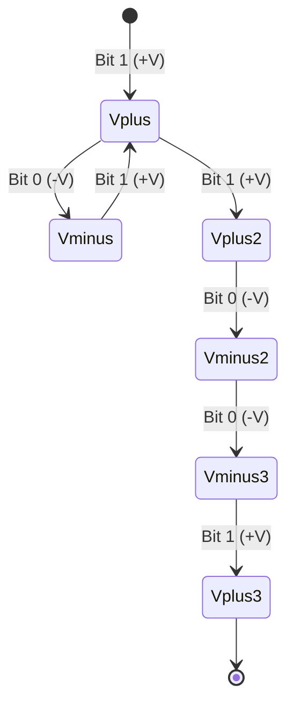
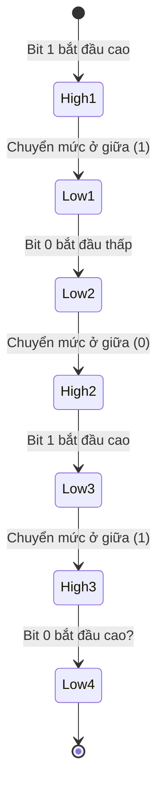
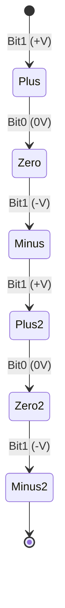
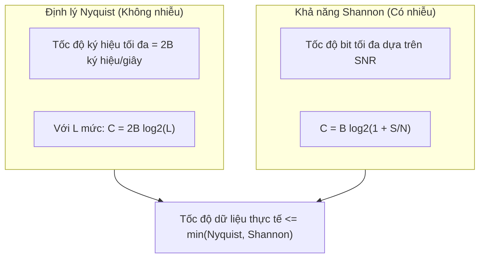

# Chương 3: Tầng Vật lý (Physical Layer)

## 1. Phương tiện truyền dẫn (Transmission Media)

### 1.1 Phương tiện truyền dẫn hữu tuyến (Guided Media / Wired)



### 1.2 Phương tiện truyền dẫn vô tuyến (Unguided Media / Wireless)



---

## 2. Các dạng tín hiệu: Tương tự và Số (Analog vs Digital)

**Tín hiệu Số (Digital Signal):** Là một dạng tín hiệu rời rạc biểu diễn dữ liệu bằng các giá trị cụ thể, thông thường dưới dạng nhị phân (0 và 1). Nó thay đổi trạng thái theo các bước (rời rạc) thay vì liên tục. Tín hiệu số ít bị ảnh hưởng bởi nhiễu hơn, dễ dàng lưu trữ, xử lý, truyền tải hơn và được sử dụng rộng rãi trong máy tính và các hệ thống truyền thông hiện đại.

*Biểu diễn tín hiệu số bằng sơ đồ trạng thái (state diagram)* – mỗi trạng thái tương ứng với một mức điện áp trong một khoảng thời gian truyền bit:



**Tín hiệu Tương tự (Analog Signal):** Là dạng tín hiệu liên tục biến đổi mượt mà theo thời gian. Nó có thể nhận vô số giá trị trong một phạm vi nhất định. Các tín hiệu này biểu diễn các đại lượng vật lý trong thế giới thực như âm thanh, nhiệt độ và ánh sáng. Tuy nhiên, tín hiệu tương tự dễ bị nhiễu và méo mó hơn trong quá trình truyền dẫn qua khoảng cách xa.

---

## 3. Các chế độ truyền dẫn (Transmission Modes)



---

## 4. Kỹ thuật mã hóa đường truyền (Line Coding Techniques)

Thay vì sử dụng sơ đồ `gantt`, chúng ta sử dụng **sơ đồ trạng thái** (state diagram) để biểu thị trực quan các mức điện áp biến đổi theo thời gian.

### 4.1 Mã NRZ‑L (Non‑Return to Zero, Level)

Chuỗi bit truyền: `1 0 1 1 0 0 1`  
Quy ước điện áp: `+V` cho bit 1, `-V` cho bit 0.



### 4.2 Mã hóa Manchester (Manchester Coding - Chuẩn IEEE 802.3)

Mỗi bit truyền luôn có một sự chuyển đổi mức điện áp ở chính giữa chu kỳ truyền bit:  
- Bit `1` = Chuyển từ mức Cao sang mức Thấp (high → low).  
- Bit `0` = Chuyển từ mức Thấp sang mức Cao (low → high).

Chuỗi bit truyền: `1 0 1 0`



*Cách diễn giải đơn giản hơn* – sử dụng bảng:

| Bit truyền | Mức điện áp lúc bắt đầu | Chuyển đổi ở giữa chu kỳ | Mức điện áp lúc kết thúc |
|-----|-------------|----------------|-----------|
| **1**   | Cao (High)  | → Thấp (Low)   | Thấp (Low) |
| **0**   | Thấp (Low)  | → Cao (High)   | Cao (High) |
| **1**   | Cao (High)  | → Thấp (Low)   | Thấp (Low) |
| **0**   | Thấp (Low)  | → Cao (High)   | Cao (High) |

### 4.3 Mã hóa lưỡng cực đảo cực AMI (Bipolar Alternate Mark Inversion)

- Bit `0` → Mức điện áp trung tính (0V).  
- Bit `1` → Đảo dấu luân phiên giữa mức điện áp cực dương (+V) và cực âm (-V).

Chuỗi bit truyền: `1 0 1 1 0 1`



---

## 5. Khái niệm tốc độ truyền dữ liệu (Data Rate Concepts)

### 5.1 Định lý định mức giới hạn Nyquist (Cho kênh truyền không có nhiễu)

Công thức tính toán:

```text
C = 2B log2(L)  | Trong đó: B = Băng thông (Bandwidth), L = Số mức tín hiệu (L), C = Dung lượng kênh truyền (Capacity)
```

### 5.2 Định luật Shannon (Cho kênh truyền có nhiễu)

Công thức tính toán:

```text
C = B log2(1 + S/N) | Trong đó: C = Dung lượng (Capacity), B = Băng thông, S/N = Tỷ số tín hiệu trên nhiễu (SNR)
```

**Sơ đồ mối quan hệ** – biểu diễn bằng sơ đồ khối:



**Nhận thức mấu chốt:**  
- Định lý Nyquist cho biết bạn có thể gửi bao nhiêu ký hiệu (symbol) trong một giây khi không có nhiễu.  
- Định luật Shannon giới hạn thực tế số lượng bit tối đa bạn có thể mã hóa trên mỗi ký hiệu khi có nhiễu.  

**Ví dụ thực tế:** Đường dây điện thoại thông thường có băng thông $B = 3.1\text{ kHz}$, tỷ số truyền tín hiệu trên nhiễu $SNR = 30\text{ dB}$ (tương ứng tỷ số công suất $S/N = 1000$):  
- Theo Shannon: $C \approx 3100 \times \log_2(1001) \approx 30.9\text{ kbps}$.  
- Theo Nyquist khi sử dụng $L=4$ mức tín hiệu ($2\text{ bit/ký hiệu}$): $C = 2 \times 3100 \times 2 = 12.4\text{ kbps}$.  
$\rightarrow$ Kênh truyền này bị giới hạn bởi Nyquist nếu bạn chỉ sử dụng 4 mức tín hiệu. Khi có tỷ số SNR tốt hơn, bạn có thể tăng số lượng mức tín hiệu $L$, nhưng nhiễu vật lý sẽ giới hạn mức tối đa của $L$ ở giá trị $\sqrt{1 + S/N} \approx 31.6$. Khi đó tốc độ giới hạn Nyquist đạt $C \approx 2 \times 3100 \times \log_2(31.6) \approx 30.9\text{ kbps}$ – trùng với giới hạn Shannon.

---

## Bảng tổng hợp

| Khái niệm | Công thức toán học | Yếu tố giới hạn |
|---------|---------|----------------|
| **Định lý Nyquist** | $C = 2B \log_2(L)$ | Băng thông và số lượng mức tín hiệu |
| **Định luật Shannon** | $C = B \log_2(1 + S/N)$ | Băng thông và tỷ số nhiễu SNR |

---
