# Chương 4: Tầng Liên kết dữ liệu (Data Link Layer)

Tầng Liên kết dữ liệu là Lớp 2 trong mô hình tham chiếu OSI. Nhiệm vụ cốt lõi của nó là truyền tải dữ liệu một cách tin cậy trực tiếp giữa hai nút mạng (node) kết nối vật lý với nhau. Chương này sẽ trình bày tất cả các chức năng thiết yếu, các kỹ thuật phát hiện lỗi, các giao thức kiểm soát luồng và kiểm soát lỗi, cũng như phân lớp kiểm soát truy cập môi trường truyền dẫn (MAC sub-layer).

---

## 4.1 Các chức năng của Tầng Liên kết dữ liệu

Tầng Liên kết dữ liệu đảm nhận bốn nhiệm vụ chính:

1. **Phân khung dữ liệu (Framing)** – Nhận các chuỗi bit thô từ tầng vật lý và đóng gói chúng thành các **khung dữ liệu (frame)** (tương tự như bỏ bức thư viết tay vào phong bì thư). Mỗi khung dữ liệu sẽ bao gồm phần tiêu đề (header), phần dữ liệu có ích (payload) và phần đuôi (trailer).

2. **Phát hiện và sửa lỗi (Error detection and correction)** – Kiểm tra xem các bit dữ liệu có bị biến đổi, đảo lộn (lỗi bit) trong quá trình truyền dẫn vật lý hay không. Nó có khả năng phát hiện lỗi và trong một số trường hợp có thể tự sửa lỗi trực tiếp mà không cần yêu cầu truyền lại.

3. **Kiểm soát luồng (Flow control)** – Ngăn chặn tình trạng bên gửi có tốc độ truyền nhanh làm tràn ngập bộ nhớ đệm của bên nhận có tốc độ xử lý chậm hơn. Phía nhận sẽ thông báo cho phía gửi khi nào nó sẵn sàng tiếp nhận thêm dữ liệu mới.

4. **Kiểm soát truy cập (Access control)** – Khi có nhiều thiết bị dùng chung một phương tiện truyền dẫn vật lý (ví dụ mạng không dây Wi‑Fi hoặc cáp mạng Ethernet dùng chung), tầng này sẽ quyết định thiết bị nào được phép truyền dữ liệu tại từng thời điểm cụ thể để tránh xung đột.

**Sơ đồ minh họa vai trò của Tầng Liên kết dữ liệu:**

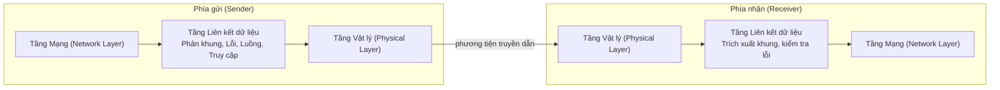

---

## 4.2 Kỹ thuật phát hiện lỗi (Error Detection)

Trong quá trình truyền dữ liệu qua môi trường vật lý, các yếu tố nhiễu có thể làm đảo ngược giá trị các bit (lỗi bit). Các phương pháp dưới đây giúp phát hiện lỗi. Nếu phát hiện ra lỗi, bên nhận sẽ yêu cầu bên gửi truyền lại gói dữ liệu bị lỗi đó.

### 4.2.1 Kiểm tra chẵn lẻ (Parity Check)

Một bit phụ (gọi là bit chẵn lẻ - parity bit) được thêm vào chuỗi dữ liệu gốc sao cho tổng số lượng bit 1 trong chuỗi truyền đi là số chẵn (kiểm tra chẵn - even parity) hoặc số lẻ (kiểm tra lẻ - odd parity).

**Ví dụ:** Gửi chuỗi dữ liệu `1011010` sử dụng kiểm tra chẵn (even parity).  
Số lượng bit 1 hiện tại = 4 (đã là số chẵn) $\rightarrow$ đặt bit chẵn lẻ = 0 $\rightarrow$ khung dữ liệu truyền đi hoàn chỉnh = `10110100`.

Nếu có một bit duy nhất bị đảo giá trị trong quá trình truyền, phía nhận sẽ đếm và phát hiện ra số lượng bit 1 là số lẻ, từ đó xác nhận dữ liệu đã bị lỗi.

**Hạn chế:** Không thể phát hiện nếu có cùng lúc hai bit bị lỗi (vì hai lỗi bit sẽ triệt tiêu hiệu ứng đếm chẵn lẻ của nhau).

**Sơ đồ minh họa:**

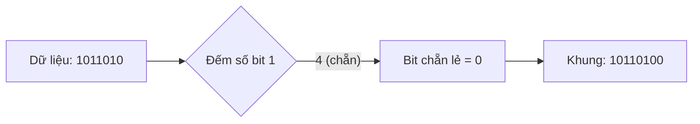

### 4.2.2 Mã kiểm tổng (Checksum)

Phương pháp này được sử dụng phổ biến trong các giao thức như TCP/IP và UDP. Dữ liệu cần gửi đi được chia nhỏ thành các phân đoạn có kích thước cố định. Tất cả các đoạn này được cộng lại với nhau sử dụng phép toán bù một (one’s complement arithmetic). Tổng cuối cùng sau đó được lấy bù (đảo bit) để tạo ra mã kiểm tổng (checksum).

**Ví dụ** (mô phỏng đơn giản): Dữ liệu truyền = `01001100 01101010` (gồm hai đoạn 8-bit).  
Tiến hành cộng: `01001100 + 01101010 = 10110110`. Lấy bù một của tổng này = `01001001` (đây chính là mã checksum).  
Phía nhận sẽ cộng tất cả các đoạn dữ liệu nhận được cùng với mã checksum. Nếu kết quả thu được là chuỗi toàn bit 1 (`11111111`), dữ liệu được xác nhận là chính xác.

**Sơ đồ minh họa:**

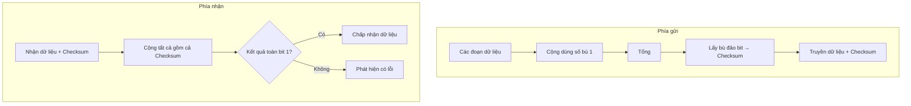

### 4.2.3 Kiểm tra dư thừa vòng (Cyclic Redundancy Check - CRC)

CRC là kỹ thuật phát hiện lỗi mạnh mẽ và hiệu quả nhất, được sử dụng rộng rãi trong mạng Ethernet, Wi‑Fi và các hệ thống lưu trữ dữ liệu. Phương pháp này coi chuỗi dữ liệu gốc như một số nhị phân lớn và tiến hành thực hiện phép chia cho một số chia cố định (gọi là đa thức tạo - generator polynomial). Phần số dư của phép chia này chính là mã CRC.

**Ví dụ:** Dữ liệu gốc = `110101`, Đa thức tạo = `1011` (có độ dài 4 bit $\rightarrow$ mã CRC sẽ có độ dài là 3 bit, bằng độ dài đa thức tạo trừ 1).  
Thêm 3 bit 0 vào cuối chuỗi dữ liệu gốc $\rightarrow$ thu được `110101000`. Thực hiện phép chia nhị phân cho `1011` sử dụng phép toán XOR. Số dư thu được là `001` $\rightarrow$ khung dữ liệu truyền đi hoàn chỉnh = `110101001`.  
Phía nhận sẽ chia khung dữ liệu nhận được cho cùng đa thức tạo `1011`. Nếu số dư thu được bằng 0, dữ liệu được xác nhận không có lỗi.

**Các đa thức tạo phổ biến:**
- CRC‑16: `10001000000100001` (sử dụng trong công nghệ Bluetooth)
- CRC‑32: Sử dụng rộng rãi trong mạng Ethernet (kiểm tra 32‑bit)

**Sơ đồ minh họa:**

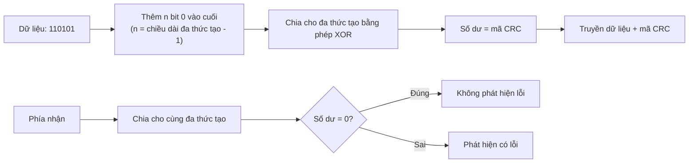

### 4.2.4 Mã Hamming (Hamming Code)

Mã Hamming không những có khả năng phát hiện lỗi mà còn có thể **tự động sửa** được các lỗi đơn bit (single‑bit error). Phương pháp này chèn thêm các bit chẵn lẻ (parity bits) vào các vị trí có chỉ số là lũy thừa của 2 (1, 2, 4, 8, ...). Mỗi bit chẵn lẻ sẽ đảm nhận việc kiểm tra một nhóm các bit dữ liệu cụ thể trong chuỗi.

**Ví dụ:** Gửi chuỗi dữ liệu 4-bit `1011` sử dụng mã Hamming(7,4).  
Các vị trí trong từ mã: 1(p1), 2(p2), 3(d1), 4(p3), 5(d2), 6(d3), 7(d4) với các bit dữ liệu gốc được xếp lần lượt là d1=1, d2=0, d3=1, d4=1.  
Tính toán giá trị các bit chẵn lẻ (parity bits):
- p1 bao phủ các vị trí 1, 3, 5, 7 $\rightarrow$ tương ứng các giá trị bit 1, 1, 0, 1 $\rightarrow$ đếm chẵn $\rightarrow$ đặt p1=1.
- p2 bao phủ các vị trí 2, 3, 6, 7 $\rightarrow$ tương ứng các bit 1, 1, 1, 1 $\rightarrow$ đếm chẵn $\rightarrow$ đặt p2=1.
- p3 bao phủ các vị trí 4, 5, 6, 7 $\rightarrow$ tương ứng các bit 1, 0, 1, 1 $\rightarrow$ đếm lẻ $\rightarrow$ đặt p3=0.  
Từ mã hoàn chỉnh được truyền đi: `1 1 1 0 0 1 1` (các vị trí từ 1 đến 7).

Nếu trong quá trình truyền, bit ở vị trí thứ 5 bị đảo giá trị thành 1, phía nhận khi tính toán lại các bit chẵn lẻ sẽ phát hiện ra sự không khớp. Bằng cách cộng các chỉ số của các bit chẵn lẻ bị lỗi, phía nhận sẽ xác định được chính xác vị trí bit lỗi là vị trí số 5 và chỉ cần đảo ngược giá trị bit này để khôi phục dữ liệu đúng.

**Sơ đồ minh họa:**

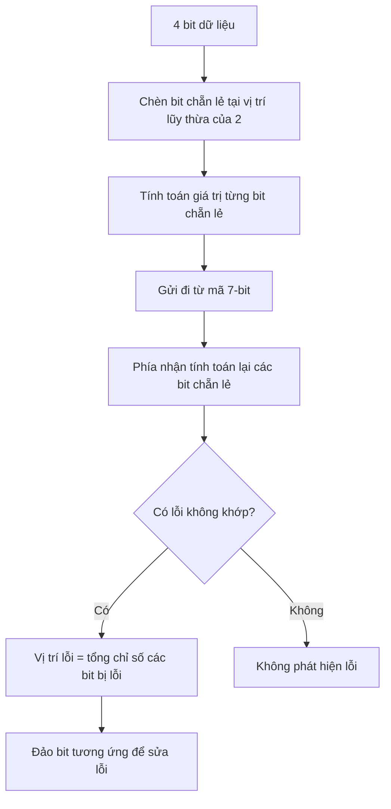

---

## 4.3 Các giao thức kiểm soát luồng và kiểm soát lỗi (Flow & Error Control Protocols)

Các giao thức này đảm bảo dữ liệu được truyền tải với tốc độ phù hợp giữa các thiết bị và các lỗi phát sinh được xử lý hiệu quả.

### 4.3.1 Phương thức Dừng và Chờ (Stop‑and‑Wait)

Phía gửi truyền đi một khung dữ liệu duy nhất và sau đó bắt buộc phải dừng lại để đợi thông điệp xác nhận tích cực (ACK) từ phía nhận trước khi được phép truyền khung tiếp theo. Nếu sau một khoảng thời gian chờ (timeout) quy định mà không nhận được ACK, phía gửi coi như gói tin bị thất lạc và tiến hành truyền lại khung dữ liệu đó.

**Ví dụ:** A gửi khung 1 $\rightarrow$ B tiếp nhận thành công $\rightarrow$ B gửi lại ACK $\rightarrow$ A tiếp tục gửi khung 2 $\rightarrow$ ...

**Hiệu năng sử dụng kênh truyền:** $\text{Hiệu năng} = \frac{\text{Thời gian truyền dẫn}}{\text{Thời gian truyền dẫn} + \text{Thời gian trễ khứ hồi (RTT)}}$. Phương thức này có hiệu suất cực kỳ kém đối với các đường truyền khoảng cách vật lý lớn.

**Sơ đồ minh họa:**

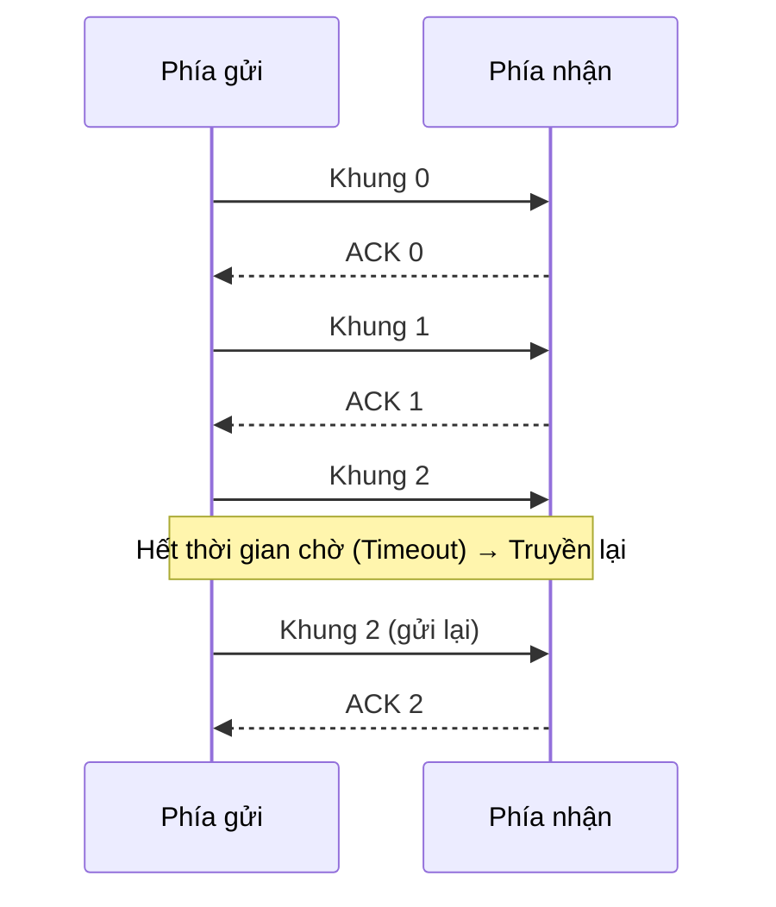

### 4.3.2 Kỹ thuật Cửa sổ trượt (Sliding Window)

Kỹ thuật này cho phép phía gửi truyền cùng lúc nhiều khung dữ liệu liên tiếp trước khi dừng lại chờ thông điệp xác nhận ACK. Cả hai phía gửi và nhận đều duy trì một khoảng kích thước số thứ tự của các khung tin gọi là cửa sổ (window). Kích thước của cửa sổ này sẽ quyết định số lượng khung dữ liệu tối đa được gửi đi mà chưa cần nhận xác nhận.

- **Cửa sổ gửi (Sender window):** Chứa danh sách các khung dữ liệu đã được truyền đi nhưng chưa nhận được ACK xác nhận từ phía nhận.
- **Cửa sổ nhận (Receiver window):** Chứa danh sách các khung dữ liệu mà phía nhận sẵn sàng tiếp nhận (có thể chấp nhận nhận lệch thứ tự trong phạm vi cửa sổ).

Mỗi khi nhận được một thông điệp ACK trả về, cửa sổ gửi sẽ tự động trượt tịnh tiến về phía trước để giải phóng quyền truyền cho các khung tiếp theo.

**Sơ đồ minh họa:**

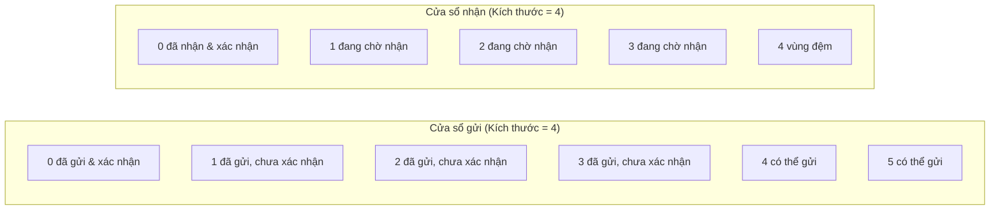

### 4.3.3 Các giao thức yêu cầu lặp tự động (Automatic Repeat Request - ARQ)

ARQ là sự kết hợp chặt chẽ giữa các kỹ thuật phát hiện lỗi với cơ chế tự động truyền lại gói tin khi có lỗi xảy ra.

#### Giao thức Dừng và Chờ ARQ (Stop‑and‑Wait ARQ)

Giao thức này tương tự như phương thức dừng và chờ cơ bản nhưng bổ sung thêm số thứ tự (chỉ gồm 0 và 1) vào tiêu đề khung dữ liệu để giúp phía nhận có thể dễ dàng phân biệt đâu là khung dữ liệu truyền lại và đâu là khung dữ liệu mới hoàn toàn khi có sự cố mất mát ACK trên đường truyền.

**Sơ đồ trạng thái hoạt động:**

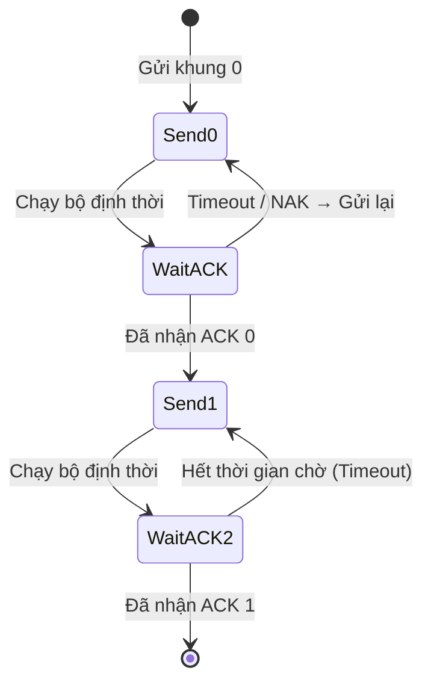

#### Giao thức Quay lại N ARQ (Go‑Back‑N ARQ)

Phía gửi được phép truyền liên tiếp tối đa $N$ khung dữ liệu (bằng kích thước cửa sổ gửi) mà chưa cần chờ ACK. Nếu có một khung dữ liệu bất kỳ bị lỗi hoặc thất lạc trên đường truyền, phía nhận sẽ từ chối tiếp nhận và hủy bỏ toàn bộ các khung dữ liệu gửi đến sau đó (do bị lệch thứ tự). Phía gửi khi hết thời gian chờ hoặc nhận được thông điệp xác nhận tiêu cực (NAK) sẽ buộc phải quay lui lại vị trí khung bị lỗi và thực hiện truyền lại toàn bộ chuỗi khung kể từ thời điểm lỗi đó.

**Ví dụ:** Cửa sổ gửi kích thước = 4. Phía gửi truyền đi các khung 0, 1, 2, 3. Khung 1 bị thất lạc dọc đường. Phía nhận nhận được khung 2 nhưng lập tức hủy bỏ nó (vì đang chờ đợi khung 1) và tiếp tục yêu cầu khung 1. Phía gửi chỉ nhận được ACK cho khung 0, sau đó bộ định thời của khung 1 hết hạn $\rightarrow$ phía gửi tiến hành truyền lại toàn bộ các khung 1, 2, 3.

**Sơ đồ minh họa:**

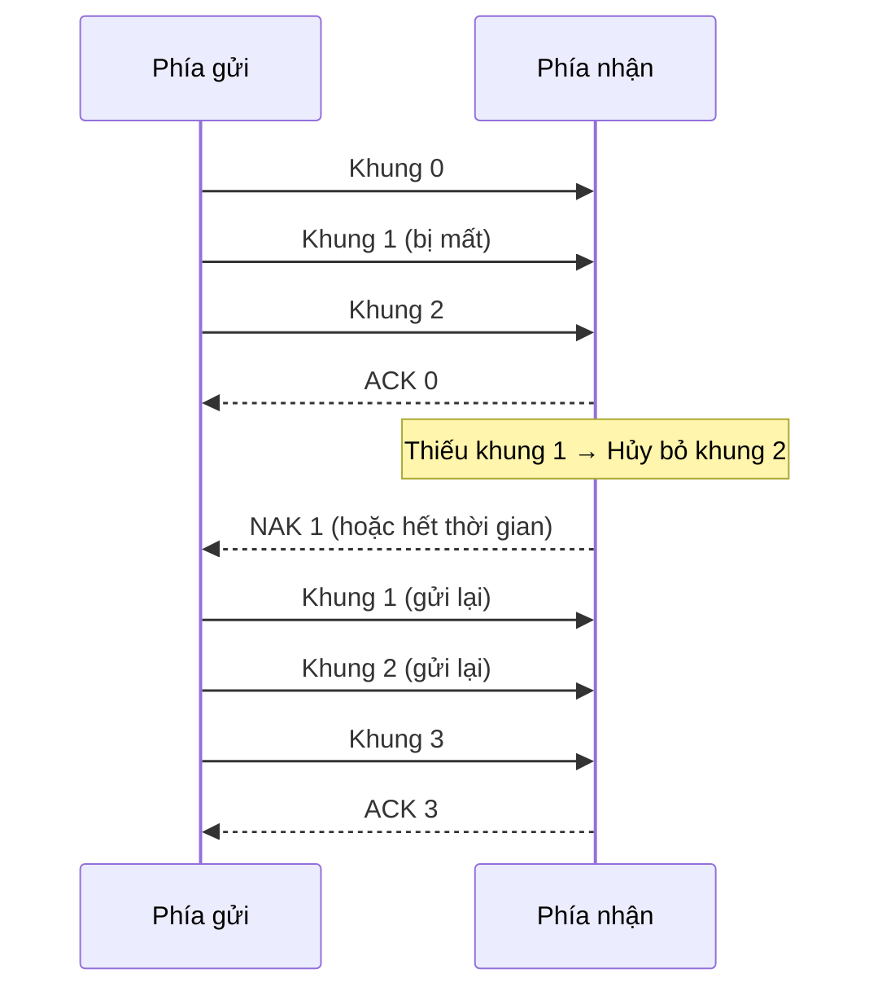

#### Giao thức Truyền lại có chọn lọc ARQ (Selective Repeat ARQ)

Để tối ưu hóa băng thông, giao thức này chỉ yêu cầu truyền lại duy nhất khung dữ liệu cụ thể bị lỗi hoặc thất lạc. Phía nhận sẽ duy trì một bộ đệm lớn để lưu lại các khung dữ liệu gửi lệch thứ tự nhưng hoàn toàn chính xác. Phía gửi chỉ truyền lại đúng khung bị lỗi. Sau khi nhận được khung bị thiếu đó, phía nhận sẽ sắp xếp lại toàn bộ theo đúng thứ tự và chuyển giao lên tầng trên. Phương pháp này tiết kiệm băng thông nhưng yêu cầu bộ đệm phía nhận lớn hơn và thuật toán xử lý phức tạp hơn.

**Ví dụ:** Gửi đi các khung 0, 1, 2, 3. Khung 1 bị thất lạc. Phía nhận tiếp nhận và đưa các khung 2, 3 vào bộ nhớ đệm. Phía gửi nhận thấy hết thời gian chờ của khung 1 nên chỉ thực hiện truyền lại duy nhất khung 1. Sau khi nhận được khung 1, phía nhận sẽ kết hợp cùng khung 2, 3 trong bộ đệm để chuyển giao đầy đủ chuỗi 0, 1, 2, 3 lên tầng mạng.

**Sơ đồ minh họa:**

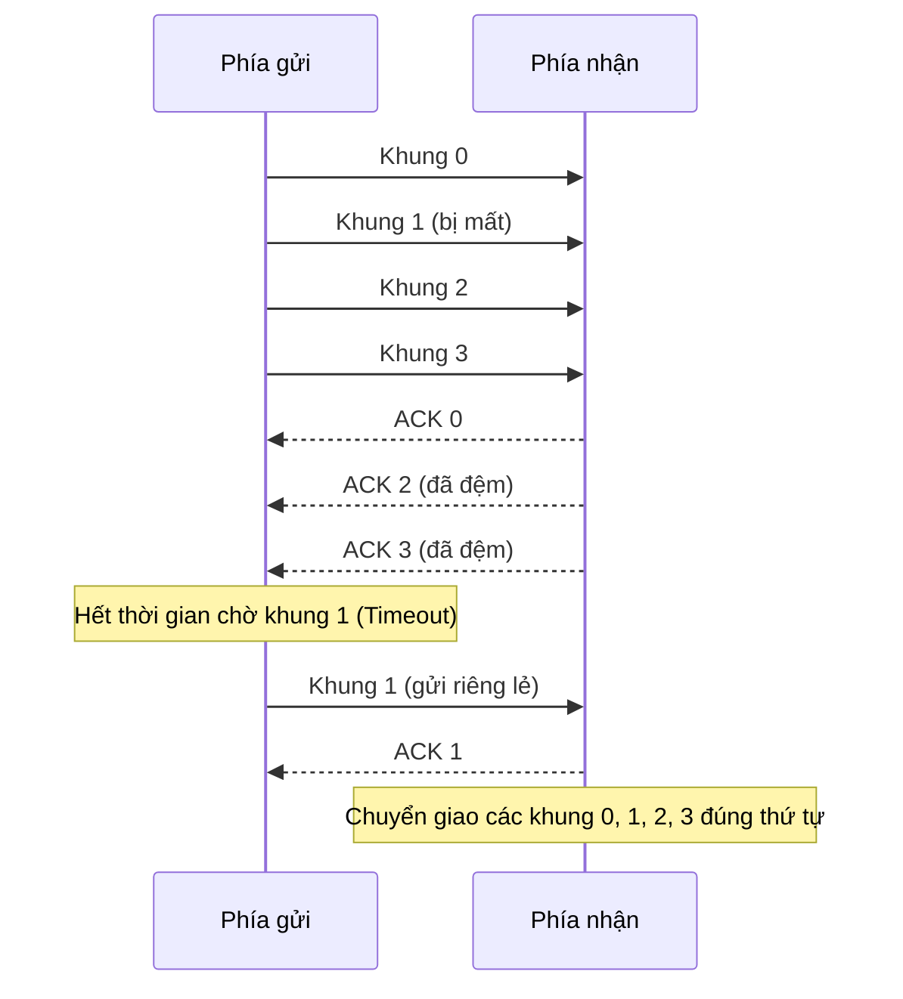

---

## 4.4 Phân lớp Kiểm soát truy cập phương tiện (MAC Sub‑layer)

Phân lớp MAC (Media Access Control) là phân lớp nằm ở nửa dưới của Tầng Liên kết dữ liệu. Nó trực tiếp xử lý các vấn đề liên quan đến địa chỉ vật lý phần cứng và điều khiển quyền truy cập kênh truyền dùng chung.

### 4.4.1 Địa chỉ vật lý MAC (MAC Addressing)

Địa chỉ MAC là một chuỗi định danh duy nhất có độ dài 48-bit (hoặc 64-bit) được ghi cố định vào các vỉ mạch giao tiếp mạng (NIC). Địa chỉ này thường được biểu diễn dưới dạng 6 cặp số hệ thập lục phân ngăn cách bởi dấu hai chấm, ví dụ: `00:1A:2B:3C:4D:5E`.

- **Mục đích:** Định danh chính xác và duy nhất các thiết bị nằm trong cùng một mạng cục bộ (LAN). Địa chỉ IP có thể thay đổi khi bạn di chuyển sang mạng khác, nhưng địa chỉ MAC của thiết bị luôn giữ nguyên cố định.
- **Cấu trúc:** 24 bit đầu tiên đại diện cho mã OUI (Organizationally Unique Identifier - Mã định danh duy nhất của tổ chức, do tổ chức IEEE cấp phát riêng cho từng nhà sản xuất phần cứng); 24 bit còn lại là số sê-ri định danh thiết bị của nhà sản xuất.

**Sơ đồ cấu trúc địa chỉ MAC:**

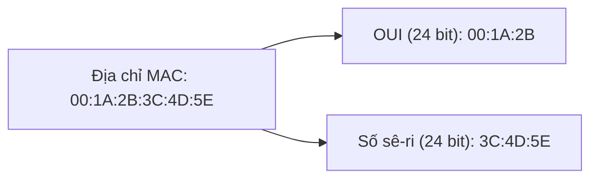

### 4.4.2 Các giao thức truy cập kênh truyền (Channel Access Protocols)

Khi có nhiều thiết bị cùng chia sẻ và truyền dữ liệu trên một môi trường chung (như sóng Wi‑Fi hoặc cáp đồng trục), chúng ta bắt buộc phải có các quy tắc đồng bộ để tránh hiện tượng va chạm/xung đột tín hiệu làm hỏng dữ liệu.

#### Giao thức ALOHA (ALOHA thuần và ALOHA phân khe)

**ALOHA thuần (Pure ALOHA):** Các thiết bị trong mạng cứ tự do truyền dữ liệu bất cứ khi nào chúng có nhu cầu. Nếu xảy ra xung đột làm hỏng dữ liệu, các thiết bị sẽ tự động đợi một khoảng thời gian ngẫu nhiên và truyền lại. Hiệu năng sử dụng kênh truyền tối đa rất thấp, chỉ đạt 18.4%.

**ALOHA phân khe (Slotted ALOHA):** Trục thời gian truyền được chia thành các khe (slot) bằng nhau. Các thiết bị chỉ được phép bắt đầu truyền dữ liệu ở thời điểm bắt đầu của mỗi khe thời gian. Điều này giúp giảm thiểu đáng kể số lượng xung đột ngẫu nhiên và giúp tăng gấp đôi hiệu suất sử dụng kênh truyền lên mức 36.8%.

**Sơ đồ so sánh hai cơ chế ALOHA:**

```mermaid
gantt
    title So sánh hai cơ chế ALOHA
    dateFormat HH:mm:ss
    axisFormat %H:%M:%S
    section ALOHA thuần
    Trạm A :a1, 00:00:00, 1s
    Trạm B :b1, after a1, 0.5s
    Xung đột (Collision) :crit, after a1, 0.5s
    section ALOHA phân khe
    Trạm A :a2, 00:00:00, 1s
    Trạm B :b2, 00:00:01, 1s
    Không xung đột :done, 00:00:01, 1s
```

#### Giao thức CSMA/CD (Carrier Sense Multiple Access with Collision Detection)

Đây là cơ chế được sử dụng phổ biến trong mạng cáp dây Ethernet. Các thiết bị bắt buộc phải thực hiện **lắng nghe đường truyền** trước khi phát tín hiệu (Carrier Sense - Cảm biến sóng mang). Nếu đường truyền rảnh rỗi, thiết bị mới thực hiện truyền. Nếu phát hiện thấy có xung đột xảy ra trong quá trình truyền dữ liệu, thiết bị sẽ ngay lập tức ngừng truyền, phát ra một tín hiệu báo bận (jam signal) để thông báo cho toàn mạng, sau đó chờ đợi một khoảng thời gian ngẫu nhiên lũy thừa (exponential backoff) trước khi thử truyền lại từ đầu.

**Sơ đồ thuật toán hoạt động:**

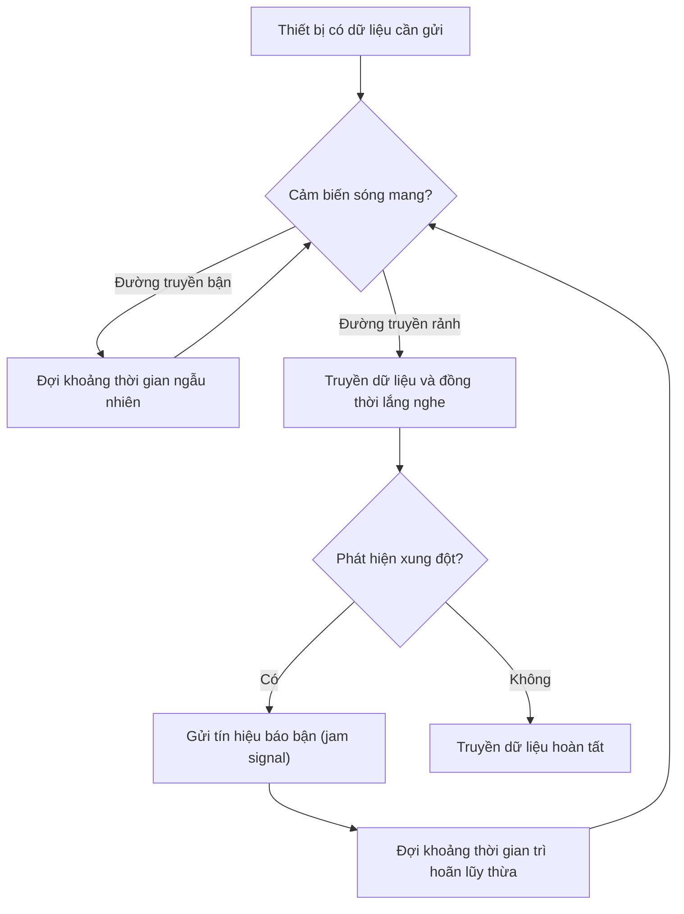

#### Giao thức CSMA/CA (Carrier Sense Multiple Access with Collision Avoidance)

Được áp dụng trong mạng truyền thông không dây (mạng Wi‑Fi). Trong môi trường sóng vô tuyến bán song công (half-duplex radio), thiết bị không thể vừa phát sóng vừa lắng nghe phát hiện xung đột cùng một lúc, do đó cơ chế phát hiện xung đột CD không thể áp dụng được. Thay vào đó, CSMA/CA tập trung vào việc **phòng tránh** xung đột (Collision Avoidance) bằng cách sử dụng:

- Tiến trình bắt tay trao đổi cặp thông điệp **Yêu cầu gửi RTS (Request to Send)** và **Sẵn sàng nhận CTS (Clear to Send)** trước khi truyền dữ liệu thực tế.
- **Vectơ phân bổ mạng (Network Allocation Vector - NAV)** – một bộ định thời đếm ngược thông báo cho tất cả các thiết bị khác biết kênh truyền sẽ bận trong bao lâu để chúng giữ im lặng.

**Quy trình thực hiện:**
1. Bên gửi truyền một thông điệp ngắn RTS tới Điểm truy cập AP (Access Point).
2. AP nhận được sẽ phản hồi lại bằng thông điệp CTS, thông điệp này được phát quảng bá rộng rãi để tất cả các thiết bị xung quanh đều nghe thấy.
3. Các thiết bị khác nghe thấy CTS sẽ lập tức thiết lập bộ định thời NAV của mình và giữ im lặng.
4. Bên gửi tiến hành truyền dữ liệu an toàn mà không lo xung đột.
5. Bên nhận sau khi nhận đủ dữ liệu sẽ gửi lại thông điệp xác nhận ACK.

**Ví dụ thực tế:** Trạm A muốn truyền dữ liệu đến router Wi‑Fi AP. Trạm B nằm trong phạm vi phủ sóng của AP nhưng nằm ngoài tầm sóng của trạm A (đây là vấn đề nút ẩn - hidden node problem). Trạm A gửi RTS $\rightarrow$ AP phản hồi CTS (trạm B nghe thấy thông điệp CTS này từ AP nên sẽ tự động giữ im lặng) $\rightarrow$ trạm A truyền dữ liệu an toàn đến AP mà không bị trạm B chen ngang gây xung đột.

**Sơ đồ trình tự bắt tay:**

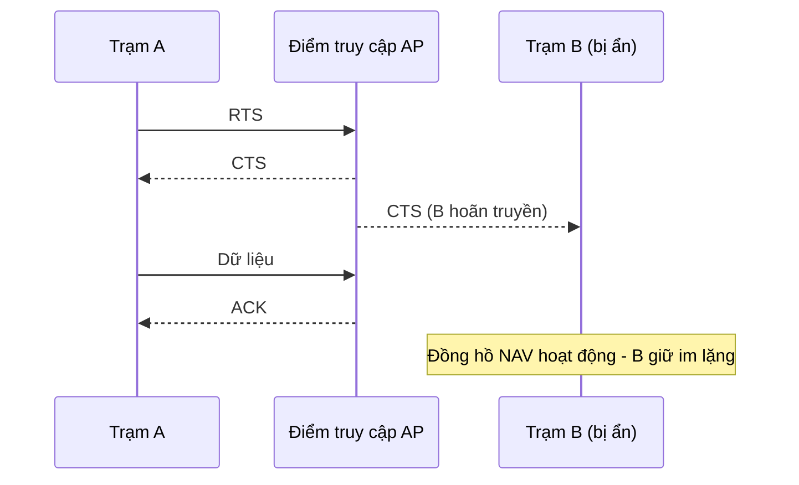

---

## 4.5 Bảng tổng hợp các khái niệm và giao thức

| Chức năng / Giao thức | Ý tưởng mấu chốt | Ví dụ áp dụng thực tế |
|---------------------|----------|--------------|
| **Phân khung (Framing)** | Gom các bit thô thành các khung dữ liệu có cấu trúc đầu đuôi rõ ràng | Khung Ethernet chứa địa chỉ MAC, dữ liệu và mã kiểm lỗi |
| **Kiểm tra chẵn lẻ** | Thêm 1 bit phụ để đếm tổng số bit 1 là chẵn hay lẻ | Các đường truyền nối tiếp đơn giản |
| **Mã kiểm tổng (Checksum)** | Cộng các đoạn dữ liệu bù 1, sau đó lấy bù đảo bit | Các giao thức lớp trên như TCP, UDP |
| **Mã kiểm dư thừa vòng CRC** | Sử dụng phép chia nhị phân XOR cho đa thức tạo | Mạng cáp Ethernet, mạng không dây Wi‑Fi |
| **Mã Hamming** | Chèn thêm các bit kiểm tra tại các vị trí lũy thừa của 2 để tự sửa lỗi | Hệ thống sửa lỗi bộ nhớ máy tính |
| **Dừng và chờ** | Truyền 1 khung, bắt buộc chờ nhận ACK mới truyền tiếp | Các modem truyền thông tin thế hệ cũ |
| **Cửa sổ trượt** | Cho phép truyền liên tiếp nhiều khung tin trong phạm vi cửa sổ | Giao thức truyền tin cậy TCP |
| **Quay lại N (Go-Back-N)** | Khi xảy ra lỗi, truyền lại toàn bộ các khung kể từ khung lỗi trở đi | Các kết nối truyền dữ liệu qua vệ tinh |
| **Truyền lại có chọn lọc** | Chỉ truyền lại duy nhất khung cụ thể bị lỗi, đệm các khung đúng | Các hệ thống mạng yêu cầu độ tin cậy và băng thông tối ưu |
| **CSMA/CD** | Lắng nghe đường truyền trước khi truyền; phát hiện xung đột và dừng lại | Mạng cáp dây Ethernet truyền thống |
| **CSMA/CA** | Phòng tránh xung đột bằng việc bắt tay RTS/CTS và thiết lập đồng hồ NAV | Hệ thống mạng không dây Wi‑Fi |

Chương này đã cung cấp cho bạn những kiến thức nền tảng vững chắc nhất về cách dữ liệu được truyền tải một cách tin cậy qua một liên kết đơn lẻ. Bước tiếp theo là khám phá cách các thiết bị định tuyến và chuyển tiếp các gói tin qua nhiều mạng khác nhau ở tầng mạng.

---
