# Chương 5: Tầng Mạng (Network Layer)

Tầng Mạng (Network Layer - Lớp 3 trong mô hình OSI) chịu trách nhiệm đảm bảo quá trình truyền tải thông tin đầu-cuối (end-to-end) xuyên suốt qua nhiều hệ thống mạng khác nhau. Các chức năng cốt lõi của tầng mạng gồm có:

- **Định lượng địa chỉ logic (Logical addressing):** Cấp phát các định danh duy nhất gọi là địa chỉ IP cho từng thiết bị trong mạng.
- **Định tuyến (Routing):** Tìm kiếm và quyết định lộ trình tối ưu nhất để truyền dữ liệu từ nguồn đến đích.
- **Chuyển tiếp gói tin (Packet forwarding):** Nhận gói tin từ một cổng giao tiếp đầu vào và chuyển tiếp nó sang cổng giao tiếp đầu ra tương ứng để đi tiếp đến chặng tiếp theo.

Dưới đây, chúng ta sẽ đi sâu nghiên cứu chi tiết từng chủ đề cùng các ví dụ minh họa và sơ đồ trực quan.

---

## 5.1 Các chức năng của Tầng Mạng

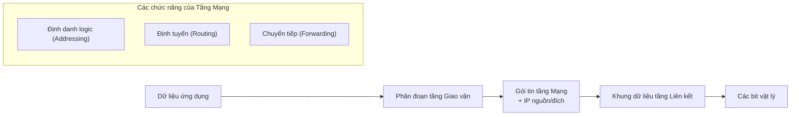

- **Định vị địa chỉ logic (Logical addressing):** Mọi thiết bị chủ trong mạng đều được gắn một địa chỉ IP duy nhất (ví dụ: `192.168.1.10`). Địa chỉ này đóng vai trò xác định danh tính của nguồn gửi và đích nhận dữ liệu.
- **Định tuyến (Routing):** Các bộ định tuyến (router) liên tục trao đổi thông tin cấu trúc liên kết mạng để tự động xây dựng nên bảng định tuyến (routing table).
- **Chuyển tiếp (Forwarding):** Khi một gói tin đi tới, bộ định tuyến sẽ tra cứu địa chỉ IP đích của gói tin trong bảng định tuyến và chuyển giao gói tin ra cổng vật lý phù hợp để chuyển tới nút mạng chặng tiếp theo (next hop).

---

## 5.2 Địa chỉ hóa IP (IP Addressing)

### 5.2.1 Phân lớp địa chỉ IPv4 (Classful Addressing)

Địa chỉ IPv4 có độ dài 32 bit, thường được viết dưới dạng 4 nhóm số thập phân ngăn cách bởi dấu chấm (dotted-decimal format). Ban đầu, không gian địa chỉ được phân chia thành các **lớp địa chỉ** cụ thể:

| Lớp địa chỉ | Các bit bắt đầu | Phạm vi giá trị (Nhóm đầu tiên) | Mặt nạ mặc định (Default Mask) | Mục đích sử dụng |
|-------|--------------|---------------------|--------------|------------------|
| **Lớp A** | 0            | 1 – 126             | 255.0.0.0    | Các mạng quy mô cực lớn |
| **Lớp B** | 10           | 128 – 191           | 255.255.0.0  | Các mạng quy mô trung bình |
| **Lớp C** | 110          | 192 – 223           | 255.255.255.0| Các mạng quy mô nhỏ |
| **Lớp D** | 1110         | 224 – 239           | Không có     | Truyền thông đa hướng (Multicast) |
| **Lớp E** | 1111         | 240 – 255           | Không có     | Phục vụ nghiên cứu, thử nghiệm |

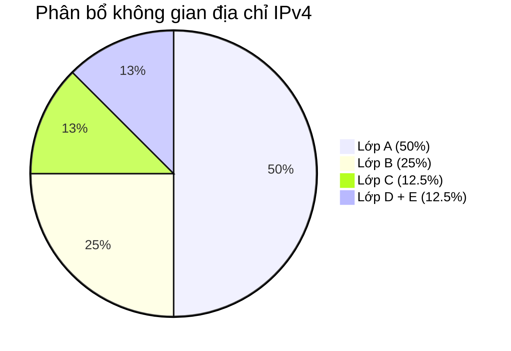

**Ví dụ:**  
- Địa chỉ `10.0.0.1` thuộc Lớp A (phần mạng là `10.0.0.0`, phần máy chủ là `0.0.0.1`).  
- Địa chỉ `172.16.0.1` thuộc Lớp B (phần mạng là `172.16.0.0`).  
- Địa chỉ `192.168.1.1` thuộc Lớp C (phần mạng là `192.168.1.0`).

### 5.2.2 Chia mạng con (Subnetting)

Chia mạng con (Subnetting) là quá trình chia một dải mạng lớn ban đầu thành nhiều dải mạng nhỏ hơn nhằm tối ưu hóa quản lý và tăng cường bảo mật. Kỹ thuật này thực hiện bằng cách mượn (borrow) một số bit từ phần máy chủ (host portion) để chuyển sang phục vụ phần mạng.

**Ví dụ thực tế:**  
Cho dải mạng `192.168.1.0/24` (Lớp C, gồm 256 địa chỉ). Yêu cầu thiết kế chia làm 4 mạng con, mỗi mạng con có khả năng chứa ít nhất 50 máy trạm.

- Mượn 2 bit từ phần máy chủ $\rightarrow$ độ dài tiền tố mới là `/26` (tương ứng mặt nạ mạng con mới là `255.255.255.192`).
- Số lượng mạng con tạo được = $2^2 = 4$ mạng con.  
- Số máy trạm khả dụng tối đa trong mỗi mạng con = $2^6 - 2 = 62$ máy trạm.

| Mạng con | Địa chỉ mạng (Network IP) | Dải địa chỉ khả dụng cho máy trạm | Địa chỉ quảng bá (Broadcast IP) |
|--------|----------------|-----------------------|-------------|
| **1**      | 192.168.1.0    | 192.168.1.1 – 192.168.1.62      | 192.168.1.63|
| **2**      | 192.168.1.64   | 192.168.1.65 – 192.168.1.126    | 192.168.1.127|
| **3**      | 192.168.1.128  | 192.168.1.129 – 192.168.1.190   | 192.168.1.191|
| **4**      | 192.168.1.192  | 192.168.1.193 – 192.168.1.254   | 192.168.1.255|

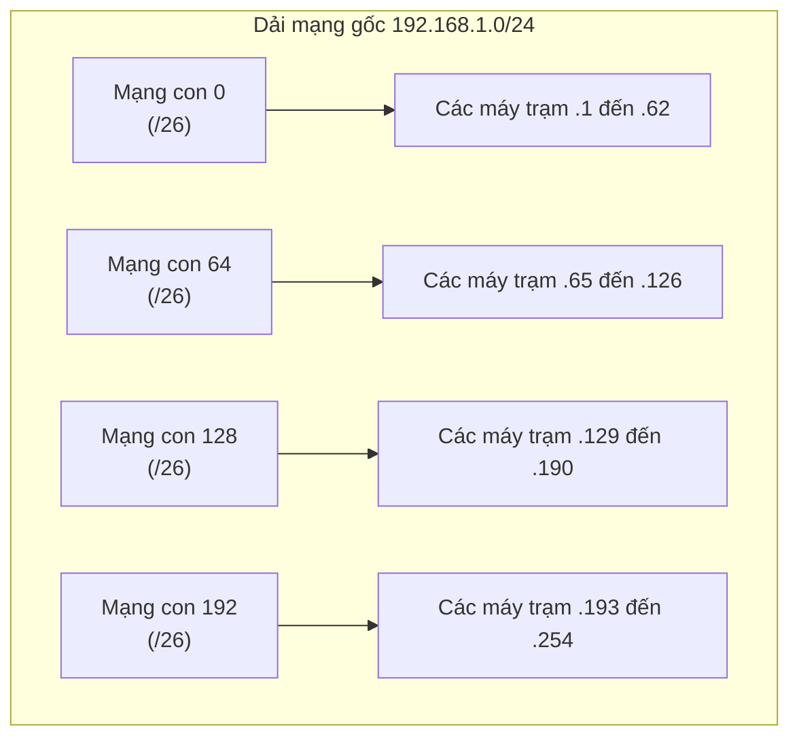

### 5.3 Định tuyến liên miền không phân lớp (Classless Inter‑Domain Routing - CIDR)

Cơ chế định tuyến không phân lớp CIDR xóa bỏ hoàn toàn ranh giới phân chia lớp địa chỉ A, B, C cứng nhắc trước đây. Một địa chỉ IP được viết đi kèm trực tiếp với độ dài tiền tố mạng (ví dụ: `/20`). Nó hỗ trợ kỹ thuật **gộp mạng con (supernetting)** – tổng hợp nhiều tuyến đường định tuyến mạng con nhỏ liên tiếp thành một tuyến đường gộp lớn duy nhất.

**Ví dụ:**  
Gộp bốn tuyến định tuyến mạng con gồm `192.168.0.0/24`, `192.168.1.0/24`, `192.168.2.0/24`, và `192.168.3.0/24` thành một tuyến đường gộp lớn duy nhất là `192.168.0.0/22` (vì cả bốn mạng này đều có chung 22 bit đầu tiên giống hệt nhau).  
- Việc gộp này giúp giảm thiểu đáng kể số lượng bản ghi trong bảng định tuyến của các thiết bị mạng.

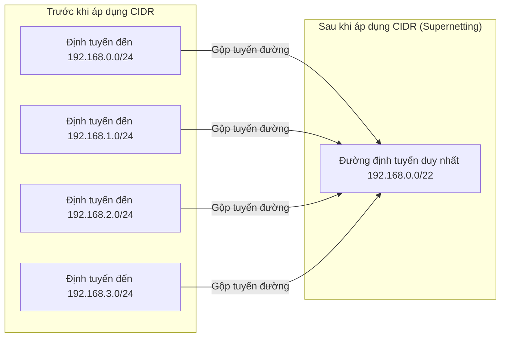

### 2.4 Khái niệm cơ bản về IPv6

Thế hệ địa chỉ IPv6 sử dụng dải địa chỉ có độ dài lên tới 128 bit (thường được viết dưới dạng 8 nhóm số hệ thập lục phân ngăn cách bởi dấu hai chấm). Các đặc điểm nổi trội:
- **Không còn địa chỉ quảng bá (No broadcast):** Được thay thế bằng các cơ chế truyền đa hướng (multicast) và bất kỳ hướng (anycast).
- **Tự cấu hình địa chỉ không lưu trạng thái (Stateless Address Autoconfiguration - SLAAC):** Cho phép các thiết bị tự tạo địa chỉ IP riêng cho mình mà không cần máy chủ DHCP.
- **Tiêu đề gói tin tối giản (Simplified header):** Lược bỏ mã kiểm tổng checksum ở tầng mạng, loại bỏ việc phân mảnh gói tin trực tiếp tại các router trung gian.
- **Ví dụ địa chỉ IPv6:** `2001:0db8:85a3:0000:0000:8a2e:0370:7334`

Các phân loại truyền thông chính trong IPv6:
- **Đơn hướng (Unicast):** Truyền trực tiếp từ một giao diện nguồn đến một giao diện đích cụ thể.
- **Đa hướng (Multicast):** Truyền từ một nguồn tới một nhóm giao diện được xác định trước.
- **Bất kỳ hướng (Anycast):** Truyền từ một nguồn tới một giao diện nằm ở vị trí gần nhất về mặt định tuyến địa lý trong số các thiết bị cùng nhóm.

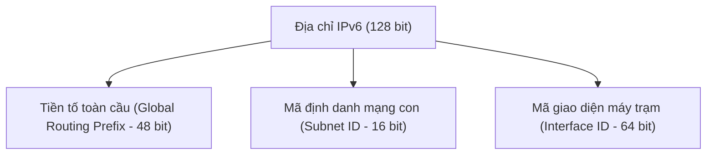

---

## 3. Các thuật toán định tuyến (Routing Algorithms)

### 3.1 Định tuyến vectơ khoảng cách (Distance Vector - Bellman‑Ford)

Mỗi bộ định tuyến sẽ định kỳ chia sẻ toàn bộ bảng định tuyến hiện tại của mình cho tất cả các **bộ định tuyến lân cận trực tiếp (neighbors)**. Chỉ số đánh giá tuyến đường thường dựa trên số lượng chặng (hop count).  
**Nhược điểm:** Tốc độ hội tụ của hệ thống rất chậm, dễ phát sinh vấn đề lặp định tuyến đếm đến vô hạn (count‑to‑infinity).

**Ví dụ:** Ba bộ định tuyến kết nối dạng chuỗi A–B–C. Đường truyền giữa B–C bị hỏng. A vẫn tin rằng mình có thể đến C thông qua B (với chi phí 3), B lại nghĩ rằng mình có thể đến C thông qua A (với chi phí 4) $\rightarrow$ tạo thành một vòng lặp vô tận (cho đến khi vượt ngưỡng giới hạn tối đa, mặc định là 16).

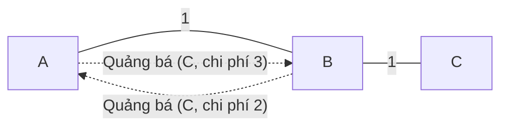

### 3.2 Định tuyến trạng thái liên kết (Link State - Dijkstra)

Mỗi bộ định tuyến tự tìm hiểu và thu thập **toàn bộ bản đồ cấu trúc liên kết mạng** của toàn hệ thống, sau đó chạy thuật toán Dijkstra để tự tìm ra các đường đi ngắn nhất đến tất cả các đích. Các bộ định tuyến quảng bá thông tin trạng thái liên kết (LSA - Link State Advertisements) rộng rãi tới tất cả các thiết bị khác.  
**Ưu điểm:** Tốc độ hội tụ cực nhanh, hoàn toàn không phát sinh vòng lặp định tuyến.

**Ví dụ sơ đồ mạng:**

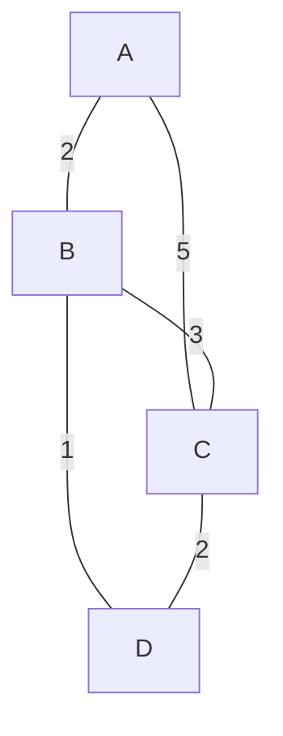

Từ vị trí nút A, đường đi ngắn nhất để đến đích D được tính toán là tuyến đường A–B–D (với tổng chi phí = 3). Thuật toán Dijkstra sẽ dựng nên một cây đường đi ngắn nhất.

### 3.3 Thuật toán tràn ngập (Flooding)

Một bộ định tuyến khi nhận được gói tin đầu vào sẽ nhân bản và chuyển tiếp gói tin đó ra **tất cả các cổng giao tiếp vật lý ngoại trừ cổng mà gói tin vừa đi tới**. Thuật toán này thường được áp dụng trong truyền thông quân sự bảo mật, trong pha lan truyền thông tin LSA ban đầu của giao thức OSPF, hoặc dùng để nâng cao tính dự phòng chịu lỗi của mạng.  
**Cơ chế kiểm soát:** Giới hạn số lượng chặng tối đa (TTL), sử dụng số hiệu sê-ri gói tin để tránh lặp vô tận.

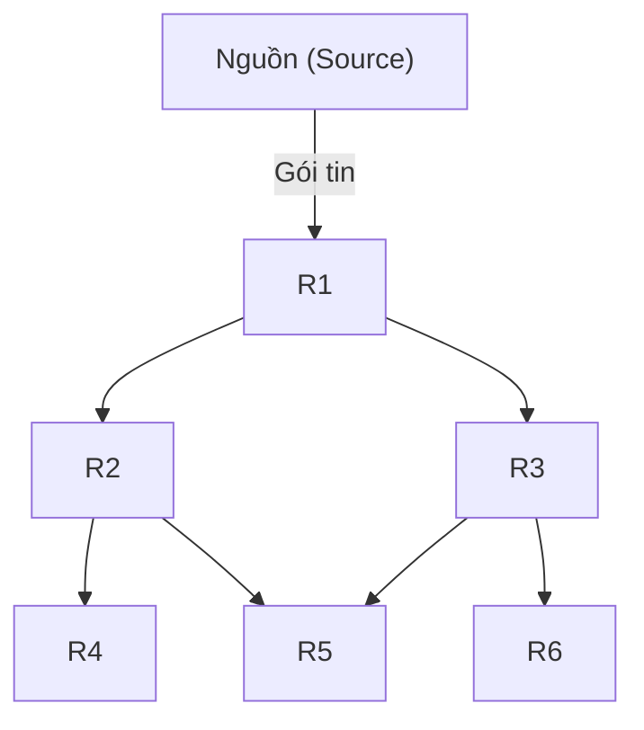

---

## 4. Các giao thức định tuyến (Routing Protocols)

### 4.1 Giao thức RIP (Routing Information Protocol)

- Hoạt động theo cơ chế **vectơ khoảng cách (distance-vector)**, sử dụng số lượng chặng **hop count** làm chỉ số đo lường (giới hạn tối đa không quá 15 chặng, chặng thứ 16 coi như không thể tới).
- Định kỳ gửi cập nhật bảng định tuyến sau mỗi 30 giây.  
- **Ví dụ bản ghi định tuyến RIP:** `192.168.5.0/24 thông qua 10.0.0.2, số chặng (metric) = 2`.

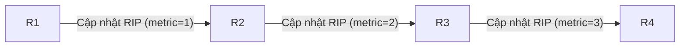

### 4.2 Giao thức OSPF (Open Shortest Path First)

- Hoạt động theo cơ chế **trạng thái liên kết (link-state)**, sử dụng chỉ số **cost** (được tính toán dựa trên băng thông thực tế của đường truyền) làm thước đo.
- Thiết kế mạng theo mô hình phân cấp: chia nhỏ mạng thành các **vùng (area)**, tất cả các vùng bắt buộc phải kết nối trực tiếp vào một vùng xương sống trung tâm là **Vùng 0 (Area 0 - Backbone Area)**.
- Tốc độ hội tụ định tuyến rất nhanh, hỗ trợ đầy đủ các dải mặt nạ có độ dài tùy biến VLSM và CIDR.

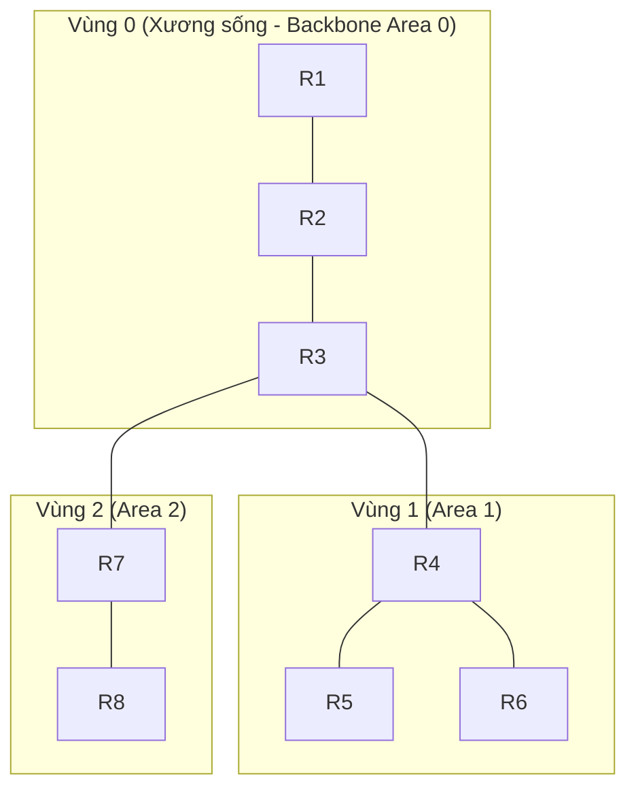

### 4.3 Giao thức định tuyến liên miền BGP (Border Gateway Protocol)

- Hoạt động theo cơ chế **vectơ đường đi (path-vector)**, chuyên dùng để định tuyến giữa các **Hệ thống tự trị (Autonomous System - AS)** trên Internet toàn cầu.
- Các tuyến đường đi luôn được đính kèm thuộc tính **AS_PATH** (danh sách các mã vùng AS mà gói tin đã đi qua) nhằm ngăn chặn triệt để vòng lặp định tuyến.
- **Ví dụ:** Vùng AS 100 quảng bá dải IP `200.1.0.0/16` đi kèm thuộc tính đường đi `[100]`. Khi vùng AS 200 nhận được và chuyển tiếp đi tiếp, nó sẽ chèn thêm mã của mình vào đầu danh sách thành `[200, 100]`.

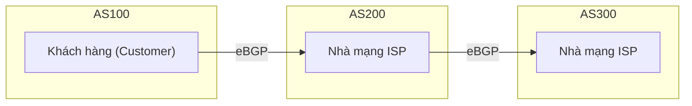

---

## 5. Các chủ đề bổ sung

### 5.1 Phân mảnh gói tin (Fragmentation)

Khi kích thước của một gói tin vượt quá giới hạn **đơn vị truyền tải tối đa MTU (Maximum Transmission Unit)** của một đường truyền vật lý, bộ định tuyến trung gian buộc phải thực hiện phân mảnh (chia nhỏ) gói tin đó ra. Việc tái hợp (reassemble) các mảnh nhỏ về gói tin gốc ban đầu sẽ chỉ được thực hiện tại **thiết bị đích cuối cùng** (trong IPv4); đối với thế hệ IPv6, các bộ định tuyến trung gian không được phép tự phân mảnh gói tin dọc đường đi (nhiệm vụ này thuộc về thiết bị gửi ban đầu).

**Ví dụ thực tế:**  
Đường truyền có giới hạn MTU = 1500 byte. Gói tin gốc truyền đi có kích thước 4000 byte (gồm 20 byte tiêu đề IP và 3980 byte dữ liệu).  
Gói tin sẽ được chia làm 3 mảnh nhỏ:
- Mảnh 1: Độ lệch offset = 0, kích thước = 1500 byte (gồm 20 byte tiêu đề + 1480 byte dữ liệu).
- Mảnh 2: Độ lệch offset = 1480, kích thước = 1500 byte (gồm 20 byte tiêu đề + 1480 byte dữ liệu).
- Mảnh 3: Độ lệch offset = 2960, kích thước = 1020 byte (gồm 20 byte tiêu đề + 1000 byte dữ liệu).

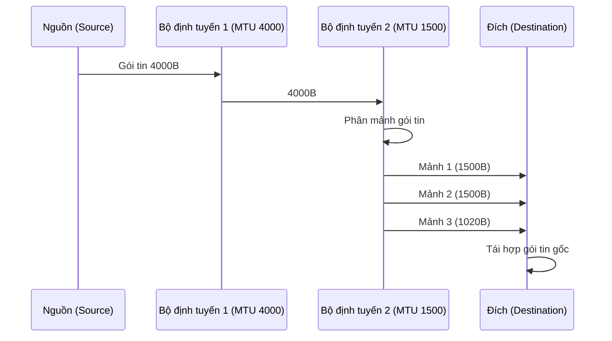

### 5.2 Dịch địa chỉ mạng NAT (Network Address Translation)

NAT cho phép nhiều thiết bị sử dụng các địa chỉ IP nội bộ không định tuyến (Private IP - ví dụ dải `192.168.1.x`) có thể dùng chung một địa chỉ IP công cộng (Public IP) duy nhất để truy cập ra mạng Internet bên ngoài. Các phân loại phổ biến: **Dịch IP nguồn (Source NAT - SNAT)** cho lưu lượng đi ra ngoài, và **Dịch địa chỉ cổng (Port Address Translation - PAT / NAT Overload)**.

**Ví dụ bảng ánh xạ NAT:**

| Địa chỉ IP nội bộ + Cổng dịch vụ | Địa chỉ IP công cộng + Cổng chuyển đổi |
|----------------|----------------|
| 192.168.1.10:12345 | 203.0.113.5:50001 |
| 192.168.1.11:80    | 203.0.113.5:50002 |

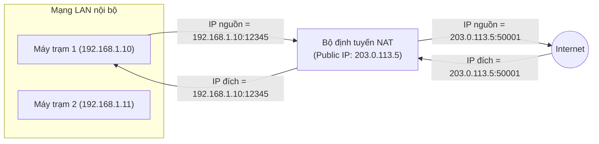

### 5.3 Giao thức thông điệp điều khiển Internet ICMP (Internet Control Message Protocol)

Giao thức ICMP chuyên dùng để báo cáo các sự cố lỗi đường truyền và hỗ trợ kiểm tra chẩn đoán hệ thống mạng. Gói tin ICMP được đóng gói nằm trực tiếp bên trong gói tin IP.

**Các thông điệp ICMP thông dụng:**
- **Yêu cầu hồi đáp (Echo Request) / Phản hồi (Echo Reply):** Được sử dụng bởi công cụ kiểm tra `ping`.
- **Đích đến không thể tiếp cận (Destination Unreachable):** Báo lỗi khi cổng hoặc mạng đích không thể kết nối.
- **Hết thời gian chờ (Time Exceeded):** Báo lỗi khi chỉ số TTL của gói tin giảm về 0 (được sử dụng bởi công cụ `traceroute` để dò tìm các nút trung gian).
- **Điều hướng (Redirect):** Router thông báo cho máy trạm biết có một tuyến đường định tuyến khác tối ưu hơn.

**Ví dụ:** Khi bạn chạy lệnh `ping 8.8.8.8`, máy tính của bạn sẽ gửi đi một gói tin `ICMP Echo Request`; máy chủ của Google nhận được sẽ phản hồi lại bằng gói tin `ICMP Echo Reply`.

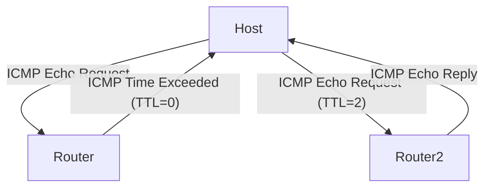

---

## Bảng tổng hợp các khái niệm

| Chủ đề | Đặc trưng mấu chốt | Trường hợp áp dụng thực tế |
|------------------|----------------------------------------|---------------------------------------|
| **Chia mạng con** (Subnetting) | Mượn các bit của phần máy chủ phục vụ mạng | Chia dải `192.168.1.0/24` thành 4 mạng con nhỏ chứa tối đa 62 máy |
| **Định tuyến CIDR** | Gộp các dải mạng con liên tiếp | Gộp 4 mạng con `/24` thành một đường định tuyến duy nhất `/22` |
| **Vectơ khoảng cách** | Thuật toán Bellman-Ford, gửi cập nhật định kỳ | Giao thức định tuyến RIP trong mạng nhỏ |
| **Trạng thái liên kết** | Thuật toán Dijkstra, nắm bắt toàn bộ bản đồ mạng | Giao thức định tuyến OSPF trong doanh nghiệp |
| **Tràn ngập** (Flooding) | Gửi gói tin ra mọi cổng vật lý trừ cổng nhận vào | Lan truyền thông điệp thông báo LSA của OSPF |
| **Dịch địa chỉ mạng NAT** | Ánh xạ giữa dải IP nội bộ và IP công cộng | Router gia đình dùng chung 1 IP mạng để tiết kiệm |
| **Giao thức ICMP** | Báo cáo sự cố và chẩn đoán hệ thống | Sử dụng các công cụ phổ biến như `ping`, `traceroute` |

---
