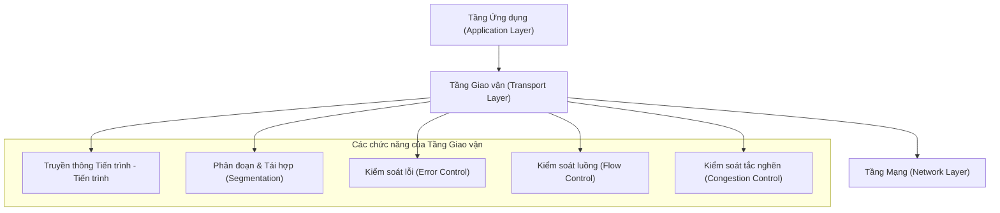
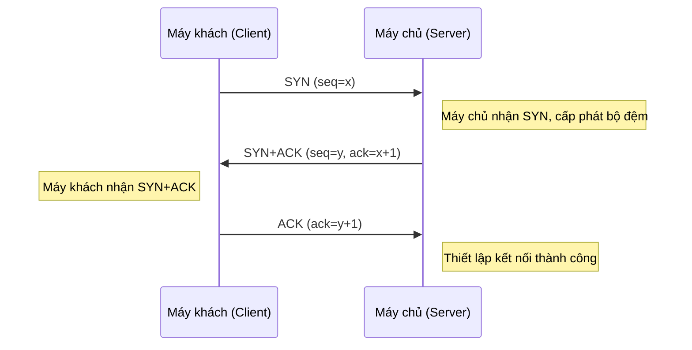
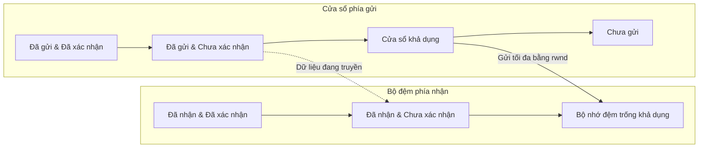
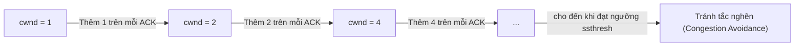
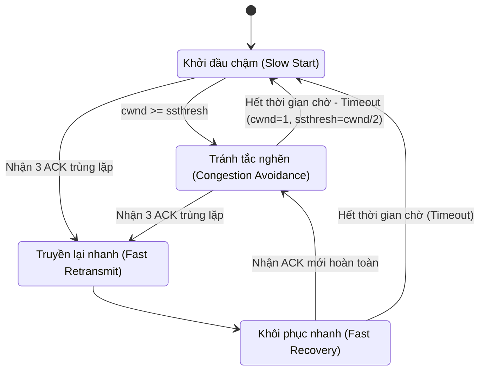
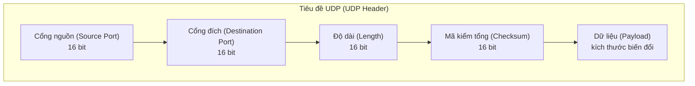

# Chương 6: Tầng Giao vận (Transport Layer)

Tầng Giao vận (Transport Layer) là lớp thứ tư trong mô hình tham chiếu OSI và là phần lõi trung tâm của chồng giao thức TCP/IP. Tầng này chịu trách nhiệm thiết lập các kênh truyền thông logic trực tiếp giữa các tiến trình ứng dụng (application processes) đang chạy trên các máy tính khác nhau.

## Các chức năng của Tầng Giao vận

Sơ đồ dưới đây minh họa các nhiệm vụ và vai trò cốt lõi của tầng giao vận:

- **Truyền thông Tiến trình - Tiến trình (Process-to-Process Communication):** Trái ngược với tầng mạng chỉ đảm nhiệm việc chuyển giao các gói tin giữa các máy tính (hosts) vật lý, tầng giao vận phân phối chính xác dữ liệu tới từng tiến trình (ứng dụng phần mềm) cụ thể đang chạy trên máy thông qua các số hiệu cổng (ports).
- **Phân đoạn và Tái hợp (Segmentation and Reassembly):** Chia nhỏ luồng dữ liệu khổng lồ từ tầng ứng dụng thành các phân đoạn (segments) có kích thước phù hợp trước khi truyền đi, và thực hiện lắp ghép, tái cấu trúc lại chúng theo đúng thứ tự ban đầu tại máy đích.
- **Kiểm soát lỗi (Error Control):** Phát hiện các phân đoạn bị lỗi hoặc bị thất lạc dọc đường đi và tiến hành yêu cầu truyền lại.
- **Kiểm soát luồng (Flow Control):** Điều phối tốc độ truyền để tránh việc bên gửi có tốc độ nhanh làm tràn bộ đệm bên nhận có tốc độ xử lý chậm.
- **Kiểm soát tắc nghẽn (Congestion Control):** Điều tiết lượng lưu lượng bơm vào mạng để ngăn ngừa hiện tượng quá tải và nghẽn mạng vật lý.

Có hai giao thức tầng giao vận chính thống trị mạng Internet ngày nay: **TCP** (Transmission Control Protocol) và **UDP** (User Datagram Protocol).

---

## Giao thức TCP (Transmission Control Protocol)

TCP là giao thức giao vận hướng kết nối (connection-oriented), đảm bảo truyền dữ liệu hoàn toàn tin cậy và hoạt động theo cơ chế dịch vụ hướng dòng (stream-oriented service).

### Các đặc điểm chính

- **Hướng kết nối (Connection-oriented):** Bắt buộc phải thiết lập một kết nối logic chặt chẽ giữa hai bên trước khi bắt đầu thực hiện trao đổi dữ liệu.
- **Độ tin cậy cao (Reliable):** Sử dụng các thông điệp xác nhận phản hồi (ACK) và cơ chế tự động truyền lại gói tin khi có sự cố để đảm bảo dữ liệu đến đích 100%.
- **Bảo đảm đúng thứ tự (In-order delivery):** Các phân đoạn dữ liệu luôn được sắp xếp và ráp lại theo đúng thứ tự sắp xếp ban đầu ở phía nhận.
- **Song công toàn phần (Full-duplex):** Cho phép hai bên gửi và nhận dữ liệu song song đồng thời cùng một lúc trên cùng một kết nối.

### Quá trình Bắt tay 3 bước (Three-Way Handshake)

TCP thực hiện thiết lập kết nối thông qua một tiến trình bắt tay 3 bước. Tiến trình này giúp đồng bộ hóa các số hiệu phân đoạn (sequence numbers) ban đầu và thương lượng các thông số truyền dẫn giữa hai bên.

- **SYN (Synchronize):** Đề xuất và đồng bộ hóa số thứ tự phân đoạn ban đầu.
- **ACK (Acknowledgment):** Thông điệp xác nhận đã nhận thông tin.
- Sau khi hoàn thành 3 bước bắt tay này, hai bên chính thức được phép trao đổi dữ liệu thực tế với nhau.

### Cơ chế truyền dữ liệu tin cậy

TCP đạt được độ tin cậy tuyệt đối nhờ áp dụng:
- **Số thứ tự phân đoạn (Sequence numbers):** Dùng để đánh số chính xác cho từng byte dữ liệu được gửi đi.
- **Thông điệp xác nhận (Acknowledgments):** Phía nhận phản hồi xác nhận cụ thể đã nhận thành công đến byte thứ mấy.
- **Bộ định thời truyền lại (Retransmission timers):** Phía gửi tự động truyền lại dữ liệu nếu sau một khoảng thời gian chờ (timeout) quy định mà vẫn chưa nhận được ACK tương ứng.

### Kiểm soát luồng: Kỹ thuật Cửa sổ trượt

TCP sử dụng cơ chế cửa sổ trượt để kiểm soát lưu lượng truyền tin. Phía nhận sẽ liên tục thông báo chỉ số `rwnd` (cửa sổ bên nhận - receiver window) về cho phía gửi để biểu thị dung lượng bộ nhớ đệm còn trống hiện tại của mình.

- Phía gửi tuyệt đối không được phép truyền vượt quá kích thước cửa sổ `rwnd` mà phía nhận đã thông báo.
- Khi phía nhận xử lý xong dữ liệu trong bộ đệm và gửi thông điệp ACK về, cửa sổ sẽ tiếp tục trượt tịnh tiến về phía trước để mở đường cho dữ liệu mới.

### Kiểm soát tắc nghẽn (Congestion Control)

TCP tích hợp bốn thuật toán phối hợp chặt chẽ để quản lý và ngăn ngừa tắc nghẽn mạng. Chỉ số cửa sổ tắc nghẽn (`cwnd` - congestion window) giới hạn lượng dữ liệu tối đa mà phía gửi được phép bơm vào mạng tại một thời điểm.

#### 1. Khởi đầu chậm (Slow Start)

- Ban đầu khi mới kết nối, đặt kích thước cửa sổ tắc nghẽn cực nhỏ: `cwnd = 1 MSS` (Kích thước phân đoạn tối đa - Maximum Segment Size).
- Với mỗi thông điệp ACK nhận được, kích thước `cwnd` sẽ được nhân đôi (tăng trưởng theo hàm mũ) cho đến khi đạt tới một giới hạn ngưỡng gọi là `ssthresh` (ngưỡng khởi đầu chậm - slow start threshold).

#### 2. Tránh tắc nghẽn (Congestion Avoidance)

- Khi cửa sổ tắc nghẽn vượt ngưỡng (`cwnd >= ssthresh`), tốc độ tăng trưởng sẽ chuyển sang tuyến tính: chỉ số `cwnd` chỉ được cộng thêm $1/\text{cwnd}$ cho mỗi ACK nhận về.
- Quá trình tăng trưởng tuyến tính này tiếp tục cho đến khi phát hiện thấy có lỗi mất mát gói tin xảy ra trên đường truyền.

#### 3. Truyền lại nhanh (Fast Retransmit)

- Ngay khi nhận được liên tiếp 3 thông điệp ACK trùng lặp (duplicate ACKs) từ phía nhận báo về, phía gửi lập tức kết luận phân đoạn tiếp theo đã bị mất và thực hiện truyền lại ngay phân đoạn đó mà không cần đợi bộ định thời timeout đếm hết giờ.

#### 4. Khôi phục nhanh (Fast Recovery)

- Sau khi thực hiện truyền lại nhanh, hệ thống chuyển sang pha khôi phục nhanh: đặt lại giá trị ngưỡng `ssthresh = cwnd / 2`, và đặt cửa sổ tắc nghẽn `cwnd = ssthresh + 3`.
- Với mỗi ACK trùng lặp nhận được tiếp theo, tăng dần `cwnd` thêm 1.
- Ngay khi nhận được một thông điệp ACK mới hoàn toàn (xác nhận đã nhận đủ dữ liệu bị mất trước đó), hệ thống đặt `cwnd = ssthresh` và quay trở lại pha Tránh tắc nghẽn.

Sơ đồ trạng thái dưới đây tóm tắt toàn bộ chu trình kiểm soát tắc nghẽn của TCP:

---

## Giao thức UDP (User Datagram Protocol)

UDP là một giao thức giao vận siêu tối giản, hoạt động theo cơ chế không kết nối (connectionless) và chỉ cung cấp các dịch vụ truyền dữ liệu ở mức tối thiểu.

### Các đặc điểm chính

- **Không kết nối (Connectionless):** Không thực hiện bất kỳ tiến trình bắt tay thiết lập kết nối nào trước khi truyền; mỗi gói tin datagram được truyền đi hoàn toàn độc lập với nhau.
- **Không tin cậy (Unreliable):** Không có cơ chế xác nhận ACK, không đảm bảo dữ liệu đến đích nguyên vẹn, không bảo đảm đúng thứ tự, và không có tính năng chống trùng lặp gói tin.
- **Không kiểm soát luồng:** Bên gửi có thể tự do truyền dữ liệu đi với bất kỳ tốc độ nào tùy ý.
- **Không kiểm soát tắc nghẽn:** Hoàn toàn không phản ứng hay điều chỉnh giảm tốc độ khi mạng xảy ra nghẽn.
- **Chi phí phụ trội cực thấp:** Kích thước tiêu đề (header) của UDP chỉ vỏn vẹn 8 byte (so với tiêu đề tối thiểu 20 byte của TCP).

### Cấu trúc gói tin UDP Datagram

### Các trường hợp sử dụng tối ưu

Giao thức UDP là sự lựa chọn ưu tiên hàng đầu trong các kịch bản thực tế yêu cầu tốc độ truyền tải cực nhanh và độ trễ thấp tối đa, chấp nhận đánh đổi một tỷ lệ mất mát dữ liệu nhỏ:

| Ứng dụng thực tế | Tại sao nên chọn UDP? |
|-------------|-----------|
| **Truyền phát trực tiếp (Live streaming) / VoIP** | Chấp nhận mất một vài khung hình hoặc tiếng giật nhẹ; việc truyền lại dữ liệu bị trễ sẽ gây ra hiện tượng lag không thể chấp nhận được. |
| **Truy vấn tên miền DNS** | Các thông điệp yêu cầu-phản hồi cực kỳ ngắn gọn; nếu lỗi sẽ tự động thử lại ở tầng ứng dụng. |
| **Giám sát mạng SNMP** | Yêu cầu chi phí tiêu đề cực thấp để tránh làm nặng thêm băng thông mạng đang bị giám sát. |
| **Giao thức cấp phát IP DHCP** | Hoạt động dựa trên cơ chế phát quảng bá (broadcast), không cần và không thể duy trì trạng thái kết nối. |
| **Trò chơi điện tử trực tuyến (Online Gaming)** | Đòi hỏi cập nhật tọa độ nhân vật tức thời theo thời gian thực; các dữ liệu vị trí cũ bị trễ hoàn toàn vô giá trị. |

### Sơ đồ so sánh tổng hợp

```mermaid
graph TD
    subgraph TCPDiagram ["Giao thức TCP"]
        T1["Hướng kết nối (Connection-oriented)"] --> T2["Truyền tin cậy (Reliable)"]
        T2 --> T3["Bảo đảm đúng thứ tự (Ordered)"]
        T3 --> T4["Kiểm soát luồng & tắc nghẽn"]
        T4 --> T5["Chi phí tiêu đề cao (Overhead)"]
    end
    
    subgraph UDPDiagram ["Giao thức UDP"]
        U1["Không kết nối (Connectionless)"] --> U2["Không bảo đảm (Unreliable)"]
        U2 --> U3["Không bảo đảm thứ tự"]
        U3 --> U4["Không kiểm soát luồng/tắc nghẽn"]
        U4 --> U5["Chi phí tiêu đề cực thấp (Low Overhead)"]
    end
```

---

## Tóm tắt chương

- Tầng giao vận đảm nhiệm vai trò **truyền thông tiến trình - tiến trình** trực tiếp giữa các ứng dụng và cung cấp các dịch vụ phân đoạn dữ liệu, kiểm soát lỗi, kiểm soát luồng và kiểm soát tắc nghẽn.
- Giao thức **TCP** hướng kết nối và đảm bảo tin cậy tuyệt đối nhờ quy trình bắt tay 3 bước, cơ chế kiểm soát luồng cửa sổ trượt rwnd, và các thuật toán kiểm soát tắc nghẽn tinh vi (khởi đầu chậm, tránh tắc nghẽn, truyền lại nhanh, khôi phục nhanh).
- Giao thức **UDP** không kết nối, tốc độ truyền siêu nhanh và nhẹ nhàng, là giải pháp lý tưởng cho các ứng dụng thời gian thực và các giao thức yêu cầu-phản hồi đơn giản.

Hãy lựa chọn TCP khi tính toàn vẹn và thứ tự chính xác của dữ liệu là yếu tố quan trọng hàng đầu; hãy lựa chọn UDP khi tốc độ truyền tải và độ trễ thấp tối đa mới là yếu tố sống còn của hệ thống.

---
