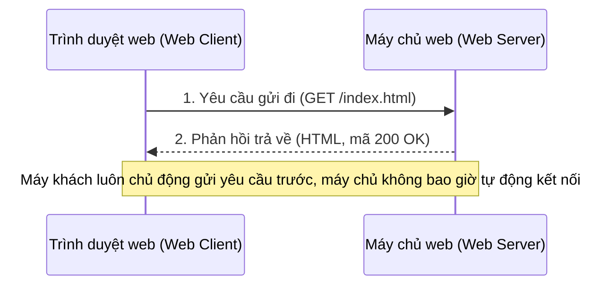
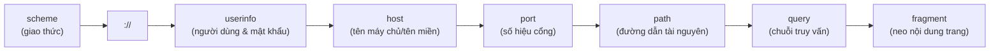
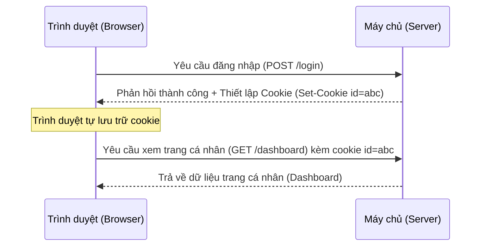
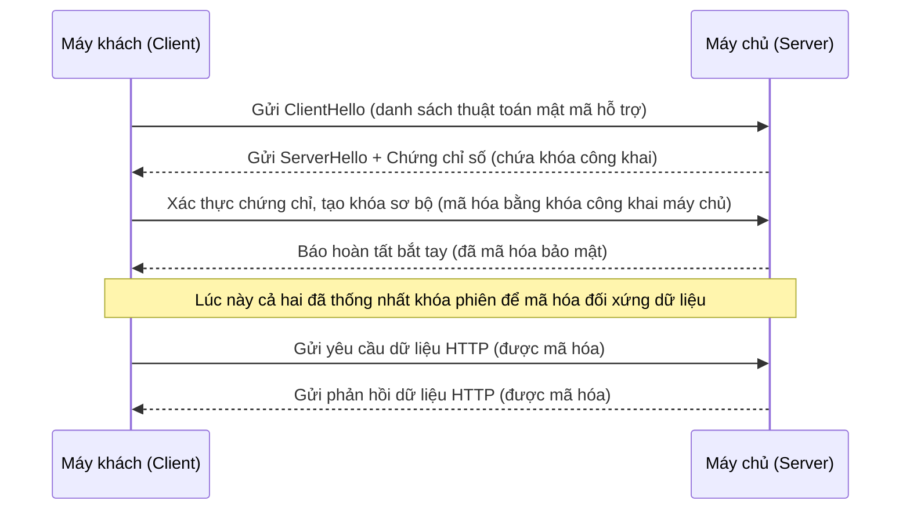
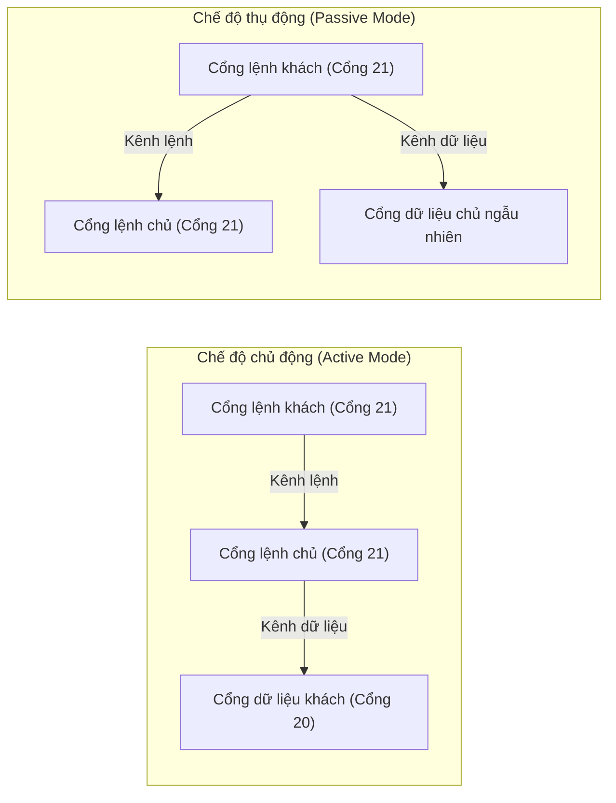
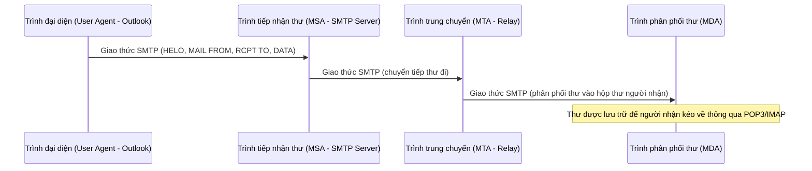
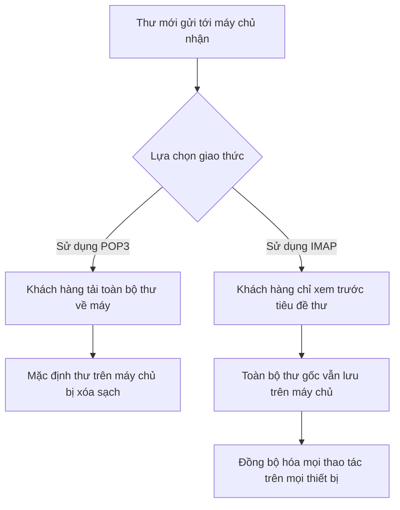
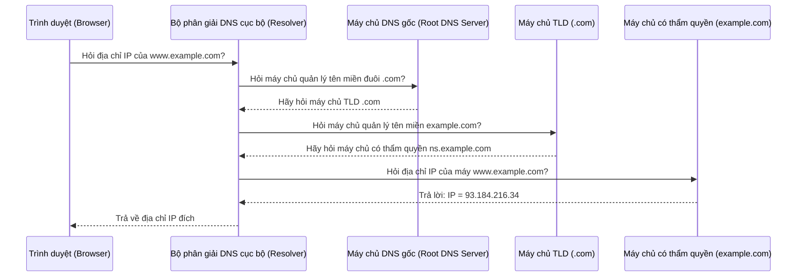
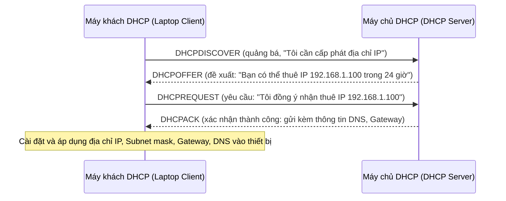

# Chương 7: Tầng Ứng dụng (Application Layer)

**Tầng Ứng dụng** (Application Layer - Lớp 7 trong mô hình OSI) là lớp nằm gần nhất với người sử dụng cuối cùng. Nó cung cấp các giao thức dịch vụ hỗ trợ các chương trình phần mềm giao tiếp trực tiếp qua mạng. Chương này trình bày đầy đủ các giao thức ứng dụng phổ biến và cốt lõi nhất—HTTP/HTTPS, FTP, SMTP, POP3/IMAP, DNS, DHCP—cùng các khái niệm nền tảng về mô hình kiến trúc Khách - Chủ, cấu trúc đường dẫn URL, và cơ chế quản lý trạng thái qua Cookies và Sessions.

---

## 1. Kiến trúc Khách - Chủ (Client‑Server Architecture)

**Định nghĩa:** Là mô hình kiến trúc ứng dụng phân tán, trong đó các nhiệm vụ truyền tải thông tin được phân chia rõ ràng giữa *bên cung cấp dịch vụ* (các máy chủ - servers) và *bên gửi yêu cầu dịch vụ* (các máy khách - clients).

- **Máy khách (Client)** – Là bên chủ động khởi tạo kết nối trước, gửi yêu cầu dữ liệu và chờ đợi phản hồi trả về. Máy khách chạy trực tiếp trên các thiết bị của người dùng.
- **Máy chủ (Server)** – Là hệ thống hoạt động liên tục 24/7, luôn lắng nghe các yêu cầu kết nối đi tới, xử lý và gửi lại phản hồi. Một máy chủ thường phục vụ đồng thời cho rất nhiều máy khách cùng một lúc.



**Ví dụ thực tế:**  
- **Máy khách:** Ứng dụng xem thời tiết trên chiếc điện thoại của bạn.  
- **Máy chủ:** Hệ thống API dự báo thời tiết chạy trên nền tảng đám mây (ví dụ: `api.weather.com`). Ứng dụng gửi yêu cầu hỏi nhiệt độ hiện tại, máy chủ tiếp nhận và phản hồi lại bằng chuỗi dữ liệu JSON.

---

## 2. Cấu trúc đường dẫn định vị tài nguyên URL (Uniform Resource Locator)

Đường dẫn URL là một chuỗi ký tự đặc biệt định dạng chuẩn dùng để định danh và chỉ ra vị trí chính xác của một tài nguyên trên mạng, đồng thời hướng dẫn máy khách phương thức để truy cập tài nguyên đó.



**Mô tả các thành phần cấu trúc (Ví dụ thực tế):**  
`https://alice:[email protected]:443/search?q=mermaid&lang=en#results`

| Thành phần | Giá trị cụ thể | Ý nghĩa và mục đích sử dụng |
|-----------|-------|---------|
| **giao thức** (scheme) | `https` | Chỉ định giao thức mạng sử dụng để giao tiếp (ở đây là HTTP bảo mật qua TLS) |
| **người dùng & mật khẩu** (user:password) | `alice:secret` | Dùng để xác thực thông tin tài khoản (trong thực tế duyệt web hiện đại rất ít khi dùng vì lý do bảo mật) |
| **tên máy chủ** (host) | `docs.example.com` | Tên miền (Domain name) hoặc địa chỉ IP vật lý của máy chủ chứa dữ liệu |
| **số hiệu cổng** (port) | `443` | Số cổng TCP kết nối dịch vụ (443 là cổng tiêu chuẩn mặc định của giao thức HTTPS) |
| **đường dẫn** (path) | `/search` | Vị trí thư mục/tệp tin chứa tài nguyên cụ thể nằm trên máy chủ |
| **chuỗi truy vấn** (query) | `q=mermaid&lang=en` | Các tham số tùy chọn dạng Khóa‑Giá trị truyền lên để hiển thị nội dung động |
| **neo nội dung** (fragment) | `results` | Chỉ định trực tiếp vị trí thanh cuộn hoặc mục cụ thể bên trong trang HTML (chỉ xử lý tại máy khách) |

> **Lưu ý bảo mật:** Việc đính kèm trực tiếp thông tin tài khoản mật khẩu (`userinfo`) trên đường dẫn URL hiện nay đã bị cấm hoặc khuyến cáo không sử dụng trên tất cả các trình duyệt web hiện đại vì lý do an toàn bảo mật.

---

## 3. Cơ chế Cookies và Sessions

Bản thân giao thức HTTP hoạt động theo cơ chế **không lưu trạng thái (stateless)** – nghĩa là mỗi yêu cầu gửi đi độc lập hoàn toàn và máy chủ không lưu giữ bất kỳ thông tin nào về các yêu cầu trước đó của bạn. Cơ chế Cookies và Sessions được sinh ra để duy trì trạng thái làm việc này.

### 3.1 Cơ chế Cookies

Cookie là những tệp văn bản nhỏ được lưu trữ cục bộ trực tiếp bởi trình duyệt web của bạn. Khi bạn truy cập vào một trang web, trình duyệt sẽ tự động gửi kèm các tệp cookie này trong tiêu đề của mỗi yêu cầu gửi đến tên miền tương ứng.

**Cơ chế hoạt động:**



**Các thuộc tính bảo mật quan trọng của Cookie:**
- `Expires` / `Max‑Age` – Định nghĩa thời gian sống, hạn sử dụng của Cookie.
- `Domain` / `Path` – Định nghĩa phạm vi hoạt động của Cookie (chỉ được gửi đến trang nào).
- `Secure` – Chỉ cho phép truyền tải tệp Cookie qua đường kết nối HTTPS mã hóa.
- `HttpOnly` – Ngăn cấm tuyệt đối các đoạn mã Javascript truy cập vào Cookie (cơ chế vô cùng quan trọng giúp ngăn chặn các cuộc tấn công kịch bản liên trang XSS).

### 3.2 Cơ chế Sessions

Một **phiên làm việc (Session)** đại diện cho một không gian lưu trữ thông tin tạm thời nằm trực tiếp ở **phía máy chủ (server-side)**, được liên kết chặt chẽ với một khóa duy nhất gọi là **ID phiên làm việc (session ID)** (mã ID này thường được gửi về máy khách và lưu trữ trong một tệp cookie). Máy chủ sẽ lưu giữ các thông tin chi tiết của người dùng (ví dụ: giỏ hàng, thông tin đăng nhập thành công), trong khi máy khách chỉ cần nắm giữ mã ID phiên làm việc gọn nhẹ.

**Ví dụ thực tế:**  
- Bạn chọn mua hàng trực tuyến $\rightarrow$ hệ thống session ID `xyz` trên máy chủ lưu dữ liệu `{giỏ_hàng: ["laptop", "chuột máy tính"]}`.  
- Trong các yêu cầu click tiếp theo, trình duyệt gửi kèm header `Cookie: sessionId=xyz` $\rightarrow$ máy chủ nhanh chóng truy xuất ra giỏ hàng chính xác của bạn.

---

## 4. Giao thức HTTP và HTTPS

### Giao thức truyền tải siêu văn bản HTTP (HyperText Transfer Protocol)
- **Cổng tiêu chuẩn:** Cổng 80 (truyền tải dạng văn bản thô không mã hóa).
- **Các phương thức chính (Methods):** GET (yêu cầu dữ liệu), POST (gửi dữ liệu lên), PUT (cập nhật), DELETE (xóa), v.v.
- **Các mã trạng thái phản hồi phổ biến (Status codes):** `200 OK` (thành công), `404 Not Found` (không tìm thấy trang), `500 Internal Server Error` (máy chủ gặp sự cố lỗi).

**Ví dụ một phiên trao đổi HTTP cơ bản:**
```
GET /index.html HTTP/1.1
Host: www.example.com
Accept: text/html
```
Máy chủ phản hồi:
```
HTTP/1.1 200 OK
Content-Type: text/html

<html>...
```

### Giao thức truyền tải siêu văn bản bảo mật HTTPS (HTTP Secure)
- **Cổng tiêu chuẩn:** Cổng 443.
- Bổ sung thêm một lớp mật mã hóa dữ liệu an toàn sử dụng giao thức **TLS/SSL** chạy giữa máy khách và máy chủ.
- Giúp bảo vệ dữ liệu chống lại các hành vi nghe trộm, giả mạo thông tin dọc đường đi, và xác thực danh tính máy chủ.

**Sơ đồ tối giản quá trình bắt tay thiết lập bảo mật TLS:**



**Ví dụ thực tế:** Tất cả các hệ thống giao dịch ngân hàng trực tuyến, thanh toán thương mại điện tử (Amazon, Shopee) luôn bắt buộc sử dụng giao thức bảo mật HTTPS để bảo vệ thông tin tài khoản và thẻ tín dụng của khách hàng.

---

## 5. Giao thức truyền tệp tin FTP (File Transfer Protocol)

- **Cổng tiêu chuẩn sử dụng song song:** Cổng 21 (dành cho việc truyền các câu lệnh điều khiển - control port) & Cổng 20 (dành cho việc truyền nhận dữ liệu thực tế - data port).
- **Mục đích:** Thực hiện tải lên (upload) và tải xuống (download) các tệp dữ liệu lớn giữa máy khách và máy chủ.
- **Xác thực:** Đăng nhập bằng tài khoản (Username/Password) hoặc truy cập ẩn danh (Anonymous).

**FTP hỗ trợ hai chế độ kết nối dữ liệu:**



**Các câu lệnh FTP kinh điển:**
- `USER`, `PASS` – Sử dụng để thực hiện đăng nhập.
- `RETR tên_tệp` – Tải tệp dữ liệu từ máy chủ về máy khách (Retrieve).
- `STOR tên_tệp` – Tải tệp dữ liệu từ máy khách lên máy chủ (Store).
- `LIST` – Hiển thị danh sách các tệp tin và thư mục trên máy chủ.

**Ví dụ:** Một lập trình viên sử dụng phần mềm FileZilla (máy khách FTP) để tải mã nguồn trang web lên máy chủ lưu trữ dịch vụ `ftp.example.com`.

> **Lưu ý bảo mật:** Giao thức FTP truyền thống không bảo mật (mật khẩu được truyền dưới dạng văn bản thô). Hiện nay, người ta ưu tiên sử dụng giao thức bảo mật thay thế như SFTP (SSH File Transfer Protocol) hoặc FTPS (FTP bảo mật qua TLS).

---

## 6. Giao thức truyền thư điện tử SMTP (Simple Mail Transfer Protocol)

- **Cổng tiêu chuẩn:** Cổng 25 (truyền tin tiêu chuẩn giữa các máy chủ), Cổng 587 (dành cho người dùng gửi thư lên hệ thống), Cổng 465 (dành cho SMTP bảo mật có mã hóa SMTPS).
- **Mục đích:** Hỗ trợ người dùng gửi thư điện tử lên máy chủ thư, và thực hiện chuyển tiếp thư điện tử qua lại giữa các máy chủ thư với nhau trên Internet.
- **Tính chất:** Là một **giao thức đẩy (push protocol)** – bên gửi chủ động đẩy dữ liệu sang bên nhận.

**Lộ trình di chuyển của một bức thư sử dụng SMTP:**



---

## 7. Giao thức tải thư điện tử POP3 và IMAP

Cả hai giao thức này đều đóng vai trò là **giao thức kéo (pull protocol)** – máy khách chủ động kết nối lên máy chủ bưu điện để kéo các bức thư điện tử về thiết bị đọc của mình.

| Đặc điểm so sánh | Giao thức POP3 (Post Office Protocol v3) | Giao thức IMAP (Internet Message Access Protocol) |
|---------|--------------------------------|------------------------------------------|
| **Cổng tiêu chuẩn** | Cổng 110 (thông thường), Cổng 995 (bảo mật SSL) | Cổng 143 (thông thường), Cổng 993 (bảo mật SSL) |
| **Cơ chế lưu trữ thư** | Tải toàn bộ thư về thiết bị và mặc định xóa thư gốc trên máy chủ bưu điện | Lưu giữ thư gốc an toàn trên máy chủ, đồng bộ hóa thư trên mọi thiết bị |
| **Hỗ trợ tạo thư mục** | Không hỗ trợ (chỉ sử dụng duy nhất một hộp thư đến Inbox) | Hỗ trợ quản lý và phân loại nhiều thư mục dữ liệu |
| **Xem thư ngoại tuyến** | Rất tốt (vì toàn bộ nội dung thư đã được tải về ổ cứng cục bộ) | Hạn chế (đòi hỏi phải có kết nối mạng để tải nội dung chi tiết) |

**Sơ đồ luồng xử lý thư:**



---

## 8. Hệ thống phân giải tên miền DNS (Domain Name System)

- **Cổng tiêu chuẩn:** Cổng 53 (sử dụng giao thức UDP cho các truy vấn nhanh thông thường, sử dụng TCP khi truyền vùng cơ sở dữ liệu lớn).
- **Mục đích:** Đóng vai trò như một danh bạ điện thoại của Internet, giúp biên dịch các tên miền dễ nhớ (ví dụ: `google.com`) thành địa chỉ IP vật lý của máy chủ chứa trang web (ví dụ: `142.250.190.46`).

**Quy trình các bước phân giải truy vấn tên miền DNS:**



**Các loại bản ghi DNS cốt lõi (Record types):**
- **Bản ghi A (Address Record):** Dùng để ánh xạ tên miền trực tiếp sang địa chỉ IPv4.
- **Bản ghi AAAA:** Dùng để ánh xạ tên miền sang địa chỉ IPv6.
- **Bản ghi CNAME (Canonical Name):** Dùng để tạo tên miền bí danh trỏ tới một tên miền gốc khác.
- **Bản ghi MX (Mail Exchange):** Chỉ định máy chủ đảm nhận nhiệm vụ tiếp nhận thư điện tử của tên miền đó.

---

## 9. Giao thức cấu hình động máy chủ DHCP (Dynamic Host Configuration Protocol)

- **Cổng tiêu chuẩn:** Cổng 67 (phía máy chủ lắng nghe), Cổng 68 (phía máy khách gửi).
- **Mục đích:** Tự động hóa hoàn toàn quá trình cấu hình card mạng của thiết bị (tự cấp phát địa chỉ IP khả dụng, subnet mask, địa chỉ cổng mặc định Default Gateway và địa chỉ IP của các máy chủ phân giải tên miền DNS).

**Tiến trình trao đổi DORA 4 bước của DHCP:**



---

## Bảng tổng hợp các giao thức tầng ứng dụng

| Giao thức | Số hiệu cổng | Chức năng chính | Giao thức tầng giao vận hỗ trợ |
|----------|---------|---------------|-----------|
| **HTTP** | 80 | Truyền siêu văn bản (trang web) dạng thông thường | TCP |
| **HTTPS** | 443 | Truyền siêu văn bản bảo mật có mã hóa an toàn | TCP (qua TLS/SSL) |
| **FTP** | 20, 21 | Hỗ trợ tải lên và tải xuống các tệp tin | TCP |
| **SMTP** | 25, 587 | Đẩy và chuyển tiếp thư điện tử đi | TCP |
| **POP3** | 110, 995 | Kéo thư điện tử về (tải về và xóa trên máy chủ) | TCP |
| **IMAP** | 143, 993 | Kéo và đồng bộ hóa thư điện tử trên nhiều máy | TCP |
| **DNS** | 53 | Phân giải tên miền thành địa chỉ IP vật lý | UDP (thường dùng), TCP |
| **DHCP** | 67, 68 | Tự động cấu hình và cấp phát IP động cho thiết bị | UDP |

---

## Tóm tắt chương

- **Tầng Ứng dụng** ẩn giấu đi toàn bộ sự phức tạp của việc truyền tin ở các tầng dưới (giao vận, mạng, liên kết dữ liệu, vật lý) để cung cấp cho người dùng một giao diện phần mềm đơn giản, dễ sử dụng.
- **Khách - Chủ (Client-Server)** là mô hình phổ biến và thống trị nhất hiện nay, ngoài ra còn có mô hình phân tán ngang hàng **Peer-to-Peer (P2P)** (ví dụ mạng chia sẻ BitTorrent).
- Các tiêu chuẩn **An toàn bảo mật** ngày càng được tích hợp sâu vào tầng ứng dụng (HTTPS, SMTPS, IMAPS, POP3S, DNSSEC) để bảo vệ quyền riêng tư của người dùng trên môi trường Internet.

Việc thấu hiểu bản chất và cơ chế hoạt động của các giao thức tầng ứng dụng là cực kỳ quan trọng đối với bất kỳ lập trình viên, kỹ sư mạng nào trong việc thiết kế phần mềm, quản trị hệ thống và xử lý sự cố.

---
