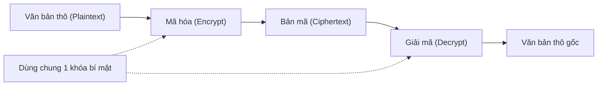
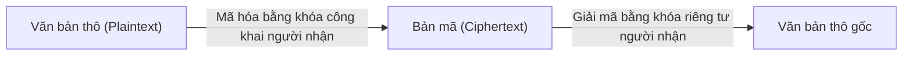
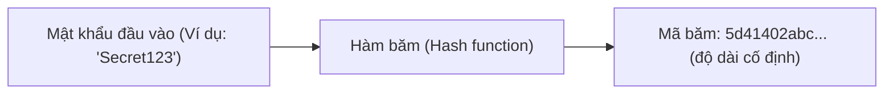
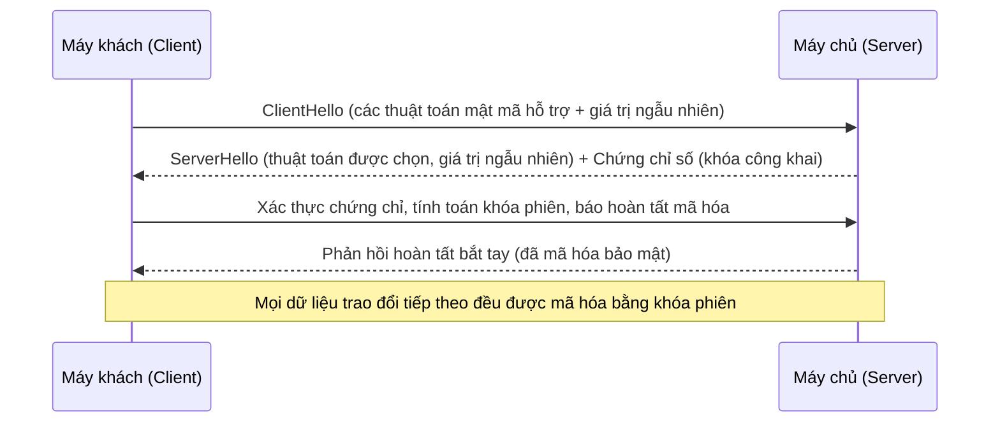
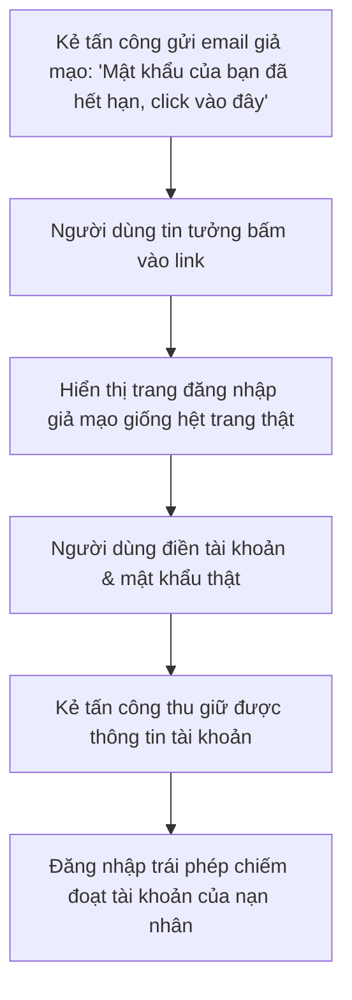
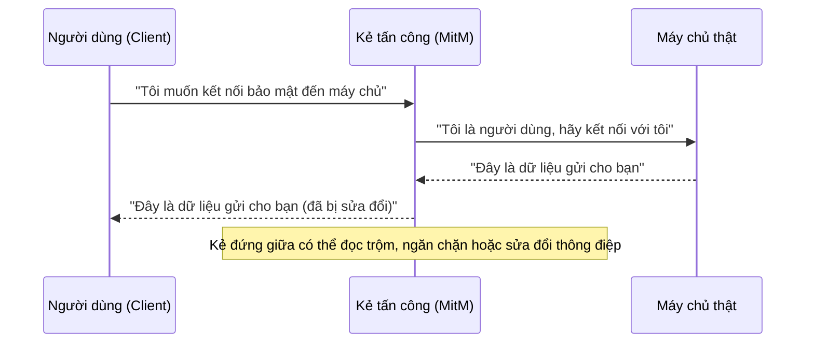
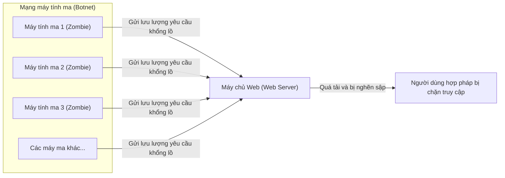
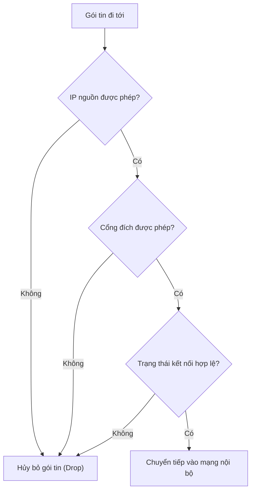
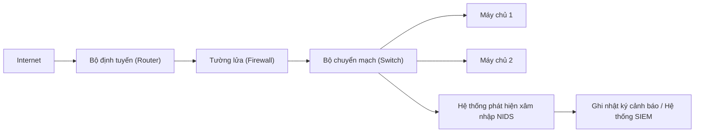

# Chương 8: Bảo mật mạng (Network Security)

Bảo mật mạng là tập hợp các phương pháp và kỹ thuật được thiết kế nhằm bảo vệ dữ liệu, thiết bị phần cứng và các luồng truyền thông tin khỏi các hành vi truy cập trái phép, lạm dụng hoặc phá hoại. Chương này sẽ trình bày về các mục tiêu cốt lõi của bảo mật, các khối gạch nền móng mã hóa mật mã học, các giao thức bảo mật mạng chính (SSL/TLS, HTTPS), các kiểu tấn công mạng phổ biến hiện nay (tấn công giả mạo, tấn công kẻ đứng giữa, DoS/DDoS) và các cơ chế phòng vệ hệ thống (tường lửa, hệ thống phát hiện xâm nhập).

---

## 8.1 Các mục tiêu bảo mật (Tam giác bảo mật CIA + Tính chống chối bỏ)

Các mục tiêu thiết kế bảo mật thường được tóm gọn qua mô hình **Tam giác bảo mật CIA**: **Tính bí mật (Confidentiality)**, **Tính toàn vẹn (Integrity)**, **Tính khả dụng (Availability)** – đi kèm với **Tính xác thực (Authentication)** và **Tính chống chối bỏ (Non‑repudiation)**.

```mermaid
mindmap
  root((Mục tiêu bảo mật))
    "Tính bí mật"
      "Chỉ bên có quyền mới đọc được dữ liệu"
      "Mật mã hóa (Encryption)"
    "Tính toàn vẹn"
      "Dữ liệu không bị chỉnh sửa trái phép"
      "Hàm băm & Chữ ký số"
    "Tính khả dụng"
      "Sẵn sàng phục vụ khi người dùng cần"
      "Dự phòng phần cứng & Chống DDoS"
    "Tính xác thực"
      "Xác minh danh tính thực tế"
      "Mật khẩu, Chứng chỉ, Sinh trắc học"
    "Chống chối bỏ"
      "Không thể phủ nhận hành vi đã làm"
      "Chữ ký số & Nhật ký hệ thống"
```

| Mục tiêu bảo mật | Ý nghĩa cốt lõi | Ví dụ ứng dụng thực tế |
|------|---------|--------------------|
| **Tính bí mật** (Confidentiality) | Đảm bảo dữ liệu không bị đọc trộm bởi bên thứ ba không được cấp quyền | Mã hóa tin nhắn trên WhatsApp để chỉ người nhận mới đọc được |
| **Tính toàn vẹn** (Integrity) | Đảm bảo dữ liệu không bị sửa đổi, xuyên tạc trái phép trong quá trình truyền đi | Sử dụng mã hash kiểm tra tệp tin tải về xem có bị chèn mã độc hay không |
| **Tính khả dụng** (Availability) | Đảm bảo hệ thống và dữ liệu luôn ở trạng thái sẵn sàng phục vụ khi cần | Trang web thương mại điện tử vẫn hoạt động mượt mà trong giờ cao điểm mua sắm |
| **Tính xác thực** (Authentication) | Xác minh chính xác danh tính của thực thể truy cập | Đăng nhập tài khoản ngân hàng yêu cầu mật khẩu kết hợp mã OTP gửi về điện thoại |
| **Tính chống chối bỏ** (Non‑repudiation) | Ngăn ngừa việc một bên phủ nhận các hành vi hoặc giao dịch họ đã thực hiện trước đó | Hợp đồng giao dịch có chữ ký số – bên gửi không thể chối rằng mình không ký |

---

## 8.2 Mã hóa học (Cryptography)

Mật mã học (Cryptography) là khoa học bảo vệ thông tin bằng cách chuyển đổi dữ liệu gốc (văn bản thô - plaintext) thành dạng không thể đọc được (bản mã - ciphertext) và giải mã ngược lại.

### 8.2.1 Mã hóa khóa đối xứng (Symmetric Key Encryption)

- Sử dụng **cùng một khóa duy nhất** cho cả hai quá trình mã hóa dữ liệu ở bên gửi và giải mã dữ liệu ở bên nhận.
- Tốc độ xử lý cực kỳ nhanh và hiệu quả, tối ưu cho việc truyền tải lượng dữ liệu khổng lồ.
- **Thách thức:** Làm thế nào để chia sẻ và truyền khóa mật mật an toàn giữa hai bên mà không bị lộ dọc đường đi.



**Các thuật toán phổ biến:** AES (Advanced Encryption Standard - Tiêu chuẩn mã hóa tiên tiến), ChaCha20, DES (thế hệ cũ, không còn an toàn).

**Ví dụ thực tế:**  
- Tính năng mã hóa toàn bộ ổ cứng BitLocker của Windows (sử dụng thuật toán AES).  
- Cơ chế bảo mật sóng Wi‑Fi WPA2/WPA3 sử dụng mã hóa AES để bảo vệ tính bí mật cho luồng dữ liệu truyền.

### 8.2.2 Mã hóa khóa bất đối xứng (Asymmetric Key Encryption / Public Key)

- Sử dụng một **cặp khóa đi kèm nhau**: gồm **Khóa công khai (Public key)** (có thể chia sẻ công khai rộng rãi) và **Khóa riêng tư (Private key)** (bắt buộc phải giữ bí mật tuyệt đối).
- Dữ liệu khi đã được mã hóa bằng **khóa công khai** của một người thì **chỉ có thể giải mã** bằng chính **khóa riêng tư** tương ứng duy nhất của người đó.
- Tốc độ xử lý chậm hơn rất nhiều so với mã hóa đối xứng; do đó thường chỉ được dùng trong pha bắt tay thiết lập ban đầu để trao đổi khóa đối xứng (session key).



**Các thuật toán phổ biến:** RSA, ECC (Elliptic Curve Cryptography - Mã hóa đường cong Elliptic).

**Ứng dụng thực tế:**  
- Giao thức HTTPS: Trình duyệt sử dụng khóa công khai của máy chủ để truyền đi khóa phiên làm việc bí mật (trong pha bắt tay TLS).  
- Mã hóa bảo mật thư điện tử (PGP).  
- Tạo chữ ký số (ký xác nhận bằng khóa riêng tư của mình, người khác kiểm tra bằng khóa công khai của mình).

### 8.2.3 Các hàm băm (Hash Functions)

- Là hàm toán học **một chiều (one-way)**: Đưa bất kỳ chuỗi dữ liệu đầu vào nào có độ dài tùy ý qua hàm băm đều thu được chuỗi đầu ra có độ dài cố định duy nhất (gọi là mã băm/dấu vân tay dữ liệu).
- Không thể đảo ngược mã băm để khôi phục lại dữ liệu gốc ban đầu.
- Một dữ liệu đầu vào cụ thể luôn luôn tạo ra một mã băm duy nhất giống nhau.
- Chỉ cần thay đổi một ký tự cực nhỏ ở đầu vào cũng sẽ tạo ra một mã băm đầu ra hoàn toàn khác biệt (hiệu ứng thác đổ - avalanche effect).



**Các thuật toán phổ biến:** SHA‑256, SHA‑3, MD5 (đã bị bẻ gãy, không còn an toàn).

**Ứng dụng thực tế:**
- **Lưu trữ mật khẩu an toàn:** Các cơ sở dữ liệu luôn lưu trữ mật khẩu dưới dạng mã băm thay vì văn bản thô. Khi người dùng đăng nhập, hệ thống băm mật khẩu vừa nhập và so sánh đối chiếu kết quả băm với cơ sở dữ liệu.
- **Kiểm tra tính toàn vẹn:** Khi tải xuống một tệp tin lớn kèm theo mã SHA‑256 của nó, bạn chạy băm tệp vừa tải về, nếu khớp mã SHA‑256 nghĩa là tệp tải về an toàn và trọn vẹn.
- **Chữ ký số:** Tiến hành băm tài liệu trước, sau đó ký xác nhận trên mã băm (nhanh hơn nhiều so với việc ký trên toàn bộ tài liệu dung lượng lớn).

---

## 8.3 Các giao thức bảo mật: SSL/TLS và HTTPS

### 8.3.1 Giao thức TLS / SSL (Transport Layer Security)

- Giao thức **SSL** (Secure Sockets Layer) hiện nay đã lỗi thời; thế hệ kế cận hiện đại hơn là **TLS** (Transport Layer Security) là tiêu chuẩn bảo mật mạng ngày nay.
- Hoạt động chèn giữa Tầng Ứng dụng (như HTTP) và Tầng Giao vận (TCP).
- Cung cấp 3 tính năng bảo mật thiết yếu: tính bí mật (mã hóa dữ liệu), tính toàn vẹn (sử dụng mã xác thực thông điệp), và xác thực danh tính (sử dụng chứng chỉ số).

**Sơ đồ tối giản quá trình bắt tay TLS 1.3:**



**Chứng chỉ số (Digital Certificate):** Là một tệp điện tử dùng để liên kết tên miền cụ thể với một khóa công khai xác định, được ký xác nhận kỹ thuật số bởi các cơ quan chứng thực đáng tin cậy gọi là **Tổ chức chứng thực chữ ký số (Certificate Authority - CA)** (ví dụ: Let's Encrypt, DigiCert).

### 8.3.2 Giao thức HTTPS (HTTP Secure)

- **Cổng kết nối mặc định:** Cổng 443.
- Toàn bộ các thông điệp HTTP thông thường được đóng gói truyền bên trong một đường ống TLS bảo mật tuyệt đối.
- Giúp bảo vệ người dùng chống lại các hành vi nghe trộm (ISP hay bên thứ ba không thể thấy bạn đang tìm gì), chống lại việc sửa đổi trái phép (không bị ISP chèn quảng cáo bẩn), và chống giả mạo (bảo đảm bạn đang truy cập đúng trang chủ của `paypal.com`).

---

## 8.4 Các kiểu tấn công mạng phổ biến

### 8.4.1 Tấn công giả mạo (Phishing)

- Kẻ tấn công giả danh là một tổ chức đáng tin cậy (ngân hàng, dịch vụ hỗ trợ kỹ thuật) để lừa đảo người dùng cung cấp thông tin tài khoản đăng nhập, số thẻ tín dụng hoặc lừa nhấp vào đường liên kết cài đặt mã độc.
- Thường được gửi thông qua các kênh thư điện tử email, tin nhắn SMS (smishing), hoặc qua các trang web giả mạo.



**Các cơ chế ngăn ngừa:**  
- Luôn kiểm tra kỹ địa chỉ email người gửi và cấu trúc tên miền URL trên thanh địa chỉ trình duyệt.  
- Kích hoạt cơ chế xác thực nhiều lớp (MFA).  
- Đào tạo nâng cao nhận thức bảo mật cho nhân viên.

### 8.4.2 Tấn công kẻ đứng giữa (Man‑in‑the‑Middle - MitM)

- Kẻ tấn công âm thầm len lỏi vào giữa đường truyền để nghe lén, đánh cắp hoặc cố tình sửa đổi thông tin trao đổi giữa máy khách và máy chủ mà cả hai bên hoàn toàn không hay biết.
- Thường xảy ra khi người dùng kết nối vào mạng Wi‑Fi công cộng không có mật khẩu (kẻ tấn công dựng trạm phát sóng Wi‑Fi giả mạo có tên giống hệt), hoặc qua các kỹ thuật ARP spoofing (giả mạo địa chỉ ARP).



**Các cơ chế ngăn ngừa:**  
- Bắt buộc sử dụng giao thức HTTPS đi kèm cơ chế kiểm tra tính hợp lệ của chứng chỉ số nghiêm ngặt.  
- Tuyệt đối không giao dịch tài chính trên mạng Wi‑Fi công cộng nếu không sử dụng kết nối VPN mã hóa.

### 8.4.3 Tấn công từ chối dịch vụ DoS và DDoS

- **Tấn công DoS (Denial of Service):** Một nguồn tấn công duy nhất dồn dập gửi lượng yêu cầu khổng lồ tới máy chủ mục tiêu nhằm làm cạn kiệt tài nguyên mạng và khiến máy chủ bị treo, sập.
- **Tấn công DDoS (Distributed Denial of Service):** Sử dụng hàng ngàn, hàng triệu máy tính bị nhiễm mã độc nằm rải rác khắp nơi (gọi là mạng máy tính ma - botnet) đồng loạt dội bom lưu lượng khổng lồ vào mục tiêu theo một kịch bản phối hợp thống nhất.

Các phân loại tấn công chính:
- **Tấn công lưu lượng lớn (Volumetric):** Làm nghẽn hoàn toàn đường truyền băng thông của mục tiêu (ví dụ: tấn công dội bom gói tin UDP, gói tin ICMP).
- **Tấn công giao thức (Protocol):** Khai thác các kẽ hở của các giao thức mạng để làm cạn kiệt tài nguyên kết nối (ví dụ: tấn công lũ lụt SYN flood).
- **Tấn công tầng ứng dụng (Application layer):** Gửi các yêu cầu HTTP phức tạp và duy trì kết nối cực chậm để vắt kiệt năng lực xử lý CPU/RAM của máy chủ.



**Các cơ chế ngăn ngừa:**  
- Triển khai các hệ thống tường lửa cứng, IPS lọc lưu lượng và giới hạn tần suất yêu cầu (rate limiting).  
- Sử dụng các mạng lưới phân phối nội dung toàn cầu (CDN) có quy mô cực lớn (ví dụ: Cloudflare) để hấp thụ và giảm thiểu lưu lượng tấn công DDoS.

---

## 8.5 Các cơ chế phòng vệ hệ thống

### 8.5.1 Tường lửa (Firewalls)

Tường lửa là một hệ thống thiết bị phần cứng hoặc phần mềm chuyên dụng đóng vai trò giám sát, lọc bỏ hoặc chuyển tiếp các luồng dữ liệu đi vào/đi ra hệ thống dựa trên một tập hợp các quy tắc bảo mật được thiết lập từ trước.

**Các loại tường lửa chính:**

| Phân loại | Cơ chế hoạt động | Ví dụ điển hình |
|------|--------------|---------|
| **Lọc gói tin** (Packet filtering) | Chỉ kiểm tra thông tin tiêu đề của gói tin (địa chỉ IP nguồn/đích, số hiệu cổng, giao thức) | iptables của Linux, Windows Defender Firewall |
| **Kiểm tra trạng thái kết nối** (Stateful inspection) | Theo dõi toàn bộ quá trình thiết lập và duy trì trạng thái của phiên kết nối để tự động cho phép luồng phản hồi đi qua | Hầu hết các hệ thống tường lửa doanh nghiệp hiện đại |
| **Tường lửa thế hệ mới** (Next‑Gen Firewall - NGFW) | Có khả năng phân tích gói tin sâu (Deep Packet Inspection), đọc hiểu dữ liệu ở tầng ứng dụng để chặn các kiểu SQL Injection, chặn web đen | Thiết bị tường lửa của hãng Palo Alto, Fortinet |

**Sơ đồ thuật toán lọc gói tin của tường lửa:**



### 8.5.2 Hệ thống phát hiện xâm nhập IDS (Intrusion Detection Systems)

- Hệ thống **IDS** hoạt động thụ động, liên tục lắng nghe và phân tích lưu lượng bản sao của đường truyền để phát hiện và đưa ra cảnh báo khẩn cấp khi thấy có dấu hiệu tấn công hoặc hành vi bất thường xảy ra.
- IDS **không trực tiếp ngăn chặn hay can thiệp** vào luồng dữ liệu truyền (khác với hệ thống ngăn ngừa xâm nhập **IPS**).

Có hai cơ chế phát hiện chính:
1. **Phát hiện dựa trên dấu hiệu nhận dạng (Signature‑based):** So sánh dữ liệu với kho dữ liệu các mẫu tấn công đã biết từ trước. Xử lý rất nhanh nhưng bất lực trước các kiểu tấn công mới lạ chưa có định nghĩa (lỗi zero‑day).
2. **Phát hiện dựa trên hành vi bất thường (Anomaly‑based):** Tự động xây dựng mô hình hành vi hoạt động bình thường của hệ thống mạng, sau đó đưa ra cảnh báo nếu thấy có bất kỳ lưu lượng nào lệch chuẩn. Có khả năng phát hiện tấn công mới nhưng dễ đưa ra cảnh báo giả (false positive).

**Mô hình triển khai IDS trong mạng nội bộ:**



---

## Bảng tổng hợp các chủ đề bảo mật

| Khái niệm | Ý tưởng cốt lõi | Công cụ / Giao thức thực tế |
|-------|-------------|--------------------------|
| **Tính bí mật** | Giữ kín dữ liệu không cho đọc trộm | Sử dụng mã hóa AES, TLS |
| **Tính toàn vẹn** | Phát hiện các sửa đổi dữ liệu trái phép | Sử dụng các hàm băm SHA‑256, HMAC |
| **Tính xác thực** | Xác minh danh tính của thực thể truy cập | Hệ thống mật khẩu, OTP nhiều lớp |
| **Chống chối bỏ** | Bảo đảm tính cam kết hành vi | Chữ ký số RSA kết hợp hàm băm |
| **Mã hóa đối xứng** | Dùng chung 1 khóa cho cả hai đầu | Thuật toán mã hóa AES‑256 |
| **Mã hóa bất đối xứng** | Sử dụng cặp khóa công khai và riêng tư | Thuật toán RSA, ECC |
| **Hàm băm** | Tạo dấu vân tay một chiều cho dữ liệu | Thuật toán SHA‑256 |
| **TLS/SSL** | Thiết lập đường ống mã hóa bảo mật | Giao thức HTTPS (Cổng 443) |
| **DoS/DDoS** | Dội bom lưu lượng làm nghẽn sập hệ thống | Mạng botnet máy tính ma, SYN flood |
| **Tường lửa** | Lọc gói tin và phân quyền truy cập | pfSense, iptables |
| **Hệ thống IDS** | Theo dõi, giám sát và cảnh báo xâm nhập | Phần mềm Snort, Suricata |

---

## Các lưu ý bảo mật cuối cùng

- **Phòng vệ theo chiều sâu (Defence in depth):** Luôn xây dựng hệ thống bảo mật qua nhiều lớp bổ trợ lẫn nhau (như tường lửa kết hợp IDS, kết hợp mã hóa dữ liệu ở tầng giao vận và áp dụng chính sách xác thực đa nhân tố chặt chẽ).
- **Không có giải pháp hoàn hảo tuyệt đối:** Bảo mật mạng là sự phối hợp chặt chẽ giữa các yếu tố: Con người, Quy trình vận hành và Công nghệ.
- **Mối đe dọa luôn phát triển:** Liên tục cập nhật các bản vá lỗi phần mềm, theo dõi nhật ký hoạt động hệ thống thường xuyên và chuẩn bị sẵn các kịch bản phản ứng khi có sự cố xảy ra.

---
