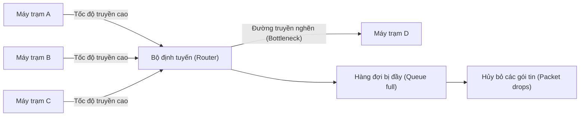
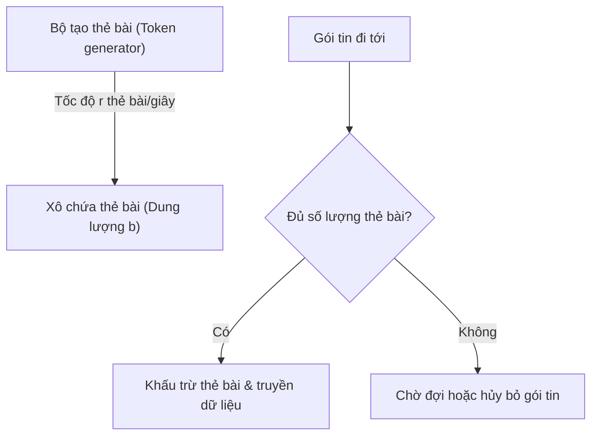
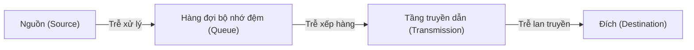
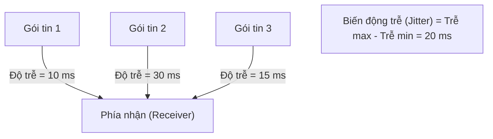
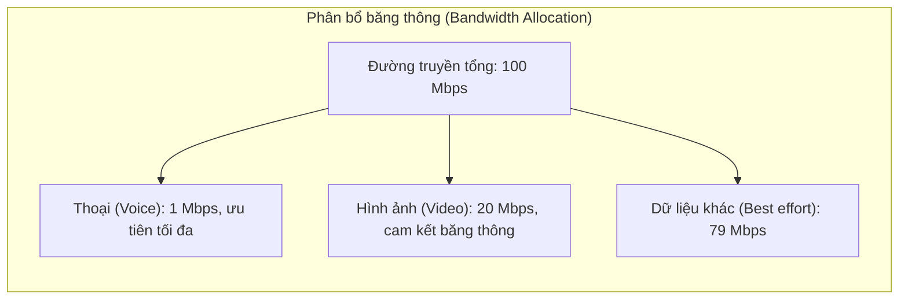

# Chương 9: Kiểm soát tắc nghẽn và Chất lượng dịch vụ (Congestion Control and QoS)

Tài liệu này cung cấp cái nhìn tổng quan về các cơ chế kiểm soát tắc nghẽn, thuật toán điều phối lưu lượng (traffic shaping) và các thông số chất lượng dịch vụ QoS (Quality of Service) cốt lõi trong mạng máy tính, đi kèm các sơ đồ minh họa Mermaid trực quan và các ví dụ thực tiễn.

---

## 9.1 Các nguyên nhân gây tắc nghẽn (Causes of Congestion)

Hiện tượng nghẽn mạng (tắc nghẽn) xảy ra khi tổng nhu cầu sử dụng tài nguyên mạng của các thiết bị vượt quá năng lực xử lý hoặc băng thông vật lý khả dụng của mạng. Các nguyên nhân phổ biến:

- **Lưu lượng tăng đột biến (High traffic bursts):** Lượng dữ liệu dồn dập gửi đi từ nhiều nguồn cùng lúc trong thời gian ngắn.
- **Băng thông đường truyền không đủ:** Các liên kết mạng tốc độ thấp trở thành nút thắt cổ chai (bottleneck) giới hạn hệ thống.
- **Tràn bộ đệm tại các router (Buffer overflow):** Các hàng đợi trong bộ nhớ của router bị lấp đầy khiến các gói tin đi tới tiếp theo buộc phải bị hủy bỏ (dropped).
- **Tốc độ xử lý của phía nhận quá chậm:** Phía nhận không kịp tiêu thụ dữ liệu gửi đến.
- **Cơ chế truyền lại:** Việc truyền lại các gói tin bị mất vô hình trung lại bơm thêm nhiều lưu lượng vào mạng, làm trầm trọng hơn tình trạng tắc nghẽn.

### Sơ đồ kịch bản nghẽn mạng:



---

## 9.2 Thuật toán điều phối lưu lượng (Traffic Shaping)

Điều phối lưu lượng là kỹ thuật kiểm soát tốc độ và tính đột biến của dòng dữ liệu truyền tải nhằm làm mịn lưu lượng và ngăn ngừa tắc nghẽn mạng.

### 9.2.1 Thuật toán xô rò (Leaky Bucket)

Thuật toán **Xô rò (Leaky Bucket)** ép buộc dòng dữ liệu đi ra mạng luôn duy trì ở một tốc độ cố định hoàn toàn ổn định, không phụ thuộc vào tính đột biến hay tốc độ của dòng dữ liệu đầu vào. Thuật toán này hoạt động tương tự như một chiếc xô nước bị thủng một lỗ nhỏ cố định ở đáy:

- Các gói tin đầu vào đi tới tự do với bất kỳ tốc độ nào.
- Chúng được đưa vào xếp hàng trong một bộ đệm (đóng vai trò là chiếc xô).
- Chiếc xô sẽ "rò rỉ" (truyền các gói dữ liệu ra mạng) với một tốc độ cố định hoàn toàn không đổi.
- Nếu lượng gói tin đầu vào quá nhanh làm tràn xô, các gói tin tràn ra ngoài lập tức bị hủy bỏ.

```mermaid
graph TD
    A["Các gói tin đi tới tự do"] --> B["Xô chứa / Hàng đợi (Queue)"]
    B -->|Tốc độ xả cố định (Fixed leak rate)| C["Mạng truyền thông"]
    D["Hiện tượng tràn xô (Overflow)"] -->|Hủy bỏ| E["Các gói tin bị hủy bỏ"]
```

**Ví dụ:**  
Một router được thiết lập thuật toán xô rò có kích thước chứa tối đa là 5 gói tin và tốc độ xả rò rỉ là 1 gói tin/giây. Nếu có 10 gói tin đồng loạt đi tới cùng một lúc: 5 gói tin đầu tiên sẽ được đưa vào hàng đợi xếp hàng chờ truyền đi tuần tự (mỗi giây truyền 1 gói), trong khi 5 gói tin còn lại do vượt quá dung lượng chứa sẽ bị hủy bỏ ngay lập tức.

### 9.2.2 Thuật toán xô thẻ bài (Token Bucket)

Thuật toán **Xô thẻ bài (Token Bucket)** cho phép truyền dữ liệu tăng đột biến (bursty traffic) trong một giới hạn nhất định trong khi vẫn đảm bảo kiểm soát tốt tốc độ truyền trung bình dài hạn. Các thẻ bài (tokens) được sinh ra và đưa vào xô chứa với một tốc độ không đổi. Một gói tin chỉ được phép truyền ra mạng khi và chỉ khi có đủ số lượng thẻ bài cần thiết trong xô.

- Xô chứa có thể lưu trữ tối đa $b$ thẻ bài (quyết định kích thước truyền đột biến tối đa).
- Các thẻ bài được tự động sinh ra đều đặn với tốc độ $r$ thẻ bài/giây.
- Mỗi gói dữ liệu khi truyền đi sẽ tiêu thụ một lượng $t$ thẻ bài (thông thường quy ước 1 thẻ bài cho 1 byte dữ liệu hoặc 1 gói tin).
- Nếu xô chứa đã chứa đầy thẻ bài, các thẻ bài sinh ra tiếp theo sẽ bị hủy bỏ.



**Ví dụ:**  
Thiết lập xô thẻ bài có tốc độ sinh $r = 1\text{ Mbps}$ và dung lượng xô chứa $b = 1\text{ MB}$. Khi có nhu cầu, hệ thống được phép gửi ngay lập tức tối đa $1\text{ MB}$ dữ liệu ra mạng trong tích tắc (bằng cách tiêu thụ hết các thẻ bài tích lũy trong xô), sau đó dòng dữ liệu tiếp theo bắt buộc phải duy trì ổn định ở tốc độ $1\text{ Mbps}$. Cơ chế này rất tối ưu cho các luồng dữ liệu tương tác yêu cầu truyền bùng nổ tức thời nhưng vẫn giữ an toàn cho mạng trong dài hạn.

### So sánh: Thuật toán Xô rò vs Xô thẻ bài

| Đặc điểm so sánh | Thuật toán xô rò (Leaky Bucket) | Thuật toán xô thẻ bài (Token Bucket) |
|-----------------------|----------------------------------|----------------------------------|
| **Tốc độ truyền đầu ra** | Luôn luôn duy trì ở mức cố định hoàn toàn | Biến thiên, có thể truyền đột biến tốc độ cao |
| **Xử lý lưu lượng đột biến** | Tuyệt đối không cho phép truyền đột biến | Cho phép truyền đột biến trong phạm vi dung lượng xô |
| **Tốc độ trung bình dài hạn**| Giới hạn bởi tốc độ xả nước ở đáy xô | Giới hạn bởi tốc độ sinh thẻ bài của hệ thống |
| **Hành vi khi quá tải** | Gói dữ liệu bị hủy ngay khi đầy bộ đệm | Không hủy dữ liệu (gói tin xếp hàng chờ sinh đủ thẻ bài hoặc bị hủy tùy cấu hình) |

---

## 9.3 Chất lượng dịch vụ (Quality of Service - QoS)

QoS đại diện cho năng lực phân cấp và cung cấp các mức độ ưu tiên xử lý khác nhau cho từng phân loại lưu lượng dữ liệu khác nhau, nhằm đảm bảo hiệu năng hoạt động ổn định và có thể dự đoán trước của hệ thống mạng.

### 9.3.1 Độ trễ (Delay / Latency)

Độ trễ là khoảng thời gian cần thiết để một gói tin di chuyển từ nguồn gửi đến đích nhận. Tổng độ trễ là sự kết hợp của bốn thành phần trễ vật lý:

- **Trễ xử lý (Processing delay):** Thời gian thiết bị mạng kiểm tra lỗi bit và đọc tiêu đề gói tin để đưa ra quyết định định tuyến.
- **Trễ xếp hàng (Queuing delay):** Thời gian gói tin phải nằm chờ trong hàng đợi bộ nhớ đệm của cổng ra.
- **Trễ truyền dẫn (Transmission delay):** Thời gian cần thiết để đẩy toàn bộ các bit của gói dữ liệu lên đường truyền vật lý (phụ thuộc băng thông).
- **Trễ lan truyền (Propagation delay):** Thời gian để tín hiệu vật lý lan truyền dọc theo dây dẫn đến đích (phụ thuộc vận tốc ánh sáng/điện trong môi trường vật lý).



**Ví dụ thực tế:** Trong các trò chơi trực tuyến, nếu độ trễ khứ hồi (ping) vượt quá $100\text{ ms}$ người chơi sẽ bắt đầu nhận thấy hiện tượng giật lag; nếu vượt quá $200\text{ ms}$, trò chơi hầu như không thể tương tác chính xác.

### 9.3.2 Biến động trễ (Jitter)

Jitter là mức độ biến động hoặc sai lệch về thời gian đi tới của các gói tin liên tiếp. Chỉ số Jitter cao gây ảnh hưởng nghiêm trọng đến các ứng dụng truyền thông thời gian thực (như gọi thoại VoIP, họp trực tuyến) do các gói âm thanh/hình ảnh đi đến đích với các khoảng thời gian không đồng đều, gây nên hiện tượng tiếng bị méo hoặc mất hình.



### 9.3.3 Băng thông (Bandwidth)

Băng thông là tốc độ truyền dữ liệu tối đa (thông lượng lý thuyết) của một tuyến đường truyền mạng, đo bằng đơn vị bit trên giây (bps). Mỗi loại hình ứng dụng sẽ có những yêu cầu đặc thù về băng thông:

| Ứng dụng | Băng thông yêu cầu | Mức độ nhạy cảm với chất lượng mạng |
|-------------------|--------------------|----------------------|
| **Thư điện tử / Lướt Web** | < 1 Mbps           | Thấp (chấp nhận trễ và jitter cao) |
| **Truyền phát Video trực tuyến** | 3 – 25 Mbps        | Trung bình (đòi hỏi băng thông ổn định) |
| **Gọi điện Video chất lượng 4K** | 15 – 30 Mbps       | Rất cao (yêu cầu độ trễ và jitter cực thấp) |
| **Tải tệp tin dung lượng lớn** | > 100 Mbps         | Thấp (chỉ cần băng thông rộng để tải nhanh) |



---

## Tóm tắt chương

- **Nghẽn mạng (Tắc nghẽn)** phát sinh khi nhu cầu sử dụng tài nguyên mạng vượt quá khả năng đáp ứng vật lý của hệ thống; các cơ chế điều phối và kỹ thuật QoS giúp giảm thiểu tối đa hiện tượng này.
- Thuật toán **Xô rò** giúp ép luồng dữ liệu ra mạng luôn ổn định ở một tốc độ cố định tuyệt đối, trong khi **Xô thẻ bài** linh hoạt hơn khi cho phép truyền bùng nổ đột biến tốc độ cao trong một phạm vi an toàn kiểm soát được.
- Các thông số **QoS** (trễ, biến động trễ jitter, băng thông) xác định kỳ vọng về chất lượng dịch vụ mạng. Các ứng dụng tương tác thời gian thực đặc biệt nhạy cảm với các vấn đề liên quan đến trễ và jitter.

Các cơ chế này được hiện thực hóa trong các kiến trúc mạng hiện đại (ví dụ: DiffServ, cơ chế giám sát lưu lượng và quản lý hàng đợi chủ động như thuật toán RED) để đảm bảo tính công bằng và tin cậy cao cho toàn mạng.

---
