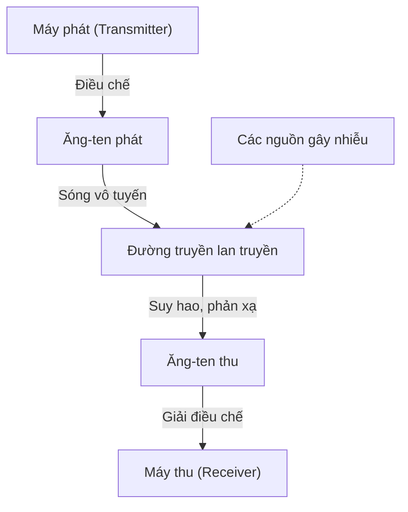
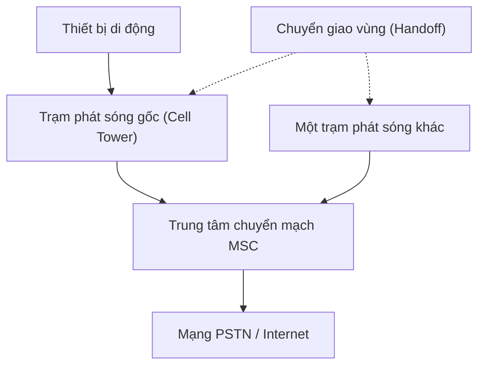
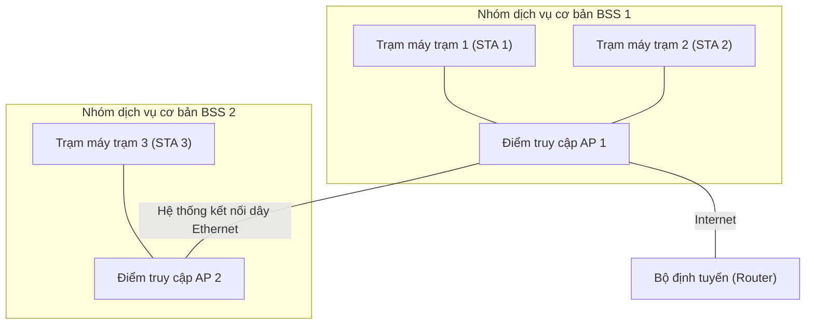
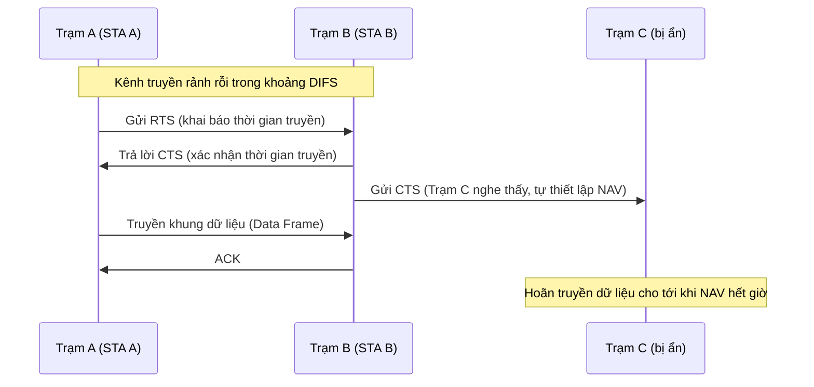
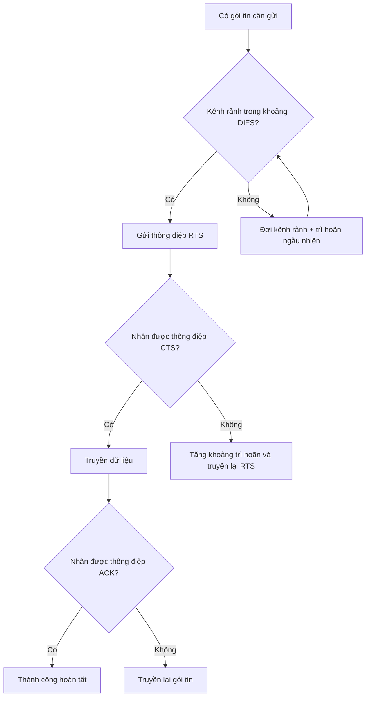
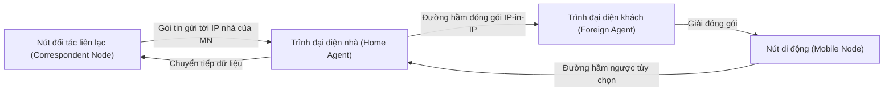

# Chương 10: Mạng không dây và di động (Wireless and Mobile Networks)

Chương này trình bày các khái niệm nền tảng về truyền thông không dây, mạng thông tin di động tế bào, kiến trúc mạng không dây Wi-Fi (chuẩn IEEE 802.11) bao gồm cơ chế kiểm soát truy cập kênh truyền dùng chung (CSMA/CA), và cái nhìn tổng quan cơ bản về giao thức định tuyến di động Mobile IP.

---

## 10.1 Khái niệm cơ bản về truyền thông không dây

Truyền thông không dây thực hiện truyền tải dữ liệu thông qua môi trường không khí sử dụng các sóng điện từ (sóng vô tuyến, sóng cực ngắn, tia hồng ngoại). Các thách thức vật lý cốt lõi:

- **Sự suy hao tín hiệu (Signal attenuation):** Cường độ tín hiệu bị yếu dần đi theo khoảng cách truyền vật lý và khi gặp các vật cản (tường, tòa nhà).
- **Hiện tượng nhiễu sóng (Interference):** Khi có nhiều thiết bị phát sóng hoạt động trên cùng một tần số sẽ gây xung đột tín hiệu.
- **Lan truyền đa đường (Multipath propagation):** Tín hiệu vô tuyến bị phản xạ qua các bề mặt vật cản khác nhau dẫn tới việc các bản sao tín hiệu truyền tới ăng-ten thu tại các thời điểm lệch nhau.
- **Vấn đề nút ẩn (Hidden terminal/node problem):** Kịch bản hai trạm máy phát nằm quá xa nhau nên không thể nghe thấy sóng của nhau, nhưng cả hai đều nằm trong vùng sóng của một điểm truy cập trung gian, dẫn tới việc cả hai đồng thời phát và gây xung đột tại điểm trung gian.
- **Tỷ số tín hiệu trên nhiễu (SNR):** Chỉ số SNR càng cao biểu thị chất lượng đường truyền sóng càng tốt, hỗ trợ tốc độ truyền dữ liệu cao hơn.

### So sánh: Mạng có dây vs Mạng không dây

| Đặc điểm | Mạng có dây (Ethernet) | Mạng không dây (Wi-Fi) |
|-----------------------|-------------------------|---------------------------|
| **Phương tiện truyền dẫn** | Dây cáp đồng hoặc sợi cáp quang | Không khí (Sóng vô tuyến RF) |
| **Phát hiện xung đột** | Sử dụng cơ chế CSMA/CD rất dễ dàng | Rất khó phát hiện khi đang phát sóng (half-duplex) |
| **Mức độ nhiễu sóng** | Rất thấp (cáp được bọc bảo vệ) | Rất cao (nhiễu từ thời tiết, thiết bị khác) |
| **Tính cơ động** | Bị giới hạn nghiêm ngặt bởi chiều dài dây | Di động linh hoạt hoàn toàn trong vùng phủ sóng |

### Sơ đồ truyền thông không dây cơ bản:

---

## 10.2 Mạng thông tin di động tế bào (Cellular Networks)

Mạng thông tin di động chia khu vực địa lý thành các vùng nhỏ gọi là các **tế bào (cells)**, mỗi tế bào được phục vụ quản lý bởi một trạm phát sóng gốc (base station / cell tower). Các tế bào lân cận nhau sẽ tái sử dụng các tần số khác nhau để tối ưu hóa năng lực phục vụ của toàn hệ thống.

### Các thành phần cốt lõi

- **Trạm di động (Mobile Station - MS):** Thiết bị đầu cuối của người dùng (điện thoại di động, modem không dây).
- **Trạm thu phát gốc (Base Station - BS):** Trạm phát sóng cell tower chứa các bộ thu phát sóng vô tuyến.
- **Trung tâm chuyển mạch di động (Mobile Switching Center - MSC):** Đóng vai trò kết nối các cuộc gọi, quản lý cơ chế chuyển vùng và liên kết mạng di động với mạng điện thoại công cộng PSTN hoặc Internet.
- **Cơ chế chuyển giao (Handoff):** Tiến trình tự động chuyển đổi phiên kết nối cuộc gọi đang hoạt động của người dùng từ trạm phát sóng này sang trạm phát sóng lân cận khác khi người dùng di chuyển qua ranh giới tế bào.

### Sơ đồ cấu trúc mạng di động tế bào:

**Ví dụ thực tế:** Khi bạn đang lái xe trên cao tốc và thực hiện một cuộc gọi thoại, điện thoại của bạn liên tục đo lường cường độ tín hiệu sóng từ các trạm phát sóng xung quanh. Khi tín hiệu từ trạm hiện tại suy giảm quá thấp, trung tâm MSC sẽ phối hợp thực hiện một quy trình **chuyển giao vùng cứng (hard handoff)** (hoặc chuyển giao mềm soft handoff trong mạng CDMA) để chuyển phiên cuộc gọi của bạn sang kết nối với trạm phát sóng mới có sóng khỏe hơn mà cuộc gọi hoàn toàn không bị gián đoạn.

---

## 10.3 Mạng Wi-Fi (Chuẩn IEEE 802.11)

Mạng Wi-Fi là tên gọi chung cho gia đình các tiêu chuẩn mạng cục bộ không dây (WLAN) hoạt động trên các dải tần số không cấp phép $2.4\text{ GHz}$, $5\text{ GHz}$ và $6\text{ GHz}$. Các phiên bản chuẩn phổ biến: 802.11a/b/g/n/ac/ax (thế hệ mới nhất là Wi-Fi 6/6E/7).

### Mô hình kiến trúc mạng

Hệ thống mạng Wi-Fi vận hành dựa trên hai chế độ chính:

1. **Chế độ hạ tầng (Infrastructure mode):** Các thiết bị trạm không dây (stations - STA) kết nối và truyền thông qua một thiết bị trung tâm gọi là **Điểm truy cập AP (Access Point)**. Thiết bị AP sẽ đóng vai trò làm cầu nối liên kết mạng không dây với mạng có dây truyền thống (Ethernet).
2. **Chế độ Ad‑hoc (Ad‑hoc mode):** Các thiết bị không dây tự động thiết lập đường truyền và giao tiếp trực tiếp trực tiếp với nhau mà không cần thông qua thiết bị trung tâm AP. Mô hình này hiện nay rất ít dùng.

- **Nhóm dịch vụ cơ bản BSS (Basic Service Set):** Bao gồm một điểm truy cập AP duy nhất kết hợp cùng các trạm máy trạm đang kết nối với nó.
- **Nhóm dịch vụ mở rộng ESS (Extended Service Set):** Liên kết nhiều nhóm BSS lại với nhau sử dụng chung một mã nhận diện mạng **SSID** để cho phép người dùng tự động chuyển vùng kết nối (roaming) liền mạch giữa các khu vực.

### Cơ chế kiểm soát truy cập CSMA/CA

Hệ thống mạng không dây Wi-Fi bắt buộc phải áp dụng cơ chế phòng tránh xung đột CSMA/CA thay thế cho cơ chế phát hiện xung đột CSMA/CD vì các lý do vật lý:
- Một thiết bị không dây hoạt động ở chế độ bán song công (half-duplex) không thể vừa phát sóng vừa lắng nghe phát hiện xung đột trên cùng một tần số vô tuyến.
- Vấn đề nút ẩn (hidden terminals) khiến việc phát hiện xung đột ở phía trạm phát là bất khả thi.

**CSMA/CA** thực hiện **phòng tránh** xung đột dựa trên:

- **Cảm biến sóng mang vật lý:** Lắng nghe đường truyền trước khi phát. Nếu thấy kênh truyền rảnh rỗi trong một khoảng thời gian quy định là **DIFS (DCF Interframe Space)**, thiết bị mới được phép phát.
- **Cảm biến sóng mang ảo:** Sử dụng cặp thông điệp điều khiển ngắn **RTS/CTS (Request to Send / Clear to Send)** để đặt chỗ kênh truyền trước khi gửi dữ liệu lớn thực tế.
- **Khoảng trì hoãn ngẫu nhiên (Random backoff):** Sau khi kênh truyền bận rộn chuyển sang trạng thái rảnh, thiết bị bắt buộc phải đợi một khoảng thời gian ngẫu nhiên đếm ngược nhằm tránh kịch bản nhiều thiết bị đồng thời phát sóng ngay khi thấy mạng rảnh.

#### Cơ chế hoạt động của RTS/CTS:

1. Trạm gửi truyền đi một gói tin ngắn **RTS** (chứa thông tin khai báo khoảng thời gian bận để truyền xong tệp tin).
2. Trạm nhận tiếp nhận thành công và phản hồi lại bằng gói tin ngắn **CTS** (cũng chứa thông tin thời gian bận).
3. Tất cả các trạm không dây khác xung quanh nghe thấy thông điệp RTS hoặc CTS này sẽ tự động thiết lập chỉ số bộ định thời **NAV (Network Allocation Vector)** của mình và giữ im lặng đếm ngược, không phát sóng để nhường đường truyền.
4. Trạm gửi tiến hành truyền dữ liệu an toàn.
5. Trạm nhận phản hồi lại bằng thông điệp xác nhận thành công **ACK**.

#### Sơ đồ thuật toán hoạt động của CSMA/CA:

---

## 10.4 Tổng quan về giao thức định tuyến di động Mobile IP

Mobile IP là một giải pháp định tuyến cho phép một thiết bị di động (nút di động - mobile node) có thể tự do di chuyển qua các vùng mạng vật lý khác nhau và thay đổi điểm kết nối mạng Internet mà hoàn toàn không cần phải thay đổi địa chỉ IP tĩnh gốc của mình, từ đó duy trì hoạt động thông suốt của các phiên kết nối tầng trên (như các kết nối TCP đang chạy).

### Các thành phần cốt lõi

- **Nút di động (Mobile Node - MN):** Thiết bị di động di chuyển qua các vùng mạng (ví dụ máy tính cá nhân, điện thoại thông minh).
- **Trình đại diện nhà (Home Agent - HA):** Bộ định tuyến nằm trong mạng gốc (home network) của nút di động, có nhiệm vụ theo dõi và cập nhật vị trí hiện tại của nút di động khi nó đi vắng.
- **Trình đại diện khách (Foreign Agent - FA):** Bộ định tuyến nằm trong dải mạng khách (visited network) nơi nút di động đang ghé thăm, chịu trách nhiệm cung cấp địa chỉ tạm trú và hỗ trợ chuyển giao gói tin.
- **Địa chỉ tạm trú CoA (Care‑of Address):** Địa chỉ IP tạm thời được cấp phát cho nút di động khi nó đang hoạt động ngoài dải mạng nhà gốc của mình.

### Các pha hoạt động chính

1. **Khám phá đại diện (Agent Discovery):** HA và FA định kỳ quảng bá sự hiện diện của mình qua các thông điệp ICMP. Thiết bị di động MN sẽ dựa vào đó để phát hiện xem mình hiện đang nằm ở mạng nhà hay đang ở mạng khách.
2. **Đăng ký vị trí (Registration):** Thiết bị di động MN thực hiện đăng ký địa chỉ tạm trú CoA mới của mình lên cho trình đại diện nhà HA (thông qua FA). HA lưu thông tin này vào bảng ánh xạ di động.
3. **Thiết lập đường hầm (Tunneling):** Các gói tin gửi từ ngoài tới địa chỉ IP nhà gốc của MN sẽ bị router HA chặn lại, sau đó HA tiến hành đóng gói (IP‑in‑IP) và chuyển tiếp qua một đường hầm truyền bảo mật tới địa chỉ tạm trú CoA. Router FA tại đầu nhận sẽ giải đóng gói và chuyển giao gói tin gốc an toàn cho thiết bị di động MN.

### Các hạn chế của Mobile IP
- **Định tuyến hình tam giác (Triangle routing):** Đường truyền dữ liệu đi vòng qua máy chủ HA khiến tăng độ trễ mạng một cách không cần thiết (đối tác muốn gửi cho MN bắt buộc phải gửi vòng qua HA ở quê nhà, HA mới bắn qua hầm sang FA cho MN).
- **Vấn đề bảo mật:** Việc đăng ký địa chỉ và cấu hình đường hầm đòi hỏi phải đi kèm các giải pháp xác thực bảo mật chặt chẽ (như IPsec).
- **Cơ chế lọc gói tin đầu vào (Ingress filtering):** Một số mạng doanh nghiệp có tường lửa chặn các gói tin đi ra ngoài có địa chỉ IP nguồn không khớp với cấu trúc dải IP của mạng đó.

---

## Bảng tổng hợp kiến thức

| Chủ đề | Điểm mấu chốt cần ghi nhớ |
|---------------------------|----------------------------------------------------------------------------|
| **Khái niệm không dây** | Các hiện tượng suy hao, nhiễu sóng, lan truyền đa đường, nút ẩn và chỉ số SNR |
| **Mạng tế bào di động** | Chia ô lục giác, cơ chế chuyển vùng kết nối (handoff), trung tâm chuyển mạch MSC, tiến trình 2G $\rightarrow$ 5G |
| **Kiến trúc mạng Wi-Fi** | Phân chia BSS, mở rộng ESS, chế độ hạ tầng (infrastructure), điểm truy cập AP và máy trạm |
| **Cơ chế CSMA/CA** | Lắng nghe sóng mang vật lý kết hợp ảo (cặp RTS/CTS, đồng hồ NAV), trì trệ ngẫu nhiên backoff |
| **Giao thức Mobile IP** | Cơ chế chuyển tiếp gói tin qua đường hầm đóng gói giữa Home Agent, Foreign Agent và địa chỉ tạm trú CoA |

---
