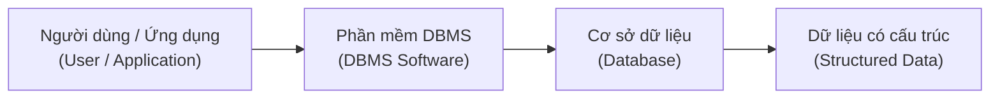
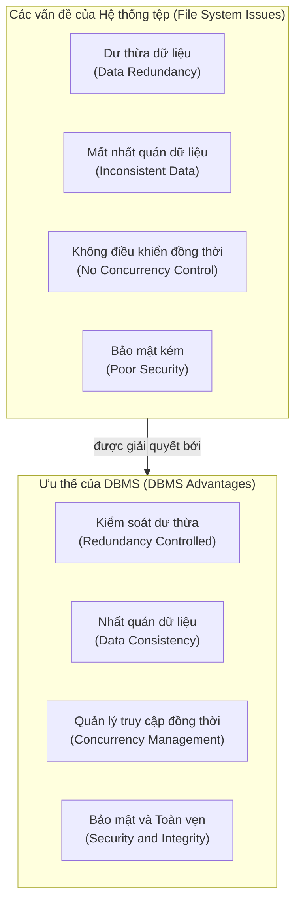
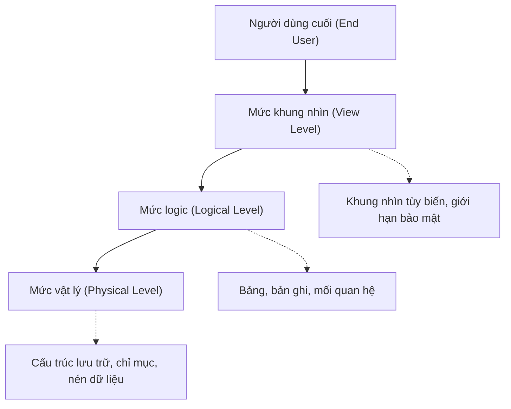
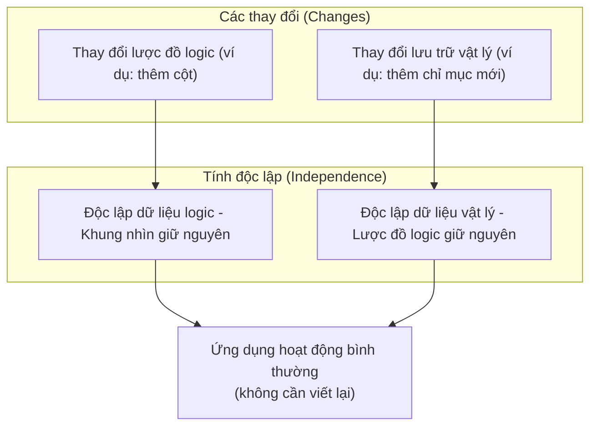
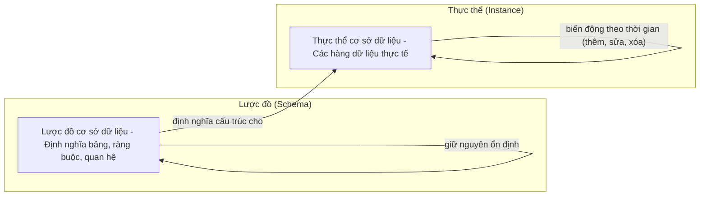
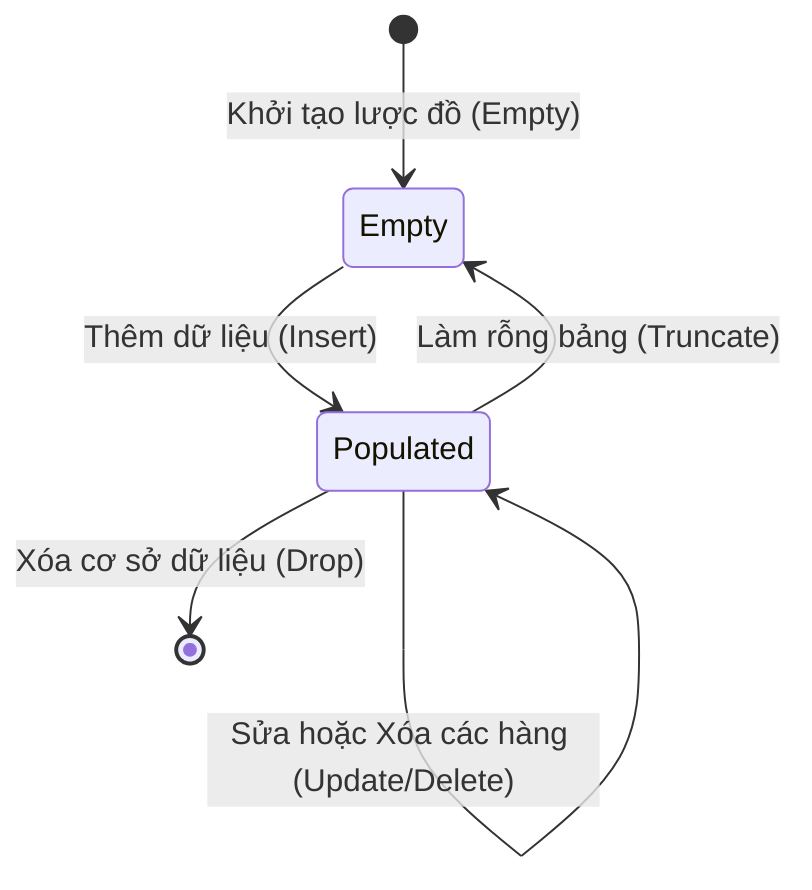

# Chương 1: Cơ sở lý thuyết về Cơ sở dữ liệu (Database Fundamentals)

## 1. Hệ quản trị Cơ sở dữ liệu (DBMS) là gì?

**Hệ quản trị cơ sở dữ liệu (DBMS - Database Management System)** là phần mềm cho phép người dùng định nghĩa, khởi tạo, bảo trì và kiểm soát quyền truy cập vào cơ sở dữ liệu. Nó đóng vai trò là một bộ lọc trung gian giữa người dùng/ứng dụng và hệ thống lưu trữ vật lý dữ liệu (physical data storage).

**Các ví dụ phổ biến**: MySQL, PostgreSQL, Oracle, MongoDB, SQLite.



**Các chức năng cốt lõi của một DBMS**:
- Định nghĩa dữ liệu (khởi tạo bảng, thiết lập các ràng buộc).
- Thao tác dữ liệu (thêm - insert, sửa - update, xóa - delete, truy vấn - query).
- Bảo đảm an toàn bảo mật và thực thi các ràng buộc toàn vẹn dữ liệu.
- Điều khiển truy cập đồng thời (concurrent access control).
- Sao lưu và phục hồi dữ liệu khi xảy ra sự cố (backup and recovery).

---

## 2. Ưu thế của DBMS so với Hệ thống quản lý tệp tin truyền thống (File System)

| Khía cạnh | Hệ thống tệp tin (File System) | Hệ quản trị CSDL (DBMS) |
|---|---|---|
| **Dư thừa dữ liệu (Data redundancy)** | Cao (dữ liệu bị trùng lặp nhiều nơi) | Được kiểm soát chặt chẽ, giảm thiểu tối đa |
| **Mất nhất quán dữ liệu (Data inconsistency)** | Thường xuyên xảy ra | Tránh được nhờ các ràng buộc toàn vẹn |
| **Truy cập dữ liệu** | Đòi hỏi phải viết các chương trình chuyên biệt riêng | Sử dụng ngôn ngữ truy vấn tiêu chuẩn (SQL) |
| **Truy cập đồng thời** | Không kiểm soát được, dễ làm hỏng dữ liệu | Tích hợp sẵn cơ chế điều khiển đồng thời |
| **Bảo mật an toàn** | Rất hạn chế | Hệ thống xác thực và phân quyền chi tiết |
| **Sao lưu & Phục hồi** | Thực hiện thủ công | Tự động hóa, bảo đảm tính nhất quán dữ liệu |
| **Tính toàn vẹn dữ liệu** | Phụ thuộc hoàn toàn vào lập trình ứng dụng | Được thực thi tự động bởi hệ thống DBMS |



**Giải thích chi tiết**:

- **Dư thừa & Mất nhất quán (Redundancy & Inconsistency)**: Trong hệ thống tệp tin truyền thống, cùng một thông tin có thể bị lưu trữ lặp lại tại nhiều tệp tin khác nhau (dư thừa dữ liệu). Khi cập nhật dữ liệu ở một tệp tin, thông tin ở các tệp tin khác có thể không được cập nhật đồng bộ (mất nhất quán dữ liệu). DBMS giải quyết triệt để vấn đề này bằng cách chuẩn hóa dữ liệu (normalization) và sử dụng các ràng buộc toàn vẹn để loại bỏ dư thừa.
- **Truy cập đồng thời (Concurrent access)**: Hệ thống tệp tin cho phép nhiều người dùng đọc/ghi đồng thời vào cùng một tệp tin – dễ dẫn đến lỗi ghi đè dữ liệu hoặc hỏng dữ liệu. DBMS kiểm soát việc này một cách an toàn thông qua cơ chế khóa (locking) và quản lý giao dịch (transactions).
- **Bảo mật an toàn**: DBMS cung cấp khả năng kiểm soát truy cập chi tiết (granular access control) phân cấp đến từng cấp độ người dùng, vai trò (role), bảng, hoặc thậm chí là từng cột dữ liệu.
- **Sao lưu & Phục hồi (Backup & Recovery)**: DBMS tự động ghi lại nhật ký thay đổi dữ liệu (logs) và có khả năng khôi phục hệ thống về trạng thái nhất quán ổn định ngay sau khi xảy ra sự cố sập nguồn hoặc hỏng phần cứng.

---

## 3. Trừu tượng hóa Dữ liệu (Data Abstraction)

Cơ chế trừu tượng hóa dữ liệu (Data abstraction) giúp che giấu các chi tiết lưu trữ vật lý phức tạp ở bên dưới và cung cấp cho người dùng một giao diện dữ liệu đơn giản hóa. Hệ thống bao gồm **ba mức trừu tượng hóa**:

| Mức độ | Mô tả chi tiết | Đối tượng tiếp cận |
|---|---|---|
| **Mức vật lý (Physical level)** | Mô tả dữ liệu thực tế được lưu trữ như thế nào (dưới dạng các bits, các khối nhớ - blocks, chỉ mục - indexes, kỹ thuật nén) | Lập trình viên cấp thấp, Quản trị viên CSDL (DBA) |
| **Mức logic (Logical level)** | Mô tả dữ liệu nào được lưu trữ và các mối quan hệ giữa chúng (các bảng, các bản ghi, kiểu dữ liệu) | Thiết kế viên cơ sở dữ liệu |
| **Mức khung nhìn (View level)** | Hiển thị dữ liệu tùy biến cho từng đối tượng người dùng cụ thể (các tập hợp con của bảng, các cột tính toán nâng cao) | Người dùng cuối / Lập trình viên ứng dụng |



**Ví dụ thực tế**: Cơ sở dữ liệu của một ngân hàng
- **Mức vật lý**: Dữ liệu được lưu trữ thực tế trên các khối đĩa cứng với hệ thống chỉ mục cấu trúc cây B+ tree xây dựng trên trường số tài khoản.
- **Mức logic**: Định nghĩa các cấu trúc bảng dữ liệu `Customer(custID, name)` và `Account(accNo, custID, balance)`.
- **Mức khung nhìn**: Nhân viên giao dịch chỉ được cấp quyền xem số dư tài khoản; trong khi Giám đốc chi nhánh có quyền truy cập xem toàn bộ hồ sơ chi tiết của khách hàng.

---

## 4. Tính Độc lập Dữ liệu (Data Independence)

**Tính độc lập dữ liệu (Data independence)** là khả năng thay đổi cấu trúc dữ liệu ở một mức mà không cần phải thực hiện các chỉnh sửa tương ứng ở các mức cao hơn.

### 4.1 Tính độc lập dữ liệu mức logic (Logical Data Independence)
- **Hành vi thay đổi**: Chỉnh sửa cấu trúc lược đồ logic (như thêm một cột mới vào bảng, thay đổi kiểu dữ liệu của trường, gộp các bảng lại với nhau).
- **Trạng thái không bị ảnh hưởng**: Các khung nhìn bên ngoài và mã nguồn của các chương trình ứng dụng vẫn được giữ nguyên vẹn.

### 4.2 Tính độc lập dữ liệu mức vật lý (Physical Data Independence)
- **Hành vi thay đổi**: Chỉnh sửa cấu trúc lưu trữ vật lý ở dưới (như chuyển đổi cấu trúc tổ chức tệp tin từ tuần tự sang đánh chỉ mục, thay đổi thuật toán nén dữ liệu, thêm các chỉ mục mới).
- **Trạng thái không bị ảnh hưởng**: Lược đồ logic và mức khung nhìn không có bất kỳ sự thay đổi nào.



**Tầm quan trọng thực tế**:
- Nếu không có tính độc lập dữ liệu mức logic, mỗi khi cơ sở dữ liệu bổ sung thêm một trường thông tin mới, toàn bộ mã nguồn của mọi ứng dụng liên kết đều sẽ bị lỗi và phải viết lại.
- Nếu không có tính độc lập dữ liệu mức vật lý, mỗi khi người quản trị thực hiện tối ưu hóa lưu trữ đĩa (như tạo thêm chỉ mục) thì toàn bộ các câu lệnh truy vấn của lập trình viên sẽ không còn hoạt động.

---

## 5. Lược đồ so với Thực thể (Schema vs Instance)

| Thuật ngữ | Định nghĩa bản chất | Ví dụ tương đương | Tần suất thay đổi |
|---|---|---|---|
| **Lược đồ (Schema)** | Bản thiết kế tổng thể / cấu trúc khung của cơ sở dữ liệu (các bảng, các cột, ràng buộc toàn vẹn) | Khai báo Lớp (Class) trong lập trình hướng đối tượng | Rất hiếm khi thay đổi (hàng tháng hoặc hàng năm) |
| **Thực thể (Instance)** | Tập hợp dữ liệu thực tế đang được lưu trữ trong cơ sở dữ liệu tại một thời điểm cụ thể | Các đối tượng cụ thể được khởi tạo từ lớp đó | Thay đổi liên tục sau mỗi thao tác thêm/sửa/xóa |

**Ví dụ trực quan** – Lược đồ của bảng sinh viên `Student`:

```
Student(rollNo: int, name: varchar(20), age: int)
```

Một thực thể cụ thể (ảnh chụp dữ liệu tại một thời điểm):

| rollNo | name | age |
|---|---|---|
| 101 | Alice | 20 |
| 102 | Bob | 22 |



**Sơ đồ chuyển đổi trạng thái** biểu diễn biến động của thực thể theo thời gian:



**Điểm cốt lõi cần nhớ**:
- Một cơ sở dữ liệu có thể có vô số thực thể biến động khác nhau trong suốt vòng đời hoạt động của nó, nhưng thường chỉ duy trì duy nhất một lược đồ thiết kế gốc (trừ khi có thao tác nâng cấp hệ thống).
- Sự tiến hóa lược đồ (schema evolution) (sử dụng lệnh `ALTER TABLE`) thay đổi bản thiết kế hệ thống nhưng vẫn cố gắng bảo toàn tối đa lượng dữ liệu hiện có trong thực thể cũ.

---

## Bảng tổng kết chương

| Khái niệm cốt lõi | Điểm mấu chốt cần nhớ |
|---|---|
| **Hệ quản trị CSDL (DBMS)** | Là phần mềm quản lý dữ liệu có cấu trúc, đảm bảo an toàn bảo mật, điều khiển đồng thời và khả năng tự phục hồi lỗi. |
| **Ưu điểm so với hệ thống tệp** | Loại bỏ dư thừa dữ liệu, bảo đảm tính nhất quán, điều khiển đồng thời, và thực thi toàn vẹn dữ liệu tốt hơn. |
| **Các mức trừu tượng hóa** | Mức vật lý (lưu trữ thực tế) → Mức logic (các bảng dữ liệu) → Mức khung nhìn (tùy biến cho người dùng). |
| **Tính độc lập dữ liệu** | Gồm độc lập logic (thay đổi cấu trúc bảng không ảnh hưởng ứng dụng) và độc lập vật lý (thay đổi cấu trúc lưu trữ không ảnh hưởng cấu trúc bảng). |
| **Lược đồ và Thực thể** | Lược đồ (*Schema*) là bản thiết kế tĩnh ổn định; Thực thể (*Instance*) là dữ liệu động biến đổi liên tục theo thời gian. |

---
