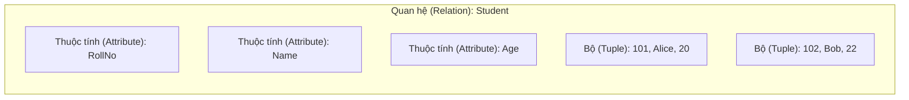
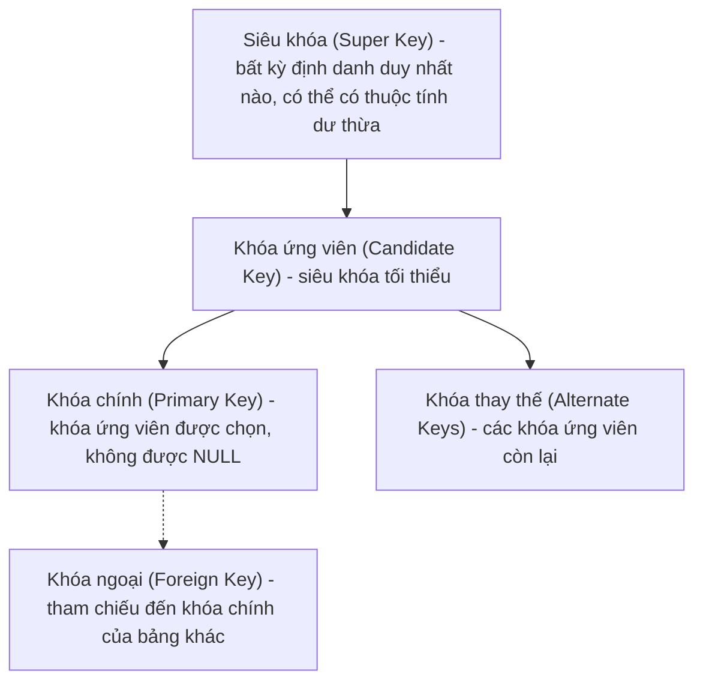
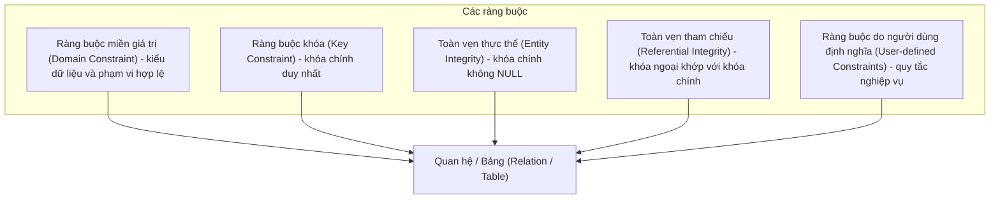
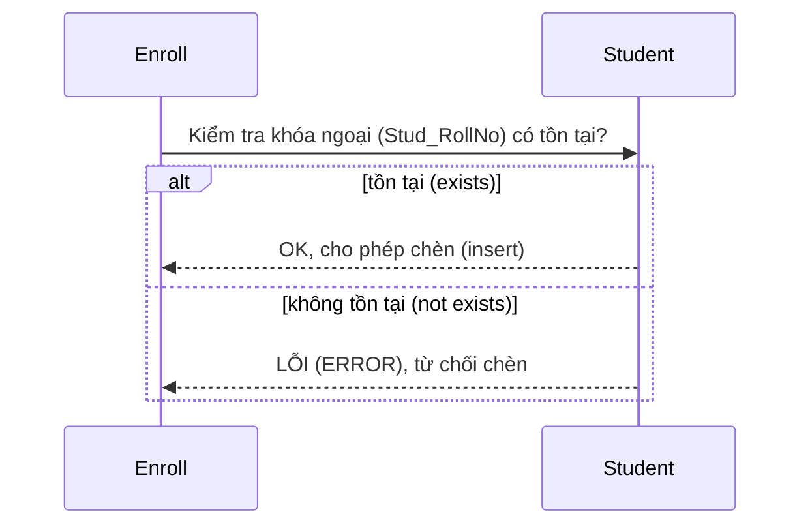
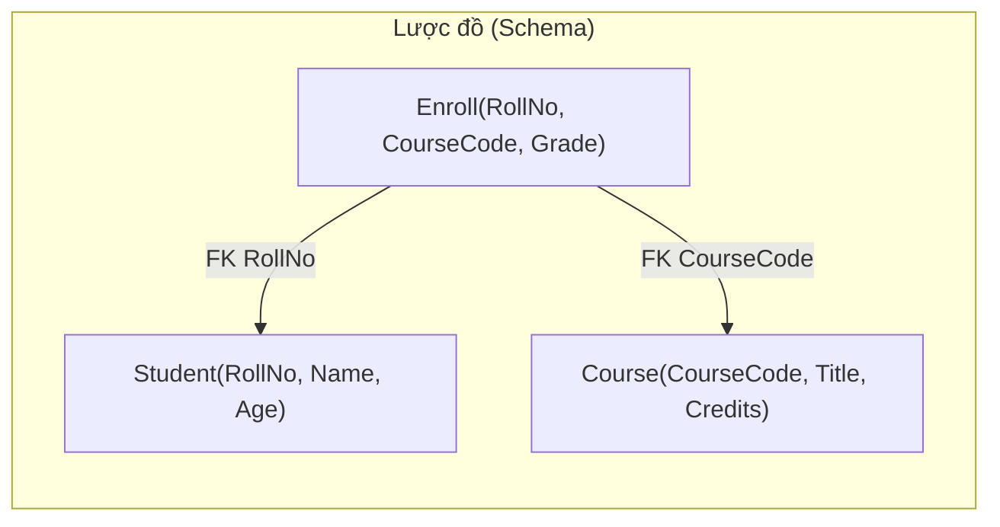
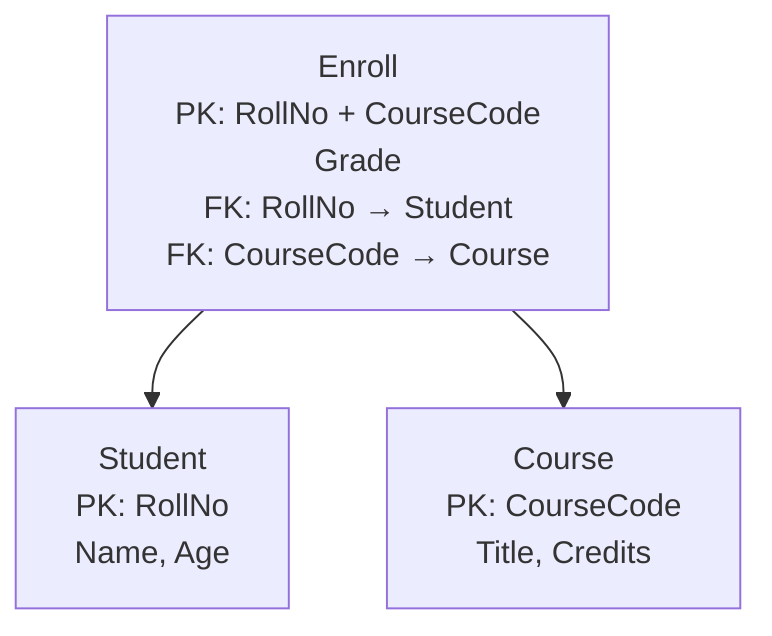

# Chapter 2: Mô hình quan hệ (Relational Model)

## 1. Quan hệ, Bộ, Thuộc tính (Relation, Tuple, Attribute)

Mô hình quan hệ (Relational model) biểu diễn dữ liệu dưới dạng một **bảng** (quan hệ - relation).

| Thuật ngữ | Định nghĩa | Tương tự |
|-----------|------------|----------|
| **Quan hệ (Relation)** | Một bảng gồm các hàng và cột | Một trang tính (spreadsheet) |
| **Bộ (Tuple)** | Một hàng trong quan hệ | Một bản ghi (record) / hàng (row) |
| **Thuộc tính (Attribute)** | Một cột trong quan hệ | Một trường (field) |

**Ví dụ** – Quan hệ `Student` (Sinh viên):

| RollNo (Thuộc tính) | Name (Thuộc tính) | Age (Thuộc tính) |
|--------------------|------------------|----------------|
| 101                | Alice            | 20              | ← Bộ (Tuple)
| 102                | Bob              | 22              | ← Bộ (Tuple)



**Các đặc trưng của quan hệ**:
- Mỗi bộ là duy nhất (không có các hàng trùng lặp).
- Thứ tự của các bộ không quan trọng.
- Thứ tự của các thuộc tính không quan trọng (nhưng thường được cố định).
- Mỗi thuộc tính có một miền giá trị (kiểu dữ liệu).

---

## 2. Khóa (Keys)

Khóa (Keys) là các thuộc tính (hoặc tập hợp các thuộc tính) giúp định danh duy nhất các bộ trong một quan hệ.

### 2.1 Siêu khóa (Super Key)

Một **siêu khóa (super key)** là bất kỳ tập hợp thuộc tính nào định danh duy nhất một bộ. Nó có thể chứa các thuộc tính dư thừa.

**Ví dụ**: Trong quan hệ `Student(RollNo, Name, Age)`
- `{RollNo}` → siêu khóa (tối thiểu)
- `{RollNo, Name}` → siêu khóa (dư thừa thuộc tính)
- `{Name, Age}` → không phải siêu khóa (thuộc tính Name có thể bị trùng lặp)

### 2.2 Khóa ứng viên (Candidate Key)

Một **khóa ứng viên (candidate key)** là một siêu khóa tối thiểu – không có bất kỳ tập con thực sự nào của nó là siêu khóa.

**Ví dụ**:
- `{RollNo}` là một khóa ứng viên (nếu RollNo is duy nhất).
- `{Name}` có thể là một khóa ứng viên chỉ khi tên được đảm bảo là duy nhất (trường hợp này rất hiếm).

### 2.3 Khóa chính (Primary Key)

**Khóa chính (primary key)** là một khóa ứng viên được nhà thiết kế cơ sở dữ liệu lựa chọn làm định danh chính. Khóa chính không thể chứa giá trị `NULL`.

**Ví dụ**: `RollNo` được chọn làm khóa chính.

### 2.4 Khóa ngoại (Foreign Key)

Một **khóa ngoại (foreign key)** là một thuộc tính (hoặc tập hợp thuộc tính) trong một quan hệ tham chiếu đến khóa chính của một quan hệ khác. Nó thiết lập mối quan hệ giữa các bảng.

**Ví dụ**: Bảng `Enroll` (Đăng ký học) có thuộc tính `Stud_RollNo` tham chiếu đến khóa chính `RollNo` trong bảng `Student`.

```mermaid
flowchart LR
    subgraph Student["Student"]
        PK["Khóa chính (Primary Key): RollNo"]
    end
    subgraph Enroll["Enroll"]
        FK["Khóa ngoại (Foreign Key): Stud_RollNo"]
    end
    FK -->|tham chiếu (references)| PK
```

**Phân cấp các loại khóa (Hierarchy of keys)**:



---

## 3. Ràng buộc toàn vẹn (Integrity Constraints)

Các ràng buộc toàn vẹn đảm bảo tính chính xác và nhất quán của dữ liệu.

| Ràng buộc | Mô tả | Ví dụ |
|-----------|-------|-------|
| **Ràng buộc miền giá trị (Domain constraint)** | Giá trị của thuộc tính phải nằm trong miền giá trị được xác định trước (kiểu dữ liệu, phạm vi) | Tuổi nằm trong khoảng từ 0 đến 120 |
| **Ràng buộc khóa (Key constraint)** | Không có hai bộ nào có cùng giá trị khóa chính | `RollNo` là duy nhất |
| **Toàn vẹn thực thể (Entity integrity)** | Khóa chính không thể nhận giá trị `NULL` | Luôn phải có giá trị cho `RollNo` |
| **Toàn vẹn tham chiếu (Referential integrity)** | Giá trị khóa ngoại phải khớp với một khóa chính hiện có trong bảng được tham chiếu (hoặc là `NULL` nếu được phép) | Mọi `Stud_RollNo` trong Enroll phải tồn tại trong Student |
| **Ràng buộc do người dùng định nghĩa (User-defined constraint)** | Các quy tắc nghiệp vụ không được bao quát bởi các ràng buộc khác | Lương > 0, Định dạng Email |



**Biểu đồ toàn vẹn tham chiếu** (sử dụng phong cách sequence diagram):



---

## 4. Lược đồ quan hệ (Relational Schema)

Một **lược đồ quan hệ (relational schema)** mô tả cấu trúc của một quan hệ – bao gồm tên quan hệ, các thuộc tính, miền giá trị và các ràng buộc.

**Ký hiệu**:
- Tên quan hệ theo sau bởi danh sách các thuộc tính.
- Khóa chính được gạch chân.
- Khóa ngoại được biểu diễn bằng mũi tên hoặc chỉ rõ tham chiếu.

**Ví dụ** – Cơ sở dữ liệu trường đại học:

```
Student( RollNo, Name, Age )
Enroll( RollNo, CourseCode, Grade )
Course( CourseCode, Title, Credits )
```

Trong đó:
- Khóa chính: `RollNo` trong Student, `CourseCode` trong Course, `(RollNo, CourseCode)` trong Enroll.
- Khóa ngoại: `Enroll.RollNo` tham chiếu `Student.RollNo`; `Enroll.CourseCode` tham chiếu `Course.CourseCode`.



**Biểu đồ lược đồ** (chi tiết):



---

## Bảng tổng hợp (Summary Table)

| Khái niệm | Định nghĩa |
|-----------|------------|
| **Quan hệ (Relation)** | Bảng gồm các hàng và cột |
| **Bộ (Tuple)** | Hàng của một quan hệ |
| **Thuộc tính (Attribute)** | Cột của một quan hệ |
| **Siêu khóa (Super key)** | Tập hợp các thuộc tính định danh duy nhất một bộ |
| **Khóa ứng viên (Candidate key)** | Siêu khóa tối thiểu |
| **Khóa chính (Primary key)** | Khóa ứng viên được chọn, không thể nhận giá trị null |
| **Khóa ngoại (Foreign key)** | Tham chiếu đến khóa chính của một quan hệ khác |
| **Ràng buộc miền giá trị (Domain constraint)** | Các giá trị của thuộc tính phải thuộc tập hợp được cho phép |
| **Ràng buộc khóa (Key constraint)** | Không trùng lặp các khóa chính |
| **Toàn vẹn thực thể (Entity integrity)** | Khóa chính không thể nhận giá trị null |
| **Toàn vẹn tham chiếu (Referential integrity)** | Khóa ngoại phải khớp với khóa chính đang tồn tại |
| **Lược đồ quan hệ (Relational schema)** | Mô tả cấu trúc quan hệ (tên, thuộc tính, khóa) |

---
