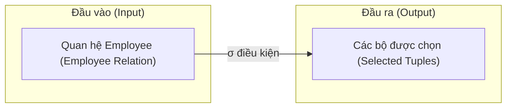
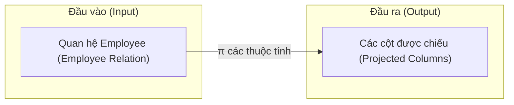
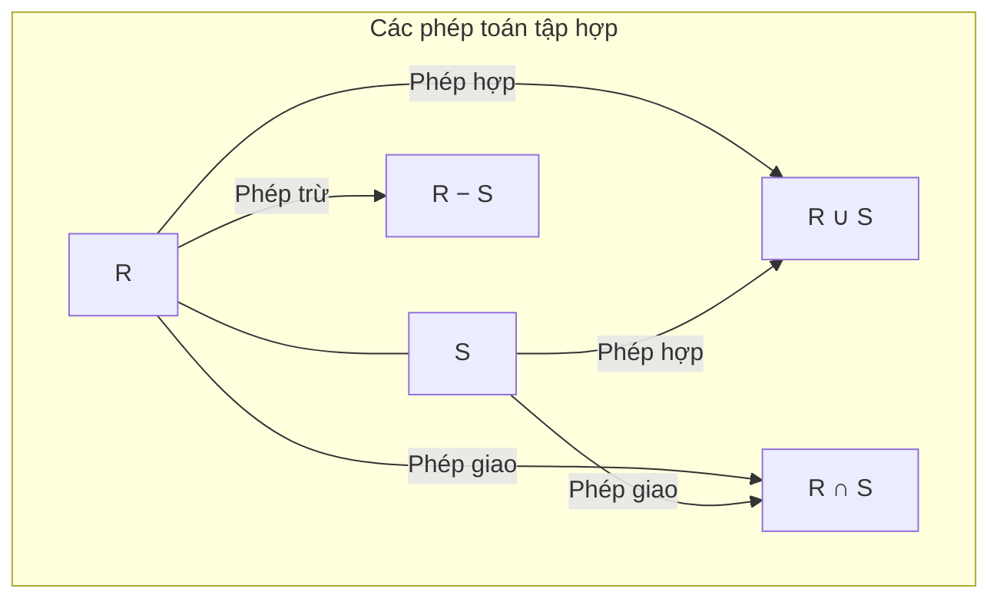
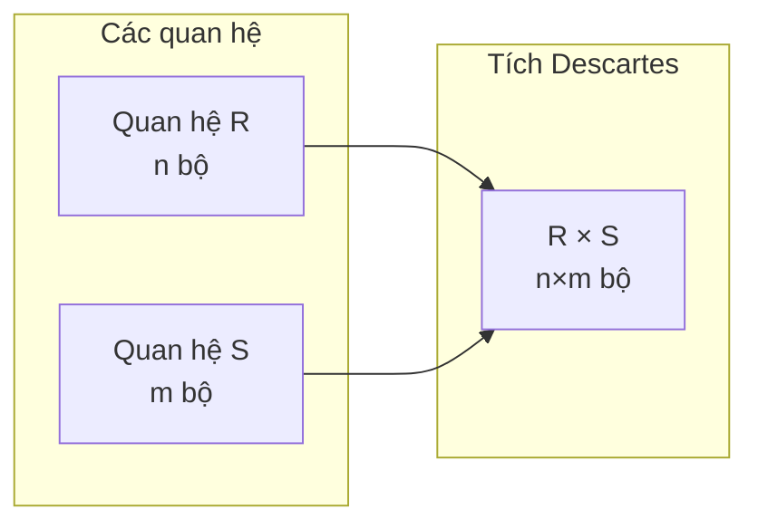
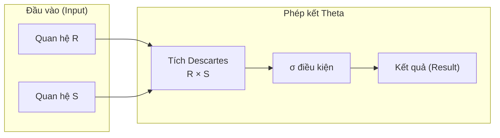
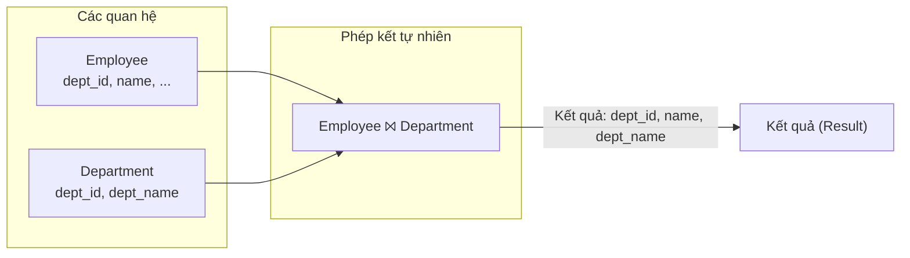
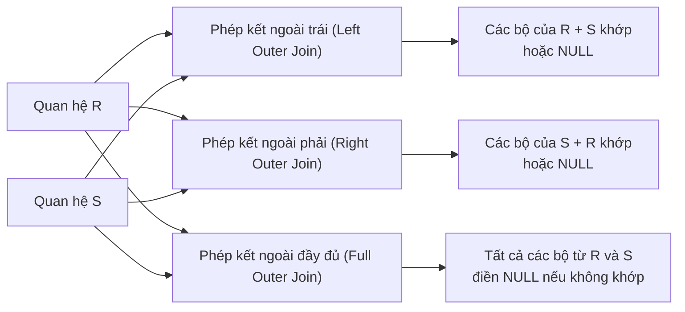
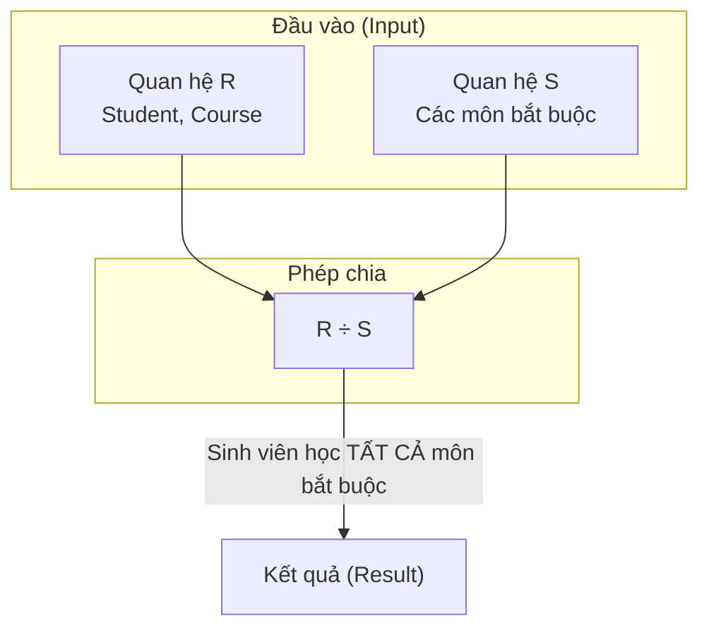

# Chapter 3: Đại số quan hệ (Relational Algebra)

Đại số quan hệ (Relational algebra) là một ngôn ngữ truy vấn hình thức dành cho mô hình dữ liệu quan hệ. Nó cung cấp một tập hợp các toán tử nhận một hoặc hai quan hệ làm đầu vào và tạo ra một quan hệ mới làm đầu ra. Các phép toán này khép kín (closed) trong mô hình quan hệ, nghĩa là kết quả trả về luôn là một quan hệ. Đại số quan hệ chính là nền tảng lý thuyết cho SQL và các ngôn ngữ truy vấn quan hệ khác.

## 3.1 Phép chọn (Selection - σ)

Phép chọn (selection) trích xuất các bộ thỏa mãn một vị từ (predicate) cho trước từ một quan hệ. Đây là một phép toán một ngôi (unary operation), ký hiệu là σđiều_kiện(R), trong đó R là một quan hệ và điều_kiện là một biểu thức logic được cấu thành từ các thuộc tính, hằng số, toán tử so sánh (=, ≠, <, ≤, >, ≥) và các liên từ logic (∧, ∨, ¬).

**Ví dụ**: σsalary > 50000 ∧ department = 'Sales'(Employee) trả về tất cả các nhân viên có lương lớn hơn 50.000 và làm việc ở phòng Sales (Bán hàng).

**Biểu đồ**:

**Dữ liệu mẫu**:

| emp_id | name    | department | salary |
|--------|---------|------------|--------|
| 101    | Alice   | Sales      | 60000  |
| 102    | Bob     | Sales      | 45000  |
| 103    | Carol   | IT         | 70000  |

σsalary > 50000 ∧ department = 'Sales'(Employee) →  

| emp_id | name    | department | salary |
|--------|---------|------------|--------|
| 101    | Alice   | Sales      | 60000  |

## 3.2 Phép chiếu (Projection - π)

Phép chiếu (projection) chọn ra một tập con các thuộc tính được chỉ định từ một quan hệ, đồng thời loại bỏ các bộ trùng lặp khỏi kết quả. Phép chiếu được ký hiệu là πA1, A2, …, Ak(R).

**Ví dụ**: πname, salary(Employee) chỉ trả về hai cột name và salary.

**Biểu đồ**:

**Mẫu**:

| name    | salary |
|---------|--------|
| Alice   | 60000  |
| Bob     | 45000  |
| Carol   | 70000  |

## 3.3 Phép hợp (Union - ∪), Phép giao (Intersection - ∩), Phép trừ (Difference - −)

Các phép toán tập hợp hai ngôi này yêu cầu các quan hệ phải tương thích hợp (union-compatible) – tức là có cùng bậc (arity) và các miền giá trị tương ứng phải tương thích.

- **Phép hợp (R ∪ S)**: Gồm các bộ thuộc R hoặc thuộc S.
- **Phép giao (R ∩ S)**: Gồm các bộ thuộc cả R và S.
- **Phép trừ (R − S)**: Gồm các bộ thuộc R nhưng không thuộc S.

**Biểu đồ**:

**Ví dụ**: Giả sử R = các nhân viên phòng Sales, S = các nhân viên có tiền thưởng (bonus) > 5000.

| emp_id | name    | dept    |
|--------|---------|---------|
| 101    | Alice   | Sales   |
| 102    | Bob     | Sales   |
| 104    | David   | Sales   |

| emp_id | name    | bonus   |
|--------|---------|---------|
| 101    | Alice   | 6000    |
| 103    | Carol   | 7000    |

Sau khi thực hiện phép chiếu lên các thuộc tính chung (emp_id, name):

R ∪ S → Alice, Bob, David, Carol  
R ∩ S → Alice  
R − S → Bob, David

## 3.4 Tích Descartes (Cartesian Product - ×)

R × S kết hợp mọi bộ của R với mọi bộ của S.
- Bậc (Arity) = arity(R) + arity(S)
- Bản số (Cardinality) = |R| × |S|

**Biểu đồ**:

**Ví dụ**: Employee (2 bộ) × Department (2 bộ) tạo ra 4 bộ.

## 3.5 Các phép kết (Joins)

### 3.5.1 Phép kết Theta (Theta Join - ⨝θ)

R ⨝θ S = σθ(R × S). Điều kiện θ có thể bao gồm bất kỳ toán tử so sánh nào.

**Biểu đồ**:

### 3.5.2 Phép kết tự nhiên (Natural Join - ⨝)

Phép kết tự nhiên (natural join) so khớp tất cả các thuộc tính có cùng tên và loại bỏ các cột trùng lặp. Đây là một trường hợp đặc biệt của phép kết theta với điều kiện bằng trên các thuộc tính chung.

**Biểu đồ**:

### 3.5.3 Phép kết ngoài (Outer Join)

Phép kết ngoài (outer join) giữ lại các bộ không khớp bằng cách chèn các giá trị NULL vào các thuộc tính thiếu.

- **Phép kết ngoài trái (Left Outer Join - R ⟕ S)**: Giữ lại tất cả các bộ từ R.
- **Phép kết ngoài phải (Right Outer Join - R ⟖ S)**: Giữ lại tất cả các bộ từ S.
- **Phép kết ngoài đầy đủ (Full Outer Join - R ⟗ S)**: Giữ lại tất cả các bộ từ cả hai quan hệ.

**Biểu đồ**:

**Ví dụ** (Phép kết ngoài trái):

Employee (dept_id có thể là NULL) ⟕ Department:

| emp_id | name    | dept_id | dept_name |
|--------|---------|---------|------------|
| 101    | Alice   | D1      | Sales      |
| 102    | Bob     | NULL    | NULL       |
| 103    | Carol   | D2      | IT         |

## 3.6 Phép chia (Division Operator - ÷)

R ÷ S trả về các bộ từ R (không bao gồm các thuộc tính của S) mà chúng liên kết với **mọi** bộ trong S. Nó dùng để giải quyết các truy vấn chứa từ khóa "mọi" hoặc "tất cả" (for all).

**Định nghĩa hình thức**: Cho R(A, B) và S(B),  
R ÷ S = { a ∈ πA(R) | ∀ s ∈ S, (a, s) ∈ R }

**Biểu đồ**:

**Ví dụ**:  

R (Student, Course):  

| Student | Course    |
|---------|-----------|
| Alice   | Math      |
| Alice   | Physics   |
| Bob     | Math      |
| Carol   | Math      |
| Carol   | Physics   |
| Carol   | Chemistry |

S (Course):  

| Course    |
|-----------|
| Math      |
| Physics   |

R ÷ S → Các sinh viên đã học cả hai môn Math và Physics:  

| Student |
|---------|
| Alice   |
| Carol   |

## 3.7 Tóm tắt

Đại số quan hệ cung cấp một tập hợp các phép toán tối thiểu nhưng đầy đủ để thao tác trên các quan hệ. Các phép toán cơ bản là phép chọn, phép chiếu, tích Descartes, phép hợp và phép trừ. Phép giao, các phép kết và phép chia có thể được dẫn xuất từ các phép toán cơ bản này nhưng được đưa vào nhằm mục đích thuận tiện khi sử dụng. Hiểu rõ đại số quan hệ là điều thiết yếu để tối ưu hóa truy vấn và lập luận hình thức về các truy vấn cơ sở dữ liệu.

---
