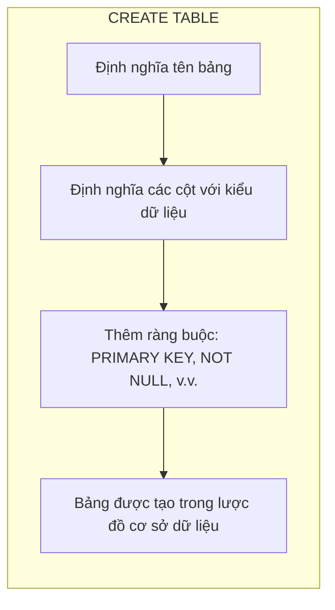
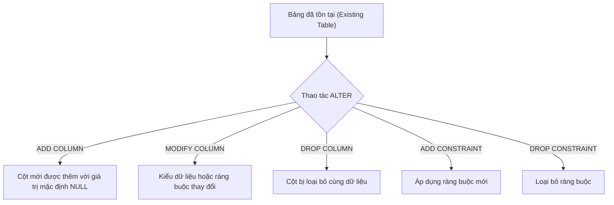
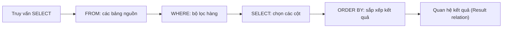
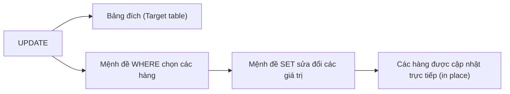
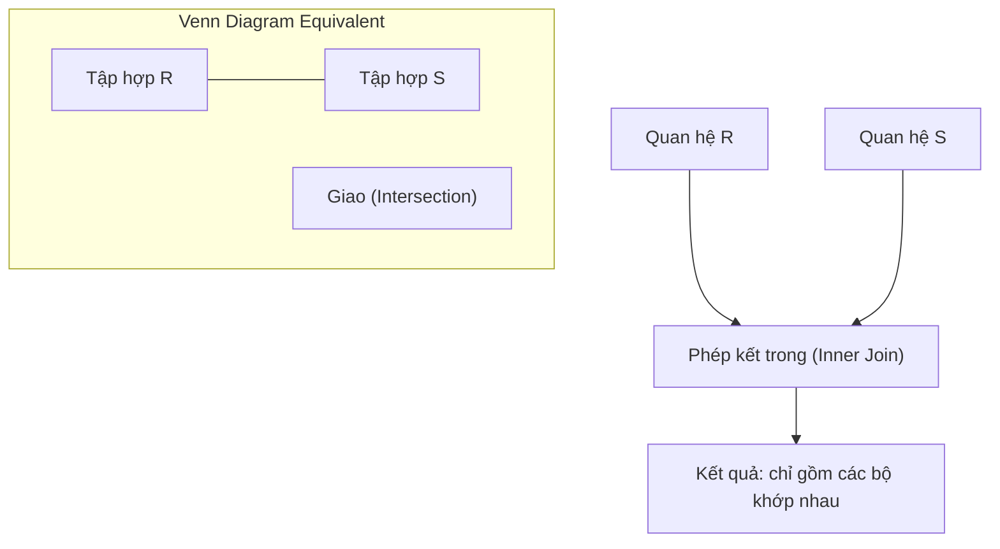
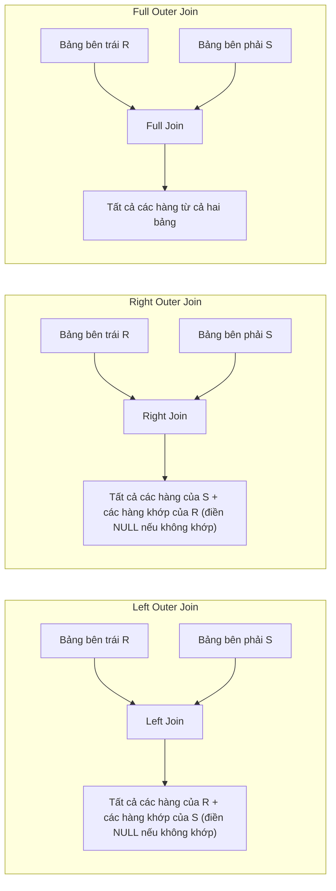
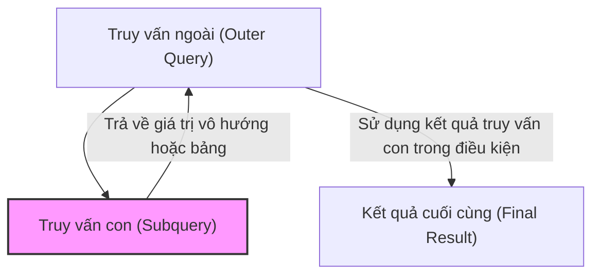
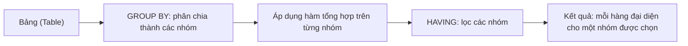
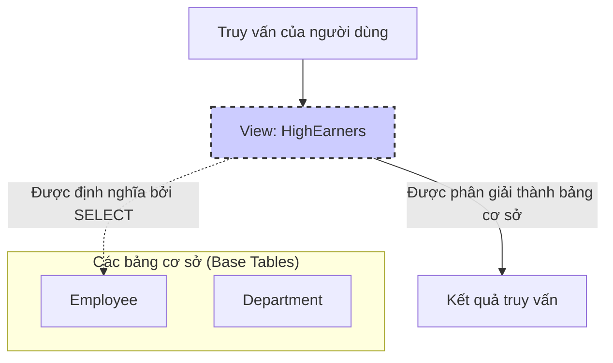
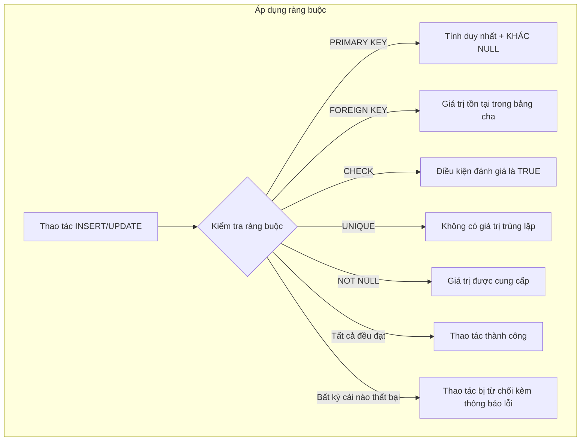

# Chapter 4: Ngôn ngữ truy vấn có cấu trúc (SQL)

Structured Query Language (SQL) là ngôn ngữ tiêu chuẩn để định nghĩa, thao tác và truy vấn các cơ sở dữ liệu quan hệ. SQL bao gồm một số phân nhóm ngôn ngữ phụ: Ngôn ngữ Định nghĩa Dữ liệu (DDL - Data Definition Language) để quản lý lược đồ, Ngôn ngữ Thao tác Dữ liệu (DML - Data Manipulation Language) cho các thao tác dữ liệu, và Ngôn ngữ Kiểm soát Dữ liệu (DCL - Data Control Language) để kiểm soát quyền truy cập. Chương này tập trung vào DDL, DML cùng với các tính năng truy vấn nâng cao.

## 4.1 Ngôn ngữ Định nghĩa Dữ liệu (DDL)

Các câu lệnh DDL định nghĩa và sửa đổi cấu trúc lược đồ (schema) của cơ sở dữ liệu. Các lệnh DDL chính bao gồm CREATE, ALTER và DROP.

### 4.1.1 CREATE

Câu lệnh CREATE dùng để tạo cơ sở dữ liệu, bảng (table), chỉ mục (index) và các đối tượng khác.

**Cú pháp tạo bảng**:

```sql
CREATE TABLE table_name (
    column1 datatype constraint,
    column2 datatype constraint,
    ...
    table_constraint
);
```

**Ví dụ**:

```sql
CREATE TABLE Employee (
    emp_id INTEGER PRIMARY KEY,
    name VARCHAR(100) NOT NULL,
    department_id INTEGER,
    salary DECIMAL(10,2),
    hire_date DATE
);
```

**Biểu đồ**:



### 4.1.2 ALTER

ALTER sửa đổi cấu trúc của một bảng hiện có: thêm, xóa hoặc sửa đổi các cột; thêm hoặc xóa các ràng buộc.

**Ví dụ**:

```sql
-- Thêm cột mới
ALTER TABLE Employee ADD email VARCHAR(100);

-- Sửa đổi kiểu dữ liệu của một cột
ALTER TABLE Employee MODIFY COLUMN salary NUMERIC(12,2);

-- Xóa một cột
ALTER TABLE Employee DROP COLUMN hire_date;

-- Thêm ràng buộc khóa ngoại
ALTER TABLE Employee ADD CONSTRAINT fk_dept 
    FOREIGN KEY (department_id) REFERENCES Department(dept_id);
```

**Biểu đồ**:



### 4.1.3 DROP

DROP xóa hoàn toàn các bảng, cơ sở dữ liệu hoặc các đối tượng khác.

**Ví dụ**:

```sql
DROP TABLE Employee;  -- Xóa bảng và toàn bộ dữ liệu trong bảng
```

**Chú ý**: Hành động DROP không thể hoàn tác trừ khi có bản sao lưu trước đó. Hãy sử dụng TRUNCATE nếu chỉ muốn xóa toàn bộ dữ liệu nhưng vẫn giữ lại cấu trúc bảng.

## 4.2 Ngôn ngữ Thao tác Dữ liệu (DML)

Các lệnh DML xử lý dữ liệu bên trong các bảng: SELECT (truy vấn), INSERT (thêm mới), UPDATE (sửa đổi), DELETE (xóa bỏ).

### 4.2.1 SELECT

SELECT dùng để truy xuất dữ liệu từ một hoặc nhiều bảng. Cú pháp cơ bản:

```sql
SELECT column1, column2, ...
FROM table_name
WHERE condition
ORDER BY column;
```

**Ví dụ**:

```sql
SELECT name, salary
FROM Employee
WHERE department_id = 101
ORDER BY salary DESC;
```

**Biểu đồ**:



### 4.2.2 INSERT

INSERT dùng để thêm các hàng mới vào một bảng.

**Chèn một hàng đầy đủ**:

```sql
INSERT INTO Employee (emp_id, name, department_id, salary)
VALUES (201, 'John Doe', 101, 55000);
```

**Chèn dữ liệu từ kết quả của một truy vấn**:

```sql
INSERT INTO HighEarners (emp_id, name, salary)
SELECT emp_id, name, salary FROM Employee WHERE salary > 70000;
```

### 4.2.3 UPDATE

UPDATE sửa đổi các hàng hiện có dựa trên một điều kiện lọc.

**Ví dụ**:

```sql
UPDATE Employee
SET salary = salary * 1.10
WHERE department_id = 101;
```

**Biểu đồ**:



### 4.2.4 DELETE

DELETE xóa các hàng thỏa mãn điều kiện chỉ định. Nếu không có mệnh đề WHERE, toàn bộ các hàng trong bảng sẽ bị xóa.

**Ví dụ**:

```sql
DELETE FROM Employee
WHERE hire_date < '2020-01-01';
```

## 4.3 Các phép kết (Joins)

Các phép kết (Joins) kết hợp các hàng từ hai hay nhiều bảng dựa trên một cột có mối quan hệ với nhau. SQL hỗ trợ kết trong (inner join) và kết ngoài (outer join - bao gồm left, right, full).

### 4.3.1 Kết trong (Inner Join)

Trả về các hàng chỉ khi điều kiện kết khớp ở cả hai bảng.

**Cú pháp**:

```sql
SELECT columns
FROM table1
INNER JOIN table2 ON table1.key = table2.key;
```

**Ví dụ**:

```sql
SELECT Employee.name, Department.dept_name
FROM Employee
INNER JOIN Department ON Employee.dept_id = Department.dept_id;
```

**Biểu đồ**:



### 4.3.2 Kết ngoài (Outer Joins)

- **Kết ngoài trái (Left Outer Join)**: Giữ lại tất cả các hàng từ bảng bên trái; các hàng không khớp từ bảng bên phải sẽ chứa giá trị NULL.
- **Kết ngoài phải (Right Outer Join)**: Giữ lại tất cả các hàng từ bảng bên phải; các hàng không khớp từ bảng bên trái sẽ chứa giá trị NULL.
- **Kết ngoài đầy đủ (Full Outer Join)**: Giữ lại tất cả các hàng từ cả hai bảng; điền giá trị NULL tại những nơi không có sự khớp nối.

**Ví dụ về kết ngoài trái**:

```sql
SELECT Employee.name, Department.dept_name
FROM Employee
LEFT OUTER JOIN Department ON Employee.dept_id = Department.dept_id;
```

**Biểu đồ**:



## 4.4 Truy vấn lồng (Subqueries / Nested Queries)

Truy vấn con (subquery) là một truy vấn được lồng bên trong một câu lệnh SQL khác. Truy vấn con có thể xuất hiện trong mệnh đề SELECT, FROM, WHERE hoặc HAVING. Chúng có thể là truy vấn con tương quan (correlated subquery - tham chiếu đến truy vấn bên ngoài) hoặc truy vấn con độc lập (non-correlated subquery).

**Ví dụ: Truy vấn con trong mệnh đề WHERE**:

```sql
SELECT name, salary
FROM Employee
WHERE salary > (SELECT AVG(salary) FROM Employee);
```

**Ví dụ: Truy vấn con tương quan** (tìm các nhân viên có mức lương cao hơn mức trung bình của chính phòng ban của họ):

```sql
SELECT e1.name, e1.salary, e1.department_id
FROM Employee e1
WHERE e1.salary > (SELECT AVG(e2.salary)
                   FROM Employee e2
                   WHERE e2.department_id = e1.department_id);
```

**Biểu đồ**:



## 4.5 Hàm tổng hợp và nhóm (Aggregation)

Các hàm tổng hợp (COUNT, SUM, AVG, MIN, MAX) thực hiện tính toán thu gom để trả về một giá trị duy nhất. Mệnh đề GROUP BY nhóm các hàng có cùng giá trị thuộc tính lại với nhau và HAVING dùng để lọc các nhóm này.

### 4.5.1 GROUP BY

Nhóm các hàng dựa trên giá trị của một hoặc nhiều cột. Các hàm tổng hợp sẽ được áp dụng riêng biệt cho từng nhóm.

**Ví dụ**:

```sql
SELECT department_id, COUNT(*) AS num_employees, AVG(salary) AS avg_salary
FROM Employee
GROUP BY department_id;
```

### 4.5.2 HAVING

Mệnh đề HAVING dùng để lọc các nhóm sau khi đã thực hiện gom nhóm và tính toán hàm tổng hợp (tương tự như cách WHERE lọc các hàng trước khi tiến hành gom nhóm).

**Ví dụ**:

```sql
SELECT department_id, AVG(salary) AS avg_salary
FROM Employee
GROUP BY department_id
HAVING AVG(salary) > 60000;
```

**Biểu đồ**:



## 4.6 Khung nhìn (Views)

Một View (khung nhìn) là một bảng ảo được định nghĩa bởi một truy vấn SQL được lưu trữ. Nó không trực tiếp lưu trữ dữ liệu một cách vật lý mà hiển thị dữ liệu được ánh xạ từ các bảng cơ sở bên dưới theo một góc nhìn tùy biến.

**Tạo View**:

```sql
CREATE VIEW HighEarners AS
SELECT emp_id, name, salary
FROM Employee
WHERE salary > 70000;
```

**Sử dụng View**:

```sql
SELECT * FROM HighEarners WHERE department_id = 101;
```

**View có thể cập nhật (Updateable views)**: Một số khung nhìn đơn giản (chỉ lấy dữ liệu từ một bảng duy nhất và không chứa hàm tổng hợp) có thể cho phép thực hiện cập nhật dữ liệu trực tiếp, các khung nhìn khác phức tạp hơn thì chỉ có quyền đọc (read-only).

**Xóa View**:

```sql
DROP VIEW HighEarners;
```

**Biểu đồ**:



## 4.7 Các ràng buộc (Constraints)

Các ràng buộc thiết lập các quy tắc toàn vẹn dữ liệu ở cấp độ bảng hoặc cấp độ cột. Chúng là một phần của DDL nhưng cũng có thể được thêm vào sau đó thông qua lệnh ALTER.

| Ràng buộc | Mô tả |
|-----------|-------|
| PRIMARY KEY | Định danh duy nhất cho từng hàng; tự động áp đặt thuộc tính NOT NULL và UNIQUE. |
| FOREIGN KEY | Đảm bảo tính toàn vẹn tham chiếu; các giá trị phải khớp với khóa chính trong một bảng khác. |
| UNIQUE | Đảm bảo tất cả các giá trị trong một cột (hoặc tổ hợp cột) là duy nhất và không bị trùng lặp. |
| NOT NULL | Ngăn chặn các giá trị NULL (rỗng) được nhập vào cột. |
| CHECK | Xác thực rằng các giá trị phải thỏa mãn một biểu thức Boolean cho trước. |
| DEFAULT | Cung cấp một giá trị mặc định khi người dùng không truyền giá trị vào cột đó. |

**Ví dụ tạo bảng với nhiều ràng buộc**:

```sql
CREATE TABLE Orders (
    order_id INTEGER PRIMARY KEY,
    customer_id INTEGER NOT NULL,
    order_date DATE DEFAULT CURRENT_DATE,
    amount DECIMAL(10,2) CHECK (amount > 0),
    status VARCHAR(20) CHECK (status IN ('Pending', 'Shipped', 'Delivered')),
    FOREIGN KEY (customer_id) REFERENCES Customers(cust_id)
);
```

**Thêm ràng buộc thông qua lệnh ALTER**:

```sql
ALTER TABLE Employee ADD CONSTRAINT unique_email UNIQUE (email);
```

**Biểu đồ**:



## 4.8 Tóm tắt

SQL cung cấp các tính năng toàn diện cho việc định nghĩa lược đồ (DDL) và thao tác dữ liệu (DML). Các cấu trúc then chốt bao gồm:

- **DDL**: CREATE, ALTER, DROP để định nghĩa cấu trúc bảng và các ràng buộc.
- **DML**: SELECT, INSERT, UPDATE, DELETE để quản lý dữ liệu.
- **Các phép kết**: Inner, left outer, right outer, full outer joins.
- **Truy vấn lồng**: Sử dụng truy vấn con trong các mệnh đề WHERE, FROM, SELECT.
- **Tính toán gom nhóm**: GROUP BY kết hợp HAVING để lọc dữ liệu đã nhóm.
- **Khung nhìn (Views)**: Bảng ảo hỗ trợ bảo mật và tăng mức độ trừu tượng hóa dữ liệu.
- **Ràng buộc**: Áp đặt tính toàn vẹn (PRIMARY KEY, FOREIGN KEY, CHECK, UNIQUE, NOT NULL, DEFAULT).

---
