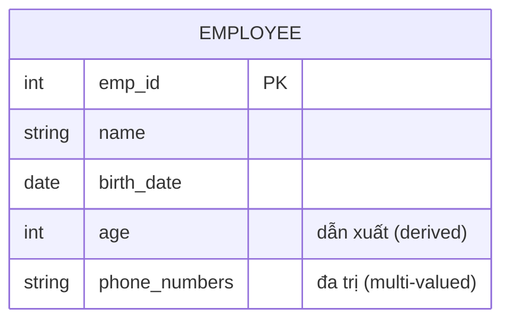
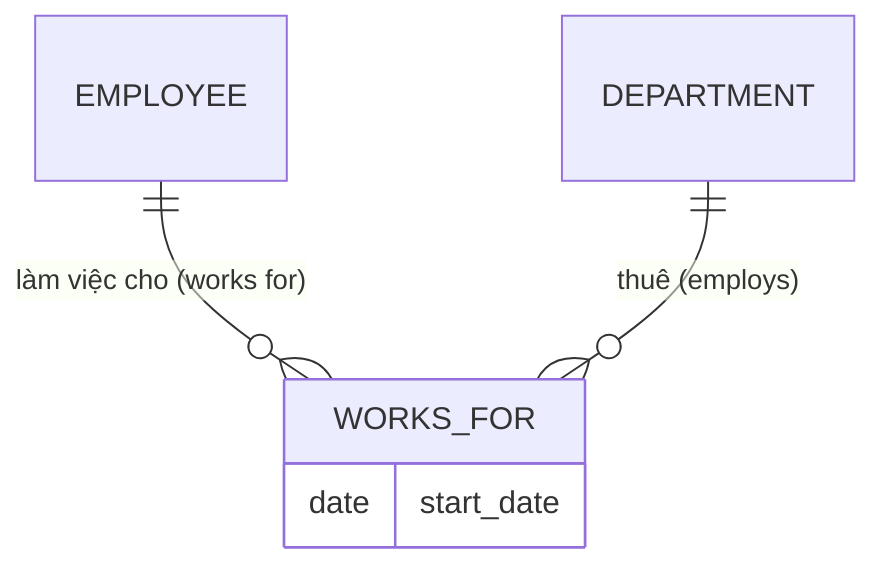
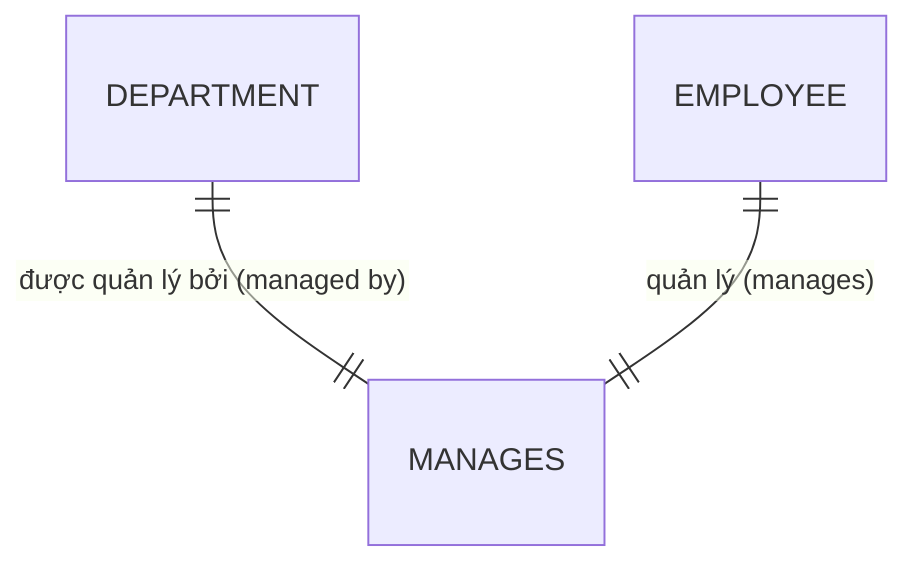
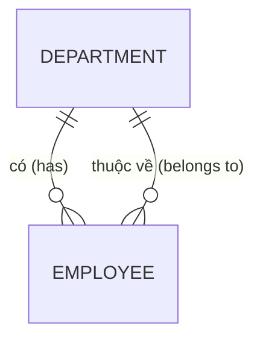
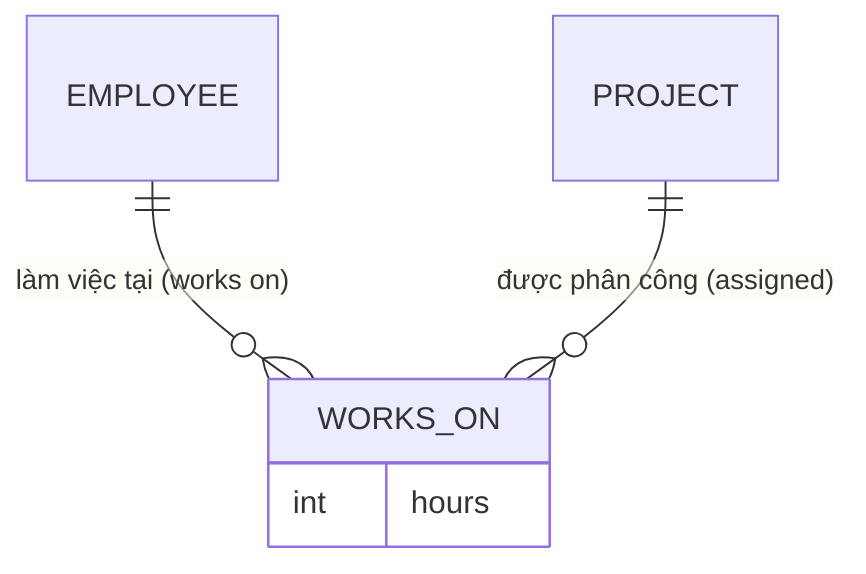
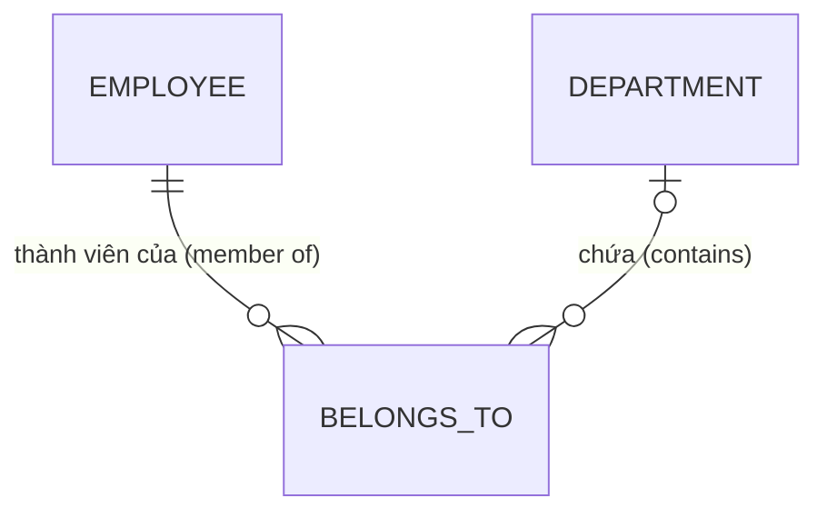
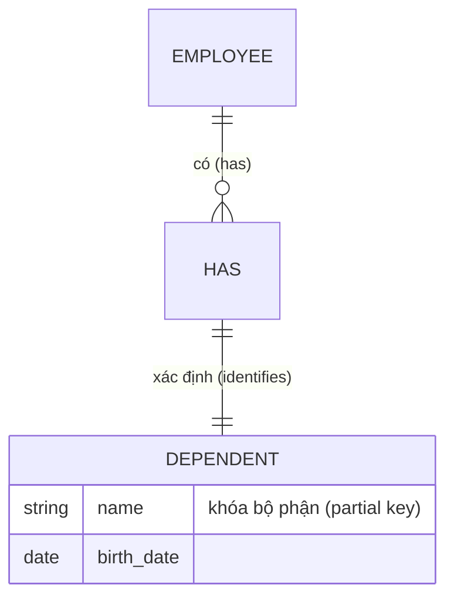
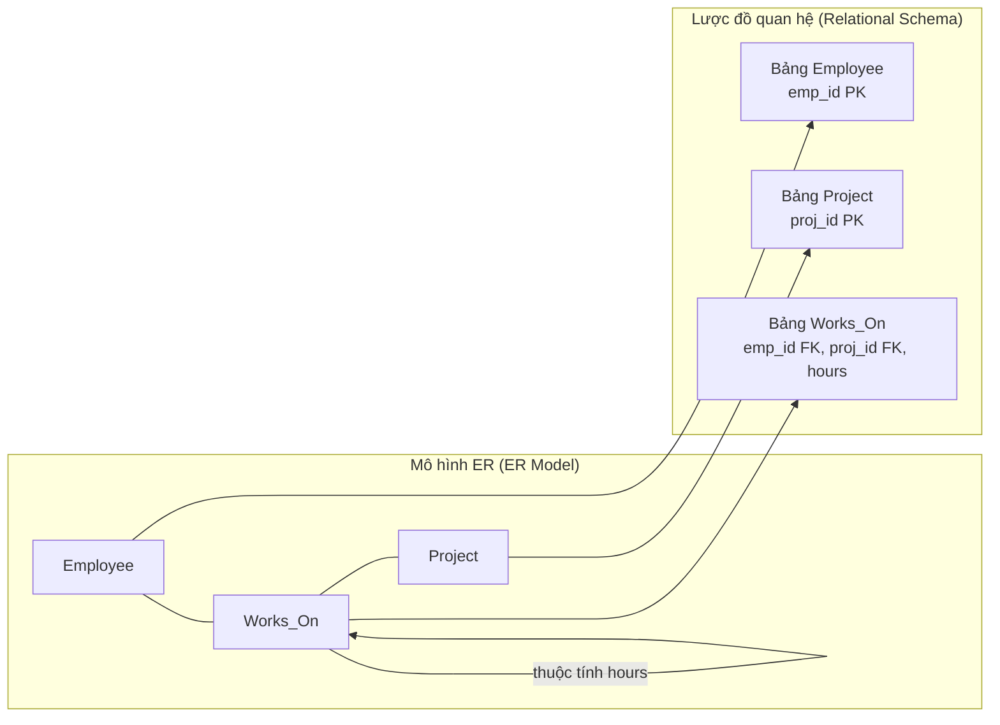

# Chapter 5: Mô hình Thực thể - Mối quan hệ (ER Model)

Mô hình Thực thể - Mối quan hệ (ER Model - Entity-Relationship Model) là một mô hình dữ liệu khái niệm ở mức cao, được sử dụng để mô tả cấu trúc của một cơ sở dữ liệu. Nó cung cấp một hệ thống ký hiệu trực quan bằng đồ họa để biểu diễn các thực thể, thuộc tính và mối quan hệ, giúp tạo điều kiện giao tiếp hiệu quả giữa những nhà thiết kế cơ sở dữ liệu và các bên liên quan. Mô hình ER đóng vai trò như một bản thiết kế chi tiết (blueprint) trước khi triển khai cơ sở dữ liệu quan hệ thực tế.

## 5.1 Thực thể và Thuộc tính (Entity and Attribute)

### 5.1.1 Thực thể (Entity)

Một thực thể (entity) là một đối tượng hoặc một khái niệm trong thế giới thực có thể phân biệt được với các đối tượng khác. Trong sơ đồ ER, các thực thể được biểu diễn bằng hình chữ nhật. Một tập hợp các thực thể có cùng loại được gọi là một tập thực thể (entity set).

**Ví dụ**: Employee (Nhân viên), Department (Phòng ban), Project (Dự án).

### 5.1.2 Thuộc tính (Attribute)

Các thuộc tính mô tả các đặc trưng của thực thể. Chúng được biểu diễn bằng hình oval kết nối với thực thể tương ứng. Các loại thuộc tính phổ biến:

- **Thuộc tính đơn trị (Simple attribute)**: Không thể chia nhỏ hơn nữa (ví dụ: tuổi, lương).
- **Thuộc tính phức hợp (Composite attribute)**: Có thể được chia nhỏ thành các thuộc tính thành phần (ví dụ: `address` có thể chia nhỏ thành `street`, `city`, `zip`).
- **Thuộc tính dẫn xuất (Derived attribute)**: Được tính toán từ các thuộc tính khác (ví dụ: `age` được tính từ ngày sinh `birth_date`).
- **Thuộc tính đa trị (Multi-valued attribute)**: Có thể có nhiều giá trị đối với một thực thể cụ thể (ví dụ: `phone_numbers` - một nhân viên có thể có nhiều số điện thoại).

**Biểu đồ**:



**Giải thích ký hiệu**:

- **PK** biểu thị khóa chính (trong các sơ đồ ER truyền thống thường được gạch chân).
- Các thuộc tính dẫn xuất thường được vẽ bằng hình oval nét đứt; thuộc tính đa trị vẽ bằng hình oval viền kép.

## 5.2 Mối quan hệ (Relationship)

Mối quan hệ (relationship) là sự liên kết giữa hai hoặc nhiều thực thể. Nó được biểu diễn dưới dạng hình thoi trong các sơ đồ ER truyền thống. Bậc của mối quan hệ (degree of a relationship) là số lượng các tập thực thể tham gia vào mối quan hệ đó (mối quan hệ nhị phân, tam phân, v.v.).

**Ví dụ**: Nhân viên **làm việc cho (works_for)** Phòng ban.

**Biểu đồ**:



Biểu đồ trên thể hiện một mối quan hệ nhị phân có kèm thuộc tính ngày bắt đầu `start_date` nằm trên chính mối quan hệ đó.

## 5.3 Bản số (Cardinality)

Bản số (cardinality / lượng số) xác định số lượng thực thể của tập thực thể này có thể liên kết với các thực thể của tập thực thể khác thông qua một mối quan hệ. Các bản số phổ biến: 1:1, 1:N, M:N.

### 5.3.1 Một - Một (1:1)

Mỗi thực thể trong tập thực thể A liên kết với tối đa một thực thể trong tập thực thể B và ngược lại.

**Ví dụ**: Mỗi phòng ban có một trưởng phòng (manager), và mỗi trưởng phòng chỉ quản lý duy nhất một phòng ban (giả định một người quản lý không quản lý nhiều phòng ban cùng lúc).



### 5.3.2 Một - Nhiều (1:N)

Một thực thể trong A có thể liên kết với nhiều thực thể trong B, nhưng một thực thể trong B chỉ liên kết với tối đa một thực thể trong A.

**Ví dụ**: Một phòng ban có nhiều nhân viên, nhưng mỗi nhân viên chỉ làm việc cho duy nhất một phòng ban.



### 5.3.3 Nhiều - Nhiều (M:N)

Các thực thể trong A có thể liên kết với nhiều thực thể trong B và ngược lại.

**Ví dụ**: Nhân viên tham gia vào nhiều dự án, và mỗi dự án cũng có thể được thực hiện bởi nhiều nhân viên.



**Bảng tóm tắt ký hiệu bản số** (sử dụng ký hiệu chân chim - crow's foot của Mermaid):

| Ký hiệu | Ý nghĩa |
|---------|---------|
| \| | chính xác là một (exactly one) |
| o | không hoặc một (zero or one) |
| } | một hoặc nhiều (one or more) |
| o{ | không hoặc nhiều (zero or more) |

## 5.4 Ràng buộc tham gia (Participation Constraints)

Ràng buộc tham gia (participation constraints) xác định liệu mọi thực thể trong một tập thực thể có bắt buộc phải tham gia vào một mối quan hệ hay không.

- **Tham gia toàn phần (Total participation - bắt buộc)**: Mọi thực thể trong tập thực thể phải xuất hiện trong ít nhất một mối liên kết của mối quan hệ đó. Biểu diễn bằng đường kẻ đôi.
- **Tham gia một phần (Partial participation - tùy chọn)**: Chỉ có một số thực thể tham gia vào mối quan hệ, một số thực thể khác có thể không tham gia. Biểu diễn bằng đường kẻ đơn.

**Ví dụ**: Mọi nhân viên bắt buộc phải thuộc về một phòng ban nào đó (Employee tham gia toàn phần vào mối quan hệ `belongs_to`). Tuy nhiên, một phòng ban mới thành lập có thể chưa có nhân viên nào (Department tham gia một phần).



Ở đây, ký hiệu đường kép (`||`) bên phía EMPLOYEE biểu thị sự tham gia toàn phần; ký hiệu đường đơn kèm chữ o (`|o`) bên phía DEPARTMENT biểu thị sự tham gia một phần.

## 5.5 Thực thể yếu (Weak Entity)

Thực thể yếu (weak entity) là thực thể không thể định danh duy nhất chỉ bằng các thuộc tính của chính nó; nó phải phụ thuộc vào một **mối quan hệ xác định (identifying relationship)** với một **thực thể mạnh (strong entity)** làm chủ sở hữu (owner). Thực thể yếu được biểu diễn dưới dạng hình chữ nhật kép. Mối quan hệ xác định được biểu diễn bằng hình thoi kép. Khóa bộ phận (partial key / discriminator - thuộc tính phân biệt) của thực thể yếu được biểu diễn gạch chân bằng nét đứt.

**Ví dụ**: Thực thể `Dependent` (Người phụ thuộc) không thể tồn tại nếu không có thực thể nhân viên `Employee`. Sự kết hợp giữa khóa chính của nhân viên và tên người phụ thuộc sẽ giúp định danh duy nhất cho thực thể người phụ thuộc đó.



Trong ký hiệu ER truyền thống, thực thể yếu và mối quan hệ xác định được vẽ bằng đường viền kép. Mặc dù công cụ Mermaid không hỗ trợ vẽ trực tiếp viền kép nhưng ý tưởng thiết kế vẫn được thể hiện rõ qua cấu trúc ánh xạ.

## 5.6 Ánh xạ mô hình ER sang Lược đồ quan hệ (Mapping ER to Relational Schema)

Quá trình chuyển đổi sơ đồ ER thành một tập hợp các bảng quan hệ thực tế tuân theo các quy tắc cụ thể cho từng thành phần cấu thành.

### 5.6.1 Ánh xạ Thực thể mạnh

Tạo một bảng quan hệ cho mỗi tập thực thể mạnh. Tất cả các thuộc tính đơn trị sẽ trở thành các cột tương ứng trong bảng. Lựa chọn một khóa chính (primary key) từ các thuộc tính khóa của thực thể.

**Ví dụ**: `Employee(emp_id, name, birth_date)` – với `emp_id` là khóa chính.

### 5.6.2 Ánh xạ Thực thể yếu

Tạo một bảng quan hệ riêng cho thực thể yếu. Đưa các thuộc tính khóa bộ phận của thực thể yếu và khóa chính của thực thể mạnh làm chủ sở hữu vào làm khóa ngoại (foreign key). Khóa chính hỗn hợp (composite primary key) của bảng mới này sẽ là sự kết hợp giữa khóa chính của thực thể chủ sở hữu và khóa bộ phận của thực thể yếu.

**Ví dụ**: `Dependent(emp_id, dependent_name, birth_date)` trong đó `(emp_id, dependent_name)` tạo thành khóa chính và `emp_id` đóng vai trò là khóa ngoại tham chiếu đến `Employee(emp_id)`.

### 5.6.3 Ánh xạ các Mối quan hệ

Cách ánh xạ phụ thuộc vào bản số và ràng buộc tham gia của mối quan hệ.

**Mối quan hệ nhị phân 1:1**:
- Chọn bảng của một trong hai thực thể và đưa khóa chính của thực thể còn lại vào làm khóa ngoại. Đưa thêm các thuộc tính đi kèm mối quan hệ (nếu có).
- Ngoài ra, cũng có thể tạo một bảng quan hệ riêng biệt đại diện cho mối quan hệ này.

**Mối quan hệ nhị phân 1:N**:
- Đưa khóa chính của thực thể ở nhánh phía "1" vào làm khóa ngoại trong bảng quan hệ của thực thể ở nhánh phía "N". Đưa thêm các thuộc tính đi kèm mối quan hệ (nếu có).

**Mối quan hệ nhị phân M:N**:
- Bắt buộc phải tạo một bảng quan hệ mới đại diện cho mối quan hệ này. Đưa các khóa chính của cả hai thực thể tham gia vào làm khóa ngoại. Sự kết hợp của hai khóa ngoại này sẽ tạo thành khóa chính hỗn hợp cho bảng mới. Đưa thêm các thuộc tính của mối quan hệ vào bảng.

**Ví dụ**:

Mô hình ER: Employee (emp_id) – Works_On (hours) – Project (proj_id). Ánh xạ thu được:

```
Employee(emp_id, name, ...)
Project(proj_id, title, ...)
Works_On(emp_id, proj_id, hours)
```

**Sơ đồ quá trình ánh xạ**:



### 5.6.4 Ánh xạ các Thuộc tính đa trị

Tạo một bảng quan hệ riêng cho mỗi thuộc tính đa trị. Đưa khóa chính của thực thể chủ sở hữu vào làm khóa ngoại. Khóa chính của bảng mới này sẽ là sự kết hợp giữa khóa của chủ sở hữu và chính giá trị thuộc tính đa trị đó.

**Ví dụ**: Thực thể Employee có thuộc tính đa trị `phone_numbers`. Ánh xạ thành bảng:

```
Employee_Phone(emp_id, phone_number)
```

### 5.6.5 Ánh xạ các Thuộc tính phức hợp

Trải phẳng thuộc tính phức hợp bằng cách đưa trực tiếp các thuộc tính đơn thành phần cấu thành nó vào bảng quan hệ của thực thể sở hữu. Không cần tạo bảng riêng biệt cho thuộc tính phức hợp.

**Ví dụ**: Thuộc tính phức hợp `Address(street, city, zip)` sẽ chuyển đổi thành 3 cột độc lập `street`, `city`, `zip` nằm trực tiếp trong bảng thực thể sở hữu.

### 5.6.6 Ánh xạ các Thuộc tính dẫn xuất

Các thuộc tính dẫn xuất không được lưu trữ vật lý dưới dạng cột trong lược đồ quan hệ. Chúng sẽ được tính toán động khi cần thiết thông qua các câu lệnh truy vấn hoặc view.

### 5.6.7 Ví dụ ánh xạ hoàn chỉnh

**Sơ đồ ER** (quan niệm):

Các thực thể: Employee(emp_id, name, birth_date), Department(dept_id, dept_name, budget). Mối quan hệ: Employee works_for Department (mối quan hệ 1:N, Employee tham gia toàn phần). Thuộc tính đa trị: Employee có phone_numbers.

**Lược đồ SQL ánh xạ thành công**:

```sql
CREATE TABLE Department (
    dept_id INTEGER PRIMARY KEY,
    dept_name VARCHAR(100),
    budget DECIMAL(12,2)
);

CREATE TABLE Employee (
    emp_id INTEGER PRIMARY KEY,
    name VARCHAR(100),
    birth_date DATE,
    dept_id INTEGER NOT NULL,
    FOREIGN KEY (dept_id) REFERENCES Department(dept_id)
);

CREATE TABLE Employee_Phone (
    emp_id INTEGER,
    phone_number VARCHAR(20),
    PRIMARY KEY (emp_id, phone_number),
    FOREIGN KEY (emp_id) REFERENCES Employee(emp_id)
);
```

## 5.7 Tóm tắt

Mô hình ER cung cấp một phương thức trực quan rõ ràng để thiết kế các cơ sở dữ liệu trước khi triển khai kỹ thuật. Các khái niệm cốt lõi:

- **Thực thể** (mạnh và yếu) cùng các **thuộc tính** (đơn trị, phức hợp, dẫn xuất, đa trị).
- **Mối quan hệ** đi kèm bản số (1:1, 1:N, M:N) và ràng buộc tham gia (toàn phần/một phần).
- **Quy tắc ánh xạ** giúp chuyển đổi trực tiếp sơ đồ ER thành lược đồ quan hệ: tạo bảng cho thực thể mạnh, tạo bảng riêng cho mối quan hệ M:N và thuộc tính đa trị, sử dụng khóa ngoại cho mối quan hệ 1:N và 1:1, áp dụng khóa chính hỗn hợp cho thực thể yếu.

---
