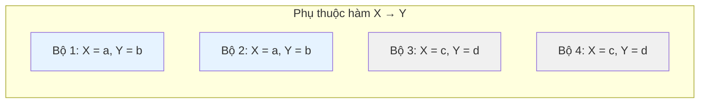
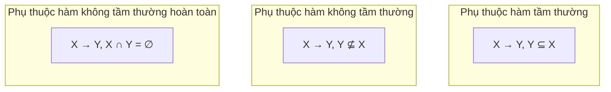
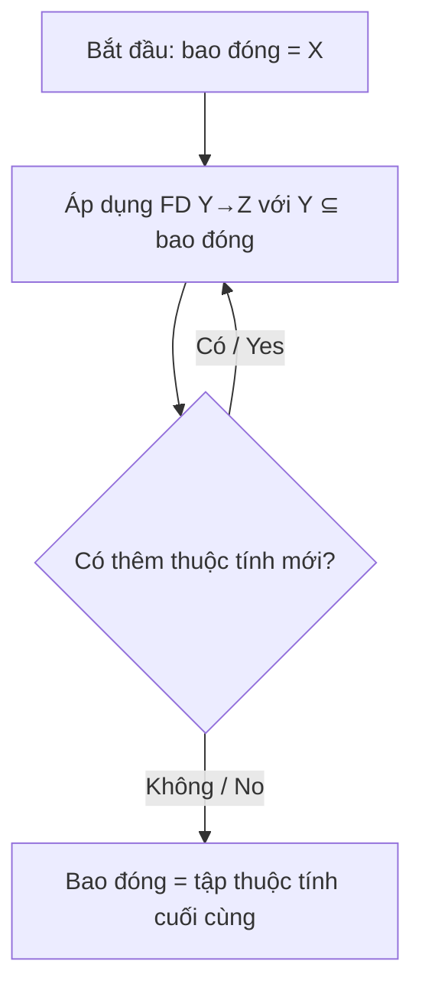
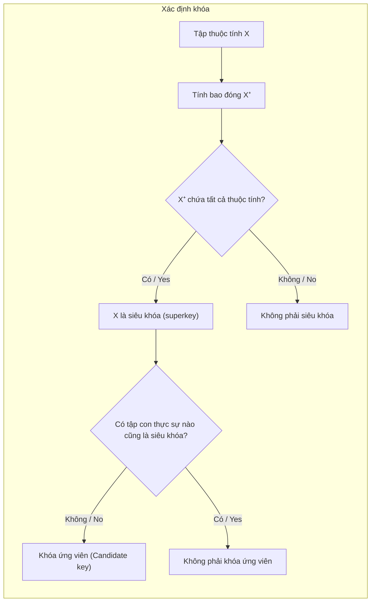
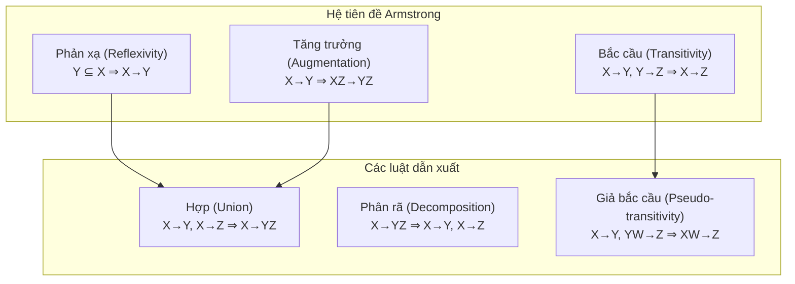

# Chapter 6: Phụ thuộc hàm (Functional Dependencies)

Phụ thuộc hàm (Functional dependencies) là một khái niệm nền tảng trong thiết kế cơ sở dữ liệu quan hệ. Chúng mô tả các ràng buộc giữa các thuộc tính và tạo cơ sở cho quá trình chuẩn hóa (normalization). Việc hiểu rõ phụ thuộc hàm giúp xác định các khóa ứng viên, phát hiện dư thừa dữ liệu và định hướng phân rã lược đồ cơ sở dữ liệu.

## 6.1 Phụ thuộc hàm (Functional Dependency - FD)

Một phụ thuộc hàm là một ràng buộc giữa hai tập hợp thuộc tính trong một quan hệ. Cho một quan hệ R với các tập thuộc tính X và Y (là các tập con của lược đồ R), ta nói rằng **X xác định hàm Y**, ký hiệu là **X → Y**, nếu với mọi thực thể (instance) hợp lệ của R, bất cứ khi nào hai bộ có cùng giá trị trên tất cả các thuộc tính trong X, chúng cũng phải có cùng giá trị trên tất cả các thuộc tính trong Y.

Nói cách khác, giá trị của X xác định duy nhất giá trị của Y.

**Ví dụ**: Trong quan hệ `Employee(emp_id, name, department, salary)`, phụ thuộc hàm `emp_id → name` được thỏa mãn vì mỗi mã nhân viên (`emp_id`) chỉ tương ứng với duy nhất một tên nhân viên (`name`). Tương tự, ta có `emp_id → department` và `emp_id → salary`. Tuy nhiên, `department → salary` có thể không được thỏa mãn vì nhiều nhân viên trong cùng một phòng ban có thể có các mức lương khác nhau.

**Biểu đồ**:

Biểu đồ minh họa rằng với mỗi giá trị X cụ thể, tất cả các bộ tương ứng đều có chung một giá trị Y duy nhất.

## 6.2 Phụ thuộc hàm tầm thường và không tầm thường (Trivial and Non-trivial FDs)

### 6.2.1 Phụ thuộc hàm tầm thường (Trivial FD)

Một phụ thuộc hàm X → Y là **tầm thường (trivial)** nếu Y ⊆ X. Nó luôn được thỏa mãn trong mọi quan hệ vì nếu hai bộ trùng khớp giá trị trên tất cả các thuộc tính của X, chúng sẽ tự động trùng khớp giá trị trên bất kỳ tập con nào của X.

**Ví dụ**:
- `{emp_id, name} → emp_id` (tầm thường)
- `{emp_id} → emp_id` (tầm thường)
- `{emp_id, name} → name` (tầm thường)

Các phụ thuộc hàm tầm thường không cung cấp thông tin hữu ích nào cho việc thiết kế cơ sở dữ liệu.

### 6.2.2 Phụ thuộc hàm không tầm thường (Non-trivial FD)

Một phụ thuộc hàm X → Y là **không tầm thường (non-trivial)** nếu Y ⊈ X (tức là có ít nhất một thuộc tính trong Y không thuộc về X). Nó được gọi là **không tầm thường hoàn toàn (completely non-trivial)** nếu X ∩ Y = ∅.

**Ví dụ**:
- `emp_id → name` (không tầm thường, và không tầm thường hoàn toàn nếu emp_id và name là hai tập không giao nhau)
- `emp_id, department → salary` (không tầm thường nếu salary không thuộc về vế trái)

**Biểu đồ**:

## 6.3 Bao đóng của tập thuộc tính (Closure of Attributes)

**Bao đóng (closure)** của một tập thuộc tính X dưới một tập phụ thuộc hàm F, ký hiệu là **X⁺**, là tập hợp tất cả các thuộc tính được xác định hàm bởi X, tức là tất cả các thuộc tính A sao cho X → A có thể được suy diễn ra từ tập F bằng cách sử dụng các quy tắc suy diễn.

Thuật toán tìm bao đóng:

1. Khởi tạo `closure = X`.
2. Lặp lại:
   - Với mỗi phụ thuộc hàm Y → Z trong F, nếu Y ⊆ `closure`, thì thêm Z vào `closure`.
3. Tiếp tục lặp cho đến khi không thể thêm thuộc tính nào vào `closure` được nữa.

**Ví dụ**: Cho quan hệ R(A, B, C, D, E, F) và tập phụ thuộc hàm F = {A → B, B → C, AD → E, C → D}. Tìm bao đóng `(A)⁺`.

- Bắt đầu: `closure = {A}`
- Phụ thuộc hàm A → B thêm B vào bao đóng → `closure = {A, B}`
- Phụ thuộc hàm B → C thêm C vào bao đóng → `closure = {A, B, C}`
- Phụ thuộc hàm C → D thêm D vào bao đóng → `closure = {A, B, C, D}`
- Phụ thuộc hàm AD → E: Cả A và D đều đã nằm trong bao đóng, vì vậy thêm E vào bao đóng → `closure = {A, B, C, D, E}`
- Không còn phụ thuộc hàm nào có thể áp dụng được nữa. Kết quả: `(A)⁺ = {A, B, C, D, E}`

**Biểu đồ**:

## 6.4 Tìm khóa bằng bao đóng thuộc tính (Finding Keys)

Một **khóa ứng viên (candidate key)** là một tập thuộc tính tối thiểu xác định hàm tất cả các thuộc tính khác trong quan hệ. Để xác định xem tập X có phải là một siêu khóa (superkey) hay không, ta tính bao đóng X⁺. Nếu X⁺ chứa tất cả các thuộc tính của quan hệ R, thì X là một siêu khóa. X sẽ là một khóa ứng viên nếu nó là một siêu khóa và không có tập con thực sự nào của nó là siêu khóa.

**Thuật toán tìm tất cả các khóa ứng viên** (đối với các lược đồ nhỏ):

1. Bắt đầu từ các thuộc tính đơn lẻ; tính bao đóng của chúng.
2. Nếu bao đóng của một thuộc tính đơn lẻ chứa toàn bộ các thuộc tính của quan hệ, thuộc tính đó là khóa ứng viên.
3. Nếu không, xét các cặp thuộc tính, sau đó là bộ ba thuộc tính, v.v., nhưng chỉ xem xét các tập hợp không chứa bất kỳ khóa ứng viên nào đã được tìm thấy trước đó (đảm bảo tính tối thiểu).
4. Dừng lại khi không có tập lớn hơn nào có thể là khóa ứng viên (vì mọi tập siêu khóa bao chứa một khóa ứng viên đều là siêu khóa nhưng không tối thiểu).

**Ví dụ**: Cho quan hệ R(A, B, C, D) với F = {A → B, B → C, C → D}. Tính các bao đóng:

- (A)⁺ = {A, B, C, D} → A là khóa ứng viên.
- (B)⁺ = {B, C, D} (thiếu thuộc tính A) → không phải siêu khóa.
- (C)⁺ = {C, D} → không phải siêu khóa.
- (D)⁺ = {D} → không phải siêu khóa.
- (B, C)⁺ = {B, C, D} → không phải siêu khóa.
- Vì A đã là một khóa, chúng ta không cần xem xét các tập hợp chứa A (vì chúng là siêu khóa nhưng không tối thiểu). Do đó, khóa ứng viên duy nhất của R là A.

**Biểu đồ**:

## 6.5 Hệ tiên đề Armstrong (Armstrong’s Axioms)

Hệ tiên đề Armstrong là một tập hợp các quy tắc suy diễn được sử dụng để tìm tất cả các phụ thuộc hàm được suy ra logic từ một tập phụ thuộc hàm F cho trước. Các quy tắc này có tính **đúng đắn (sound)** (chỉ tạo ra các phụ thuộc hàm thực sự được suy ra từ F) và **đầy đủ (complete)** (có thể suy ra mọi phụ thuộc hàm được suy ra từ F).

### 6.5.1 Các tiên đề cơ bản (Primary Axioms)

1. **Tính phản xạ (Reflexivity)**: Nếu Y ⊆ X, thì X → Y. (Phụ thuộc hàm tầm thường)
2. **Tính tăng trưởng (Augmentation)**: Nếu X → Y, thì XZ → YZ với tập thuộc tính Z bất kỳ. (Thêm thuộc tính vào cả hai vế giữ nguyên phụ thuộc hàm)
3. **Tính bắc cầu (Transitivity)**: Nếu X → Y và Y → Z, thì X → Z.

### 6.5.2 Các quy tắc suy diễn bổ sung

Từ các tiên đề cơ bản ở trên, chúng ta có thể chứng minh thêm các luật dẫn xuất:

- **Luật hợp (Union)**: Nếu X → Y và X → Z, thì X → YZ.
- **Luật phân rã (Decomposition)**: Nếu X → YZ, thì X → Y và X → Z.
- **Luật giả bắc cầu (Pseudo-transitivity)**: Nếu X → Y và YW → Z, thì XW → Z.

### 6.5.3 Ví dụ chứng minh sử dụng hệ tiên đề Armstrong

Cho tập phụ thuộc hàm F = {A → B, B → C}. Hãy chứng minh A → AC.

1. A → B (giả thiết)
2. Tăng trưởng (1) với A: AA → AB → A → AB (vì AA = A)
3. Phân rã A → AB thành A → A (tầm thường) và A → B (đã có ở bước 1)
4. Từ A → B và B → C, áp dụng tính bắc cầu ta có A → C.
5. Hợp hai phụ thuộc hàm A → A và A → C ta có A → AC.

### 6.5.4 Bao đóng của tập phụ thuộc hàm (F⁺)

Bao đóng của tập phụ thuộc hàm F (ký hiệu là F⁺) là tập hợp tất cả các phụ thuộc hàm có thể được suy ra từ F bằng cách sử dụng hệ tiên đề Armstrong. Việc tính toán F⁺ có độ phức tạp mũ (exponential), nhưng trong thực tế chúng ta có thể kiểm tra xem một phụ thuộc hàm X → Y có thuộc F⁺ hay không bằng cách tính bao đóng của tập thuộc tính X và kiểm tra xem Y có phải tập con của X⁺ hay không.

**Biểu đồ**:

## 6.6 Tóm tắt

Phụ thuộc hàm đóng vai trò rất quan trọng cho việc thiết kế cơ sở dữ liệu quan hệ và chuẩn hóa dữ liệu. Các nội dung chính cần nắm:

- Một phụ thuộc hàm **X → Y** biểu thị rằng giá trị của X xác định duy nhất giá trị của Y.
- **Phụ thuộc hàm tầm thường** có Y ⊆ X; **phụ thuộc hàm không tầm thường** cung cấp các ràng buộc hữu ích.
- **Bao đóng thuộc tính (X⁺)** là tập hợp tất cả các thuộc tính được xác định hàm bởi X dưới một tập FD cho trước.
- **Khóa** được tìm thấy bằng cách kiểm tra bao đóng: một khóa ứng viên là một siêu khóa tối thiểu.
- **Hệ tiên đề Armstrong** (phản xạ, tăng trưởng, bắc cầu) cho phép suy dẫn có hệ thống tất cả các phụ thuộc hàm được suy ra từ F.

---
