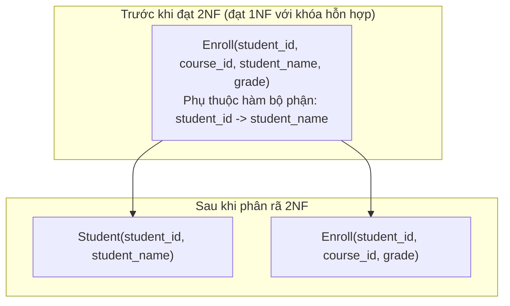
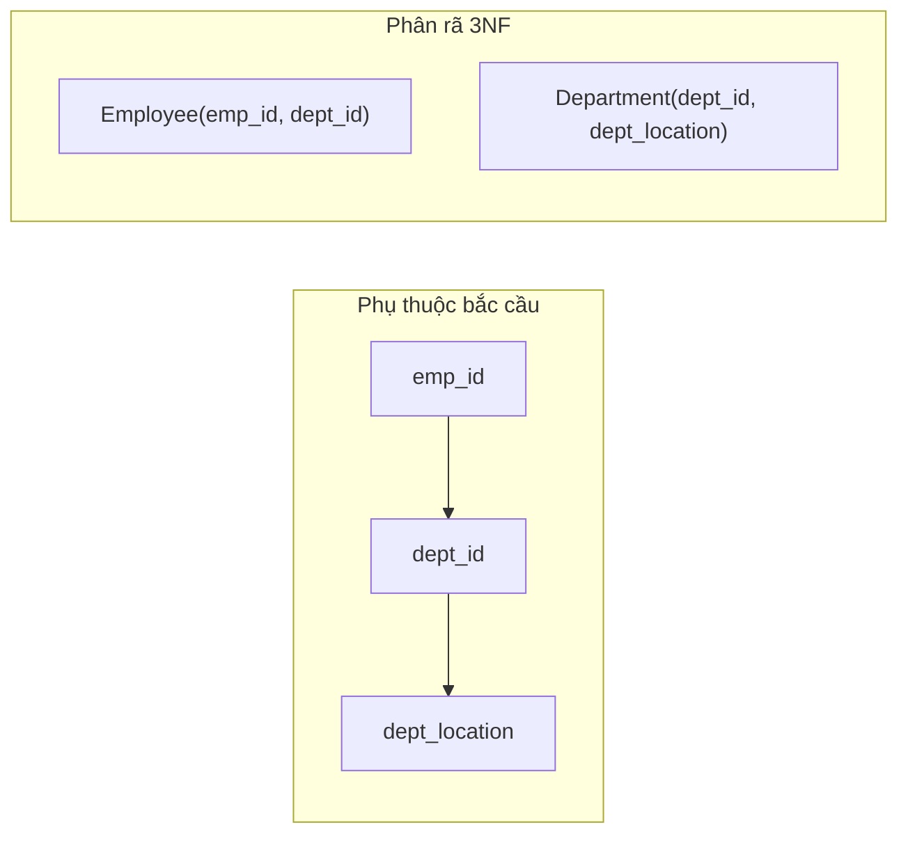
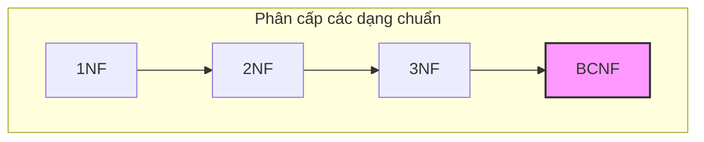
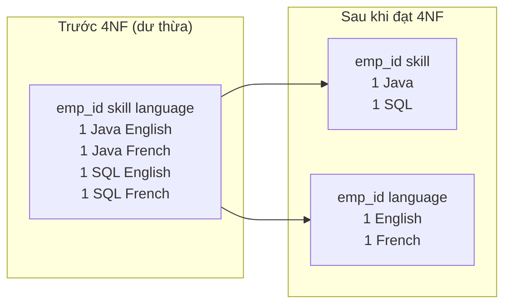
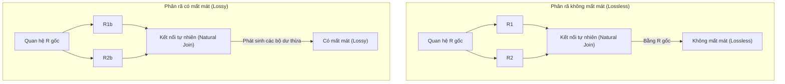
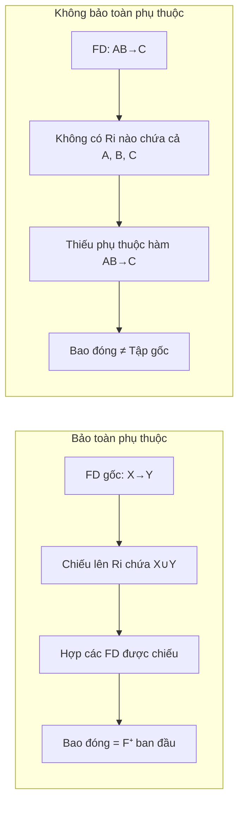
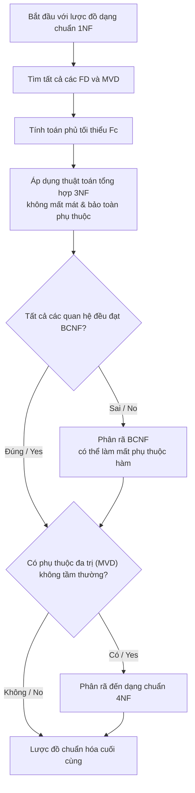

# Chapter 7: Chuẩn hóa (Normalization)

Chuẩn hóa (Normalization) là quá trình phân rã các lược đồ quan hệ nhằm loại bỏ dư thừa dữ liệu và tránh các dị thường cập nhật (update anomalies - bao gồm dị thường thêm mới, xóa và sửa đổi). Quá trình này dựa trên lý thuyết phụ thuộc hàm, và đối với các dạng chuẩn cao hơn, dựa trên các phụ thuộc đa trị (multi-valued dependencies). Chương này trình bày bốn dạng chuẩn đầu tiên, các điều kiện để phân rã không mất mát thông tin và khái niệm bảo toàn phụ thuộc hàm.

## 7.1 Dạng chuẩn 1 (First Normal Form - 1NF)

### Định nghĩa
Một lược đồ quan hệ R đạt **Dạng chuẩn 1 (1NF)** nếu miền giá trị của mọi thuộc tính là **nguyên tố** (atomic - không thể chia nhỏ hơn nữa). Không thuộc tính nào có thể chứa các tập hợp, danh sách, giá trị phức hợp hoặc các nhóm lặp lại. Mỗi bộ chỉ chứa đúng một giá trị duy nhất (có thể nhận giá trị `NULL`) cho mỗi thuộc tính.

### Vi phạm và Khắc phục
Sự vi phạm dạng chuẩn 1NF thường xảy ra ở hai dạng:
- **Cột lặp lại (Repeating columns)**: ví dụ: `phone1`, `phone2`, `phone3`.
- **Thuộc tính nhận giá trị tập hợp (Set-valued attributes)**: ví dụ: thuộc tính `phone_numbers` chứa chuỗi "555-1111, 555-2222".

**Cách khắc phục**: Trải phẳng quan hệ bằng cách tạo một bộ riêng biệt cho mỗi giá trị trong thuộc tính đa trị.

**Ví dụ (khắc phục cột lặp lại)**:

| emp_id | name  | phone1   | phone2   |
|--------|-------|----------|----------|
| 101    | Alice | 555-1111 | 555-2222 |

Sau khi đưa về dạng chuẩn 1NF:

| emp_id | name  | phone_number |
|--------|-------|--------------|
| 101    | Alice | 555-1111     |
| 101    | Alice | 555-2222     |

**Biểu đồ**:

### Tầm quan trọng
Dạng chuẩn 1NF là yêu cầu bắt buộc đối với tất cả các hệ quản trị cơ sở dữ liệu quan hệ. Nó loại bỏ các cấu trúc lồng nhau và đảm bảo rằng mỗi giao điểm giữa hàng và cột chỉ chứa một giá trị nguyên tố duy nhất.

## 7.2 Dạng chuẩn 2 (Second Normal Form - 2NF)

### Điều kiện tiên quyết
Quan hệ phải đạt dạng chuẩn 1NF.

### Định nghĩa
Một quan hệ đạt **Dạng chuẩn 2 (2NF)** nếu nó **không chứa phụ thuộc hàm bộ phận (no partial dependency)**: nghĩa là không có thuộc tính không khóa (thuộc tính thứ yếu - non-prime attribute, thuộc tính không nằm trong bất kỳ khóa ứng viên nào) phụ thuộc hàm vào một **tập con thực sự** của bất kỳ khóa ứng viên nào. Nói cách khác, mọi thuộc tính không khóa phải **phụ thuộc hàm đầy đủ (fully functionally dependent)** vào mọi khóa ứng viên.

### Giải thích về phụ thuộc bộ phận
Giả sử có một khóa ứng viên hỗn hợp (ví dụ: `(student_id, course_id)`). Một phụ thuộc bộ phận xảy ra khi một thuộc tính không khóa chỉ phụ thuộc vào một phần của khóa ứng viên đó (ví dụ: `student_id → student_name`).

### Ví dụ về sự vi phạm
Xét quan hệ `Enroll(student_id, course_id, student_name, grade)`.
- Khóa ứng viên: `(student_id, course_id)`.
- Các thuộc tính không khóa: `student_name`, `grade`.
- Phụ thuộc hàm vi phạm: tồn tại `student_id → student_name`. Ở đây, `student_name` phụ thuộc vào tập con thực sự của khóa ứng viên (chỉ riêng `student_id`). Đây là phụ thuộc hàm bộ phận → vi phạm dạng chuẩn 2NF.

### Phân rã về 2NF
Phân rã bảng trên thành hai bảng:
- `Student(student_id, student_name)` – tất cả thuộc tính phụ thuộc đầy đủ vào khóa chính.
- `Enroll(student_id, course_id, grade)` – các thuộc tính còn lại phụ thuộc đầy đủ vào khóa chính hỗn hợp.

### Thuật toán phân rã 2NF hình thức
Cho một quan hệ R đi kèm tập các khóa ứng viên và tập phụ thuộc hàm F:
1. Xác định tất cả các phụ thuộc bộ phận: với mỗi khóa ứng viên hỗn hợp K, tìm xem có tồn tại phụ thuộc hàm X → Y nào sao cho X ⊂ K, X khác rỗng, và Y chứa các thuộc tính không khóa.
2. Với mỗi phụ thuộc hàm X → Y vi phạm như vậy, tạo một quan hệ mới chứa các thuộc tính `(X ∪ Y)` và loại bỏ tập thuộc tính Y khỏi quan hệ gốc.
3. Đảm bảo mỗi quan hệ mới đều đạt 1NF và không còn phụ thuộc bộ phận nào.

**Biểu đồ**:

## 7.3 Dạng chuẩn 3 (Third Normal Form - 3NF)

### Điều kiện tiên quyết
Quan hệ phải đạt dạng chuẩn 2NF.

### Định nghĩa
Một quan hệ đạt **Dạng chuẩn 3 (3NF)** nếu nó **không chứa phụ thuộc bắc cầu (no transitive dependency)**: nghĩa là với mọi phụ thuộc hàm không tầm thường X → Y, thì một trong hai điều kiện sau phải được thỏa mãn:
- X là một siêu khóa (superkey), **hoặc**
- Y là một thuộc tính khóa (prime attribute - tức là mỗi thuộc tính trong Y là thành phần cấu thành của một khóa ứng viên nào đó).

Nói một cách đơn giản, không có thuộc tính không khóa nào phụ thuộc hàm bắc cầu vào một thuộc tính không khóa khác.

### Giải thích về phụ thuộc bắc cầu
Phụ thuộc bắc cầu xảy ra khi X → Y và Y → Z, trong đó Y không phải là siêu khóa và Z là thuộc tính không khóa. Khi đó, sự tồn tại của phụ thuộc hàm bắc cầu X → Z là không mong muốn.

### Ví dụ về sự vi phạm
Xét quan hệ `Employee(emp_id, dept_id, dept_location)` với các phụ thuộc hàm:
- `emp_id → dept_id`
- `dept_id → dept_location`
Ở đây, ta có phụ thuộc bắc cầu `emp_id → dept_location` thông qua `dept_id`. Thuộc tính không khóa `dept_location` phụ thuộc vào `dept_id` (không phải là siêu khóa) → vi phạm dạng chuẩn 3NF.

### Phân rã về 3NF
Phân rã bảng trên thành:
- `Employee(emp_id, dept_id)`
- `Department(dept_id, dept_location)`

### Thuật toán tổng hợp 3NF (Đảm bảo Không mất mát thông tin & Bảo toàn phụ thuộc)
Cho quan hệ R và tập phụ thuộc hàm F:
1. Tìm phủ tối thiểu (minimal cover) `Fc` của tập F.
2. Với mỗi phụ thuộc hàm X → Y trong phủ tối thiểu `Fc`, tạo một lược đồ quan hệ mới chứa các thuộc tính `(X ∪ Y)`.
3. Nếu không có lược đồ quan hệ mới nào ở trên chứa một khóa ứng viên của quan hệ gốc R, tạo thêm một quan hệ bổ sung chứa các thuộc tính của một khóa ứng viên của R.
4. Loại bỏ các lược đồ quan hệ là tập con của các lược đồ khác.

Thuật toán này đảm bảo việc phân rã về 3NF luôn không mất mát thông tin (lossless) và bảo toàn được các phụ thuộc hàm ban đầu.

**Biểu đồ**:

## 7.4 Dạng chuẩn Boyce-Codd (BCNF)

### Định nghĩa
Một quan hệ đạt **Dạng chuẩn Boyce-Codd (BCNF)** nếu với mọi phụ thuộc hàm không tầm thường X → Y, thì X bắt buộc phải là một **siêu khóa (superkey)**. BCNF là một dạng chuẩn mạnh hơn 3NF: nó loại bỏ tất cả các dư thừa thông tin dựa trên phụ thuộc hàm, nhưng đôi khi có thể phải đánh đổi bằng việc không bảo toàn được phụ thuộc hàm.

### Điểm khác biệt so với 3NF
Trong 3NF, một phụ thuộc hàm X → Y vẫn được cho phép nếu Y là thuộc tính khóa (prime attribute) ngay cả khi X không phải là siêu khóa. Dạng chuẩn BCNF cấm hoàn toàn điều này. Vì vậy, BCNF nghiêm ngặt hơn 3NF.

### Ví dụ vi phạm BCNF nhưng đạt 3NF
Xét một ví dụ kinh điển:
Quan hệ `R(A, B, C)` với các phụ thuộc hàm: `AB → C` và `C → B`.
Các khóa ứng viên của quan hệ: `AB` và `AC`.
Trong phụ thuộc hàm `C → B`, vế trái `C` không phải là siêu khóa, nhưng vế phải `B` là một thuộc tính khóa (nằm trong khóa ứng viên `AB`). Vì vậy, phụ thuộc hàm này được cho phép trong 3NF nhưng vi phạm BCNF.

### Thuật toán phân rã BCNF (Không mất mát, có thể không bảo toàn phụ thuộc)
1. Khởi tạo `result = {R}`.
2. Khi còn tồn tại một quan hệ S trong `result` chưa đạt BCNF:
   - Tìm một phụ thuộc hàm không tầm thường X → Y trong S vi phạm BCNF (tức là X không phải là siêu khóa của S).
   - Thay thế S bằng hai quan hệ mới: `(X ∪ Y)` và `(S \ Y)`.
3. Tiếp tục lặp cho đến khi tất cả các quan hệ đều đạt dạng chuẩn BCNF.

**Ví dụ**: Với quan hệ `R(A, B, C)` và các phụ thuộc hàm `AB → C`, `C → B` nêu trên. Phụ thuộc hàm vi phạm BCNF là `C → B`. Phân rã thu được:
- Phân rã bước một: `R1(C, B)` và `R2(A, C)`. Quan hệ `R1` có phụ thuộc hàm `C → B` (C là siêu khóa trong R1 → đạt BCNF). Quan hệ `R2` không chứa phụ thuộc hàm không tầm thường nào khác → đạt BCNF. Phép phân rã này là không mất mát (lossless), tuy nhiên phụ thuộc hàm ban đầu `AB → C` đã bị mất vì hai thuộc tính `A` và `B` không còn nằm chung trong một bảng quan hệ nào nữa.

**Biểu đồ**:

## 7.5 Dạng chuẩn 4 (Fourth Normal Form - 4NF) – Ý tưởng cơ bản

### Động lực phát triển
Dạng chuẩn BCNF chỉ giải quyết các vấn đề liên quan đến phụ thuộc hàm. Tuy nhiên, trong thực tế vẫn tồn tại các **phụ thuộc đa trị (MVD - multi-valued dependencies)** có thể gây ra dư thừa dữ liệu ngay cả khi quan hệ đã đạt dạng chuẩn BCNF.

### Phụ thuộc đa trị (MVD)
Một phụ thuộc đa trị `X →→ Y` (đọc là "X đa xác định Y") có nghĩa là với một giá trị X cho trước, tập hợp các giá trị Y tương ứng hoàn toàn độc lập với tập hợp các giá trị Z (trong đó Z là tập hợp chứa các thuộc tính còn lại của quan hệ). Định nghĩa hình thức: nếu có hai bộ `(x, y1, z1)` và `(x, y2, z2)` tồn tại trong quan hệ, thì các bộ `(x, y1, z2)` và `(x, y2, z1)` cũng bắt buộc phải tồn tại trong quan hệ đó.

### Định nghĩa dạng chuẩn 4NF
Một quan hệ đạt **Dạng chuẩn 4 (4NF)** nếu nó đạt chuẩn BCNF và **không chứa phụ thuộc đa trị không tầm thường nào** ngoại trừ các phụ thuộc đa trị được suy diễn từ các khóa ứng viên (tức là phụ thuộc đa trị X →→ Y chỉ được phép tồn tại nếu X là một siêu khóa).

### Ví dụ về sự vi phạm
Xét quan hệ `Employee_Skills_Languages(emp_id, skill, language)`. Giả sử mỗi nhân viên có thể có nhiều kỹ năng (`skill`) và biết nhiều ngôn ngữ (`language`) một cách độc lập nhau. Khóa duy nhất của quan hệ này là tổ hợp của cả 3 thuộc tính, và không có phụ thuộc hàm nào tồn tại ở đây, do đó bảng đã đạt chuẩn BCNF. Tuy nhiên, tồn tại phụ thuộc đa trị: `emp_id →→ skill` và `emp_id →→ language`. Điều này gây ra sự dư thừa lớn: với mỗi kỹ năng mới thêm vào, ta lại phải lặp lại tất cả các ngôn ngữ mà nhân viên đó biết.

| emp_id | skill  | language |
|--------|--------|----------|
| 1      | Java   | English  |
| 1      | Java   | French   |
| 1      | SQL    | English  |
| 1      | SQL    | French   |

Sự dư thừa này được loại bỏ triệt để bằng cách phân rã thành hai bảng:
- `Employee_Skill(emp_id, skill)`
- `Employee_Language(emp_id, language)`

**Biểu đồ**:

## 7.6 Phân rã không mất mát thông tin (Lossless Decomposition)

### Định nghĩa
Một phép phân rã quan hệ R thành các quan hệ con `R1, R2, ..., Rk` được gọi là **không mất mát (lossless-join)** nếu phép kết tự nhiên (natural join) của toàn bộ các quan hệ con `Ri` tái tạo lại được chính xác quan hệ gốc R ban đầu (không phát sinh thêm các bộ rác/giả mạo và không làm mất đi bộ dữ liệu nào). Tính chất không mất mát là tính chất **bắt buộc phải đạt được** đối với bất kỳ phép phân rã cơ sở dữ liệu thực tế nào.

### Kiểm tra tính không mất mát đối với phân rã nhị phân
Với phép phân rã một bảng thành hai bảng con `R1` và `R2`, phép kết nối là không mất mát nếu và chỉ nếu:
- `(R1 ∩ R2) → R1` **hoặc** `(R1 ∩ R2) → R2` (tức là tập thuộc tính chung giữa hai bảng con phải đóng vai trò là một siêu khóa của ít nhất một trong hai bảng con đó).

### Ví dụ
Cho quan hệ `R(A, B, C)` với tập phụ thuộc hàm F = `{A → B}`. Phân rã thành `R1(A, B)` và `R2(A, C)`. Giao của hai quan hệ con là `{A}`. Vì phụ thuộc hàm `A → B` được thỏa mãn, `A` chính là siêu khóa của `R1`. Do đó phép phân rã này là không mất mát.

### Ví dụ phản chứng về phân rã có mất mát (Lossy)
Cho quan hệ `R(A, B, C)` không chứa phụ thuộc hàm nào (hoặc chỉ có `A → B`). Phân rã thành `R1(A, B)` và `R2(B, C)`. Tập thuộc tính chung là `{B}`. Thuộc tính `B` không phải là siêu khóa của bất kỳ bảng con nào (không có phụ thuộc hàm `B → A` hay `B → C`). Phép kết nối lại hai bảng con này có thể phát sinh các bộ dữ liệu dư thừa/giả mạo (spurious tuples).

**Biểu đồ**:

### Thuật toán phân rã không mất mát về BCNF
Thuật toán phân rã BCNF đã trình bày ở mục trước luôn đảm bảo tạo ra phép phân rã không mất mát thông tin. Lý do là vì ở mỗi bước, thuật toán luôn thay thế một quan hệ vi phạm bằng hai quan hệ con mới có tập thuộc tính chung chính là vế trái của phụ thuộc hàm vi phạm (đóng vai trò siêu khóa trong quan hệ con chứa vế phải của phụ thuộc hàm đó).

## 7.7 Bảo toàn phụ thuộc hàm (Dependency Preservation)

### Định nghĩa
Một phép phân rã là **bảo toàn phụ thuộc hàm (dependency-preserving)** nếu việc kiểm tra các phụ thuộc hàm trên các bảng con sau phân rã là đủ để đảm bảo toàn bộ các phụ thuộc hàm ban đầu đều được thỏa mãn (không cần thực hiện phép kết nối các bảng con lại để kiểm tra). Định nghĩa hình thức: Cho F là tập phụ thuộc hàm trên quan hệ R. Với mỗi bảng con `Ri`, tính phép chiếu phụ thuộc hàm `π_Ri(F)` = tất cả các phụ thuộc hàm `X → Y` sao cho `X ∪ Y ⊆ Ri` và `X → Y` thuộc bao đóng `F⁺`. Phép phân rã là bảo toàn phụ thuộc hàm nếu `(π_R1(F) ∪ π_R2(F) ∪ ... ∪ π_Rk(F))⁺ = F⁺`.

### Ví dụ bảo toàn phụ thuộc hàm
Cho quan hệ `R(A, B, C)` với tập phụ thuộc hàm `F = {A → B, B → C}`. Phân rã thành `R1(A, B)` và `R2(B, C)`. Phép chiếu phụ thuộc hàm: bảng `R1` bảo toàn `A → B`; bảng `R2` bảo toàn `B → C`. Hợp của hai phụ thuộc hàm được chiếu này có thể suy ra được phụ thuộc hàm bắc cầu `A → C` (theo luật bắc cầu). Do đó, phép phân rã này bảo toàn toàn bộ phụ thuộc hàm của tập F gốc.

### Ví dụ không bảo toàn phụ thuộc hàm
Cho quan hệ `R(A, B, C)` với tập phụ thuộc hàm `F = {AB → C, C → B}`. Phân rã thành `R1(A, C)` và `R2(B, C)` (hoặc đưa về BCNF như ví dụ trước: `R1(C, B)`, `R2(A, C)`). Phép chiếu phụ thuộc hàm: bảng `R1` (hoặc bảng R1(C, B)) giữ lại phụ thuộc hàm `C → B`; bảng `R2` không giữ lại phụ thuộc hàm không tầm thường nào. Phụ thuộc hàm gốc `AB → C` không thể được bảo toàn vì hai thuộc tính vế trái `A` và `B` không nằm cùng nhau trong bất kỳ một quan hệ con nào. Do đó, phép phân rã này **không** bảo toàn phụ thuộc hàm.

### Tầm quan trọng
Bảo toàn phụ thuộc hàm giúp cho việc kiểm tra các ràng buộc toàn vẹn dữ liệu được thực hiện vô cùng hiệu quả: mỗi phụ thuộc hàm có thể được xác thực độc lập ngay trên từng bảng con đơn lẻ. Nếu không bảo toàn phụ thuộc hàm, việc xác thực các phụ thuộc hàm sẽ yêu cầu thực hiện phép kết nối (join) các bảng con lại với nhau, điều này rất tốn chi phí hệ thống. Dù vậy, chuẩn hóa về BCNF đôi khi bắt buộc phải hy sinh thuộc tính bảo toàn phụ thuộc; trong khi đó, chuẩn hóa về 3NF luôn có thể đạt được đồng thời cả tính không mất mát thông tin lẫn tính bảo toàn phụ thuộc hàm.

**Biểu đồ**:

## 7.8 Bảng tổng hợp các Dạng chuẩn

| Dạng chuẩn | Điều kiện áp dụng | Loại bỏ được dư thừa dữ liệu nào? | Có thể đạt Bảo toàn phụ thuộc hàm? |
|------------|-------------------|-----------------------------------|------------------------------------|
| 1NF | Các thuộc tính có miền giá trị nguyên tố | Các nhóm lặp lại, đa trị | Có áp dụng |
| 2NF | Không chứa phụ thuộc bộ phận | Dư thừa dữ liệu phát sinh từ khóa hỗn hợp | Có thể đạt được |
| 3NF | Không chứa phụ thuộc bắc cầu | Dư thừa dữ liệu từ các phụ thuộc không khóa | Luôn đạt được (thuật toán tổng hợp) |
| BCNF | Vế trái của mọi phụ thuộc hàm phải là siêu khóa | Toàn bộ các dư thừa dữ liệu dựa trên phụ thuộc hàm | Không phải lúc nào cũng đạt được |
| 4NF | Không chứa phụ thuộc đa trị không tầm thường ngoại trừ suy ra từ siêu khóa | Dư thừa dữ liệu dựa trên phụ thuộc đa trị (MVD) | Có áp dụng đối với phụ thuộc đa trị |

## 7.9 Nguyên tắc thiết kế trong thực tiễn

1. **Khởi đầu từ một phủ tối thiểu (minimal cover)** của các phụ thuộc hàm.
2. **Ưu tiên phân rã về 3NF** bằng thuật toán tổng hợp để đảm bảo đồng thời tính không mất mát thông tin lẫn khả năng bảo toàn toàn bộ phụ thuộc hàm gốc.
3. **Kiểm tra sự vi phạm BCNF**; nếu tồn tại vi phạm và việc đánh đổi làm mất phụ thuộc hàm được chấp nhận, tiếp tục tiến hành phân rã về BCNF.
4. **Luôn đảm bảo phép phân rã không mất mát thông tin (lossless join)** – đây là điều kiện tiên quyết, không thể thương lượng.
5. **Kiểm tra sự tồn tại của các phụ thuộc đa trị (MVD)** chỉ khi vẫn còn dư thừa dữ liệu sau khi đạt dạng chuẩn BCNF; khi đó tiến hành chuẩn hóa lên 4NF.

**Sơ đồ luồng thuật toán**:

## 7.10 Kết luận

Chuẩn hóa dữ liệu là một phương pháp luận khoa học, chặt chẽ để thiết kế cơ sở dữ liệu giúp loại bỏ dư thừa dữ liệu và ngăn ngừa dị thường thông tin. Dạng chuẩn 1NF đảm bảo tính nguyên tố của dữ liệu. Dạng chuẩn 2NF và 3NF lần lượt loại bỏ phụ thuộc bộ phận và phụ thuộc bắc cầu. Dạng chuẩn Boyce-Codd (BCNF) đưa ra các điều kiện ràng buộc mạnh mẽ hơn nhưng đôi khi phải chấp nhận không thể bảo toàn phụ thuộc hàm. Dạng chuẩn 4NF giải quyết triệt để vấn đề phụ thuộc đa trị. Trong mọi trường hợp, phép phân rã không mất mát thông tin là bắt buộc phải đạt được, trong khi bảo toàn phụ thuộc hàm là mục tiêu kỹ thuật vô cùng mong muốn. Việc thấu hiểu tường tận các khái niệm này là chìa khóa để tạo nên các cơ sở dữ liệu quan hệ mạnh mẽ, hiệu năng và dễ bảo trì.

---
