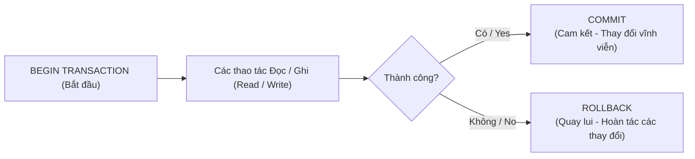
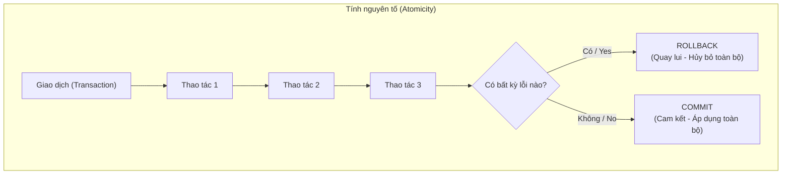
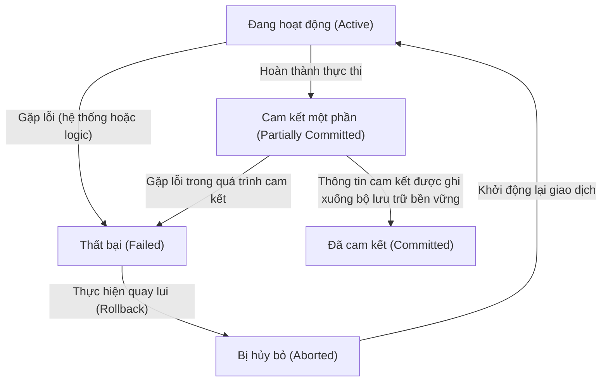

# Chapter 8: Giao dịch (Transactions)

Một giao dịch (transaction) là một đơn vị công việc logic (logical unit of work) bao gồm một hoặc nhiều thao tác cơ sở dữ liệu (đọc, ghi, chèn, cập nhật, xóa). Các giao dịch đảm bảo rằng cơ sở dữ liệu luôn được duy trì ở trạng thái nhất quán, ngay cả khi có các truy cập đồng thời của nhiều tiến trình hoặc khi xảy ra sự cố hệ thống. Chương này giới thiệu các khái niệm cơ bản về giao dịch, các thuộc tính ACID để đảm bảo độ tin cậy và các trạng thái khác nhau mà một giao dịch có thể trải qua trong suốt vòng đời thực thi của nó.

## 8.1 Khái niệm Giao dịch (Transaction Concept)

### Định nghĩa
Một **giao dịch (transaction)** là một chuỗi các thao tác được thực hiện như một đơn vị công việc logic duy nhất. Một giao dịch phải được thực thi một cách toàn vẹn (tất cả các thao tác đều thành công) hoặc không thực thi một thao tác nào cả. Các thao tác điển hình bên trong một giao dịch bao gồm việc đọc dữ liệu từ cơ sở dữ liệu (thao tác đọc - read) và ghi dữ liệu vào cơ sở dữ liệu (thao tác ghi - write).

### Ví dụ
Xét một giao dịch chuyển tiền ngân hàng trị giá $100 từ tài khoản A sang tài khoản B. Thao tác này bao gồm hai bước logic chính:
1. Đọc số dư của A, trừ đi $100, ghi lại số dư mới của A xuống cơ sở dữ liệu.
2. Đọc số dư của B, cộng thêm $100, ghi lại số dư mới của B xuống cơ sở dữ liệu.

Cả hai bước này cùng nhau tạo thành một giao dịch duy nhất. Nếu hệ thống chỉ thực hiện thành công bước 1 rồi xảy ra sự cố sập nguồn trước khi làm bước 2, cơ sở dữ liệu ngân hàng sẽ rơi vào trạng thái mất nhất quán (tiền bị trừ ở A nhưng chưa được cộng vào B). Cơ chế giao dịch sinh ra để ngăn chặn các cập nhật nửa vời như vậy.

### Ranh giới giao dịch (Transaction Boundaries)
Trong ngôn ngữ SQL, ranh giới của các giao dịch được định nghĩa bằng các từ khóa:
- `BEGIN TRANSACTION` (hoặc `START TRANSACTION`) – đánh dấu điểm bắt đầu của giao dịch.
- `COMMIT` – cam kết và lưu trữ vĩnh viễn tất cả các thay đổi của giao dịch vào cơ sở dữ liệu.
- `ROLLBACK` – quay lui (hoàn tác) tất cả các thay đổi đã thực hiện kể từ thời điểm bắt đầu giao dịch.

**Biểu đồ**:



## 8.2 Các thuộc tính ACID (ACID Properties)

ACID là viết tắt của bốn thuộc tính: Tính nguyên tố (Atomicity), Tính nhất quán (Consistency), Tính cô lập (Isolation) và Tính bền vững (Durability). Bốn thuộc tính này đảm bảo rằng các giao dịch cơ sở dữ liệu được xử lý một cách đáng tin cậy.

### 8.2.1 Tính nguyên tố (Atomicity)

**Định nghĩa**: Một giao dịch là một đơn vị công việc không thể phân chia (nguyên tố). Hoặc là toàn bộ các thao tác trong giao dịch được thực hiện thành công hoàn toàn, hoặc là không có bất kỳ thao tác nào được áp dụng vào cơ sở dữ liệu. Không cho phép việc thực thi nửa vời.

**Cơ chế**: Hệ quản trị cơ sở dữ liệu duy trì một tệp nhật ký ghi trước (write-ahead log) ghi lại toàn bộ lịch sử các thay đổi dữ liệu. Trong trường hợp xảy ra sự cố trước khi giao dịch kịp thực hiện lệnh commit, nhật ký này sẽ được sử dụng để tiến hành quay lui (roll back) nhằm xóa bỏ các thay đổi dang dở.

**Ví dụ**: Trong ví dụ chuyển tiền ngân hàng, nếu hệ thống gặp sự cố sập nguồn ngay sau khi trừ tiền ở tài khoản A nhưng chưa cộng tiền vào tài khoản B, thuộc tính Atomicity đảm bảo rằng việc trừ tiền ở tài khoản A cũng sẽ được hoàn tác.

**Biểu đồ**:



### 8.2.2 Tính nhất quán (Consistency)

**Định nghĩa**: Một giao dịch phải chuyển đổi cơ sở dữ liệu từ trạng thái nhất quán này sang một trạng thái nhất quán khác. Các ràng buộc nhất quán (ví dụ: khóa ngoại, ràng buộc duy nhất, ràng buộc kiểm tra check, các quy tắc nghiệp vụ đặc thù) phải được bảo toàn đầy đủ cả trước và sau khi giao dịch kết thúc.

**Ví dụ**: Trong giao dịch chuyển tiền ngân hàng, một ràng buộc nhất quán có thể là: "tổng số dư của tất cả các tài khoản phải luôn luôn không đổi". Sau khi hoàn thành giao dịch chuyển tiền, thuộc tính nhất quán đảm bảo rằng tổng số dư này vẫn được bảo toàn. Đồng thời, không có số dư tài khoản nào bị âm nếu quy định ngân hàng không cho phép thấu chi.

**Lưu ý**: Tính nhất quán được đảm bảo một phần bởi hệ quản trị cơ sở dữ liệu (thông qua các ràng buộc toàn vẹn) và một phần bởi chính logic nghiệp vụ của ứng dụng.

### 8.2.3 Tính cô lập (Isolation)

**Định nghĩa**: Các giao dịch thực thi đồng thời phải mang lại kết quả giống như thể chúng được thực thi tuần tự (cái này nối tiếp cái kia). Trạng thái trung gian (chưa được cam kết) của một giao dịch đang chạy sẽ hoàn toàn vô hình đối với các giao dịch đồng thời khác. Thuộc tính này giúp ngăn ngừa các vấn đề như đọc bẩn (dirty read), đọc không lặp lại (non-repeatable read) và đọc bóng ma (phantom read).

**Các cấp độ cô lập (Isolation Levels)** (từ yếu nhất đến mạnh nhất):
- Read Uncommitted (Đọc chưa cam kết)
- Read Committed (Đọc đã cam kết)
- Repeatable Read (Đọc có thể lặp lại)
- Serializable (Tuần tự hóa)

**Ví dụ**: Nếu hai giao dịch đồng thời cố gắng cập nhật số dư của cùng một tài khoản, tính cô lập đảm bảo rằng kết quả cuối cùng phải giống như khi giao dịch này chạy xong rồi mới đến giao dịch kia chạy, chứ không bị đan xen các thao tác gây mất mát dữ liệu cập nhật (lost update).

**Biểu đồ**:

```mermaid
flowchart LR
    subgraph WithoutIsolation["Không có cô lập (Without Isolation)"]
        T1["Giao dịch 1"] -->|Ghi X=10| X[(X)]
        T2["Giao dịch 2"] -->|Đọc X=10| T2
        T1 -->|Quay lui (Rollback)| X[(X=5)]
        T2 -->|Sử dụng giá trị lỗi thời| Problem["Mất nhất quán"]
    end
    subgraph WithIsolation["Có cô lập (With Isolation)"]
        T1b["Giao dịch 1"] -->|Ghi X=10| Xb[(X)]
        T2b["Giao dịch 2"] -->|Không thể đọc giá trị chưa cam kết| Wait["Chờ (Wait)"]
        T1b -->|Cam kết (Commit)| Xb[(X=10)]
        Wait --> T2b
    end
```

### 8.2.4 Tính bền vững (Durability)

**Định nghĩa**: Một khi giao dịch đã được cam kết (commit) thành công, tất cả các thay đổi dữ liệu của nó sẽ tồn tại vĩnh viễn trong cơ sở dữ liệu, ngay cả khi xảy ra các lỗi nghiêm trọng sau đó (sập nguồn, lỗi hệ điều hành, hư hỏng phần cứng trung gian). Cơ sở dữ liệu đảm bảo rằng các dữ liệu đã cam kết được ghi trực tiếp vào các thiết bị lưu trữ bền vững (không bay hơi - ví dụ như ổ đĩa cứng).

**Cơ chế**: Giao thức ghi nhật ký trước (write-ahead logging) đảm bảo rằng trước khi một giao dịch được xác nhận commit thành công, tất cả các bản ghi nhật ký thay đổi của nó bắt buộc phải được flush xuống ổ đĩa cứng trước. Khi hệ thống khởi động lại sau sự cố, nhật ký này sẽ được dùng để thực hiện lại (redo) các giao dịch đã cam kết.

**Ví dụ**: Sau khi giao dịch chuyển tiền được cam kết thành công, dù máy chủ cơ sở dữ liệu có bị sập nguồn ngay lập tức thì số dư mới của hai tài khoản vẫn được đảm bảo chính xác khi hệ thống hoạt động trở lại.

### Bảng tổng hợp các thuộc tính ACID

| Thuộc tính | Cam kết đảm bảo | Cơ chế đảm bảo |
|------------|-----------------|----------------|
| **Atomicity (Nguyên tố)** | Thực thi toàn bộ hoặc không thực thi gì | Nhật ký giao dịch + Bộ quản lý phục hồi (recovery manager) |
| **Consistency (Nhất quán)** | Bảo toàn các ràng buộc và trạng thái hợp lệ | Logic ứng dụng + Các ràng buộc của DB |
| **Isolation (Cô lập)** | Các giao dịch đồng thời hoạt động độc lập | Kiểm soát đồng thời (khóa locking, MVCC) |
| **Durability (Bền vững)** | Thay đổi đã cam kết tồn tại vĩnh viễn qua mọi sự cố | Ghi nhật ký (logging) + Ghi điểm kiểm tra (checkpointing) |

## 8.3 Các trạng thái của giao dịch (Transaction States)

Một giao dịch trải qua nhiều trạng thái khác nhau trong suốt vòng đời của nó. Sơ đồ trạng thái dưới đây mô tả chi tiết các bước chuyển tiếp hợp lệ.

### Định nghĩa các trạng thái

1. **Đang hoạt động (Active)**: Trạng thái ban đầu. Giao dịch đang thực thi các thao tác đọc/ghi dữ liệu của nó. Nó duy trì ở trạng thái này cho đến khi thao tác cuối cùng được thực thi.
2. **Cam kết một phần (Partially Committed)**: Đạt được ngay sau khi thao tác cuối cùng của giao dịch được thực thi xong, nhưng trước khi quyết định cam kết vĩnh viễn được thực hiện. Giao dịch đã hoàn tất công việc của nó, tuy nhiên các dữ liệu thay đổi có thể vẫn đang nằm trên các bộ đệm bộ nhớ đệm (RAM) mà chưa được ghi xuống ổ đĩa cứng.
3. **Đã cam kết (Committed)**: Giao dịch chuyển sang trạng thái này sau khi lệnh cam kết thành công và tất cả các thay đổi dữ liệu đã được ghi vĩnh viễn xuống đĩa cứng. Giao dịch kết thúc thành công.
4. **Thất bại (Failed)**: Nếu giao dịch không thể tiếp tục thực thi bình thường (do lỗi phần cứng, vi phạm ràng buộc toàn vẹn, lỗi logic ứng dụng hoặc do người dùng chủ động rollback), nó sẽ rơi vào trạng thái thất bại.
5. **Bị hủy bỏ (Aborted)**: Sau khi rơi vào trạng thái thất bại, hệ thống sẽ thực hiện quay lui (rollback) để xóa bỏ hoàn toàn mọi thay đổi dang dở. Cơ sở dữ liệu được khôi phục về đúng trạng thái ban đầu trước khi giao dịch bắt đầu. Một giao dịch bị hủy bỏ có thể được ứng dụng lên lịch để khởi động lại sau đó.

### Sơ đồ chuyển trạng thái của giao dịch



### Giải thích các bước chuyển trạng thái

- **Active → Partially Committed**: Xảy ra khi giao dịch thực hiện xong thao tác cuối cùng trong chuỗi công việc của nó.
- **Active → Failed**: Xảy ra nếu giao dịch gặp lỗi và không thể tiếp tục chạy (do lỗi phần cứng, lỗi phần mềm, xảy ra tắc nghẽn deadlock, hoặc vi phạm ràng buộc dữ liệu).
- **Partially Committed → Committed**: Đạt được sau khi toàn bộ dữ liệu nhật ký giao dịch được ép ghi (force) thành công xuống đĩa cứng bền vững và bản ghi xác nhận commit được hoàn tất.
- **Partially Committed → Failed**: Xảy ra nếu hệ thống đột ngột gặp sự cố trong chính quá trình đang cố gắng ghi bản ghi cam kết xuống đĩa.
- **Failed → Aborted**: Bộ quản lý phục hồi dữ liệu tiến hành thực hiện rollback, hoàn tác mọi thay đổi dang dở mà giao dịch đã tạo ra trước đó.
- **Aborted → Active**: Giao dịch có thể được khởi chạy lại từ đầu (ví dụ do ứng dụng tự động gọi lại) sau khi nguyên nhân gây lỗi ở lượt chạy trước đã được khắc phục.

### Dòng thời gian ví dụ

Xét một giao dịch cập nhật số dư hai tài khoản:

1. **Active**: Bắt đầu giao dịch; đọc số dư A, ghi lại A; đọc số dư B, ghi lại B (thao tác cuối cùng hoàn thành).
2. **Partially Committed**: Thao tác cuối cùng đã xong, nhưng các thay đổi vẫn chưa được lưu cứng xuống đĩa.
3. **Committed**: Toàn bộ nhật ký được flush xuống đĩa thành công; bản ghi commit được hoàn tất. Giao dịch kết thúc an toàn.

Nếu sự cố mất điện đột ngột xảy ra trước khi bản ghi commit kịp ghi thành công xuống đĩa, giao dịch sẽ chuyển ngay sang trạng thái **Failed** và sau đó tự động chuyển sang trạng thái **Aborted** khi hệ thống khôi phục hoạt động.

### Nhật ký hệ thống và Phục hồi trạng thái (System Log and Recovery)

Tệp nhật ký hệ thống lưu trữ các bản ghi dạng: `<START T>`, `<WRITE T, X, giá_trị_cũ, giá_trị_mới>`, `<COMMIT T>`, `<ABORT T>`. Khi hệ thống khởi động lại sau sự cố:
- Các giao dịch chỉ mới có bản ghi `<START T>` nhưng chưa có bản ghi `<COMMIT T>` sẽ được hệ thống tự động hoàn tác quay lui (undo / abort).
- Các giao dịch đã có đầy đủ bản ghi `<COMMIT T>` sẽ được hệ thống tiến hành thực thi lại (redo - nếu cần thiết) để đảm bảo thuộc tính bền vững (Durability).

## 8.4 Tóm tắt

Giao dịch là khái niệm cốt lõi để xây dựng các hệ quản trị cơ sở dữ liệu có tính toàn vẹn cao. Các điểm mấu chốt cần nhớ:

- **Giao dịch**: Là một đơn vị công việc logic được thực thi một cách nguyên tố.
- **Các thuộc tính ACID**:
  - Atomicity (Nguyên tố): Được thực thi toàn bộ hoặc không thực thi gì.
  - Consistency (Nhất quán): Bảo toàn các ràng buộc và trạng thái hợp lệ của dữ liệu.
  - Isolation (Cô lập): Đảm bảo các giao dịch chạy song song không can thiệp xuyên chéo vào nhau.
  - Durability (Bền vững): Các thay đổi đã cam kết tồn tại vĩnh viễn qua mọi sự cố.
- **Các trạng thái của giao dịch**: Đi theo nhánh thành công (`Active` → `Partially Committed` → `Committed`) hoặc đi theo nhánh thất bại (`Active` → `Failed` → `Aborted`) và có khả năng được tái kích hoạt lại sau đó.

---
