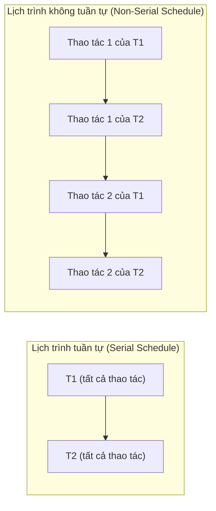
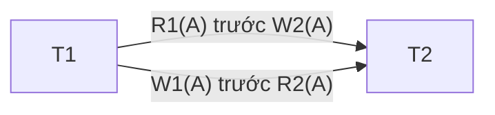
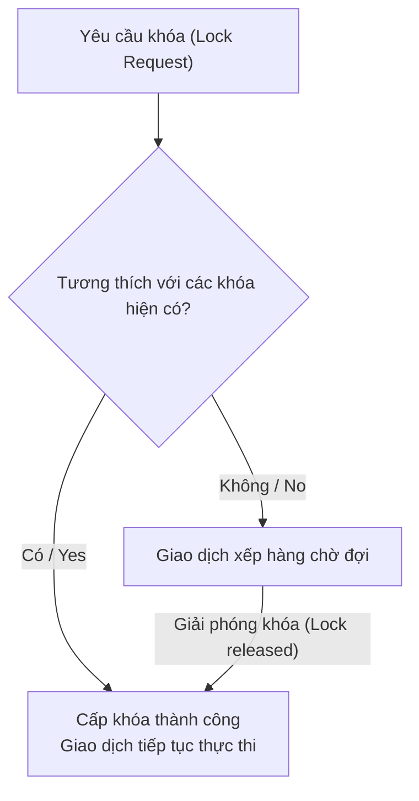
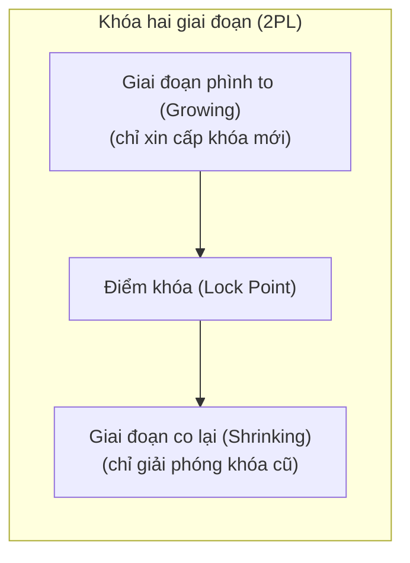
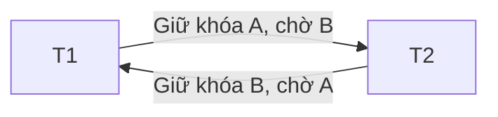
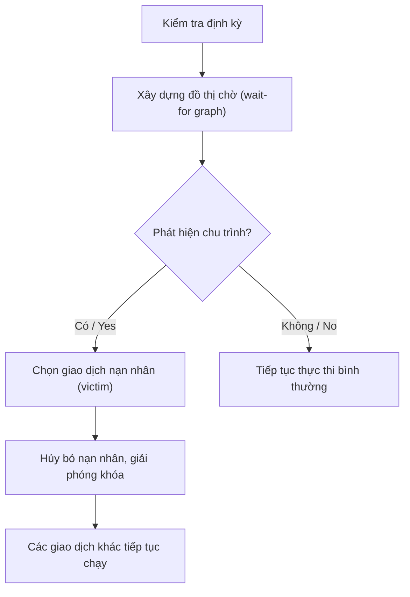

# Chapter 9: Kiểm soát đồng thời (Concurrency Control)

Kiểm soát đồng thời (Concurrency control) quản lý việc thực thi đồng thời các giao dịch để đảm bảo tính nhất quán (Consistency) và tính cô lập (Isolation) của cơ sở dữ liệu. Nếu không có các cơ chế kiểm soát đồng thời thích hợp, việc thực thi đan xen các thao tác của các giao dịch song song có thể dẫn đến các dị thường nghiêm trọng như mất dữ liệu cập nhật (lost update), đọc bẩn (dirty read) và truy xuất dữ liệu không nhất quán (inconsistent retrieval). Chương này giới thiệu về khái niệm lịch trình, tính tuần tự hóa, các giao thức dựa trên khóa khóa (locking), giao thức khóa hai giai đoạn (2PL) và cách xử lý tắc nghẽn (deadlock).

## 9.1 Lịch trình (Schedules)

Một **lịch trình (schedule)** là thứ tự sắp xếp thực thi các thao tác của nhiều giao dịch đồng thời. Các thao tác cơ bản bao gồm đọc dữ liệu (R), ghi dữ liệu (W), cam kết (C) và hủy bỏ (A).

### 9.1.1 Lịch trình tuần tự (Serial Schedule)

Một lịch trình được gọi là **tuần tự (serial)** nếu các thao tác của mỗi giao dịch được thực hiện nối tiếp nhau một cách trọn vẹn, không có sự đan xen các thao tác giữa các giao dịch khác nhau. Các lịch trình tuần tự luôn đảm bảo duy trì trạng thái nhất quán của cơ sở dữ liệu, nhưng chúng làm giảm nghiêm trọng hiệu năng hệ thống do hạn chế tối đa khả năng xử lý song song.

**Ví dụ**: Hai giao dịch T1 và T2.
Lịch trình tuần tự S1: T1 thực thi xong rồi mới đến T2 thực thi.

| Thời gian | T1 | T2 |
|-----------|----|----|
| 1 | R(A) | |
| 2 | W(A) | |
| 3 | R(B) | |
| 4 | W(B) | |
| 5 | Commit | |
| 6 | | R(A) |
| 7 | | W(A) |
| 8 | | Commit |

### 9.1.2 Lịch trình không tuần tự (Non-serial Schedule)

Một lịch trình **không tuần tự (non-serial)** thực hiện đan xen các thao tác từ nhiều giao dịch khác nhau. Các lịch trình này có thể mang lại kết quả đúng đắn (nếu chúng tương đương về mặt logic với một lịch trình tuần tự nào đó) hoặc gây ra sai lệch dữ liệu (nếu gây ra các dị thường đồng thời).

**Ví dụ**: Lịch trình đan xen thao tác gây lỗi:

| Thời gian | T1 | T2 |
|-----------|----|----|
| 1 | R(A) | |
| 2 | | R(A) |
| 3 | W(A) | |
| 4 | | W(A) |
| 5 | Commit | |
| 6 | | Commit |

Lịch trình này có thể gây ra dị thường mất dữ liệu cập nhật (lost update).

**Biểu đồ**:

## 9.2 Tính tuần tự hóa (Serializability)

Một lịch trình được gọi là **tuần tự hóa được (serializable)** nếu kết quả tác động của nó lên cơ sở dữ liệu hoàn toàn tương đương với một lịch trình tuần tự nào đó. Tính tuần tự hóa là tiêu chuẩn vàng để đánh giá tính đúng đắn khi thực thi các giao dịch đồng thời. Có hai loại tuần tự hóa chính: tuần tự hóa xung đột (conflict serializability) và tuần tự hóa góc nhìn (view serializability).

### 9.2.1 Tính tuần tự hóa xung đột (Conflict Serializability)

Hai thao tác được coi là **xung đột (conflict)** với nhau nếu chúng thuộc về hai giao dịch khác nhau, cùng truy cập vào một phần tử dữ liệu duy nhất và có ít nhất một thao tác thực hiện ghi (Write). Các cặp thao tác xung đột: R-W, W-R, W-W.

Một lịch trình đạt **tuần tự hóa xung đột (conflict serializable)** nếu nó có thể biến đổi trực tiếp về một lịch trình tuần tự bằng cách thực hiện đổi chỗ các cặp thao tác kề nhau không xung đột. Người ta sử dụng **đồ thị ưu tiên (precedence graph)** để kiểm tra tính tuần tự hóa xung đột:
- Các đỉnh: đại diện cho các giao dịch.
- Cạnh có hướng Ti → Tj: được vẽ nếu tồn tại một thao tác của Ti xung đột và thực hiện trước một thao tác của Tj.
- Nếu đồ thị thu được **không chứa chu trình (acyclic)**, lịch trình đó tuần tự hóa xung đột được. Việc sắp xếp topo các đỉnh đồ thị sẽ cho ra lịch trình tuần tự tương đương.

**Ví dụ**: Lịch trình có T1: R(A), W(A); T2: R(A), W(A). Các xung đột: R1(A) xảy ra trước W2(A) tạo ra cạnh T1→T2; W1(A) xảy ra trước R2(A) tạo ra cạnh T1→T2. Đồ thị không có chu trình → tuần tự hóa xung đột được.

**Sơ đồ đồ thị ưu tiên**:

### 9.2.2 Tính tuần tự hóa góc nhìn (View Serializability)

Tuần tự hóa góc nhìn có điều kiện ít ràng buộc hơn so với tuần tự hóa xung đột. Một lịch trình đạt **tuần tự hóa góc nhìn (view serializable)** nếu nó tương đương góc nhìn (view-equivalent) với một lịch trình tuần tự nào đó. Hai lịch trình được coi là tương đương góc nhìn nếu thỏa mãn cả 3 điều kiện sau:
1. Với mỗi phần tử dữ liệu X, thao tác đọc ban đầu của cả hai lịch trình phải đọc ra cùng một trạng thái dữ liệu ban đầu.
2. Với mỗi phần tử dữ liệu X, các phụ thuộc ghi-đọc (tức là giao dịch nào ghi giá trị X và giao dịch nào đọc giá trị đó sau đó) phải giống nhau ở cả hai lịch trình.
3. Thao tác ghi cuối cùng lên phần tử dữ liệu X phải được thực hiện bởi cùng một giao dịch trong cả hai lịch trình.

Mọi lịch trình tuần tự hóa xung đột đều đạt tuần tự hóa góc nhìn, nhưng chiều ngược lại không luôn đúng. Việc kiểm tra tính tuần tự hóa góc nhìn thuộc bài toán NP-đầy đủ (NP-complete), do đó các kỹ thuật kiểm soát đồng thời trong thực tế (như giao thức 2PL) chủ yếu dựa trên kiểm tra tuần tự hóa xung đột.

**Ví dụ lịch trình đạt tuần tự hóa góc nhìn nhưng không đạt tuần tự hóa xung đột**:
T1: R(A), W(A); T2: W(A); T3: W(A). Lịch trình đan xen không có xung đột trực tiếp nhưng bảo toàn nguyên vẹn thao tác ghi cuối cùng và đọc ban đầu.

## 9.3 Các giao thức dựa trên khóa (Lock‑Based Protocols)

Khóa (Locks) là cơ chế phổ biến nhất được sử dụng trong các hệ quản trị cơ sở dữ liệu để thực thi tính tuần tự hóa. Một giao dịch bắt buộc phải xin cấp khóa trước khi truy cập vào một phần tử dữ liệu và phải giải phóng khóa đó sau khi hoàn thành.

### Các loại khóa cơ bản
- **Khóa chia sẻ (S - Shared lock)**: Dành riêng cho các thao tác Đọc (Read). Nhiều giao dịch khác nhau có thể đồng thời cùng giữ khóa chia sẻ trên một phần tử dữ liệu.
- **Khóa độc quyền (X - Exclusive lock)**: Dành cho các thao tác Ghi (Write). Chỉ có duy nhất một giao dịch được phép giữ khóa độc quyền trên một phần tử dữ liệu; không cho phép bất kỳ khóa nào khác (S hay X) được tồn tại song song.

### Ma trận tương thích khóa (Lock Compatibility Matrix)

| | Khóa chia sẻ (S) | Khóa độc quyền (X) |
|---|------------------|--------------------|
| **Khóa chia sẻ (S)** | Có (Yes) | Không (No) |
| **Khóa độc quyền (X)**| Không (No) | Không (No) |

### Bộ quản lý khóa (Lock Manager)
Bộ quản lý khóa đóng vai trò cấp phát hoặc từ chối các yêu cầu khóa từ giao dịch. Nếu yêu cầu khóa chưa thể được cấp phát (do không tương thích với khóa đang có của giao dịch khác), giao dịch yêu cầu sẽ bị chặn lại và đưa vào hàng đợi chờ đợi (waiting queue).

**Biểu đồ**:

### Giao thức khóa cơ bản
Một giao dịch phải tuân thủ:
- Xin cấp khóa chia sẻ trước khi thực hiện Đọc một phần tử dữ liệu.
- Xin cấp khóa độc quyền trước khi thực hiện Ghi một phần tử dữ liệu.
- Giải phóng khóa sau khi sử dụng xong.

Tuy nhiên, giao thức khóa cơ bản không đủ để đảm bảo tính tuần tự hóa vì việc giải phóng khóa quá sớm có thể dẫn đến dị thường dữ liệu hoặc gây ra hiện tượng hủy bỏ dây chuyền (cascading aborts).

## 9.4 Giao thức khóa hai giai đoạn (Two‑Phase Locking - 2PL)

Giao thức khóa hai giai đoạn (2PL) là giao thức kiểm soát đồng thời đảm bảo chắc chắn tính tuần tự hóa xung đột. Nó chia quá trình sử dụng khóa thành hai giai đoạn rõ rệt:

1. **Giai đoạn phình to (Growing phase)**: Giao dịch có thể liên tục yêu cầu cấp thêm các khóa mới, nhưng hoàn toàn **không được phép** giải phóng bất kỳ khóa nào.
2. **Giai đoạn co lại (Shrinking phase)**: Giao dịch có thể giải phóng các khóa đang giữ, nhưng hoàn toàn **không được phép** yêu cầu cấp thêm bất kỳ khóa mới nào nữa.

Thời điểm giao dịch chuyển trạng thái từ giai đoạn phình to sang giai đoạn co lại được gọi là **điểm khóa (lock point)**.

### Giao thức khóa hai giai đoạn nghiêm ngặt (Strict 2PL)
Là một biến thể chặt chẽ hơn và được áp dụng phổ biến nhất trong thực tế: tất cả các khóa độc quyền (X) bắt buộc phải được giữ liên tục cho đến khi giao dịch cam kết (COMMIT) hoặc hủy bỏ (ABORT) hoàn toàn. Quy tắc này giúp ngăn ngừa triệt để hiện tượng hủy bỏ dây chuyền (cascading aborts) và đảm bảo tính khả phục hồi dữ liệu.

**Biểu đồ**:

### Ví dụ
Xét giao dịch T1: Lock‑X(A), read(A), write(A), Lock‑S(B), read(B), unlock(A), unlock(B). Tiến trình này vi phạm 2PL vì nó đã giải phóng khóa trên A trước khi xin cấp khóa trên B (thực hiện giải phóng khóa trong khi vẫn đang ở giai đoạn phình to). Thiết kế đúng chuẩn 2PL: xin cấp toàn bộ các khóa cần thiết trên cả A và B trước khi thực hiện bất kỳ lệnh giải phóng khóa nào.

### Các thuộc tính của 2PL
- **Đảm bảo chắc chắn tính tuần tự hóa xung đột**.
- Có thể dẫn đến hiện tượng tắc nghẽn (deadlocks).
- Không tự động bảo vệ khỏi hiện tượng hủy bỏ dây chuyền ngoại trừ khi áp dụng biến thể Strict 2PL.
- Ngăn ngừa hiện tượng đọc không lặp lại và ghi bẩn.

## 9.5 Tắc nghẽn (Deadlocks)

Một hiện tượng **tắc nghẽn (deadlock - khóa chết)** xảy ra khi có từ hai giao dịch trở lên rơi vào trạng thái chờ đợi lẫn nhau để được cấp phát các khóa đang được giữ bởi chính các giao dịch kia, dẫn đến tình trạng chờ đợi vô hạn.

**Ví dụ**:
- T1 đang giữ khóa trên A, và yêu cầu xin cấp khóa trên B.
- T2 đang giữ khóa trên B, và yêu cầu xin cấp khóa trên A.
Cả hai giao dịch đều bị chặn và không thể tiếp tục thực thi.

**Biểu đồ**:

### 9.5.1 Phát hiện tắc nghẽn (Deadlock Detection)

Hiện tượng tắc nghẽn được phát hiện bằng cách xây dựng một **đồ thị chờ (WFG - wait-for graph)**:
- Các đỉnh: đại diện cho các giao dịch đang chạy.
- Cạnh có hướng Ti → Tj: được vẽ nếu giao dịch Ti đang phải chờ để được cấp khóa đang được giữ bởi Tj.
- Sự tồn tại của một **chu trình** trên đồ thị biểu thị hệ thống đang bị tắc nghẽn.

Hệ thống sẽ chạy kiểm tra đồ thị WFG theo chu kỳ định kỳ. Khi phát hiện chu trình tắc nghẽn, một giao dịch (nạn nhân - victim) sẽ bị chọn để hủy bỏ (abort/rollback) nhằm phá vỡ chu trình chờ đợi này.

**Thuật toán**:
1. Xây dựng đồ thị WFG.
2. Nếu phát hiện chu trình, lựa chọn giao dịch nạn nhân dựa trên các tiêu chí (ví dụ: giao dịch trẻ nhất, giao dịch thực hiện ít công việc nhất, hoặc giao dịch có độ ưu tiên thấp nhất).
3. Hủy bỏ giao dịch nạn nhân, giải phóng toàn bộ khóa của nó và khởi chạy lại giao dịch đó sau.

**Biểu đồ**:

### 9.5.2 Phòng ngừa tắc nghẽn (Deadlock Prevention)

Phương pháp phòng ngừa đảm bảo hệ thống không bao giờ có thể xảy ra tắc nghẽn bằng cách áp đặt các quy tắc nghiêm ngặt ngay khi yêu cầu cấp khóa. Các cơ chế phòng ngừa phổ biến:

- **Sắp xếp thứ tự khóa (lock ordering)**: Yêu cầu tất cả các giao dịch phải xin cấp khóa theo một thứ tự toàn cục được xác định trước (ví dụ dựa trên địa chỉ vật lý của phần tử dữ liệu). Nếu giao dịch cần khóa ở phần tử tiếp theo, nó phải giải phóng tất cả các khóa trước đó rồi mới xin lại. Phương pháp này an toàn nhưng hiệu năng thấp.

- **Giao thức Chờ - Chết (Wait-die - không trưng dụng)**: Mỗi giao dịch khi bắt đầu sẽ được cấp một nhãn thời gian (timestamp) (giao dịch càng cũ nhãn càng nhỏ). Nếu giao dịch T1 yêu cầu khóa đang được giữ bởi T2:
  - Nếu T1 là giao dịch cũ hơn (nhãn thời gian nhỏ hơn) T2, T1 được phép Chờ (Wait).
  - Nếu T1 trẻ hơn T2, T1 tự Chết (Die - tức là tự hủy bỏ và khởi động lại với nhãn thời gian cũ của nó).

- **Giao thức Gây thương tích - Chờ (Wound-wait - có trưng dụng)**:
  - Nếu T1 cũ hơn T2, T1 gây thương tích cho T2 (ép T2 phải hủy bỏ và nhường khóa).
  - Nếu T1 trẻ hơn T2, T1 phải Chờ (Wait).

**Bảng so sánh cơ chế**:

| Cơ chế | Giao dịch cũ yêu cầu khóa của giao dịch trẻ | Giao dịch trẻ yêu cầu khóa của giao dịch cũ |
|--------|---------------------------------------------|---------------------------------------------|
| **Wait-die** | Được phép Chờ (Wait) | Tự Chết (Die - hủy bỏ) |
| **Wound-wait**| Gây thương tích (Wound - ép trẻ hủy bỏ) | Được phép Chờ (Wait) |

### Phòng ngừa dựa trên thời gian chờ (Timeout)
Hệ thống chỉ cho phép giao dịch chờ khóa trong một khoảng thời gian giới hạn tối đa (timeout). Nếu hết thời gian chờ mà chưa được cấp khóa, giao dịch sẽ tự động bị hủy bỏ và khởi chạy lại. Phương pháp này đơn giản, dễ triển khai nhưng có thể gây ra nhiều lượt hủy bỏ giao dịch không cần thiết.

## 9.6 Tóm tắt

Kiểm soát đồng thời đảm bảo việc thực thi an toàn, tuần tự hóa được của các giao dịch chạy song song. Các nội dung cốt lõi:

- **Lịch trình**: Lịch trình tuần tự (không đan xen) và lịch trình không tuần tự (có đan xen thao tác).
- **Tính tuần tự hóa**: Tuần tự hóa xung đột (kiểm tra bằng đồ thị ưu tiên) và tuần tự hóa góc nhìn (mở rộng hơn nhưng phức tạp hơn).
- **Các giao thức dựa trên khóa**: Khóa chia sẻ (S) và khóa độc quyền (X); tuân thủ ma trận tương thích khóa.
- **Khóa hai giai đoạn (2PL)**: Giai đoạn phình to và giai đoạn co lại; đảm bảo tính tuần tự hóa xung đột; Strict 2PL loại bỏ hoàn toàn hiện tượng hủy bỏ dây chuyền.
- **Tắc nghẽn (Deadlock)**:
  - Phát hiện tắc nghẽn thông qua việc định kỳ quét chu trình trên đồ thị chờ (wait-for graph); xử lý bằng cách chọn nạn nhân để hủy bỏ.
  - Phòng ngừa tắc nghẽn thông qua việc sắp xếp thứ tự khóa, sử dụng giao thức wait-die, wound-wait hoặc áp dụng thời gian chờ timeout.

---
