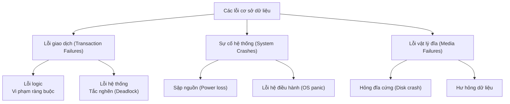
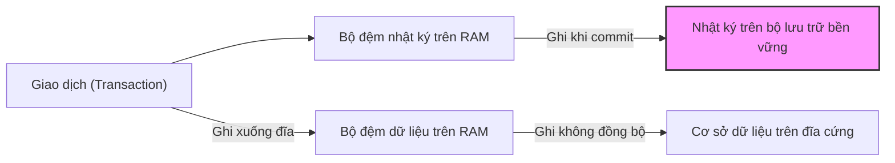
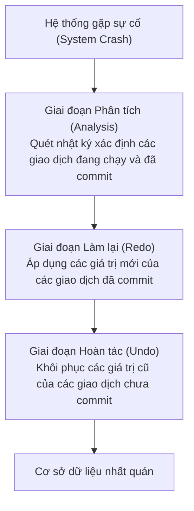
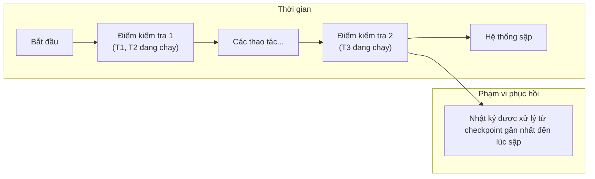
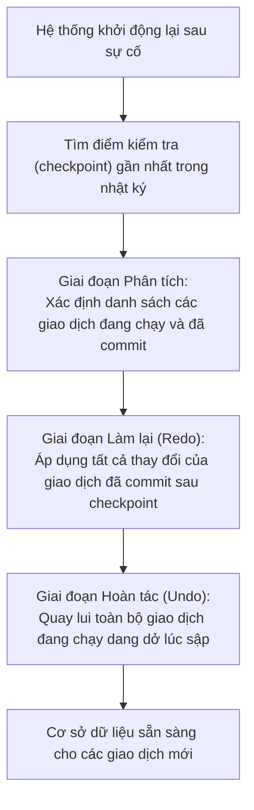

# Chapter 10: Hệ thống phục hồi (Recovery System)

Quản lý phục hồi (Recovery management) đảm bảo rằng cơ sở dữ liệu duy trì được tính nhất quán (Consistency) và tính bền vững (Durability) bất chấp các lỗi phần cứng, phần mềm, bao gồm lỗi giao dịch, sự cố hệ thống và hỏng đĩa cứng vật lý. Chương này mô tả các phân loại lỗi, giao thức ghi nhật ký trước (WAL), các thao tác hoàn tác (undo) và làm lại (redo), cùng với việc sử dụng các điểm kiểm tra (checkpoints) để tối ưu hóa thời gian phục hồi dữ liệu.

## 10.1 Các loại sự cố (Types of Failures)

Các hệ thống cơ sở dữ liệu có thể gặp phải nhiều loại sự cố khác nhau. Các cơ chế phục hồi được thiết kế đặc thù để xử lý phù hợp cho từng loại lỗi.

### 10.1.1 Lỗi giao dịch (Transaction Failures)

Một giao dịch có thể bị thất bại do các lỗi logic của chính nó (ví dụ: chia cho không, vi phạm ràng buộc toàn vẹn) hoặc lỗi hệ thống điều phối (ví dụ: bị chọn làm nạn nhân để giải phóng tắc nghẽn deadlock). Khi một giao dịch bị lỗi, nó bắt buộc phải được quay lui hoàn toàn (undone) để bảo toàn thuộc tính Atomicity.

**Các nguyên nhân**:
- Lỗi logic chương trình ứng dụng.
- Vi phạm ràng buộc toàn vẹn dữ liệu (ví dụ: khóa ngoại, check constraint).
- Giao dịch bị hệ thống chọn hủy bỏ để giải quyết deadlock.
- Người dùng chủ động phát lệnh quay lui `ROLLBACK`.

### 10.1.2 Đổ vỡ hệ thống (System Crashes / Soft Failures)

Sự cố hệ thống xảy ra khi máy chủ dừng hoạt động đột ngột do mất nguồn điện, hệ điều hành gặp lỗi (panic) hoặc lỗi hư hại linh kiện máy tính. Khi sập hệ thống, toàn bộ thông tin lưu trữ trên bộ nhớ RAM (bộ nhớ trong) sẽ bị mất hoàn toàn, nhưng bộ lưu trữ bền vững (như ổ đĩa cứng) vẫn được bảo toàn. Hệ thống phục hồi có nhiệm vụ đưa dữ liệu về trạng thái nhất quán bằng cách hoàn tác (undo) các giao dịch đang chạy dang dở và thực hiện lại (redo) các giao dịch đã cam kết thành công nhưng dữ liệu thay đổi của chúng mới chỉ nằm trên RAM chứ chưa kịp lưu xuống đĩa.

**Các nguyên nhân**:
- Mất điện đột ngột.
- Hệ điều hành bị sập (crash / panic).
- Lỗi phần mềm của chính hệ quản trị cơ sở dữ liệu.

### 10.1.3 Lỗi vật lý đĩa (Media Failures / Hard Failures)

Lỗi vật lý xảy ra khi bộ lưu trữ bền vững gặp hư hỏng phần cứng vĩnh viễn, chẳng hạn như xước đầu đọc ổ đĩa cứng hoặc hư hỏng một khối dữ liệu (block) vật lý. Quá trình phục hồi từ loại lỗi này bắt buộc phải sử dụng các bản sao lưu lưu trữ (backups) kết hợp cùng tệp nhật ký giao dịch để khôi phục lại phần dữ liệu bị mất.

**Các nguyên nhân**:
- Đầu đọc đĩa cứng bị hỏng.
- Ổ đĩa cứng phát sinh các phân vùng lỗi (bad sectors).
- Tập tin cơ sở dữ liệu bị xóa nhầm một cách vô ý.

### 10.1.4 Sơ đồ phân loại sự cố

## 10.2 Phục hồi dựa trên nhật ký (Log‑Based Recovery)

Cơ chế phục hồi dựa trên nhật ký sử dụng một tệp nhật ký lưu trữ bền vững ghi lại tuần tự lịch sử tất cả các thao tác cập nhật dữ liệu của mọi giao dịch. Khi xảy ra sự cố, tệp nhật ký này sẽ được quét để thực hiện hoàn tác các giao dịch dở dang và làm lại các giao dịch đã cam kết.

### 10.2.1 Cấu trúc bản ghi nhật ký (Log Structure)

Mỗi bản ghi nhật ký thay đổi thường chứa các trường thông tin:
- **Mã định danh giao dịch (TID - Transaction identifier)**
- **Mã định danh phần tử dữ liệu (X - Data item identifier)**
- **Giá trị cũ trước khi thay đổi (old value / before image)**
- **Giá trị mới sau khi thay đổi (new_value / after image)**
- **Loại thao tác thực hiện (START, UPDATE, COMMIT, ABORT)**

Các định dạng bản ghi nhật ký phổ biến:
- `<START T>` – giao dịch T bắt đầu thực thi.
- `<WRITE T, X, giá_trị_cũ, giá_trị_mới>` – giao dịch T thực hiện ghi đè giá_trị_mới lên dữ liệu X; giá_trị_cũ là giá trị trước đó của X.
- `<COMMIT T>` – giao dịch T đã hoàn thành và cam kết thành công.
- `<ABORT T>` – giao dịch T bị hủy bỏ.

### 10.2.2 Giao thức ghi nhật ký trước (WAL - Write‑Ahead Logging)

WAL là quy tắc vàng bắt buộc phải tuân thủ để đảm bảo khả năng phục hồi dữ liệu:
1. **Ghi nhật ký trước khi ghi dữ liệu vật lý**: Trước khi hệ thống ghi một phần tử dữ liệu thay đổi xuống đĩa cứng, bản ghi nhật ký `<WRITE>` tương ứng bắt buộc phải được flush xuống bộ lưu trữ bền vững trước.
2. **Ghi nhật ký trước khi xác nhận cam kết**: Trước khi hệ thống phản hồi lệnh `<COMMIT>` thành công cho người dùng, tất cả bản ghi nhật ký liên quan đến giao dịch đó bắt buộc phải được flush hoàn tất xuống bộ lưu trữ bền vững.

Giao thức WAL đảm bảo rằng trong bất kỳ tình huống sập hệ thống nào, tệp nhật ký lưu trữ trên đĩa luôn cung cấp đầy đủ thông tin để khôi phục cơ sở dữ liệu về trạng thái nhất quán.

### 10.2.3 Bộ đệm nhật ký và Ép ghi (Log Buffer and Forcing)

Nhật ký ban đầu được ghi vào một bộ đệm trên bộ nhớ RAM (log buffer) và định kỳ flush xuống đĩa cứng khi thực hiện cam kết giao dịch hoặc khi bộ đệm nhật ký bị đầy. Để tối ưu hóa hiệu năng, kỹ thuật cam kết nhóm (group commit) thường được áp dụng: gom nhật ký của nhiều giao dịch để flush chung trong một thao tác I/O duy nhất.

**Biểu đồ**:

## 10.3 Hoàn tác và Làm lại (Undo and Redo)

Quá trình khôi phục cơ sở dữ liệu sau sự cố sập hệ thống bao gồm hai thao tác nền tảng: undo và redo dựa trên lịch sử tệp nhật ký.

### 10.3.1 Thao tác Hoàn tác (Undo Operation)

Undo loại bỏ hoàn toàn ảnh hưởng của các giao dịch chưa được cam kết (tức là các giao dịch đang ở trạng thái active dở dang hoặc đã bị abort tại thời điểm sập hệ thống). Với mỗi thao tác ghi dữ liệu của giao dịch đó, hệ thống sẽ lấy giá trị cũ (before image) trong nhật ký để ghi đè lại vào phần tử dữ liệu. Thao tác undo bắt buộc phải đạt tính **lũy đẳng (idempotent)** – tức là việc thực hiện undo một bản ghi nhiều lần liên tục mang lại kết quả hoàn toàn trùng khớp như khi thực hiện đúng một lần.

**Quy trình thực hiện Undo** (cho giao dịch T):
- Quét tệp nhật ký ngược từ dưới lên.
- Với mỗi bản ghi `<WRITE T, X, cũ, mới>` bắt gặp, ghi đè lại giá trị `cũ` vào dữ liệu X.
- Dừng quét khi gặp bản ghi bắt đầu `<START T>`.
- Ghi một bản ghi nhật ký kết thúc `<ABORT T>`.

### 10.3.2 Thao tác Làm lại (Redo Operation)

Redo áp dụng lại tất cả thay đổi dữ liệu của các giao dịch đã cam kết thành công nhưng các thay đổi của chúng chưa kịp ghi xuống đĩa trước thời điểm sập hệ thống. Với mỗi thao tác ghi, hệ thống sẽ lấy giá trị mới (after image) trong nhật ký ghi đè lên phần tử dữ liệu. Thao tác redo cũng bắt buộc phải đạt tính lũy đẳng.

**Quy trình thực hiện Redo** (cho giao dịch T):
- Quét tệp nhật ký xuôi từ trên xuống.
- Với mỗi bản ghi `<WRITE T, X, cũ, mới>` bắt gặp, ghi đè giá trị `mới` vào dữ liệu X.
- Lệnh redo chỉ được thực hiện sau khi hệ thống đã phân tích và xác nhận có tồn tại bản ghi cam kết `<COMMIT T>` trong nhật ký.

### 10.3.3 Thuật toán Phục hồi (Theo kiến trúc ARIES)

Sau khi sập hệ thống, bộ quản lý phục hồi dữ liệu sẽ tuần tự thực thi ba giai đoạn:
1. **Phân tích (Analysis)**: Quét nhật ký để xác định danh sách các giao dịch đang hoạt động dở dang lúc sập hệ thống và danh sách các giao dịch đã cam kết thành công.
2. **Làm lại (Redo)**: Thực thi lại toàn bộ thao tác ghi của các giao dịch đã cam kết thành công để đảm bảo thuộc tính bền vững (Durability).
3. **Hoàn tác (Undo)**: Hoàn tác ngược toàn bộ thao tác ghi của các giao dịch đang hoạt động dở dang để bảo toàn thuộc tính Atomicity.

**Biểu đồ**:

### 10.3.4 Kịch bản Ví dụ

Xét ba giao dịch tại thời điểm hệ thống sập nguồn:
- T1: Đã commit, một vài thao tác ghi của nó mới chỉ nằm trên RAM chứ chưa ghi xuống đĩa.
- T2: Đã commit, toàn bộ thao tác ghi của nó đã được lưu trữ vĩnh viễn trên đĩa cứng.
- T3: Đang active dở dang (chưa commit).

Các hành động phục hồi tương ứng:
- Thực hiện **Redo** cho các thao tác ghi của T1 (đảm bảo tính bền vững).
- Không cần xử lý đối với T2.
- Thực hiện **Undo** cho các thao tác ghi của T3 (quay lui dữ liệu).

## 10.4 Điểm kiểm tra (Checkpoints)

Một điểm kiểm tra (checkpoint) là thời điểm hệ thống thực hiện đồng bộ hóa toàn bộ các dữ liệu thay đổi dở dang trên bộ đệm RAM (dirty buffers) xuống đĩa cứng vật lý và ghi nhận sự kiện này vào nhật ký. Điểm kiểm tra giúp rút ngắn đáng kể thời gian phục hồi dữ liệu bằng cách giới hạn độ dài phân đoạn nhật ký cần quét khi có sự cố.

### 10.4.1 Vai trò của Điểm kiểm tra

Nếu không sử dụng điểm kiểm tra, khi xảy ra sập hệ thống, bộ phục hồi bắt buộc phải quét ngược tệp nhật ký từ lúc sập về tận thời điểm khởi tạo hệ thống ban đầu, điều này là bất khả thi đối với các cơ sở dữ liệu lớn hoạt động lâu năm. Điểm kiểm tra tạo ra một cột mốc an toàn: tất cả các giao dịch đã cam kết trước điểm kiểm tra được đảm bảo chắc chắn dữ liệu của chúng đã nằm an toàn dưới đĩa cứng, do đó bộ phục hồi không cần tốn chi phí thực hiện redo cho chúng nữa.

### 10.4.2 Quy trình thực hiện Điểm kiểm tra đơn giản

1. Ghi một bản ghi nhật ký bắt đầu `<CHECKPOINT>`.
2. Flush toàn bộ các bản ghi nhật ký hiện có từ bộ đệm RAM xuống đĩa cứng bền vững.
3. Flush toàn bộ các khối dữ liệu bẩn (dirty buffers) trên RAM xuống đĩa cứng.
4. Ghi một bản ghi nhật ký kết thúc `<CHECKPOINT_END>` để hoàn tất.

Khi khởi động lại sau sự cố, hệ thống phục hồi chỉ cần quét nhật ký bắt đầu từ điểm kiểm tra gần nhất trở về sau.

### 10.4.3 Điểm kiểm tra mờ (Fuzzy Checkpoints)

Các cơ sở dữ liệu hiện đại áp dụng kỹ thuật điểm kiểm tra mờ (fuzzy checkpoint), cho phép thực hiện đồng bộ hóa đĩa mà không cần phải khóa hay dừng hoạt động của các giao dịch đang chạy. Hệ thống chỉ ghi nhận danh sách các giao dịch đang hoạt động tại thời điểm checkpoint và tiến hành ghi đĩa song song khi các giao dịch khác vẫn đang chạy.

### 10.4.4 Biểu đồ Điểm kiểm tra

### 10.4.5 Quy trình phục hồi tích hợp Điểm kiểm tra

Các bước phục hồi sau sự cố sập hệ thống:
1. Định vị bản ghi `<CHECKPOINT>` gần nhất trong nhật ký.
2. Quét xuôi nhật ký từ điểm kiểm tra đó để xây dựng danh sách các giao dịch đang hoạt động (active) và các giao dịch đã được cam kết (committed) sau điểm kiểm tra.
3. Thực hiện thao tác **Redo** cho các giao dịch đã cam kết sau điểm kiểm tra (hoặc đang active tại điểm kiểm tra nhưng đã được commit sau đó).
4. Thực hiện thao tác **Undo** cho các giao dịch đang chạy dở dang chưa commit tại thời điểm sập.

Nhờ đó, phân đoạn nhật ký cần quét được thu nhỏ tối đa, giúp cơ sở dữ liệu phục hồi hoạt động cực kỳ nhanh chóng.

## 10.5 Tổng hợp các kỹ thuật Phục hồi dữ liệu

| Phân loại sự cố | Cơ chế phục hồi áp dụng |
|-----------------|------------------------|
| **Lỗi giao dịch** | Thực hiện quay lui (Rollback) sử dụng thao tác Undo dựa trên giá trị cũ (before image) trong nhật ký |
| **Đổ vỡ hệ thống**| Khởi động lại và chạy thuật toán ARIES gồm 3 bước: Phân tích + Redo + Undo |
| **Lỗi vật lý đĩa**| Khôi phục từ bản sao lưu lưu trữ (backups) + chạy Redo dựa trên nhật ký từ thời điểm sao lưu |

### Các khái niệm cốt lõi cần nhớ
- **Nhật ký (Log)**: Tệp ghi nhận lịch sử thay đổi (tuân thủ giao thức Write-Ahead Logging).
- **Undo**: Khôi phục lại giá trị cũ cho các giao dịch chưa được cam kết.
- **Redo**: Áp dụng giá trị mới cho các giao dịch đã cam kết thành công (bảo toàn Durability).
- **Điểm kiểm tra (Checkpoint)**: Tạo cột mốc an toàn giúp giới hạn tối đa phân đoạn nhật ký cần xử lý khi phục hồi.

**Sơ đồ luồng thuật toán phục hồi cuối cùng**:

---
