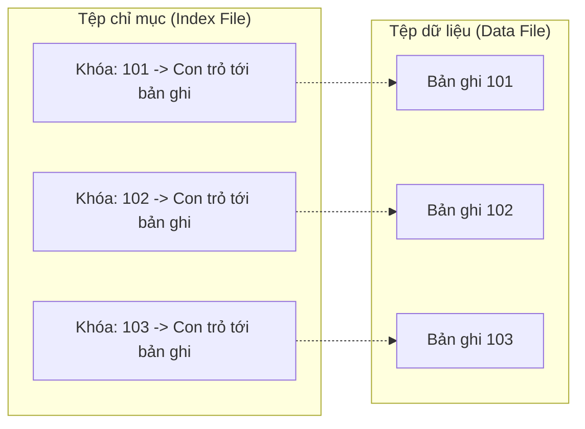
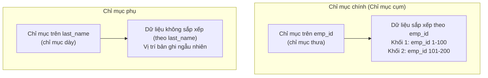
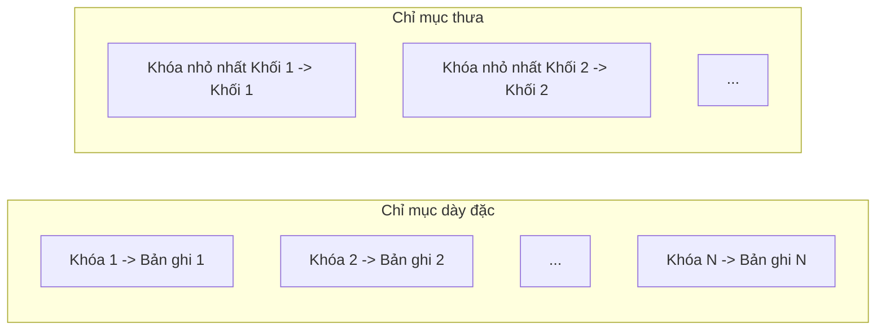
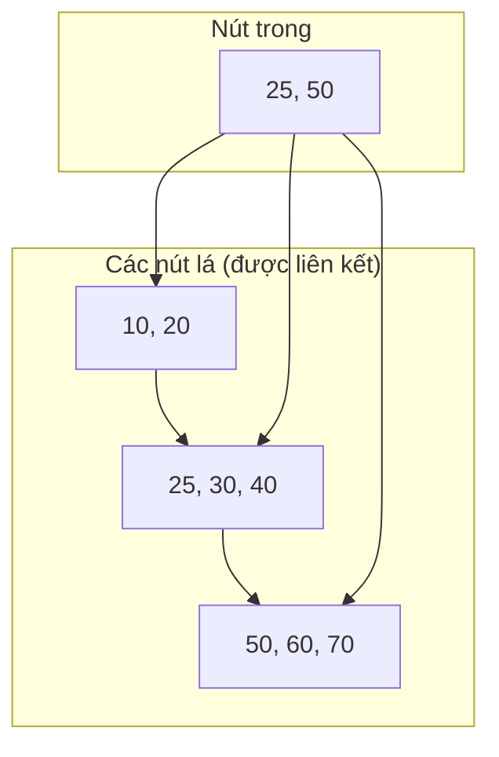
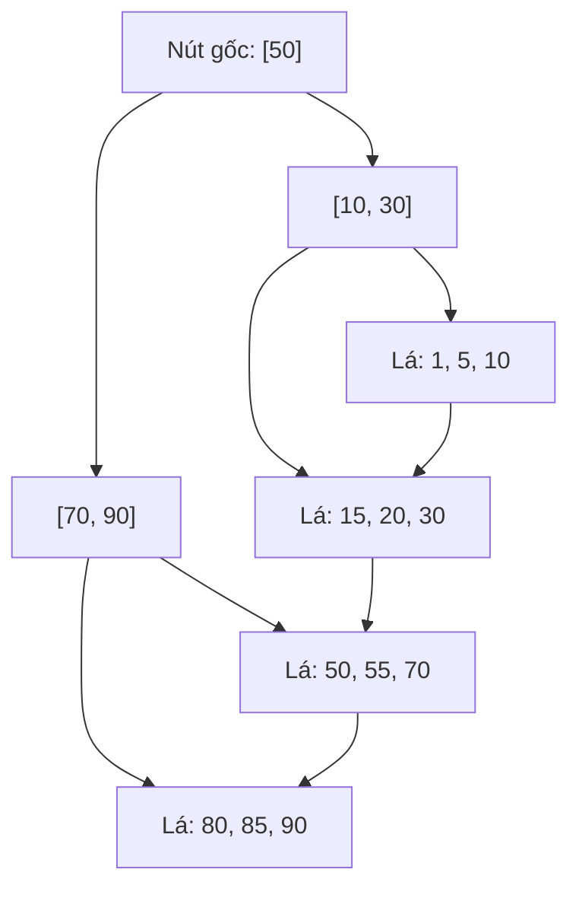

# Chapter 11: Chỉ mục (Indexing)

Chỉ mục (Indexing) là một kỹ thuật cấu trúc dữ liệu được sử dụng để tăng tốc các thao tác truy xuất dữ liệu trong cơ sở dữ liệu. Nếu không sử dụng chỉ mục, hệ quản trị cơ sở dữ liệu (DBMS) buộc phải thực hiện quét toàn bảng (full table scan) từ đầu đến cuối để tìm ra các hàng thỏa mãn điều kiện truy vấn. Chỉ mục cung cấp khả năng truy cập ngẫu nhiên nhanh chóng và quét phạm vi (range scan) cực kỳ hiệu quả bằng cách tổ chức các giá trị khóa trong một cấu trúc có thể tìm kiếm được. Chương này giới thiệu các khái niệm chỉ mục cơ bản, phân loại chỉ mục và hai cấu trúc cây tìm kiếm được sử dụng rộng rãi nhất là Cây B (B-tree) và Cây B+ (B+-tree).

## 11.1 Các khái niệm cơ bản về Chỉ mục

Một **chỉ mục (index)** là một cấu trúc phụ trợ liên kết với một bảng dữ liệu nhằm hỗ trợ việc tìm kiếm nhanh chóng các hàng dựa trên giá trị của một hoặc nhiều cột (gọi là **khóa tìm kiếm - search key**). Một chỉ mục bao gồm các **mục chỉ mục (index entries)** (các cặp khóa-con trỏ) và được lưu trữ hoàn toàn độc lập với tệp dữ liệu thực tế.

### 11.1.1 Tại sao cần sử dụng Chỉ mục?
- **Tốc độ**: Giảm thiểu tối đa số lượng thao tác I/O đĩa từ độ phức tạp $O(n)$ (quét toàn bảng) xuống còn $O(\log n)$ hoặc $O(1)$ đối với các cấu trúc chỉ mục đặc thù.
- **Ràng buộc**: Hỗ trợ áp đặt các ràng buộc duy nhất (khóa chính - primary key, ràng buộc duy nhất - unique constraint).
- **Sắp xếp**: Cung cấp khả năng truy cập dữ liệu theo thứ tự mà không cần tốn chi phí thực hiện sắp xếp toàn bộ bảng dữ liệu thực tế.

### 11.1.2 Các thành phần của cấu trúc Chỉ mục
- **Khóa tìm kiếm (Search key)**: Một hoặc một tổ hợp các thuộc tính mà chỉ mục được xây dựng dựa trên đó.
- **Con trỏ (Pointer)**: Tham chiếu đến bản ghi dữ liệu thực tế (ví dụ: ID của hàng - row ID, ID của khối dữ liệu - block ID, hoặc giá trị khóa chính).
- **Thứ tự (Ordering)**: Các mục chỉ mục thường được sắp xếp theo thứ tự để hỗ trợ tìm kiếm nhị phân hiệu quả.

### 11.1.3 Sơ đồ cơ bản

## 11.2 Chỉ mục chính và Chỉ mục phụ (Primary and Secondary Index)

Chỉ mục được phân loại dựa trên mối quan hệ giữa khóa chỉ mục và thứ tự sắp xếp vật lý của các bản ghi dữ liệu trên đĩa.

### 11.2.1 Chỉ mục chính (Primary Index / Clustering Index)

Một **chỉ mục chính (primary index)** được định nghĩa trên một tệp dữ liệu đã được sắp xếp vật lý theo cùng khóa của chỉ mục đó. Khóa này thường là khóa chính (primary key) của bảng dữ liệu. Mỗi bảng chỉ có thể có tối đa một chỉ mục chính vì dữ liệu vật lý chỉ có thể được sắp xếp theo một thứ tự duy nhất tại một thời điểm.

- **Đặc trưng**:
  - Tệp dữ liệu vật lý được sắp xếp theo khóa chính.
  - Tệp chỉ mục có thể chứa một mục chỉ mục cho mỗi khối dữ liệu (chỉ mục thưa - sparse index) hoặc cho mỗi bản ghi (chỉ mục dày - dense index).
  - Cung cấp tốc độ tìm kiếm cực nhanh cho các truy vấn bằng và truy vấn phạm vi trên khóa chính.
- **Ví dụ**: Một bảng nhân viên được sắp xếp vật lý theo mã nhân viên `emp_id`; chỉ mục chính được xây dựng trên cột `emp_id`.

### 11.2.2 Chỉ mục phụ (Secondary Index / Non-Clustering Index)

Một **chỉ mục phụ (secondary index)** được định nghĩa trên một thuộc tính không quyết định thứ tự sắp xếp vật lý của tệp dữ liệu. Một bảng dữ liệu có thể có nhiều chỉ mục phụ được xây dựng trên các cột khác nhau. Chỉ mục phụ chứa các con trỏ trỏ trực tiếp đến vị trí vật lý của các bản ghi dữ liệu thực tế (row IDs).

- **Đặc trưng**:
  - Các mục chỉ mục được sắp xếp theo khóa tìm kiếm của chỉ mục phụ, nhưng tệp dữ liệu vật lý thì không được sắp xếp theo thứ tự này.
  - Mỗi mục chỉ mục trỏ đến một bản ghi dữ liệu cụ thể (hoặc một danh sách các con trỏ nếu khóa tìm kiếm cho phép trùng lặp giá trị).
  - Rất hữu ích để tăng tốc các truy vấn tìm kiếm trên các cột không phải khóa chính.
- **Ví dụ**: Chỉ mục phụ được xây dựng trên cột họ tên `last_name` khi bảng dữ liệu vật lý đang được sắp xếp theo mã nhân viên `emp_id`.

### 11.2.3 Bảng so sánh chỉ mục chính và chỉ mục phụ

| Đặc điểm | Chỉ mục chính (Primary Index) | Chỉ mục phụ (Secondary Index) |
|----------|-------------------------------|-------------------------------|
| **Số lượng tối đa mỗi bảng** | Tối đa là 1 | Có thể có nhiều |
| **Thứ tự sắp xếp dữ liệu** | Trùng khớp với thứ tự khóa chỉ mục | Độc lập, không trùng với khóa chỉ mục |
| **Chi phí lưu trữ** | Thấp hơn (có thể dùng chỉ mục thưa) | Cao hơn (bắt buộc dùng chỉ mục dày) |
| **Hiệu năng truy vấn phạm vi** | Rất cao (dữ liệu nằm tuần tự) | Trung bình (phải truy cập con trỏ ngẫu nhiên) |
| **Mục đích sử dụng phổ biến**| Tìm kiếm theo khóa chính | Tìm kiếm theo các trường không khóa |

### 11.2.4 Sơ đồ minh họa

## 11.3 Chỉ mục dày đặc và Chỉ mục thưa (Dense and Sparse Index)

Chỉ mục cũng có thể được phân loại dựa trên số lượng các mục chỉ mục so với tổng số bản ghi dữ liệu thực tế.

### 11.3.1 Chỉ mục dày đặc (Dense Index)

Một **chỉ mục dày đặc (dense index)** chứa đúng một mục chỉ mục cho mỗi giá trị khóa tìm kiếm tồn tại trong tệp dữ liệu (tương ứng với mỗi bản ghi dữ liệu). Mỗi mục chỉ mục sẽ trỏ trực tiếp đến bản ghi tương ứng hoặc khối dữ liệu chứa bản ghi đó.

- **Ưu điểm**: Tìm kiếm điểm (point query) trực tiếp và nhanh chóng; không cần quét tìm kiếm tuần tự bên trong khối dữ liệu.
- **Nhược điểm**: Chi phí lưu trữ lớn; tốn hiệu năng cập nhật chỉ mục khi có các thao tác chèn/xóa dữ liệu.
- **Áp dụng phổ biến**: Bắt buộc sử dụng cho chỉ mục phụ; đôi khi dùng cho chỉ mục chính.

### 11.3.2 Chỉ mục thưa (Sparse Index)

Một **chỉ mục thưa (sparse index)** chỉ chứa một mục chỉ mục cho mỗi khối dữ liệu (block) hoặc cho một phạm vi giá trị khóa. Chỉ mục thưa sẽ trỏ đến bản ghi đầu tiên trong mỗi khối dữ liệu. Để định vị một bản ghi, hệ thống tìm mục chỉ mục có khóa gần nhất nhưng nhỏ hơn khóa cần tìm để xác định khối dữ liệu, sau đó thực hiện quét tuần tự bên trong khối đó để tìm bản ghi chính xác.

- **Ưu điểm**: Kích thước chỉ mục rất nhỏ; chi phí bảo trì và cập nhật chỉ mục cực thấp.
- **Nhược điểm**: Chậm hơn một chút đối với các truy vấn điểm (vì phải quét thêm tuần tự bên trong khối).
- **Áp dụng phổ biến**: Dùng cho chỉ mục chính trên các tệp dữ liệu đã được sắp xếp thứ tự.

### 11.3.3 Ví dụ so sánh số lượng
Giả sử có một bảng dữ liệu gồm 10,000 bản ghi, mỗi khối chứa được 100 bản ghi → tổng cộng cần 100 khối dữ liệu.
- **Nếu dùng chỉ mục dày đặc**: Cần lưu trữ 10,000 mục chỉ mục.
- **Nếu dùng chỉ mục thưa**: Chỉ cần lưu trữ 100 mục chỉ mục (mỗi mục cho một khối).

### 11.3.4 Sơ đồ minh họa

## 11.4 Cây B và Cây B+ (B‑tree and B+‑tree)

Cây B (B-tree) và Cây B+ (B+-tree) là các cây tìm kiếm tự cân bằng được thiết kế đặc thù cho các hệ thống lưu trữ lớn nơi các thao tác I/O đĩa đóng vai trò quyết định hiệu năng. Chúng duy trì một hệ số phân nhánh cao (nhiều con trỏ con trên mỗi nút) để giữ cho chiều cao của cây cực kỳ thấp (thường chỉ từ 2 đến 4 cấp cho hàng triệu bản ghi).

### 11.4.1 Cây B (B‑tree)

Một cây B bậc m (với m là số lượng nút con tối đa của một nút) có các tính chất cơ bản sau:
- Tất cả các nút lá đều nằm ở cùng một độ sâu (cân bằng hoàn hảo).
- Mỗi nút trung gian (ngoại trừ nút gốc) chứa từ $\lceil m/2 \rceil$ đến $m$ nút con.
- Mỗi nút chứa cả các giá trị khóa lẫn các con trỏ trỏ đến các nút con và/hoặc các bản ghi dữ liệu thực tế.
- Trong cây B, các bản ghi dữ liệu thực tế có thể được lưu trữ trực tiếp ở cả các nút nội bộ (nút trung gian) lẫn các nút lá.

**Đặc trưng**:
- Tìm kiếm: Quét từ nút gốc đi xuống, có thể tìm thấy ngay bản ghi ở một nút trung gian mà không cần đi xuống nút lá.
- Chèn/xóa: Duy trì tính tự cân bằng của cây thông qua các thao tác tách nút (split) và trộn nút (merge).
- Ít được sử dụng trong các DBMS hiện đại vì việc lưu trữ dữ liệu tại các nút trung gian làm phức tạp hóa việc thực hiện các truy vấn phạm vi.

### 11.4.2 Cây B+ (B+‑tree)

Cây B+ là một biến thể nâng cấp của cây B, trong đó toàn bộ các bản ghi dữ liệu thực tế (hoặc con trỏ trỏ đến dữ liệu thực) chỉ được lưu trữ duy nhất tại các **nút lá**. Các nút trung gian phía trên chỉ lưu trữ các giá trị khóa tìm kiếm làm nhiệm vụ định hướng đường đi.

**Các tính chất**:
- Các nút trung gian: Chỉ chứa các khóa tìm kiếm và con trỏ trỏ đến nút con; hoàn toàn không chứa con trỏ trỏ đến dữ liệu thực tế.
- Các nút lá: Chứa toàn bộ các khóa và con trỏ trỏ đến dữ liệu thực tế. Các nút lá được liên kết tuần tự với nhau bằng một danh sách liên kết (linked list).
- Tất cả các nút lá nằm ở cùng một độ sâu; mức lá chứa toàn bộ các khóa tìm kiếm được sắp xếp theo thứ tự tăng dần.

**Các ưu điểm vượt trội của cây B+ so với cây B**:
- Truy vấn phạm vi cực kỳ hiệu quả: Chỉ cần tìm đến nút lá chứa điểm bắt đầu, sau đó duyệt tuần tự dọc theo danh sách liên kết ở mức lá.
- Hệ số phân nhánh ở các nút trung gian cao hơn nhiều (do nút trung gian không phải tốn không gian lưu con trỏ dữ liệu), giúp chiều cao cây B+ thấp hơn cây B khi lưu cùng một lượng dữ liệu.
- Thời gian truy cập I/O đĩa ổn định và có thể dự đoán trước được (mọi thao tác tìm kiếm đều phải đi xuống nút lá).

**Sơ đồ Cây B+ đơn giản (bậc 4)**:

### 11.4.3 Các thao tác trên Cây B+

**Thao tác tìm kiếm**:
1. Bắt đầu từ nút gốc; so sánh khóa tìm kiếm với các khóa trong nút.
2. Di chuyển theo con trỏ nút con tương ứng đi xuống cho đến khi chạm tới nút lá.
3. Quét tuần tự tại nút lá để tìm ra khóa hoặc phạm vi khóa chính xác.

**Thao tác chèn**:
1. Định vị nút lá chứa phạm vi của khóa cần chèn.
2. Chèn khóa vào nút lá đó (đảm bảo duy trì thứ tự sắp xếp).
3. Nếu nút lá bị tràn (vượt quá $m-1$ khóa), thực hiện tách nút lá thành hai nút lá mới (mỗi nút chứa một nửa dữ liệu). Đẩy khóa ở giữa lên nút cha làm đại diện.
4. Nếu nút cha cũng bị tràn, tiếp tục thực hiện tách nút đệ quy lên phía trên. Nếu nút gốc bị tách, một nút gốc mới được sinh ra và chiều cao của cây tăng thêm 1.

**Thao tác xóa**:
1. Định vị nút lá và xóa khóa khỏi nút lá đó.
2. Nếu nút lá bị thiếu dữ liệu (chứa ít hơn $\lceil m/2 \rceil$ khóa), thực hiện mượn khóa từ nút lá anh em lân cận (redistribution).
3. Nếu không thể mượn khóa (nút anh em cũng đang tối thiểu), thực hiện trộn (merge) nút lá hiện tại với nút anh em và loại bỏ khóa phân tách tương ứng ở nút cha.
4. Tiếp tục đệ quy điều chỉnh lên phía trên nếu nút cha bị thiếu dữ liệu.

### 11.4.4 So sánh Cây B và Cây B+

| Đặc điểm | Cây B (B‑tree) | Cây B+ (B+‑tree) |
|----------|----------------|------------------|
| **Vị trí lưu trữ dữ liệu** | Ở cả nút trung gian và nút lá | Chỉ duy nhất ở các nút lá |
| **Liên kết giữa các nút lá**| Không có (hoặc tùy chọn) | Có danh sách liên kết tuần tự |
| **Kích thước nút trung gian**| Lớn hơn (do phải lưu con trỏ dữ liệu)| Nhỏ hơn (chỉ lưu khóa + con trỏ con) |
| **Chiều cao cây (cùng dữ liệu)**| Cao hơn một chút | Thấp hơn (hệ số phân nhánh cao) |
| **Hiệu năng truy vấn phạm vi**| Kém (phải duyệt lên xuống giữa các nút)| Cực kỳ xuất sắc (duyệt xích ở mức lá) |
| **Mức độ phổ biến thực tế** | Hệ thống di sản cũ, một số hệ thống file| Hầu hết các DBMS lớn (MySQL, PostgreSQL) |

### 11.4.5 Tại sao Cây B+ được chọn cho Cơ sở dữ liệu?
- **Tính cân bằng**: Đảm bảo chi phí I/O đĩa luôn là $O(\log n)$ cho mọi thao tác.
- **Hệ số phân nhánh cực cao**: Thường dao động từ 100 đến 500 con trên mỗi nút → chiều cao cây chỉ khoảng 3 đến 4 cấp đối với hàng tỷ bản ghi dữ liệu.
- **Hỗ trợ quét phạm vi hoàn hảo**: Danh sách liên kết mức lá cho phép giải quyết cực nhanh các truy vấn phạm vi dạng `BETWEEN`, `>`, `<`.
- **Khả năng xử lý đồng thời cao**: Hỗ trợ cơ chế khóa ở cấp độ nút lá (leaf-level locking) giúp tăng tối đa hiệu năng xử lý song song.

**Sơ đồ cấu trúc chi tiết Cây B+**:

## 11.5 Tóm tắt

Chỉ mục là yếu tố sống còn quyết định hiệu năng của toàn bộ hệ thống cơ sở dữ liệu. Các điểm mấu chốt cần nắm vững:

- **Bản chất chỉ mục**: Cung cấp khả năng tìm kiếm siêu tốc, nhưng phải đánh đổi bằng chi phí không gian lưu trữ và chi phí cập nhật dữ liệu.
- **Chỉ mục chính so với chỉ mục phụ**: Chỉ mục chính định đoạt thứ tự sắp xếp vật lý của dữ liệu; chỉ mục phụ cung cấp thêm các đường dẫn tìm kiếm độc lập thay thế.
- **Chỉ mục dày đặc so với chỉ mục thưa**: Chỉ mục dày đặc chứa một mục cho mỗi bản ghi; chỉ mục thưa chứa một mục cho mỗi khối (tiết kiệm bộ nhớ hơn nhưng tìm kiếm điểm chậm hơn một chút).
- **Cây B và Cây B+**:
  - Cây B lưu dữ liệu đan xen trên tất cả các nút; Cây B+ chỉ lưu dữ liệu ở các nút lá và liên kết các nút lá bằng danh sách liên kết.
  - Cây B+ là cấu trúc chỉ mục tối ưu được áp dụng trong hầu hết các DBMS hiện đại nhờ khả năng quét phạm vi hoàn hảo, chiều cao cây thấp và hiệu năng I/O ổn định.

---
