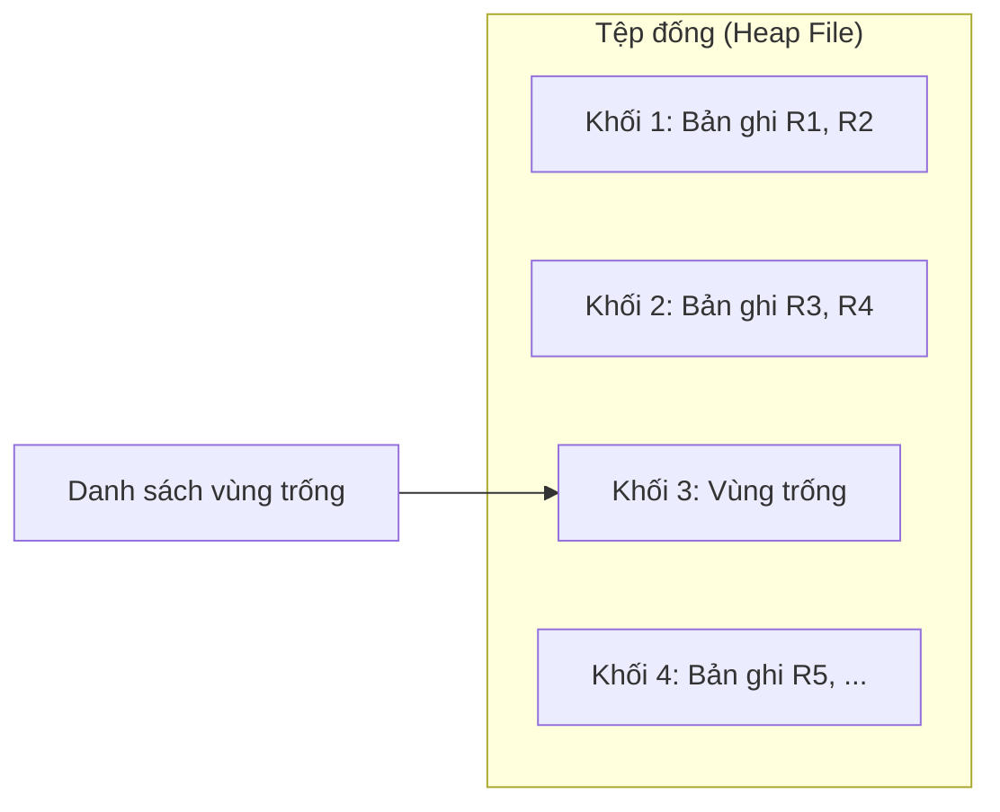
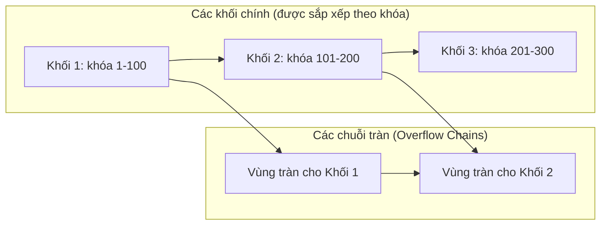
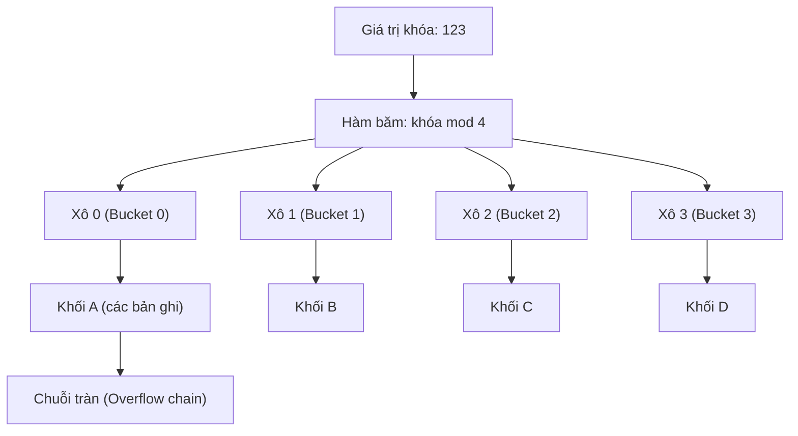
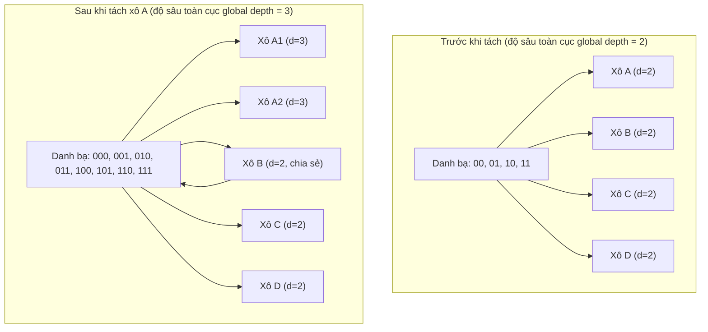

# Chapter 12: Tổ chức tệp và Phương pháp băm (File Organization and Hashing)

Tổ chức tệp (File organization) đề cập đến cách các bản ghi dữ liệu được sắp xếp vật lý trên các phương tiện lưu trữ (như đĩa cứng). Việc lựa chọn phương thức tổ chức tệp ảnh hưởng trực tiếp đến hiệu năng của các thao tác cơ sở dữ liệu như chèn, xóa, cập nhật và tìm kiếm. Phương pháp băm (hashing) là kỹ thuật ánh xạ trực tiếp các giá trị khóa tìm kiếm đến địa chỉ lưu trữ vật lý, cung cấp tốc độ tìm kiếm so khớp bằng cực nhanh. Chương này trình bày chi tiết về tổ chức tệp đống (heap file), tệp tuần tự (sequential file) cũng như các cơ chế băm tĩnh và băm động.

## 12.1 Các khái niệm cơ bản về Tổ chức tệp

Một tệp cơ sở dữ liệu là một tập hợp các bản ghi có độ dài cố định hoặc độ dài biến đổi. Phương thức tổ chức tệp sẽ quyết định:
- Cách các bản ghi được lưu trữ vào các khối dữ liệu (block / page) trên đĩa.
- Cách định vị các bản ghi khi biết khóa tìm kiếm.
- Hiệu năng của các thao tác quét tuần tự, truy vấn điểm (point query) và truy vấn phạm vi.

Các thao tác cơ bản được tối ưu hóa khác nhau tùy theo từng phương thức tổ chức tệp:
- **Chèn (Insert)**: Thêm một bản ghi mới.
- **Tìm kiếm bằng (Equality search)**: Tìm kiếm bản ghi có giá trị khóa bằng giá trị chỉ định.
- **Tìm kiếm phạm vi (Range search)**: Tìm kiếm tất cả các bản ghi có khóa nằm trong một khoảng.
- **Xóa / Cập nhật (Delete / Update)**: Sửa đổi hoặc loại bỏ bản ghi.

## 12.2 Tổ chức tệp đống (Heap File Organization)

Một **tệp đống (heap file)** (hay còn gọi là tệp không sắp thứ tự - unordered file) lưu trữ các bản ghi mà không tuân theo bất kỳ thứ tự đặc biệt nào. Các bản ghi mới được ghi chèn trực tiếp bằng cách nối thêm vào cuối tệp hoặc chèn vào vị trí trống bất kỳ được tìm thấy trong danh sách vùng trống (free space list).

### 12.2.1 Đặc trưng
- **Chèn (Insert)**: Cực nhanh – chỉ cần nối thêm vào cuối tệp hoặc đặt vào các slot còn trống.
- **Tìm kiếm bằng (Equality search)**: Chậm – bắt buộc phải quét toàn bộ tệp từ đầu đến cuối ($O(n)$ chi phí I/O đĩa).
- **Tìm kiếm phạm vi (Range search)**: Chậm – tương tự như quét toàn bộ tệp.
- **Xóa (Delete)**: Đánh dấu bản ghi đã bị xóa (hoặc thực hiện dọn dẹp, dồn tệp sau); có thể duy trì một danh sách vùng trống để tái sử dụng không gian.
- **Cập nhật (Update)**: Rất đơn giản nếu bản ghi có độ dài cố định; phức tạp hơn đối với bản ghi có độ dài biến đổi.

### 12.2.2 Các trường hợp áp dụng
- Các bảng dữ liệu tạm thời, bảng nhật ký hệ thống (logs), hoặc các bảng có dung lượng cực nhỏ, ít khi phải truy vấn.
- Các tác vụ chèn dữ liệu hàng loạt (bulk insert) nơi thao tác ghi chiếm ưu thế còn thao tác tìm kiếm rất ít khi xảy ra.

### 12.2.3 Cấu trúc tệp đống với Danh sách vùng trống

## 12.3 Tổ chức tệp tuần tự (Sequential File Organization)

Một **tệp tuần tự (sequential file)** lưu trữ các bản ghi theo thứ tự sắp xếp vật lý của một thuộc tính khóa được chỉ định trước (khóa sắp thứ tự - ordering key). Các bản ghi được bố trí vật lý trên đĩa theo chiều tăng dần hoặc giảm dần của giá trị khóa. Do đó, thao tác chèn và xóa dữ liệu có chi phí rất cao vì phải dịch chuyển dữ liệu để duy trì thứ tự sắp xếp.

### 12.3.1 Đặc trưng
- **Chèn (Insert)**: Đòi hỏi phải tìm ra vị trí chính xác để chèn; có thể phải dịch chuyển các bản ghi phía sau hoặc sử dụng thêm các khối tràn (overflow blocks).
- **Tìm kiếm bằng (Equality search)**: Nhanh – sử dụng thuật toán tìm kiếm nhị phân trực tiếp trên tệp dữ liệu ($O(\log n)$ chi phí truy cập khối).
- **Tìm kiếm phạm vi (Range search)**: Cực kỳ nhanh – chỉ cần dùng tìm kiếm nhị phân để xác định bản ghi bắt đầu, sau đó quét tuần tự liên tục các khối tiếp theo.
- **Xóa (Delete)**: Đánh dấu đã xóa hoặc dồn tệp vật lý; chi phí tương đương thao tác chèn.

### 12.3.2 Xử lý tràn (Overflow Handling)
Khi chèn một bản ghi mới, nếu khối đích đã bị đầy hoàn toàn, hệ thống sẽ thực hiện liên kết khối đó với một **khối tràn (overflow block)** mới. Sự xuất hiện của các chuỗi tràn (overflow chains) sẽ làm giảm dần hiệu năng tìm kiếm theo thời gian; do đó cần thực hiện tái tổ chức tệp định kỳ.

### 12.3.3 Cấu trúc tệp tuần tự

### 12.3.4 Bảng so sánh tệp đống và tệp tuần tự

| Thao tác | Tệp đống (Heap File) | Tệp tuần tự (Sequential File) |
|----------|----------------------|-------------------------------|
| **Chèn (Insert)** | Rất nhanh (chỉ cần nối đuôi) | Chậm (phải tìm vị trí, duy trì thứ tự) |
| **Tìm kiếm bằng** | Chậm (quét toàn bảng) | Nhanh (tìm kiếm nhị phân) |
| **Quét phạm vi** | Chậm (quét toàn bảng) | Cực kỳ nhanh (đọc tuần tự) |
| **Xóa (Delete)** | Trung bình (đánh dấu xóa) | Trung bình (đánh dấu + dồn tệp) |
| **Hiệu suất sử dụng ổ đĩa** | Rất cao (ít ô trống lãng phí) | Thấp hơn (phát sinh khối tràn) |

## 12.4 Phương pháp băm (Hashing)

Phương pháp băm thực hiện ánh xạ trực tiếp một khóa tìm kiếm đến địa chỉ của một khối dữ liệu vật lý trên đĩa thông qua một **hàm băm (hash function)** `h(key)`. Phương pháp băm là giải pháp hoàn hảo cho các truy vấn so khớp bằng dạng `WHERE key = value`, nhưng hoàn toàn bất lực và không hiệu quả đối với các truy vấn phạm vi.

### 12.4.1 Các khái niệm băm cơ bản

- **Hàm băm (Hash function)**: `h(key) → số hiệu xô` (một xô dữ liệu - bucket chứa một hoặc nhiều khối đĩa vật lý).
- **Xô dữ liệu (Bucket)**: Đơn vị lưu trữ logic; mỗi xô có thể chứa nhiều bản ghi (thông thường mỗi xô tương ứng với một khối dữ liệu).
- **Đụng độ băm (Collision)**: Xảy ra khi hai giá trị khóa khác nhau qua hàm băm cho ra cùng một địa chỉ xô. Xử lý đụng độ bằng cách sử dụng chuỗi tràn (overflow chaining) hoặc địa chỉ mở (open addressing).

### 12.4.2 Băm tĩnh (Static Hashing)

Trong **băm tĩnh (static hashing)**, số lượng các xô dữ liệu (buckets) được cố định trước và hoàn toàn không thay đổi trong suốt quá trình hoạt động. Hàm băm sẽ phân phối đều các giá trị khóa vào các xô cố định này.

**Đặc trưng**:
- **Đơn giản**: Số lượng xô cố định là `N`. Ví dụ hàm băm đơn giản: `h(key) = key mod N`.
- **Chèn (Insert)**: Tính toán số hiệu xô, thực hiện chèn dữ liệu; nếu xô bị đầy, liên kết thêm khối tràn.
- **Tìm kiếm**: Tính toán số hiệu xô, sau đó quét tìm kiếm tuần tự bên trong xô đó (và chuỗi tràn đi kèm nếu có).
- **Hạn chế**:
  - Nếu cơ sở dữ liệu phình to nhanh chóng, các xô sẽ bị quá tải dẫn đến các chuỗi tràn kéo dài, làm giảm nghiêm trọng hiệu năng truy cập dữ liệu.
  - Nếu cơ sở dữ liệu thu hẹp, nhiều xô trống sẽ gây lãng phí bộ nhớ lưu trữ.
- **Trường hợp áp dụng**: Các bảng dữ liệu nhỏ, kích thước ổn định và dễ dự đoán trước.

**Sơ đồ cấu trúc Băm tĩnh**:

### 12.4.3 Băm động (Dynamic Hashing / Extendible Hashing)

Băm động (hay còn gọi là **băm mở rộng / băm khả mở**) cho phép tự động điều chỉnh số lượng các xô dữ liệu tăng lên hoặc giảm xuống một cách linh hoạt để thích ứng với sự thay đổi kích thước của cơ sở dữ liệu. Nó sử dụng một danh bạ con trỏ (directory) trỏ tới các xô và một hàm băm tạo ra một chuỗi bit nhị phân dài (ví dụ: băm 32-bit). Hệ thống chỉ sử dụng `i` bit đầu tiên của chuỗi bit này để phân cấp, trong đó độ sâu toàn cục `i` sẽ tự động tăng lên khi một xô bị tràn.

**Thuật toán Băm mở rộng**:
- **Danh bạ (Directory)**: Một mảng con trỏ có kích thước $2^i$ (với `i` là độ sâu toàn cục - global depth). Mỗi mục trong danh bạ trỏ trực tiếp đến một xô dữ liệu cụ thể.
- **Xô dữ liệu (Bucket)**: Có một thông số độ sâu cục bộ (local depth) `d` thỏa mãn $d \le i$. Mỗi xô lưu trữ tối đa được `B` bản ghi.
- **Thao tác chèn (Insert)**:
  1. Áp dụng hàm băm lên khóa để thu được chuỗi bit nhị phân.
  2. Sử dụng `i` bit đầu tiên làm chỉ mục để truy cập vào danh bạ con trỏ.
  3. Di chuyển theo con trỏ để tìm đến xô dữ liệu đích.
  4. Nếu xô chưa đầy, thực hiện chèn bản ghi mới.
  5. Nếu xô đã đầy hoàn toàn:
     - Nếu độ sâu cục bộ `d` bằng độ sâu toàn cục `i`: Tiến hành nhân đôi kích thước danh bạ con trỏ ($i \leftarrow i + 1$).
     - Tạo thêm một xô dữ liệu mới; thực hiện phân phối lại các bản ghi giữa xô cũ và xô mới dựa trên giá trị của bit thứ $d + 1$.
     - Tăng độ sâu cục bộ của hai xô bị ảnh hưởng thêm 1 đơn vị.
     - Cập nhật lại các con trỏ trong danh bạ.
- **Thao tác tìm kiếm**: Tương tự như chèn nhưng không có bước phân phối lại dữ liệu.
- **Thao tác xóa**: Có thể thực hiện gộp các xô lân cận và thu nhỏ kích thước danh bạ nếu số lượng bản ghi giảm xuống đáng kể.

**Đặc trưng**:
- **Tự động tăng trưởng linh hoạt**: Hoàn toàn loại bỏ các chuỗi tràn kéo dài; thao tác tách xô giúp duy trì hiệu năng truy cập ổn định $O(1)$.
- **Chi phí danh bạ**: Danh bạ con trỏ có thể tăng gấp đôi kích thước; tuy nhiên đối với hầu hết cơ sở dữ liệu, danh bạ này cực kỳ nhỏ gọn và nằm hoàn toàn trên bộ nhớ RAM.
- **Áp dụng phổ biến**: Các cơ sở dữ liệu lớn có kích thước thay đổi liên tục, không thể dự đoán trước, hoặc trong một số hệ thống NoSQL.

**Sơ đồ minh họa Băm mở rộng (Trước và Sau khi tách xô)**:

### 12.4.4 So sánh băm tĩnh và băm động

| Đặc điểm | Băm tĩnh (Static Hashing) | Băm động / Băm mở rộng |
|----------|---------------------------|------------------------|
| **Số lượng xô** | Cố định, không đổi | Thay đổi linh hoạt tăng/giảm |
| **Xử lý khi bị tràn** | Dùng chuỗi tràn (hiệu năng giảm) | Tách xô tự động (không dùng chuỗi tràn) |
| **Sử dụng danh bạ** | Không dùng (truy cập trực tiếp) | Sử dụng danh bạ con trỏ kích thước $2^i$ |
| **Hiệu quả không gian**| Có thể lãng phí (nếu xô trống) | Rất cao (chỉ tách xô khi có tràn) |
| **Hiệu năng lâu dài** | Giảm dần khi dữ liệu phình to | Duy trì ổn định ở mức $O(1)$ |
| **Độ phức tạp** | Rất đơn giản | Phức tạp hơn (quản lý danh bạ) |
| **Trường hợp khuyên dùng**| Bảng dữ liệu nhỏ, ổn định | Bảng dữ liệu lớn, động |

### 12.4.5 So sánh Chỉ mục băm và Chỉ mục Cây B+

| Khía cạnh đánh giá | Chỉ mục băm (Hash Index) | Chỉ mục Cây B+ (B+‑tree Index) |
|--------------------|--------------------------|--------------------------------|
| **Truy vấn bằng** | Đạt hiệu năng tuyệt đối $O(1)$ | Đạt hiệu năng ổn định $O(\log n)$ |
| **Truy vấn phạm vi**| Không hỗ trợ (phải quét toàn bảng)| Rất hiệu quả (dọc danh sách lá) |
| **Thứ tự dữ liệu** | Không sắp thứ tự | Được sắp xếp theo thứ tự khóa |
| **Chi phí cập nhật**| Thấp (nếu không xảy ra tách xô) | Trung bình (do tách/gộp nút cây) |
| **Ứng dụng phổ biến**| Phép kết nối băm (hash join), tìm kiếm chính xác | Là chỉ mục vạn năng cho mọi truy vấn |

## 12.5 Tóm tắt

Cách tổ chức tệp dữ liệu quyết định trực tiếp hiệu năng truy xuất và lưu trữ vật lý của cơ sở dữ liệu trên đĩa cứng. Các điểm cốt lõi cần nhớ:

- **Tệp đống (Heap file)**: Không sắp thứ tự; chèn nhanh nhất; tìm kiếm chậm nhất; thích hợp cho dữ liệu nhật ký (logs) và các bảng tạm thời.
- **Tệp tuần tự (Sequential file)**: Sắp xếp theo khóa vật lý; quét phạm vi cực nhanh; chèn/sửa dữ liệu rất tốn chi phí dịch chuyển và xử lý chuỗi tràn.
- **Băm tĩnh**: Số lượng xô cố định; đơn giản nhưng hiệu năng suy giảm nhanh chóng khi dữ liệu phình to sinh ra chuỗi tràn kéo dài.
- **Băm động (Băm mở rộng)**: Tự động điều chỉnh linh hoạt số lượng xô bằng cách tách xô và quản lý qua danh bạ con trỏ; loại bỏ chuỗi tràn; hiệu năng duy trì hoàn hảo $O(1)$.

---
