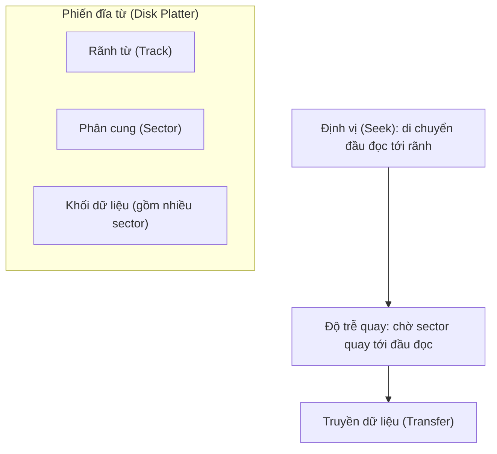
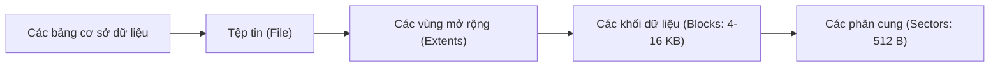
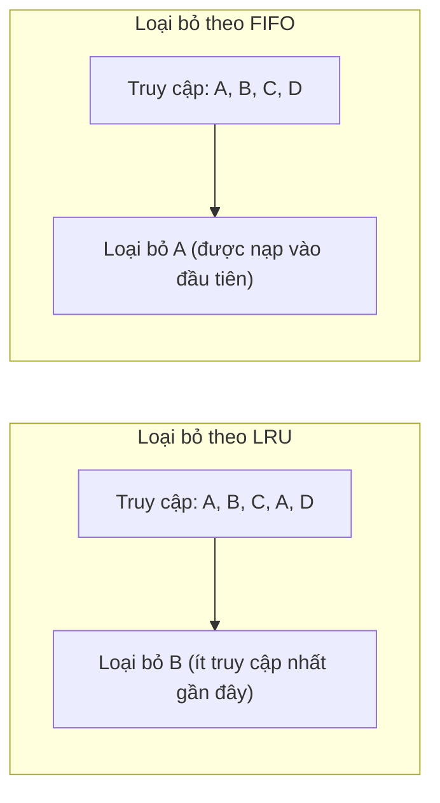
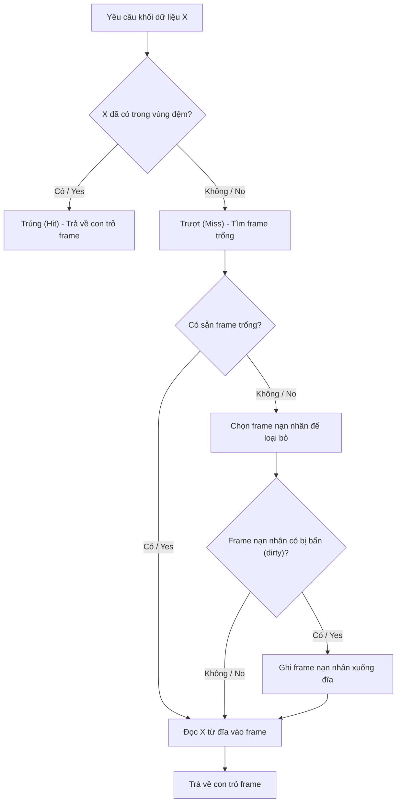
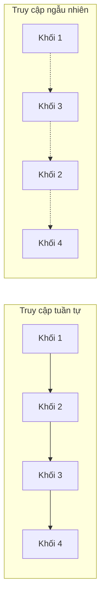

# Chapter 13: Quản lý Lưu trữ và Bộ đệm (Storage and Buffer Management)

Hiệu năng của các hệ quản trị cơ sở dữ liệu phụ thuộc rất lớn vào cách dữ liệu được lưu trữ vật lý trên đĩa cứng và cách nó được di chuyển qua lại giữa đĩa cứng và bộ nhớ trong (RAM). Thao tác I/O đĩa luôn chậm hơn nhiều bậc so với tốc độ truy cập bộ nhớ RAM, điều này khiến cho việc quản lý lưu trữ và quản lý bộ đệm đóng vai trò quyết định đến hiệu suất tổng thể của hệ thống. Chương này trình bày chi tiết về cấu trúc đĩa vật lý, cơ chế quản lý bể bộ đệm (buffer pool) và các kỹ thuật truy cập để giảm thiểu tối đa chi phí I/O.

## 13.1 Cấu trúc Lưu trữ trên Đĩa

Ổ đĩa cứng từ tính (HDD) và ổ đĩa thể rắn (SSD) là các phương tiện lưu trữ bền vững (persistent storage media) chính trong các hệ thống cơ sở dữ liệu. Việc thấu hiểu cấu trúc vật lý của ổ cứng HDD giúp tối ưu hóa việc phân bố dữ liệu; các ổ đĩa SSD có các đặc tính kỹ thuật khác biệt nhưng thường được trừu tượng hóa tương tự ở cấp độ tệp hệ thống.

### 13.1.1 Các thành phần đĩa vật lý (HDD)

Một ổ đĩa cứng HDD thông thường bao gồm:
- **Các phiến đĩa (Platters)**: Các đĩa từ tính hình tròn xếp chồng lên nhau quanh một trục quay (spindle).
- **Các rãnh từ (Tracks)**: Các vòng tròn đồng tâm trên bề mặt của mỗi phiến đĩa.
- **Các phân cung (Sectors)**: Đơn vị địa chỉ nhỏ nhất có thể truy cập trên một rãnh từ (thường có kích thước 512 bytes hoặc 4 KB).
- **Các khối / Các trang (Blocks / Pages)**: Đơn vị truyền tải dữ liệu logic giữa đĩa cứng và bộ nhớ RAM (thường có kích thước 4 KB, 8 KB hoặc 16 KB). Một khối dữ liệu bao gồm một hoặc nhiều sector liên tiếp nhau.
- **Đầu đọc/ghi (Heads)**: Đầu đọc/ghi từ tính gắn liền trên một cần chuyển động để di chuyển ngang qua các rãnh từ.
- **Hình trụ (Cylinder)**: Tập hợp tất cả các rãnh từ có cùng bán kính trên toàn bộ các phiến đĩa.

### 13.1.2 Các thành phần của Thời gian truy cập đĩa

Khi thực hiện thao tác đọc hoặc ghi một khối dữ liệu, hệ thống phải trải qua ba khoảng thời gian trễ:
1. **Thời gian định vị (Seek time)**: Thời gian đầu đọc di chuyển tới đúng rãnh từ chứa dữ liệu. (Đây là chi phí lớn nhất, thường mất từ 5-10 ms).
2. **Độ trễ quay (Rotational latency)**: Thời gian chờ đợi phiến đĩa quay đúng phân cung dữ liệu cần đọc xuống dưới đầu đọc (trung bình bằng một nửa chu kỳ quay, khoảng 2-4 ms đối với đĩa 7200 RPM).
3. **Thời gian truyền dữ liệu (Transfer time)**: Thời gian thực tế để đọc/ghi dữ liệu (rất nhỏ, thường <0.1 ms cho một khối).

Do đó, việc truy cập dữ liệu tuần tự (đọc các khối liên tiếp nhau) luôn nhanh hơn rất nhiều so với truy cập ngẫu nhiên vì giảm thiểu được tối đa thời gian trễ định vị đầu đọc và độ trễ chờ đĩa quay.

**Sơ đồ minh họa**:

### 13.1.3 Tổ chức tệp trên đĩa

Hệ quản trị cơ sở dữ liệu (DBMS) ánh xạ các đối tượng logic (bảng, chỉ mục) thành các tệp tin tin học, các tệp tin này sau đó được lưu trữ dưới dạng các khối dữ liệu vật lý trên đĩa cứng. Mỗi khối dữ liệu có một địa chỉ vật lý duy nhất (số hiệu khối đĩa). Bộ quản lý lưu trữ (storage manager) của DBMS có nhiệm vụ cấp phát, đọc và ghi các khối dữ liệu này.

**Sơ đồ phân rã khối dữ liệu**:

## 13.2 Quản lý Bộ đệm (Buffer Management)

**Bộ quản lý bộ đệm (buffer manager)** có nhiệm vụ nạp các khối dữ liệu từ đĩa cứng vào bộ nhớ RAM (gọi là bể bộ đệm - buffer pool) và quản lý chúng một cách tối ưu. Việc lưu giữ các khối dữ liệu thường xuyên truy cập trên RAM giúp giảm thiểu tối đa các thao tác ghi đọc đĩa chậm chạp.

### 13.2.1 Bể bộ đệm (Buffer Pool)

Bể bộ đệm là một mảng các **khung đệm (frames)**, mỗi khung có kích thước bằng đúng một khối dữ liệu đĩa. Khi một khối dữ liệu được yêu cầu truy cập, bộ quản lý bộ đệm thực hiện:
1. Kiểm tra xem khối dữ liệu đó đã nằm sẵn trên vùng đệm chưa (**trúng bộ đệm - cache hit**).
2. Nếu chưa (**trượt bộ đệm - cache miss**), hệ thống thực hiện đọc khối dữ liệu từ đĩa và nạp vào một frame trống trên RAM.
3. Nếu không còn frame trống nào trên RAM, hệ thống sẽ chọn ra một frame đang hoạt động làm "nạn nhân" để giải phóng và ghi đè dữ liệu mới (**chiến lược loại bỏ - replacement policy**).
4. Nếu frame bị loại bỏ là **khối bẩn (dirty block - dữ liệu đã bị sửa đổi trên RAM nhưng chưa ghi xuống đĩa)**, hệ thống bắt buộc phải ghi dữ liệu cũ đó xuống đĩa cứng trước khi giải phóng frame.

### 13.2.2 Các chiến lược thay thế vùng đệm (Buffer Replacement Policies)

Việc lựa chọn chiến lược thay thế ảnh hưởng trực tiếp đến tỷ lệ trúng bộ đệm. Các chiến lược phổ biến:

- **LRU (Least Recently Used)**: Loại bỏ khối dữ liệu có thời gian chưa được truy cập lâu nhất. Rất hiệu quả cho các mẫu truy cập lặp đi lặp lại.
- **FIFO (First‑In‑First‑Out)**: Loại bỏ khối dữ liệu được nạp vào bộ đệm sớm nhất. Đơn giản nhưng có thể loại bỏ nhầm khối dữ liệu đang được dùng thường xuyên.
- **Clock (Second Chance)**: Một thuật toán tiệm cận hiệu năng của LRU nhưng có độ phức tạp thấp hơn, sử dụng một danh sách vòng tròn cùng các bit tham chiếu (bit cơ hội thứ hai).
- **MRU (Most Recently Used)**: Loại bỏ khối dữ liệu vừa mới được truy cập gần đây nhất. Rất hữu ích cho một số mẫu truy vấn quét tuần tự quy mô lớn.
- **Ngẫu nhiên (Random)**: Lựa chọn ngẫu nhiên một khối để loại bỏ; đơn giản nhưng đôi khi mang lại hiệu quả bất ngờ đối với một số loại tải công việc đặc thù.

**Sơ đồ so sánh LRU và FIFO**:

### 13.2.3 Khối bẩn và Ép ghi (Dirty Blocks and Forced Writes)

Một **khối bẩn (dirty block)** là một khung đệm đã bị chỉnh sửa nội dung trên RAM nhưng dữ liệu mới này chưa được lưu xuống đĩa. Trước khi giải phóng hoặc loại bỏ một khối bẩn, bộ quản lý bộ đệm bắt buộc phải thực hiện thao tác ghi dữ liệu xuống đĩa (gọi là **ép ghi - forced write**). Để tối ưu hiệu năng, DBMS thường chạy một tiến trình ngầm (background writer) thực hiện flush định kỳ các khối bẩn xuống đĩa để tránh việc giao dịch phải chờ đợi khi cần giải phóng frame.

### 13.2.4 Các thao tác của Bộ quản lý bộ đệm

- **Ghim/Bỏ ghim (Pin/Unpin)**: Một khối dữ liệu được ghim (pinned) sẽ không bao giờ bị chọn để loại bỏ khỏi vùng đệm. Tính năng này được dùng khi một giao dịch đang tích cực xử lý dữ liệu trong khối đó.
- **Flush**: Chủ động ghi dữ liệu của khối bẩn xuống đĩa.
- **Đọc trước (Prefetching)**: Dự đoán và nạp trước các khối dữ liệu vào vùng đệm trước khi giao dịch yêu cầu, giúp giảm thiểu thời gian chờ định vị đĩa.

**Sơ đồ quy trình hoạt động của Bộ quản lý bộ đệm**:

### 13.2.5 Quản lý bộ đệm trong thực tiễn

- **Chiến lược cục bộ so với toàn cục**: Chiến lược cục bộ quản lý và cấp phát vùng đệm riêng biệt cho từng giao dịch; chiến lược toàn cục quản lý chung trên toàn bộ bể bộ đệm.
- **Trễ trượt (Hysteresis)**: Một số DBMS sử dụng hai ngưỡng giới hạn (ngưỡng thấp - low water, ngưỡng cao - high water) để kiểm soát nhịp độ flush đĩa của tiến trình ghi ngầm.
- **Bỏ qua đệm của hệ điều hành (Direct I/O)**: DBMS thường bỏ qua bộ đệm tệp tin của hệ điều hành và tự thực hiện ghi đọc đĩa trực tiếp để tránh lãng phí bộ nhớ do đệm hai lần (double caching) và có toàn quyền tối ưu hóa chiến lược thay thế.

## 13.3 Các kỹ thuật tối ưu hóa truy cập

Kỹ thuật truy cập là các chiến lược tổng hợp kết hợp giữa tổ chức tệp, lập chỉ mục và quản lý bộ đệm để giảm thiểu tối đa số lượng thao tác ghi đọc đĩa vật lý.

### 13.3.1 Truy cập tuần tự (Sequential Access)

Truy cập tuần tự thực hiện đọc liên tục các khối dữ liệu kế tiếp nhau trên đĩa. Do chi phí định vị đầu đọc (seek time) và độ trễ chờ quay đĩa chỉ phát sinh đúng một lần duy nhất cho toàn bộ chuỗi đọc lớn, phương pháp này rất hiệu quả. Áp dụng cho:
- Quét toàn bảng (full table scan).
- Quét phạm vi trên các chỉ mục cụm (clustered indexes).
- Xử lý các tệp tin tuần tự.

**Sơ đồ so sánh Truy cập tuần tự và Truy cập ngẫu nhiên**:

### 13.3.2 Truy cập qua chỉ mục (Indexed Access)

Sử dụng chỉ mục (Cây B+, chỉ mục băm) để định vị một bản ghi giúp giảm thiểu tối đa số lượng khối dữ liệu phải đọc so với việc quét toàn bảng. Đối với cây B+ có chiều cao $h$, một truy vấn điểm (point query) chỉ cần thực hiện:
- Đọc $h$ khối chỉ mục (từ gốc xuống lá).
- Đọc đúng 1 khối dữ liệu chứa bản ghi (nếu khối đó chưa có sẵn trên vùng đệm RAM).

Đối với truy vấn phạm vi, sau khi dùng chỉ mục định vị được nút lá bắt đầu, xích liên kết ở mức lá sẽ chuyển đổi việc truy cập sang tuần tự để đạt hiệu năng tối đa.

### 13.3.3 Nạp trước (Prefetching)

DBMS tự động dự đoán các khối dữ liệu sắp sửa được truy cập để phát lệnh đọc bất đồng bộ trước. Các mẫu nạp trước phổ biến:
- **Nạp trước tuần tự**: Sau khi giao dịch đọc khối dữ liệu $i$, hệ thống tự động nạp tiếp các khối $i+1$, $i+2$ vào đệm RAM.
- **Nạp trước mức lá chỉ mục**: Tự động nạp các nút lá anh em lân cận khi đang thực hiện quét phạm vi chỉ mục.

### 13.3.4 Kỹ thuật đệm kép (Double Buffering)

Đệm kép sử dụng đồng thời hai vùng đệm: CPU thực hiện xử lý dữ liệu trên vùng đệm này trong khi hệ thống I/O đang thực hiện nạp dữ liệu từ đĩa vào vùng đệm kia. Kỹ thuật này giúp xử lý song song, gối đầu giữa tính toán và I/O, thường được áp dụng trong thuật toán sắp xếp ngoài (external sorting) và phép kết nối băm (hash join).

### 13.3.5 Truy cập lưu trữ dạng cột (Columnar Storage Access)

Trong các cơ sở dữ liệu hướng cột, mỗi thuộc tính cột được lưu trữ trong các tệp riêng biệt. Các truy vấn chỉ lọc và truy cập trên một vài cột cụ thể sẽ chỉ cần thực hiện I/O trên đúng các tệp cột liên quan, giúp giảm thiểu đáng kể dung lượng I/O và tối ưu hóa nén dữ liệu.

## 13.4 Tóm tắt

Quản lý lưu trữ và bộ đệm là nền tảng cốt lõi quyết định hiệu năng của mọi hệ quản trị cơ sở dữ liệu. Các kiến thức trọng tâm:

- **Bộ lưu trữ đĩa**: Các phiến đĩa, rãnh, phân cung và khối dữ liệu; thời gian truy cập bị quyết định bởi độ trễ định vị đầu đọc và độ trễ quay đĩa.
- **Quản lý bộ đệm**: Bể bộ đệm thực hiện lưu dữ liệu trên RAM; các chiến lược thay thế (LRU, Clock) chọn frame giải phóng; khối bẩn bắt buộc phải ghi xuống đĩa trước khi ghi đè.
- **Các kỹ thuật tối ưu**: Truy cập tuần tự đạt hiệu quả cao; chỉ mục giúp giảm số khối đĩa phải đọc; đọc trước và đệm kép giúp xử lý song song giữa CPU và I/O đĩa.

---
