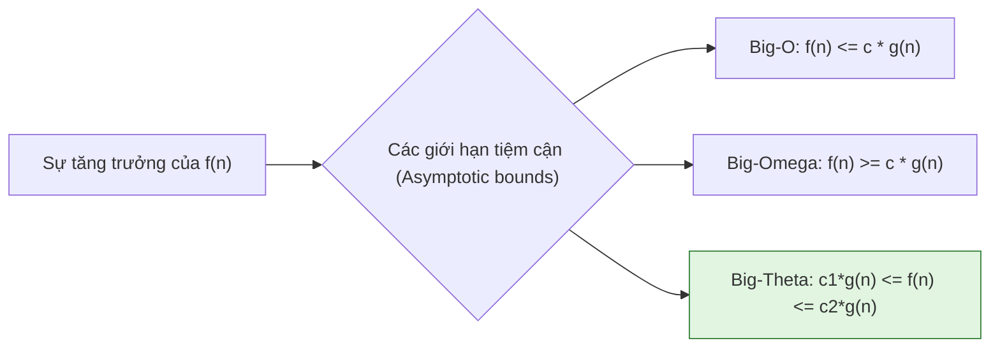
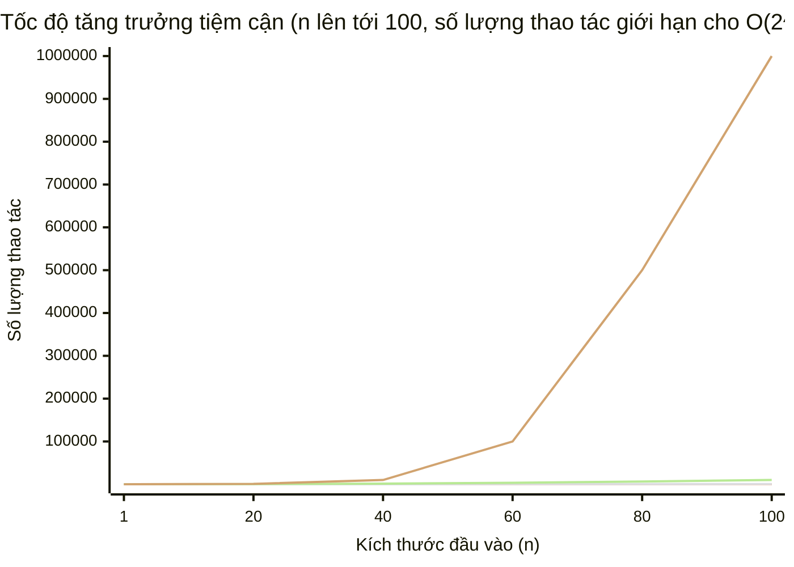

# Chương 1: Giới thiệu về Cấu trúc dữ liệu và Giải thuật (Introduction to Data Structures and Algorithms)

## 1. Cấu trúc dữ liệu và Giải thuật là gì?

**Cấu trúc dữ liệu (Data structure)** là một định dạng chuyên biệt để tổ chức, xử lý, truy xuất và lưu trữ dữ liệu. Nó định nghĩa mối quan hệ giữa các phần tử dữ liệu và các thao tác có thể được thực hiện trên chúng. Các ví dụ phổ biến bao gồm mảng (arrays), danh sách liên kết (linked lists), ngăn xếp (stacks), hàng đợi (queues), cây (trees) và bảng băm (hash tables).

**Phép so sánh trong thế giới thực**: Hãy tưởng tượng một cấu trúc dữ liệu giống như cách sắp xếp một thư viện sách. Sách có thể được sắp xếp theo bảng chữ cái (như một mảng), nhóm theo thể loại (như một bảng băm) hoặc xếp chồng thành một đống (như một ngăn xếp). Phương pháp tổ chức quyết định tốc độ bạn có thể tìm kiếm, thêm hoặc loại bỏ một cuốn sách.

Một **giải thuật (Algorithm)** hay thuật toán là một chuỗi hữu hạn các chỉ dẫn từng bước rõ ràng, được xác định cụ thể nhằm giải quyết một bài toán hoặc hoàn thành một nhiệm vụ nào đó. Giải thuật biến đổi dữ liệu đầu vào (input) thành dữ liệu đầu ra mong muốn (output) thông qua một chuỗi các bước tính toán.

**Phép so sánh trong thế giới thực**: Công thức làm bánh là một giải thuật—nó nhận các nguyên liệu (đầu vào), tuân theo một bộ hướng dẫn cố định (quá trình xử lý) và tạo ra một chiếc bánh (đầu ra). Tương tự, hệ thống định vị GPS chạy một giải thuật để tìm ra tuyến đường ngắn nhất từ vị trí hiện tại của bạn đến điểm đích.

Sự kết hợp giữa cấu trúc dữ liệu và giải thuật là vô cùng quan trọng: việc lựa chọn cấu trúc dữ liệu ảnh hưởng trực tiếp đến hiệu năng của giải thuật, và ngược lại, các giải thuật thường được thiết kế để tận dụng các đặc tính tối ưu của các cấu trúc dữ liệu cụ thể.

---

## 2. Tại sao DSA lại quan trọng trong phát triển phần mềm và phỏng vấn tuyển dụng

### Trong phát triển phần mềm (Software Development)
- **Tối ưu hóa hiệu năng (Performance optimization)**: Lựa chọn cấu trúc dữ liệu và giải thuật (DSA) hiệu quả giúp giảm chi phí tính toán, mức tiêu thụ bộ nhớ và thời gian phản hồi trong các hệ thống thực tế (production systems).
- **Khả năng mở rộng (Scalability)**: Các hệ thống phục vụ hàng triệu người dùng hoặc xử lý hàng terabyte dữ liệu đòi hỏi các giải thuật có mức độ tăng trưởng tiệm cận dưới mức tuyến tính (sub-linear) hoặc tuyến tính-lôgarit (log-linear).
- **Quản lý tài nguyên (Resource management)**: Các hệ thống nhúng (embedded systems), ứng dụng thời gian thực (real-time applications) và các nền tảng giao dịch tần suất cao (high-frequency trading) yêu cầu giới hạn thời gian và không gian bộ nhớ cực kỳ chuẩn xác và có thể dự đoán được.
- **Giải quyết bài toán thực tế**: Nhiều vấn đề thực tế (như định tuyến đường đi, lập lịch công việc, tìm kiếm, sắp xếp) đều có các giải pháp DSA tối ưu đã được kiểm chứng, giúp lập trình viên tránh việc "phát minh lại bánh xe".

### Trong phỏng vấn kỹ thuật (Technical Interviews)
- **Đánh giá năng lực tư duy**: Các câu hỏi DSA kiểm tra tư duy phân tích, khả năng nhận diện mô hình bài toán (pattern recognition) và khả năng viết mã mượt mà dưới các ràng buộc khắt khe.
- **Tiêu chuẩn hóa toàn cầu**: Hầu hết các tập đoàn công nghệ lớn (như FAANG, Microsoft,...) đều sử dụng các bài toán DSA để tiêu chuẩn hóa việc đánh giá ứng viên.
- **Kỹ năng cốt lõi bền vững**: Làm chủ DSA giúp lập trình viên dễ dàng giải quyết các bài toán xa lạ bằng cách quy giản chúng về các dạng thuật toán quen thuộc đã biết (ví dụ: cửa sổ trượt, quy hoạch động, duyệt đồ thị).

---

## 3. Hiệu năng giải thuật: Độ phức tạp thời gian và Độ phức tạp không gian

Phân tích độ phức tạp định lượng lượng tài nguyên mà một giải thuật tiêu thụ dưới dạng một hàm số của kích thước đầu vào $n$.

- **Độ phức tạp thời gian (Time complexity)**: Lượng thời gian tính toán (số lượng các phép toán cơ bản) mà một giải thuật cần để thực thi hoàn tất.
- **Độ phức tạp không gian (Space complexity)**: Lượng bộ nhớ bổ sung (không tính bộ nhớ lưu trữ dữ liệu đầu vào gốc) mà giải thuật cấp phát trong quá trình thực thi.

Cả hai đại lượng này đều được biểu diễn thông qua **ký pháp tiệm cận (asymptotic notation)**, mô tả hành vi giới hạn của tài nguyên khi kích thước đầu vào $n$ tăng lên vô cùng lớn.

**Phép so sánh trong thế giới thực**: Hãy so sánh hai cách để tìm một từ trong cuốn từ điển. Việc lật từng trang từ đầu đến cuối (tìm kiếm tuyến tính) tốn thời gian tỷ lệ thuận với độ dày của từ điển. Việc mở từ điển ở chính giữa và liên tục chia đôi vùng tìm kiếm (tìm kiếm nhị phân) nhanh hơn một cách vượt trội—sự khác biệt cốt lõi này được phản ánh chính xác thông qua độ phức tạp thời gian.

### Tại sao chúng ta cần phân tích độ phức tạp?
- Cho phép so sánh các giải thuật một cách khách quan, độc lập với phần cứng hoặc ngôn ngữ lập trình cụ thể.
- Xác định được các nút thắt cổ chai (bottlenecks) và giới hạn khả năng mở rộng của hệ thống.
- Dự đoán trước hiệu năng xử lý cho các tập dữ liệu đầu vào cực lớn trước khi bắt tay vào lập trình thực tế.

---

## 4. Các ký pháp tiệm cận (Asymptotic Notations)

Các ký pháp tiệm cận mô tả tốc độ tăng trưởng của các hàm số, bỏ qua các hằng số nhân và các số hạng bậc thấp.

### Ký pháp Big-O ($O$) – Giới hạn trên (Upper Bound)
Định nghĩa một giới hạn trên tiệm cận: kịch bản xấu nhất (worst-case scenario) của giải thuật (hoặc giới hạn tối đa cho tốc độ tăng trưởng).  
Ta nói $f(n) = O(g(n))$ nếu tồn tại các hằng số dương $c$ và $n_0$ sao cho $0 \le f(n) \le c \cdot g(n)$ với mọi $n \ge n_0$.

### Ký pháp Big-Omega ($\Omega$) – Giới hạn dưới (Lower Bound)
Định nghĩa một giới hạn dưới tiệm cận: kịch bản tốt nhất (best-case scenario) hoặc giới hạn tối thiểu cho tốc độ tăng trưởng.  
Ta nói $f(n) = \Omega(g(n))$ nếu tồn tại các hằng số dương $c$ and $n_0$ sao cho $0 \le c \cdot g(n) \le f(n)$ với mọi $n \ge n_0$.

### Ký pháp Big-Theta ($\Theta$) – Giới hạn chặt (Tight Bound)
Định nghĩa cả giới hạn trên và giới hạn dưới, nghĩa là hàm số $f(n)$ tăng trưởng cùng tốc độ chính xác với $g(n)$.  
Ta nói $f(n) = \Theta(g(n))$ nếu tồn tại các hằng số dương $c_1, c_2$ và $n_0$ sao cho $c_1 g(n) \le f(n) \le c_2 g(n)$ với mọi $n \ge n_0$.

#### Mối quan hệ giữa các ký pháp:
- Nếu $f(n) = \Theta(g(n))$, thì chắc chắn $f(n) = O(g(n))$ và $f(n) = \Omega(g(n))$.
- Ký pháp **Big-O** là ký pháp được sử dụng phổ biến nhất trong thực tế để mô tả độ phức tạp trong trường hợp xấu nhất của giải thuật.

**Phép so sánh trong thế giới thực**: Giả sử bạn lái xe đi làm. Trong trường hợp xấu nhất (tắc đường nghiêm trọng), bạn mất 60 phút (Big-O). Trong trường hợp tốt nhất (đường hoàn toàn vắng), bạn chỉ mất 30 phút (Big-Omega). Vào một ngày bình thường, bạn mất từ 40–50 phút (Big-Theta). Các ký pháp toán học này nắm bắt chính xác các giới hạn thực tế đó.

Sơ đồ dưới đây minh họa mối quan hệ trực quan giữa các ký pháp tiệm cận đối với một hàm độ phức tạp thời gian giả định $f(n)$:



---

## 5. Các lớp độ phức tạp phổ biến

Bảng dưới đây tổng hợp các lớp độ phức tạp thường gặp nhất, các thuật toán tiêu biểu đi kèm và khả năng mở rộng thực tế của chúng.

| Lớp độ phức tạp | Tên gọi chuyên ngành | Thuật toán tiêu biểu | Khả năng mở rộng với $n$ |
| :--- | :--- | :--- | :--- |
| $O(1)$ | Hằng số (Constant) | Truy xuất mảng theo chỉ số, thêm/xóa ở đỉnh ngăn xếp | Cực kỳ lớn (Huge) |
| $O(\log n)$ | Lô-ga-rít (Logarithmic) | Tìm kiếm nhị phân, tìm kiếm trên cây BST cân bằng | Rất lớn (Very large) |
| $O(n)$ | Tuyến tính (Linear) | Tìm kiếm tuyến tính, tính tổng mảng | Hàng triệu phần tử |
| $O(n \log n)$ | Tuyến tính - Lô-ga-rít (Linearithmic) | Sắp xếp trộn (Merge sort), sắp xếp đống (Heap sort) | Hàng triệu phần tử |
| $O(n^2)$ | Bậc hai (Quadratic) | Sắp xếp nổi bọt (Bubble sort), nhân ma trận thô sơ | Hàng nghìn phần tử |
| $O(2^n)$ | Lũy thừa (Exponential) | Tìm Fibonacci đệ quy thô sơ, sinh tập con | Khoảng 20–30 phần tử |
| $O(n!)$ | Giai thừa (Factorial) | Giải bài toán người đi du lịch thô sơ (sinh hoán vị) | Khoảng 10–12 phần tử |

**Phép so sánh thực tế cho các lớp độ phức tạp**:
- **$O(1)$** – Bật công tắc đèn: luôn luôn chỉ cần một hành động duy nhất, bất kể căn phòng rộng bao nhiêu.
- **$O(\log n)$** – Tìm một cái tên trong danh bạ điện thoại bằng cách liên tục lật đôi cuốn sách.
- **$O(n)$** – Kiểm tra từng món hàng trong danh sách mua sắm.
- **$O(n \log n)$** – Sắp xếp một bộ bài tây bằng phương pháp chia để trị như sắp xếp trộn.
- **$O(n^2)$** – Tổ chức một cuộc gặp mặt nơi mọi người đều phải bắt tay với tất cả những người còn lại.
- **$O(2^n)$** – Quyết định xem nên chọn tập hợp món đồ nào để mang đi du lịch (mỗi món đồ có 2 lựa chọn: mang hoặc không mang).
- **$O(n!)$** – Sắp xếp các cuốn sách trên kệ theo mọi thứ tự có thể xảy ra.

---

### Mô tả chi tiết kèm ví dụ minh họa bằng ngôn ngữ C++

#### $O(1)$ – Thời gian hằng số (Constant Time)
Giải thuật thực hiện một số lượng phép toán cố định không phụ thuộc vào kích thước dữ liệu đầu vào.

**Ví dụ**: Truy xuất một phần tử trong mảng thông qua chỉ số (index).
```cpp
int getFirstElement(int arr[], int n) {
    // Đầu vào n hoàn toàn bị bỏ qua; chỉ thực hiện một phép toán chỉ mục duy nhất
    return arr[0];   // O(1)
}
```

#### $O(\log n)$ – Thời gian lô-ga-rít (Logarithmic Time)
Kích thước đầu vào bị giảm đi một nửa (hoặc giảm theo một tỷ lệ hằng số cố định) sau mỗi bước xử lý. Đây là lớp giải thuật cực kỳ hiệu quả.

**Ví dụ**: Thuật toán tìm kiếm nhị phân (Binary search) trên mảng đã được sắp xếp.
```cpp
int binarySearch(int arr[], int left, int right, int target) {
    while (left <= right) {
        int mid = left + (right - left) / 2;
        if (arr[mid] == target)
            return mid;
        else if (arr[mid] < target)
            left = mid + 1;
        else
            right = mid - 1;
    }
    return -1; // Không tìm thấy phần tử
}
```

#### $O(n)$ – Thời gian tuyến tính (Linear Time)
Giải thuật thực hiện đúng một lượt duyệt qua toàn bộ dữ liệu đầu vào.

**Ví dụ**: Tính tổng tất cả các phần tử trong mảng.
```cpp
int arraySum(int arr[], int n) {
    int total = 0;
    for (int i = 0; i < n; ++i) {
        total += arr[i]; // Chạy n lần tương ứng với kích thước mảng n
    }
    return total;
}
```

#### $O(n \log n)$ – Thời gian tuyến tính - Lô-ga-rít (Linearithmic Time)
Thường xuất hiện trong các giải thuật áp dụng mô hình chia để trị (divide-and-conquer), chia bài toán lớn thành các phần nhỏ và sau đó gộp kết quả lại.

**Ví dụ**: Thuật toán sắp xếp trộn (Merge sort).
```cpp
#include <vector>
using namespace std;

void merge(vector<int>& arr, int left, int mid, int right) {
    int n1 = mid - left + 1;
    int n2 = right - mid;
    vector<int> L(n1), R(n2);
    for (int i = 0; i < n1; ++i) L[i] = arr[left + i];
    for (int j = 0; j < n2; ++j) R[j] = arr[mid + 1 + j];

    int i = 0, j = 0, k = left;
    while (i < n1 && j < n2) {
        if (L[i] <= R[j]) arr[k++] = L[i++];
        else arr[k++] = R[j++];
    }
    while (i < n1) arr[k++] = L[i++];
    while (j < n2) arr[k++] = R[j++];
}

void mergeSort(vector<int>& arr, int left, int right) {
    if (left >= right) return;
    int mid = left + (right - left) / 2;
    mergeSort(arr, left, mid);
    mergeSort(arr, mid + 1, right);
    merge(arr, left, mid, right);
}
```

#### $O(n^2)$ – Thời gian bậc hai (Quadratic Time)
Thường xuất hiện khi sử dụng các vòng lặp lồng nhau hai cấp trên dữ liệu đầu vào. Tốc độ thực thi sẽ giảm đi rất nhanh khi $n$ tăng lên.

**Ví dụ**: Thuật toán sắp xếp nổi bọt (Bubble sort).
```cpp
void bubbleSort(int arr[], int n) {
    for (int i = 0; i < n - 1; ++i) {
        for (int j = 0; j < n - i - 1; ++j) {
            if (arr[j] > arr[j + 1]) {
                int temp = arr[j];
                arr[j] = arr[j + 1];
                arr[j + 1] = temp;
            }
        }
    }
}
```

#### $O(2^n)$ – Thời gian lũy thừa (Exponential Time)
Thường gặp trong các thuật toán đệ quy giải quyết các bài toán con trùng lặp mà không áp dụng cơ chế lưu trữ đệm/ghi nhớ (memoization).

**Ví dụ**: Hàm tính số Fibonacci bằng đệ quy thô sơ.
```cpp
int fib(int n) {
    if (n <= 1) return n;
    return fib(n - 1) + fib(n - 2); // Mỗi bước sinh ra 2 nhánh gọi đệ quy mới
}
```

#### $O(n!)$ – Thời gian giai thừa (Factorial Time)
Xuất hiện trong các giải thuật sinh ra mọi hoán vị khả dĩ của một tập hợp. Lớp độ phức tạp này chỉ có khả năng thực thi thực tế đối với các giá trị $n$ cực kỳ nhỏ.

**Ví dụ**: Thuật toán sinh tất cả các hoán vị của một tập hợp (và in ra màn hình).
```cpp
#include <algorithm>
#include <vector>
#include <cstdio>
using namespace std;

void printPermutations(vector<int>& arr) {
    sort(arr.begin(), arr.end());
    do {
        // Xử lý hoán vị hiện tại (ví dụ: in ra màn hình)
        for (int x : arr) printf("%d ", x);
        printf("\n");
    } while (next_permutation(arr.begin(), arr.end()));
}
```

---

### So sánh trực quan tốc độ tăng trưởng của các hàm số

Biểu đồ Mermaid dưới đây mô tả số lượng thao tác tính toán tương ứng với kích thước đầu vào đối với các lớp độ phức tạp chính. Lưu ý rằng trục đứng sử dụng thang chia logarit để có thể hiển thị đồng thời các phạm vi giá trị chênh lệch cực lớn.



*Lưu ý: Để dễ đọc, biểu đồ áp dụng quy đổi logarit trên trục tung. Giá trị thực tế của $O(2^n)$ tại $n=100$ là một con số khổng lồ mang tầm cỡ thiên văn.*

---

## 6. Hướng dẫn thực tiễn khi phân tích độ phức tạp

1. **Luôn phân tích trong trường hợp xấu nhất (worst-case)** trừ khi yêu cầu bài toán đề cập rõ ràng việc tính toán trường hợp trung bình (average-case) hoặc tốt nhất (best-case).
2. **Lược bỏ các hằng số nhân và số hạng bậc thấp**: Biểu thức độ phức tạp $3n^2 + 5n + 2$ sẽ được đơn giản hóa tiệm cận thành $O(n^2)$.
3. **Phân tích các vòng lặp cẩn thận**: Một vòng lặp chạy $n$ lần đóng góp một nhân tử $n$; các vòng lặp lồng nhau sẽ tạo nên phép nhân tương ứng.
4. **Các giải thuật đệ quy** thường tuân theo các công thức truy hồi toán học (ví dụ: công thức $T(n) = 2T(n/2) + n$ sẽ cho ra độ phức tạp $O(n \log n)$).
5. **Độ phức tạp không gian** cần tính cả vùng nhớ ngăn xếp gọi hàm (call stack space) đối với đệ quy (ví dụ: hàm đệ quy Fibonacci thô sơ sử dụng $O(n)$ không gian bộ nhớ ngăn xếp).

---

## 7. Tóm tắt chương

- Cấu trúc dữ liệu dùng để tổ chức thông tin; giải thuật dùng để thao tác và xử lý thông tin đó. Sự kết hợp chặt chẽ giữa chúng tạo nên nền tảng của các phần mềm tối ưu.
- Nắm vững kiến thức DSA là chìa khóa để xây dựng các hệ thống có khả năng mở rộng cao và vượt qua các vòng phỏng vấn kỹ thuật đầy thách thức.
- Phân tích hiệu năng sử dụng các ký pháp tiệm cận ($O, \Omega, \Theta$) để mô tả định lượng mức tiêu thụ tài nguyên của hệ thống.
- Việc nhận diện nhanh các lớp độ phức tạp thường gặp ($O(1), O(\log n), O(n), O(n \log n), O(n^2), O(2^n), O(n!)$) giúp lập trình viên nhanh chóng lựa chọn giải thuật phù hợp nhất với các giới hạn ràng buộc của bài toán.

Chương tiếp theo sẽ đi sâu vào các cấu trúc dữ liệu nền tảng nhất: Mảng, Danh sách liên kết, Ngăn xếp và Hàng đợi, cùng với các phân tích đánh đổi về độ phức tạp thời gian/không gian của chúng.
