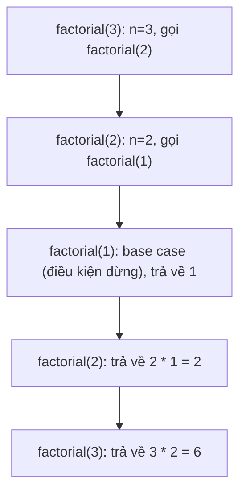

# Chương 2: Toán học nền tảng & Kiến thức bổ trợ (Mathematics & Prerequisites)

Chương này trang bị các kiến thức toán học và kỹ thuật lập trình nền tảng cực kỳ quan trọng cho cấu trúc dữ liệu và giải thuật bao gồm: Đệ quy, Thuật toán quay lui, Toán học rời rạc và Xử lý bit. Mỗi phần đều được trình bày cô đọng để làm rõ bản chất **là gì (What)** và **khi nào nên áp dụng (When to use)** nhằm hỗ trợ tối đa cho quá trình giải quyết bài toán.

---

## 1. Khái niệm cơ bản về Đệ quy (Recursion Basics)

**Bản chất (What)**: Đệ quy là việc một hàm tự gọi chính nó để giải quyết một phiên bản nhỏ hơn của cùng một bài toán đó.

**Khi nào nên áp dụng**:
- Các bài toán có cấu trúc con tối ưu, có thể được phân chia thành các bài toán con nhỏ hơn có tính chất tương tự (mô hình Chia để trị - divide & conquer).
- Duyệt các cấu trúc dữ liệu dạng phân cấp như Cây và Đồ thị (Duyệt theo chiều sâu DFS, các thao tác trên cây nhị phân).
- Thuật toán Quay lui (Backtracking - tìm kiếm trên cây quyết định).
- Các dãy số toán học được định nghĩa bằng công thức truy hồi (giai thừa, dãy Fibonacci).
- Phân tích cú pháp của các cấu trúc dữ liệu lồng nhau phức tạp (JSON, XML, danh sách lồng nhau).

### 1.1 Các thành phần cốt lõi của Đệ quy
- **Điều kiện dừng / Trường hợp cơ sở (Base case)**: Điểm kết thúc tiến trình đệ quy; đây là phiên bản bài toán nhỏ nhất có thể tìm ra ngay kết quả trực tiếp mà không cần đệ quy tiếp.
- **Bước đệ quy (Recursive case)**: Hàm tự gọi chính nó với dữ liệu đầu vào đã được thu hẹp hoặc thay đổi, hướng dần về phía điều kiện dừng.
- **Ngăn xếp gọi hàm (Call stack)**: Ngăn xếp được hệ thống quản lý tự động nhằm lưu trữ các biến cục bộ, tham số truyền vào và địa chỉ trả về của từng lời gọi hàm đệ quy đang hoạt động.

**Phép so sánh trong thế giới thực**: Búp bê Nga (Matryoshka) – bạn mở búp bê lớn bên ngoài để lấy búp bê nhỏ hơn bên trong (quá trình đi xuống đệ quy - recursive descent), sau đó đóng chúng lại theo chiều ngược lại trên đường trở ra (quá trình trả về kết quả - returns).

### 1.2 Ví dụ kinh điển: Tính giai thừa
```cpp
int factorial(int n) {
    if (n <= 1) return 1;          // Điều kiện dừng (Base case)
    return n * factorial(n - 1);   // Bước đệ quy (Recursive case)
}
```

### 1.3 Minh họa Ngăn xếp gọi hàm (khi tính `factorial(3)`)



### 1.4 Khi nào nên tránh sử dụng Đệ quy
- **Đệ quy quá sâu (Deep recursion)** (ví dụ: số lần gọi đệ quy vượt quá $10^5$) có nguy cơ gây ra lỗi tràn bộ đệm ngăn xếp gọi hàm (Stack overflow) $\rightarrow$ nên chuyển sang phiên bản sử dụng vòng lặp (iteration) thông thường.
- **Trùng lặp tính toán quá lớn** (như tính dãy Fibonacci bằng đệ quy thô sơ) $\rightarrow$ nên kết hợp kỹ thuật lưu trữ đệm (memoisation) hoặc chuyển sang dùng vòng lặp Quy hoạch động.
- **Hệ thống thời gian thực khắt khe về hiệu năng** $\rightarrow$ việc sử dụng vòng lặp sẽ tránh được các chi phí phụ (overhead) liên quan đến việc cấp phát ngăn xếp gọi hàm.

---

## 2. Nguyên lý của Thuật toán quay lui (Backtracking Principles)

**Bản chất (What)**: Thuật toán quay lui là phương pháp tìm kiếm bằng cách thử và sai (trial-and-error) một cách hệ thống, xây dựng dần các thành phần của nghiệm và chủ động hủy bỏ (quay lui - backtrack) các nghiệm trung gian vi phạm các điều kiện ràng buộc của bài toán.

**Khi nào nên áp dụng**:
- Các bài toán tìm kiếm tổ hợp: sinh các tập con, sinh hoán vị, tổ hợp.
- Các bài toán thỏa mãn ràng buộc phức tạp: bài toán Tám quân hậu (N-Queens), giải đố Sudoku, giải ô chữ.
- Tìm kiếm đường đi trong mê cung hoặc trên đồ thị (có áp dụng cắt tỉa nhánh cận).
- Sinh ra tất cả các cấu hình hợp lệ (ví dụ: sinh cặp dấu ngoặc hợp lệ, sinh tổ hợp phím).

### 2.1 Mã giả khung mẫu Quay lui
```
void backtrack(state, choices):
    if is_goal(state): 
        record(state)
        return
    for each choice in choices:
        if is_valid(state + choice):
            make_choice(choice)                // Chọn
            backtrack(state + choice, new_choices) // Đệ quy bước tiếp theo
            undo_choice(choice)                // Quay lui (Quay xe)
```

**Phép so sánh trong thế giới thực**: Đi tìm lối thoát trong mê cung – đi theo một con đường; nếu gặp ngõ cụt, bạn quay trở lại ngã rẽ gần nhất và thử đi theo một hướng mới khác.

### 2.2 Ví dụ: Sinh tất cả các tập con của một tập hợp (Subsets)
```cpp
void generateSubsets(vector<int>& nums, int index, vector<int>& current, vector<vector<int>>& result) {
    result.push_back(current);                     // Lưu cấu hình tập con hiện tại
    for (int i = index; i < nums.size(); ++i) {
        current.push_back(nums[i]);                // Chọn (Choose)
        generateSubsets(nums, i + 1, current, result); // Đệ quy tiếp tục
        current.pop_back();                        // Quay lui (Backtrack)
    }
}
```
- **Độ phức tạp thời gian**: $O(2^n)$
- **Độ phức tạp không gian**: $O(n)$ (Độ sâu tối đa của ngăn xếp đệ quy)

### 2.3 Khi nào Quay lui kém hiệu quả
- Không gian tìm kiếm quá rộng lớn mà không có các điều kiện cắt tỉa (pruning) hiệu quả (ví dụ: duyệt hoán vị của 50 phần tử là điều bất khả thi).
- Bài toán có cấu trúc con tối ưu và các bài toán con trùng lặp $\rightarrow$ tiếp cận bằng Quy hoạch động (Dynamic Programming) sẽ tối ưu hơn (ví dụ: tìm đường đi ngắn nhất trên đồ thị có hướng không chu trình).

---

## 3. Kiến thức Toán học nền tảng (Mathematical Foundations)

### 3.1 Phép Lô-ga-rít và Lũy thừa (Logarithms and Exponents)

**Định nghĩa**: $\log_b a = c \iff b^c = a$. Trong Khoa học Máy tính, cơ số mặc định thường là cơ số 2 ($\log_2 n$, viết tắt là $\log n$).

**Khi nào nên áp dụng**:
- **Phân tích độ phức tạp**: Lớp $O(\log n)$ xuất hiện trong thuật toán tìm kiếm nhị phân, thao tác trên cây BST cân bằng, đống nhị phân (heaps).
- **Mô hình Chia để trị**: Các thuật toán liên tục chia đôi kích thước đầu vào (như sắp xếp trộn merge sort, sắp xếp nhanh quick sort trong trường hợp trung bình).
- **Tính toán lũy thừa cực nhanh**: Thuật toán lũy thừa nhị phân.

**Đặc tính toán học cốt lõi**: $\log_b (xy) = \log_b x + \log_b y$.

**Phép so sánh trong thế giới thực**: Gấp đôi một tờ giấy liên tục – số lần gấp tối thiểu để độ dày tờ giấy đạt tới chiều dài cho trước chính là $\log_2(\text{chiều dài})$.

### 3.2 Tổng và Chuỗi cấp số (Summations and Series)

**Định nghĩa**: Cách biểu diễn toán học cô đọng của chi phí thực thi vòng lặp hoặc đệ quy.

| Dạng chuỗi | Công thức toán học | Ứng dụng tiêu biểu |
| :--- | :--- | :--- |
| **Cấp số cộng** (Arithmetic) | $\sum_{i=1}^{n} i = \frac{n(n+1)}{2}$ | Vòng lặp lồng nhau, phân tích lớp độ phức tạp $O(n^2)$ |
| **Cấp số nhân** (Geometric) | $\sum_{i=0}^{n} 2^i = 2^{n+1}-1$ | Giải thuật lũy thừa, đệ quy phân nhánh nhị phân |
| **Chuỗi điều hòa** (Harmonic) | $\sum_{i=1}^{n} \frac{1}{i} \approx \ln n$ | Phân tích trường hợp trung bình của sắp xếp nhanh, cân bằng tải |

**Khi nào nên áp dụng**: Sử dụng để tính toán chính xác độ phức tạp từ cấu trúc vòng lặp hoặc giải phương trình truy hồi đệ quy.

### 3.3 Chỉnh hợp và Tổ hợp (Permutations and Combinations)

**Định nghĩa**:
- **Chỉnh hợp** (có quan tâm đến thứ tự): $P(n,k) = \frac{n!}{(n-k)!}$
- **Tổ hợp** (không quan tâm đến thứ tự): $\binom{n}{k} = \frac{n!}{k!(n-k)!}$

**Khi nào nên áp dụng**:
- Đánh giá giới hạn trên trong duyệt thô sơ: bài toán người đi du lịch TSP có giới hạn $O(n!)$, bài toán sinh tập con có giới hạn $O(2^n)$.
- Tính toán xác suất trong các giải thuật ngẫu nhiên (ví dụ: sinh hoán vị ngẫu nhiên).
- Đếm số lượng trạng thái trong các bài toán Quy hoạch động.

### 3.4 Số học Mô-đun (Modular Arithmetic)

**Định nghĩa**: Phép toán số học lấy phần dư của số sau khi chia cho một mô-đun $m$.

**Khi nào nên áp dụng**:
- **Bảng băm (Hash Tables)**: Áp dụng phép chia dư modulo để ánh xạ khóa băm vào chỉ số index của mảng lưu trữ.
- **Mật mã học**: Các thuật toán mã hóa như RSA, Diffie-Hellman (lũy thừa mô-đun).
- **Tránh tràn số (Integer Overflow)**: Khi nhân hoặc cộng các số cực lớn, ta liên tục lấy modulo tại mỗi bước trung gian.
- **Lập trình thi đấu (Competitive programming)**: Rất nhiều bài toán yêu cầu trả về kết quả dưới dạng phần dư cho số nguyên tố lớn như $10^9+7$ hoặc $998244353$.

**Thuật toán lũy thừa mô-đun nhanh (Lũy thừa nhị phân)** – Độ phức tạp $O(\log \text{exp})$:
```cpp
long long modPow(long long base, long long exp, long long mod) {
    long long result = 1;
    base %= mod;
    while (exp) {
        if (exp & 1) result = (result * base) % mod; // Nếu bit cuối của exp là 1
        base = (base * base) % mod;
        exp >>= 1; // Dịch phải exp tương đương exp /= 2
    }
    return result;
}
```

### 3.5 Số nguyên tố và Ước chung lớn nhất (Prime Numbers and GCD)

**Định nghĩa**:
- **Số nguyên tố (Prime)**: Số nguyên dương $> 1$ chỉ chia hết cho 1 và chính nó.
- **Ước chung lớn nhất (GCD)**: Số nguyên dương lớn nhất chia hết cho cả hai số nguyên cho trước.

**Khi nào nên áp dụng**:
- **Số nguyên tố**: Lựa chọn kích thước cho bảng băm (giúp giảm thiểu tối đa đụng độ băm), sinh khóa mật mã học RSA, kiểm tra tính nguyên tố.
- **GCD**: Rút gọn phân số, tính Bội chung nhỏ nhất LCM ($\text{lcm}(a,b) = \frac{a \cdot b}{\gcd(a,b)}$), mật mã học, bài toán tính chu kỳ lặp.

**Thuật toán Euclid tìm UCLN** – Độ phức tạp $O(\log \min(a,b))$:
```cpp
int gcd(int a, int b) {
    while (b) { 
        int t = b; 
        b = a % b; 
        a = t; 
    }
    return a;
}
```

---

## 4. Các phép thao tác Bit (Bit Manipulation)

**Bản chất (What)**: Thao tác trực tiếp trên biểu diễn nhị phân của dữ liệu bằng cách sử dụng các toán tử bitwise của CPU.

**Khi nào nên áp dụng**:
- **Tối ưu hóa hiệu năng cực cao**: Các phép toán bitwise cực kỳ nhanh vì được thực thi trực tiếp bằng một lệnh duy nhất của CPU.
- **Nén trạng thái (State compression)**: Lưu trữ nhiều cờ Boolean (đúng/sai) vào trong một số nguyên duy nhất (sử dụng cờ bitmask trong Quy hoạch động trạng thái).
- **Liệt kê tất cả các tập con**: Duyệt qua mọi tập con của một tập hợp bằng cách lặp mặt nạ bit từ $0$ tới $2^n-1$.
- **Lập trình hệ thống cấp thấp**: Trình điều khiển thiết bị (drivers), hệ thống nhúng, giao thức truyền tin qua mạng.

### 4.1 Bảng tra cứu các toán tử Bitwise
| Toán tử | Ký hiệu | Ý nghĩa và tác động |
| :--- | :--- | :--- |
| **AND** | `&` | Trả về 1 nếu cả hai bit đều là 1 |
| **OR** | `|` | Trả về 1 nếu ít nhất một trong hai bit là 1 |
| **XOR** | `^` | Trả về 1 nếu hai bit khác nhau |
| **NOT** | `~` | Đảo ngược toàn bộ các bit (0 thành 1, 1 thành 0) |
| **Dịch trái** | `<<` | Dịch toàn bộ bit sang trái, điền thêm 0 ở bên phải (tương đương nhân lũy thừa của 2) |
| **Dịch phải** | `>>` | Dịch toàn bộ bit sang phải (tương đương chia lũy thừa của 2) |

### 4.2 Các mẹo thao tác Bit kinh điển và ứng dụng
| Thủ thuật bit | Đoạn mã C++ | Ứng dụng thực tế |
| :--- | :--- | :--- |
| **Kiểm tra lũy thừa của 2** | `n && !(n & (n-1))` | Kiểm tra căn lề bộ nhớ, chọn kích thước bảng băm |
| **Bật bit thứ $k$** | `n |= (1 << k)` | Đánh dấu phần tử đã được chọn / xuất hiện |
| **Tắt bit thứ $k$** | `n &= ~(1 << k)` | Hủy bỏ đánh dấu phần tử |
| **Đảo ngược bit thứ $k$** | `n ^= (1 << k)` | Đảo ngược cờ trạng thái |
| **Kiểm tra bit thứ $k$** | `(n >> k) & 1` | Kiểm tra sự tồn tại của phần tử trong tập hợp |
| **Đếm số bit 1** (Kernighan) | `while(n) { n &= n-1; count++; }` | Đếm trọng số Hamming, tính bit chẵn lẻ |
| **Tách bit 1 thấp nhất** | `n & -n` | Sử dụng trong các cấu trúc cây nâng cao như cây Fenwick |
| **Hoán vị hai số không dùng biến phụ** | `a ^= b; b ^= a; a ^= b;` | Tối ưu không gian (tuy nhiên làm giảm độ đọc hiểu mã nguồn) |

**Ví dụ: Sinh tất cả các tập con của một tập hợp bằng Bitmask**
```cpp
int n = 3;  // Tập hợp có 3 phần tử đại diện là 0, 1, 2
for (int mask = 0; mask < (1 << n); ++mask) {
    // Các bit có giá trị 1 trong biến mask biểu diễn các phần tử có mặt trong tập con
    for (int i = 0; i < n; ++i) {
        if (mask & (1 << i)) {
            cout << i << " ";
        }
    }
    cout << endl;
}
```

---

## 5. Bảng tổng hợp

| Chủ đề | Khái niệm cốt lõi | Khi nào nên áp dụng |
| :--- | :--- | :--- |
| **Đệ quy** | Hàm tự gọi chính nó | Chia để trị, duyệt cây/đồ thị, thuật toán quay lui |
| **Quay lui** | Tìm kiếm thử và sai kèm cắt tỉa | Tìm kiếm tổ hợp cấu hình, thỏa mãn ràng buộc |
| **Lô-ga-rít** | Phép toán ngược của lũy thừa | Phân tích độ phức tạp $O(\log n)$, thuật toán chia đôi |
| **Tổng chuỗi** | Biểu diễn toán học của vòng lặp | Phân tích vòng lặp lồng nhau, giải phương trình truy hồi |
| **Tổ hợp / Chỉnh hợp** | Lựa chọn có/không thứ tự | Đánh giá cận trên của duyệt thô sơ, xác suất |
| **Số học mô-đun** | Phép toán phần dư | Bảng băm, mật mã học, phòng ngừa tràn số nguyên |
| **Số nguyên tố & UCLN** | Tính chia hết cơ bản | Chọn kích thước băm, mật mã học, rút gọn phân số |
| **Thao tác Bit** | Các phép toán nhị phân trực tiếp | Nén trạng thái, duyệt tập con, tối ưu hóa tốc độ cực hạn |

Chương tiếp theo sẽ đi sâu vào việc phân tích các giải thuật đệ quy phức tạp bằng cách sử dụng các phương trình truy hồi, Định lý thợ (Master Theorem) và giới thiệu các công cụ toán học nâng cao trong thiết kế giải thuật.
