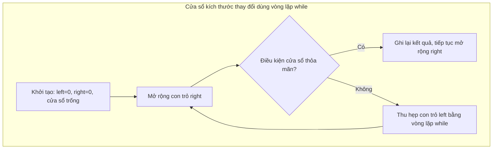
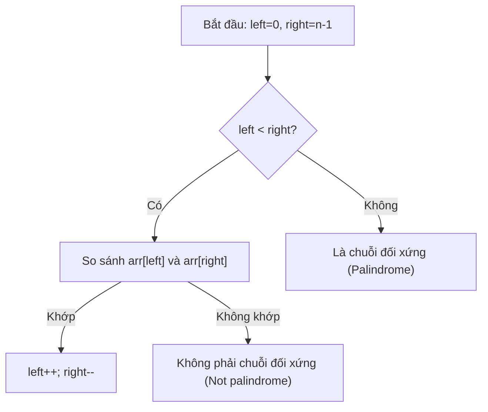

# Chương 3: Mảng và Chuỗi ký tự (Arrays and Strings)

Chương này trang bị kiến thức về các cấu trúc dữ liệu tuyến tính cơ bản: Mảng và Chuỗi ký tự. Chương học sẽ giới thiệu các kỹ thuật giải thuật cực kỳ quan trọng và phổ biến trong phỏng vấn tuyển dụng bao gồm: Cửa sổ trượt (Sliding window), Hai con trỏ (Two pointers), Mảng cộng dồn/tiền tố (Prefix sums), Mảng hiệu (Difference arrays), các thuật toán so khớp mẫu (Pattern matching), đi kèm các bài toán kinh điển giúp làm sáng tỏ các khái niệm này.

---

## 1. Mảng (Arrays)

Mảng là một khối bộ nhớ liên tục lưu trữ các phần tử có cùng kiểu dữ liệu, cho phép truy xuất trực tiếp phần tử thông qua chỉ số (index) với độ phức tạp thời gian hằng số $O(1)$.

### 1.1 Mảng một chiều và Mảng nhiều chiều

**Bản chất (What)**: Tập hợp tuyến tính các phần tử (1D) hoặc một lưới tọa độ các phần tử (2D, 3D, v.v.).

**Khi nào nên áp dụng**:
- **Mảng 1D**: Lưu trữ chuỗi dữ liệu tuần tự (danh sách điểm số, lịch sử nhiệt độ, danh sách ID).
- **Mảng 2D**: Biểu diễn ma trận, bảng chơi game (bàn cờ vua, cờ ca-rô), lưới điểm ảnh (pixels), bảng lưu trạng thái Quy hoạch động.

**Mảng tĩnh so với Mảng động**:
- **Mảng tĩnh (Static array)**: Có kích thước cố định được xác định ngay tại thời điểm biên dịch chương trình (ví dụ trong C++: `int arr[100];`).
- **Mảng động (Dynamic array)**: Tự động thay đổi kích thước linh hoạt khi thêm phần tử (ví dụ trong C++: `std::vector<T>`).

**Ví dụ khai báo mảng 2D bằng vector trong C++**:
```cpp
#include <vector>
using namespace std;
vector<vector<int>> matrix(rows, vector<int>(cols, 0));
```

### 1.2 Mảng động (std::vector trong C++)

**Bản chất (What)**: Một cấu trúc chứa mảng có thể thay đổi kích thước linh hoạt và tự động quản lý vùng nhớ.

**Khi nào nên áp dụng**: Khi số lượng phần tử chưa được xác định trước tại thời điểm biên dịch hoặc thay đổi liên tục trong quá trình chạy chương trình.

**Các đặc tính tối ưu**:
- Chi phí thêm phần tử ở cuối `push_back` đạt độ phức tạp phân bổ tiệm cận $O(1)$ (Amortized O(1) - thỉnh thoảng hệ thống mới cần tái cấp phát bộ nhớ mới khi mảng đầy).
- Truy xuất ngẫu nhiên phần tử bất kỳ bằng chỉ số đạt $O(1)$.
- Chèn hoặc xóa phần tử ở vị trí bất kỳ mất $O(n)$ do phải dịch chuyển các phần tử phía sau.

```cpp
vector<int> v;
v.push_back(10);  // Độ phức tạp phân bổ O(1)
v.pop_back();     // Loại bỏ phần tử cuối mất O(1)
```

### 1.3 Bảng tổng hợp các thao tác cơ bản trên mảng

| Thao tác | Đoạn mã C++ tiêu biểu | Độ phức tạp thời gian |
| :--- | :--- | :--- |
| **Duyệt mảng** (Traversal) | `for (int x : arr) {}` | $O(n)$ |
| **Truy cập theo chỉ số** | `arr[i]` | $O(1)$ |
| **Thêm ở cuối** | `arr.push_back(x)` | Phân bổ $O(1)$ (Amortized) |
| **Chèn tại vị trí $i$** | `arr.insert(arr.begin()+i, val)` | $O(n)$ |
| **Xóa tại vị trí $i$** | `arr.erase(arr.begin()+i)` | $O(n)$ |
| **Tìm kiếm tuyến tính** | `find(arr.begin(), arr.end(), val)` | $O(n)$ |
| **Tìm kiếm nhị phân** (mảng đã sắp xếp) | `binary_search(arr.begin(), arr.end(), val)` | $O(\log n)$ |

---

### 1.4 Mảng cộng dồn / Mảng tiền tố (Prefix Sum Array)

**Bản chất (What)**: Một mảng phụ trợ `prefix` lưu trữ tổng lũy kế, trong đó `prefix[i] = sum(arr[0..i-1])` (tổng từ phần tử đầu tiên đến phần tử đứng trước $i$).

**Khi nào nên áp dụng**: Khi cần trả lời liên tục nhiều truy vấn tính tổng của một đoạn chập từ chỉ số $l$ đến $r$ (`sum(l..r)`) một cách hiệu quả.

**Cách xây dựng mảng tiền tố**:
```cpp
vector<int> prefix(n + 1, 0);
for (int i = 0; i < n; ++i) {
    prefix[i+1] = prefix[i] + arr[i];
}
// Để tính tổng đoạn từ l đến r (bao gồm cả hai): prefix[r+1] - prefix[l]
```

**Phép so sánh trong thế giới thực**: Hóa đơn tiền điện nước cộng dồn. Để tính số tiền bạn tiêu thụ trong khoảng từ tháng 3 đến tháng 6, bạn chỉ cần lấy số tổng cộng dồn tính đến hết tháng 6 trừ đi số tổng cộng dồn tính đến hết tháng 2.

---

### 1.5 Mảng hiệu (Difference Array)

**Bản chất (What)**: Một mảng phụ trợ `diff` thỏa mãn công thức `diff[i] = arr[i] - arr[i-1]` (với phần tử đầu tiên `diff[0] = arr[0]`). Mảng hiệu hỗ trợ thao tác cập nhật giá trị một đoạn (range updates) với độ phức tạp siêu tốc $O(1)$.

**Khi nào nên áp dụng**: Khi cần thực hiện hàng loạt thao tác cộng/trừ một lượng giá trị $k$ trên các khoảng $[l..r]$ khác nhau, và chỉ cần đọc ra mảng kết quả cuối cùng một lần duy nhất ở cuối chương trình.

**Cách vận hành**: Để cộng lượng giá trị `k` vào đoạn `arr[l..r]`, ta chỉ cần thực hiện hai thao tác đơn giản: `diff[l] += k;` và `diff[r+1] -= k;` (nếu chỉ số $r+1 < n$). Sau khi hoàn tất tất cả các truy vấn cập nhật đoạn, ta khôi phục lại mảng `arr` ban đầu bằng cách tính tổng tiền tố (prefix sum) trên mảng hiệu `diff`.

```cpp
vector<int> diff(n, 0);
// Truy vấn cập nhật đoạn: cộng k vào các phần tử từ l đến r
diff[l] += k;
if (r + 1 < n) {
    diff[r+1] -= k;
}

// Khôi phục lại mảng kết quả cuối cùng
vector<int> result(n);
result[0] = diff[0];
for (int i = 1; i < n; ++i) {
    result[i] = result[i-1] + diff[i];
}
```

---

## 2. Kỹ thuật Cửa sổ trượt (Sliding Window Technique)

**Bản chất (What)**: Duy trì một tập hợp con liên tục (gọi là "cửa sổ") gồm các phần tử trong mảng. Cửa sổ này sẽ tự động mở rộng hoặc thu hẹp khi chúng ta duyệt tuyến tính qua mảng. Mỗi phần tử chỉ đi vào và đi ra khỏi cửa sổ tối đa đúng 1 lần.

**Khi nào nên áp dụng**: Giải quyết các bài toán về mảng con (subarray) hoặc chuỗi con (substring) liên tục, yêu cầu tìm kiếm hoặc tính toán các đặc tính tối ưu trên các đoạn liên tục có kích thước cố định hoặc thay đổi.

**Tại sao việc kết hợp vòng lặp while lại rất tự nhiên**: Đối với cửa sổ có kích thước thay đổi, con trỏ bên trái (`left`) có thể cần dịch chuyển thu hẹp nhiều bước liên tục miễn là một điều kiện ràng buộc nào đó bị vi phạm. Vòng lặp `while` giúp biểu thị hành vi thu hẹp này một cách rõ ràng và trực quan nhất.

### 2.1 Cửa sổ có kích thước cố định (Fixed‑Size Window)

**Bài toán mẫu**: Tìm tổng lớn nhất của bất kỳ mảng con liên tục nào có kích thước đúng bằng $k$.

```cpp
int maxSumFixed(vector<int>& arr, int k) {
    int sum = 0;
    for (int i = 0; i < k; ++i) sum += arr[i]; // Khởi tạo tổng của cửa sổ đầu tiên
    int maxSum = sum;
    for (int i = k; i < arr.size(); ++i) {
        sum += arr[i] - arr[i - k]; // Dịch cửa sổ sang phải: thêm phần tử mới, bỏ phần tử cũ ở đầu
        maxSum = max(maxSum, sum);
    }
    return maxSum;
}
```
- **Độ phức tạp thời gian**: $O(n)$
- **Độ phức tạp không gian**: $O(1)$

### 2.2 Cửa sổ có kích thước thay đổi (Variable‑Size Window)

**Bài toán mẫu**: Tìm chuỗi con dài nhất không chứa các ký tự trùng lặp.

**Ý tưởng**: Mở rộng con trỏ bên phải (`right`) để nạp thêm ký tự mới vào cửa sổ và sử dụng bảng tần suất để đánh dấu. Nếu phát hiện ký tự trùng lặp xuất hiện trong cửa sổ, ta thực hiện thu hẹp dần con trỏ bên trái (`left`) cho đến khi ký tự trùng lặp đó bị loại bỏ hoàn toàn ra khỏi cửa sổ.

```cpp
int longestUniqueSubstr(string s) {
    vector<int> lastIndex(256, -1);   // Lưu chỉ số xuất hiện cuối cùng của mỗi ký tự
    int left = 0, maxLen = 0;
    for (int right = 0; right < s.size(); ++right) {
        // Nếu ký tự hiện tại nằm trong cửa sổ hiện tại, dịch con trỏ left vượt qua vị trí trùng lặp
        if (lastIndex[s[right]] >= left) {
            left = lastIndex[s[right]] + 1;
        }
        lastIndex[s[right]] = right;
        maxLen = max(maxLen, right - left + 1);
    }
    return maxLen;
}
```

**Cách viết khác sử dụng vòng lặp while tường minh**:
```cpp
int longestUniqueSubstr(string s) {
    vector<int> freq(256, 0);   // Tần suất xuất hiện của ký tự trong cửa sổ hiện tại
    int left = 0, right = 0, maxLen = 0;
    while (right < s.size()) {
        char c = s[right];
        freq[c]++;
        // Thu hẹp cửa sổ từ phía bên trái cho đến khi ký tự c trở thành duy nhất
        while (freq[c] > 1) {
            freq[s[left]]--;
            left++;
        }
        maxLen = max(maxLen, right - left + 1);
        right++;
    }
    return maxLen;
}
```
- **Độ phức tạp thời gian**: $O(n)$ vì mỗi ký tự chỉ đi vào và đi ra khỏi cửa sổ tối đa 1 lần.

**Phép so sánh trong thế giới thực**: Khung soi hàng trên băng chuyền sản xuất. Bạn có thể kéo trượt một khung có kích thước cố định (fixed window) hoặc thay đổi độ rộng của khung để chứa được tối đa các sản phẩm hợp quy chuẩn nằm cạnh nhau (variable window).

**Minh họa luồng hoạt động của Cửa sổ trượt thay đổi kích thước**:



---

## 3. Kỹ thuật Hai con trỏ (Two Pointers Technique)

**Bản chất (What)**: Sử dụng đồng thời hai biến chỉ số (con trỏ) để duyệt qua cấu trúc mảng, chúng có thể di chuyển ngược chiều nhau (đối nhau) hoặc di chuyển cùng chiều với tốc độ khác nhau (nhanh & chậm).

**Khi nào nên áp dụng**:
- **Di chuyển ngược chiều**: Bài toán tìm hai số có tổng bằng $K$ trên mảng đã sắp xếp, kiểm tra chuỗi đối xứng palindrome, tính toán lượng nước mưa hứng được.
- **Di chuyển cùng chiều**: Gộp hai mảng đã sắp xếp, loại bỏ các phần tử trùng lặp tại chỗ, phân hoạch phần tử.

### 3.1 Con trỏ di chuyển ngược chiều (Opposite Direction)

**Ví dụ**: Kiểm tra chuỗi ký tự đối xứng (Palindrome).

```cpp
bool isPalindrome(string s) {
    int left = 0, right = s.size() - 1;
    while (left < right) {
        if (s[left] != s[right]) return false;
        left++; 
        right--;
    }
    return true;
}
```



### 3.2 Con trỏ di chuyển cùng chiều (Same Direction / Fast & Slow)

**Ví dụ**: Loại bỏ các phần tử trùng lặp khỏi mảng đã được sắp xếp tại chỗ (in-place).

```cpp
int removeDuplicates(vector<int>& nums) {
    if (nums.empty()) return 0;
    int slow = 0;
    for (int fast = 1; fast < nums.size(); ++fast) {
        if (nums[fast] != nums[slow]) {
            nums[++slow] = nums[fast]; // Dịch chuyển phần tử độc nhất lên đầu
        }
    }
    return slow + 1; // Số lượng phần tử độc nhất
}
```

---

## 4. Chuỗi ký tự (Strings)

Chuỗi ký tự là một chuỗi tuần tự của các ký tự. Trong C++, `std::string` là đối tượng có thể thay đổi dữ liệu trực tiếp (mutable), tuy nhiên các thao tác nối chuỗi có thể kích hoạt cấp phát lại vùng nhớ mới.

### 4.1 Tính bất biến của chuỗi và các lớp xây dựng chuỗi tối ưu

Trong một số ngôn ngữ lập trình (như Java, Python), chuỗi ký tự là bất biến (immutable - không thể thay đổi dữ liệu gốc). Tuy nhiên, trong C++, chuỗi có tính khả biến (mutable). Mặc dù vậy, việc lặp đi lặp lại phép toán nối chuỗi bằng `+` hoặc `+=` vẫn làm tiêu tốn thời gian và gây phân mảnh bộ nhớ do hệ thống liên tục cấp phát lại.

**Giải pháp tối ưu**: Sử dụng hàm thành viên `reserve()` để phân bổ trước dung lượng bộ nhớ cần thiết nếu biết trước độ dài chuỗi, hoặc sử dụng lớp dòng luồng `std::stringstream`.

```cpp
string buildString(int n) {
    string result;
    result.reserve(n * 2);   // Cấp phát trước dung lượng để tránh cấp phát lại nhiều lần
    for (int i = 0; i < n; ++i) {
        result += "ab";
    }
    return result;
}
```

---

### 4.2 Các thuật toán so khớp mẫu (Pattern Matching Algorithms)

#### Tìm kiếm thô sơ (Naive Search)
**Ý tưởng**: Trượt mẫu thử (pattern) qua văn bản gốc (text) tại từng vị trí chỉ số và tiến hành so sánh từng ký tự một từ trái qua phải.
- **Độ phức tạp thời gian**: Trong trường hợp xấu nhất đạt $O(n \cdot m)$ (với $n$ là chiều dài văn bản, $m$ là chiều dài mẫu).

```cpp
int naiveSearch(string text, string pattern) {
    int n = text.size(), m = pattern.size();
    for (int i = 0; i <= n - m; ++i) {
        int j;
        for (j = 0; j < m; ++j) {
            if (text[i+j] != pattern[j]) break;
        }
        if (j == m) return i; // Tìm thấy mẫu tại chỉ số i
    }
    return -1;
}
```

#### Thuật toán KMP (Knuth‑Morris‑Pratt)
**Ý tưởng**: Xây dựng mảng phụ trợ tiền tố-hậu tố dài nhất trùng nhau LPS (Longest Proper Prefix‑Suffix) dựa trên mẫu thử. Khi xảy ra sự cố không khớp ký tự trong quá trình tìm kiếm, KMP sử dụng thông tin từ mảng LPS để trượt thông minh bỏ qua các ký tự đã khớp trước đó, tránh việc quét lại từ đầu.
- **Độ phức tạp thời gian**: $O(n + m)$
- **Độ phức tạp không gian**: $O(m)$
- **Khi nào nên áp dụng**: Quét chuỗi trên các văn bản cực kỳ lớn, đặc biệt khi cấu trúc chuỗi mẫu có nhiều ký tự trùng lặp tuần hoàn.

**Xây dựng mảng LPS**:
```cpp
vector<int> buildLPS(string pat) {
    int m = pat.size();
    vector<int> lps(m, 0);
    int len = 0, i = 1;
    while (i < m) {
        if (pat[i] == pat[len]) {
            lps[i++] = ++len;
        } else if (len) {
            len = lps[len-1];
        } else {
            lps[i++] = 0;
        }
    }
    return lps;
}
```

**Phép so sánh trong thế giới thực**: Khi bạn tìm kiếm một từ trong sách, nếu bạn đã khớp được các chữ đầu (ví dụ: "chương tr..."), và chữ tiếp theo bị sai lệch, bạn không cần lùi lại để đọc từ chữ đầu tiên của từ kế tiếp, mà trượt tới đoạn phù hợp nhất dựa trên những chữ đã đọc được.

#### Thuật toán Rabin‑Karp (Rolling Hash)
**Ý tưởng**: Sử dụng một hàm băm cuốn (polynomial rolling hash) để tính giá trị băm của chuỗi con trong văn bản và so sánh với giá trị băm của mẫu thử trong thời gian trung bình $O(1)$. Chỉ khi giá trị băm trùng khớp, thuật toán mới tiến hành so sánh chi tiết từng ký tự để loại trừ va chạm băm.
- **Độ phức tạp thời gian**: Trung bình đạt $O(n + m)$, trường hợp xấu nhất đạt $O(n \cdot m)$ nếu xảy ra nhiều va chạm băm.
- **Độ phức tạp không gian**: $O(1)$
- **Khi nào nên áp dụng**: Phù hợp cho các bài toán tìm kiếm đồng thời nhiều chuỗi mẫu, phát hiện đạo văn, và tránh chi phí hằng số lớn của thuật toán KMP.

```cpp
#define MOD 1000000007
#define BASE 256

int rabinKarp(string text, string pattern) {
    int n = text.size(), m = pattern.size();
    if (m > n) return -1;
    long long pHash = 0, tHash = 0, pow = 1;
    for (int i = 0; i < m; ++i) {
        pHash = (pHash * BASE + pattern[i]) % MOD;
        tHash = (tHash * BASE + text[i]) % MOD;
        pow = (pow * BASE) % MOD;
    }
    for (int i = 0; i <= n - m; ++i) {
        if (pHash == tHash) {
            bool match = true;
            for (int j = 0; j < m; ++j) {
                if (text[i+j] != pattern[j]) { 
                    match = false; 
                    break; 
                }
            }
            if (match) return i;
        }
        if (i < n - m) {
            tHash = (tHash * BASE - text[i] * pow + text[i+m]) % MOD;
            if (tHash < 0) tHash += MOD;
        }
    }
    return -1;
}
```

---

### 4.3 Các bài toán hoán vị và đối xứng (Anagram & Palindrome)

**Chuỗi hoán vị (Anagram)**: Hai chuỗi ký tự được coi là hoán vị của nhau nếu chúng có cùng chính xác tần suất xuất hiện của các ký tự.
- **Giải pháp 1**: Sắp xếp hai chuỗi và so sánh bằng nhau $\rightarrow$ Độ phức tạp $O(n \log n)$.
- **Giải pháp 2**: Sử dụng mảng lưu tần suất có kích thước 256 (bảng mã ASCII) $\rightarrow$ Độ phức tạp tối ưu $O(n)$.

```cpp
bool isAnagram(string s1, string s2) {
    if (s1.length() != s2.length()) return false;
    vector<int> count(256, 0);
    for (char c : s1) count[c]++;
    for (char c : s2) {
        if (--count[c] < 0) return false;
    }
    return true;
}
```

**Chuỗi đối xứng (Palindrome)**: Chuỗi đọc xuôi hay đọc ngược đều cho ra kết quả giống hệt nhau.
- **Kiểm tra**: Áp dụng kỹ thuật hai con trỏ di chuyển ngược chiều (phần 3.1). Để tìm kiếm chuỗi đối xứng dài nhất, ta có thể áp dụng thuật toán mở rộng từ tâm (expand around center) với độ phức tạp $O(n^2)$.

---

## 5. Các bài toán kinh điển (Important Problems)

### 5.1 Thuật toán Kadane (Tìm phân mảnh con có tổng lớn nhất - Maximum Subarray Sum)

**Bản chất (What)**: Thuật toán Quy hoạch động tối ưu hóa việc lưu giữ tổng lớn nhất kết thúc tại mỗi vị trí phần tử.

**Khi nào nên áp dụng**: Tìm một mảng con liên tục có tổng các phần tử lớn nhất (mảng có thể chứa cả số âm).

```cpp
int maxSubarraySum(vector<int>& arr) {
    int maxSoFar = arr[0], maxEndingHere = arr[0];
    for (int i = 1; i < arr.size(); ++i) {
        maxEndingHere = max(arr[i], maxEndingHere + arr[i]);
        maxSoFar = max(maxSoFar, maxEndingHere);
    }
    return maxSoFar;
}
```
- **Độ phức tạp thời gian**: $O(n)$
- **Độ phức tạp không gian**: $O(1)$

**Phép so sánh trong thế giới thực**: Tìm kiếm khoảng thời gian nắm giữ cổ phiếu mang lại lợi nhuận cao nhất (chỉ thực hiện mua một lần và bán một lần duy nhất).

### 5.2 Bài toán lá cờ ba màu của Hà Lan (Sort 0,1,2 - Dutch National Flag Problem)

**Bản chất (What)**: Sắp xếp một mảng chỉ gồm các phần tử là số 0, 1 và 2 bằng một lượt duyệt duy nhất sử dụng ba con trỏ phân hoạch (three‑way partition).

**Khi nào nên áp dụng**: Phân tách và sắp xếp ba nhóm giá trị riêng biệt trực tiếp tại chỗ không sử dụng bộ nhớ phụ trợ ngoài.

```cpp
void sortColors(vector<int>& nums) {
    int low = 0, mid = 0, high = nums.size() - 1;
    while (mid <= high) {
        if (nums[mid] == 0) {
            swap(nums[low++], nums[mid++]);
        } else if (nums[mid] == 1) {
            mid++;
        } else {
            swap(nums[mid], nums[high--]);
        }
    }
}
```
- **Độ phức tạp thời gian**: $O(n)$
- **Độ phức tạp không gian**: $O(1)$

### 5.3 Bài toán hứng nước mưa (Trapping Rainwater)

**Bản chất (What)**: Cho trước một bản đồ độ cao của các cột vật lý, hãy tính toán tổng lượng nước mưa tối đa có thể bị đọng lại giữa các cột sau trận mưa.

**Cách tiếp cận 1 (Sử dụng mảng cực đại tiền tố/hậu tố)**: Định nghĩa `leftMax[i]` lưu độ cao lớn nhất ở phía bên trái của cột $i$, và `rightMax[i]` lưu tương tự cho phía bên phải. Lượng nước đọng lại tại cột $i$ được tính bằng `min(leftMax[i], rightMax[i]) - height[i]`.
- **Độ phức tạp thời gian & không gian**: $O(n)$

**Cách tiếp cận 2 (Sử dụng kỹ thuật hai con trỏ tối ưu không gian)**:
- **Độ phức tạp không gian**: Giảm về $O(1)$

```cpp
int trap(vector<int>& height) {
    int left = 0, right = height.size() - 1;
    int leftMax = 0, rightMax = 0, water = 0;
    while (left < right) {
        if (height[left] < height[right]) {
            leftMax = max(leftMax, height[left]);
            water += leftMax - height[left];
            left++;
        } else {
            rightMax = max(rightMax, height[right]);
            water += rightMax - height[right];
            right--;
        }
    }
    return water;
}
```

**Phép so sánh trong thế giới thực**: Nước đọng lại trong các thung lũng tạo nên bởi các tòa nhà cao thấp khác nhau; mực nước tối đa tại một vị trí bất kỳ bị giới hạn bởi độ cao của tòa nhà thấp hơn trong số hai tòa nhà cao nhất ở hai phía tả hữu.

### 5.4 Bài toán chứa nhiều nước nhất (Container with Most Water)

**Bản chất (What)**: Cho trước một loạt các cột thẳng đứng có độ cao cụ thể, hãy chọn ra hai cột bất kỳ kết hợp với trục hoành tạo thành một bể chứa chứa được thể tích nước lớn nhất.

**Giải pháp**: Sử dụng kỹ thuật hai con trỏ tham lam di chuyển từ hai biên hướng vào tâm.

```cpp
int maxArea(vector<int>& height) {
    int left = 0, right = height.size() - 1, maxWater = 0;
    while (left < right) {
        int w = right - left;
        int h = min(height[left], height[right]);
        maxWater = max(maxWater, w * h);
        if (height[left] < height[right]) {
            left++;
        } else {
            right--;
        }
    }
    return maxWater;
}
```
- **Độ phức tạp thời gian**: $O(n)$
- **Độ phức tạp không gian**: $O(1)$

---

## 6. Bảng tổng hợp các kỹ thuật mảng & chuỗi

| Kỹ thuật | Bản chất cốt lõi | Khi nào nên áp dụng | Độ phức tạp thời gian |
| :--- | :--- | :--- | :--- |
| **Mảng tiền tố** (Prefix sum) | Tính toán trước tổng lũy kế | Tính tổng các khoảng liên tục | Khởi tạo $O(n)$, truy vấn $O(1)$ |
| **Mảng hiệu** (Difference array) | Cập nhật đoạn qua các hiệu số | Cập nhật giá trị hàng loạt đoạn | Cập nhật $O(1)$, hoàn tất $O(n)$ |
| **Cửa sổ trượt** (while loop) | Duy trì mảng con liên tục | Tìm mảng con, chuỗi con tối ưu | $O(n)$ |
| **Hai con trỏ** | Hai biến chỉ số di chuyển song hành | Mảng đã sắp xếp, chuỗi đối xứng | $O(n)$ |
| **Thuật toán KMP** | So khớp mẫu dùng mảng LPS | Văn bản lớn, mẫu tuần hoàn | $O(n + m)$ |
| **Rabin-Karp** | Sử dụng băm cuốn (rolling hash) | So khớp nhiều mẫu cùng lúc | Trung bình $O(n + m)$ |
| **Giải thuật Kadane** | Quy hoạch động mảng con | Tìm mảng con có tổng lớn nhất | $O(n)$ |
| **Dutch National Flag** | Phân hoạch 3 phía tại chỗ | Sắp xếp 3 nhóm giá trị riêng biệt | $O(n)$ |
| **Hứng nước mưa** | Tính toán nước đọng giữa các bar | Tính dung lượng chứa địa hình | $O(n)$ |
| **Chứa nhiều nước nhất** | Hai con trỏ tham lam từ hai biên | Tìm diện tích chứa lớn nhất | $O(n)$ |

Chương tiếp theo sẽ đi sâu phân tích cấu trúc dữ liệu Danh sách liên kết (Đơn, Kép, Vòng) và các thao tác kỹ thuật cốt lõi trên chúng bao gồm phát hiện chu trình (cycle detection) và gộp danh sách (merging).
