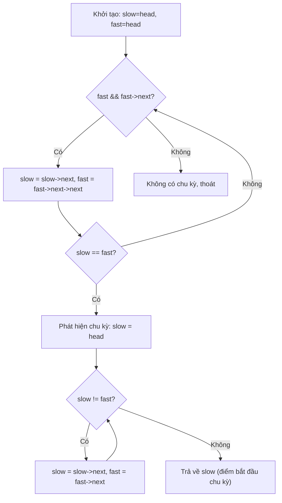

# Chương 4: Danh sách liên kết (Linked Lists)

Chương này trang bị kiến thức về cấu trúc dữ liệu Danh sách liên kết: bao gồm danh sách liên kết đơn, kép và vòng. Chương học sẽ đi sâu chi tiết vào các thao tác cơ bản, kỹ thuật hai con trỏ, thuật toán đảo ngược danh sách, bài toán gộp danh sách, tìm giao điểm và sao chép danh sách nâng cao.

---

## 1. Danh sách liên kết đơn (Singly Linked List)

**Bản chất (What)**: Một cấu trúc dữ liệu tuyến tính trong đó mỗi nút (node) chứa hai phần: phần dữ liệu (data) và một con trỏ (`next`) trỏ tới nút kế tiếp. Nút cuối cùng của danh sách trỏ tới `nullptr`.

**Khi nào nên áp dụng**:
- Khi cần cấp phát bộ nhớ động linh hoạt (không yêu cầu kích thước cố định từ trước).
- Khi có nhu cầu chèn/xóa phần tử liên tục tại các vị trí bất kỳ (chỉ tốn độ phức tạp $O(1)$ nếu bạn đã nắm giữ tham chiếu đến nút đó).
- Khi không yêu cầu vùng nhớ liên tục hoặc vùng nhớ liên tục bị phân mảnh gây lãng phí.

**Định nghĩa cấu trúc nút trong C++**:
```cpp
struct Node {
    int data;
    Node* next;
    Node(int val) : data(val), next(nullptr) {}
};
```

---

## 2. Danh sách liên kết kép (Doubly Linked List)

**Bản chất (What)**: Mỗi nút trong danh sách chứa hai con trỏ trỏ tới cả nút kế tiếp (`next`) và nút đứng trước (`prev`).

**Khi nào nên áp dụng**:
- Khi cần duyệt danh sách hiệu quả theo cả hai chiều xuôi và ngược.
- Khi cần xóa một nút cho trước một cách nhanh chóng (mà không phải tốn công tìm nút đứng trước nó).
- Thiết lập các thuật toán bộ nhớ đệm như LRU Cache, hoặc các chức năng Hoàn tác/Làm lại (Undo/Redo).

**Định nghĩa cấu trúc nút kép trong C++**:
```cpp
struct DNode {
    int data;
    DNode* prev;
    DNode* next;
    DNode(int val) : data(val), prev(nullptr), next(nullptr) {}
};
```

---

## 3. Danh sách liên kết vòng (Circular Linked List)

**Bản chất (What)**: Nút cuối cùng của danh sách trỏ ngược lại nút đầu tiên (có thể là vòng đơn hoặc vòng kép), tạo thành một chu trình kín. Không có nút nào trỏ tới `nullptr`.

**Khi nào nên áp dụng**:
- Cơ chế lập lịch xoay vòng (Round-robin scheduling) trong Hệ điều hành.
- Các trò chơi nhiều người chơi theo lượt luân phiên xoay vòng.
- Cài đặt cấu trúc bộ đệm vòng (circular buffer).

---

## 4. Các thao tác cơ bản trên danh sách liên kết

| Thao tác | Danh sách đơn | Danh sách kép | Độ phức tạp thời gian |
| :--- | :--- | :--- | :--- |
| **Duyệt danh sách** | $O(n)$ | $O(n)$ | $O(n)$ |
| **Tìm theo giá trị** | $O(n)$ | $O(n)$ | $O(n)$ |
| **Chèn ở đầu** (head) | $O(1)$ | $O(1)$ | $O(1)$ |
| **Chèn ở cuối** (không có con trỏ tail) | $O(n)$ | $O(1)$ (nếu lưu tail) | $O(1)$ / $O(n)$ |
| **Chèn sau một nút cho trước** | $O(1)$ | $O(1)$ | $O(1)$ |
| **Xóa nút đầu** | $O(1)$ | $O(1)$ | $O(1)$ |
| **Xóa một nút cho trước** (không biết nút trước) | $O(n)$ | $O(1)$ | $O(n)$ / $O(1)$ |

**Ví dụ: Chèn phần tử vào đầu danh sách liên kết đơn**:
```cpp
void insertAtHead(Node*& head, int val) {
    Node* newNode = new Node(val);
    newNode->next = head;
    head = newNode;
}
```

---

## 5. Kỹ thuật Hai con trỏ trên Danh sách liên kết (Two‑Pointer Techniques)

**Bản chất (What)**: Sử dụng đồng thời hai con trỏ di chuyển với tốc độ khác nhau (nhanh/chậm - fast/slow) hoặc xuất phát ở các vị trí khác nhau để giải quyết các bài toán với độ phức tạp thời gian tối ưu $O(n)$ và không gian $O(1)$.

**Khi nào nên áp dụng**: Phát hiện chu trình, tìm phần tử trung tâm, tìm nút thứ $n$ tính từ cuối lên, phát hiện giao điểm của hai danh sách.

### 5.1 Tìm phần tử trung tâm của Danh sách liên kết (Finding Middle)

Con trỏ chậm (`slow`) di chuyển từng bước một, con trỏ nhanh (`fast`) di chuyển hai bước một. Khi con trỏ nhanh chạm tới cuối danh sách, con trỏ chậm sẽ nằm chính xác ở vị trí giữa.

```cpp
Node* findMiddle(Node* head) {
    Node* slow = head;
    Node* fast = head;
    while (fast && fast->next) {
        slow = slow->next;
        fast = fast->next->next;
    }
    return slow;
}
```

### 5.2 Phát hiện chu trình (Floyd’s Cycle Detection - Thuật toán rùa và thỏ)

**Bản chất (What)**: Kiểm tra xem danh sách liên kết có chứa chu kỳ lặp vô hạn hay không bằng cách cho con trỏ chậm (1 bước) và nhanh (2 bước) chạy song hành. Nếu chúng gặp nhau tại cùng một nút, danh sách chắc chắn chứa chu trình.

**Khi nào nên áp dụng**: Kiểm tra tránh vòng lặp vô hạn, phát hiện cấu trúc liên kết bị lỗi, phát hiện các liên kết tham chiếu tròn.

```cpp
bool hasCycle(Node* head) {
    Node* slow = head;
    Node* fast = head;
    while (fast && fast->next) {
        slow = slow->next;
        fast = fast->next->next;
        if (slow == fast) return true; // Thỏ đuổi kịp rùa
    }
    return false;
}
```

### 5.3 Tìm điểm bắt đầu của chu trình

**Bản chất (What)**: Sau khi con trỏ chậm và nhanh gặp nhau tại điểm đụng độ, đặt lại con trỏ chậm về đầu danh sách (`head`), giữ nguyên con trỏ nhanh tại điểm gặp. Tiến hành cho cả hai con trỏ di chuyển cùng tốc độ (1 bước/lần). Điểm gặp nhau tiếp theo của chúng chính là điểm bắt đầu của chu trình.

```cpp
Node* detectCycleStart(Node* head) {
    Node* slow = head;
    Node* fast = head;
    bool hasCycle = false;
    while (fast && fast->next) {
        slow = slow->next;
        fast = fast->next->next;
        if (slow == fast) { 
            hasCycle = true; 
            break; 
        }
    }
    if (!hasCycle) return nullptr;
    slow = head;
    while (slow != fast) {
        slow = slow->next;
        fast = fast->next;
    }
    return slow;
}
```

**Phép so sánh trong thế giới thực**: Hai vận động viên chạy trên đường chạy vòng tròn, một người chạy nhanh gấp đôi người kia. Họ chắc chắn sẽ đụng độ nhau. Khi đụng độ, nếu đưa một người về vạch xuất phát ban đầu và cả hai cùng chạy với tốc độ bằng nhau, họ sẽ gặp nhau ngay tại lối vào của đường chạy vòng tròn.



---

## 6. Đảo ngược danh sách liên kết (Reversal)

### 6.1 Đảo ngược bằng vòng lặp (Iterative Reversal)

**Bản chất (What)**: Đảo chiều các liên kết trực tiếp bằng cách sử dụng ba con trỏ quản lý trạng thái (`prev`, `curr`, `next`).

```cpp
Node* reverseIterative(Node* head) {
    Node* prev = nullptr;
    Node* curr = head;
    Node* next = nullptr;
    while (curr) {
        next = curr->next;  // Lưu lại liên kết tiếp theo
        curr->next = prev;  // Đảo chiều liên kết
        prev = curr;        // Dịch chuyển prev tiến lên
        curr = next;        // Dịch curr sang nút tiếp theo
    }
    return prev; // Đầu mới của danh sách đã đảo ngược
}
```

### 6.2 Đảo ngược bằng đệ quy (Recursive Reversal)

**Bản chất (What)**: Đảo ngược toàn bộ phần danh sách phía sau trước, sau đó điều chỉnh con trỏ liên kết của nút hiện tại.

```cpp
Node* reverseRecursive(Node* head) {
    if (!head || !head->next) return head;
    Node* newHead = reverseRecursive(head->next);
    head->next->next = head; // Cho nút tiếp theo trỏ ngược lại nút hiện tại
    head->next = nullptr;    // Cắt đứt liên kết cũ
    return newHead;
}
```

### 6.3 Đảo ngược theo nhóm $k$ phần tử (Reverse in Groups of k)

**Bản chất (What)**: Đảo ngược đảo chiều từng cụm liên tục gồm $k$ nút một. Nếu cụm cuối cùng còn lại ít hơn $k$ phần tử, ta giữ nguyên không đảo chiều cụm đó.

```cpp
Node* reverseKGroup(Node* head, int k) {
    Node* curr = head;
    int count = 0;
    while (curr && count < k) { 
        curr = curr->next; 
        count++; 
    }
    if (count == k) {
        Node* reversedHead = reverseKGroup(curr, k); // Đệ quy giải quyết phần còn lại
        // Đảo chiều cụm k phần tử hiện tại
        Node* prev = nullptr;
        Node* curr2 = head;
        for (int i = 0; i < k; ++i) {
            Node* next = curr2->next;
            curr2->next = prev;
            prev = curr2;
            curr2 = next;
        }
        head->next = reversedHead; // Nối phần đã đảo với phần đệ quy phía sau
        return prev;
    }
    return head;
}
```

---

## 7. Các bài toán Gộp và Giao nhau (Merge & Intersection)

### 7.1 Gộp hai danh sách đã sắp xếp (Merge Two Sorted Lists)

**Bản chất (What)**: Kết hợp hai danh sách liên kết đã được sắp xếp tăng dần thành một danh sách duy nhất vẫn giữ nguyên tính chất sắp xếp.

```cpp
Node* mergeTwoSorted(Node* l1, Node* l2) {
    Node dummy(0);
    Node* tail = &dummy;
    while (l1 && l2) {
        if (l1->data < l2->data) {
            tail->next = l1;
            l1 = l1->next;
        } else {
            tail->next = l2;
            l2 = l2->next;
        }
        tail = tail->next;
    }
    tail->next = l1 ? l1 : l2; // Ghép phần còn sót lại
    return dummy.next;
}
```

### 7.2 Tìm giao điểm của hai danh sách liên kết (Find Intersection Point)

**Bản chất (What)**: Hai danh sách liên kết đơn có thể hội tụ và dùng chung một đoạn đuôi phía sau. Hãy xác định nút bắt đầu giao nhau đó.

**Thuật toán tối ưu**:
1. Tính chiều dài của hai danh sách liên kết.
2. Dịch chuyển con trỏ của danh sách dài hơn đi một khoảng đúng bằng khoảng chênh lệch chiều dài.
3. Cho cả hai con trỏ đồng thời dịch chuyển từng bước một cho đến khi chúng gặp nhau.

```cpp
Node* getIntersectionNode(Node* headA, Node* headB) {
    int lenA = 0, lenB = 0;
    Node* temp = headA;
    while (temp) { lenA++; temp = temp->next; }
    temp = headB;
    while (temp) { lenB++; temp = temp->next; }
    
    Node* ptrA = headA;
    Node* ptrB = headB;
    // Đồng bộ điểm xuất phát bằng khoảng cách chênh lệch
    if (lenA > lenB) {
        for (int i = 0; i < lenA - lenB; ++i) ptrA = ptrA->next;
    } else {
        for (int i = 0; i < lenB - lenA; ++i) ptrB = ptrB->next;
    }
    while (ptrA != ptrB) {
        ptrA = ptrA->next;
        ptrB = ptrB->next;
    }
    return ptrA; // Nút giao nhau (hoặc nullptr nếu không giao)
}
```

---

## 8. Sao chép danh sách có con trỏ ngẫu nhiên (Copy List with Random Pointer)

**Bài toán**: Mỗi nút ngoài con trỏ `next` còn sở hữu một con trỏ `random` có thể trỏ tới bất kỳ nút nào trong danh sách hoặc trỏ tới `nullptr`. Hãy tạo ra một bản sao sâu (deep copy) hoàn chỉnh của danh sách này.

**Thuật toán đan xen tối ưu không gian**: Đan cài nút sao chép vào ngay sau nút gốc, cấu hình con trỏ ngẫu nhiên, sau đó tách riêng hai danh sách.

```cpp
struct RNode {
    int val;
    RNode* next;
    RNode* random;
    RNode(int v) : val(v), next(nullptr), random(nullptr) {}
};

RNode* copyRandomList(RNode* head) {
    if (!head) return nullptr;
    
    // Bước 1: Nhân bản các nút và chèn đan xen ngay sau nút gốc tương ứng
    RNode* curr = head;
    while (curr) {
        RNode* copy = new RNode(curr->val);
        copy->next = curr->next;
        curr->next = copy;
        curr = copy->next;
    }
    // Bước 2: Thiết lập các con trỏ random cho các nút bản sao
    curr = head;
    while (curr) {
        if (curr->random) {
            curr->next->random = curr->random->next;
        }
        curr = curr->next->next;
    }
    // Bước 3: Tách danh sách đan xen để khôi phục danh sách gốc và thu về danh sách bản sao
    RNode dummy(0);
    RNode* newTail = &dummy;
    curr = head;
    while (curr) {
        newTail->next = curr->next;
        newTail = newTail->next;
        curr->next = curr->next->next;
        curr = curr->next;
    }
    return dummy.next;
}
```
- **Độ phức tạp thời gian**: $O(n)$
- **Độ phức tạp không gian**: $O(1)$ không gian bổ trợ phụ (không tính không gian cấp phát cho danh sách bản sao đầu ra).

**Phép so sánh trong thế giới thực**: Sao chép một văn bản chứa nhiều ghi chú tham chiếu liên kết giữa các trang. Việc đan xen các bản sao ngay cạnh bản gốc đảm bảo bạn luôn biết chính xác nút tương ứng của trang đích khi gán ghi chú tham chiếu.

---

## Bảng tổng hợp các kỹ thuật trên Danh sách liên kết

| Bài toán | Kỹ thuật tối ưu | Độ phức tạp thời gian | Độ phức tạp không gian |
| :--- | :--- | :--- | :--- |
| **Tìm phần tử giữa** | Con trỏ nhanh & chậm (Rùa và Thỏ) | $O(n)$ | $O(1)$ |
| **Phát hiện chu trình** | Giải thuật Floyd | $O(n)$ | $O(1)$ |
| **Tìm điểm đầu chu kỳ** | Floyd + Đặt lại một con trỏ về đầu | $O(n)$ | $O(1)$ |
| **Đảo ngược danh sách** | Vòng lặp ba con trỏ / Đệ quy | $O(n)$ | $O(1)$ / $O(n)$ stack |
| **Đảo theo nhóm $k$** | Giải thuật đệ quy phân cụm | $O(n)$ | $O(n/k)$ stack |
| **Gộp danh sách** | Duyệt song hành hai con trỏ | $O(m+n)$ | $O(1)$ |
| **Tìm giao điểm** | Cân bằng độ lệch chiều dài | $O(m+n)$ | $O(1)$ |
| **Sao chép ngẫu nhiên** | Phương pháp đan xen danh sách | $O(n)$ | $O(1)$ |

Chương tiếp theo sẽ bao gồm các cấu trúc dữ liệu cơ bản tiếp theo: Ngăn xếp và Hàng đợi (Cài đặt, ứng dụng thực tế và cách giải quyết các bài toán kinh điển như Tìm phần tử lớn hơn kế tiếp, Kiểm tra ngoặc hợp lệ, Phần tử lớn nhất trong cửa sổ trượt).
