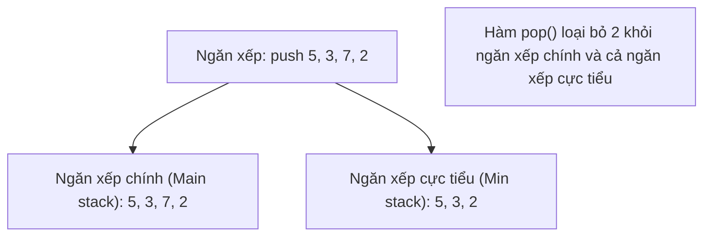

# Chương 5: Ngăn xếp và Hàng đợi (Stacks and Queues)

Chương này trang bị kiến thức về các cấu trúc dữ liệu tuyến tính có ràng buộc về thứ tự truy xuất phần tử bao gồm: Ngăn xếp (LIFO), Hàng đợi (FIFO), Hàng đợi hai đầu (Deque) và Hàng đợi ưu tiên (Heap). Nội dung sẽ đi sâu vào chi tiết cài đặt cấu trúc, ứng dụng thực tiễn và cách giải quyết các bài toán kinh điển.

---

## 1. Ngăn xếp (Stack)

**Bản chất (What)**: Một cấu trúc dữ liệu tuyến tính tuân theo nguyên lý **Vào sau ra trước LIFO (Last‑In‑First‑Out)**. Các phần tử chỉ được phép thêm vào và loại bỏ ở cùng một đầu duy nhất (gọi là Đỉnh - Top).

**Phép so sánh trong thế giới thực**: Một chồng đĩa – bạn đặt đĩa mới lên trên cùng (push) và lấy chiếc đĩa trên cùng ra trước tiên (pop).

**Khi nào nên áp dụng**:
- Quản lý cuộc gọi hàm của hệ thống (Ngăn xếp gọi hàm - Call stack).
- Chức năng Hoàn tác/Làm lại (Undo/Redo) trong các trình soạn thảo văn bản.
- Phân tích cú pháp biểu thức toán học (Kiểm tra dấu ngoặc hợp lệ, đánh giá biểu thức hậu tố).
- Các giải thuật tìm kiếm quay lui (Duyệt theo chiều sâu DFS, giải mê cung).
- Lịch sử duyệt trình duyệt web (Phím quay lại - Back button).

### 1.1 Cài đặt Ngăn xếp bằng Mảng (Array‑Based)

```cpp
class StackArray {
private:
    int* arr;
    int capacity;
    int topIndex;
public:
    StackArray(int size) : capacity(size), topIndex(-1) {
        arr = new int[capacity];
    }
    ~StackArray() { delete[] arr; }
    void push(int x) {
        if (topIndex == capacity - 1) throw overflow_error("Stack overflow");
        arr[++topIndex] = x;
    }
    void pop() {
        if (topIndex < 0) throw underflow_error("Stack empty");
        topIndex--;
    }
    int top() {
        if (topIndex < 0) throw underflow_error("Stack empty");
        return arr[topIndex];
    }
    bool empty() const { return topIndex == -1; }
};
```

### 1.2 Cài đặt Ngăn xếp bằng Danh sách liên kết (Linked‑List‑Based)

```cpp
class StackLL {
private:
    struct Node {
        int data;
        Node* next;
        Node(int val) : data(val), next(nullptr) {}
    };
    Node* topNode;
public:
    StackLL() : topNode(nullptr) {}
    ~StackLL() { while (topNode) pop(); }
    void push(int x) {
        Node* newNode = new Node(x);
        newNode->next = topNode;
        topNode = newNode;
    }
    void pop() {
        if (!topNode) throw underflow_error("Stack empty");
        Node* temp = topNode;
        topNode = topNode->next;
        delete temp;
    }
    int top() {
        if (!topNode) throw underflow_error("Stack empty");
        return topNode->data;
    }
    bool empty() const { return topNode == nullptr; }
};
```

---

### 1.3 Các ứng dụng kinh điển của Ngăn xếp

#### Kiểm tra dấu ngoặc hợp lệ (Balanced Parentheses)

Xác định xem các cặp dấu ngoặc đơn, ngoặc vuông, ngoặc nhọn lồng nhau có đúng quy chuẩn cú pháp hay không.

```cpp
bool isBalanced(string expr) {
    stack<char> st;
    for (char c : expr) {
        if (c == '(' || c == '{' || c == '[') {
            st.push(c);
        } else if (c == ')' || c == '}' || c == ']') {
            if (st.empty()) return false;
            char top = st.top();
            if ((c == ')' && top != '(') ||
                (c == '}' && top != '{') ||
                (c == ']' && top != '[')) {
                return false;
            }
            st.pop();
        }
    }
    return st.empty();
}
```

#### Đánh giá biểu thức toán học dạng Hậu tố (Postfix Evaluation)

**Khi nào nên áp dụng**: Thiết kế trình biên dịch (Compilers), máy tính điện tử.

```cpp
int evaluatePostfix(string postfix) {
    stack<int> st;
    for (char c : postfix) {
        if (isdigit(c)) {
            st.push(c - '0');
        } else {
            int b = st.top(); st.pop();
            int a = st.top(); st.pop();
            switch (c) {
                case '+': st.push(a + b); break;
                case '-': st.push(a - b); break;
                case '*': st.push(a * b); break;
                case '/': st.push(a / b); break;
            }
        }
    }
    return st.top();
}
```
*Lưu ý: Quá trình chuyển đổi từ biểu thức Trung tố sang Hậu tố sử dụng độ ưu tiên toán tử và một ngăn xếp (Thuật toán Shunting‑yard).*

#### Tìm phần tử lớn hơn kế tiếp (Next Greater Element)

**Bản chất (What)**: Với mỗi phần tử trong mảng, hãy tìm phần tử đầu tiên nằm ở phía bên phải có giá trị lớn hơn nó.

```cpp
vector<int> nextGreaterElement(vector<int>& nums) {
    int n = nums.size();
    vector<int> result(n, -1);
    stack<int> st; // Lưu trữ chỉ số (indices) của các phần tử đang chờ tìm giá trị lớn hơn
    for (int i = 0; i < n; ++i) {
        while (!st.empty() && nums[st.top()] < nums[i]) {
            result[st.top()] = nums[i];
            st.pop();
        }
        st.push(i);
    }
    return result;
}
```
- **Độ phức tạp thời gian**: $O(n)$
- **Phép so sánh trong thế giới thực**: Tìm người cao hơn đầu tiên đứng phía sau trong một hàng người xếp hàng nhìn về bên phải.

#### Tìm hình chữ nhật lớn nhất trong biểu đồ cột (Largest Rectangle in Histogram)

**Bài toán**: Cho trước một loạt các cột thẳng đứng có độ rộng bằng 1 và chiều cao tương ứng, hãy tìm diện tích hình chữ nhật lớn nhất có thể được tạo nên.

**Giải pháp**: Sử dụng một ngăn xếp để nhanh chóng tìm ra cột thấp hơn gần nhất ở cả hai phía trái và phải.

```cpp
int largestRectangleArea(vector<int>& heights) {
    stack<int> st;
    int maxArea = 0;
    heights.push_back(0); // Thêm lính canh (sentinel) ở cuối
    for (int i = 0; i < heights.size(); ++i) {
        while (!st.empty() && heights[st.top()] > heights[i]) {
            int h = heights[st.top()];
            st.pop();
            int left = st.empty() ? -1 : st.top();
            maxArea = max(maxArea, h * (i - left - 1));
        }
        st.push(i);
    }
    heights.pop_back(); // Phục hồi lại mảng heights
    return maxArea;
}
```

#### Ngăn xếp cực tiểu (Min Stack - Lấy giá trị nhỏ nhất trong $O(1)$)

**Thiết kế**: Xây dựng cấu trúc ngăn xếp hỗ trợ các thao tác `push`, `pop`, `top` và truy xuất phần tử nhỏ nhất hiện tại `getMin` đều đạt thời gian $O(1)$.

**Ý tưởng**: Sử dụng thêm một ngăn xếp phụ trợ để liên tục ghi nhận giá trị nhỏ nhất tương ứng ở mỗi cấp độ ngăn xếp.

```cpp
class MinStack {
    stack<int> st;
    stack<int> minSt;
public:
    void push(int x) {
        st.push(x);
        if (minSt.empty() || x <= minSt.top()) {
            minSt.push(x);
        }
    }
    void pop() {
        if (st.top() == minSt.top()) {
            minSt.pop();
        }
        st.pop();
    }
    int top() { 
        return st.top(); 
    }
    int getMin() { 
        return minSt.top(); 
    }
};
```



---

## 2. Hàng đợi (Queue)

**Bản chất (What)**: Một cấu trúc dữ liệu tuyến tính tuân theo nguyên lý **Vào trước ra trước FIFO (First‑In‑First‑Out)**. Các phần tử chỉ được phép chèn vào ở cuối hàng (Rear) và loại bỏ ở đầu hàng (Front).

**Phép so sánh trong thế giới thực**: Một hàng người xếp hàng mua vé – người đầu tiên xếp hàng sẽ được mua vé trước tiên và ra khỏi hàng trước.

**Khi nào nên áp dụng**:
- Quản lý và lập lịch tác vụ (Hàng đợi CPU, hàng đợi lệnh in).
- Thuật toán duyệt đồ thị theo chiều rộng BFS (Breadth‑First Search) trên cây và đồ thị.
- Vùng đệm truyền tin (Vùng đệm I/O, hàng đợi thông điệp Message queue).
- Các bài toán xử lý cửa sổ trượt.

### 2.1 Cài đặt Hàng đợi vòng bằng Mảng (Circular Queue)

Sử dụng một mảng có kích thước cố định kết hợp hai con trỏ chỉ số `front` và `rear` tự động xoay vòng bằng phép chia dư mô-đun.

```cpp
class CircularQueue {
    int* arr;
    int capacity;
    int frontIdx, rearIdx;
    int count; // Số lượng phần tử hiện tại trong hàng đợi
public:
    CircularQueue(int size) : capacity(size), frontIdx(0), rearIdx(-1), count(0) {
        arr = new int[capacity];
    }
    ~CircularQueue() { delete[] arr; }
    bool enqueue(int x) {
        if (count == capacity) return false; // Hàng đợi đầy
        rearIdx = (rearIdx + 1) % capacity;
        arr[rearIdx] = x;
        count++;
        return true;
    }
    bool dequeue() {
        if (count == 0) return false; // Hàng đợi trống
        frontIdx = (frontIdx + 1) % capacity;
        count--;
        return true;
    }
    int front() {
        if (count == 0) throw underflow_error("Queue empty");
        return arr[frontIdx];
    }
    bool empty() const { return count == 0; }
};
```

### 2.2 Cài đặt Hàng đợi bằng Danh sách liên kết

```cpp
class QueueLL {
    struct Node {
        int data;
        Node* next;
        Node(int val) : data(val), next(nullptr) {}
    };
    Node* frontNode;
    Node* rearNode;
public:
    QueueLL() : frontNode(nullptr), rearNode(nullptr) {}
    void enqueue(int x) {
        Node* newNode = new Node(x);
        if (rearNode) rearNode->next = newNode;
        else frontNode = newNode;
        rearNode = newNode;
    }
    void dequeue() {
        if (!frontNode) throw underflow_error("Queue empty");
        Node* temp = frontNode;
        frontNode = frontNode->next;
        if (!frontNode) rearNode = nullptr;
        delete temp;
    }
    int front() {
        if (!frontNode) throw underflow_error("Queue empty");
        return frontNode->data;
    }
    bool empty() const { return frontNode == nullptr; }
};
```

### 2.3 Hàng đợi hai đầu (Deque - Double‑Ended Queue)

**Bản chất (What)**: Cấu trúc dữ liệu cho phép chèn và xóa phần tử linh hoạt ở cả hai đầu của hàng đợi. Trong C++, cấu trúc này được cung cấp sẵn qua lớp `std::deque`.

**Khi nào nên áp dụng**:
- Tìm kiếm phần tử lớn nhất/nhỏ nhất trong cửa sổ trượt.
- Kiểm tra tính đối xứng Palindrome.
- Lập lịch công việc ưu tiên linh hoạt ở cả hai phía đầu cuối.

---

### 2.4 Các ứng dụng kinh điển của Hàng đợi

#### Tìm phần tử lớn nhất trong cửa sổ trượt (Sliding Window Maximum)

**Bài toán**: Cho trước một mảng số và cửa sổ trượt kích thước $k$, hãy tìm giá trị lớn nhất trong từng vị trí dịch chuyển của cửa sổ.

**Giải pháp**: Sử dụng một hàng đợi hai đầu Deque để lưu giữ các chỉ số index phần tử theo thứ tự giảm dần của giá trị.

```cpp
vector<int> slidingWindowMaximum(vector<int>& nums, int k) {
    deque<int> dq;
    vector<int> result;
    for (int i = 0; i < nums.size(); ++i) {
        // Loại bỏ các chỉ số index đã trượt ra ngoài phạm vi cửa sổ hiện tại
        if (!dq.empty() && dq.front() == i - k) {
            dq.pop_front();
        }
        // Duy trì trật tự giảm dần: loại bỏ các phần tử nhỏ hơn giá trị hiện tại
        while (!dq.empty() && nums[dq.back()] <= nums[i]) {
            dq.pop_back();
        }
        dq.push_back(i);
        // Bắt đầu ghi nhận kết quả khi cửa sổ đạt kích thước k
        if (i >= k - 1) {
            result.push_back(nums[dq.front()]);
        }
    }
    return result;
}
```
- **Độ phức tạp thời gian**: $O(n)$
- **Phép so sánh trong thế giới thực**: Khung kính lúp trượt trên trục số, bạn luôn muốn tìm ra con số lớn nhất đang hiển thị bên dưới lớp kính.

#### Duyệt đồ thị theo mức BFS (Breadth‑First Search)

Hàng đợi là cấu trúc dữ liệu nền tảng phục vụ cho duyệt cây và đồ thị theo từng mức độ sâu tăng dần.

```cpp
void bfs(Node* root) {
    if (!root) return;
    queue<Node*> q;
    q.push(root);
    while (!q.empty()) {
        Node* curr = q.front(); 
        q.pop();
        cout << curr->val << " ";
        if (curr->left) q.push(curr->left);
        if (curr->right) q.push(curr->right);
    }
}
```

---

## 3. Hàng đợi ưu tiên / Đống nhị phân (Priority Queue / Heap)

**Bản chất (What)**: Một cấu trúc dữ liệu luôn cho phép truy cập trực tiếp tới phần tử sở hữu độ ưu tiên cao nhất (hoặc thấp nhất). Thường được thiết lập hiệu quả bằng Đống nhị phân (Binary heap).

- **Đống cực đại (Max‑heap)**: Nút cha $\ge$ các nút con; phần tử cực đại nằm ở gốc (root).
- **Đống cực tiểu (Min‑heap)**: Nút cha $\le$ các nút con; phần tử cực tiểu nằm ở gốc.

**Khi nào nên áp dụng**:
- Lập lịch xử lý công việc dựa theo độ ưu tiên.
- Tìm phần tử lớn thứ $K$ / nhỏ thứ $K$ trong tập hợp dữ liệu.
- Thuật toán gộp nhiều dãy số đã sắp xếp.
- Tối ưu hóa thuật toán tìm đường đi ngắn nhất Dijkstra và cây khung nhỏ nhất Prim.

**Thư viện chuẩn C++**: `priority_queue<T>` (mặc định là max‑heap). Để chuyển sang dùng min‑heap, ta khai báo: `priority_queue<T, vector<T>, greater<T>>`.

### 3.1 Các thao tác trên Đống (Heap)

| Thao tác | Mô tả chi tiết | Độ phức tạp thời gian |
| :--- | :--- | :--- |
| `heapify` | Xây dựng đống (Heap) từ một mảng thô cho trước | $O(n)$ |
| `insert` | Thêm phần tử mới vào cuối và cho nổi lên (bubble up) | $O(\log n)$ |
| `extract min/max` | Trích xuất gốc, đưa phần tử cuối lên và cho chìm xuống (heapify down) | $O(\log n)$ |
| `get min/max` | Xem giá trị phần tử gốc | $O(1)$ |
| `decrease key` | Giảm giá trị của một khóa và cho nổi lên | $O(\log n)$ |

### 3.2 Cài đặt thủ công cấu trúc Đống cực tiểu (Min‑Heap)

```cpp
class MinHeap {
    vector<int> heap;
    void heapifyUp(int idx) {
        while (idx > 0) {
            int parent = (idx - 1) / 2;
            if (heap[parent] <= heap[idx]) break;
            swap(heap[parent], heap[idx]);
            idx = parent;
        }
    }
    void heapifyDown(int idx) {
        int size = heap.size();
        while (true) {
            int left = 2 * idx + 1;
            int right = 2 * idx + 2;
            int smallest = idx;
            if (left < size && heap[left] < heap[smallest]) smallest = left;
            if (right < size && heap[right] < heap[smallest]) smallest = right;
            if (smallest == idx) break;
            swap(heap[idx], heap[smallest]);
            idx = smallest;
        }
    }
public:
    void insert(int val) {
        heap.push_back(val);
        heapifyUp(heap.size() - 1);
    }
    int extractMin() {
        if (heap.empty()) throw underflow_error("Heap empty");
        int root = heap[0];
        heap[0] = heap.back();
        heap.pop_back();
        if (!heap.empty()) heapifyDown(0);
        return root;
    }
    int getMin() { 
        return heap[0]; 
    }
    bool empty() { 
        return heap.empty(); 
    }
};
```

### 3.3 Ứng dụng: Tìm phần tử lớn thứ $K$ (Kth Largest Element)

**Giải pháp**: Duy trì một đống cực tiểu (min-heap) có kích thước tối đa bằng $K$ chứa các phần tử lớn nhất đã duyệt qua.

```cpp
int findKthLargest(vector<int>& nums, int k) {
    priority_queue<int, vector<int>, greater<int>> minHeap;
    for (int x : nums) {
        minHeap.push(x);
        if (minHeap.size() > k) {
            minHeap.pop(); // Loại bỏ phần tử nhỏ hơn ngoài cụm k phần tử lớn nhất
        }
    }
    return minHeap.top();
}
```
- **Độ phức tạp thời gian**: $O(n \log k)$
- **Độ phức tạp không gian**: $O(k)$

### 3.4 Ứng dụng: Gộp $K$ danh sách đã sắp xếp (Merge K Sorted Lists)

**Giải pháp**: Đưa nút đầu tiên của mỗi danh sách vào một đống cực tiểu. Liên tục trích xuất nút nhỏ nhất hiện tại từ đống, ghép vào danh sách kết quả, và chèn nút kế tiếp của danh sách đó vào đống.

```cpp
struct ListNode {
    int val;
    ListNode* next;
    ListNode(int x) : val(x), next(nullptr) {}
};

struct Compare {
    bool operator()(ListNode* a, ListNode* b) {
        return a->val > b->val; // Phục vụ cho min‑heap
    }
};

ListNode* mergeKLists(vector<ListNode*>& lists) {
    priority_queue<ListNode*, vector<ListNode*>, Compare> pq;
    for (auto list : lists) {
        if (list) pq.push(list);
    }
    ListNode dummy(0);
    ListNode* tail = &dummy;
    while (!pq.empty()) {
        ListNode* smallest = pq.top(); 
        pq.pop();
        tail->next = smallest;
        tail = tail->next;
        if (smallest->next) {
            pq.push(smallest->next);
        }
    }
    return dummy.next;
}
```
- **Độ phức tạp thời gian**: $O(N \log k)$ (với $N$ là tổng số nút của tất cả các danh sách, $k$ là số lượng danh sách).

### 3.5 Ứng dụng: Tối ưu hóa thuật toán tìm đường đi ngắn nhất Dijkstra

Hàng đợi ưu tiên hỗ trợ chọn nhanh đỉnh có khoảng cách ước lượng nhỏ nhất trong mỗi bước duyệt đồ thị.

```cpp
void dijkstra(vector<vector<pair<int,int>>>& graph, int src) {
    int n = graph.size();
    vector<int> dist(n, INT_MAX);
    dist[src] = 0;
    using P = pair<int,int>; // dạng (khoảng_cách, đỉnh)
    priority_queue<P, vector<P>, greater<P>> pq;
    pq.push({0, src});
    while (!pq.empty()) {
        auto [d, u] = pq.top(); 
        pq.pop();
        if (d > dist[u]) continue;
        for (auto [v, w] : graph[u]) {
            if (dist[v] > dist[u] + w) {
                dist[v] = dist[u] + w;
                pq.push({dist[v], v});
            }
        }
    }
}
```

---

## Bảng so sánh các Cấu trúc dữ liệu tuyến tính có ràng buộc

| Cấu trúc dữ liệu | Thứ tự truy xuất | Cách thức cài đặt | Các thao tác cốt lõi đạt $O(1)$ | Ứng dụng tiêu biểu |
| :--- | :--- | :--- | :--- | :--- |
| **Ngăn xếp** (Stack) | Vào sau ra trước (LIFO) | Mảng, Danh sách liên kết | `push`, `pop`, `top` | Cặp dấu ngoặc, DFS, Hoàn tác, Tính hậu tố |
| **Hàng đợi** (Queue) | Vào trước ra trước (FIFO) | Mảng xoay vòng, Danh sách | `enqueue`, `dequeue`, `front` | BFS, lập lịch, hàng đệm truyền tải |
| **Hàng đợi kép** (Deque) | Xử lý linh hoạt ở hai đầu | Danh sách kép, Mảng | `push`/`pop` front/back | Phần tử cực đại cửa sổ trượt, Palindrome |
| **Hàng đợi ưu tiên** | Dựa trên độ ưu tiên | Đống nhị phân (Binary Heap) | `getMin`, `insert`, `extractMin` (lần lượt là $O(1)$, $O(\log n)$, $O(\log n)$) | Tìm cụm K phần tử, gộp k danh sách, Dijkstra |

Chương tiếp theo sẽ bao gồm các cấu trúc dữ liệu tuyến tính nâng cao tiếp theo: Bảng băm và Bản đồ (Hash Tables and Maps).
