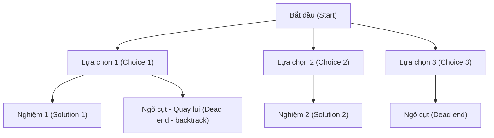

# Chương 6: Đệ quy và Quay lui (Recursion and Backtracking)

Chương này trang bị các kiến thức đệ quy căn bản, thực hiện so sánh đối chiếu giữa đệ quy và vòng lặp, đồng thời đi sâu nghiên cứu thuật toán Quay lui dưới góc độ một kỹ thuật tìm kiếm hệ thống. Các bài toán kinh điển (Tám quân hậu N-Queens, giải đố Sudoku, sinh tập con, sinh hoán vị, tổ hợp tổng) sẽ minh họa sinh động cho các ứng dụng thực tế của những kỹ thuật này.

---

## 1. Nguyên lý Đệ quy nền tảng (Recursion Fundamentals)

**Bản chất (What)**: Đệ quy là việc một hàm tự gọi chính nó để giải quyết các bài toán con có kích thước nhỏ hơn của cùng một bài toán đó.

### 1.1 Các thành phần của Đệ quy
- **Điều kiện dừng / Trường hợp cơ sở (Base case)**: Dữ liệu đầu vào đơn giản nhất mà bài toán có thể giải quyết ngay trực tiếp và chấm dứt tiến trình đệ quy.
- **Công thức truy hồi (Recurrence relation)**: Biểu diễn bài toán lớn dưới dạng tổng hợp các lời gọi đệ quy giải quyết bài toán con có kích thước nhỏ hơn.
- **Ngăn xếp gọi hàm (Call stack)**: Ngăn xếp hệ thống tự động cấp phát và quản lý thông tin của mỗi lời gọi hàm đệ quy đang hoạt động.

### 1.2 Ví dụ về Công thức truy hồi (Tính giai thừa)
```
factorial(0) = 1                    // Điều kiện dừng (Base case)
factorial(n) = n * factorial(n-1)   // Công thức truy hồi (Recurrence)
```

```cpp
int factorial(int n) {
    if (n <= 1) return 1;           // Điều kiện dừng (Base case)
    return n * factorial(n - 1);    // Gọi đệ quy theo công thức truy hồi
}
```

---

### 1.3 Đệ quy Đuôi so với Đệ quy Phi đuôi (Tail vs Non‑Tail Recursion)

**Đệ quy Đuôi (Tail recursion)**: Lời gọi đệ quy là thao tác cuối cùng được thực thi bởi hàm. Kết quả của lời gọi đệ quy được trả về trực tiếp mà không cần thực hiện thêm bất kỳ phép tính toán nào phía sau nó.

```cpp
// Tính giai thừa bằng đệ quy đuôi kết hợp biến tích lũy accumulator
int factorialTail(int n, int acc = 1) {
    if (n <= 1) return acc;
    return factorialTail(n - 1, n * acc);   // Lời gọi đệ quy là thao tác cuối cùng
}
```

**Đệ quy Phi đuôi (Non-tail recursion)**: Vẫn còn các phép tính toán (ví dụ như phép nhân) diễn ra sau khi lời gọi đệ quy trả về kết quả.

```cpp
int factorialNonTail(int n) {
    if (n <= 1) return 1;
    return n * factorialNonTail(n - 1);   // Phép nhân thực hiện sau khi có kết quả đệ quy
}
```

**Tại sao đệ quy đuôi lại quan trọng**: Một số trình biên dịch thông minh có khả năng tối ưu hóa đệ quy đuôi thành cấu trúc vòng lặp thông thường (Cơ chế loại bỏ lời gọi đuôi - tail call elimination), giúp tiết kiệm tài nguyên ngăn xếp và ngăn ngừa triệt để lỗi tràn ngăn xếp (stack overflow). Nếu không được trình biên dịch tối ưu hóa, cả hai dạng đệ quy trên vẫn tiêu tốn độ phức tạp không gian ngăn xếp là $O(n)$.

---

### 1.4 So sánh chi tiết Đệ quy và Vòng lặp (Recursion vs Iteration)

| Tiêu chí | Đệ quy | Vòng lặp (Iteration) |
| :--- | :--- | :--- |
| **Độ rõ ràng của mã nguồn** | Thường ngắn gọn, trực quan và dễ hiểu đối với các bài toán Chia để trị, Cây, Đồ thị. | Có thể rườm rà và phức tạp hơn khi biểu diễn các cấu trúc đệ quy tự nhiên. |
| **Hiệu năng xử lý** | Tốn chi phí phụ (overhead) do liên tục gọi hàm và cấp phát ngăn xếp. | Không tốn chi phí phụ cho cuộc gọi hàm, tốc độ thực thi nhanh hơn. |
| **Độ phức tạp không gian** | Tiêu tốn bộ nhớ ngăn xếp $O(n)$ (với độ sâu đệ quy $n$). | Tiết kiệm không gian bộ nhớ, thường chỉ mất $O(1)$ không gian bổ trợ. |
| **Nguy cơ lỗi** | Dễ xảy ra tràn bộ nhớ ngăn xếp (Stack overflow) nếu đệ quy quá sâu. | Hoàn toàn an toàn trước nguy cơ tràn bộ nhớ ngăn xếp. |
| **Ứng dụng điển hình** | Duyệt cây/đồ thị, thuật toán quay lui, Chia để trị. | Các vòng lặp đơn giản, xử lý mảng tuyến tính với kích thước dữ liệu lớn. |

**Khi nào nên dùng Đệ quy**:
- Bài toán sở hữu cấu trúc đệ quy tự nhiên (cấu trúc cây phân cấp, đồ thị phức tạp, bài toán Chia để trị).
- Độ sâu đệ quy ở mức vừa phải (tốc độ tăng trưởng dạng lô-ga-rít hoặc hằng số nhỏ).
- Độ rõ ràng, tính thẩm mỹ và dễ bảo trì của mã nguồn được ưu tiên cao hơn hiệu năng cực hạn.

**Khi nào nên dùng Vòng lặp**:
- Yêu cầu xử lý độ sâu đệ quy cực lớn ($n > 10^5$).
- Tiết kiệm không gian bộ nhớ và tối ưu hóa tài nguyên là bắt buộc ($O(1)$ không gian).
- Hệ thống yêu cầu hiệu năng thực thi cực nhanh và độ trễ thấp nhất.

---

## 2. Thuật toán Quay lui (Backtracking)

**Bản chất (What)**: Quay lui là một phương pháp tìm kiếm thử và sai (trial-and-error) một cách hệ thống, xây dựng dần các thành phần của nghiệm và chủ động hủy bỏ (quay lui - backtrack) các nghiệm trung gian ngay khi xác định chúng không thể dẫn tới lời giải hợp lệ.

**Khi nào nên áp dụng**:
- Bài toán tìm kiếm tổ hợp: sinh tập con, sinh hoán vị, sinh tổ hợp.
- Bài toán thỏa mãn ràng buộc phức tạp: bài toán Tám quân hậu (N-Queens), giải đố Sudoku, giải ô chữ.
- Tìm đường đi trong mê cung có đi kèm các điều kiện ràng buộc.

### 2.1 Cây Không gian Trạng thái (State Space Tree)

Mỗi lời gọi hàm đệ quy tương ứng với một nút trong cây không gian trạng thái. Nút gốc (root) là trạng thái khởi đầu của bài toán. Mỗi nhánh rẽ ra từ nút biểu thị một lựa chọn có thể thực hiện. Các nút lá biểu thị nghiệm hoàn chỉnh hợp lệ hoặc các ngõ cụt.



### 2.2 Kỹ thuật Nhánh cận / Cắt tỉa (Pruning Techniques)

**Cắt tỉa (Pruning)** nghĩa là chủ động bỏ qua việc duyệt toàn bộ các nhánh con của cây không gian trạng thái khi xác định chắc chắn rằng nhánh đó không thể cho ra nghiệm hợp lệ hoặc không thể tối ưu hơn nghiệm tốt nhất hiện tại.

Khác biệt cốt lõi giữa Quay lui và duyệt cạn thô sơ (brute-force) nằm ở khả năng áp dụng các ràng buộc toán học để cắt tỉa nhánh cận từ sớm.

**Các chiến lược cắt tỉa phổ biến**:
- **Cắt tỉa dựa trên ràng buộc**: Nếu việc gán giá trị hiện tại vi phạm các ràng buộc tối thiểu, lập tức dừng duyệt nhánh này.
- **Cắt tỉa dựa trên tính tối ưu (nhánh cận)**: Nếu chi phí tích lũy hiện tại đã vượt quá chi phí tối ưu nhất đã tìm thấy, lập tức quay lui.
- **Tránh trùng lặp / Đối xứng**: Duyệt sinh các phần tử theo thứ tự chỉ số tăng dần để tránh sinh lại các tập hợp hoán vị trùng nhau.

### 2.3 Khung mẫu mã thuật toán Quay lui tổng quát
```
void backtrack(state, choices):
    if is_goal(state):
        record(solution)
        return
    for each choice in choices:
        if is_valid(state + choice):
            make_choice(choice)                     // Chọn (Chọn lựa)
            backtrack(state + choice, next_choices) // Khám phá (Đệ quy)
            undo_choice(choice)                     // Quay lui (Quay xe)
```

---

## 3. Các bài toán Quay lui kinh điển

### 3.1 Sinh tất cả các tập con (Tập lũy thừa - Powerset)

**Bài toán**: Cho một tập hợp gồm các số nguyên phân biệt, hãy sinh ra tất cả các tập hợp con có thể có (bao gồm cả tập rỗng).

**Ý tưởng**: Duyệt qua từng chỉ số phần tử, tại mỗi bước ta đưa ra hai quyết định: mang phần tử đó đi tiếp (chọn) hoặc bỏ lại phía sau (không chọn).

```cpp
void subsets(vector<int>& nums, int index, vector<int>& current, vector<vector<int>>& result) {
    result.push_back(current);                         // Ghi nhận tập con hiện tại (tập rỗng đầu tiên)
    for (int i = index; i < nums.size(); ++i) {
        current.push_back(nums[i]);                    // Chọn
        subsets(nums, i + 1, current, result);         // Khám phá nhánh tiếp theo
        current.pop_back();                            // Quay lui
    }
}

vector<vector<int>> generateSubsets(vector<int>& nums) {
    vector<vector<int>> result;
    vector<int> current;
    subsets(nums, 0, current, result);
    return result;
}
```
- **Độ phức tạp thời gian**: $O(2^n)$
- **Độ phức tạp không gian**: $O(n)$ không gian bộ nhớ ngăn xếp đệ quy + $O(2^n)$ cho bộ nhớ lưu trữ kết quả.

### 3.2 Sinh các hoán vị (Generate Permutations)

**Bài toán**: Trả về tất cả các hoán vị có thể có của một mảng gồm các số phân biệt.

**Ý tưởng**: Thực hiện hoán đổi (swap) vị trí các phần tử để sinh ra các cấu hình sắp đặt khác nhau.

```cpp
void permute(vector<int>& nums, int start, vector<vector<int>>& result) {
    if (start == nums.size()) {
        result.push_back(nums);
        return;
    }
    for (int i = start; i < nums.size(); ++i) {
        swap(nums[start], nums[i]);          // Chọn (Hoán đổi)
        permute(nums, start + 1, result);    // Khám phá
        swap(nums[start], nums[i]);          // Quay lui (Đảo ngược hoán đổi)
    }
}

vector<vector<int>> generatePermutations(vector<int>& nums) {
    vector<vector<int>> result;
    permute(nums, 0, result);
    return result;
}
```
- **Độ phức tạp thời gian**: $O(n \cdot n!)$
- **Độ phức tạp không gian**: $O(n)$ không gian ngăn xếp đệ quy + $O(n \cdot n!)$ bộ nhớ lưu kết quả đầu ra.

### 3.3 Tổ hợp có tổng bằng K (Combination Sum)

**Bài toán**: Tìm tất cả các tổ hợp độc nhất từ danh sách các ứng viên (mỗi phần tử có thể sử dụng vô hạn lần) sao cho tổng của chúng đúng bằng giá trị mục tiêu `target`.

**Ý tưởng**: Sắp xếp mảng ứng viên trước để dễ dàng cắt tỉa các nhánh có tổng vượt quá `target`. Tại mỗi bước đệ quy, ta thử cộng thêm phần tử hiện tại (giữ nguyên chỉ số index để cho phép dùng vô hạn lần) hoặc chuyển sang thử phần tử tiếp theo.

```cpp
void combinationSum(vector<int>& candidates, int target, int start, vector<int>& current, vector<vector<int>>& result) {
    if (target == 0) {
        result.push_back(current);
        return;
    }
    for (int i = start; i < candidates.size() && candidates[i] <= target; ++i) {
        current.push_back(candidates[i]);
        // Đệ quy với chỉ số i thay vì i+1 để cho phép tái sử dụng phần tử hiện tại
        combinationSum(candidates, target - candidates[i], i, current, result);
        current.pop_back(); // Quay lui
    }
}

vector<vector<int>> combSum(vector<int>& candidates, int target) {
    sort(candidates.begin(), candidates.end()); // Sắp xếp để tối ưu cắt tỉa
    vector<vector<int>> result;
    vector<int> current;
    combinationSum(candidates, target, 0, current, result);
    return result;
}
```
- **Độ phức tạp thời gian**: Trong trường hợp xấu nhất đạt $O(2^n)$ (tuy nhiên thực tế cực kỳ nhanh nhờ được cắt tỉa từ sớm dựa trên `target`).
- **Độ phức tạp không gian**: $O(n)$ bộ nhớ ngăn xếp gọi hàm.

### 3.4 Bài toán N-Queens (Tám quân hậu)

**Bài toán**: Đặt $N$ quân hậu lên một bàn cờ kích thước $N \times N$ sao cho không có bất kỳ hai quân hậu nào có thể tấn công lẫn nhau (nghĩa là không nằm chung hàng, chung cột hoặc chung đường chéo).

**Ý tưởng**: Đặt lần lượt từng quân hậu trên từng hàng. Sử dụng mảng đánh dấu hoặc tập hợp để quản lý và kiểm tra nhanh trạng thái các cột và hai hướng đường chéo đã bị chiếm đóng hay chưa.

```cpp
void solveNQueens(int n, int row, vector<int>& cols, vector<bool>& diag1, vector<bool>& diag2, vector<vector<string>>& result) {
    if (row == n) {
        vector<string> board(n, string(n, '.'));
        for (int i = 0; i < n; ++i) {
            board[i][cols[i]] = 'Q';
        }
        result.push_back(board);
        return;
    }
    for (int col = 0; col < n; ++col) {
        int d1 = row - col + n - 1;  // Chỉ số đường chéo chính xuôi
        int d2 = row + col;          // Chỉ số đường chéo phụ ngược
        if (cols[col] || diag1[d1] || diag2[d2]) continue; // Bị tấn công, bỏ qua
        
        cols[col] = true;
        diag1[d1] = true;
        diag2[d2] = true;
        solveNQueens(n, row + 1, cols, diag1, diag2, result);
        cols[col] = false;
        diag1[d1] = false;
        diag2[d2] = false; // Quay lui
    }
}

vector<vector<string>> nQueens(int n) {
    vector<vector<string>> result;
    vector<int> cols(n, false);
    vector<bool> diag1(2*n - 1, false);
    vector<bool> diag2(2*n - 1, false);
    solveNQueens(n, 0, cols, diag1, diag2, result);
    return result;
}
```
- **Độ phức tạp thời gian**: $O(n!)$ nhờ có nhánh cận cắt tỉa các thế cờ lỗi từ rất sớm.
- **Độ phức tạp không gian**: $O(n)$ không gian ngăn xếp đệ quy.

### 3.5 Giải ô số Sudoku (Sudoku Solver)

**Bài toán**: Điền các chữ số từ 1 đến 9 vào một lưới Sudoku kích thước $9 \times 9$ bị khuyết sao cho thỏa mãn đồng thời ba ràng buộc: không trùng số trên cùng hàng, cùng cột và cùng khối lưới con kích thước $3 \times 3$.

**Ý tưởng**: Duyệt qua từng ô trống, thử điền các chữ số từ '1' đến '9'. Nếu việc điền số thỏa mãn các ràng buộc, ta tiến hành gọi đệ quy sang các ô trống tiếp theo. Nếu đệ quy thất bại, ta xóa số vừa điền (quay lui) và thử chữ số mới tiếp theo.

```cpp
bool isValid(vector<vector<char>>& board, int row, int col, char ch) {
    for (int i = 0; i < 9; ++i) {
        if (board[row][i] == ch) return false;
        if (board[i][col] == ch) return false;
        if (board[3*(row/3) + i/3][3*(col/3) + i%3] == ch) return false;
    }
    return true;
}

bool solveSudokuHelper(vector<vector<char>>& board) {
    for (int i = 0; i < 9; ++i) {
        for (int j = 0; j < 9; ++j) {
            if (board[i][j] == '.') {
                for (char ch = '1'; ch <= '9'; ++ch) {
                    if (isValid(board, i, j, ch)) {
                        board[i][j] = ch;
                        if (solveSudokuHelper(board)) return true;
                        board[i][j] = '.'; // Quay lui
                    }
                }
                return false; // Đã thử từ 1-9 đều không được, ngõ cụt
            }
        }
    }
    return true; // Hoàn tất điền toàn bộ bảng
}

void solveSudoku(vector<vector<char>>& board) {
    solveSudokuHelper(board);
}
```
- **Độ phức tạp thời gian**: Phụ thuộc nhiều vào cấu hình ô số ban đầu; trong trường hợp xấu nhất có thể rất cao nhưng thực tế bàn cờ Sudoku tiêu chuẩn được cắt tỉa và giải quyết vô cùng nhanh chóng.

### 3.6 Chuột trong mê cung (Rat in a Maze)

**Bài toán**: Tìm đường đi cho chú chuột từ ô góc trên cùng bên trái đến ô góc dưới cùng bên phải của một bản đồ lưới tọa độ, trong đó có một số ô là chướng ngại vật không thể đi qua.

**Ý tưởng**: Sử dụng giải thuật duyệt theo chiều sâu DFS kết hợp đánh dấu các ô đã đi qua để tránh vòng lặp vô hạn. Nếu đi vào ngõ cụt, thực hiện quay lui bằng cách xóa dấu ô hiện tại và thử hướng đi mới.

```cpp
bool ratInMaze(vector<vector<int>>& maze, int x, int y, vector<vector<int>>& solution) {
    int n = maze.size();
    if (x == n-1 && y == n-1 && maze[x][y] == 1) {
        solution[x][y] = 1;
        return true;
    }
    if (x >= 0 && x < n && y >= 0 && y < n && maze[x][y] == 1 && solution[x][y] == 0) {
        solution[x][y] = 1; // Đánh dấu ô đã đi qua
        if (ratInMaze(maze, x+1, y, solution)) return true; // Đi xuống
        if (ratInMaze(maze, x, y+1, solution)) return true; // Đi sang phải
        if (ratInMaze(maze, x-1, y, solution)) return true; // Đi lên
        if (ratInMaze(maze, x, y-1, solution)) return true; // Đi sang trái
        solution[x][y] = 0;  // Quay lui nếu cả 4 hướng đều không dẫn tới lối thoát
        return false;
    }
    return false;
}
```
- **Độ phức tạp thời gian**: Trong trường hợp xấu nhất đạt $O(4^{n^2})$ (tuy nhiên thực tế bị chặn đáng kể bởi các bức tường chướng ngại vật).

---

## 4. Bảng tổng hợp các khái niệm cốt lõi

| Khái niệm học thuật | Đặc điểm & Nhận thức mấu chốt |
| :--- | :--- |
| **Đệ quy** | Gồm điều kiện dừng, công thức truy hồi, sử dụng ngăn xếp gọi hàm; phân biệt đệ quy đuôi và phi đuôi. |
| **Đệ quy vs Vòng lặp** | Sự đánh đổi giữa độ rõ ràng, thẩm mỹ của mã nguồn với hiệu năng sử dụng ngăn xếp. |
| **Thuật toán Quay lui** | Phương pháp tìm kiếm thử và sai kèm cắt tỉa nhánh cận; biểu diễn qua cây không gian trạng thái. |
| **Sinh tập con** | Dạng bài chọn/bỏ phần tử; độ phức tạp thời gian đạt $O(2^n)$. |
| **Sinh hoán vị** | Mô hình hoán đổi vị trí các phần tử; độ phức tạp đạt $O(n \cdot n!)$. |
| **Tổ hợp tổng** | Thử gộp ứng viên cho phép dùng vô hạn lần; mảng đầu vào nên sắp xếp để cắt tỉa. |
| **Tám quân hậu** | Đặt quân hậu lần lượt theo hàng; sử dụng mảng cờ hiệu để theo dõi đường chéo và cột. |
| **Sudoku** | Lấp đầy các ô trống tuần tự; kiểm tra liên tục ràng buộc của ô số. |
| **Chuột trong mê cung** | Duyệt theo chiều sâu DFS kết hợp cờ đánh dấu trạng thái để dọn sạch đường đi lỗi. |

Chương tiếp theo sẽ bao gồm các thuật toán Sắp xếp (sắp xếp nổi bọt, sắp xếp chèn, sắp xếp chọn, sắp xếp trộn, sắp xếp nhanh, sắp xếp đống, sắp xếp cơ số, sắp xếp đếm) kèm theo các phân tích chuyên sâu về độ phức tạp thời gian/không gian và tính ổn định (stability) của giải thuật.
