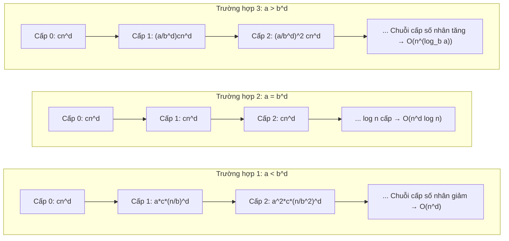
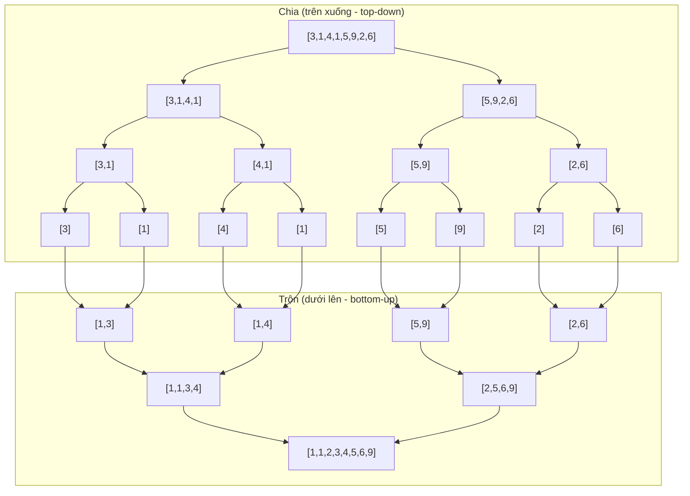
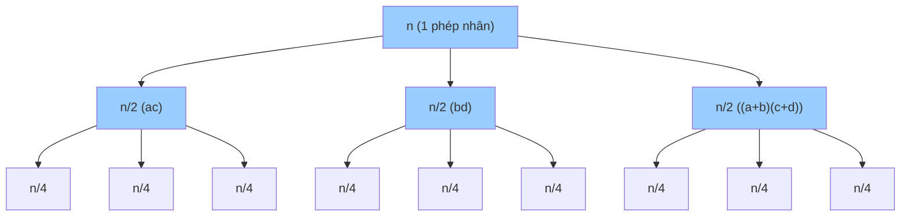

# Chương 7: Chia để trị (Divide and Conquer)

Chia để trị là một mô hình thiết kế giải thuật cực kỳ mạnh mẽ. Bản chất của nó là giải quyết một bài toán lớn bằng cách chia nhỏ thành các bài toán con cùng loại, giải đệ quy từng bài toán con, và sau đó kết hợp các lời giải con để thu được nghiệm cho bài toán lớn ban đầu. Chương học này sẽ trình bày mô hình ba bước căn bản, phân tích phương trình truy hồi, các thuật toán kinh điển, hướng dẫn khi nào nên tránh áp dụng, các bài toán phỏng vấn quan trọng, và thực hiện so sánh đối chiếu giữa Chia để trị với Quy hoạch động và giải thuật Tham lam.

---

## 1. Mô hình Thiết kế Chia để trị (The Divide and Conquer Paradigm)

### 1.1 Ba bước của mô hình

1. **Chia (Divide)**: Phân chia bài toán lớn hiện tại thành các bài toán con nhỏ hơn có tính chất tương tự.
2. **Trị (Conquer)**: Giải quyết các bài toán con bằng cách gọi đệ quy. Nếu bài toán con có kích thước đủ nhỏ, ta giải trực tiếp (Trường hợp cơ sở - Base case).
3. **Kết hợp (Combine)**: Trộn/gộp các lời giải của các bài toán con để tạo thành nghiệm cho bài toán gốc ban đầu.

**Phép so sánh trong thế giới thực**: Tổ chức một giải đấu thể thao lớn quy mô toàn quốc.
- **Chia**: Chia tất cả các vận động viên đăng ký thi đấu thành hai bảng đấu bằng nhau độc lập.
- **Trị**: Gọi đệ quy để tìm ra nhà vô địch của từng bảng đấu.
- **Kết hợp**: Cho hai nhà vô địch của hai bảng thi đấu trận chung kết để tìm ra nhà vô địch duy nhất của giải đấu.

### 1.2 Phân tích phương trình truy hồi (Recurrence Relation)

Đối với một thuật toán Chia để trị phân chia bài toán kích thước $n$ thành `a` bài toán con có kích thước bằng $n/b$, và tiêu tốn độ phức tạp $O(n^d)$ thời gian cho bước chia và bước kết hợp kết quả, phương trình truy hồi được biểu diễn dưới dạng:

$$T(n) = a \cdot T(n/b) + O(n^d)$$

Lời giải tiệm cận của phương trình này (theo Định lý thợ - Master Theorem) phụ thuộc hoàn toàn vào mối quan hệ so sánh giữa các đại lượng $a$, $b$, và $d$:

- **Trường hợp 1**: Nếu $a < b^d$, thì $T(n) = O(n^d)$ (khối lượng tính toán chủ yếu tập trung ở bước kết hợp cuối cùng).
- **Trường hợp 2**: Nếu $a = b^d$, thì $T(n) = O(n^d \log n)$.
- **Trường hợp 3**: Nếu $a > b^d$, thì $T(n) = O(n^{\log_b a})$ (khối lượng tính toán bị chi phối bởi các nút lá ở tầng sâu nhất của cây đệ quy).

**Minh họa trực quan 3 trường hợp của Định lý thợ**:


### 1.3 Mối quan hệ giữa Chia để trị và Đệ quy
Đệ quy là **cơ chế thực thi** (việc hàm tự gọi chính nó). Chia để trị là **chiến lược thiết kế** giải thuật sử dụng cơ chế đệ quy để triển khai bước "Trị". Không phải mọi giải thuật đệ quy đều là Chia để trị (ví dụ: thuật toán duyệt DFS trên đồ thị là đệ quy nhưng không phải Chia để trị, vì nó không chia bài toán lớn thành các bài toán con độc lập để giải song song).

---

## 2. Các thuật toán Chia để trị kinh điển

### 2.1 Tìm kiếm nhị phân (Binary Search)

**Bài toán**: Tìm kiếm vị trí của giá trị mục tiêu `target` trong một mảng số đã được sắp xếp tăng dần.

- **Chia**: So sánh `target` với phần tử nằm ở chính giữa mảng (`mid`).
- **Trị**: Gọi đệ quy để tiếp tục tìm kiếm trên nửa mảng bên trái (nếu `target < mid`) hoặc nửa bên phải (nếu `target > mid`).
- **Kết hợp**: Không yêu cầu bước kết hợp – chỉ đơn giản trả về trực tiếp chỉ số index tìm được.

**Phương trình truy hồi**: $T(n) = T(n/2) + O(1) \rightarrow T(n) = O(\log n)$.

```cpp
int binarySearch(vector<int>& arr, int left, int right, int target) {
    if (left > right) return -1;
    int mid = left + (right - left) / 2;
    if (arr[mid] == target) return mid;
    if (arr[mid] < target) return binarySearch(arr, mid+1, right, target);
    return binarySearch(arr, left, mid-1, target);
}
```

**Phép so sánh trong thế giới thực**: Tìm một tên người trong cuốn danh bạ điện thoại dày cộp – mở cuốn sách ở trang giữa, quyết định xem nên tiếp tục tìm ở nửa bên trái hay bên phải, lặp lại cho đến khi tìm thấy.

---

### 2.2 Sắp xếp trộn (Merge Sort)

**Bài toán**: Sắp xếp các phần tử của một mảng theo thứ tự tăng dần.

- **Chia**: Chia đôi mảng hiện tại thành hai mảng con có kích thước xấp xỉ bằng nhau.
- **Trị**: Gọi đệ quy để tiến hành sắp xếp cho từng mảng con đó.
- **Kết hợp**: Trộn (merge) hai nửa đã được sắp xếp thành một mảng kết quả duy nhất.

**Phương trình truy hồi**: $T(n) = 2T(n/2) + O(n) \rightarrow T(n) = O(n \log n)$.

```cpp
void merge(vector<int>& arr, int left, int mid, int right) {
    vector<int> temp(right - left + 1);
    int i = left, j = mid + 1, k = 0;
    while (i <= mid && j <= right) {
        temp[k++] = (arr[i] <= arr[j]) ? arr[i++] : arr[j++];
    }
    while (i <= mid) temp[k++] = arr[i++];
    while (j <= right) temp[k++] = arr[j++];
    for (int p = 0; p < temp.size(); ++p) {
        arr[left + p] = temp[p];
    }
}

void mergeSort(vector<int>& arr, int left, int right) {
    if (left >= right) return;
    int mid = left + (right - left) / 2;
    mergeSort(arr, left, mid);
    mergeSort(arr, mid+1, right);
    merge(arr, left, mid, right);
}
```

**Phép so sánh trong thế giới thực**: Sắp xếp một chồng bài kiểm tra khổng lồ của học sinh theo thứ tự bảng chữ cái – chia chồng bài thành hai nửa, phát cho hai giáo viên sắp xếp đệ quy, sau đó trộn hai chồng đã được sắp xếp bằng cách liên tục chọn tờ bài có tên nhỏ hơn ở đỉnh mỗi chồng.



---

### 2.3 Sắp xếp nhanh (Quick Sort - Dưới góc nhìn lý thuyết)

**Bài toán**: Sắp xếp mảng số tăng dần.

- **Chia**: Chọn một phần tử chốt (pivot), thực hiện phân hoạch (partition) mảng sao cho tất cả các phần tử nhỏ hơn chốt được xếp ở phía trước chốt, các phần tử lớn hơn được xếp ở phía sau chốt.
- **Trị**: Gọi đệ quy để tiếp tục sắp xếp phân hoạch cho hai nửa trái và phải của chốt.
- **Kết hợp**: Không yêu cầu bước kết hợp – mảng được sắp xếp trực tiếp tại chỗ (in-place).

**Phương trình truy hồi**:
- Trong trường hợp trung bình (chốt chia đôi tốt): $T(n) = 2T(n/2) + O(n) \rightarrow O(n \log n)$.
- Trong trường hợp xấu nhất (chốt luôn là phần tử nhỏ nhất/lớn nhất): $T(n) = T(n-1) + O(n) \rightarrow O(n^2)$.

```cpp
int partition(vector<int>& arr, int low, int high) {
    int pivot = arr[high];
    int i = low - 1;
    for (int j = low; j < high; ++j) {
        if (arr[j] < pivot) {
            swap(arr[++i], arr[j]);
        }
    }
    swap(arr[i+1], arr[high]);
    return i + 1; // Chỉ số index mới của pivot sau phân hoạch
}

void quickSort(vector<int>& arr, int low, int high) {
    if (low < high) {
        int pi = partition(arr, low, high);
        quickSort(arr, low, pi - 1);
        quickSort(arr, pi + 1, high);
    }
}
```

---

### 2.4 Tìm mảng con có tổng lớn nhất bằng Chia để trị (DAC Maximum Subarray)

**Bài toán**: Tìm mảng con liên tục có tổng các phần tử lớn nhất.

- **Chia**: Chia đôi mảng thành hai nửa trái và phải.
- **Trị**: Gọi đệ quy để tìm mảng con có tổng lớn nhất nằm trọn vẹn ở nửa bên trái và trọn vẹn ở nửa bên phải.
- **Kết hợp**: Mảng con tối ưu có thể nằm giao cắt qua ranh giới giữa – ta tính tổng lớn nhất xuất phát từ ranh giới mở rộng sang trái và sang phải (`cross sum`). Tổng kết quả sẽ là `max(leftMax, rightMax, crossMax)`.

**Phương trình truy hồi**: $T(n) = 2T(n/2) + O(n) \rightarrow O(n \log n)$ (Mặc dù thuật toán Kadane đạt hiệu năng tốt hơn với độ phức tạp $O(n)$, phiên bản Chia để trị này minh họa rất rõ nét mô hình thiết kế).

```cpp
int crossSum(vector<int>& arr, int left, int mid, int right) {
    int leftSum = INT_MIN, sum = 0;
    for (int i = mid; i >= left; --i) {
        sum += arr[i];
        leftSum = max(leftSum, sum);
    }
    int rightSum = INT_MIN;
    sum = 0;
    for (int i = mid + 1; i <= right; ++i) {
        sum += arr[i];
        rightSum = max(rightSum, sum);
    }
    return leftSum + rightSum;
}

int maxSubarrayDAC(vector<int>& arr, int left, int right) {
    if (left == right) return arr[left];
    int mid = left + (right - left) / 2;
    int leftMax = maxSubarrayDAC(arr, left, mid);
    int rightMax = maxSubarrayDAC(arr, mid + 1, right);
    int crossMax = crossSum(arr, left, mid, right);
    return max({leftMax, rightMax, crossMax});
}
```

---

### 2.5 Đếm số cặp nghịch thế (Counting Inversions)

**Bài toán**: Đếm số lượng cặp chỉ số `(i, j)` thỏa mãn ràng buộc `i < j` và `arr[i] > arr[j]` (Đại lượng đo lường độ lệch, thể hiện mảng cần biến đổi bao nhiêu lần để trở thành mảng đã sắp xếp).

**Giải pháp**: Tích hợp đếm nghịch thế vào trong quá trình sắp xếp trộn. Khi trộn hai nửa đã sắp xếp, nếu một phần tử bên phải nhỏ hơn một phần tử bên trái, nó chắc chắn sẽ tạo ra cặp nghịch thế với tất cả các phần tử còn lại nằm ở nửa bên trái.

**Phương trình truy hồi**: Tương tự sắp xếp trộn $T(n) = 2T(n/2) + O(n) \rightarrow O(n \log n)$.

```cpp
long long mergeAndCount(vector<int>& arr, int left, int mid, int right) {
    vector<int> temp;
    int i = left, j = mid + 1;
    long long invCount = 0;
    while (i <= mid && j <= right) {
        if (arr[i] <= arr[j]) {
            temp.push_back(arr[i++]);
        } else {
            temp.push_back(arr[j++]);
            invCount += (mid - i + 1); // Tất cả các phần tử còn lại của bên trái đều lớn hơn arr[j]
        }
    }
    while (i <= mid) temp.push_back(arr[i++]);
    while (j <= right) temp.push_back(arr[j++]);
    for (int k = 0; k < temp.size(); ++k) arr[left + k] = temp[k];
    return invCount;
}

long long countInversions(vector<int>& arr, int left, int right) {
    if (left >= right) return 0;
    int mid = left + (right - left) / 2;
    long long inv = countInversions(arr, left, mid);
    inv += countInversions(arr, mid + 1, right);
    inv += mergeAndCount(arr, left, mid, right);
    return inv;
}
```

---

### 2.6 Thuật toán nhân nhanh Karatsuba (Karatsuba Algorithm)

**Bài toán**: Thực hiện phép nhân hai số nguyên cực lớn (hoặc hai đa thức) nhanh hơn phương pháp đặt tính nhân hàng dọc tiêu chuẩn độ phức tạp $O(n^2)$.

**Ý tưởng toán học**: Biểu diễn hai số có $n$ chữ số là $x$ và $y$ dưới dạng:
$$x = a \cdot 10^{n/2} + b$$
$$y = c \cdot 10^{n/2} + d$$

Nếu tính toán theo công thức nhân thông thường: $x \cdot y = ac \cdot 10^n + (ad + bc) \cdot 10^{n/2} + bd$. Thao tác này đòi hỏi 4 phép nhân số lớn ($ac$, $ad$, $bc$, $bd$) $\rightarrow$ độ phức tạp $O(n^2)$.

Karatsuba nhận xét rằng ta chỉ cần thực hiện 3 phép nhân số lớn:
1. $ac = \text{karatsuba}(a, c)$
2. $bd = \text{karatsuba}(b, d)$
3. Thao tác thông minh: $(ad + bc) = \text{karatsuba}(a+b, c+d) - ac - bd$

**Phương trình truy hồi**: $T(n) = 3T(n/2) + O(n) \rightarrow O(n^{\log_2 3}) \approx O(n^{1.585})$.

```cpp
long long karatsuba(long long x, long long y) {
    if (x < 10 || y < 10) return x * y;
    int n = max(to_string(x).size(), to_string(y).size());
    int m = n / 2;
    long long power = pow(10, m);
    long long a = x / power, b = x % power;
    long long c = y / power, d = y % power;
    long long ac = karatsuba(a, c);
    long long bd = karatsuba(b, d);
    long long sum = karatsuba(a + b, c + d) - ac - bd;
    return ac * pow(10, 2*m) + sum * pow(10, m) + bd;
}
```



---

### 2.7 Tìm cặp điểm gần nhau nhất trên mặt phẳng (Closest Pair of Points)

**Bài toán**: Cho tập hợp gồm $n$ điểm trên mặt phẳng 2D, hãy tìm hai điểm có khoảng cách Euclidean nhỏ nhất.

- **Chia**: Sắp xếp các điểm theo trục hoành. Tìm điểm trung vị và vẽ đường thẳng đứng phân chia không gian thành hai nửa trái và phải.
- **Trị**: Gọi đệ quy để tìm cặp điểm có khoảng cách nhỏ nhất ở nửa bên trái và ở nửa bên phải. Gọi khoảng cách nhỏ nhất thu được là $\delta = \min(\text{leftMin}, \text{rightMin})$.
- **Kết hợp**: Cặp điểm gần nhau nhất có thể nằm giao cắt qua đường phân chia—ta chỉ cần xem xét các điểm nằm trong dải phân cách có chiều rộng $2\delta$ đối xứng qua đường thẳng đứng. Sắp xếp các điểm trong dải này theo trục tung và thực hiện so khớp từng điểm với một số lượng hằng số các điểm kế tiếp.

**Phương trình truy hồi**: $T(n) = 2T(n/2) + O(n \log n)$ (Nếu sắp xếp trục tung tại mỗi bước) $\rightarrow$ Có thể tối ưu hóa bước trộn thành $O(n)$ bằng cách kế thừa kết quả sắp xếp từ dưới lên $\rightarrow T(n) = 2T(n/2) + O(n) \rightarrow O(n \log n)$.

---

### 2.8 Tính lũy thừa nhanh (Fast Exponentiation)

**Bài toán**: Tính toán lũy thừa $a^b$ một cách tối ưu.

- **Chia**: Nếu số mũ $b$ chẵn: $a^b = (a^{b/2})^2$. Nếu $b$ lẻ: $a^b = a \cdot a^{b-1}$.
- **Trị**: Gọi đệ quy để tính toán lũy thừa nhỏ hơn $a^{b/2}$.
- **Kết hợp**: Bình phương kết quả nhận được (hoặc nhân thêm $a$ đối với trường hợp số mũ lẻ).

**Phương trình truy hồi**: $T(n) = T(n/2) + O(1) \rightarrow O(\log b)$.

```cpp
long long fastPow(long long a, long long b) {
    if (b == 0) return 1;
    long long half = fastPow(a, b / 2);
    if (b % 2 == 0) return half * half;
    return half * half * a;
}
```

---

## 3. So sánh Chia để trị với các mô hình thiết kế khác

### 3.1 Chia để trị so với Quy hoạch động (Divide & Conquer vs DP)

| Tiêu chí | Mô hình Chia để trị | Quy hoạch động (Dynamic Programming) |
| :--- | :--- | :--- |
| **Tính chất bài toán con** | Độc lập hoàn toàn (không chồng lấn - non‑overlapping). | Trùng lặp / chồng lấn rất nhiều (overlapping subproblems). |
| **Lĩnh vực giải quyết** | Sắp xếp dữ liệu, tìm kiếm nhị phân, nhân nhanh (ví dụ: Merge sort, Quick sort). | Tối ưu hóa các trạng thái liên quan (ví dụ: cái túi Knapsack, LCS, dãy con tăng dài nhất). |
| **Cơ chế lưu đệm** | Không cần lưu trữ đệm kết quả. | Bắt buộc sử dụng Lập bảng (Tabulation) hoặc Ghi nhớ (Memoisation). |

**Nhận thức mấu chốt**: Chia để trị xử lý các bài toán con **độc lập** không giao nhau. Quy hoạch động xử lý các bài toán con **trùng nhau**, nơi kết quả bài toán con trước được tái sử dụng để tính bài toán con sau.

### 3.2 Chia để trị so với Giải thuật tham lam (Divide & Conquer vs Greedy)

| Tiêu chí | Mô hình Chia để trị | Giải thuật tham lam (Greedy) |
| :--- | :--- | :--- |
| **Cơ chế quyết định** | Giải quyết tất cả các bài toán con, sau đó gộp kết quả. | Đưa ra một lựa chọn tối ưu cục bộ duy nhất tại mỗi bước, không bao giờ quay lại. |
| **Tính chính xác** | Luôn đảm bảo tính chính xác nếu quá trình đệ quy và trộn đúng. | Đòi hỏi phải chứng minh được đặc tính lựa chọn tham lam thì giải thuật mới chính xác. |

---

## 4. Bảng tổng hợp các thuật toán Chia để trị

| Thuật toán | Bước Chia | Bước Kết hợp | Phương trình truy hồi | Độ phức tạp thời gian |
| :--- | :--- | :--- | :--- | :--- |
| **Tìm kiếm nhị phân** | So sánh chốt giữa | Không có | $T(n) = T(n/2) + O(1)$ | $O(\log n)$ |
| **Sắp xếp trộn** | Chia đôi mảng | Trộn 2 nửa đã sắp xếp | $T(n) = 2T(n/2) + O(n)$ | $O(n \log n)$ |
| **Sắp xếp nhanh** | Phân hoạch quanh pivot | Không có (tại chỗ) | Trung bình: $2T(n/2)+O(n)$ | Tb: $O(n \log n)$, Xấu: $O(n^2)$ |
| **Tổng mảng con DAC** | Chia đôi mảng | Tính tổng cắt ngang | $T(n) = 2T(n/2) + O(n)$ | $O(n \log n)$ |
| **Đếm nghịch thế** | Chia đôi mảng | Đếm nghịch thế khi trộn | $T(n) = 2T(n/2) + O(n)$ | $O(n \log n)$ |
| **Karatsuba** | Chia đôi độ dài số | Kết hợp qua 3 phép nhân | $T(n) = 3T(n/2) + O(n)$ | $O(n^{1.585})$ |
| **Cặp điểm gần nhất** | Chia đôi trục hoành | Duyệt dải phân cách rộng $2\delta$ | $T(n) = 2T(n/2) + O(n)$ | $O(n \log n)$ |
| **Lũy thừa nhanh** | Chia đôi số mũ | Bình phương kết quả | $T(n) = T(n/2) + O(1)$ | $O(\log b)$ |

---

## 5. Khi nào KHÔNG nên áp dụng Chia để trị

Mặc dù có tính thẩm mỹ và tính học thuật cao, Chia để trị không phải là viên đạn bạc cho mọi bài toán. Việc nhận biết khi nào nên tránh áp dụng nó là cực kỳ quan trọng.

### 5.1 Các bài toán con trùng lặp $\rightarrow$ Nên chuyển sang Quy hoạch động
Nếu các bài toán con không độc lập mà trùng lặp lặp đi lặp lại rất nhiều lần, thuật toán Chia để trị đệ quy thô sơ sẽ tính toán lại cùng một bài toán con vô số lần, dẫn đến độ phức tạp lũy thừa cực kỳ chậm chạp.

**Ví dụ**: Hàm tính số Fibonacci đệ quy thô sơ `fib(n) = fib(n-1) + fib(n-2)` liên tục tính toán lại các số Fibonacci nhỏ hơn theo cấp số lũy thừa $O(2^n)$. Tiếp cận bằng Quy hoạch động giải quyết trong thời gian tuyến tính $O(n)$.

### 5.2 Chi phí cho bước Kết hợp quá đắt đỏ
Nếu bước Trộn/Kết hợp lời giải con tiêu tốn quá nhiều tài nguyên, nó sẽ lấn át hoàn toàn ưu thế của việc chia nhỏ bài toán.

**Ví dụ**: Phép nhân ma trận đệ quy thô sơ (chia thành 4 ma trận con và thực hiện 8 phép nhân) có bước kết hợp là phép cộng các ma trận mất $O(n^2)$ nhưng tổng thể giải thuật vẫn tiêu tốn độ phức tạp $O(n^3)$—không hề cải thiện hơn so với nhân ma trận thô sơ. Chỉ khi thuật toán Strassen giảm số phép nhân số lớn xuống còn 7, bước kết hợp mới phát huy hiệu quả thực sự đối với các ma trận có kích thước cực kỳ lớn.

### 5.3 Kích thước bài toán con thu hẹp không đáng kể
Nếu bài toán con sau khi chia không có kích thước giảm đi đáng kể (ví dụ: mỗi bước đệ quy chỉ giảm đi 1 hoặc 2 phần tử), độ sâu cây đệ quy sẽ đạt $O(n)$ và tổng độ phức tạp thời gian có thể bị suy thoái thành $O(n^2)$ hoặc tệ hơn.

**Ví dụ**: Sắp xếp nhanh Quick sort chọn phải chốt pivot tồi (như luôn chọn phần tử nhỏ nhất/lớn nhất) sẽ khiến bài toán con bị lệch và suy thoái thành độ phức tạp $O(n^2)$. Đối với các trường hợp này, các giải thuật lặp hoặc mô hình sắp xếp khác (như Heap sort) sẽ ổn định hơn.

### 5.4 Chi phí phụ đệ quy của hệ thống quá lớn
Đối với các tập dữ liệu có kích thước nhỏ, chi phí phụ (overhead) của việc gọi hàm đệ quy liên tục và cấp phát ngăn xếp hệ thống sẽ lấn át hoàn toàn hiệu năng của Chia để trị. Trong thực tế lập trình sản xuất, các thuật toán Chia để trị luôn được viết dưới dạng **giải thuật lai (hybrid approach)**: chủ động chuyển đổi sang các giải thuật lặp đơn giản (như sắp xếp chèn insertion sort) khi kích thước mảng con giảm xuống dưới một giới hạn nhất định (ví dụ: mảng con có ít hơn 10 phần tử).

---

## 6. Các bài toán Phỏng vấn quan trọng (Divide & Conquer)

Các bài toán dưới đây thường xuyên xuất hiện trong các cuộc phỏng vấn kỹ thuật của các hãng công nghệ lớn nhờ sở hữu các giải pháp Chia để trị vô cùng đẹp mắt.

### 6.1 Tìm phần tử đa số (Majority Element - Phiên bản DAC)

**Bài toán**: Tìm phần tử xuất hiện nhiều hơn $\lfloor n/2 \rfloor$ lần trong một mảng số cho trước.

**Giải pháp Chia để trị**: Chia mảng thành hai nửa trái và phải. Tìm ứng viên phần tử đa số của nửa bên trái và nửa bên phải. Nếu chúng giống nhau, đó chính là phần tử đa số của toàn bộ mảng. Nếu chúng khác nhau, ta đếm tần suất xuất hiện thực tế của cả hai ứng viên trên toàn bộ mảng—ứng viên nào có số lần xuất hiện nhiều hơn sẽ là kết quả chính xác.

**Phương trình truy hồi**: $T(n) = 2T(n/2) + O(n) \rightarrow O(n \log n)$ (Mặc dù thuật toán bầu cử đa số Boyer-Moore giải quyết tối ưu hơn trong thời gian tuyến tính $O(n)$, cách tiếp cận Chia để trị này mang tính giáo khoa sâu sắc).

```cpp
int countFreq(vector<int>& nums, int target, int left, int right) {
    int cnt = 0;
    for (int i = left; i <= right; ++i) {
        if (nums[i] == target) cnt++;
    }
    return cnt;
}

int majorityElementDC(vector<int>& nums, int left, int right) {
    if (left == right) return nums[left];
    int mid = left + (right - left) / 2;
    int leftMaj = majorityElementDC(nums, left, mid);
    int rightMaj = majorityElementDC(nums, mid + 1, right);
    if (leftMaj == rightMaj) return leftMaj;
    
    int leftCount = countFreq(nums, leftMaj, left, right);
    int rightCount = countFreq(nums, rightMaj, left, right);
    return leftCount > rightCount ? leftMaj : rightMaj;
}
```

### 6.2 Bài toán đường chân trời (The Skyline Problem)

**Bài toán**: Cho trước tọa độ của một loạt tòa nhà dạng hình chữ nhật đứng, hãy trả về hình chiếu đường chân trời (dạng danh sách các điểm nút mà tại đó có sự thay đổi về độ cao của các tòa nhà).

**Giải pháp Chia để trị**:
- Chia danh sách các tòa nhà làm hai nửa bằng nhau.
- Gọi đệ quy để tính toán đường chân trời độc lập của từng nửa.
- Trộn (merge) hai đường chân trời thu được bằng kỹ thuật hai con trỏ quét từ trái qua phải, liên tục duy trì độ cao lớn nhất của các tòa nhà.
- **Độ phức tạp**: Thời gian $O(n \log n)$, không gian $O(n)$.

---

### 6.3 Tìm kiếm trên mảng xoay vòng đã sắp xếp (Search in Rotated Sorted Array)

**Bài toán**: Một mảng đã sắp xếp tăng dần bị xoay vòng tại một điểm chốt không xác định. Hãy tìm vị trí của giá trị `target` trong thời gian $O(\log n)$.

**Giải pháp**: Áp dụng mô hình Chia để trị / Tìm kiếm nhị phân cải tiến. Xác định xem nửa mảng nào (bên trái hay bên phải của chốt `mid`) đang giữ nguyên tính chất sắp xếp tăng dần, từ đó đưa ra quyết định co cụm phạm vi tìm kiếm.

```cpp
int searchRotated(vector<int>& nums, int target) {
    int left = 0, right = nums.size() - 1;
    while (left <= right) {
        int mid = left + (right - left) / 2;
        if (nums[mid] == target) return mid;
        
        if (nums[left] <= nums[mid]) { // Nửa bên trái được sắp xếp tuần tự
            if (target >= nums[left] && target < nums[mid]) {
                right = mid - 1; // Thu hẹp về bên trái
            } else {
                left = mid + 1;  // Tìm kiếm ở bên phải
            }
        } else { // Nửa bên phải được sắp xếp tuần tự
            if (target > nums[mid] && target <= nums[right]) {
                left = mid + 1;  // Thu hẹp về bên phải
            } else {
                right = mid - 1; // Tìm kiếm ở bên trái
            }
        }
    }
    return -1;
}
```
- **Độ phức tạp thời gian**: $O(\log n)$. Đây là một biến thể kinh điển của mô hình Chia để trị nhị phân.

---

### 6.4 Trung vị của hai mảng đã sắp xếp (Median of Two Sorted Arrays)

**Bài toán**: Tìm giá trị trung vị của hai mảng số đã sắp xếp có kích thước $m$ và $n$ trong thời gian tối ưu $O(\log(m+n))$.

**Giải pháp**: Sử dụng tìm kiếm nhị phân / Chia để trị để tìm vị trí phân hoạch hoàn hảo trên hai mảng, sao cho số lượng phần tử ở nửa trái bằng nửa phải, và giá trị lớn nhất của nửa trái luôn bé hơn hoặc bằng giá trị nhỏ nhất của nửa phải.

```cpp
double findMedianSortedArrays(vector<int>& nums1, vector<int>& nums2) {
    if (nums1.size() > nums2.size()) {
        return findMedianSortedArrays(nums2, nums1); // Bảo đảm thực hiện tìm kiếm trên mảng nhỏ hơn
    }
    int m = nums1.size(), n = nums2.size();
    int low = 0, high = m;
    while (low <= high) {
        int partition1 = (low + high) / 2;
        int partition2 = (m + n + 1) / 2 - partition1;
        
        int maxLeft1 = (partition1 == 0) ? INT_MIN : nums1[partition1 - 1];
        int minRight1 = (partition1 == m) ? INT_MAX : nums1[partition1];
        int maxLeft2 = (partition2 == 0) ? INT_MIN : nums2[partition2 - 1];
        int minRight2 = (partition2 == n) ? INT_MAX : nums2[partition2];
        
        if (maxLeft1 <= minRight2 && maxLeft2 <= minRight1) {
            if ((m + n) % 2 == 0) {
                return (max(maxLeft1, maxLeft2) + min(minRight1, minRight2)) / 2.0;
            } else {
                return max(maxLeft1, maxLeft2);
            }
        } else if (maxLeft1 > minRight2) {
            high = partition1 - 1; // Dịch chuyển phân hoạch sang trái
        } else {
            low = partition1 + 1;  // Dịch chuyển phân hoạch sang phải
        }
    }
    return 0.0;
}
```
- **Độ phức tạp thời gian**: $O(\log(\min(m, n)))$. Thuật toán thực hiện tìm kiếm nhị phân đệ quy trên mảng có kích thước nhỏ hơn để đạt hiệu năng tối đa.

---

## 7. Cẩm nang tra cứu nhanh khi thiết kế giải thuật

| Điều kiện bài toán | Hướng tiếp cận khuyến nghị |
| :--- | :--- |
| Bài toán có thể chia thành các bài toán con hoàn toàn độc lập | ✅ Ưu tiên áp dụng **Chia để trị** |
| Các bài toán con bị trùng lặp / chồng chéo lên nhau rất nhiều | ❌ Dùng giải thuật **Quy hoạch động** |
| Bước kết hợp trộn kết quả đạt hiệu năng tuyến tính $O(n)$ hoặc $O(n \log n)$ và kích thước bài toán con giảm đi một nửa | ✅ Áp dụng **Chia để trị** sẽ rất tối ưu |
| Bước kết hợp trộn kết quả quá phức tạp đạt $O(n^2)$ hoặc cao hơn | ❌ Cân nhắc giải pháp thay thế |
| Bài toán có cấu trúc phân cấp đệ quy tự nhiên | ✅ **Chia để trị** là lựa chọn tự nhiên nhất |

Chương tiếp theo sẽ đi sâu vào cấu trúc dữ liệu và giải thuật **Sắp xếp và Tìm kiếm (Sorting and Searching)**, so sánh chi tiết các đặc tính tối ưu của từng thuật toán sắp xếp cụ thể.
