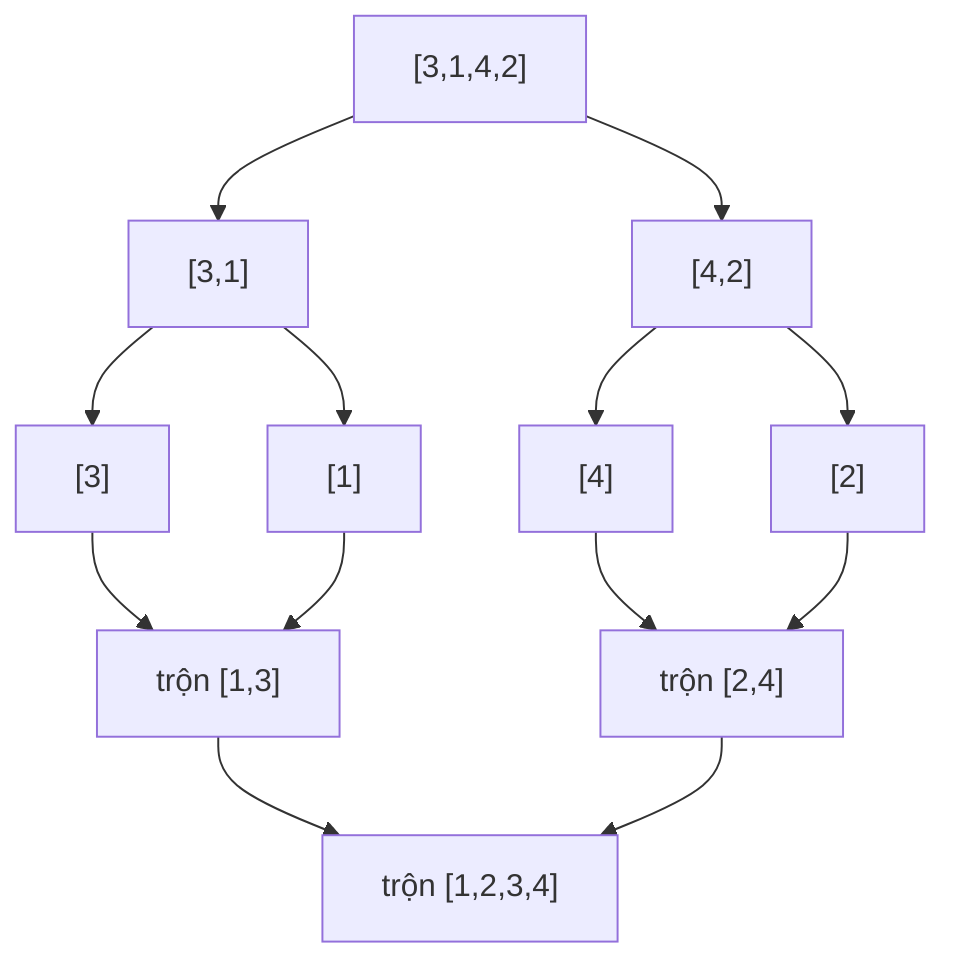

# Chương 8: Sắp xếp và Tìm kiếm (Sorting and Searching)

Chương này trang bị kiến thức về các giải thuật Sắp xếp cốt lõi (bao gồm sắp xếp dựa trên so sánh và không dựa trên so sánh) và các kỹ thuật Tìm kiếm, bao gồm cả các biến thể nâng cao của tìm kiếm nhị phân. Mỗi thuật toán đều đi kèm phân tích độ phức tạp tiệm cận, tính ổn định (stability), thuộc tính sắp xếp tại chỗ (in-place) và mã nguồn cài đặt mẫu bằng C++.

---

## 1. Tổng quan về các giải thuật Sắp xếp

Sắp xếp là quá trình tổ chức các phần tử dữ liệu theo một trật tự cụ thể (tăng dần hoặc giảm dần). Việc lựa chọn thuật toán tối ưu phụ thuộc hoàn toàn vào kích thước đầu vào, đặc điểm phân bố dữ liệu và giới hạn không gian bộ nhớ của hệ thống.

### 1.1 Bảng so sánh các giải thuật Sắp xếp

| Thuật toán | Trường hợp tốt nhất | Trường hợp trung bình | Trường hợp xấu nhất | Bộ nhớ bổ trợ | Tính ổn định | Tại chỗ |
| :--- | :--- | :--- | :--- | :--- | :--- | :--- |
| **Sắp xếp nổi bọt** (Bubble) | $O(n)$ | $O(n^2)$ | $O(n^2)$ | $O(1)$ | Có | Có |
| **Sắp xếp chọn** (Selection) | $O(n^2)$ | $O(n^2)$ | $O(n^2)$ | $O(1)$ | Không | Có |
| **Sắp xếp chèn** (Insertion) | $O(n)$ | $O(n^2)$ | $O(n^2)$ | $O(1)$ | Có | Có |
| **Sắp xếp trộn** (Merge) | $O(n \log n)$ | $O(n \log n)$ | $O(n \log n)$ | $O(n)$ | Có | Không |
| **Sắp xếp nhanh** (Quick) | $O(n \log n)$ | $O(n \log n)$ | $O(n^2)$ | $O(\log n)$ | Không | Có |
| **Sắp xếp đống** (Heap) | $O(n \log n)$ | $O(n \log n)$ | $O(n \log n)$ | $O(1)$ | Không | Có |
| **Sắp xếp đếm** (Counting) | $O(n+k)$ | $O(n+k)$ | $O(n+k)$ | $O(k)$ | Có | Không |
| **Sắp xếp cơ số** (Radix) | $O(nk)$ | $O(nk)$ | $O(nk)$ | $O(n+k)$ | Có | Không |

---

### 1.2 Các khái niệm cốt lõi cần nhớ
- **Sắp xếp dựa trên so sánh (Comparison‑based sort)**: Thuật toán đưa ra quyết định sắp xếp hoàn toàn dựa trên việc so sánh các cặp phần tử (sử dụng toán tử `<`, `>`). Giới hạn dưới toán học cho trường hợp xấu nhất của lớp giải thuật này là $\Omega(n \log n)$.
- **Sắp xếp không dựa trên so sánh (Non‑comparison sort)**: Sử dụng các thuộc tính số học hoặc cấu trúc chữ số của khóa dữ liệu. Có thể đạt hiệu năng siêu tốc $O(n)$ trong các điều kiện ràng buộc cụ thể.
- **Sắp xếp tại chỗ (In‑place)**: Thuật toán thực hiện sắp xếp trực tiếp trên mảng gốc, chỉ tiêu tốn lượng không gian bộ nhớ bổ trợ hằng số $O(1)$.
- **Sắp xếp ổn định (Stable)**: Thuật toán bảo toàn nguyên vẹn thứ tự ban đầu của các phần tử có giá trị bằng nhau.
- **Sắp xếp thích ứng (Adaptive)**: Thuật toán có hiệu năng thực thi nhanh hơn một cách tự nhiên nếu mảng đầu vào đã được sắp xếp một phần từ trước (ví dụ: Sắp xếp chèn, sắp xếp nổi bọt).

---

## 2. Giải thuật Sắp xếp dựa trên so sánh (Comparison‑Based Sorts)

### 2.1 Sắp xếp nổi bọt (Bubble Sort)

**Bản chất (What)**: Duyệt mảng liên tục, thực hiện so sánh và đổi chỗ các cặp phần tử kề nhau nếu chúng bị ngược trật tự, từ đó đẩy dần phần tử lớn nhất về cuối mảng sau mỗi lượt duyệt.

**Khi nào nên áp dụng**: Phục vụ mục đích giảng dạy học thuật, hoặc xử lý các mảng có kích thước rất nhỏ và đã gần như được sắp xếp hoàn chỉnh.

```cpp
void bubbleSort(vector<int>& arr) {
    int n = arr.size();
    for (int i = 0; i < n - 1; ++i) {
        bool swapped = false;
        for (int j = 0; j < n - i - 1; ++j) {
            if (arr[j] > arr[j + 1]) {
                swap(arr[j], arr[j + 1]);
                swapped = true;
            }
        }
        if (!swapped) break; // Tính thích ứng: dừng sớm nếu không có biến động
    }
}
```

**Phép so sánh trong thế giới thực**: Các bọt khí nổi lên trong cốc nước có ga—các bọt khí lớn hơn (phần tử lớn hơn) sẽ di chuyển lên trên nhanh hơn và xuất hiện ở đỉnh trước tiên.

---

### 2.2 Sắp xếp chọn (Selection Sort)

**Bản chất (What)**: Chia mảng thành hai phần (đã sắp xếp và chưa sắp xếp). Liên tục tìm kiếm phần tử nhỏ nhất từ phần chưa sắp xếp và hoán đổi vị trí của nó với phần tử đầu tiên của vùng này.

```cpp
void selectionSort(vector<int>& arr) {
    int n = arr.size();
    for (int i = 0; i < n - 1; ++i) {
        int minIdx = i;
        for (int j = i + 1; j < n; ++j) {
            if (arr[j] < arr[minIdx]) {
                minIdx = j;
            }
        }
        swap(arr[i], arr[minIdx]);
    }
}
```

**Khi nào nên áp dụng**: Khi chi phí thực hiện thao tác ghi đè lên bộ nhớ là cực kỳ đắt đỏ, vì Selection Sort cam kết số lần hoán đổi phần tử tối thiểu là tuyến tính $O(n)$.

---

### 2.3 Sắp xếp chèn (Insertion Sort)

**Bản chất (What)**: Xây dựng mảng đã sắp xếp bằng cách duyệt qua từng phần tử chưa sắp xếp và chèn nó vào vị trí chính xác trong phần mảng đã sắp xếp trước đó.

```cpp
void insertionSort(vector<int>& arr) {
    int n = arr.size();
    for (int i = 1; i < n; ++i) {
        int key = arr[i];
        int j = i - 1;
        while (j >= 0 && arr[j] > key) {
            arr[j + 1] = arr[j]; // Dịch các phần tử lớn hơn sang phải
            j--;
        }
        arr[j + 1] = key;
    }
}
```

**Khi nào nên áp dụng**: Các mảng có kích thước nhỏ ($n \le 20$), mảng đã được sắp xếp một phần từ trước, hoặc khi cần sắp xếp trực tuyến (online sorting - dữ liệu đầu vào liên tục đổ về dưới dạng luồng stream).

**Phép so sánh trong thế giới thực**: Sắp xếp các quân bài trên tay—bạn rút một quân bài mới và chèn nó vào đúng vị trí thích hợp giữa các quân bài đã được sắp xếp trước đó.

---

### 2.4 Sắp xếp trộn (Merge Sort)

**Bản chất (What)**: Áp dụng mô hình Chia để trị: chia đôi mảng thành hai nửa, gọi đệ quy sắp xếp độc lập từng nửa, sau đó trộn hai nửa đã sắp xếp thành một mảng hoàn chỉnh.

```cpp
void merge(vector<int>& arr, int left, int mid, int right) {
    vector<int> temp(right - left + 1);
    int i = left, j = mid + 1, k = 0;
    while (i <= mid && j <= right) {
        temp[k++] = (arr[i] <= arr[j]) ? arr[i++] : arr[j++];
    }
    while (i <= mid) temp[k++] = arr[i++];
    while (j <= right) temp[k++] = arr[j++];
    for (int p = 0; p < temp.size(); ++p) {
        arr[left + p] = temp[p];
    }
}

void mergeSort(vector<int>& arr, int left, int right) {
    if (left >= right) return;
    int mid = left + (right - left) / 2;
    mergeSort(arr, left, mid);
    mergeSort(arr, mid + 1, right);
    merge(arr, left, mid, right);
}
```

**Khi nào nên áp dụng**: Tập dữ liệu lớn, yêu cầu thuật toán sắp xếp ổn định bắt buộc, hoặc khi sắp xếp danh sách liên kết (vì danh sách liên kết không tốn thêm bộ nhớ mảng phụ $O(n)$ để trộn).

- **Độ phức tạp thời gian**: Luôn ổn định ở mức $O(n \log n)$.
- **Độ phức tạp không gian**: Tiêu tốn $O(n)$ bộ nhớ mảng phụ đối với cấu trúc mảng.



---

### 2.5 Sắp xếp nhanh (Quick Sort)

**Bản chất (What)**: Chọn một phần tử chốt (pivot), thực hiện phân hoạch mảng thành hai vùng (các phần tử nhỏ hơn chốt và các phần tử lớn hơn chốt), sau đó gọi đệ quy sắp xếp độc lập hai vùng đó.

```cpp
int partition(vector<int>& arr, int low, int high) {
    int pivot = arr[high];
    int i = low - 1;
    for (int j = low; j < high; ++j) {
        if (arr[j] < pivot) {
            swap(arr[++i], arr[j]);
        }
    }
    swap(arr[i+1], arr[high]);
    return i + 1;
}

void quickSort(vector<int>& arr, int low, int high) {
    if (low < high) {
        int pi = partition(arr, low, high);
        quickSort(arr, low, pi - 1);
        quickSort(arr, pi + 1, high);
    }
}
```

**Khi nào nên áp dụng**: Mục đích sắp xếp chung, đây là thuật toán có tốc độ thực thi trong thực tế nhanh nhất ở trường hợp trung bình, sắp xếp trực tiếp tại chỗ. Cần tránh áp dụng trực tiếp trên dữ liệu đã sắp xếp sẵn (hoặc phải dùng kỹ thuật chọn chốt ngẫu nhiên).

---

### 2.6 Sắp xếp đống (Heap Sort)

**Bản chất (What)**: Xây dựng một đống cực đại (max-heap) từ mảng đầu vào, liên tục đưa phần tử gốc cực đại về cuối mảng và vun lại đống cho phần còn lại.

```cpp
void heapify(vector<int>& arr, int n, int i) {
    int largest = i;
    int left = 2 * i + 1, right = 2 * i + 2;
    if (left < n && arr[left] > arr[largest]) largest = left;
    if (right < n && arr[right] > arr[largest]) largest = right;
    if (largest != i) {
        swap(arr[i], arr[largest]);
        heapify(arr, n, largest);
    }
}

void heapSort(vector<int>& arr) {
    int n = arr.size();
    for (int i = n/2 - 1; i >= 0; --i) heapify(arr, n, i);
    for (int i = n - 1; i > 0; --i) {
        swap(arr[0], arr[i]);
        heapify(arr, i, 0); // Vun đống lại cho phần còn lại
    }
}
```

**Khi nào nên áp dụng**: Đảm bảo tuyệt đối hiệu năng tiệm cận $O(n \log n)$ trong mọi trường hợp, tiết kiệm bộ nhớ với $O(1)$ không gian bổ trợ. Tuy nhiên giải thuật này không ổn định và trong thực tế chậm hơn một chút so với Quick Sort.

---

## 3. Sắp xếp không dựa trên so sánh (Non‑Comparison Sorts)

### 3.1 Sắp xếp đếm (Counting Sort)

**Bản chất (What)**: Thống kê số lần xuất hiện của mỗi giá trị cụ thể (giả định khóa số nằm trong một khoảng hẹp giới hạn $[0..k-1]$), sau đó tính tổng tiền tố cộng dồn để xác định chính xác vị trí index đầu ra của mỗi phần tử.

```cpp
void countingSort(vector<int>& arr) {
    if (arr.empty()) return;
    int maxVal = *max_element(arr.begin(), arr.end());
    int minVal = *min_element(arr.begin(), arr.end());
    int range = maxVal - minVal + 1;
    vector<int> count(range, 0), output(arr.size());
    for (int x : arr) count[x - minVal]++;
    for (int i = 1; i < range; ++i) count[i] += count[i-1];
    for (int i = arr.size() - 1; i >= 0; --i) {
        output[count[arr[i] - minVal] - 1] = arr[i];
        count[arr[i] - minVal]--;
    }
    arr = output;
}
```

**Khi nào nên áp dụng**: Khi phạm vi giá trị cực đại $k$ không quá vượt trội so với số lượng phần tử $n$ ($k = O(n)$).

---

### 3.2 Sắp xếp cơ số (Radix Sort)

**Bản chất (What)**: Tiến hành sắp xếp các chữ số của khóa từ hàng đơn vị ít quan trọng nhất (least significant digit) lên hàng lớn nhất (most significant digit) bằng cách sử dụng một thuật toán sắp xếp ổn định trung gian (thường dùng sắp xếp đếm).

```cpp
void countingSortByDigit(vector<int>& arr, int exp) {
    vector<int> output(arr.size());
    int count[10] = {0};
    for (int x : arr) count[(x / exp) % 10]++;
    for (int i = 1; i < 10; ++i) count[i] += count[i-1];
    for (int i = arr.size() - 1; i >= 0; --i) {
        int digit = (arr[i] / exp) % 10;
        output[count[digit] - 1] = arr[i];
        count[digit]--;
    }
    arr = output;
}

void radixSort(vector<int>& arr) {
    int maxVal = *max_element(arr.begin(), arr.end());
    for (int exp = 1; maxVal / exp > 0; exp *= 10) {
        countingSortByDigit(arr, exp);
    }
}
```

**Khi nào nên áp dụng**: Sắp xếp các khóa số nguyên có độ dài chữ số cố định, khoảng giá trị lớn nhưng số lượng chữ số cấu thành nhỏ.

---

## 4. Giải thuật Tìm kiếm (Searching)

### 4.1 Tìm kiếm tuyến tính (Linear Search)

**Bản chất (What)**: Duyệt qua tuần tự từng phần tử từ đầu đến cuối mảng cho đến khi tìm thấy phần tử mục tiêu.

```cpp
int linearSearch(vector<int>& arr, int target) {
    for (int i = 0; i < arr.size(); ++i) {
        if (arr[i] == target) return i;
    }
    return -1;
}
```
- **Khi nào nên áp dụng**: Dữ liệu chưa được sắp xếp, mảng có kích thước nhỏ, hoặc cấu trúc dữ liệu không hỗ trợ truy xuất ngẫu nhiên (như danh sách liên kết).

---

### 4.2 Tìm kiếm nhị phân (Binary Search)

**Bản chất (What)**: Liên tục chia đôi khoảng tìm kiếm của mảng đã sắp xếp và chủ động loại bỏ nửa khoảng chắc chắn không chứa giá trị mục tiêu.

```cpp
int binarySearchIterative(vector<int>& arr, int target) {
    int left = 0, right = arr.size() - 1;
    while (left <= right) {
        int mid = left + (right - left) / 2;
        if (arr[mid] == target) return mid;
        else if (arr[mid] < target) left = mid + 1;
        else right = mid - 1;
    }
    return -1;
}

int binarySearchRecursive(vector<int>& arr, int left, int right, int target) {
    if (left > right) return -1;
    int mid = left + (right - left) / 2;
    if (arr[mid] == target) return mid;
    if (arr[mid] < target) return binarySearchRecursive(arr, mid + 1, right, target);
    return binarySearchRecursive(arr, left, mid - 1, target);
}
```
- **Độ phức tạp thời gian**: $O(\log n)$.
- **Độ phức tạp không gian**: Vòng lặp mất $O(1)$, đệ quy mất $O(\log n)$ không gian bộ nhớ ngăn xếp.

---

### 4.3 Các biến thể nâng cao của Tìm kiếm nhị phân

#### Tìm vị trí xuất hiện đầu tiên (First Occurrence)
Trả về chỉ số index nhỏ nhất chứa phần tử mục tiêu trong mảng có chứa các phần tử trùng lặp.

```cpp
int firstOccurrence(vector<int>& arr, int target) {
    int left = 0, right = arr.size() - 1, result = -1;
    while (left <= right) {
        int mid = left + (right - left) / 2;
        if (arr[mid] == target) {
            result = mid;
            right = mid - 1;  // Tiếp tục thu hẹp tìm kiếm sang bên trái
        } else if (arr[mid] < target) {
            left = mid + 1;
        } else {
            right = mid - 1;
        }
    }
    return result;
}
```

#### Tìm vị trí xuất hiện cuối cùng (Last Occurrence)
Tương tự như trên, nhưng khi phát hiện phần tử trùng khớp, ta dịch con trỏ `left = mid + 1` để tìm kiếm sâu hơn về phía bên phải.

#### Tìm kiếm trên mảng xoay vòng đã sắp xếp (Search in Rotated Sorted Array)
**Bài toán**: Tìm kiếm phần tử trên một mảng đã sắp xếp tăng dần nhưng bị xoay vòng một khoảng không xác định (ví dụ: `[4,5,6,7,0,1,2]`).

**Ý tưởng**: Xác định xem nửa khoảng bên trái hay bên phải đang được sắp xếp chuẩn để định vị vùng chứa `target`.

```cpp
int searchRotated(vector<int>& arr, int target) {
    int left = 0, right = arr.size() - 1;
    while (left <= right) {
        int mid = left + (right - left) / 2;
        if (arr[mid] == target) return mid;
        if (arr[left] <= arr[mid]) { // Nửa bên trái được sắp xếp chuẩn
            if (target >= arr[left] && target < arr[mid]) right = mid - 1;
            else left = mid + 1;
        } else { // Nửa bên phải được sắp xếp chuẩn
            if (target > arr[mid] && target <= arr[right]) left = mid + 1;
            else right = mid - 1;
        }
    }
    return -1;
}
```

#### Tìm phần tử đỉnh (Find Peak Element)
**Bài toán**: Tìm kiếm một phần tử đỉnh bất kỳ (thỏa mãn lớn hơn hai phần tử láng giềng kề cạnh). Giả định `arr[-1] = arr[n] = -∞`.

```cpp
int findPeak(vector<int>& arr) {
    int left = 0, right = arr.size() - 1;
    while (left < right) {
        int mid = left + (right - left) / 2;
        if (arr[mid] > arr[mid + 1]) {
            right = mid; // Đỉnh nằm ở nửa bên trái bao gồm cả mid
        } else {
            left = mid + 1; // Đỉnh nằm ở nửa bên phải
        }
    }
    return left;
}
```

---

### 4.4 Tìm kiếm tam phân (Ternary Search)

**Bản chất (What)**: Chia đôi mảng thành 3 phần bằng nhau bằng cách sử dụng 2 điểm chốt giữa, thay vì chia thành 2 phần như tìm kiếm nhị phân.

```cpp
int ternarySearch(vector<int>& arr, int left, int right, int target) {
    if (left > right) return -1;
    int mid1 = left + (right - left) / 3;
    int mid2 = right - (right - left) / 3;
    
    if (arr[mid1] == target) return mid1;
    if (arr[mid2] == target) return mid2;
    
    if (target < arr[mid1]) {
        return ternarySearch(arr, left, mid1 - 1, target);
    } else if (target > arr[mid2]) {
        return ternarySearch(arr, mid2 + 1, right, target);
    } else {
        return ternarySearch(arr, mid1 + 1, mid2 - 1, target);
    }
}
```
- **Độ phức tạp**: $O(\log_3 n) \approx O(\log n)$ nhưng tốn nhiều chi phí hằng số so sánh hơn, do đó rất ít khi được sử dụng trong thực tế.

---

## 5. Bảng tổng hợp hướng dẫn lựa chọn giải thuật

| Thuật toán | Ưu điểm cốt lõi | Nên tránh áp dụng khi |
| :--- | :--- | :--- |
| **Sắp xếp chèn** | Mảng kích thước nhỏ, mảng gần như đã sắp xếp sẵn | Mảng dữ liệu ngẫu nhiên kích thước lớn |
| **Sắp xếp trộn** | Yêu cầu sắp xếp ổn định, tập dữ liệu lớn | Giới hạn khắt khe về bộ nhớ bổ trợ |
| **Sắp xếp nhanh** | Giải pháp sắp xếp chung hiệu năng tối đa | Dữ liệu đã sắp xếp sẵn (nếu dùng chốt biên cố định) |
| **Sắp xếp đống** | Cam kết $O(n \log n)$, tiết kiệm bộ nhớ tối đa | Cần tính ổn định của giải thuật |
| **Đếm / Cơ số** | Khóa số nguyên có phạm vi phân bố hẹp | Khoảng giá trị quá rộng lớn hoặc đối tượng tùy biến |

**Tìm kiếm**:
- **Tuyến tính**: Thích hợp cho dữ liệu chưa được sắp xếp hoặc mảng kích thước nhỏ.
- **Nhị phân**: Bắt buộc mảng dữ liệu đã được sắp xếp từ trước, đạt hiệu năng cực tốt $O(\log n)$.
- **Tìm xoay vòng**: Yêu cầu tinh chỉnh nhẹ các điều kiện biên của tìm kiếm nhị phân chuẩn.

Chương tiếp theo sẽ đi sâu vào cấu trúc dữ liệu **Cây (Trees)** (Cây nhị phân, cây BST, cây AVL cân bằng, cây đỏ đen, đống nhị phân, cấu trúc Segment Tree nâng cao...).
