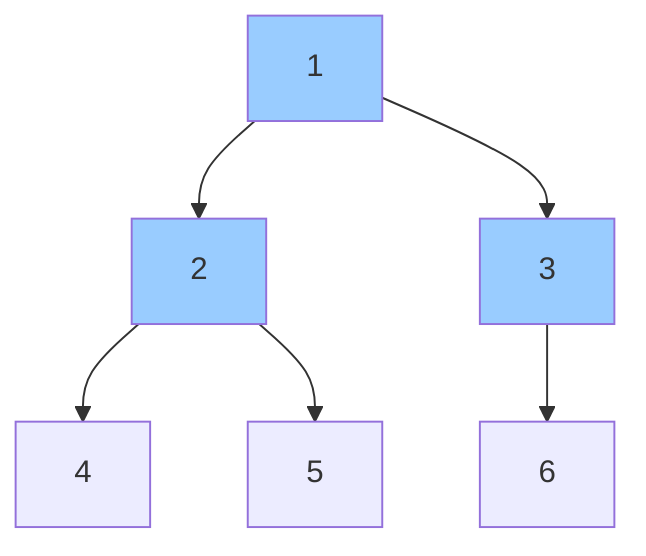

# Chương 10: Cây (Trees)

Cây là cấu trúc dữ liệu dạng phân cấp trong đó mỗi nút (node) sở hữu không hoặc nhiều nút con. Chương học này trang bị kiến thức toàn diện từ cây nhị phân, cây tìm kiếm nhị phân (BST), cây BST cân bằng, đống nhị phân (heaps) cho tới các cấu trúc cây nâng cao bao gồm: Cây tiền tố Trie, Cây phân đoạn (Segment Tree), Cây chỉ số nhị phân (Fenwick Tree) và Cấu trúc tập hợp không giao nhau (Disjoint Set Union - DSU). Mỗi phần đều đi kèm định nghĩa trực quan, các thao tác cơ bản, độ phức tạp thuật toán, cài đặt mã nguồn C++ và các liên hệ so sánh thực tế sinh động.

---

## 1. Cây nhị phân (Binary Trees)

Cây nhị phân là một cấu trúc cây trong đó mỗi nút có tối đa hai nút con: nút con bên trái (left child) và nút con bên phải (right child).

### 1.1 Các thuật ngữ cơ bản

- **Nút gốc (Root)**: Nút nằm ở đỉnh cao nhất của cây (không có nút cha).
- **Nút cha / Nút con (Parent / Child)**: Mối liên kết trực tiếp theo chiều đi lên / đi xuống.
- **Nút lá (Leaf)**: Nút không có bất kỳ nút con nào.
- **Chiều cao (Height)**: Số lượng cạnh trên đường đi dài nhất từ nút đó đến một nút lá (chiều cao của nút gốc = chiều cao của toàn bộ cây).
- **Độ sâu (Depth)**: Số lượng cạnh trên đường đi từ nút gốc đến nút đó.

```
       1 (Gốc - Root, độ sâu = 0)
      / \
     2   3
    / \   \
   4   5   6 (Nút lá - Leaf)
```
- **Chiều cao của nút 1** = 2 (Đường đi 1‑2‑5 hoặc 1‑3‑6).  
- **Độ sâu của nút 5** = 2.

**Phép so sánh trong thế giới thực**: Cây gia phả dòng họ – nút gốc là cụ tổ sơ khai nhất, các nút con biểu diễn thế hệ con cháu và các nút lá biểu diễn những người chưa sinh con.

---

### 1.2 Các phương pháp duyệt cây nhị phân (Tree Traversals)

Duyệt cây là hành động ghé thăm mọi nút trên cây một cách hệ thống, đảm bảo mỗi nút được ghé thăm đúng 1 lần duy nhất.

#### Duyệt theo chiều sâu DFS (Depth‑First Search)

| Phương pháp duyệt | Thứ tự duyệt | Ứng dụng tiêu biểu |
| :--- | :--- | :--- |
| **Tiền thứ tự** (Preorder) | Gốc $\rightarrow$ Trái $\rightarrow$ Phải | Sao chép cấu trúc cây, biểu diễn biểu thức tiền tố |
| **Trung thứ tự** (Inorder) | Trái $\rightarrow$ Gốc $\rightarrow$ Phải | Duyệt trên cây BST cho ra dãy số đã sắp xếp tăng dần |
| **Hậu thứ tự** (Postorder) | Trái $\rightarrow$ Phải $\rightarrow$ Gốc | Thao tác giải phóng/xóa cây, biểu diễn biểu thức hậu tố |

**Cài đặt đệ quy**:
```cpp
struct TreeNode {
    int val;
    TreeNode *left, *right;
    TreeNode(int x) : val(x), left(nullptr), right(nullptr) {}
};

void preorder(TreeNode* root) {
    if (!root) return;
    cout << root->val << " ";
    preorder(root->left);
    preorder(root->right);
}

void inorder(TreeNode* root) {
    if (!root) return;
    inorder(root->left);
    cout << root->val << " ";
    inorder(root->right);
}

void postorder(TreeNode* root) {
    if (!root) return;
    postorder(root->left);
    postorder(root->right);
    cout << root->val << " ";
}
```

**Duyệt Trung thứ tự bằng vòng lặp (sử dụng ngăn xếp Stack)**:
```cpp
void inorderIterative(TreeNode* root) {
    stack<TreeNode*> st;
    TreeNode* curr = root;
    while (curr || !st.empty()) {
        while (curr) {
            st.push(curr);
            curr = curr->left;
        }
        curr = st.top(); 
        st.pop();
        cout << curr->val << " ";
        curr = curr->right;
    }
}
```

#### Duyệt theo chiều rộng BFS (Duyệt theo mức - Level Order)
Ghé thăm các nút theo từng mức độ sâu từ trên xuống dưới, từ trái qua phải sử dụng một hàng đợi Queue.

```cpp
void levelOrder(TreeNode* root) {
    if (!root) return;
    queue<TreeNode*> q;
    q.push(root);
    while (!q.empty()) {
        TreeNode* node = q.front(); 
        q.pop();
        cout << node->val << " ";
        if (node->left) q.push(node->left);
        if (node->right) q.push(node->right);
    }
}
```


- **Preorder**: 1, 2, 4, 5, 3, 6  
- **Inorder**: 4, 2, 5, 1, 3, 6  
- **Postorder**: 4, 5, 2, 6, 3, 1  
- **Level order**: 1, 2, 3, 4, 5, 6

---

### 1.3 Khôi phục cấu trúc Cây từ các kết quả duyệt

**Khôi phục từ kết quả duyệt Inorder và Preorder**: Phần tử đầu tiên của chuỗi duyệt Preorder chắc chắn là nút gốc. Ta tìm vị trí của nút gốc này trong chuỗi duyệt Inorder – phần mảng bên trái nó sẽ cấu thành cây con bên trái, phần mảng bên phải cấu thành cây con bên phải. Tiếp tục gọi đệ quy.

```cpp
TreeNode* buildTree(vector<int>& preorder, vector<int>& inorder, int preStart, int inStart, int inEnd, unordered_map<int,int>& inMap) {
    if (preStart >= preorder.size() || inStart > inEnd) return nullptr;
    TreeNode* root = new TreeNode(preorder[preStart]);
    int rootIdx = inMap[root->val];
    int leftSize = rootIdx - inStart;
    root->left = buildTree(preorder, inorder, preStart+1, inStart, rootIdx-1, inMap);
    root->right = buildTree(preorder, inorder, preStart+leftSize+1, rootIdx+1, inEnd, inMap);
    return root;
}
```

### 1.4 Đường kính của cây nhị phân (Diameter of Binary Tree)

**Bản chất (What)**: Độ dài của đường đi dài nhất (tính bằng số cạnh) giữa hai nút bất kỳ trên cây. Đường đi này có thể đi qua nút gốc hoặc không.

**Ý tưởng**: Tại mỗi nút, ta tính chiều cao của cây con bên trái và bên phải, liên tục cập nhật đường kính tiềm năng bằng `leftHeight + rightHeight`. Trả về `1 + max(leftHeight, rightHeight)`.

```cpp
int diameter(TreeNode* root, int& res) {
    if (!root) return 0;
    int left = diameter(root->left, res);
    int right = diameter(root->right, res);
    res = max(res, left + right); // Cập nhật đường kính lớn nhất
    return 1 + max(left, right);
}

int diameterOfBinaryTree(TreeNode* root) {
    int res = 0;
    diameter(root, res);
    return res;
}
```

### 1.5 Tổ tiên chung gần nhất (LCA - Lowest Common Ancestor)

**Bản chất (What)**: Nút có độ sâu lớn nhất đồng thời là nút cha/tổ tiên của cả hai nút $p$ and $q$ cho trước.

```cpp
TreeNode* lowestCommonAncestor(TreeNode* root, TreeNode* p, TreeNode* q) {
    if (!root || root == p || root == q) return root;
    TreeNode* left = lowestCommonAncestor(root->left, p, q);
    TreeNode* right = lowestCommonAncestor(root->right, p, q);
    if (left && right) return root; // p và q nằm ở hai nhánh con tả hữu khác nhau
    return left ? left : right;
}
```
**Phép so sánh trong thế giới thực**: Tìm người quản lý chung cấp thấp nhất của hai nhân viên trong một sơ đồ tổ chức công ty dạng cây cấp bậc.

### 1.6 Đường đi có tổng lớn nhất trên cây (Maximum Path Sum)

**Bài toán**: Tìm giá trị tổng lớn nhất của một đường đi tự do giữa hai nút bất kỳ trên cây (giá trị nút có thể âm).

**Ý tưởng**: Với mỗi nút, ta tính toán phần lợi ích lớn nhất đóng góp từ hai nhánh con tả hữu (nếu lợi ích âm thì bỏ qua, coi như bằng 0). Liên tục cập nhật kết quả toàn cục bằng công thức `root->val + leftGain + rightGain`. Trả về `root->val + max(leftGain, rightGain)` để cung cấp cho nút cha cấp trên.

```cpp
int maxPathSum(TreeNode* root, int& ans) {
    if (!root) return 0;
    int left = max(0, maxPathSum(root->left, ans));
    int right = max(0, maxPathSum(root->right, ans));
    ans = max(ans, root->val + left + right);
    return root->val + max(left, right);
}

int maxPathSum(TreeNode* root) {
    int ans = INT_MIN;
    maxPathSum(root, ans);
    return ans;
}
```

---

## 2. Cây tìm kiếm nhị phân (BST - Binary Search Tree)

**Đặc tính cốt lõi**: Với mọi nút trên cây, toàn bộ các nút thuộc cây con bên trái luôn có giá trị nhỏ hơn nút gốc, và toàn bộ các nút thuộc cây con bên phải luôn có giá trị lớn hơn nút gốc. Không chứa phần tử trùng lặp.

### 2.1 Các thao tác cơ bản: Tìm kiếm, Chèn, Xóa nút

**Tìm kiếm (Search)**: Độ phức tạp trung bình $O(\log n)$, trường hợp xấu nhất $O(n)$ (khi cây bị lệch thành một đường thẳng).

```cpp
TreeNode* searchBST(TreeNode* root, int val) {
    while (root && root->val != val) {
        if (val < root->val) root = root->left;
        else root = root->right;
    }
    return root;
}
```

**Chèn nút (Insert)**: Trung bình đạt $O(\log n)$.
```cpp
TreeNode* insertIntoBST(TreeNode* root, int val) {
    if (!root) return new TreeNode(val);
    if (val < root->val) root->left = insertIntoBST(root->left, val);
    else if (val > root->val) root->right = insertIntoBST(root->right, val);
    return root;
}
```

**Xóa nút (Delete)**: Phân bổ thành 3 trường hợp: nút lá, nút chỉ có 1 con và nút có đầy đủ 2 con. Đối với nút có 2 con, ta thay thế giá trị của nó bằng nút kế cận đứng sau (inorder successor - nút nhỏ nhất của cây con bên phải) hoặc nút đứng trước (inorder predecessor - nút lớn nhất của cây con bên trái), sau đó đệ quy xóa nút thay thế đó.

```cpp
TreeNode* findMin(TreeNode* root) {
    while (root->left) root = root->left;
    return root;
}

TreeNode* deleteNode(TreeNode* root, int key) {
    if (!root) return nullptr;
    if (key < root->val) root->left = deleteNode(root->left, key);
    else if (key > root->val) root->right = deleteNode(root->right, key);
    else {
        if (!root->left) return root->right;
        if (!root->right) return root->left;
        
        TreeNode* succ = findMin(root->right); // Tìm inorder successor
        root->val = succ->val;
        root->right = deleteNode(root->right, succ->val);
    }
    return root;
}
```

---

### 2.2 Xác thực tính hợp lệ của cây BST (Validate BST)

Kiểm tra xem một cây nhị phân cho trước có thỏa mãn đầy đủ các ràng buộc của cây BST hay không bằng cách duy trì khoảng giới hạn giá trị hợp lệ cho mỗi nút.

```cpp
bool isValidBST(TreeNode* root, long long minVal = LLONG_MIN, long long maxVal = LLONG_MAX) {
    if (!root) return true;
    if (root->val <= minVal || root->val >= maxVal) return false;
    return isValidBST(root->left, minVal, root->val) &&
           isValidBST(root->right, root->val, maxVal);
}
```

### 2.3 Tìm phần tử nhỏ thứ $K$ / lớn thứ $K$

Duyệt trung thứ tự (Inorder) trên cây BST cho ra một dãy số đã được sắp xếp tăng dần. Ta chỉ cần duyệt và đếm số lượng phần tử.

```cpp
int kthSmallest(TreeNode* root, int k) {
    stack<TreeNode*> st;
    TreeNode* curr = root;
    while (curr || !st.empty()) {
        while (curr) { 
            st.push(curr); 
            curr = curr->left; 
        }
        curr = st.top(); 
        st.pop();
        if (--k == 0) return curr->val;
        curr = curr->right;
    }
    return -1;
}
```

### 2.4 Truy vấn tổng khoảng (Range Sum Queries)

Tính tổng tất cả các nút có giá trị nằm trong khoảng đoạn đóng $[L, R]$. Sử dụng đệ quy thông minh để cắt tỉa sớm các nhánh nằm ngoài phạm vi.

```cpp
int rangeSumBST(TreeNode* root, int L, int R) {
    if (!root) return 0;
    if (root->val < L) return rangeSumBST(root->right, L, R); // Cắt tỉa nhánh con trái
    if (root->val > R) return rangeSumBST(root->left, L, R);  // Cắt tỉa nhánh con phải
    return root->val + rangeSumBST(root->left, L, R) + rangeSumBST(root->right, L, R);
}
```

---

## 3. Cây tìm kiếm nhị phân cân bằng (Balanced BSTs - Lý thuyết)

Cây BST cân bằng luôn tự động điều chỉnh cấu trúc để duy trì chiều cao tiệm cận ở mức $O(\log n)$ sau mỗi thao tác chèn/xóa phần tử.

### 3.1 Cây AVL (AVL Trees)
- **Hệ số cân bằng (Balance factor)** = $\text{height(cây\_con\_trái)} - \text{height(cây\_con\_phải)}$. Hệ số cho phép đối với mỗi nút chỉ được nhận các giá trị: -1, 0, 1.
- **Các phép quay cây (Rotations)**: Phép quay Trái (Left), quay Phải (Right), quay kép Trái-Phải (Left-Right), quay kép Phải-Trái (Right-Left) được áp dụng linh hoạt để khôi phục trạng thái cân bằng.
- **Ứng dụng**: Khi hệ thống yêu cầu độ phức tạp trường hợp xấu nhất nghiêm ngặt ở mức $O(\log n)$ (ví dụ: các cấu trúc chỉ mục cơ sở dữ liệu).

### 3.2 Cây Đỏ - Đen (Red‑Black Trees)
- **Quy tắc toán học cơ bản**:
  1. Nút gốc bắt buộc phải có màu Đen.
  2. Nút Đỏ chỉ được phép có nút con màu Đen (không có hai nút Đỏ nằm kề nhau trên cùng liên kết).
  3. Mọi đường đi từ nút gốc đến nút lá bất kỳ đều chứa cùng một số lượng nút Đen chính xác.
- **Ứng dụng**: Trong thư viện chuẩn C++, cấu trúc `std::map` và `std::set` được cài đặt bằng cây Đỏ-Đen vì chúng tốn ít chi phí thực hiện phép quay cân bằng hơn cây AVL trong khi vẫn mang lại hiệu năng thực tế tuyệt vời.

---

## 4. Đống nhị phân (Binary Heap)

Đống nhị phân là một cây nhị phân hoàn chỉnh (tất cả các mức độ sâu đều được lấp đầy ngoại trừ mức cuối cùng được điền từ trái sang phải). Đống được biểu diễn tối ưu dưới dạng một mảng: nút cha ở vị trí chỉ số $i$ có hai nút con ở vị trí chỉ số $2i+1$ và $2i+2$.

- **Đống cực tiểu (Min‑heap)**: Nút cha $\le$ các nút con (giá trị nhỏ nhất nằm ở gốc).
- **Đống cực đại (Max‑heap)**: Nút cha $\ge$ các nút con (giá trị lớn nhất nằm ở gốc).

### 4.1 Biểu diễn dạng mảng
```
Chỉ số (Indices): 0    1    2    3    4    5
Giá trị (Values):  10   15   20   25   30   35
```
- Nút cha của phần tử $i$ = $\lfloor(i-1)/2\rfloor$. 
- Nút con trái = $2i+1$. 
- Nút con phải = $2i+2$.

---

### 4.2 Các thao tác trên Đống

| Thao tác | Mô tả | Độ phức tạp thời gian |
| :--- | :--- | :--- |
| `insert` | Thêm phần tử vào cuối và cho nổi lên (bubble up) | $O(\log n)$ |
| `extractMin` / `max` | Hoán đổi gốc với phần tử cuối, xóa cuối, cho chìm xuống (heapify down) | $O(\log n)$ |
| `getMin` / `max` | Xem trực tiếp giá trị tại gốc | $O(1)$ |
| `heapify` | Kiến tạo đống từ một mảng thô cho trước | $O(n)$ |

```cpp
class MinHeap {
    vector<int> heap;
    void heapifyUp(int i) {
        while (i > 0 && heap[i] < heap[(i-1)/2]) {
            swap(heap[i], heap[(i-1)/2]);
            i = (i-1)/2;
        }
    }
    void heapifyDown(int i) {
        int n = heap.size();
        while (true) {
            int left = 2*i+1, right = 2*i+2, smallest = i;
            if (left < n && heap[left] < heap[smallest]) smallest = left;
            if (right < n && heap[right] < heap[smallest]) smallest = right;
            if (smallest == i) break;
            swap(heap[i], heap[smallest]);
            i = smallest;
        }
    }
public:
    void push(int val) {
        heap.push_back(val);
        heapifyUp(heap.size() - 1);
    }
    int pop() {
        if (heap.empty()) throw underflow_error("Heap empty");
        int root = heap[0];
        heap[0] = heap.back();
        heap.pop_back();
        if (!heap.empty()) heapifyDown(0);
        return root;
    }
    int top() const { 
        return heap[0]; 
    }
};
```

---

## 5. Các cấu trúc cây nâng cao (Advanced Trees)

### 5.1 Cây tiền tố Trie (Prefix Tree)

**Bản chất (What)**: Một cấu trúc cây đa phân cấp trong đó mỗi nút đại diện cho một ký tự. Trie được ứng dụng để tìm kiếm siêu tốc các từ dựa trên tiền tố (như tính năng tự động gợi ý auto‑complete, kiểm tra chính tả).

**Định nghĩa cấu trúc nút Trie**:
```cpp
struct TrieNode {
    bool isEnd;
    TrieNode* children[26];
    TrieNode() : isEnd(false) { 
        fill(begin(children), end(children), nullptr); 
    }
};
```

**Các thao tác cơ bản**:
- `insert(word)`: Duyệt qua từng ký tự của từ, tạo nút mới nếu chưa tồn tại, đánh dấu cờ `isEnd = true` tại nút ký tự cuối cùng.
- `search(word)`: Duyệt khớp ký tự; nút cuối cùng bắt buộc phải có cờ `isEnd == true`.
- `startsWith(prefix)`: Kiểm tra xem có tồn tại từ nào bắt đầu bằng tiền tố `prefix` hay không.

```cpp
class Trie {
    TrieNode* root;
public:
    Trie() : root(new TrieNode()) {}
    
    void insert(string word) {
        TrieNode* node = root;
        for (char c : word) {
            int idx = c - 'a';
            if (!node->children[idx]) node->children[idx] = new TrieNode();
            node = node->children[idx];
        }
        node->isEnd = true;
    }
    
    bool search(string word) {
        TrieNode* node = root;
        for (char c : word) {
            int idx = c - 'a';
            if (!node->children[idx]) return false;
            node = node->children[idx];
        }
        return node->isEnd;
    }
    
    bool startsWith(string prefix) {
        TrieNode* node = root;
        for (char c : prefix) {
            int idx = c - 'a';
            if (!node->children[idx]) return false;
            node = node->children[idx];
        }
        return true;
    }
};
```
- **Độ phức tạp thời gian**: $O(\text{độ\_dài\_từ})$ cho mỗi thao tác.
- **Phép so sánh trong thế giới thực**: Cuốn từ điển được sắp xếp mục lục theo bảng chữ cái từ "A" đến "Z", mỗi lớp chữ cái sẽ thu hẹp dần phạm vi tìm kiếm của từ.

---

### 5.2 Cây phân đoạn (Segment Tree)

**Bản chất (What)**: Một cây nhị phân phục vụ cho việc trả lời siêu tốc các truy vấn trên đoạn (như tính tổng đoạn, tìm cực tiểu RMQ, cực đại khoảng) và thực hiện các cập nhật điểm (point updates) đều trong thời gian lô-ga-rít $O(\log n)$.

**Cấu trúc**: Các nút lá của cây lưu giữ trực tiếp các giá trị của mảng gốc; các nút cha bên trong lưu giữ giá trị tổng hợp (tích lũy) của hai nút con.

```cpp
class SegmentTree {
    vector<int> tree;
    int n;
    void build(vector<int>& arr, int node, int l, int r) {
        if (l == r) tree[node] = arr[l];
        else {
            int mid = (l + r) / 2;
            build(arr, 2*node+1, l, mid);
            build(arr, 2*node+2, mid+1, r);
            tree[node] = tree[2*node+1] + tree[2*node+2];
        }
    }
    void update(int idx, int val, int node, int l, int r) {
        if (l == r) tree[node] = val;
        else {
            int mid = (l + r) / 2;
            if (idx <= mid) update(idx, val, 2*node+1, l, mid);
            else update(idx, val, 2*node+2, mid+1, r);
            tree[node] = tree[2*node+1] + tree[2*node+2];
        }
    }
    int query(int ql, int qr, int node, int l, int r) {
        if (qr < l || ql > r) return 0; // Nằm hoàn toàn ngoài khoảng
        if (ql <= l && r <= qr) return tree[node]; // Nằm trọn vẹn trong khoảng
        int mid = (l + r) / 2;
        return query(ql, qr, 2*node+1, l, mid) + query(ql, qr, 2*node+2, mid+1, r);
    }
public:
    SegmentTree(vector<int>& arr) {
        n = arr.size();
        tree.resize(4 * n);
        build(arr, 0, 0, n-1);
    }
    void update(int idx, int val) { update(idx, val, 0, 0, n-1); }
    int query(int l, int r) { return query(l, r, 0, 0, n-1); }
};
```
*Lưu ý: Kỹ thuật **Lan truyền lười biếng (Lazy propagation)** được áp dụng để tối ưu hóa việc cập nhật trên cả một đoạn (range updates) bằng cách trì hoãn việc cập nhật xuống các nút con cho tới khi thực sự cần thiết.*

---

### 5.3 Cây chỉ số nhị phân (Fenwick Tree / Binary Indexed Tree)

**Bản chất (What)**: Có cấu trúc mã nguồn đơn giản và gọn nhẹ hơn Segment Tree rất nhiều, dùng để tính toán tổng tiền tố lũy kế (prefix sums) và cập nhật điểm trong thời gian $O(\log n)$ sử dụng $O(n)$ không gian bộ nhớ.

**Ý tưởng cốt lõi**: Mỗi vị trí chỉ mục $i$ (bắt đầu từ 1) sẽ chịu trách nhiệm quản lý tổng của một khoảng đoạn có độ dài được xác định bởi bit 1 thấp nhất của nó (LSB - Least Significant Bit): `(i - LSB(i) + 1) .. i`. Trong toán học nhị phân, bit 1 thấp nhất này được tách nhanh bằng phép toán: `i & -i`.

```cpp
class FenwickTree {
    vector<int> bit;
    int n;
public:
    FenwickTree(int size) : n(size), bit(size+1, 0) {}
    void update(int idx, int delta) {  // Chỉ số index bắt đầu từ 1
        while (idx <= n) {
            bit[idx] += delta;
            idx += idx & -idx; // Nhảy sang nút cha chịu trách nhiệm quản lý
        }
    }
    int query(int idx) { // Tính tổng tiền tố từ [1..idx]
        int sum = 0;
        while (idx > 0) {
            sum += bit[idx];
            idx -= idx & -idx; // Lùi về nút liền kề trước đó
        }
        return sum;
    }
    int rangeSum(int l, int r) { 
        return query(r) - query(l-1); 
    }
};
```

---

### 5.4 Cấu trúc Tập hợp không giao nhau (DSU - Disjoint Set Union / Union‑Find)

**Bản chất (What)**: Cấu trúc dữ liệu quản lý một tập hợp các phần tử được phân chia thành nhiều tập con không giao nhau. DSU hỗ trợ hai thao tác cốt lõi: `find` (xác định phần tử thuộc tập con nào thông qua nút đại diện) và `union` / `unite` (gộp hai tập con lại với nhau).

**Các kỹ thuật tối ưu hóa tối thượng**:
- **Nén đường đi (Path compression)**: Trong thao tác tìm kiếm, ta cho tất cả các nút trên đường đi trỏ trực tiếp vào nút đại diện gốc của nhóm, giúp cây trở nên cực kỳ dẹt.
- **Hợp nhất theo hạng (Union by rank / size)**: Luôn hợp nhất cây có chiều cao thấp hơn vào dưới gốc của cây có chiều cao lớn hơn để tránh cây bị lệch dài.

```cpp
class DSU {
    vector<int> parent, rank;
public:
    DSU(int n) {
        parent.resize(n);
        rank.resize(n, 0);
        for (int i = 0; i < n; ++i) parent[i] = i; // Ban đầu mỗi phần tử là cha của chính nó
    }
    int find(int x) {
        if (parent[x] != x) {
            parent[x] = find(parent[x]); // Tối ưu nén đường đi (Path compression)
        }
        return parent[x];
    }
    void unite(int x, int y) {
        int rx = find(x), ry = find(y);
        if (rx == ry) return;
        if (rank[rx] < rank[ry]) {
            parent[rx] = ry;
        } else if (rank[rx] > rank[ry]) {
            parent[ry] = rx;
        } else { 
            parent[ry] = rx; 
            rank[rx]++; 
        }
    }
    bool connected(int x, int y) { 
        return find(x) == find(y); 
    }
};
```
- **Độ phức tạp thời gian**: Gần như đạt hằng số tối ưu $O(1)$ cho mỗi thao tác (chính xác là hàm ngược Ackermann $\alpha(n)$).
- **Ứng dụng**: Thuật toán Kruskal tìm cây khung nhỏ nhất, phát hiện chu trình trên đồ thị vô hướng, quản lý các thành phần liên thông động.

---

## Bảng tổng hợp các cấu trúc Cây

| Cấu trúc Cây | Thao tác cốt lõi | Độ phức tạp thời gian | Ứng dụng tiêu biểu |
| :--- | :--- | :--- | :--- |
| **Cây nhị phân** | Duyệt cây (DFS/BFS) | $O(n)$ | Đánh giá biểu thức, duyệt cấu trúc |
| **Cây BST** | Tìm kiếm, Chèn, Xóa nút | Trung bình $O(\log n)$ | Quản lý dữ liệu có thứ tự, từ điển |
| **AVL / Đỏ-Đen** | Duyệt cân bằng | $O(\log n)$ nghiêm ngặt | Cài đặt `std::map`, `std::set` |
| **Đống nhị phân** | Lấy cực trị, vun đống | $O(1)$ lấy gốc, $O(\log n)$ xóa | Hàng đợi ưu tiên, thuật toán Dijkstra |
| **Cây Trie** | Khớp tiền tố chuỗi | $O(\text{độ\_dài\_từ})$ | Tính năng gợi ý từ, kiểm tra chính tả |
| **Cây phân đoạn** | Truy vấn đoạn, cập nhật điểm | $O(\log n)$ | Truy vấn tổng/min/max động trên khoảng |
| **Cây Fenwick** | Tính tổng tiền tố, cập nhật | $O(\log n)$ | Đếm số nghịch thế, tích lũy tần suất |
| **DSU (Union-Find)** | Hợp nhất, Tìm kiếm nhóm | Gần như $O(1)$ ($\alpha(n)$) | Thuật toán Kruskal, liên thông động |

Chương tiếp theo sẽ đi sâu vào cấu trúc dữ liệu **Đồ thị (Graphs)** (Cách biểu diễn ma trận/danh sách kề, thuật toán tìm kiếm đường đi ngắn nhất Dijkstra, Bellman-Ford, Floyd-Warshall...).
