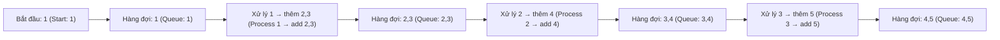

# Chương 11: Đồ thị (Graphs)

Đồ thị biểu diễn mối quan hệ giữa các đối tượng. Chương này sẽ trình bày về các cách biểu diễn đồ thị, các thuật toán duyệt đồ thị (DFS, BFS), thuật toán tìm đường đi ngắn nhất, cây khung tối tiểu (MST - Minimum Spanning Trees), sắp xếp topo (Topological sorting), phát hiện chu trình, thành phần liên thông mạnh (SCC - Strongly Connected Components), kiến thức cơ bản về luồng mạng (Network flow) và các bài toán đồ thị kinh điển. Mỗi phần sẽ bao gồm các định nghĩa, độ phức tạp thuật toán, mã nguồn minh họa bằng C++ và các liên hệ thực tế sinh động.

## 1. Các cách biểu diễn đồ thị (Graph Representations)

Một đồ thị $G = (V, E)$ bao gồm tập hợp các đỉnh (Vertices/Nodes) $V$ và tập hợp các cạnh (Edges/Connections) $E$. Các cạnh có thể có hướng (directed) hoặc vô hướng (undirected), có trọng số (weighted) hoặc không có trọng số (unweighted).

### 1.1 Ma trận kề (Adjacency Matrix)

**Khái niệm**: Là một ma trận kích thước $V \times V$ trong đó `matrix[u][v] = 1` (hoặc bằng giá trị trọng số của cạnh) nếu tồn tại cạnh nối từ đỉnh $u$ đến đỉnh $v$.

- **Không gian lưu trữ**: $O(V^2)$. **Thời gian tra cứu cạnh**: $O(1)$.  
- **Trường hợp áp dụng**: Đồ thị dày (dense graphs - có nhiều cạnh) hoặc khi việc kiểm tra sự tồn tại của một cạnh cụ thể trong thời gian $O(1)$ là tối quan trọng.

```cpp
vector<vector<int>> adjMat(V, vector<int>(V, 0));
adjMat[u][v] = 1;        // Thêm cạnh u → v
if (adjMat[u][v]) {...} // Kiểm tra sự tồn tại của cạnh
```

### 1.2 Danh sách kề (Adjacency List)

**Khái niệm**: Mảng hoặc danh sách gồm $V$ danh sách liên kết (hoặc các vector). Danh sách tại chỉ số (index) $u$ sẽ lưu trữ tất cả các đỉnh lân cận (neighbors) kề với nó (và có thể đi kèm trọng số).

- **Không gian lưu trữ**: $O(V + E)$. **Thời gian tra cứu cạnh**: $O(\text{degree}(u))$ với $\text{degree}(u)$ là bậc của đỉnh $u$.  
- **Trường hợp áp dụng**: Đồ thị thưa (sparse graphs - số cạnh ít hơn nhiều so với số cạnh tối đa có thể có), phù hợp với hầu hết các ứng dụng thực tế.

```cpp
vector<vector<int>> adjList(V);
adjList[u].push_back(v);            // Đồ thị không trọng số
// Đồ thị có trọng số
vector<vector<pair<int,int>>> adjWeighted(V);
adjWeighted[u].push_back({v, w});
```

### 1.3 Danh sách cạnh (Edge List)

**Khái niệm**: Một danh sách duy nhất lưu trữ tất cả các cạnh dưới dạng bộ ba $(u, v, w)$ đại diện cho cạnh nối từ $u$ sang $v$ với trọng số $w$. Cách biểu diễn này thường được sử dụng trong các thuật toán như Kruskal.

```cpp
struct Edge { int u, v, w; };
vector<Edge> edges;
edges.push_back({u, v, w});
```

**Liên hệ thực tế**:  
- Ma trận kề: Giống như một bảng tra cứu khoảng cách giữa các thành phố lớn (gồm hàng và cột).  
- Danh sách kề: Giống như danh sách các chuyến bay trực tiếp khởi hành từ mỗi thành phố riêng biệt.  
- Danh sách cạnh: Giống như một cuốn nhật ký ghi chép lại toàn bộ tất cả các chuyến bay có trong ngày.

## 2. Duyệt đồ thị (Graph Traversals)

### 2.1 Tìm kiếm theo chiều sâu (DFS - Depth First Search)

**Khái niệm**: Đi sâu nhất có thể dọc theo từng nhánh của đồ thị trước khi quay lui (backtracking).

**Ứng dụng**: Phát hiện chu trình (cycle detection), sắp xếp topo (topological sorting), tìm các thành phần liên thông (connected components), giải các bài toán mê cung.

**Cài đặt đệ quy**:

```cpp
void dfs(int u, vector<bool>& visited, vector<vector<int>>& adj) {
    visited[u] = true;
    cout << u << " ";
    for (int v : adj[u])
        if (!visited[v]) dfs(v, visited, adj);
}
```

**Cài đặt khử đệ quy (sử dụng ngăn xếp - Stack)**:

```cpp
void dfsIterative(int start, vector<vector<int>>& adj) {
    vector<bool> visited(adj.size(), false);
    stack<int> st;
    st.push(start);
    while (!st.empty()) {
        int u = st.top(); st.pop();
        if (visited[u]) continue;
        visited[u] = true;
        cout << u << " ";
        for (int v : adj[u])
            if (!visited[v]) st.push(v);
    }
}
```

### 2.2 Tìm kiếm theo chiều rộng (BFS - Breadth First Search)

**Khái niệm**: Duyệt đồ thị theo từng mức (level by level), sử dụng một hàng đợi (Queue).

**Ứng dụng**: Tìm đường đi ngắn nhất trên đồ thị không có trọng số (shortest path in unweighted graphs), bài toán chuỗi biến đổi từ (word ladder), thu thập thông tin web (web crawling).

```cpp
void bfs(int start, vector<vector<int>>& adj) {
    vector<bool> visited(adj.size(), false);
    queue<int> q;
    visited[start] = true;
    q.push(start);
    while (!q.empty()) {
        int u = q.front(); q.pop();
        cout << u << " ";
        for (int v : adj[u])
            if (!visited[v]) { visited[v] = true; q.push(v); }
    }
}
```



**Liên hệ thực tế**: BFS tương tự như các vòng sóng nước lan tỏa dần ra xung quanh khi ta ném một viên sỏi xuống hồ; trong khi DFS giống như việc bạn cố gắng khám phá một mê cung bằng cách luôn rẽ trái cho tới khi gặp đường cụt mới quay lại.

## 3. Thuật toán tìm đường đi ngắn nhất (Shortest Path Algorithms)

### 3.1 Trên đồ thị không trọng số: Sử dụng BFS

Thuật toán BFS giúp tìm đường đi ngắn nhất (số cạnh tối thiểu) từ một đỉnh nguồn đến tất cả các đỉnh khác trên đồ thị.

```cpp
vector<int> bfsShortestPath(int start, vector<vector<int>>& adj) {
    int V = adj.size();
    vector<int> dist(V, -1);
    queue<int> q;
    dist[start] = 0;
    q.push(start);
    while (!q.empty()) {
        int u = q.front(); q.pop();
        for (int v : adj[u])
            if (dist[v] == -1) {
                dist[v] = dist[u] + 1;
                q.push(v);
            }
    }
    return dist;
}
```

### 3.2 Trên đồ thị có trọng số không âm: Thuật toán Dijkstra

**Khái niệm**: Tìm đường đi ngắn nhất từ một đỉnh nguồn đơn nhất bằng phương pháp tham lam (greedy) kết hợp với hàng đợi ưu tiên (priority queue - đống tối tiểu / min-heap).

**Độ phức tạp thời gian**: $O((V + E) \log V)$ khi sử dụng cấu trúc đống nhị phân (binary heap).

```cpp
vector<int> dijkstra(int src, vector<vector<pair<int,int>>>& adj) {
    int V = adj.size();
    vector<int> dist(V, INT_MAX);
    dist[src] = 0;
    using P = pair<int,int>; // (khoảng cách, đỉnh)
    priority_queue<P, vector<P>, greater<P>> pq;
    pq.push({0, src});
    while (!pq.empty()) {
        auto [d, u] = pq.top(); pq.pop();
        if (d > dist[u]) continue;
        for (auto [v, w] : adj[u]) {
            if (dist[v] > dist[u] + w) {
                dist[v] = dist[u] + w;
                pq.push({dist[v], v});
            }
        }
    }
    return dist;
}
```

**Liên hệ thực tế**: Tương tự như ứng dụng bản đồ GPS tìm đường đi tối ưu với các cung đường có độ dài (hoặc thời gian di chuyển) không âm – luôn ưu tiên rẽ vào các ngả đường gần nhất chưa từng đi qua.

### 3.3 Trên đồ thị có trọng số âm: Thuật toán Bellman-Ford

**Khái niệm**: Thực hiện tối ưu hóa (relax) tất cả các cạnh của đồ thị đúng $V - 1$ lần. Có khả năng phát hiện ra các chu trình âm (negative cycles).

**Độ phức tạp thời gian**: $O(V \times E)$.

```cpp
vector<int> bellmanFord(int src, int V, vector<tuple<int,int,int>>& edges) {
    vector<int> dist(V, INT_MAX);
    dist[src] = 0;
    for (int i = 0; i < V-1; ++i) {
        for (auto [u, v, w] : edges) {
            if (dist[u] != INT_MAX && dist[v] > dist[u] + w)
                dist[v] = dist[u] + w;
        }
    }
    // Kiểm tra chu trình âm
    for (auto [u, v, w] : edges) {
        if (dist[u] != INT_MAX && dist[v] > dist[u] + w)
            return {}; // Phát hiện chu trình âm
    }
    return dist;
}
```

### 3.4 Tìm đường đi ngắn nhất giữa mọi cặp đỉnh: Thuật toán Floyd-Warshall

**Khái niệm**: Sử dụng quy hoạch động (dynamic programming) – xét từng đỉnh của đồ thị làm đỉnh trung gian để tối ưu hóa khoảng cách giữa mọi cặp đỉnh.

**Độ phức tạp thời gian**: $O(V^3)$. **Không gian lưu trữ**: $O(V^2)$.

```cpp
vector<vector<int>> floydWarshall(vector<vector<int>>& graph) {
    int V = graph.size();
    vector<vector<int>> dist = graph;
    for (int k = 0; k < V; ++k)
        for (int i = 0; i < V; ++i)
            for (int j = 0; j < V; ++j)
                if (dist[i][k] != INT_MAX && dist[k][j] != INT_MAX)
                    dist[i][j] = min(dist[i][j], dist[i][k] + dist[k][j]);
    return dist;
}
```

## 4. Cây khung tối tiểu (MST - Minimum Spanning Tree)

Một cây khung tối tiểu (MST) là một cây con kết nối tất cả các đỉnh của đồ thị lại với nhau sao cho tổng trọng số của các cạnh là nhỏ nhất và không tạo thành chu trình.

### 4.1 Thuật toán Prim

Xây dựng cây khung bắt đầu từ một đỉnh bất kỳ, liên tục mở rộng bằng cách thêm cạnh có trọng số nhỏ nhất nối từ một đỉnh đã nằm trong cây sang một đỉnh bên ngoài cây.

**Độ phức tạp thời gian**: $O((V + E) \log V)$ sử dụng đống tối tiểu (min-heap).

```cpp
int primMST(vector<vector<pair<int,int>>>& adj) {
    int V = adj.size(), total = 0;
    vector<bool> inMST(V, false);
    using P = pair<int,int>; // (trọng số, đỉnh)
    priority_queue<P, vector<P>, greater<P>> pq;
    pq.push({0, 0}); // Bắt đầu từ đỉnh 0
    while (!pq.empty()) {
        auto [w, u] = pq.top(); pq.pop();
        if (inMST[u]) continue;
        inMST[u] = true;
        total += w;
        for (auto [v, weight] : adj[u])
            if (!inMST[v]) pq.push({weight, v});
    }
    return total;
}
```

**Liên hệ thực tế**: Lắp đặt hệ thống cáp quang kết nối tất cả các thị trấn với chi phí rẻ nhất – luôn mở rộng mạng lưới từ các khu vực đã có mạng cáp sang thị trấn lân cận chưa được kết nối có chi phí triển khai thấp nhất.

### 4.2 Thuật toán Kruskal

Sắp xếp tất cả các cạnh theo thứ tự trọng số tăng dần, sau đó lần lượt chọn các cạnh này vào cây khung nếu chúng không tạo thành chu trình (kiểm tra bằng cấu trúc dữ liệu các tập hợp rời nhau - DSU / Union-Find).

**Độ phức tạp thời gian**: $O(E \log E)$ (sắp xếp) + $O(E \cdot \alpha(V))$ với $\alpha$ là hàm Ackermann nghịch đảo.

```cpp
struct DSU {
    vector<int> parent, rank;
    DSU(int n) {
        parent.resize(n); rank.resize(n,0);
        for(int i=0;i<n;++i) parent[i]=i;
    }
    int find(int x) { return parent[x]==x ? x : parent[x]=find(parent[x]); }
    bool unite(int x, int y) {
        int rx=find(x), ry=find(y);
        if(rx==ry) return false;
        if(rank[rx]<rank[ry]) parent[rx]=ry;
        else if(rank[rx]>rank[ry]) parent[ry]=rx;
        else { parent[ry]=rx; rank[rx]++; }
        return true;
    }
};

int kruskalMST(vector<tuple<int,int,int>>& edges, int V) {
    sort(edges.begin(), edges.end()); // Sắp xếp theo trọng số tăng dần
    DSU dsu(V);
    int total = 0, edgesUsed = 0;
    for (auto [w, u, v] : edges) {
        if (dsu.unite(u, v)) {
            total += w;
            edgesUsed++;
            if (edgesUsed == V-1) break;
        }
    }
    return total;
}
```

## 5. Sắp xếp topo (Topological Sorting)

**Định nghĩa**: Là một thứ tự sắp xếp tuyến tính các đỉnh của một đồ thị có hướng không chu trình (DAG - Directed Acyclic Graph) sao cho với mọi cạnh có hướng từ $u$ đến $v$ ($u \to v$), đỉnh $u$ luôn xuất hiện trước đỉnh $v$.

**Liên hệ thực tế**: Đăng ký các học phần ở trường đại học – bạn bắt buộc phải hoàn thành các môn học tiên quyết trước khi đăng ký học các môn chuyên ngành nâng cao.

### 5.1 Thuật toán Kahn (Sử dụng BFS)

Tính bán bậc vào (indegree) của từng đỉnh. Đưa các đỉnh có bán bậc vào bằng 0 vào hàng đợi, loại bỏ các cạnh đi ra từ các đỉnh này, cập nhật lại bán bậc vào của các đỉnh lân cận và lặp lại quá trình này.

```cpp
vector<int> topologicalSortKahn(vector<vector<int>>& adj) {
    int V = adj.size();
    vector<int> indeg(V, 0), result;
    for (int u=0; u<V; ++u)
        for (int v : adj[u]) indeg[v]++;
    queue<int> q;
    for (int i=0; i<V; ++i) if (indeg[i]==0) q.push(i);
    while (!q.empty()) {
        int u = q.front(); q.pop();
        result.push_back(u);
        for (int v : adj[u])
            if (--indeg[v] == 0) q.push(v);
    }
    return result.size() == V ? result : vector<int>{}; // Trả về rỗng nếu phát hiện chu trình (size < V)
}
```

### 5.2 Thuật toán dựa trên DFS

Thực hiện duyệt DFS; sau khi duyệt xong toàn bộ các đỉnh kề của đỉnh hiện tại (theo thứ tự hậu thứ - postorder), ta đưa đỉnh đó vào ngăn xếp (stack). Đảo ngược kết quả thu được để có thứ tự topo chính xác.

```cpp
void dfsTopo(int u, vector<bool>& visited, stack<int>& st, vector<vector<int>>& adj) {
    visited[u] = true;
    for (int v : adj[u])
        if (!visited[v]) dfsTopo(v, visited, st, adj);
    st.push(u);
}
vector<int> topologicalSortDFS(vector<vector<int>>& adj) {
    int V = adj.size();
    vector<bool> visited(V, false);
    stack<int> st;
    for (int i=0; i<V; ++i)
        if (!visited[i]) dfsTopo(i, visited, st, adj);
    vector<int> result;
    while (!st.empty()) { result.push_back(st.top()); st.pop(); }
    return result;
}
```

## 6. Phát hiện chu trình (Cycle Detection)

### 6.1 Trên đồ thị vô hướng

**Dùng DFS**: Nếu phát hiện một đỉnh kề đã được duyệt (`visited[v] = true`) và đỉnh kề đó không phải là cha (parent) trực tiếp của đỉnh hiện tại, thì đồ thị tồn tại chu trình.

```cpp
bool hasCycleUndirectedDFS(int u, int parent, vector<bool>& visited, vector<vector<int>>& adj) {
    visited[u] = true;
    for (int v : adj[u]) {
        if (!visited[v]) {
            if (hasCycleUndirectedDFS(v, u, visited, adj)) return true;
        } else if (v != parent) return true;
    }
    return false;
}
```

**Dùng Union-Find (DSU)**: Khi xét một cạnh, nếu hai đỉnh đầu mút của cạnh đó đã thuộc cùng một tập hợp rời nhau, đồ thị có chu trình.

### 6.2 Trên đồ thị có hướng

**Dùng DFS kết hợp đống đệ quy (Recursion Stack)**: Duyệt DFS đồng thời duy trì một mảng đánh dấu các đỉnh đang nằm trong nhánh đệ quy hiện tại `inStack`.

```cpp
bool hasCycleDirectedDFS(int u, vector<bool>& visited, vector<bool>& inStack, vector<vector<int>>& adj) {
    visited[u] = true;
    inStack[u] = true;
    for (int v : adj[u]) {
        if (!visited[v]) {
            if (hasCycleDirectedDFS(v, visited, inStack, adj)) return true;
        } else if (inStack[v]) return true;
    }
    inStack[u] = false;
    return false;
}
```

## 7. Thành phần liên thông mạnh (SCC - Strongly Connected Components)

Thành phần liên thông mạnh (SCC) của một đồ thị có hướng là một đồ thị con tối đại sao cho giữa bất kỳ cặp đỉnh nào trong đó cũng đều tồn tại đường đi hai chiều qua lại lẫn nhau.

### 7.1 Thuật toán Kosaraju

1. Thực hiện DFS trên đồ thị gốc để xác định thứ tự kết thúc duyệt của các đỉnh (sử dụng ngăn xếp).  
2. Xây dựng đồ thị đảo ngược (transpose graph - đảo ngược chiều tất cả các cạnh).  
3. Duyệt DFS trên đồ thị đảo ngược theo thứ tự giảm dần của thời gian kết thúc duyệt (lấy ra từ ngăn xếp) – mỗi cây DFS thu được sẽ tương ứng với một thành phần liên thông mạnh (SCC).

```cpp
void dfsOrder(int u, vector<bool>& visited, stack<int>& st, vector<vector<int>>& adj) {
    visited[u] = true;
    for (int v : adj[u]) if (!visited[v]) dfsOrder(v, visited, st, adj);
    st.push(u);
}
void dfsSCC(int u, vector<bool>& visited, vector<int>& comp, vector<vector<int>>& revAdj) {
    visited[u] = true;
    comp.push_back(u);
    for (int v : revAdj[u]) if (!visited[v]) dfsSCC(v, visited, comp, revAdj);
}
vector<vector<int>> kosaraju(vector<vector<int>>& adj) {
    int V = adj.size();
    vector<bool> visited(V, false);
    stack<int> st;
    for (int i=0; i<V; ++i) if (!visited[i]) dfsOrder(i, visited, st, adj);
    // Xây dựng đồ thị đảo ngược (Transpose Graph)
    vector<vector<int>> revAdj(V);
    for (int u=0; u<V; ++u) for (int v : adj[u]) revAdj[v].push_back(u);
    fill(visited.begin(), visited.end(), false);
    vector<vector<int>> sccs;
    while (!st.empty()) {
        int u = st.top(); st.pop();
        if (!visited[u]) {
            vector<int> comp;
            dfsSCC(u, visited, comp, revAdj);
            sccs.push_back(comp);
        }
    }
    return sccs;
}
```

### 7.2 Thuật toán Tarjan

Chỉ cần thực hiện duy nhất một lần duyệt DFS bằng cách tính toán các chỉ số chiều sâu và liên kết thấp (low‑link values). Thuật toán này có hiệu năng tốt hơn vì chỉ cần duyệt đồ thị một lượt.

## 8. Luồng cực đại trên mạng (Sơ lược) (Network Flow - Basic)

**Bài toán luồng cực đại / lát cắt cực tiểu (Max flow / Min cut)**: Tìm giá trị luồng lớn nhất có thể vận chuyển từ đỉnh phát nguồn (source) $s$ đến đỉnh hấp thụ (sink) $t$ trên một đồ thị có hướng có trọng số (đại diện cho khả năng thông qua của các cạnh).

### Thuật toán Ford-Fulkerson (Edmonds-Karp)

Sử dụng thuật toán BFS để liên tục tìm kiếm các đường tăng luồng (augmenting paths) - đây chính là thuật toán Edmonds-Karp với độ phức tạp thời gian là $O(V \times E^2)$.

```cpp
int bfsFlow(int s, int t, vector<int>& parent, vector<vector<int>>& cap) {
    fill(parent.begin(), parent.end(), -1);
    parent[s] = s;
    queue<pair<int,int>> q;
    q.push({s, INT_MAX});
    while (!q.empty()) {
        auto [u, flow] = q.front(); q.pop();
        for (int v = 0; v < cap.size(); ++v) {
            if (parent[v] == -1 && cap[u][v] > 0) {
                parent[v] = u;
                int newFlow = min(flow, cap[u][v]);
                if (v == t) return newFlow;
                q.push({v, newFlow});
            }
        }
    }
    return 0;
}
int maxFlow(int s, int t, vector<vector<int>>& cap) {
    int flow = 0, newFlow;
    vector<int> parent(cap.size());
    while ((newFlow = bfsFlow(s, t, parent, cap)) > 0) {
        flow += newFlow;
        int v = t;
        while (v != s) {
            int u = parent[v];
            cap[u][v] -= newFlow;
            cap[v][u] += newFlow;
            v = u;
        }
    }
    return flow;
}
```

**Liên hệ thực tế**: Tương tự như dòng nước chảy qua một hệ thống đường ống dẫn; lưu lượng nước lớn nhất có thể truyền từ nhà máy nước (source) đến hộ tiêu thụ (sink) bị giới hạn bởi tiết diện của các đoạn ống nhỏ nhất.

## 9. Các bài toán đồ thị quan trọng

### 9.1 Sao chép đồ thị (Clone a Graph)

**Bài toán**: Tạo bản sao sâu (deep copy) của một đồ thị vô hướng có cấu trúc bất kỳ.

**Hướng tiếp cận**: Sử dụng duyệt BFS/DFS kết hợp với bảng băm (hash map) để lưu trữ ánh xạ từ nút gốc sang nút mới được sao chép.

```cpp
Node* cloneGraph(Node* node) {
    if (!node) return nullptr;
    unordered_map<Node*, Node*> m;
    queue<Node*> q;
    m[node] = new Node(node->val);
    q.push(node);
    while (!q.empty()) {
        Node* cur = q.front(); q.pop();
        for (Node* nei : cur->neighbors) {
            if (m.find(nei) == m.end()) {
                m[nei] = new Node(nei->val);
                q.push(nei);
            }
            m[cur]->neighbors.push_back(m[nei]);
        }
    }
    return m[node];
}
```

### 9.2 Chuỗi biến đổi từ (Word Ladder)

**Bài toán**: Tìm chuỗi biến đổi từ ngắn nhất từ từ nguồn sang từ đích, mỗi bước chỉ được đổi đúng 1 chữ cái và từ mới tạo ra bắt buộc phải nằm trong một danh sách từ điển cho trước.

**Hướng tiếp cận**: Sử dụng BFS bắt đầu từ từ nguồn (`beginWord`).

```cpp
int ladderLength(string beginWord, string endWord, vector<string>& wordList) {
    unordered_set<string> dict(wordList.begin(), wordList.end());
    if (dict.find(endWord) == dict.end()) return 0;
    queue<pair<string,int>> q;
    q.push({beginWord, 1});
    while (!q.empty()) {
        auto [cur, len] = q.front(); q.pop();
        for (int i=0; i<cur.size(); ++i) {
            string temp = cur;
            for (char c='a'; c<='z'; ++c) {
                temp[i] = c;
                if (temp == cur) continue;
                if (temp == endWord) return len+1;
                if (dict.find(temp) != dict.end()) {
                    q.push({temp, len+1});
                    dict.erase(temp);
                }
            }
        }
    }
    return 0;
}
```

### 9.3 Lịch trình khóa học (Course Schedule - Sắp xếp Topo)

**Bài toán**: Kiểm tra xem có thể hoàn thành tất cả các khóa học hay không nếu biết trước danh sách các môn học tiên quyết bắt buộc.

**Hướng tiếp cận**: Phát hiện chu trình trong đồ thị có hướng (sử dụng DFS hoặc thuật toán Kahn). Nếu đồ thị là DAG (không có chu trình) thì phương án học tập hoàn toàn khả thi.

```cpp
bool canFinish(int numCourses, vector<vector<int>>& prerequisites) {
    vector<vector<int>> adj(numCourses);
    vector<int> indeg(numCourses, 0);
    for (auto& p : prerequisites) {
        adj[p[1]].push_back(p[0]);
        indeg[p[0]]++;
    }
    queue<int> q;
    for (int i=0; i<numCourses; ++i) if (indeg[i]==0) q.push(i);
    int processed = 0;
    while (!q.empty()) {
        int u = q.front(); q.pop();
        processed++;
        for (int v : adj[u])
            if (--indeg[v] == 0) q.push(v);
    }
    return processed == numCourses;
}
```

### 9.4 Số lượng đảo (Number of Islands)

**Bài toán**: Đếm số lượng thành phần liên thông gồm các ô có giá trị `'1'` (đất liền) trên một lưới nhị phân hai chiều.

**Hướng tiếp cận**: Duyệt DFS/BFS từ một ô đất liền để tìm kiếm và đánh dấu tất cả các ô đất liền liên thông kề cạnh là đã duyệt qua.

```cpp
void dfsIsland(vector<vector<char>>& grid, int i, int j) {
    if (i<0 || i>=grid.size() || j<0 || j>=grid[0].size() || grid[i][j]!='1') return;
    grid[i][j] = '0';
    dfsIsland(grid, i+1, j); dfsIsland(grid, i-1, j);
    dfsIsland(grid, i, j+1); dfsIsland(grid, i, j-1);
}
int numIslands(vector<vector<char>>& grid) {
    int count = 0;
    for (int i=0; i<grid.size(); ++i)
        for (int j=0; j<grid[0].size(); ++j)
            if (grid[i][j] == '1') { dfsIsland(grid, i, j); count++; }
    return count;
}
```

### 9.5 Kiểm tra đồ thị hai phía (Bipartite Graph Checking)

**Bài toán**: Kiểm tra xem một đồ thị có phải là đồ thị hai phía (đồ thị có thể phân chia các đỉnh thành hai tập hợp rời nhau sao cho không có cạnh nào nối giữa hai đỉnh cùng một tập hợp, hay đồ thị có thể tô bằng 2 màu) hay không.

**Hướng tiếp cận**: Sử dụng BFS/DFS để tô màu xen kẽ cho các đỉnh kề.

```cpp
bool isBipartite(vector<vector<int>>& graph) {
    int V = graph.size();
    vector<int> color(V, -1);
    for (int i=0; i<V; ++i) {
        if (color[i] != -1) continue;
        queue<int> q;
        q.push(i); color[i] = 0;
        while (!q.empty()) {
            int u = q.front(); q.pop();
            for (int v : graph[u]) {
                if (color[v] == -1) {
                    color[v] = color[u] ^ 1;
                    q.push(v);
                } else if (color[v] == color[u]) return false;
            }
        }
    }
    return true;
}
```

## 10. Bảng tổng hợp các thuật toán

| Thuật toán | Loại đồ thị | Độ phức tạp thời gian | Cấu trúc dữ liệu chính |
|-----------|------------|----------------|---------------------|
| DFS/BFS | Mọi loại | $O(V + E)$ | Ngăn xếp (Stack) / Hàng đợi (Queue) |
| Dijkstra | Có trọng số không âm | $O((V + E) \log V)$ | Đống tối tiểu (Min-heap) |
| Bellman-Ford | Có trọng số (chấp nhận trọng số âm) | $O(V \times E)$ | Danh sách cạnh |
| Floyd-Warshall | Có trọng số (đường đi ngắn nhất mọi cặp đỉnh) | $O(V^3)$ | Mảng hai chiều (Ma trận) |
| Prim (MST) | Vô hướng có trọng số | $O((V + E) \log V)$ | Đống tối tiểu (Min-heap) |
| Kruskal (MST) | Vô hướng có trọng số | $O(E \log E)$ | DSU + Thuật toán sắp xếp |
| Sắp xếp Topo | Đồ thị có hướng không chu trình (DAG) | $O(V + E)$ | Hàng đợi (Kahn) / Ngăn xếp (DFS) |
| Kosaraju (SCC) | Có hướng | $O(V + E)$ | DFS trên đồ thị đảo |
| Edmonds-Karp | Có hướng có trọng số | $O(V \times E^2)$ | BFS + Đồ thị còn dư |

Chương tiếp theo sẽ bao gồm một chủ đề nâng cao rất quan trọng: Quy hoạch động (Dynamic Programming - bao gồm các phương pháp ghi nhớ memoization, lập bảng khử đệ quy tabulation và các bài toán quy hoạch động kinh điển).
