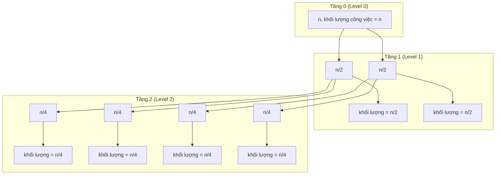
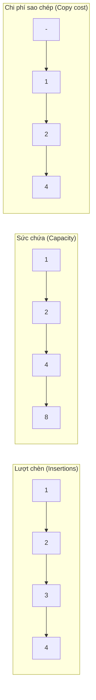
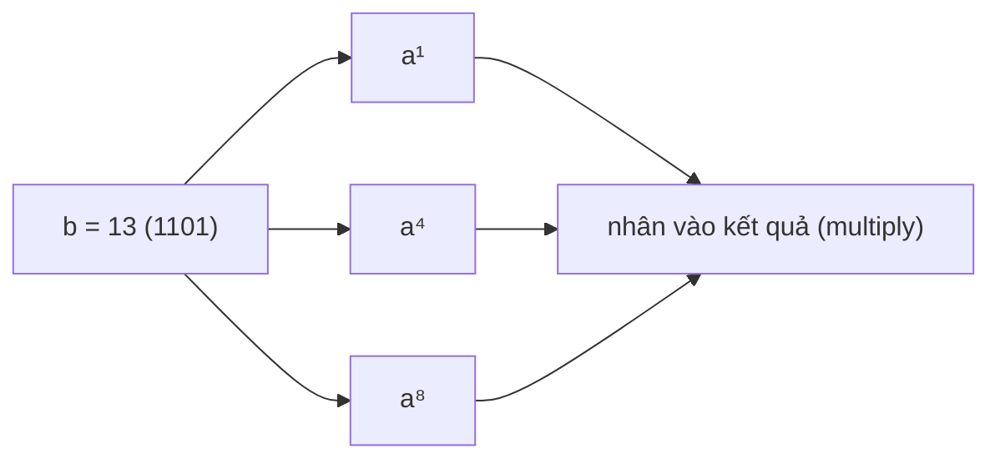

# Chương 15: Phân tích độ phức tạp & Các bài toán số học (Complexity Analysis & Numerical Problems)

Chương này trình bày các kỹ thuật phân tích độ phức tạp nâng cao (quan hệ truy hồi, Định lý thợ Master Theorem, phân tích phân bổ amortized analysis, đánh đổi giữa không gian và thời gian) cùng các thuật toán số học cơ bản (lũy thừa nhanh, Sàng Eratosthenes, tìm ước số chung lớn nhất GCD, lũy thừa đồng dư, xử lý giai thừa số lớn và số Catalan). Mỗi chủ đề đều đi kèm các liên hệ thực tế sinh động và sơ đồ trực quan.

## 1. Quan hệ truy hồi và Định lý thợ (Recurrence Relations and the Master Theorem)

**Khái niệm**: Một hệ thức truy hồi (recurrence relation) định nghĩa một hàm số thông qua các giá trị của chính nó trên các đối số đầu vào nhỏ hơn. Nó thường được sử dụng để mô tả độ phức tạp thuật toán thời gian của các giải pháp chia để trị (divide-and-conquer).

**Dạng tổng quát**:
$$T(n) = a \cdot T(n/b) + f(n)$$
Trong đó:
- $a$ = số lượng bài toán con được tạo ra sau mỗi bước chia.
- $n/b$ = kích thước của từng bài toán con sau khi chia.
- $f(n)$ = chi phí cho việc chia nhỏ bài toán ban đầu và tổng hợp (combine) các kết quả thu được ở bên ngoài đệ quy.

### 1.1 Giải hệ thức truy hồi – Định lý thợ (Master Theorem)

Đối với các quan hệ truy hồi có dạng $T(n) = a T(n/b) + O(n^d)$ (với điều kiện $d \ge 0$), kết quả độ phức tạp thời gian được xác định như sau:

| Điều kiện so sánh | Lời giải độ phức tạp thời gian |
|-----------|-----------------|
| $a < b^d$ | $T(n) = O(n^d)$ |
| $a = b^d$ | $T(n) = O(n^d \log n)$ |
| $a > b^d$ | $T(n) = O(n^{\log_b a})$ |

**Trực quan hóa qua cây đệ quy** (áp dụng cho trường hợp $a = 2, b = 2, d = 1$ – thuật toán sắp xếp trộn Merge Sort):



Tại mỗi tầng của cây, tổng khối lượng công việc thực hiện ngoài đệ quy luôn là $O(n)$. Số lượng tầng của cây là $\log_2 n$ tầng $\to$ Tổng độ phức tạp thuật toán là $O(n \log n)$.

**Liên hệ thực tế**: Giống như việc bạn phân loại một tập tài liệu lớn bằng cách liên tục chia nó làm đôi, sắp xếp riêng từng nửa và trộn chúng lại với nhau – số lần chia nhỏ tài liệu tăng theo hàm logarit, và mỗi lượt gộp trộn tài liệu đều phải duyệt qua tất cả các tờ giấy.

### 1.2 Các hệ thức truy hồi phổ biến

| Thuật toán | Quan hệ truy hồi | Độ phức tạp thời gian |
|-----------|------------|----------|
| **Tìm kiếm nhị phân** | $T(n) = T(n/2) + O(1)$ | $O(\log n)$ |
| **Sắp xếp trộn (Merge Sort)** | $T(n) = 2T(n/2) + O(n)$ | $O(n \log n)$ |
| **Nhân nhanh Karatsuba** | $T(n) = 3T(n/2) + O(n)$ | $O(n^{1.585})$ |
| **Nhân ma trận thông thường** | $T(n) = 8T(n/2) + O(n^2)$ | $O(n^3)$ |
| **Fibonacci đệ quy thuần túy** | $T(n) = T(n-1) + T(n-2) + O(1)$ | $O(2^n)$ |

## 2. Phân tích phân bổ (Amortized Analysis)

**Khái niệm**: Phân tích phân bổ (amortized analysis) tính toán chi phí trung bình của các thao tác trong một chuỗi hành động dài hạn, mang lại một cận trên chặt chẽ hơn nhiều so với việc chỉ phân tích trường hợp xấu nhất của từng thao tác đơn lẻ. Nó chứng minh rằng ngay cả khi một số thao tác đơn lẻ chạy rất chậm (chi phí cao), chi phí trung bình tính trên mỗi thao tác vẫn được duy trì ở mức thấp.

### 2.1 Mảng động (ví dụ: `std::vector` trong C++)

Khi một mảng động bị đầy dung lượng (vượt quá sức chứa), hệ thống sẽ cấp phát một vùng nhớ mới có kích thước gấp đôi, sao chép toàn bộ các phần tử cũ sang vùng nhớ mới và giải phóng vùng nhớ cũ. Chi phí cho việc cấp phát lại và sao chép này là $O(n)$, nhưng nó chỉ xảy ra rất thưa thớt sau mỗi $2^k$ lượt chèn phần tử.

- **Chi phí phân bổ cho mỗi lượt chèn**: $O(1)$.  
- **Tổng chi phí cho $n$ lượt chèn phần tử**: $O(n)$.

**Sơ đồ trực quan hóa** (quá trình nhân đôi dung lượng):



**Liên hệ thực tế**: Tương tự việc chuyển sang một căn hộ rộng gấp đôi mỗi khi đồ đạc chất đầy. Quá trình dọn nhà chuyển sang nhà mới rất tốn kém và mệt mỏi, nhưng bạn chỉ phải làm việc đó rất hiếm khi – nếu chia đều chi phí chuyển nhà cho các tháng sinh sống bình thường, chi phí trung bình mỗi tháng vẫn rất nhỏ.

### 2.2 Bộ đếm nhị phân (Thao tác tăng giá trị)

Thao tác tăng giá trị (increment) của một bộ đếm nhị phân đòi hỏi phải lật các bit (từ 0 thành 1 hoặc ngược lại). Tổng số lần lật bit trong suốt $n$ lượt tăng giá trị chỉ là $O(n)$ (vì bit thứ $k$ chỉ bị lật sau mỗi $2^k$ lượt tăng). Do đó, chi phí phân bổ cho mỗi lượt tăng giá trị là $O(1)$.

### 2.3 Các phương pháp phân tích phân bổ

- **Phương pháp cộng gộp (Aggregate method)**: Tính tổng chi phí thực tế của toàn bộ chuỗi hành động, rồi chia cho số lượng thao tác đã thực hiện.
- **Phương pháp kế toán (Accounting method)**: Gán một lượng "tín dụng" thừa cho các thao tác đơn giản, rẻ tiền để lưu trữ tích lũy lại, dùng lượng tín dụng này để bù đắp chi phí cho các thao tác phức tạp, đắt đỏ xảy ra sau đó.
- **Phương pháp thế năng (Potential method)**: Định nghĩa một hàm số thế năng đo đạc trạng thái "năng lượng tích lũy" của cấu trúc dữ liệu để bù đắp cho các biến động chi phí.

## 3. Đánh đổi giữa Không gian và Thời gian (Space‑Time Trade‑offs)

**Khái niệm**: Thông thường, bạn có thể giảm thiểu thời gian chạy của chương trình bằng cách tiêu tốn nhiều bộ nhớ hơn để lưu trữ thông tin, hoặc ngược lại, tiết kiệm bộ nhớ bằng cách chấp nhận chương trình chạy chậm hơn. Việc chọn lựa điểm cân bằng tối ưu phụ thuộc hoàn toàn vào các giới hạn ràng buộc của bài toán.

| Kịch bản đánh đổi | Chi tiết đánh đổi |
|----------|-----------|
| **Tiền xử lý dữ liệu** (Prefix sums, DP table) | Tiêu tốn thêm $O(n)$ không gian bộ nhớ để trả lời mỗi câu truy vấn trong $O(1)$ thay vì mất $O(n)$ truy vấn mà không cần không gian phụ trợ. |
| **Bảng băm (Hashing)** | Mất $O(n)$ bộ nhớ để đạt thời gian tra cứu trung bình $O(1)$ thay vì tốn $O(\log n)$ trên cây hoặc $O(n)$ tìm kiếm tuyến tính tuần tự. |
| **Ghi nhớ Quy hoạch động** | Lưu trữ sẵn các kết quả đã được tính toán (tiêu tốn bộ nhớ) để tuyệt đối không phải thực hiện tính toán lại. |
| **Thuật toán tại chỗ (In-place)** | Giới hạn không gian bộ nhớ phụ trợ ở mức $O(1)$ nhưng có thể phải sửa đổi dữ liệu đầu vào hoặc chạy chậm hơn các giải pháp sử dụng mảng phụ. |

**Liên hệ thực tế**: Việc ghi chép sẵn một cuốn sổ tay công thức nấu ăn cá nhân tại nhà (tốn không gian lưu trữ cuốn sổ) giúp bạn nấu ăn nhanh chóng thay vì mỗi lần nấu lại phải lên mạng tra cứu hướng dẫn (tốn thời gian).

## 4. Các bài toán số học (Numerical Problems)

### 4.1 Lũy thừa nhanh (Binary Exponentiation)

**Bài toán**: Tính toán giá trị $a^b$ một cách hiệu quả nhất.  
**Ý tưởng**: Sử dụng biểu diễn nhị phân của số mũ $b$ để giảm số phép nhân.  
**Độ phức tạp thời gian**: $O(\log b)$.

```cpp
long long fastPow(long long a, long long b) {
    long long result = 1;
    while (b > 0) {
        if (b & 1) result *= a;
        a *= a;
        b >>= 1;
    }
    return result;
}
```

**Sơ đồ minh họa** (Ví dụ tính $a^{13} = a^{(1101_2)} = a^8 \cdot a^4 \cdot a^1$):



**Liên hệ thực tế**: Thay vì nhân số $a$ với chính nó liên tiếp 13 lần một cách thủ công, bạn thực hiện nhân đôi số mũ liên tục ($a^1, a^2, a^4, a^8$) rồi chỉ việc nhân kết hợp các số mũ tương ứng với các chữ số 1 trong biểu diễn nhị phân của 13.

### 4.2 Sàng Eratosthenes (Sieve of Eratosthenes)

**Bài toán**: Tìm kiếm tất cả các số nguyên tố nhỏ hơn hoặc bằng $n$.  
**Hướng tiếp cận**: Lần lượt loại bỏ (đánh dấu) tất cả các bội số của mỗi số nguyên tố bắt đầu từ số 2.

```cpp
vector<bool> sieve(int n) {
    vector<bool> isPrime(n+1, true);
    isPrime[0] = isPrime[1] = false;
    for (int p = 2; p * p <= n; ++p) {
        if (isPrime[p]) {
            for (int multiple = p * p; multiple <= n; multiple += p)
                isPrime[multiple] = false;
        }
    }
    return isPrime;
}
```

- **Độ phức tạp thời gian**: $O(n \log \log n)$. **Không gian bộ nhớ**: $O(n)$.

**Ví dụ trực quan minh họa** với $n = 30$:

```
Trạng thái đầu: 2 3 4 5 6 7 8 9 10 11 12 13 14 15 16 17 18 19 20 21 22 23 24 25 26 27 28 29 30
Bội số của 2:    4   6   8   10   12   14   16   18   20   22   24   26   28   30  (đã loại)
Bội số của 3:        6   9      12      15      18      21      24      27      30  (đã loại)
Bội số của 5:               10      15      20      25      30                      (đã loại)
Các số còn lại là số nguyên tố: 2 3 5 7 11 13 17 19 23 29
```

**Liên hệ thực tế**: Giống như trong một lớp học, thầy giáo yêu cầu tất cả các học sinh ở vị trí số chẵn ngồi xuống (loại bội số của 2), tiếp theo yêu cầu các bạn ở vị trí chia hết cho 3 ngồi xuống, và tiếp tục như vậy. Các học sinh còn đứng lại cuối cùng chính là các bạn ở vị trí số nguyên tố.

### 4.3 Ước số chung lớn nhất – Thuật toán Euclid (GCD – Euclidean Algorithm)

**Bài toán**: Tìm ước số chung lớn nhất của hai số nguyên $a$ và $b$.  
**Ý tưởng**: Dựa trên tính chất toán học $\text{gcd}(a, b) = \text{gcd}(b, a \pmod b)$.

```cpp
int gcd(int a, int b) {
    while (b) {
        int t = b;
        b = a % b;
        a = t;
    }
    return a;
}
```

- **Độ phức tạp thời gian**: $O(\log \min(a, b))$.
- **Chứng minh**: Sau mỗi bước chia lấy dư, các giá trị số luôn bị giảm đi ít nhất là một nửa.

**Liên hệ thực tế**: Tìm kích thước của viên gạch hình vuông lớn nhất để có thể lát kín hoàn toàn một mặt sàn hình chữ nhật kích thước $a \times b$ mà không cần cắt gạch. Bạn liên tục cắt các mảnh vuông kích thước $b \times b$ ra khỏi hình chữ nhật $a \times b$; phần sàn hình chữ nhật dư còn lại trở thành bài toán mới nhỏ hơn.

### 4.4 Lũy thừa đồng dư (Modular Exponentiation)

**Bài toán**: Tính toán giá trị $(a^b) \pmod m$ một cách hiệu quả và phòng ngừa hiện tượng tràn số (overflow).  
**Hướng tiếp cận**: Kết hợp thuật toán lũy thừa nhanh đồng thời thực hiện phép chia lấy dư modulo tại mỗi bước nhân trung gian.

```cpp
long long modPow(long long a, long long b, long long m) {
    long long result = 1;
    a %= m;
    while (b > 0) {
        if (b & 1) result = (result * a) % m;
        a = (a * a) % m;
        b >>= 1;
    }
    return result;
}
```

- **Độ phức tạp thời gian**: $O(\log b)$.
- **Ứng dụng**: Mật mã học (thuật toán mã hóa RSA), hàm băm, tính toán các lũy thừa lớn trong toán học thi đấu mà không sợ tràn kiểu dữ liệu.

### 4.5 Tính giai thừa của số lớn (Xử lý tràn số)

Đối với các giá trị $n$ lớn, kết quả giai thừa $n!$ sẽ vượt quá giới hạn lưu trữ của các kiểu dữ liệu số nguyên tiêu chuẩn. Hai hướng giải quyết phổ biến bao gồm:

1. **Tính toán lấy dư theo modulo** (cực kỳ phổ biến trong các kỳ thi lập trình thi đấu):  
   $\text{fact}[i] = (\text{fact}[i-1] \times i) \pmod{\text{MOD}}$.
2. **Tính toán giá trị chính xác tuyệt đối** bằng cách tự xây dựng lớp số lớn (Big Integer) hoặc dùng kiểu số hỗ trợ sẵn như `__int128` trong trình biên dịch GCC hoặc các thư viện ngoài.

```cpp
// Tính giai thừa đồng dư modulo
long long factMod(int n, long long mod) {
    long long res = 1;
    for (int i = 2; i <= n; ++i) res = (res * i) % mod;
    return res;
}
```

**Liên hệ thực tế**: Tính toán số lượng cách sắp xếp của một bộ bài lớn. Con số thực tế là cực kỳ khổng lồ; thông thường chúng ta chỉ quan tâm đến số dư của kết quả này sau khi chia cho một số nguyên tố lớn để phục vụ việc so khớp hoặc lưu trữ mã băm.

### 4.6 Số Catalan (Catalan Numbers)

**Định nghĩa**: Số Catalan dùng để đếm số lượng các cấu trúc tổ hợp phổ biến:  
- Số lượng dãy ngoặc hợp lệ cấu thành từ $n$ cặp dấu ngoặc đóng mở.
- Số lượng cấu trúc cây tìm kiếm nhị phân phân biệt có thể tạo ra từ $n$ nút.
- Số lượng cách phân chia một đa giác lồi $n+2$ cạnh thành các tam giác bằng các đường chéo không giao nhau.

**Hệ thức truy hồi**:
$$C_0 = 1$$
$$C_{n+1} = \sum_{i=0}^{n} C_i \cdot C_{n-i} \quad (\text{với } n \ge 0)$$
Công thức tổng quát dạng đóng: $C_n = \frac{1}{n+1} \binom{2n}{n}$.

**Các số Catalan đầu tiên**: 1, 1, 2, 5, 14, 42, 132, 429, 1430,...

**Cài đặt thuật toán bằng Quy hoạch động**:

```cpp
long long catalan(int n) {
    vector<long long> C(n+1, 0);
    C[0] = 1;
    for (int i = 1; i <= n; ++i)
        for (int j = 0; j < i; ++j)
            C[i] += C[j] * C[i-1-j];
    return C[n];
}
```

- **Độ phức tạp thời gian**: $O(n^2)$. Đối với các giá trị $n$ rất lớn, ta nên tính toán trực tiếp thông qua công thức dạng đóng kết hợp với các phép toán chia modulo nghịch đảo.
- **Liên hệ thực tế**: Số lượng cách đặt dấu ngoặc hợp lý cho một biểu thức toán học dài (ví dụ: $a+b+c+d$). Đối với 4 số hạng, ta có đúng 5 cấu trúc cây nhị phân phân biệt tương ứng với số Catalan thứ 3 (bằng 5).

## 5. Bảng tổng hợp các thuật toán số học

| Khái niệm / Thuật toán | Công thức / Phương pháp chính | Độ phức tạp thời gian | Độ phức tạp bộ nhớ |
|---------|----------------------|----------------|------------------|
| **Định lý thợ (Master Theorem)** | Giải truy hồi dạng $T(n) = aT(n/b) + O(n^d)$ | Phụ thuộc vào các trường hợp | $O(1)$ |
| **Phân tích phân bổ** | Khấu hao chi phí nhân đôi mảng động | $O(1)$ phân bổ | $O(n)$ |
| **Lũy thừa nhanh** | Nhân đôi cơ số theo bit nhị phân | $O(\log b)$ | $O(1)$ |
| **Sàng Eratosthenes** | Loại bỏ bội số của các số nguyên tố | $O(n \log \log n)$ | $O(n)$ |
| **Thuật toán Euclid GCD** | Chia lấy dư liên tiếp `gcd(b, a % b)` | $O(\log \min(a,b))$ | $O(1)$ |
| **Lũy thừa đồng dư** | Lũy thừa nhanh kết hợp modulo từng bước | $O(\log b)$ | $O(1)$ |
| **Số Catalan (DP)** | Tính toán theo hệ thức $C_{n+1} = \sum C_i C_{n-i}$ | $O(n^2)$ | $O(n)$ |

Chương tiếp theo sẽ bao gồm các kiến thức nền tảng về thiết kế hệ thống (System Design) cực kỳ quan trọng cho các cuộc phỏng vấn (bao gồm khả năng mở rộng hệ thống scalability, cơ chế lưu trữ đệm caching, cân bằng tải load balancing, chỉ mục cơ sở dữ liệu database indexing,...).
