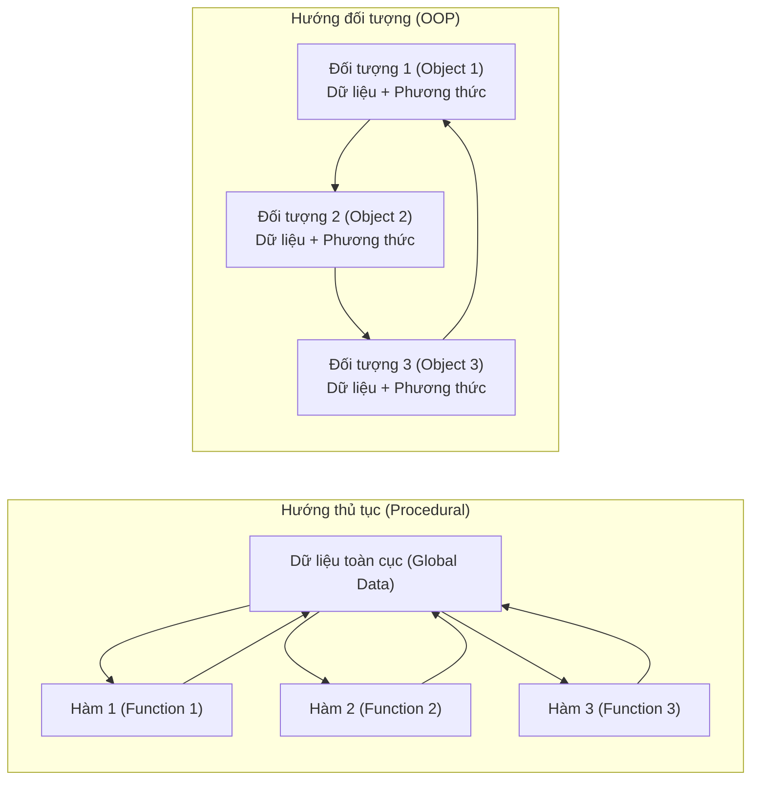
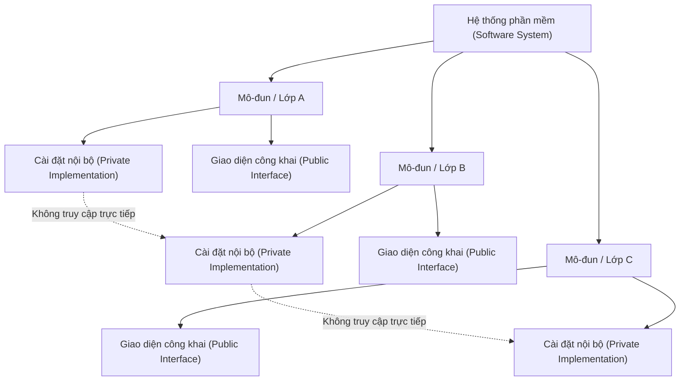
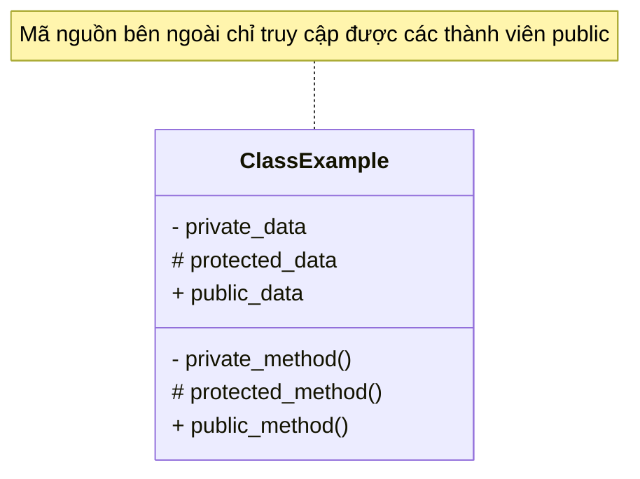
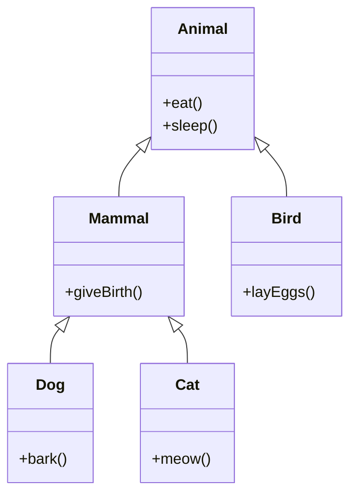
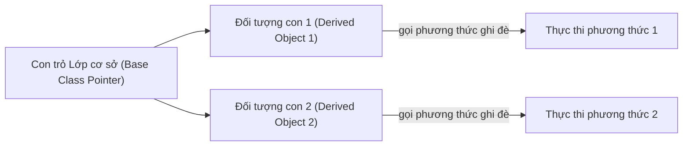
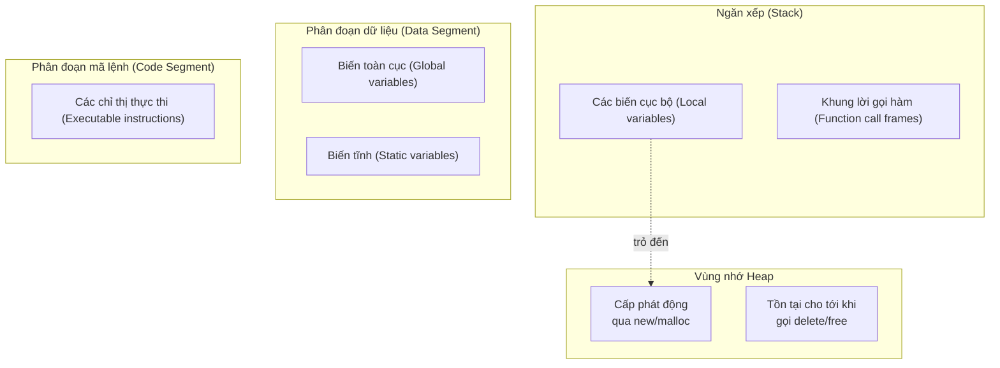
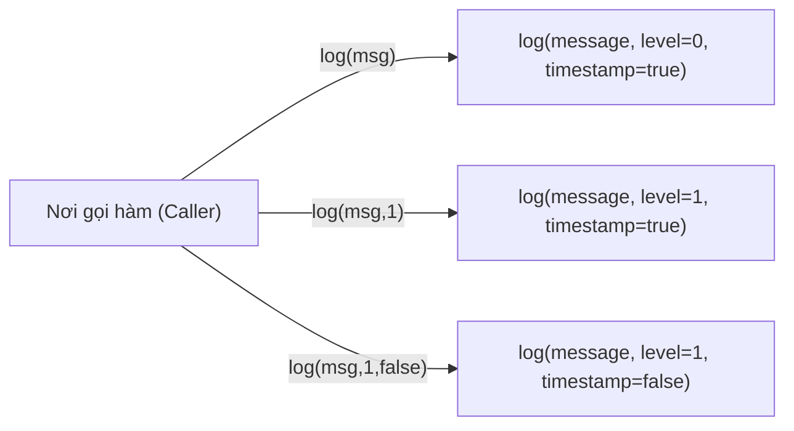

# Chương 1: Giới thiệu về OOP và Các kiến thức C++ cơ bản (Introduction to OOP and C++ Basics)

## 1.1 Lập trình hướng thủ tục so với Lập trình hướng đối tượng (Procedural vs Object-Oriented Programming)

Phát triển phần mềm có thể tuân theo nhiều mô hình (paradigms) thiết kế khác nhau. Trong đó, hai mô hình lập trình cơ bản và phổ biến nhất là lập trình hướng thủ tục (procedural programming) và lập trình hướng đối tượng (object-oriented programming - OOP).

### Lập trình hướng thủ tục (Procedural Programming)

Trong lập trình hướng thủ tục, chương trình được tổ chức thành một chuỗi các thủ tục (hàm - functions) để xử lý dữ liệu. Dữ liệu thường được lưu dưới dạng toàn cục (global) hoặc được truyền một cách tường minh giữa các hàm. Trọng tâm của phương pháp này là "cái gì xảy ra" – tức là quy trình thực hiện theo từng bước.

**Đặc điểm:**
- Thiết kế từ trên xuống (Top-down design).
- Các hàm dùng chung dữ liệu toàn cục.
- Khả năng tái sử dụng mã nguồn hạn chế (phải sao chép mã nguồn hoặc xây dựng các thư viện hàm).
- Khó khăn trong việc mô hình hóa các thực thể ngoài đời thực.

### Lập trình hướng đối tượng (Object-Oriented Programming - OOP)

Trong lập trình hướng đối tượng, chương trình được tổ chức xoay quanh các đối tượng (objects) bao bọc (encapsulate) cả dữ liệu (data) và hành vi (methods/functions). Mỗi đối tượng đại diện cho một thực thể cụ thể trong miền bài toán. Trọng tâm của phương pháp này là "ai làm việc gì" – các đối tượng tương tác với nhau bằng cách truyền đi các thông điệp (gọi phương thức).

**Đặc điểm:**
- Thiết kế từ dưới lên hoặc thiết kế lai (Bottom-up or hybrid design).
- Ẩn giấu dữ liệu và bao bọc trạng thái (Data hiding and encapsulation).
- Khả năng tái sử dụng cực cao thông qua cơ chế kế thừa (inheritance) và cấu thành (composition).
- Mô hình hóa cực kỳ tự nhiên các hệ thống trong đời sống thực tế.

### Sơ đồ đối chiếu so sánh



| Tiêu chí | Hướng thủ tục | Hướng đối tượng |
|--------|------------|-----------------|
| **Đơn vị cơ bản** | Hàm (Function) | Đối tượng (Object) |
| **Truy cập dữ liệu** | Toàn cục hoặc truyền qua tham số | Được bao bọc kín trong đối tượng (Encapsulated) |
| **Tái sử dụng mã nguồn** | Các thư viện hàm | Kế thừa (Inheritance), Cấu thành (Composition) |
| **Ảnh hưởng của sửa đổi** | Lan rộng ra nhiều nơi | Giới hạn cục bộ bên trong phạm vi lớp |
| **Ngôn ngữ tiêu biểu** | C, Pascal, Fortran | C++, Java, C#, Python |

---

## 1.2 Các lợi ích của Lập trình hướng đối tượng (OOP)

OOP mang lại ba ưu thế cực kỳ lớn cho kỹ nghệ phần mềm.

### Tính mô-đun (Modularity)

Một lớp (class) là một mô-đun độc lập và tự đóng gói hoàn chỉnh. Nó định nghĩa toàn bộ dữ liệu và các thao tác liên quan đến một khái niệm cụ thể (ví dụ: `BankAccount`, `Student`, `Vehicle`). Những thay đổi về mặt cài đặt bên trong một lớp sẽ không gây ảnh hưởng tới các phần khác của chương trình, miễn là giao diện công khai (public interface) của nó không thay đổi. Điều này giúp giảm thiểu thời gian phát triển và hạn chế lỗi lan truyền.

### Tính tái sử dụng (Reusability)

Các lớp đã có sẵn có thể dễ dàng được mở rộng thông qua tính kế thừa (mối quan hệ *is-a* - là một) hoặc được kết hợp thông qua tính cấu thành (mối quan hệ *has-a* - có một). Ngoài ra, ngôn ngữ C++ còn cung cấp các khuôn mẫu (templates) để viết các khối mã nguồn tổng quát có tính tái sử dụng cực kỳ cao. Thay vì phải viết lại mã nguồn, các nhà phát triển chỉ cần dẫn xuất các lớp mới từ các lớp cơ sở sẵn có, kế thừa và định nghĩa đè (override) các hành vi mong muốn.

### Khả năng bảo trì (Maintainability)

Tính đóng gói giúp ẩn giấu các chi tiết cài đặt nội bộ. Khi xảy ra lỗi (bug), bạn có thể khoanh vùng và xác định chính xác lớp nào chịu trách nhiệm cho lỗi đó. Các lớp được thiết kế tốt sẽ giúp tạo nên sự liên kết lỏng (loose coupling) – mỗi lớp chỉ gánh vác một trách nhiệm duy nhất và rõ ràng. Điều này giúp cho việc gỡ lỗi, kiểm thử và tái cấu trúc mã nguồn (refactoring) trở nên dễ dàng dự đoán và thực hiện hơn.



---

## 1.3 Bốn cột trụ của Lập trình hướng đối tượng (OOP)

Bốn khái niệm nền tảng dưới đây tạo nên xương sống vững chắc cho lập trình hướng đối tượng.

### Tính đóng gói (Encapsulation)

Tính đóng gói (Encapsulation) là cơ chế gộp chung dữ liệu (thuộc tính) và các phương thức xử lý dữ liệu đó vào trong một đơn vị duy nhất (gọi là lớp - class), đồng thời giới hạn quyền truy cập trực tiếp từ bên ngoài vào dữ liệu nội bộ đó. Trong C++, các phạm vi truy cập (`private`, `protected`, `public`) được sử dụng để thực thi và bảo đảm tính đóng gói.



### Tính trừu tượng (Abstraction)

Tính trừu tượng (Abstraction) nghĩa là chỉ biểu diễn ra ngoài các tính năng thiết yếu của đối tượng mà ẩn đi toàn bộ các chi tiết cài đặt phức tạp bên trong. Trong C++, tính trừu tượng đạt được thông qua việc công bố các giao diện công khai (public interfaces), các lớp trừu tượng (abstract classes - chứa các hàm ảo thuần túy), và việc phân tách phần khai báo (trong tệp header `.h`/`.hpp`) ra khỏi phần định nghĩa (trong tệp nguồn `.cpp`).

### Tính kế thừa (Inheritance)

Tính kế thừa (Inheritance) cho phép một lớp mới (lớp dẫn xuất / lớp con - derived class) kế thừa và sở hữu các thuộc tính cũng như hành vi từ một lớp đã có sẵn (lớp cơ sở / lớp cha - base class). Điều này thiết lập nên mối quan hệ chuyên biệt hóa "is-a" (là một). C++ hỗ trợ rất nhiều loại kế thừa khác nhau, bao gồm: đơn kế thừa, đa kế thừa, kế thừa nhiều cấp, kế thừa phân cấp, và kế thừa lai (hybrid).



### Tính đa hình (Polymorphism)

Tính đa hình (Polymorphism - nhiều hình thái) cho phép các đối tượng thuộc các lớp con khác nhau có thể được đối xử như là các đối tượng thuộc cùng một lớp cha chung, nhờ đó phương thức phù hợp nhất của lớp con thực tế sẽ tự động được gọi dựa trên kiểu đối tượng thực sự lúc chạy chương trình. C++ thực hiện tính đa hình động thông qua việc sử dụng các hàm ảo (virtual functions) và cơ chế liên kết động (dynamic binding).



---

## 1.4 C++ dưới vai trò Ngôn ngữ đa mô hình (Multi-Paradigm Language)

C++ không phải là một ngôn ngữ hướng đối tượng thuần túy. Nó hỗ trợ đồng thời rất nhiều mô hình lập trình khác nhau, mang lại sự linh hoạt tối đa cho các lập trình viên khi giải quyết các vấn đề.

| Mô hình lập trình | Các tính năng C++ hỗ trợ |
|----------|---------------|
| **Hướng thủ tục (Procedural)** | Hàm, vòng lặp, câu lệnh rẽ nhánh, mảng, con trỏ |
| **Hướng đối tượng (OOP)** | Lớp, tính kế thừa, tính đa hình, tính đóng gói |
| **Tổng quát (Generic)** | Khuôn mẫu (khuôn mẫu hàm, khuôn mẫu lớp - Templates) |
| **Chức năng (Functional)** | Biểu thức Lambda (C++11), `std::function`, `std::bind`, các thuật toán STL |

Tính chất đa mô hình này cho phép ngôn ngữ C++ có thể đáp ứng cực kỳ tốt từ các tác vụ lập trình hệ thống cấp thấp (low-level systems) cho đến việc phát triển các ứng dụng doanh nghiệp cấp cao (high-level applications).

---

## 1.5 Ôn tập Cú pháp C++ cơ bản

Các phần dưới đây ôn tập lại một số cú pháp C++ thiết yếu trước khi chúng ta đi sâu vào khám phá chi tiết về lớp và đối tượng.

### 1.5.1 Nhập và Xuất dữ liệu (Input and Output)

C++ sử dụng các luồng dữ liệu (streams) cho việc nhập/xuất. Thư viện chuẩn C++ cung cấp các luồng `cin`, `cout`, và `cerr`.

```cpp
#include <iostream>

int main() {
    int age;
    std::cout << "Nhap tuoi cua ban: "; // Xuất dữ liệu ra màn hình
    std::cin >> age;                    // Nhập dữ liệu từ bàn phím
    std::cerr << "Loi: tuoi khong hop le" << std::endl; // Xuất luồng lỗi (không đệm - unbuffered)
    return 0;
}
```

- `cout` (character output) – luồng xuất có đệm (buffered), dùng cho các thông tin thông thường của chương trình.
- `cin` (character input) – luồng nhập, dùng để trích xuất dữ liệu có định dạng từ đầu vào chuẩn.
- `cerr` (character error) – luồng lỗi không đệm (unbuffered), dùng để xuất các thông báo lỗi ngay lập tức ra màn hình.
- `clog` – phiên bản có đệm của luồng lỗi, thường dùng để ghi nhật ký (logging).

Các bộ điều khiển định dạng (manipulators) như `std::endl` (xuống dòng + xả bộ đệm - flush) và `std::flush` được sử dụng để điều khiển hoạt động của luồng xuất.

### 1.5.2 Không gian tên (Namespaces)

Không gian tên (Namespaces) giúp ngăn ngừa xung đột trùng tên hàm/lớp trong các dự án phần mềm lớn. Toàn bộ thư viện chuẩn của C++ đều nằm gọn bên trong không gian tên `std`.

```cpp
#include <vector>

// Cách 1: Sử dụng chỉ định tường minh đầy đủ
std::vector<int> v;

// Cách 2: Sử dụng khai báo using (chỉ mang một tên cụ thể vào phạm vi sử dụng)
using std::vector;
vector<int> v2;

// Cách 3: Sử dụng chỉ thị using (mang toàn bộ tên ra - nên tránh dùng trong tệp header)
using namespace std;
vector<int> v3; // Bây giờ không cần viết std:: trước vector nữa

// Định nghĩa không gian tên tùy biến
namespace MyLibrary {
    void compute() {}
    class Matrix {};
}

// Cách sử dụng
MyLibrary::compute();
```

Quy chuẩn lập trình tốt nhất: Tuyệt đối tránh viết `using namespace std;` bên trong các tệp tiêu đề (header files `.h`/`.hpp`) và trong các mã nguồn của dự án lớn. Hãy sử dụng chỉ định tường minh `std::` hoặc lựa chọn khai báo `using` một cách có chọn lọc.

### 1.5.3 Tham chiếu so với Con trỏ (References vs Pointers)

Mặc dù cả tham chiếu (references) và con trỏ (pointers) đều cung cấp cơ chế truy cập gián tiếp đến đối tượng, tuy nhiên chúng có các điểm khác biệt cốt lõi sau:

| Đặc điểm | Con trỏ (Pointer) | Tham chiếu (Reference) |
|---------|---------|-----------|
| **Có thể trỏ NULL** | Có thể (trỏ đến địa chỉ rỗng) | Không thể (bắt buộc phải gắn với một đối tượng hợp lệ ngay khi khai báo) |
| **Thay đổi đối tượng trỏ tới** | Có thể (thay đổi địa chỉ mà con trỏ đang lưu trữ) | Không thể (luôn gắn chặt với đối tượng ban đầu trong suốt vòng đời) |
| **Cú pháp sử dụng** | Phải dùng các toán tử định địa chỉ `&` và toán tử giải tham chiếu `*` | Cú pháp tự nhiên, hoạt động giống như một tên gọi khác (bí danh - alias) của biến |
| **Chi phí bộ nhớ** | Chiếm dụng bộ nhớ làm con trỏ (4 bytes trên 32-bit, 8 bytes trên 64-bit) | Thường không tốn thêm bộ nhớ (phụ thuộc vào trình biên dịch) |
| **Phép toán số học** | Có hỗ trợ (phép toán cộng trừ trên con trỏ) | Không hỗ trợ |
| **Mục đích sử dụng chính** | Cấp phát bộ nhớ động, quản lý mảng, truyền tham số tùy chọn | Truyền tham số cho hàm (tham chiếu hằng để tránh sao chép), tạo bí danh biến |

**Ví dụ mã nguồn minh họa:**

```cpp
int a = 10, b = 20;

// Sử dụng Con trỏ (Pointer)
int* ptr = &a;   // ptr lưu trữ địa chỉ của biến a
*ptr = 15;       // Thay đổi giá trị tại địa chỉ trỏ tới: biến a trở thành 15
ptr = &b;        // Thay đổi con trỏ: bây giờ ptr chuyển sang trỏ đến địa chỉ của b

// Sử dụng Tham chiếu (Reference)
int& ref = a;    // ref trở thành một tên gọi khác của biến a
ref = 25;        // Thay đổi qua tham chiếu: biến a trở thành 25
// ref = b;      // Lưu ý: Lệnh này thực chất là gán giá trị của b cho a, chứ KHÔNG phải chuyển ref sang tham chiếu biến b.

// Truyền tham số dạng tham chiếu (Ứng dụng cực kỳ phổ biến)
void swap(int& x, int& y) {
    int temp = x;
    x = y;
    y = temp;
}
```

### 1.5.4 Quản lý Bộ nhớ động (Dynamic Memory Management)

C++ cho phép lập trình viên tự cấp phát bộ nhớ thủ công trên vùng nhớ Heap bằng hai toán tử `new` và `delete`. Khác với các biến cấp phát trên Stack tự hủy khi ra khỏi phạm vi khối lệnh, bộ nhớ trên Heap sẽ tồn tại liên tục cho tới khi được giải phóng một cách tường minh.

```cpp
// Cấp phát và hủy đối tượng đơn lẻ
int* p = new int(42);     // Cấp phát một ô nhớ kiểu int trên Heap và khởi tạo giá trị bằng 42
delete p;                  // Giải phóng vùng nhớ Heap
p = nullptr;               // Quy chuẩn tốt: Đặt con trỏ về nullptr để tránh con trỏ rác (dangling pointer)

// Cấp phát và hủy mảng phần tử
int* arr = new int[100];   // Cấp phát mảng gồm 100 số nguyên trên Heap
delete[] arr;              // Giải phóng mảng trên Heap (bắt buộc phải có ký hiệu [])

// Cấp phát mảng 2 chiều động
int** matrix = new int*[rows];
for (int i = 0; i < rows; ++i)
    matrix[i] = new int[cols];

// Giải phóng bộ nhớ mảng 2 chiều
for (int i = 0; i < rows; ++i)
    delete[] matrix[i];
delete[] matrix;
```

**Sơ đồ bố trí bộ nhớ (Memory Layout):**



**Các quy tắc sống còn:**
- Mỗi toán tử `new` bắt buộc phải đi kèm tương ứng với một toán tử `delete`.
- Mỗi toán tử `new[]` bắt buộc phải đi kèm tương ứng với một toán tử `delete[]`.
- Việc giải phóng một vùng nhớ đã được giải phóng trước đó (double delete) sẽ gây ra hành vi không xác định (undefined behavior).
- Trong kỷ nguyên C++ hiện đại, khuyến cáo hạn chế tối đa việc sử dụng các lệnh cấp phát thô `new`/`delete` – hãy chuyển sang sử dụng con trỏ thông minh (`std::unique_ptr`, `std::shared_ptr`) và các bộ lưu trữ chuẩn (vector, array).

### 1.5.5 Quá tải hàm và Tham số mặc định

**Quá tải hàm (Function Overloading):** C++ cho phép nhiều hàm có thể dùng chung một tên gọi duy nhất, miễn là danh sách tham số truyền vào của chúng khác nhau (về kiểu dữ liệu, số lượng, hoặc thứ tự các tham số). Chỉ riêng kiểu trả về của hàm không thể dùng để phân biệt các hàm quá tải.

```cpp
int add(int a, int b) { return a + b; }
double add(double a, double b) { return a + b; }
int add(int a, int b, int c) { return a + b + c; }

// Các lời gọi hàm tương ứng:
add(5, 10);        // Trình biên dịch gọi phiên bản 1 (int, int)
add(3.5, 2.7);     // Trình biên dịch gọi phiên bản 2 (double, double)
add(1, 2, 3);      // Trình biên dịch gọi phiên bản 3 (int, int, int)
```

Quá trình phân giải quá tải (overload resolution) sẽ lựa chọn hàm khớp nhất với tham số truyền vào. Các lời gọi hàm gây nhập nhằng mơ hồ (ví dụ: `add(1, 2.5)`) sẽ bị trình biên dịch báo lỗi ngay lập tức.

**Tham số mặc định (Default Arguments):** Chúng ta có thể gán sẵn các giá trị mặc định cho tham số của hàm, cho phép người gọi hàm có thể lược bỏ đi các đối số ở phía cuối khi gọi hàm.

```cpp
void log(const std::string& message, int level = 0, bool timestamp = true) {
    // Thực thi ghi nhật ký
}

// Các lời gọi hàm hợp lệ:
log("He thong da khoi dong");             // level=0, timestamp=true (sử dụng mặc định)
log("Canh bao nguy hiem", 1);             // level=1, timestamp=true (chỉ định đè level)
log("Loi he thong", 2, false);            // level=2, timestamp=false (chỉ định đầy đủ)

// Lời gọi hàm SAI: Không được phép bỏ qua tham số ở giữa để gán tham số cuối
// log("Loi", , false);   // Lỗi biên dịch!
```

**Các quy tắc khi sử dụng tham số mặc định:**
- Các tham số mặc định bắt buộc phải được khai báo lần lượt từ phải qua trái (các tham số không có giá trị mặc định phải nằm trước).
- Giá trị mặc định được phân giải ngay tại thời điểm biên dịch (dựa vào phần khai báo hàm hiển thị tại nơi gọi).
- Tránh sử dụng tham số mặc định trên các phương thức ảo (virtual functions) để ngăn ngừa các hành vi bất ngờ do cơ chế đa hình động.



---

## Tóm tắt chương

Chương này đã giới thiệu về sự chuyển dịch tư duy từ lập trình hướng thủ tục sang lập trình hướng đối tượng, trình bày bốn cột trụ chính của OOP (tính đóng gói, tính trừu tượng, tính kế thừa, tính đa hình), đồng thời ôn tập lại các cú pháp C++ cơ bản cần có trước khi chúng ta bắt tay vào thiết kế các lớp học cụ thể. Các chương tiếp theo sẽ xây dựng trên nền tảng vững chắc này để hướng dẫn các bạn triển khai các thiết kế hướng đối tượng hoàn chỉnh và tối ưu trong C++.
