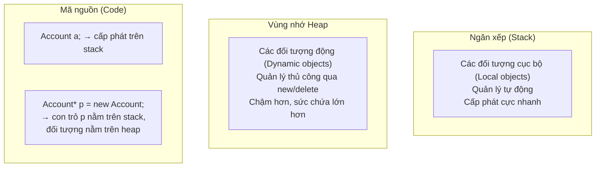
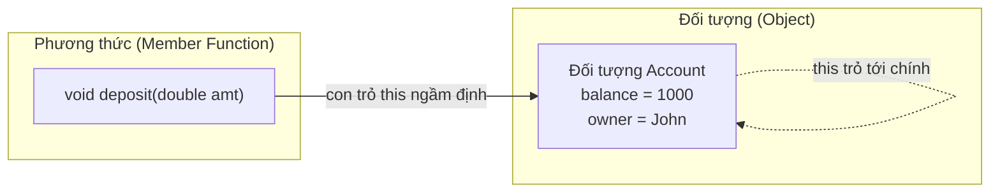
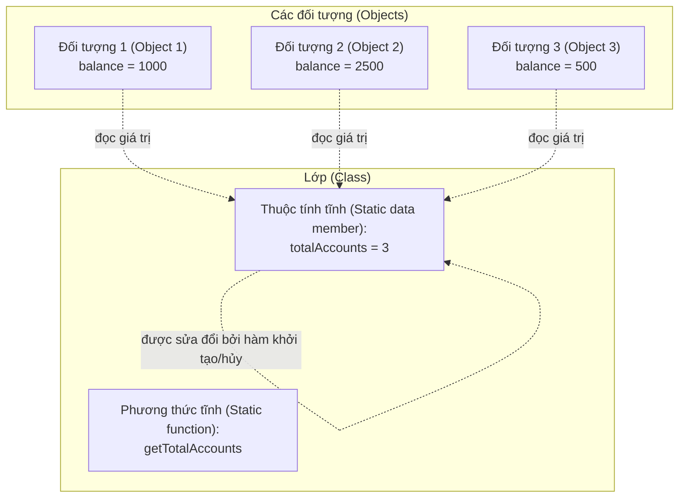
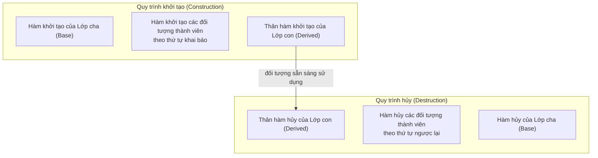

# Chương 2: Lớp và Đối tượng (Classes and Objects)

Chương này trình bày các khái niệm nền tảng của lập trình hướng đối tượng trong C++ xoay quanh lớp (class) và đối tượng (object). Các chủ đề bao gồm: kiểm soát quyền truy cập, quản lý vòng đời đối tượng, con trỏ `this`, các thành viên tĩnh (static members), hàm khởi tạo (constructors), hàm hủy (destructor), và các quy chuẩn tốt nhất để khởi tạo đối tượng.

## 1. Định nghĩa một Lớp (Defining a Class)

Một lớp (class) là một kiểu dữ liệu do người dùng tự định nghĩa nhằm bao bọc (encapsulate) các thuộc tính dữ liệu (data members - các biến) và các phương thức thành viên (member functions - các hàm). Các phạm vi truy cập (access specifiers) được sử dụng để kiểm soát khả năng hiển thị của các thành viên trong lớp.

### Các phạm vi truy cập (Access Specifiers)

| Phạm vi truy cập | Quyền truy cập |
|-----------|--------|
| `public` | Có thể truy cập được từ bất kỳ nơi đâu ngoài lớp |
| `private` | Chỉ có thể truy cập được từ bên trong nội bộ của chính lớp đó (đây là phạm vi mặc định của lớp) |
| `protected` | Chỉ có thể truy cập được từ bên trong lớp hiện tại và các lớp kế thừa từ nó |

```cpp
class Account {
public:
    // Giao diện công khai (Public interface)
    void deposit(double amount);
    double getBalance() const;
    
private:
    // Thuộc tính dữ liệu riêng tư (Private data)
    double balance = 0.0;
    std::string accountNumber;
    
protected:
    // Thuộc tính bảo vệ phục vụ kế thừa
    int accountType;
};
```

## 2. Tạo Đối tượng (Creating Objects)

Các đối tượng có thể được cấp phát vùng nhớ trên Stack (quản lý bộ nhớ tự động) hoặc trên Heap (quản lý bộ nhớ động).

### Cấp phát trên Stack (Stack Allocation)

```cpp
Account acc;                    // Gọi hàm khởi tạo mặc định (default constructor)
Account user("John", 1000);     // Gọi hàm khởi tạo có tham số (parameterized constructor)
// Đối tượng tự động bị hủy khi ra khỏi phạm vi khối lệnh (out of scope)
```

### Cấp phát trên Heap (Heap Allocation)

```cpp
Account* accPtr = new Account("John", 1000);
delete accPtr;  // Bắt buộc phải giải phóng bộ nhớ thủ công
```

### So sánh bộ nhớ



## 3. Truy cập các thành viên của Lớp

Sử dụng toán tử chấm (`.`) đối với các đối tượng thông thường và các tham chiếu (references), và sử dụng toán tử mũi tên (`->`) đối với các con trỏ (pointers).

```cpp
Account acc;                    // Đối tượng nằm trên stack
acc.deposit(500);               // Sử dụng toán tử chấm

Account* pAcc = new Account();  // Con trỏ trỏ tới đối tượng trên heap
pAcc->deposit(500);             // Sử dụng toán tử mũi tên
(*pAcc).deposit(500);           // Cú pháp tương đương: giải tham chiếu + toán tử chấm

delete pAcc;
```

## 4. Con trỏ `this` (The `this` Pointer)

Mỗi phương thức thành viên phi tĩnh (non-static member function) đều sở hữu một tham số ngầm định là `this` lưu địa chỉ trỏ tới chính đối tượng hiện tại đang thực thi phương thức đó. Con trỏ `this` cực kỳ hữu ích trong các trường hợp:

- Giải quyết xung đột trùng tên giữa tham số truyền vào và thuộc tính của lớp.
- Thực hiện cơ chế gọi chuỗi phương thức liên tiếp (method chaining).
- Trả về tham chiếu trỏ tới chính đối tượng hiện tại.

```cpp
class Counter {
    int value;
public:
    Counter& setValue(int value) {
        this->value = value;   // this->value giúp chỉ rõ thuộc tính của lớp, tránh trùng tên với tham số
        return *this;          // Trả về tham chiếu tới chính đối tượng hiện tại
    }
    
    Counter& increment() {
        value++;
        return *this;
    }
};

// Cách sử dụng: gọi chuỗi liên tiếp (chaining)
Counter c;
c.setValue(5).increment().increment();
```

### Sơ đồ trực quan



## 5. Các thành viên tĩnh (Static Members)

Các thành viên tĩnh (Static members) thuộc về chính lớp học đó chứ không thuộc về bất kỳ đối tượng cụ thể nào riêng biệt. Chúng được chia sẻ chung và duy nhất giữa tất cả các thực thể (instances) của lớp.

### Thuộc tính tĩnh (Static Data Members)

- Phải được định nghĩa ở bên ngoài lớp (trong một đơn vị dịch translation unit duy nhất - tệp nguồn `.cpp`).
- Được khởi tạo từ trước khi bất kỳ đối tượng nào của lớp được tạo ra.
- Thường dùng để đếm số lượng đối tượng hiện có, chia sẻ cấu hình dùng chung, hoặc triển khai mẫu thiết kế đơn thể (Singleton).

```cpp
class BankAccount {
    static int totalAccounts;      // Khai báo thuộc tính tĩnh
    static constexpr double taxRate = 0.15;  // Khởi tạo trực tiếp (inline) hằng tĩnh (C++17)
    
public:
    BankAccount() { totalAccounts++; }
    ~BankAccount() { totalAccounts--; }
    
    static int getTotalAccounts() { return totalAccounts; }
};

// Định nghĩa thuộc tính tĩnh trong tệp nguồn .cpp
int BankAccount::totalAccounts = 0;
```

### Phương thức tĩnh (Static Member Functions)

- Chỉ có thể truy cập được đến các thuộc tính tĩnh và các phương thức tĩnh khác của lớp.
- Có thể được gọi một cách độc lập mà không cần tạo ra bất kỳ đối tượng nào (thông qua tên lớp và toán tử phân giải phạm vi `::`).

```cpp
int count = BankAccount::getTotalAccounts(); // Gọi phương thức tĩnh qua tên lớp
```

### Sơ đồ chia sẻ dữ liệu tĩnh



## 6. Hàm khởi tạo (Constructors)

Hàm khởi tạo (Constructors) dùng để thiết lập giá trị ban đầu cho đối tượng ngay khi được tạo ra. Chúng có tên gọi trùng hoàn toàn với tên lớp và không có kiểu dữ liệu trả về (kể cả `void`).

### Hàm khởi tạo mặc định (Default Constructor)

Là hàm khởi tạo không nhận bất kỳ tham số nào đầu vào. Trình biên dịch sẽ tự động sinh ra một hàm khởi tạo mặc định rỗng nếu bạn không khai báo bất kỳ hàm khởi tạo nào trong lớp.

```cpp
class Point {
    int x, y;
public:
    Point() : x(0), y(0) {}                       // Hàm khởi tạo mặc định do người dùng tự định nghĩa
    Point(int xVal = 0, int yVal = 0) : x(xVal), y(yVal) {}  // Hàm khởi tạo có tham số mặc định cũng đóng vai trò hàm khởi tạo mặc định
};
```

### Hàm khởi tạo có tham số (Parameterized Constructor)

Nhận các đối số truyền vào từ bên ngoài để thiết lập trạng thái ban đầu cho đối tượng một cách linh hoạt.

```cpp
class Student {
    std::string name;
    int id;
public:
    Student(const std::string& n, int i) : name(n), id(i) {}
};
```

### Quá tải hàm khởi tạo (Constructor Overloading)

Định nghĩa nhiều hàm khởi tạo khác nhau với danh sách các tham số đầu vào khác biệt.

```cpp
class Rectangle {
    double width, height;
public:
    Rectangle() : width(1), height(1) {}
    Rectangle(double side) : width(side), height(side) {}
    Rectangle(double w, double h) : width(w), height(h) {}
};
```

### Hàm khởi tạo kèm theo tham số mặc định

Giúp giảm thiểu việc phải viết lặp mã nguồn và mang lại khả năng khởi tạo đối tượng linh động.

```cpp
class Timer {
    int hours, minutes;
public:
    Timer(int h = 0, int m = 0) : hours(h), minutes(m) {}
};

Timer t1;       // 0 giờ 0 phút (0:00)
Timer t2(10);   // 10 giờ 0 phút (10:00)
Timer t3(10, 30); // 10 giờ 30 phút (10:30)
```

### Hàm khởi tạo sao chép (Copy Constructor)

Tạo ra một đối tượng hoàn toàn mới bằng cách sao chép các thông tin dữ liệu từ một đối tượng đã có sẵn. Hàm khởi tạo sao chép được tự động gọi trong các trường hợp:

- Truyền đối tượng vào hàm theo dạng tham trị (Pass‑by‑value).
- Hàm trả về kết quả là một đối tượng dạng tham trị (Return‑by‑value).
- Khởi tạo trực tiếp: `Class obj2 = obj1;`
- Khởi tạo sao chép: `Class obj2(obj1);`

```cpp
class String {
    char* data;
public:
    // Sao chép nông (Shallow copy - đây là cơ chế mặc định của trình biên dịch)
    // String(const String& other) = default;
    
    // Cài đặt sao chép sâu (Deep copy) để quản lý an toàn vùng nhớ động
    String(const String& other) {
        if (other.data) {
            data = new char[strlen(other.data) + 1];
            strcpy(data, other.data);
        } else {
            data = nullptr;
        }
    }
    
    ~String() { delete[] data; }
};
```

#### Sao chép nông so với Sao chép sâu (Shallow vs Deep Copy)

```mermaid
flowchart LR
    subgraph "Sao chép nông (Shallow Copy)"
        A1["Đối tượng gốc (Original object)<br/>con trỏ ptr → vùng nhớ A trên heap"]
        A2["Đối tượng sao chép (Copy object)<br/>con trỏ ptr → vùng nhớ A trên heap"]
        A1 -->|cả hai cùng trỏ tới 1 ô nhớ| A3[("Heap: \"Hello\"")]
        A2 --> A3
    end
    
    subgraph "Sao chép sâu (Deep Copy)"
        B1["Đối tượng gốc (Original object)<br/>con trỏ ptr → vùng nhớ X trên heap"]
        B2["Đối tượng sao chép (Copy object)<br/>con trỏ ptr → vùng nhớ Y trên heap"]
        B1 --> B3[("Heap: \"Hello\"")]
        B2 --> B4[("Heap: Bản sao \"Hello\" độc lập")]
    end
```

**Quy tắc ba thành phần (Rule of Three):** Nếu một lớp học đòi hỏi bạn phải tự định nghĩa một hàm hủy (destructor), hàm khởi tạo sao chép (copy constructor), hoặc toán tử gán sao chép (copy assignment operator) vì lý do quản lý tài nguyên thủ công, thì chắc chắn bạn sẽ cần phải tự định nghĩa hoàn chỉnh cả ba thành phần đó.

### Danh sách khởi tạo thành viên (Member Initializer List)

Danh sách khởi tạo thành viên là bắt buộc phải sử dụng đối với các trường hợp:

- Khởi tạo các thuộc tính hằng (`const` data members).
- Khởi tạo các thuộc tính tham chiếu (reference data members).
- Gọi hàm khởi tạo có tham số của lớp cha (base class constructor).
- Khởi tạo các thuộc tính đối tượng của lớp khác mà lớp đó không có hàm khởi tạo mặc định.

Ngoài ra, việc dùng danh sách khởi tạo thành viên luôn cho hiệu năng thực thi tốt hơn nhiều so với việc thực hiện phép gán giá trị bên trong thân hàm khởi tạo (khởi tạo trực tiếp so với gọi khởi tạo mặc định rồi thực hiện phép gán).

```cpp
class FixedArray {
    const int size;            // Thuộc tính hằng
    int& refToExternal;        // Thuộc tính tham chiếu
    std::vector<int> data;     // Thuộc tính lớp có chi phí khởi tạo lớn
    
public:
    // Cài đặt ĐÚNG: sử dụng danh sách khởi tạo thành viên
    FixedArray(int s, int& ext) : size(s), refToExternal(ext), data(s) {
        // Thân hàm khởi tạo rỗng
    }
    
    // Cài đặt SAI: thực hiện phép gán trong thân hàm – hằng số và tham chiếu không thể gán lại sau khi tạo
    /*
    FixedArray(int s, int& ext) {
        size = s;          // Lỗi biên dịch! Thu thuộc tính hằng const không thể bị gán lại
        refToExternal = ext; // Lỗi biên dịch! Thuộc tính tham chiếu reference không thể bị gán lại
        data = std::vector<int>(s); // Hoạt động được nhưng tốn chi phí gán thừa thãi
    }
    */
};
```

**Thứ tự khởi tạo thực tế** của các thuộc tính tuân theo đúng thứ tự khai báo của chúng bên trong định nghĩa lớp, hoàn toàn độc lập với thứ tự bạn viết trong danh sách khởi tạo thành viên.

## 7. Hàm hủy (Destructor)

Hàm hủy (Destructor) gánh vác trách nhiệm dọn dẹp các tài nguyên hệ thống (giải phóng bộ nhớ động, đóng kết nối tệp tin, mạng) khi đối tượng bị tiêu hủy hoàn toàn. Nó có tên trùng với tên lớp nhưng có thêm ký tự dấu ngã (`~`) ở đầu và không nhận bất kỳ tham số nào truyền vào.

```cpp
class FileHandler {
    FILE* file;
public:
    FileHandler(const char* filename) {
        file = fopen(filename, "r");
    }
    
    ~FileHandler() {
        if (file) fclose(file);  // Giải phóng tài nguyên tệp tin an toàn
    }
};
```

### Thứ tự gọi Hàm khởi tạo và Hàm hủy



## 8. Từ khóa `explicit` (The `explicit` Keyword)

Từ khóa `explicit` được đặt trước các hàm khởi tạo nhận một tham số (hoặc hàm nhiều tham số nhưng chỉ có tham số đầu không có giá trị mặc định) nhằm ngăn chặn việc trình biên dịch tự động thực hiện phép chuyển đổi kiểu dữ liệu ngầm định (implicit conversion) và cơ chế khởi tạo sao chép không mong muốn.

```cpp
class Complex {
    double real, imag;
public:
    explicit Complex(double r = 0, double i = 0) : real(r), imag(i) {}
    
    Complex operator+(const Complex& other) const {
        return Complex(real + other.real, imag + other.imag);
    }
};

Complex c1(3.0, 4.0);
// Complex c2 = 5.0;   // Lỗi biên dịch! Từ khóa explicit ngăn chặn phép gán số thực ngầm định thành đối tượng Complex
Complex c3{5.0};       // Hoạt động tốt: Khởi tạo trực tiếp

// Lưu ý: Nếu không sử dụng từ khóa explicit, các dòng lệnh nguy hiểm dưới đây sẽ biên dịch thành công:
// Complex c2 = 5.0;   // Trình biên dịch tự động gọi ngầm định Complex(5.0)
// c1 = c1 + 10;       // Tự động chuyển đổi ngầm định số nguyên 10 thành đối tượng Complex rồi thực hiện phép cộng
```

Quy chuẩn lập trình: Hãy luôn khai báo từ khóa `explicit` cho các hàm khởi tạo nhận 1 tham số duy nhất, trừ các trường hợp bạn chủ ý mong muốn thiết kế tính năng tự động chuyển đổi ngầm định.

## Bảng tổng hợp kiến thức

| Khái niệm cốt lõi | Mục đích thiết kế | Quy chuẩn lập trình tốt nhất |
|---------|---------|----------------|
| Thành viên `private` | Bảo đảm tính đóng gói (Encapsulation) | Hãy để các thuộc tính là private làm mặc định, chỉ công bố ra các phương thức public thực sự cần thiết |
| Con trỏ `this` | Tham chiếu trỏ tới chính đối tượng hiện hành | Dùng để giải quyết xung đột trùng tên hoặc hỗ trợ gọi chuỗi phương thức liên tiếp |
| Thành viên tĩnh `static` | Thuộc tính/Phương thức cấp độ lớp học | Bắt buộc phải định nghĩa và khởi tạo thuộc tính tĩnh bên ngoài lớp (trong tệp nguồn `.cpp`) |
| Danh sách khởi tạo | Tối ưu hóa khởi tạo thuộc tính | Hãy luôn ưu tiên dùng danh sách khởi tạo thay vì viết phép gán trong thân hàm khởi tạo |
| Hàm khởi tạo sao chép | Sao chép sâu (Deep copy) an toàn tài nguyên | Tuân thủ tuyệt đối quy tắc ba thành phần / năm thành phần |
| Từ khóa `explicit` | Ngăn chặn việc chuyển kiểu dữ liệu ngầm định nguy hiểm | Luôn viết `explicit` trước hàm khởi tạo 1 tham số |

Những nền tảng vững chắc này giúp bạn xây dựng nên các thiết kế hướng đối tượng mạnh mẽ, kiểm soát tài nguyên một cách an toàn và quản lý chặt chẽ vòng đời của đối tượng.
