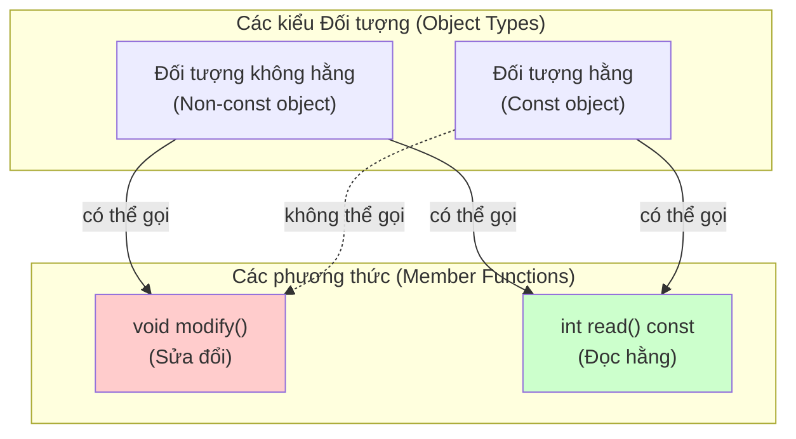
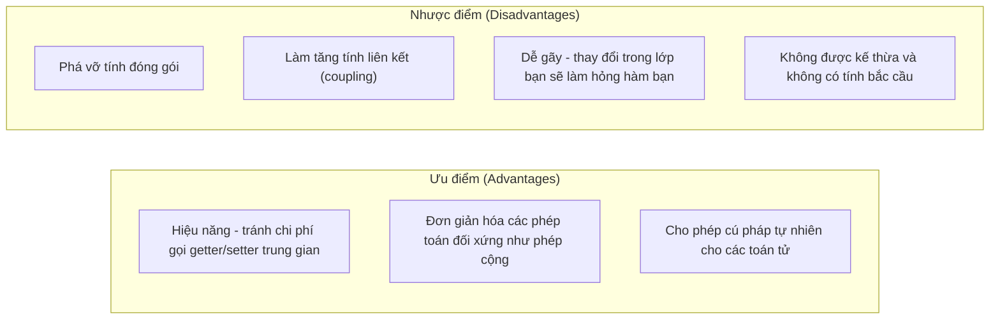

# Chương 3: Tính đóng gói và Ẩn giấu dữ liệu (Encapsulation and Data Hiding)

Tính đóng gói (Encapsulation) là một nguyên lý nền tảng của lập trình hướng đối tượng giúp gộp chung dữ liệu (thuộc tính) và các phương thức xử lý dữ liệu đó vào trong một đơn vị duy nhất (lớp), đồng thời giới hạn quyền truy cập trực tiếp từ bên ngoài vào trạng thái nội bộ của đối tượng. Ẩn giấu dữ liệu (Data hiding) đề cập cụ thể đến việc đặt các thuộc tính dữ liệu là `private` hoặc `protected` để ngăn chặn các can thiệp vô tình hoặc ác ý từ bên ngoài.

## 1. Tại sao Tính đóng gói lại Quan trọng

Tính đóng gói mang lại một số lợi ích cực kỳ quan trọng sau:

- **Bảo vệ các đặc tính bất biến (Protection of invariants)** – Lớp học có thể kiểm soát và bắt buộc các chuyển đổi trạng thái luôn hợp lệ.
- **Giảm thiểu tính liên kết (Reduced coupling)** – Mã nguồn bên ngoài chỉ cần phụ thuộc vào giao diện công khai (public interface), hoàn toàn độc lập với chi tiết cài đặt bên trong.
- **Linh hoạt khi thay đổi (Flexibility to change)** – Cấu trúc lưu trữ dữ liệu bên trong lớp có thể thay đổi tùy ý mà không làm hỏng hay phải viết lại mã nguồn của phía client sử dụng lớp đó.
- **Kiểm soát quyền truy cập (Controlled access)** – Các tác vụ kiểm tra tính hợp lệ (validation), ghi nhật ký (logging), hoặc tải chậm dữ liệu (lazy loading) có thể dễ dàng tích hợp vào bên trong các phương thức Getter/Setter.

```cpp
class BankAccount {
private:
    double balance;  // Ẩn giấu trạng thái nội bộ
    
public:
    void deposit(double amount) {
        if (amount > 0) {        // Đặc tính bất biến: lượng tiền gửi bắt buộc phải lớn hơn 0
            balance += amount;
        }
    }
    
    double getBalance() const {  // Quyền truy cập chỉ đọc (Read-only)
        return balance;
    }
};
```

Nếu không có tính đóng gói, mã nguồn client có thể trực tiếp gán số dư tài khoản là một số âm, phá vỡ hoàn toàn các quy tắc hoạt động của hệ thống.

## 2. Phương thức Getter và Setter (Hàm truy cập và Hàm thay đổi)

Phương thức Getter và Setter cung cấp cơ chế kiểm soát chặt chẽ quyền truy cập và thay đổi thuộc tính private của lớp.

```cpp
class Temperature {
private:
    double celsius;
    
public:
    // Getter - cung cấp quyền đọc dữ liệu
    double getCelsius() const {
        return celsius;
    }
    
    double getFahrenheit() const {
        return celsius * 9.0 / 5.0 + 32;
    }
    
    // Setter - cung cấp quyền ghi dữ liệu kèm kiểm tra tính hợp lệ
    void setCelsius(double value) {
        if (value >= -273.15) {  // Kiểm tra nhiệt độ không độ tuyệt đối
            celsius = value;
        }
    }
    
    void setFahrenheit(double value) {
        setCelsius((value - 32) * 5.0 / 9.0);
    }
};
```

**Khi nào nên dùng Getter/Setter:**
- Khi dữ liệu đầu vào cần được kiểm tra tính hợp lệ hoặc chuyển đổi định dạng trước khi lưu trữ.
- Duy trì tính đóng gói chặt chẽ ngay cả đối với các thuộc tính đơn giản (đề phòng các thay đổi nghiệp vụ trong tương lai).
- Phục vụ việc thiết kế các thuộc tính chỉ cho phép đọc (read-only) hoặc chỉ cho phép ghi (write-only).

**Khi nào nên tránh:**
- Việc viết các cặp Getter/Setter thông thường cho mọi thuộc tính private một cách máy móc sẽ làm mất đi ý nghĩa của tính đóng gói; trong trường hợp đó, hãy xem xét liệu thuộc tính đó có nên để public trực tiếp hay không.

## 3. Tính đúng đắn của hằng số (Const Correctness)

Tính đúng đắn của hằng số (Const correctness) bảo đảm rằng các đối tượng và phương thức không có nhiệm vụ sửa đổi trạng thái của lớp phải được khai báo một cách tường minh với từ khóa `const`, giúp trình biên dịch có thể phát hiện và ngăn chặn các hành vi sửa đổi ngoài ý muốn từ sớm.

### Đối tượng hằng và Phương thức hằng

Một đối tượng được khai báo là hằng (`const` object) chỉ có thể gọi được các phương thức thành viên cũng được khai báo là hằng (`const` member functions - những phương thức cam kết không làm thay đổi trạng thái đối tượng).

```cpp
class Rectangle {
private:
    double width, height;
    
public:
    Rectangle(double w, double h) : width(w), height(h) {}
    
    // Phương thức hằng const - cam kết không sửa đổi thuộc tính dữ liệu
    double area() const {
        return width * height;
    }
    
    // Phương thức không hằng - có thể sửa đổi thuộc tính
    void scale(double factor) {
        width *= factor;
        height *= factor;
    }
    
    // Từ khóa mutable cho phép sửa đổi hằng (xem chi tiết tại phần 5)
    mutable int accessCount = 0;
    void logAccess() const {
        accessCount++;  // Hợp lệ: nhờ thuộc tính được khai báo là mutable
    }
};

void process(const Rectangle& rect) {
    double a = rect.area();     // Hợp lệ: phương thức area() là const
    // rect.scale(2.0);        // Lỗi biên dịch! Phương thức scale() không phải là phương thức const
}
```

### Thuộc tính thành viên hằng (Const Member Variables)

Các thuộc tính hằng bắt buộc phải được khởi tạo giá trị thông qua danh sách khởi tạo thành viên (member initializer list) và tuyệt đối không thể bị thay đổi giá trị sau khi đối tượng đã được khởi tạo xong.

```cpp
class Point {
private:
    const int id;        // Thuộc tính hằng
    double x, y;
    
public:
    Point(int idVal, double xVal, double yVal) : id(idVal), x(xVal), y(yVal) {}
    // id không thể bị thay đổi giá trị sau khi hàm khởi tạo thực thi xong
};
```

### Sơ đồ trực quan hóa tính đúng đắn của hằng số



## 4. Hàm bạn và Lớp bạn (Friend Functions and Friend Classes)

Từ khóa `friend` cho phép một hàm tự do bên ngoài hoặc một lớp học khác có quyền truy cập trực tiếp vào các thành viên `private` và `protected` của lớp hiện tại. Mặc dù điều này làm phá vỡ tính đóng gói của đối tượng, tuy nhiên nó là cực kỳ cần thiết trong một số thiết kế đặc biệt (như quá tải toán tử nhập xuất, hoặc kết nối chặt chẽ giữa lớp tiện ích trợ giúp).

### Hàm bạn (Friend Functions)

Một hàm tự do bên ngoài lớp được khai báo là bạn sẽ có quyền đọc ghi các thuộc tính private của lớp đó.

```cpp
class Vector2D {
private:
    double x, y;
    
public:
    Vector2D(double xVal, double yVal) : x(xVal), y(yVal) {}
    
    // Khai báo hàm bạn
    friend Vector2D operator+(const Vector2D& lhs, const Vector2D& rhs);
};

// Định nghĩa hàm bạn bên ngoài lớp - có quyền truy cập trực tiếp thuộc tính private x, y
Vector2D operator+(const Vector2D& lhs, const Vector2D& rhs) {
    return Vector2D(lhs.x + rhs.x, lhs.y + rhs.y);
}
```

### Lớp bạn (Friend Classes)

Tất cả các phương thức thành viên của một lớp được khai báo là bạn đều có quyền truy cập trực tiếp vào các thành viên private của lớp trao quyền.

```cpp
class Engine {
private:
    int horsepower;
    
public:
    Engine(int hp) : horsepower(hp) {}
    
    // Trao toàn quyền truy cập các thành viên private của Engine cho lớp Car
    friend class Car;
};

class Car {
public:
    void diagnose(const Engine& e) {
        // Truy cập trực tiếp thuộc tính private horsepower của Engine
        std::cout << "Cong suat dong co: " << e.horsepower << " HP" << std::endl;
    }
    
    void tune(Engine& e, int newHp) {
        e.horsepower = newHp;  // Sửa đổi trực tiếp thuộc tính private của Engine
    }
};
```

### Các trường hợp nên sử dụng từ khóa Friend

| Trường hợp áp dụng | Ví dụ thực tế |
|----------|---------|
| Quá tải toán tử nhị phân (đặc biệt là toán tử `<<` và `>>` trên luồng) | `friend std::ostream& operator<<(...)` |
| Hỗ trợ Kiểm thử đơn vị (Unit testing - bộ kiểm thử cần truy cập nội bộ để xác thực trạng thái) | `friend class Test_ClassName;` |
| Các lớp liên kết cực kỳ mật thiết (như lớp Builder hỗ trợ khởi tạo đối tượng) | `friend class ProductBuilder;` |
| Cặp cấu trúc bộ lưu trữ và bộ duyệt | `friend class iterator;` |

### Sự đánh đổi của từ khóa Friend



**Quy chuẩn lập trình tốt nhất:** Hãy sử dụng từ khóa `friend` một cách cực kỳ hạn chế. Luôn ưu tiên sử dụng giao diện công khai (public interfaces) trừ các trường hợp yêu cầu hiệu năng cực hạn hoặc cú pháp tự nhiên của quá tải toán tử bắt buộc phải phá vỡ tính đóng gói. Hãy ghi chú rõ lý do tại sao cần dùng friend trong mã nguồn.

## 5. Từ khóa `mutable` (The `mutable` Keyword)

Từ khóa `mutable` cho phép một thuộc tính dữ liệu của lớp có thể bị sửa đổi ngay cả bên trong các phương thức thành viên hằng (`const` member functions). Từ khóa này thường được sử dụng cho các trường hợp:

- Lưu trữ đệm (caching) các kết quả tính toán phức tạp.
- Thực hiện cơ chế đếm tham chiếu (reference counting) / con trỏ yếu (weak pointers).
- Đếm số lượt truy cập phục vụ ghi nhật ký (logging) và gỡ lỗi (debugging).
- Sử dụng các khóa tương hỗ Mutex để bảo đảm an toàn đa luồng cho các phương thức const đọc dữ liệu.

```cpp
class StringCache {
private:
    std::string data;
    mutable size_t hashCache = 0;
    mutable bool cacheValid = false;
    
public:
    StringCache(const std::string& str) : data(str) {}
    
    // Phương thức hằng const - nhưng có thể sửa đổi thuộc tính được đánh dấu là mutable
    size_t getHash() const {
        if (!cacheValid) {
            hashCache = std::hash<std::string>{}(data);
            cacheValid = true;   // Hợp lệ: nhờ thuộc tính được khai báo là mutable
        }
        return hashCache;
    }
    
    void setData(const std::string& newData) {
        data = newData;
        cacheValid = false;      // Phương thức không hằng, chỉnh sửa bình thường
    }
};
```

**Lưu ý cực kỳ quan trọng:** Tuyệt đối không được sử dụng từ khóa `mutable` như một công cụ lách luật để phá vỡ tính đúng đắn của hằng số đối với các trạng thái logic thực tế của đối tượng. Hãy chỉ giới hạn sử dụng nó cho các chi tiết cài đặt phụ trợ, không làm ảnh hưởng đến hành vi có thể quan sát được bên ngoài của đối tượng.

## Bảng tổng hợp kiến thức

| Khái niệm cốt lõi | Mục đích thiết kế | Quy chuẩn lập trình tốt nhất |
|---------|---------|----------------|
| **Tính đóng gói** | Ẩn giấu trạng thái nội bộ, công bố giao diện an toàn | Hãy để thuộc tính là private, cung cấp giao diện public tối giản nhất |
| **Getters/Setters** | Kiểm soát quyền truy cập | Chỉ sử dụng khi cần các thao tác kiểm tra tính hợp lệ hoặc chuyển đổi dữ liệu |
| **Phương thức const** | Cam kết tuyệt đối không sửa đổi đối tượng | Bắt buộc phải đánh dấu `const` cho mọi phương thức thành viên không làm thay đổi trạng thái đối tượng |
| **Đối tượng const** | Các góc nhìn bất biến (Immutable views) | Nên truyền tham số dưới dạng tham chiếu hằng (`const&`) để tối ưu hiệu năng và tránh sửa đổi ngoài ý muốn |
| **Từ khóa Friend** | Cho phép truy cập private cho các trường hợp đặc biệt | Hạn chế tối đa; chỉ dùng cho quá tải toán tử hoặc các lớp liên kết cực kỳ chặt chẽ |
| **Từ khóa Mutable** | Cho phép sửa đổi thuộc tính trong phương thức const | Chỉ áp dụng cho các dữ liệu đệm cache, log, khóa mutex; tuyệt đối không dùng cho trạng thái logic đối tượng |

Sự kết hợp hoàn hảo giữa tính đóng gói và tính đúng đắn của hằng số tạo nên một mã nguồn bền vững, dễ bảo trì, ngăn ngừa hiệu quả các lỗi vô tình sử dụng sai và thể hiện rõ nét ý đồ thiết kế của lập trình viên thông qua hệ thống kiểu dữ liệu.
