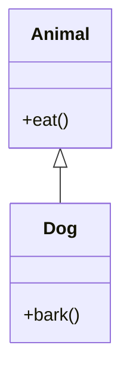
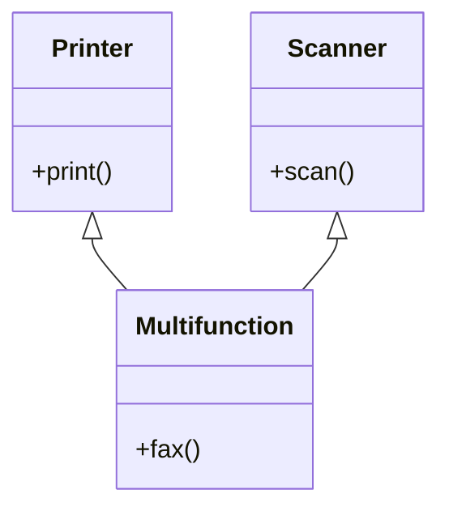
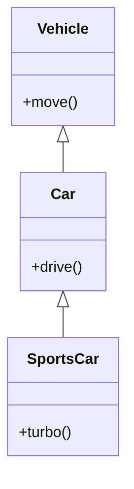
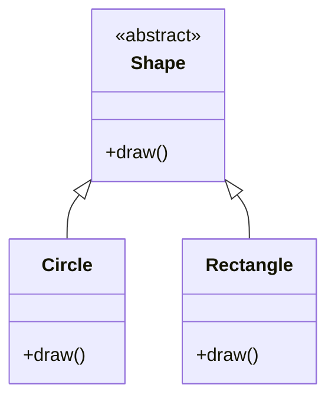
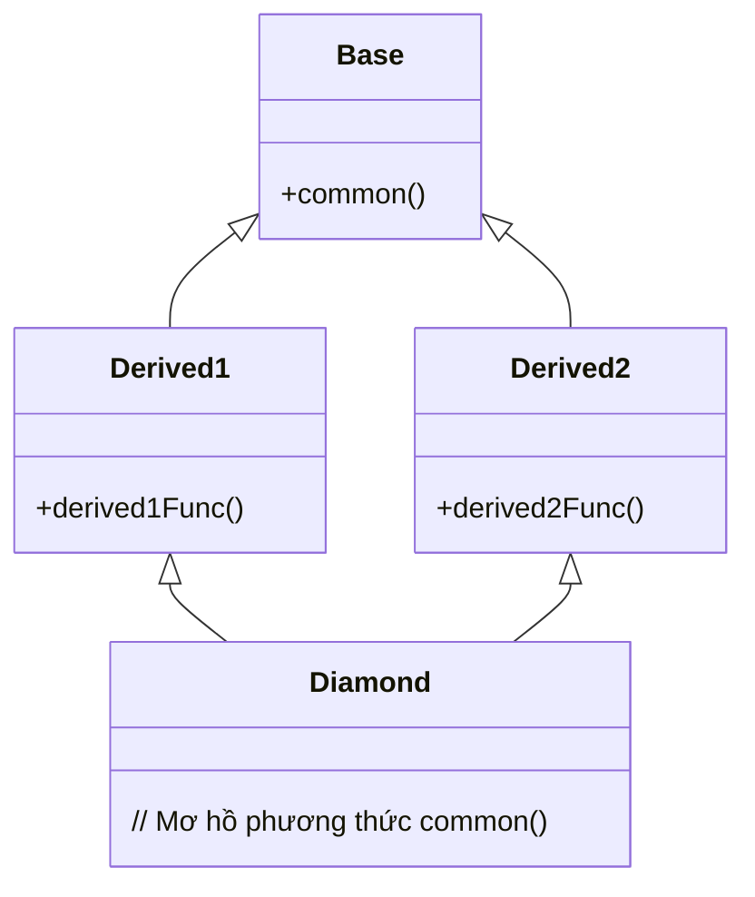
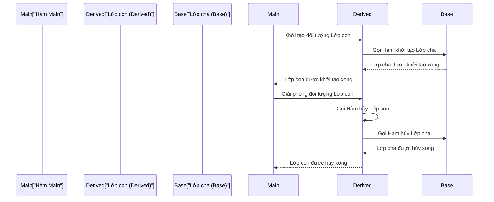
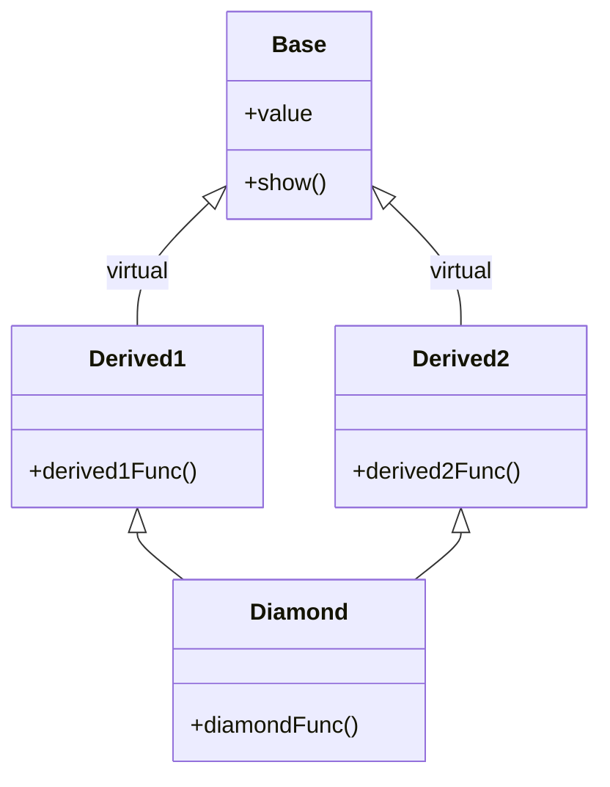

# Chương 4: Tính kế thừa trong C++ (Inheritance in C++)

Kế thừa (Inheritance) là một khái niệm nền tảng của lập trình hướng đối tượng (OOP) cho phép một lớp mới có thể dẫn xuất và sở hữu các thuộc tính cũng như hành vi từ một lớp đã có sẵn. Tính kế thừa giúp tăng cường khả năng tái sử dụng mã nguồn, thiết lập mối quan hệ phân cấp rõ ràng giữa các thực thể, và là điều kiện tiên quyết để triển khai tính đa hình động.

## 1. Cú pháp Lớp cơ sở và Lớp dẫn xuất (Base Class and Derived Class Syntax)

Trong C++, một lớp con (lớp dẫn xuất - derived class) được khai báo bằng cách chỉ định tên của lớp cha (lớp cơ sở - base class) sau dấu hai chấm (`:`) kèm theo một phạm vi truy cập kế thừa thích hợp.

```cpp
// Lớp cha (Base class - còn được gọi là lớp cơ sở hoặc lớp siêu superclass)
class Base {
public:
    void baseMethod() {
        // ...
    }
};

// Lớp con (Derived class - còn được gọi là lớp dẫn xuất hoặc lớp phân lớp subclass)
class Derived : public Base {
public:
    void derivedMethod() {
        // ...
    }
};
```

Cú pháp tổng quát là:

```cpp
class LớpDẫnXuất : phạm-vi-truy-cập LớpCơSở {
    // Các thành viên của lớp con
};
```

## 2. Phạm vi truy cập trong kế thừa (Access Specifiers in Inheritance)

Phạm vi truy cập trong kế thừa kiểm soát mức độ khả dụng của các thành viên kế thừa từ lớp cha khi chúng nằm bên trong lớp con. Ba phạm vi truy cập tương ứng là `public`, `protected`, và `private`.

### 2.1 Ảnh hưởng của các kiểu kế thừa đối với khả năng truy cập

Bảng dưới đây tổng hợp chi tiết mức độ khả dụng của các thành viên lớp cha khi được kế thừa vào lớp con theo các kiểu kế thừa khác nhau:

| Phạm vi gốc ở Lớp cha | Kiểu kế thừa | Quyền truy cập bên trong Lớp con | Truy cập qua đối tượng Lớp con (bên ngoài) |
|--------------------|------------------|-----------------------------------|--------------------------------------|
| `public`           | `public`         | `public`                          | Có thể truy cập trực tiếp |
| `public`           | `protected`      | `protected`                       | Không thể truy cập trực tiếp |
| `public`           | `private`        | `private`                         | Không thể truy cập trực tiếp |
| `protected`        | `public`         | `protected`                       | Không thể truy cập trực tiếp |
| `protected`        | `protected`      | `protected`                       | Không thể truy cập trực tiếp |
| `protected`        | `private`        | `private`                         | Không thể truy cập trực tiếp |
| `private`          | Bất kỳ           | Không thể truy cập trực tiếp | Không thể truy cập trực tiếp |

- **Kế thừa `public`**: Giữ nguyên vẹn các mức độ truy cập ban đầu của lớp cha. Đây là kiểu kế thừa được sử dụng phổ biến nhất.
- **Kế thừa `protected`**: Các thành viên `public` và `protected` của lớp cha sẽ trở thành `protected` bên trong lớp con.
- **Kế thừa `private`**: Các thành viên `public` và `protected` của lớp cha sẽ trở thành `private` bên trong lớp con.

```cpp
class Base {
public:
    int pub;
protected:
    int prot;
private:
    int priv;
};

// Kế thừa public
class PubDerived : public Base {
    void func() {
        pub = 1;   // Hợp lệ: thành viên public vẫn giữ là public
        prot = 2;  // Hợp lệ: thành viên protected vẫn giữ là protected
        // priv = 3; // Lỗi biên dịch! Thành viên private của lớp cha không thể truy cập trực tiếp
    }
};

// Kế thừa protected
class ProtDerived : protected Base {
    void func() {
        pub = 1;   // Hợp lệ: trở thành protected bên trong lớp con
        prot = 2;  // Hợp lệ: vẫn giữ là protected
        // priv không thể truy cập
    }
};
```

## 3. Các loại kế thừa (Types of Inheritance)

### 3.1 Đơn kế thừa (Single Inheritance)

Một lớp con chỉ dẫn xuất và kế thừa từ duy nhất một lớp cha duy nhất.

```cpp
class Animal {
public:
    void eat() { /* ... */ }
};

class Dog : public Animal {
public:
    void bark() { /* ... */ }
};
```



### 3.2 Đa kế thừa (Multiple Inheritance)

Một lớp con dẫn xuất và kế thừa trực tiếp từ hai hoặc nhiều lớp cha khác nhau.

```cpp
class Printer {
public:
    void print() { /* ... */ }
};

class Scanner {
public:
    void scan() { /* ... */ }
};

class Multifunction : public Printer, public Scanner {
public:
    void fax() { /* ... */ }
};
```



### 3.3 Kế thừa nhiều cấp (Multilevel Inheritance)

Một lớp con được dẫn xuất từ một lớp con khác, tạo nên một chuỗi kế thừa hình cây nhiều cấp.

```cpp
class Vehicle {
public:
    void move() { /* ... */ }
};

class Car : public Vehicle {
public:
    void drive() { /* ... */ }
};

class SportsCar : public Car {
public:
    void turbo() { /* ... */ }
};
```



### 3.4 Kế thừa phân cấp (Hierarchical Inheritance)

Nhiều lớp con khác nhau cùng dẫn xuất và kế thừa từ một lớp cha duy nhất.

```cpp
class Shape {
public:
    virtual void draw() = 0;
};

class Circle : public Shape {
public:
    void draw() override { /* ... */ }
};

class Rectangle : public Shape {
public:
    void draw() override { /* ... */ }
};
```



### 3.5 Kế thừa lai (Hybrid Inheritance - Bài toán Kim cương)

Kế thừa lai là sự kết hợp đồng thời giữa đa kế thừa và kế thừa nhiều cấp. **"Bài toán kim cương" (diamond problem)** xảy ra khi một lớp con kế thừa từ hai lớp con khác, mà hai lớp con này lại có chung một lớp cha gốc ban đầu.

```cpp
class Base {
public:
    void common() { /* ... */ }
};

class Derived1 : public Base {
public:
    void derived1Func() { /* ... */ }
};

class Derived2 : public Base {
public:
    void derived2Func() { /* ... */ }
};

// Cấu trúc kim cương: Cả hai nhánh Derived1 và Derived2 đều dẫn về Base
class Diamond : public Derived1, public Derived2 {
    // Sự mơ hồ (Ambiguity): Diamond kế thừa phương thức common() nào từ Base?
};
```



Nếu không sử dụng kỹ thuật kế thừa ảo (virtual inheritance), lớp `Diamond` sẽ sở hữu hai bản sao hoàn toàn độc lập của các thành viên thuộc lớp `Base`, dẫn đến hiện tượng xung đột nhập nhằng mơ hồ khi gọi hàm `Base::common()`.

## 4. Thứ tự gọi Hàm khởi tạo và Hàm hủy (Order of Constructor and Destructor Calls)

Khi một đối tượng của lớp con được khởi tạo, thứ tự thực thi của các hàm khởi tạo diễn ra như sau:

1. Gọi các hàm khởi tạo của Lớp cha (Base class constructors) trước (theo đúng thứ tự khai báo kế thừa).
2. Gọi hàm khởi tạo của Lớp con (Derived class constructor) sau.

Khi đối tượng bị giải phóng tiêu hủy, thứ tự thực thi các hàm hủy diễn ra theo chiều ngược lại hoàn toàn:

1. Gọi hàm hủy của Lớp con (Derived class destructor) trước.
2. Gọi các hàm hủy của Lớp cha (Base class destructors) sau.

### 4.1 Ví dụ minh họa

```cpp
#include <iostream>

class Base {
public:
    Base() { std::cout << "Goi Ham khoi tao Base\n"; }
    ~Base() { std::cout << "Goi Ham huy Base\n"; }
};

class Derived : public Base {
public:
    Derived() { std::cout << "Goi Ham khoi tao Derived\n"; }
    ~Derived() { std::cout << "Goi Ham huy Derived\n"; }
};

int main() {
    Derived d;
    return 0;
}
```

Kết quả in ra màn hình:

```
Goi Ham khoi tao Base
Goi Ham khoi tao Derived
Goi Ham huy Derived
Goi Ham huy Base
```

### 4.2 Cách truyền tham số lên Hàm khởi tạo của Lớp cha

Lớp con có thể chỉ định gọi một hàm khởi tạo có tham số cụ thể của lớp cha bằng cách sử dụng danh sách khởi tạo thành viên (member initializer list).

```cpp
#include <iostream>
#include <string>

class Person {
private:
    std::string name;
public:
    Person(const std::string& n) : name(n) {
        std::cout << "Khoi tao Person: " << name << "\n";
    }
    ~Person() { std::cout << "Huy Person: " << name << "\n"; }
};

class Employee : public Person {
private:
    int id;
public:
    // Gọi tường minh hàm khởi tạo Person(n) qua danh sách khởi tạo
    Employee(const std::string& n, int i) : Person(n), id(i) {
        std::cout << "Khoi tao Employee: " << id << "\n";
    }
    ~Employee() { std::cout << "Huy Employee: " << id << "\n"; }
};

int main() {
    Employee e("Alice", 1001);
    return 0;
}
```

Kết quả in ra màn hình:

```
Khoi tao Person: Alice
Khoi tao Employee: 1001
Huy Employee: 1001
Huy Person: Alice
```

### 4.3 Sơ đồ quy trình hoạt động của lời gọi Hàm khởi tạo/Hủy



## 5. Bài toán Kim cương và Kế thừa ảo (Diamond Problem and Virtual Inheritance)

Kế thừa ảo (Virtual inheritance) giải quyết triệt để bài toán kim cương bằng cách bảo đảm rằng chỉ có duy nhất một bản sao chung của lớp cha gốc được chia sẻ đồng thời giữa tất cả các nhánh kế thừa trong hệ thống phân cấp.

### 5.1 Sử dụng Lớp cơ sở ảo (Virtual Base Classes)

Ta viết thêm từ khóa `virtual` trước phạm vi truy cập khi khai báo kế thừa từ lớp cha gốc chung.

```cpp
#include <iostream>

class Base {
public:
    int value;
    Base() : value(0) {}
    void show() { std::cout << "Base::show() value = " << value << std::endl; }
};

// Kế thừa ảo
class Derived1 : virtual public Base {
public:
    Derived1() { value = 10; }
};

// Kế thừa ảo
class Derived2 : virtual public Base {
public:
    Derived2() { value = 20; }
};

// Cấu trúc Diamond kế thừa ảo
class Diamond : public Derived1, public Derived2 {
public:
    Diamond() : Base(), Derived1(), Derived2() {
        // Chỉ tồn tại duy nhất một bản sao Base chung
        value = 30; // Hoàn toàn tường minh, không bị xung đột
    }
};

int main() {
    Diamond d;
    d.show();  // Kết quả in ra: Base::show() value = 30
    return 0;
}
```

Nếu không sử dụng kế thừa ảo, lời gọi hàm `d.show()` sẽ lập tức bị báo lỗi biên dịch do sự mơ hồ nhập nhằng vì tồn tại hai bản sao của `Base::show()`. Có kế thừa ảo, hai lớp con trung gian chỉ chia sẻ một thực thể `Base` duy nhất.

### 5.2 Cơ chế phân giải sự mơ hồ của Kế thừa ảo

- Trình biên dịch bảo đảm lớp cơ sở ảo chỉ được gọi hàm khởi tạo duy nhất một lần, ngay cả khi nó xuất hiện nhiều lần trong sơ đồ hình cây kế thừa.
- Lớp con dẫn xuất sâu nhất cuối cùng (lớp `Diamond` trong ví dụ) sẽ chịu trách nhiệm trực tiếp gọi hàm khởi tạo cho lớp cơ sở ảo gốc `Base`.
- Các lớp con trung gian (như `Derived1` và `Derived2`) khai báo kế thừa ảo sẽ được trình biên dịch bỏ qua thao tác tự động khởi tạo lớp cơ sở này độc lập.

### 5.3 Đánh đổi cấu trúc tổ chức bộ nhớ (Memory Layout)

Kế thừa ảo mang lại giải pháp hoàn hảo cho thiết kế nhưng đi kèm với một số chi phí phụ trội hệ thống:

- Chương trình phải lưu trữ thêm một con trỏ (hoặc giá trị dịch chuyển offset) bên trong mỗi đối tượng con để định vị chính xác vị trí của tiểu đối tượng lớp cha cơ sở ảo được chia sẻ.
- Cơ chế truy cập gián tiếp này làm giảm nhẹ hiệu năng thực thi của bộ vi xử lý và làm tăng nhẹ dung lượng bộ nhớ của đối tượng.
- Chi tiết tổ chức bộ nhớ phụ thuộc vào trình biên dịch cụ thể, thông qua việc duy trì một bảng con trỏ cơ sở ảo (vbtable) hoặc các cơ chế tương đương.



Trong kế thừa ảo, tiểu đối tượng `Base` được định vị tại một vị trí bộ nhớ cố định tính toán động lúc chạy chương trình, nhờ đó cho phép nhiều lớp con trung gian khác nhau có thể chia sẻ chung.

## 6. Khai báo `using` trong lớp con (using Declaration in Derived Classes)

Khai báo `using` bên trong lớp con giúp khôi phục quyền truy cập đến các phương thức thừa kế từ lớp cha mà trước đó bị che giấu hoặc bị hạn chế do sử dụng phạm vi kế thừa không phải `public`.

### 6.1 Khôi phục quyền truy cập thành viên lớp cha

Khi lớp con kế thừa theo kiểu `private` hoặc `protected`, toàn bộ các thành viên công khai của lớp cha sẽ trở nên vô hình đối với bên ngoài lớp con. Chúng ta có thể viết từ khóa `using` bên trong phạm vi mong muốn để khôi phục lại quyền truy cập cho một số phương thức cụ thể.

```cpp
#include <iostream>

class Base {
public:
    void publicFunc() { std::cout << "Base::publicFunc\n"; }
    void commonFunc() { std::cout << "Base::commonFunc\n"; }
};

class Derived : private Base { // Kế thừa private
public:
    // Khôi phục publicFunc trở lại phạm vi public để bên ngoài gọi được
    using Base::publicFunc;
    
    // Quá tải phương thức trùng tên - sử dụng khai báo using giúp tránh bị che giấu
    void commonFunc(int x) { 
        std::cout << "Derived::commonFunc(int): " << x << "\n";
    }
    // Mang phương thức không tham số của lớp cha trở lại để hỗ trợ quá tải song song
    using Base::commonFunc;
};

int main() {
    Derived d;
    d.publicFunc();      // Hợp lệ: đã được khôi phục trở lại public
    d.commonFunc();      // Hợp lệ: gọi phương thức không tham số Base::commonFunc
    d.commonFunc(42);    // Hợp lệ: gọi phương thức quá tải Derived::commonFunc(int)
    return 0;
}
```

### 6.2 Giải quyết hiện tượng che giấu tên phương thức (Name Hiding)

Nếu lớp con định nghĩa một phương thức trùng tên hoàn toàn với phương thức ở lớp cha, phương thức ở lớp con sẽ che giấu (hides) toàn bộ các phiên bản quá tải của phương thức đó ở lớp cha. Việc sử dụng khai báo `using` giúp đem các phiên bản quá tải ở lớp cha vào phạm vi lớp con, cho phép quá tải hoạt động song song bình thường.

```cpp
class A {
public:
    void f(int) {}
};

class B : public A {
public:
    void f(double) {}  // Phương thức này che giấu hoàn toàn phương thức A::f(int)
};

class C : public A {
public:
    using A::f;        // Đem phương thức A::f(int) vào phạm vi của C
    void f(double) {}  // Bây giờ f(int) và f(double) cùng tồn tại dạng quá tải song song
};

int main() {
    B b;
    // b.f(10);   // Lỗi biên dịch hoặc cảnh báo: phương thức A::f(int) đã bị che giấu, tự động ép kiểu thành double
    b.f(10.0);   // Hợp lệ: gọi B::f(double)
    
    C c;
    c.f(10);     // Hợp lệ: gọi A::f(int) nhờ có khai báo using
    c.f(10.0);   // Hợp lệ: gọi C::f(double)
}
```

### 6.3 Một số lưu ý quan trọng

- Khai báo `using` tuyệt đối không thể thay đổi phạm vi truy cập gốc của các thành viên `private` ở lớp cha (private của lớp cha vẫn luôn là private bất khả xâm phạm).
- Khai báo `using` không áp dụng trực tiếp cho việc mang hàm hủy của lớp cha vào lớp con (tuy nhiên từ C++11 trở đi, cú pháp `using Base::Base` cho phép kế thừa toàn bộ các hàm khởi tạo từ lớp cha).
- Bạn có thể viết nhiều khai báo `using` để mang nhiều thành viên của lớp cha vào lớp con cùng lúc.

## Bảng tổng hợp kiến thức

| Khái niệm cốt lõi | Chi tiết kỹ thuật |
|-----------------------------|----------------------------------------------------------------------------|
| **Các kiểu kế thừa** | Đơn kế thừa, đa kế thừa, kế thừa nhiều cấp, kế thừa phân cấp, kế thừa lai |
| **Phạm vi kế thừa** | `public`, `protected`, `private` kiểm soát quyền hạn của thành viên khi kế thừa vào lớp con |
| **Thứ tự Khởi tạo / Hủy** | Khởi tạo: Base $\to$ Derived; Tiêu hủy ngược lại: Derived $\to$ Base |
| **Kế thừa ảo** | Cơ chế tối ưu giải quyết bài toán kim cương bằng cách chia sẻ một bản sao Base duy nhất |
| **Khai báo `using`** | Phục hồi quyền truy cập phương thức và giải quyết lỗi che giấu tên phương thức |

Kế thừa là một công cụ cực kỳ sắc bén giúp tối ưu hóa cấu trúc mã nguồn và nâng cao tính tái sử dụng. Hãy cân nhắc áp dụng kế thừa ảo một cách cẩn trọng do chi phí tính toán động lúc chạy chương trình. Khai báo `using` mang lại sự kiểm soát tinh tế và mềm dẻo đối với phạm vi hiển thị của các thành viên kế thừa bên trong các lớp dẫn xuất.
