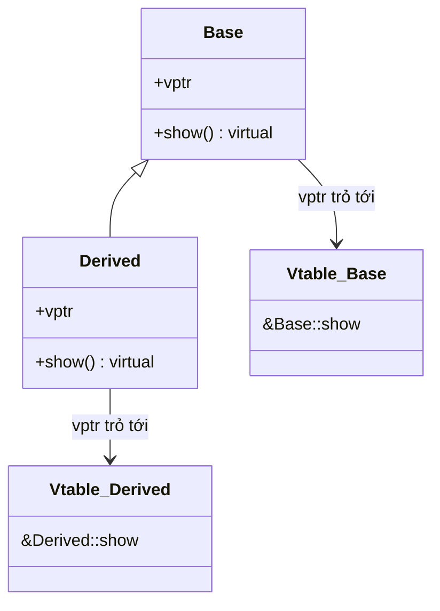

# Chương 5: Tính đa hình trong C++ (Polymorphism in C++)

Đa hình (Polymorphism) cho phép xử lý thống nhất các đối tượng thuộc các kiểu dữ liệu khác nhau thông qua một giao diện chung duy nhất. C++ hỗ trợ cả hai cơ chế: đa hình lúc biên dịch (đa hình tĩnh - compile-time / static polymorphism) và đa hình lúc thực thi (đa hình động - run-time / dynamic polymorphism), mỗi loại phục vụ một mục đích thiết kế riêng biệt.

## Đa hình lúc biên dịch (Compile‑Time / Static Polymorphism)

Phương thức thực sự được gọi sẽ được trình biên dịch xác định và phân giải ngay trong quá trình biên dịch chương trình. Điều này giúp mã nguồn thực thi cực kỳ hiệu quả mà hoàn toàn không tốn thêm bất kỳ chi phí hệ thống nào lúc chạy (zero runtime overhead).

### Quá tải hàm (Function Overloading)

Cho phép định nghĩa nhiều hàm có cùng tên gọi duy nhất, miễn là danh sách các tham số đầu vào của chúng khác biệt nhau (về số lượng, kiểu dữ liệu, hoặc thứ tự tham số). Lưu ý rằng chỉ riêng kiểu dữ liệu trả về của hàm không thể dùng làm tiêu chí để phân biệt các hàm quá tải.

```cpp
#include <iostream>

class Printer {
public:
    void print(int i) {
        std::cout << "Kieu so nguyen: " << i << std::endl;
    }
    
    void print(double d) {
        std::cout << "Kieu so thuc: " << d << std::endl;
    }
    
    void print(const std::string& s) {
        std::cout << "Kieu chuoi: " << s << std::endl;
    }
};

int main() {
    Printer p;
    p.print(42);        // Trình biên dịch gọi print(int)
    p.print(3.14);      // Trình biên dịch gọi print(double)
    p.print("Hello");   // Trình biên dịch gọi print(const std::string&)
}
```

### Quá tải toán tử (Operator Overloading)

Định nghĩa lại cách thức hoạt động của các toán tử chuẩn đối với các kiểu dữ liệu do người dùng tự định nghĩa. Chủ đề cực kỳ quan trọng này sẽ được trình bày chi tiết tại Chương 6.

## Đa hình lúc thực thi (Run‑Time / Dynamic Polymorphism)

Phương thức thực tế được gọi sẽ được chương trình xác định và phân giải động ngay lúc thực thi (run time) dựa trên kiểu dữ liệu thực tế (dynamic type) của đối tượng tại thời điểm đó. Đa hình động đạt được thông qua sự kết hợp giữa hàm ảo (virtual functions) và tính kế thừa (inheritance).

### Hàm ảo và Bảng phương thức ảo (vtable)

Khi một lớp khai báo một hàm ảo (virtual function), trình biên dịch sẽ tự động thiết lập một bảng phương thức ảo (virtual table - vtable) dùng chung cho lớp học đó. Bảng vtable thực chất là một mảng lưu trữ các con trỏ trỏ tới địa chỉ của các hàm ảo của lớp. Mỗi đối tượng được tạo ra từ lớp đó sẽ chứa thêm một con trỏ ẩn (gọi là con trỏ bảng phương thức ảo - vptr) trỏ tới bảng vtable tương ứng của lớp.

```cpp
#include <iostream>

class Base {
public:
    virtual void show() {
        std::cout << "Base::show()" << std::endl;
    }
};

class Derived : public Base {
public:
    void show() override {
        std::cout << "Derived::show()" << std::endl;
    }
};

int main() {
    Base* ptr = new Derived();
    ptr->show();   // Kết quả in ra: Derived::show() – được phân giải động lúc thực thi
    delete ptr;
}
```

Sơ đồ dưới đây minh họa cơ chế hoạt động của con trỏ `vptr` và bảng `vtable` đối với hai lớp `Base` và `Derived`:



### Định nghĩa đè (Overriding) so với Ẩn giấu phương thức (Hiding)

- **Định nghĩa đè (Overriding)**: Lớp con cung cấp một cài đặt thực thi hoàn toàn mới cho một hàm ảo đã được khai báo ở lớp cha. Chữ ký (signature) của phương thức ở lớp con phải khớp hoàn toàn 100% với phương thức ở lớp cha.
- **Ẩn giấu phương thức (Hiding)**: Nếu lớp con định nghĩa một phương thức phi ảo (non-virtual function) trùng tên với phương thức ở lớp cha (ngay cả khi danh sách tham số khác nhau), nó sẽ che giấu hoàn toàn sự hiển thị của phương thức lớp cha đối với các đối tượng thuộc kiểu lớp con đó.

```cpp
class Base {
public:
    virtual void f() { std::cout << "Base::f()\n"; }
    void g(int) { std::cout << "Base::g(int)\n"; }
};

class Derived : public Base {
public:
    void f() override { std::cout << "Derived::f()\n"; }   // Định nghĩa đè (Overriding)
    void g() { std::cout << "Derived::g()\n"; }            // Che giấu (Hiding) phương thức Base::g(int)
};

int main() {
    Derived d;
    d.g();      // Hợp lệ: gọi Derived::g()
    // d.g(42); // Lỗi biên dịch! Phương thức Base::g(int) đã bị che giấu
}
```

### Từ khóa đặc tả `override` (C++11)

Từ khóa `override` được viết sau khai báo phương thức ở lớp con để chỉ rõ cho trình biên dịch biết phương thức này được thiết kế để định nghĩa đè một hàm ảo của lớp cha. Điều này giúp trình biên dịch phát hiện sớm các lỗi sai sót như lệch chữ ký phương thức hoặc gõ sai tên hàm.

```cpp
class Base {
public:
    virtual void process(int) {}
};

class Derived : public Base {
public:
    void process(double) override;  // Lỗi biên dịch! Không định nghĩa đè được phương thức nào (lệch kiểu tham số)
    void process(int) override;     // Hợp lệ
};
```

### Từ khóa đặc tả `final`

Từ khóa `final` được đặt sau khai báo phương thức ảo để ngăn chặn tuyệt đối các lớp con kế thừa tiếp theo định nghĩa đè phương thức này, hoặc đặt sau tên lớp để cấm hoàn toàn việc kế thừa từ lớp học đó.

```cpp
class Base {
public:
    virtual void foo() final { }   // Cấm các lớp con định nghĩa đè phương thức này
};

class Derived : public Base {
public:
    void foo() override { }        // Lỗi biên dịch! Phương thức foo đã được đánh dấu là final
};

class FinalClass final {           // Cấm hoàn toàn việc kế thừa từ lớp học này
};

// class Bad : public FinalClass { }; // Lỗi biên dịch!
```

## Lớp trừu tượng và Giao diện (Abstract Classes and Interfaces)

Lớp trừu tượng đóng vai trò như một bản thiết kế (blueprint) định hướng cho các lớp con kế thừa và bắt buộc phải tuân thủ. Chúng ta không thể khởi tạo đối tượng trực tiếp từ các lớp trừu tượng.

### Hàm ảo thuần túy (Pure Virtual Functions) (`= 0`)

Hàm ảo thuần túy được khai báo bằng cách gán giá trị `= 0` ở cuối phần khai báo. Hàm ảo thuần túy không yêu cầu phải có định nghĩa thực thi bên trong lớp trừu tượng (mặc dù bạn vẫn có thể định nghĩa nếu muốn).

```cpp
class Shape {
public:
    virtual double area() const = 0;   // Hàm ảo thuần túy
    virtual ~Shape() = default;
};

class Circle : public Shape {
    double radius_;
public:
    Circle(double r) : radius_(r) {}
    double area() const override { return 3.14159 * radius_ * radius_; }
};

// Shape s; // Lỗi biên dịch! Không thể khởi tạo đối tượng từ lớp trừu tượng Shape
Circle c(5.0); // Hợp lệ
```

### Giả lập giao diện (Interface Emulation) trong C++

Ngôn ngữ C++ không cung cấp từ khóa `interface` riêng biệt như một số ngôn ngữ khác. Một Giao diện (Interface) thường được giả lập bằng cách định nghĩa một lớp chỉ chứa duy nhất các hàm ảo thuần túy (và bắt buộc có một hàm hủy ảo mặc định).

```cpp
class Drawable {
public:
    virtual void draw() const = 0;
    virtual ~Drawable() = default;
};

class Renderable {
public:
    virtual void render() = 0;
    virtual ~Renderable() = default;
};

// Kế thừa nhiều giao diện
class Shape : public Drawable, public Renderable {
public:
    void draw() const override { /* Thực thi vẽ hình */ }
    void render() override { /* Thực thi dựng hình */ }
};
```

## Hàm hủy ảo (Virtual Destructors)

Việc giải phóng (delete) một đối tượng của lớp con thông qua con trỏ kiểu lớp cha mà lớp cha không có hàm hủy ảo sẽ gây ra **hành vi không xác định (undefined behavior)** – khi đó, hệ thống chỉ gọi hàm hủy của lớp cha, dẫn đến hiện tượng rò rỉ tài nguyên (resource leak) nghiêm trọng của các đối tượng lớp con.

```cpp
class Base {
public:
    ~Base() { std::cout << "Huy Base\n"; }
};

class Derived : public Base {
    int* data;
public:
    Derived() : data(new int[100]) {}
    ~Derived() { delete[] data; std::cout << "Huy Derived\n"; }
};

int main() {
    Base* p = new Derived();
    delete p;   // Gây hành vi không xác định: hệ thống chỉ gọi Base::~Base(), vùng nhớ data bị rò rỉ!
}
```

**Giải pháp đúng đắn**: Khai báo hàm hủy của lớp cha là hàm hủy ảo.

```cpp
class Base {
public:
    virtual ~Base() { std::cout << "Huy Base\n"; }
};

// Bây giờ, việc giải phóng qua con trỏ lớp cha sẽ gọi đầy đủ cả hai hàm hủy theo thứ tự ngược lại một cách an toàn.
```

Quy tắc sống còn: Nếu một lớp sở hữu bất kỳ phương thức ảo nào, nó bắt buộc phải có một hàm hủy ảo. Tương tự, nếu một lớp được thiết kế để phục vụ mục đích làm lớp cha trong mô hình đa hình, hãy luôn khai báo hàm hủy của nó là hàm hủy ảo.

## Thông tin kiểu dữ liệu lúc thực thi (RTTI - Run‑Time Type Information)

Cơ chế RTTI cho phép truy vấn và xác định kiểu dữ liệu động thực sự của một đối tượng ngay khi chương trình đang chạy. Hãy sử dụng RTTI một cách cực kỳ hạn chế – việc lạm dụng RTTI thường là dấu hiệu cảnh báo của một thiết kế lỗi vốn dĩ có thể giải quyết sạch sẽ bằng tính đa hình thông qua hàm ảo.

### Toán tử `typeid` và Lớp `type_info`

Toán tử `typeid` trả về một tham chiếu trỏ tới đối tượng `std::type_info` chứa các thông tin mô tả kiểu dữ liệu động thực tế của đối tượng truyền vào.

```cpp
#include <typeinfo>
#include <iostream>

class Base { virtual void dummy() {} }; // Lớp đa hình
class Derived : public Base {};

int main() {
    Base* b = new Derived();
    std::cout << typeid(*b).name() << std::endl;   // In ra thông tin kiểu thực tế của b: "Derived"
    delete b;
}
```

### Phép ép kiểu `dynamic_cast` để Ép kiểu xuống an toàn (Safe Downcasting)

Phép ép kiểu `dynamic_cast` giúp chuyển đổi an toàn một con trỏ hoặc tham chiếu của lớp cha đa hình sang kiểu lớp con dẫn xuất. Nếu phép ép kiểu thất bại:
- Đối với con trỏ: Trả về một con trỏ rỗng `nullptr`.
- Đối với tham chiếu: Phát sinh một ngoại lệ `std::bad_cast`.

```cpp
Base* b = new Derived();
Derived* d = dynamic_cast<Derived*>(b);
if (d) {
    // Ép kiểu thành công: sử dụng d một cách an toàn
}

// Phiên bản ép kiểu tham chiếu
try {
    Derived& dr = dynamic_cast<Derived&>(*b);
    // Sử dụng dr an toàn
} catch (const std::bad_cast& e) {
    // Xử lý lỗi ép kiểu thất bại
}
```

### Khi nào RTTI là cần thiết – và Khi nào nên tránh sử dụng

**Trường hợp thực sự cần thiết** (vô cùng hiếm gặp):
- Triển khai mẫu thiết kế Visitor mà ngôn ngữ không hỗ trợ sẵn cơ chế dispatch kép (double dispatch).
- Tương tác với các thư viện cũ (legacy frameworks) thiếu sót các thiết kế giao diện ảo phù hợp.
- Phát triển các cơ chế tuần tự hóa dữ liệu (serialization) đòi hỏi định danh chính xác kiểu thực thể.

**Trường hợp nên tuyệt đối tránh**:
- Khi hoàn toàn có thể sử dụng hàm ảo để giải quyết – hãy ưu tiên cơ chế đa hình động thay vì viết các nhánh rẽ kiểm tra kiểu dữ liệu thủ công.
- Các ứng dụng yêu cầu tối ưu hiệu năng cực hạn (RTTI kéo theo chi phí tính toán động và cản trở trình biên dịch thực hiện một số tối ưu hóa mã nguồn).
- Thiết kế có xu hướng lạm dụng các lệnh `switch` trên chuỗi định danh kiểu hoặc các chuỗi kiểm tra `typeid` liên tục – đây là hành vi vi phạm nghiêm trọng Nguyên lý Đóng/Mở (Open/Closed Principle) trong thiết kế hệ thống.

### Sơ đồ luồng hoạt động của RTTI

```mermaid
flowchart TD
    A["Base* ptr = new Derived"] --> B{"typeid(*ptr) == typeid(Derived)"}
    B -->|Đúng (Yes)| C["Sử dụng dynamic_cast chuyển sang Derived*"]
    B -->|Sai (No)| D["Xử lý kiểu dữ liệu thay thế"]
    C --> E["Truy cập các thành viên chỉ có ở lớp con"]
```

## Bảng tổng hợp kiến thức

| Khái niệm cốt lõi | Ý nghĩa và Quy chuẩn thiết kế |
|-----------------------------|------------------------------------------------------------------------------|
| **Quá tải hàm** | Cùng tên, khác tham số – được phân giải ngay lúc biên dịch. |
| **Hàm ảo** | Kích hoạt đa hình động lúc thực thi thông qua cơ chế con trỏ `vptr` và bảng `vtable`. |
| **Đặc tả `override`** | Luôn luôn viết `override` ở lớp con để bắt lỗi sai chữ ký phương thức từ sớm. |
| **Đặc tả `final`** | Sử dụng để cấm định nghĩa đè phương thức hoặc cấm kế thừa lớp học. |
| **Hàm ảo thuần túy** | Tạo ra các lớp trừu tượng và giao diện chuẩn bằng cú pháp `= 0`. |
| **Hàm hủy ảo** | Quy chuẩn bắt buộc cho mọi lớp cha đa hình để tránh rò rỉ bộ nhớ. |
| **Cơ chế RTTI** | Chỉ sử dụng khi không thể tránh khỏi; hãy ưu tiên dùng hàm ảo. |

Tính đa hình là chìa khóa vàng giúp bạn viết nên các đoạn mã nguồn C++ có tính mở rộng cực cao, dễ dàng bảo trì và tích hợp thêm tính năng mới. Làm chủ trọn vẹn cơ chế đa hình động là nền tảng bắt buộc để xây dựng các bộ khung ứng dụng (frameworks), các thư viện dùng chung và các dự án phần mềm quy mô lớn.
