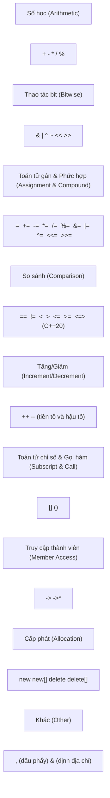

# Chương 6: Quá tải toán tử (Operator Overloading)

Quá tải toán tử (Operator overloading) cho phép các kiểu dữ liệu do người dùng tự định nghĩa (các lớp class và cấu trúc struct) sử dụng các toán tử chuẩn của C++ một cách cực kỳ tự nhiên. Khi được áp dụng một cách đúng đắn, quá tải toán tử giúp cho các kiểu dữ liệu tùy biến hoạt động trơn tru giống như các kiểu dữ liệu xây dựng sẵn (built-in types), nâng cao đáng kể độ sáng sủa và khả năng bảo trì của mã nguồn.

## Các quy tắc và giới hạn của việc Quá tải toán tử

### Các toán tử có thể quá tải

Sơ đồ dưới đây tổng hợp các danh mục toán tử cho phép thực hiện quá tải trong C++:



### Các toán tử tuyệt đối KHÔNG thể quá tải

| Toán tử | Tên gọi toán tử | Lý do không cho phép quá tải |
|----------|------|--------|
| `::` | Toán tử phân giải phạm vi (Scope resolution) | Thao tác trên các kiểu dữ liệu / không gian tên chứ không phải trên giá trị |
| `.` | Toán tử truy cập thành viên trực tiếp (Direct member access) | Phá vỡ cơ chế kiểm soát quyền truy cập thành viên của lớp |
| `.*` | Toán tử truy cập qua con trỏ thành viên | Cú pháp đặc biệt, không thể định nghĩa lại |
| `?:` | Toán tử điều kiện ba ngôi (Ternary conditional) | Không thể bảo đảm tính an toàn khi quá tải |
| `sizeof` | Toán tử lấy kích thước kiểu dữ liệu | Thao tác tính toán xây dựng sẵn tại thời điểm biên dịch |
| `typeid` | Toán tử RTTI lấy thông tin kiểu | Phục vụ truy vấn thông tin kiểu lúc biên dịch / thực thi |
| `alignof` | Toán tử yêu cầu căn biên bộ nhớ | Toán tử xử lý lúc biên dịch |

### Các quy tắc nền tảng bắt buộc tuân thủ

1. **Giữ nguyên vẹn ngữ nghĩa tự nhiên của toán tử**  
   Toán tử `operator+` nên thực hiện phép cộng chứ không phải phép trừ. Việc thiết kế toán tử đi ngược lại kỳ vọng tự nhiên sẽ gây ra nhiều lỗi logic cực kỳ khó phát hiện.
2. **Không thay đổi thứ tự ưu tiên và tính kết hợp (Precedence and associativity)**  
   Các toán tử quá tải vẫn giữ nguyên thứ tự ưu tiên và tính kết hợp giống như phiên bản chuẩn xây dựng sẵn của chúng.
3. **Không thay đổi số lượng toán hạng (Bậc toán tử - Arity)**  
   Toán tử một ngôi vẫn là một ngôi, hai ngôi vẫn là hai ngôi. Toán tử ba ngôi `?:` không cho phép thực hiện quá tải.
4. **Ít nhất một toán hạng phải là kiểu dữ liệu do người dùng tự định nghĩa**  
   Bạn tuyệt đối không thể định nghĩa lại cách thức hoạt động của toán tử nếu cả hai toán hạng đều là các kiểu dữ liệu xây dựng sẵn (ví dụ: cấm quá tải toán tử cộng giữa hai số `int`).
5. **Không thể tự sáng chế ra các toán tử mới**  
   Ví dụ: Bạn không thể tự chế ra toán tử `**` để làm phép toán lũy thừa.
6. **Mất tính chất đánh giá ngắn mạch (Short-circuit logic) đối với `&&` và `||`**  
   Khi được quá tải, các toán tử `&&` và `||` sẽ bắt buộc phải đánh giá giá trị của cả hai toán hạng (không còn tính năng ngắn mạch). Khuyến cáo tuyệt đối tránh quá tải các toán tử này.
7. **Toán tử dấu phẩy `,` có thể quá tải nhưng cực kỳ khuyến cáo tránh** – vì nó phá vỡ cam kết đánh giá tuần tự từ trái qua phải.

## Quá tải toán tử dưới dạng Phương thức thành viên so với Hàm tự do bên ngoài (Hàm bạn Friend)

Có hai phương pháp chính để định nghĩa một toán tử quá tải:

| Tiêu chí so sánh | Dưới dạng Phương thức thành viên | Dưới dạng Hàm tự do (thường là hàm bạn) |
|--------|----------------|-----------------------------------|
| **Toán hạng vế trái** | Chính là đối tượng ngầm định `*this` | Tham số truyền vào đầu tiên của hàm |
| **Có thể chuyển kiểu ngầm định cho vế trái?** | Không thể, toán hạng vế trái bắt buộc phải là đối tượng của lớp | Có thể, nếu kiểu dữ liệu của tham số đầu cho phép tự động chuyển đổi |
| **Bắt buộc bởi ngôn ngữ cho `=`, `()`, `[]`, `->`** | Bắt buộc | Không cho phép |
| **Trường hợp áp dụng cho toán tử hai ngôi đối xứng** | Ít dùng (làm mất tính đối xứng của phép toán) | Được ưu tiên lựa chọn (ví dụ: phép cộng `a + b` đối xứng) |
| **Trường hợp áp dụng cho toán tử luồng `<<`, `>>`** | Không thể thực hiện (vì vế trái là luồng `ostream&`) | Luôn luôn phải khai báo dạng hàm tự do |

**Hướng dẫn lựa chọn thiết kế:**  
- Hãy quá tải các toán tử `=`, `()`, `[]`, `->` dưới dạng phương thức thành viên (bắt buộc bởi ngôn ngữ C++).  
- Hãy quá tải các toán tử một ngôi dưới dạng phương thức thành viên (theo quy ước thiết kế phổ biến).  
- Hãy quá tải các toán tử hai ngôi có hành vi chỉnh sửa vế trái (`+=`, `-=`, v.v.) dưới dạng phương thức thành viên.  
- Hãy quá tải các toán tử hai ngôi đối xứng (`+`, `-`, `==`, v.v.) dưới dạng hàm tự do bên ngoài lớp để hỗ trợ khả năng tự động chuyển đổi kiểu dữ liệu ngầm định một cách công bằng cho cả hai vế.

**Ví dụ đối chiếu – Phương thức thành viên so với Hàm tự do:**

```cpp
class Rational {
    int num, den;
public:
    Rational(int n = 0, int d = 1) : num(n), den(d) {}

    // Phương thức thành viên: toán hạng vế trái ngầm định là *this
    Rational& operator+=(const Rational& other) {
        num = num * other.den + other.num * den;
        den = den * other.den;
        return *this;
    }

    // Hàm bạn tự do bên ngoài lớp: phục vụ phép cộng đối xứng
    friend Rational operator+(const Rational& a, const Rational& b) {
        return Rational(a.num * b.den + b.num * a.den,
                        a.den * b.den);
    }
};
```

## 1. Toán tử một ngôi (Unary Operators)

Toán tử một ngôi chỉ tác động lên một toán hạng duy nhất. Chúng thường được cài đặt dưới dạng phương thức thành viên (không nhận tham số) hoặc dưới dạng hàm tự do (nhận một tham số).

### Toán tử Tăng và Giảm (`++`, `--`)

C++ hỗ trợ cả hai phiên bản tiền tố (prefix) và hậu tố (postfix). Phiên bản hậu tố nhận thêm một tham số kiểu `int` không sử dụng để giúp trình biên dịch phân biệt với phiên bản tiền tố.

```cpp
class Counter {
    int value;
public:
    Counter(int v = 0) : value(v) {}

    // Tiền tố (Prefix): ++c
    Counter& operator++() {
        ++value;
        return *this; // Trả về tham chiếu đến chính đối tượng sau khi tăng
    }

    // Hậu tố (Postfix): c++
    Counter operator++(int) {
        Counter temp = *this;   // Lưu lại giá trị cũ trước khi tăng
        ++(*this);              // Gọi lại hàm tiền tố để tăng giá trị thực tế
        return temp;            // Trả về bản sao lưu giá trị cũ ban đầu
    }

    // Tương tự cho toán tử giảm --
    Counter& operator--() {
        --value;
        return *this;
    }

    Counter operator--(int) {
        Counter temp = *this;
        --(*this);
        return temp;
    }

    int get() const { return value; }
};
```

**Lưu ý quan trọng**:  
- Toán tử tiền tố trả về một tham chiếu `T&` trỏ tới chính đối tượng (cực kỳ hiệu quả, tránh sao chép).  
- Toán tử hậu tố bắt buộc phải tạo một bản sao đối tượng cũ để trả về dạng tham trị `T` (tốn chi phí sao chép). Hãy luôn ưu tiên sử dụng toán tử tiền tố khi không thực sự cần dùng đến giá trị cũ.

### Phép phủ định logic (`!`), Phủ định bit (`~`), Trừ một ngôi (`-`)

Đây là các toán tử một ngôi trả về một đối tượng hoàn toàn mới dưới dạng tham trị.

```cpp
class Vector3D {
    double x, y, z;
public:
    Vector3D(double x = 0, double y = 0, double z = 0) : x(x), y(y), z(z) {}

    Vector3D operator-() const {          // Phép trừ một ngôi (đổi dấu vector)
        return Vector3D(-x, -y, -z);
    }

    bool operator!() const {              // Phép phủ định logic (kiểm tra vector không)
        return (x == 0 && y == 0 && z == 0);
    }

    Vector3D operator~() const {          // Phép phủ định bit
        return Vector3D(~(long long)x, ~(long long)y, ~(long long)z);
    }
};
```

## 2. Toán tử hai ngôi (Binary Operators)

### Toán tử số học (`+`, `-`, `*`, `/`, `%`)

Các toán tử số học tạo ra và trả về một đối tượng mới dưới dạng tham trị, tuyệt đối không được phép chỉnh sửa các toán hạng ban đầu. Hãy cài đặt chúng dưới dạng hàm tự do bên ngoài lớp để bảo đảm tính đối xứng và tận dụng các toán tử gán phức hợp tương ứng để viết mã nguồn tối ưu.

```cpp
class Rational {
public:
    Rational& operator+=(const Rational& other) { /* ... */ return *this; }
    Rational& operator-=(const Rational& other) { /* ... */ return *this; }
};

// Cài đặt toán tử + thông qua toán tử +=
Rational operator+(Rational a, const Rational& b) {
    a += b;
    return a;
}

Rational operator-(Rational a, const Rational& b) {
    a -= b;
    return a;
}
```

### Toán tử quan hệ so sánh (`==`, `!=`, `<`, `>`, `<=`, `>=`)

Trả về kết quả kiểu `bool`. Từ chuẩn C++20 trở đi, trình biên dịch có thể tự động sinh ra toán tử `!=` từ toán tử `==` và sinh ra toàn bộ các phép so sánh quan hệ khác từ toán tử so sánh ba ngôi `<=>` (three-way comparison / spaceship operator). Đối với các chuẩn C++ cũ hơn, bạn bắt buộc phải định nghĩa thủ công đầy đủ và nhất quán các toán tử này.

```cpp
class Point {
    int x, y;
public:
    Point(int x = 0, int y = 0) : x(x), y(y) {}

    bool operator==(const Point& other) const {
        return x == other.x && y == other.y;
    }

    bool operator<(const Point& other) const {
        return x < other.x || (x == other.x && y < other.y);
    }

    // Các toán tử còn lại định nghĩa gián tiếp qua == và < (C++17 trở về trước)
    bool operator!=(const Point& other) const { return !(*this == other); }
    bool operator>(const Point& other) const  { return other < *this; }
    bool operator<=(const Point& other) const { return !(other < *this); }
    bool operator>=(const Point& other) const { return !(*this < other); }
};
```

### Toán tử gán sao chép `=` (Áp dụng Cơ chế Sao chép và Hoán đổi - Copy‑and‑Swap)

Mặc dù toán tử gán sao chép được trình biên dịch tự động sinh ra, tuy nhiên đối với các lớp tự quản lý tài nguyên thủ công (như con trỏ thô, tệp tin), bạn bắt buộc phải tự cài đặt. Việc sử dụng cơ chế **sao chép và hoán đổi (copy-and-swap)** mang lại sự an toàn ngoại lệ tuyệt đối cho mã nguồn.

```cpp
#include <utility> // Thư viện chứa hàm std::swap

class String {
    char* data;
public:
    String(const char* str = "") {
        data = new char[strlen(str) + 1];
        strcpy(data, str);
    }

    // Hàm khởi tạo sao chép (Copy constructor)
    String(const String& other) {
        data = new char[strlen(other.data) + 1];
        strcpy(data, other.data);
    }

    // Hàm hủy (Destructor)
    ~String() { delete[] data; }

    // Phương thức hoán đổi nội bộ (Cam kết không phát sinh ngoại lệ noexcept)
    void swap(String& other) noexcept {
        std::swap(data, other.data);
    }

    // Toán tử gán sao chép áp dụng cơ chế sao chép và hoán đổi
    String& operator=(String other) {   // Truyền tham trị (tự động tạo bản sao khác - covers both copy and move)
        swap(other);                    // Hoán đổi an toàn dữ liệu nội bộ với bản sao
        return *this;
    } // Bản sao other tự hủy tại đây, giải phóng vùng nhớ cũ của *this một cách tự động
};
```

**Tại sao cơ chế sao chép và hoán đổi hoạt động hoàn hảo:**  
- Tham số truyền vào `other` được truyền dưới dạng tham trị, kích hoạt hàm khởi tạo sao chép để tạo ra một bản sao an toàn độc lập.  
- Lệnh hoán đổi `swap` chỉ thực hiện trao đổi địa chỉ con trỏ của đối tượng hiện tại với bản sao (thao tác cực nhanh và an toàn tuyệt đối).  
- Khi ra khỏi khối lệnh của toán tử, bản sao `other` (bấy giờ đang chứa vùng nhớ cũ của đối tượng hiện hành) sẽ tự động bị tiêu hủy và giải phóng vùng nhớ cũ đó một cách sạch sẽ.  
- Bảo đảm an toàn ngoại lệ mạnh: Nếu quá trình sao chép tham số xảy ra lỗi và ném ra ngoại lệ, đối tượng vế trái của phép gán vẫn hoàn toàn nguyên vẹn chưa bị ảnh hưởng.

### Các toán tử gán phức hợp (`+=`, `-=`, `*=`, v.v.)

Các toán tử này trực tiếp chỉnh sửa thuộc tính của đối tượng vế trái. Hãy cài đặt chúng dưới dạng phương thức thành viên và trả về một tham chiếu `T&` trỏ tới chính đối tượng hiện hành `*this` để cho phép gọi chuỗi toán tử liên tiếp.

```cpp
class Matrix {
    double data[3][3];
public:
    Matrix& operator+=(const Matrix& other) {
        for (int i = 0; i < 3; ++i)
            for (int j = 0; j < 3; ++j)
                data[i][j] += other.data[i][j];
        return *this;
    }
};

// Cách sử dụng
Matrix a, b;
(a += b) += b;   // Cộng b hai lần liên tiếp vào ma trận a
```

### Toán tử chỉ số mảng `[]` (Subscript Operator)

Dùng để cung cấp cú pháp truy cập các phần tử theo dạng mảng. Hãy luôn cung cấp hai phiên bản quá tải song song: một phiên bản hằng dành cho đối tượng const (chỉ cho phép đọc) và một phiên bản không hằng (cho phép đọc ghi).

```cpp
class IntVector {
    int* arr;
    size_t size;
public:
    IntVector(size_t n) : size(n), arr(new int[n]) {}
    ~IntVector() { delete[] arr; }

    // Phiên bản không hằng – cho phép chỉnh sửa giá trị
    int& operator[](size_t index) {
        return arr[index];
    }

    // Phiên bản hằng const – chỉ cho phép đọc dữ liệu
    const int& operator[](size_t index) const {
        return arr[index];
    }
};
```

### Toán tử gọi hàm `()` (Function Call Operator) – Đối tượng hàm (Functors)

Một đối tượng được quá tải toán tử gọi hàm `()` có thể được sử dụng giống hệt như một hàm thông thường. Các đối tượng đặc biệt này được gọi là **đối tượng hàm (functors)**. Chúng được sử dụng cực kỳ rộng rãi trong các thuật toán chuẩn của STL và có khả năng duy trì trạng thái nội bộ giữa các lượt gọi.

```cpp
class MultiplyBy {
    double factor;
public:
    MultiplyBy(double f) : factor(f) {}

    double operator()(double x) const {
        return x * factor;
    }
};

// Cách sử dụng
MultiplyBy timesTwo(2.0);      // Tạo đối tượng nhân với 2
double result = timesTwo(5.0); // Sử dụng đối tượng giống như hàm: kết quả = 10.0

// Kết hợp với các thuật toán của thư viện STL
#include <vector>
#include <algorithm>
std::vector<double> v = {1, 2, 3};
std::transform(v.begin(), v.end(), v.begin(), MultiplyBy(2.5)); // Nhân tất cả các phần tử trong vector với 2.5
```

### Các toán tử luồng nhập xuất `<<` và `>>`

Đây bắt buộc phải là các hàm tự do bên ngoài lớp vì toán hạng vế trái của phép toán là đối tượng luồng `std::ostream&` hoặc `std::istream&` chứ không phải là đối tượng của lớp bạn. Chúng thường được khai báo là hàm bạn (friend) của lớp để có quyền truy cập trực tiếp các thuộc tính private của lớp khi xuất nhập dữ liệu.

```cpp
#include <iostream>

class Complex {
    double re, im;
public:
    Complex(double r = 0, double i = 0) : re(r), im(i) {}

    friend std::ostream& operator<<(std::ostream& os, const Complex& c);
    friend std::istream& operator>>(std::istream& is, Complex& c);
};

std::ostream& operator<<(std::ostream& os, const Complex& c) {
    os << c.re << (c.im >= 0 ? "+" : "") << c.im << "i";
    return os;
}

std::istream& operator>>(std::istream& is, Complex& c) {
    is >> c.re >> c.im;
    return is;
}
```

Việc trả về tham chiếu của luồng (`os`/`is`) cho phép thực hiện chuỗi thao tác liên tục quen thuộc: `std::cout << a << b << std::endl;`.

## Quá tải toán tử `new` và `delete`

Bạn có thể tiến hành quá tải hai toán tử `operator new` và `operator delete` của riêng một lớp để tự xây dựng các cơ chế quản lý bộ nhớ tùy biến. Điều này cực kỳ hữu ích cho các trường hợp:

- Tối ưu hóa hiệu năng cấp phát bằng cơ chế vùng nhớ đệm (Memory Pool / Memory Arenas).
- Theo dõi các vết cấp phát bộ nhớ phục vụ công tác gỡ lỗi (debugging).
- Căn biên bộ nhớ (alignment) chuẩn xác theo yêu cầu phần cứng đặc thù.

### Cú pháp và Ví dụ thực tế

```cpp
#include <cstdlib>
#include <iostream>

class Widget {
    static constexpr size_t POOL_SIZE = 1024;
    static char pool[POOL_SIZE];
    static size_t offset;

public:
    // Quá tải toán tử new (tự động tĩnh static ngầm định)
    void* operator new(size_t size) {
        if (size > POOL_SIZE - offset) throw std::bad_alloc();
        void* ptr = pool + offset;
        offset += size;
        std::cout << "Custom new: Cap phat " << size << " bytes tu pool\n";
        return ptr;
    }

    // Quá tải toán tử delete
    void operator delete(void* ptr) noexcept {
        // Tùy biến giải phóng bộ nhớ của riêng bạn
        std::cout << "Custom delete duoc goi\n";
    }

    // Phiên bản quá tải cho mảng (tùy chọn)
    void* operator new[](size_t size) {
        return ::operator new(size);   // Gọi toán tử new toàn cục mặc định
    }

    void operator delete[](void* ptr) noexcept {
        ::operator delete(ptr);
    }
};

char Widget::pool[Widget::POOL_SIZE];
size_t Widget::offset = 0;

// Cách sử dụng
Widget* w = new Widget();   // Kích hoạt toán tử new tùy biến của lớp
delete w;                   // Kích hoạt toán tử delete tùy biến của lớp
```

### Các lưu ý đặc biệt quan trọng

- Các toán tử `new` và `delete` quá tải của lớp mặc định có tính chất **tĩnh (static)** – chúng hoạt động cấp lớp và hoàn toàn không có con trỏ `this`.
- Phương thức `delete` được quá tải bắt buộc phải khớp chữ ký hoàn toàn với phương thức `new` tương ứng.
- Bạn có thể truyền thêm các tham số tùy biến vào toán tử `new` (ví dụ: `new(arena) Widget`) – đây gọi là cú pháp **toán tử `new` định vị (placement new)**, cực kỳ phổ biến trong các thư viện cấp phát chuyên biệt.
- Khuyến nghị sử dụng đặc tả không phát sinh ngoại lệ `noexcept` cho toán tử `delete`.

### Ví dụ về Toán tử `new` định vị (Placement New)

```cpp
class Widget {
public:
    // Nhận một địa chỉ ô nhớ ptr có sẵn ngoài Heap và khởi tạo đối tượng trực tiếp tại đó
    void* operator new(size_t size, void* ptr) noexcept {
        return ptr;
    }
    // Toán tử delete tương ứng - không làm gì đối với placement new
    void operator delete(void*, void*) noexcept {}
};
```

## Bảng tổng hợp các quy chuẩn thiết kế

| Toán tử | Cài đặt khuyến nghị | Kiểu trả về | Ghi chú |
|-------------------|------------------|-------------|-------|
| `=` `[]` `()` `->` | Bắt buộc là Member | Tham chiếu `T&` cho `=`; Tham chiếu hoặc đối tượng cho `[]`; Bất kỳ cho `()`, `->` | Ràng buộc bởi ngôn ngữ |
| `++` `--` (tiền tố) | Member | `T&` | Trả về chính đối tượng `*this` (tối ưu) |
| `++` `--` (hậu tố) | Member | `T` | Trả về bản sao lưu giá trị cũ (tốn chi phí sao chép) |
| Một ngôi `!` `-` `~` | Member hoặc Hàm tự do | `T` (hoặc `bool` cho `!`) | Thường chọn member cho ngắn gọn |
| Số học `+ - * / %` | Hàm tự do (Non-member) | `T` | Nên cài đặt gián tiếp thông qua toán tử gán phức hợp tương ứng |
| Gán phức hợp `+= -=` | Member | `T&` | Trả về chính đối tượng `*this` |
| So sánh `== != < >` | Hàm tự do (Non-member) | `bool` | Hỗ trợ chuyển đổi kiểu dữ liệu đối xứng cả 2 vế |
| Nhập xuất `<< >>` | Hàm tự do (Non-member) | `ostream&` / `istream&` | Bắt buộc phải là hàm tự do ngoài lớp |
| `new` / `delete` | Member tĩnh (Static) | `void*` / `void` | Tự tùy biến quản lý cấp phát bộ nhớ |

## Các lỗi thường gặp cần tránh

1. **Quá tải `&&` hoặc `||`** – Làm mất hoàn toàn đặc tính đánh giá ngắn mạch vô cùng quan trọng của phép toán logic.
2. **Quá tải toán tử dấu phẩy `,`** – Phá vỡ cam kết đánh giá tuần tự từ trái qua phải của dòng chạy chương trình.
3. **Trả về tham chiếu của một biến cục bộ** từ các toán tử số học (ví dụ: trả về `T&` từ `operator+`). Biến cục bộ sẽ tự hủy khi ra khỏi hàm, dẫn đến con trỏ rác. Hãy luôn trả về dạng tham trị `T`.
4. **Bỏ quên việc xử lý lỗi tự gán (self-assignment)** trong toán tử gán sao chép `operator=`. Hãy sử dụng cơ chế sao chép và hoán đổi (copy-and-swap) để tự động hóa việc xử lý này một cách hoàn hảo.
5. **Cố tình khai báo các toán tử luồng là phương thức thành viên** – Chúng sẽ không bao giờ hoạt động được vì vế trái của phép toán bắt buộc phải là đối tượng luồng chứ không phải là đối tượng của lớp.
6. **Quá tải toán tử định địa chỉ `operator&`** – Có thể làm hỏng các đoạn mã nguồn tổng quát vốn dĩ giả định rằng cú pháp `&obj` luôn trả về địa chỉ bộ nhớ thực sự của đối tượng.

Quá tải toán tử khi được áp dụng một cách tinh tế và thông thái sẽ mang lại một mã nguồn C++ cực kỳ trang nhã, ngắn gọn và giàu tính diễn đạt. Hãy luôn tự đặt câu hỏi liệu việc quá tải toán tử có giúp mã nguồn của bạn trở nên sáng tỏ hơn hay chỉ làm lu mờ đi ý nghĩa thực sự của kiểu dữ liệu.
