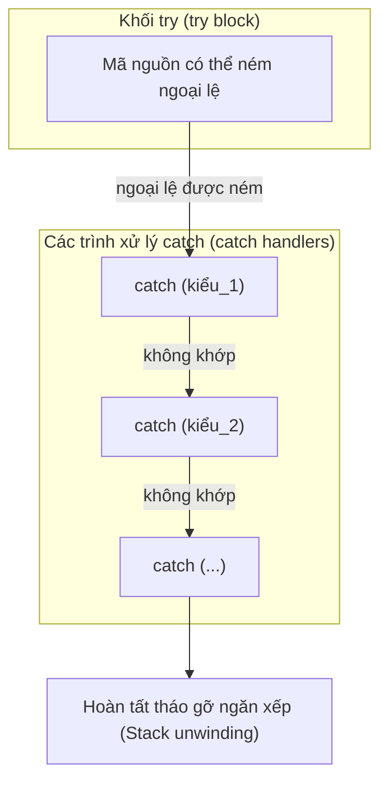
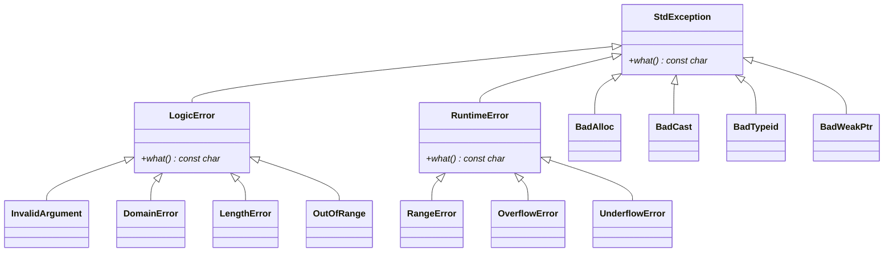
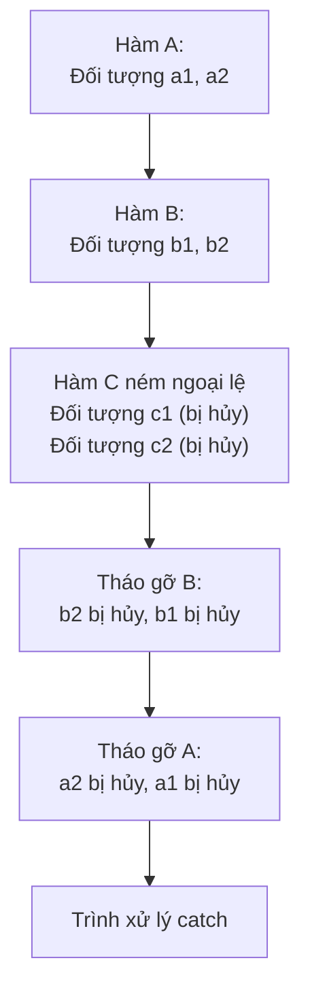
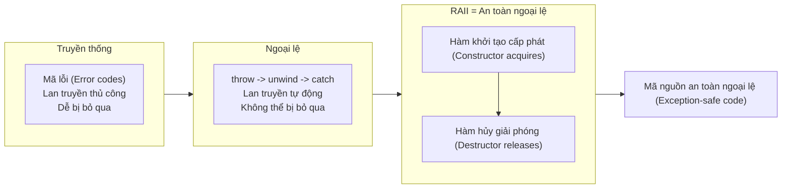

# Chương 7: Xử lý ngoại lệ (Exception Handling)

Xử lý ngoại lệ (Exception handling) là một cơ chế tách biệt việc phát hiện lỗi (error detection) khỏi việc xử lý lỗi (error handling), cho phép các chương trình phản hồi với các tình huống bất thường mà không làm ảnh hưởng đến luồng điều khiển thông thường của mã nguồn.

## Xử lý lỗi truyền thống so với Xử lý ngoại lệ (Traditional Error Handling vs Exceptions)

Các phương pháp truyền thống để xử lý lỗi bao gồm trả về mã lỗi (error codes), thiết lập các cờ toàn cục (global flags) như (`errno`), hoặc sử dụng cặp hàm `setjmp`/`longjmp`. Mỗi phương pháp đều có những nhược điểm lớn.

| Khía cạnh (Aspect) | Truyền thống (Mã lỗi) | Ngoại lệ (Exceptions) |
|---|---|---|
| **Sự lan truyền (Propagation)** | Kiểm tra thủ công sau mỗi lệnh gọi hàm | Tự động lan truyền ngược lên ngăn xếp cuộc gọi (call stack) |
| **Khả năng bị bỏ qua (Ignorability)** | Dễ bị bỏ qua (ví dụ: không kiểm tra giá trị trả về của hàm) | Không thể bị bỏ qua – chương trình sẽ kết thúc (terminate) nếu không được bắt |
| **Sự rõ ràng của mã nguồn (Code clarity)** | Trộn lẫn logic thông thường và logic xử lý lỗi | Tách biệt luồng thông thường ra khỏi logic xử lý lỗi |
| **Hàm khởi tạo (Constructors)** | Không thể trả về mã lỗi | Ném ngoại lệ (throw exception) để báo hiệu thất bại |
| **Hiệu năng (Performance)** | Không tốn thêm chi phí khi không xảy ra lỗi | Tốn một phần chi phí ngay cả khi không ném ngoại lệ (tuy nhiên các trình biên dịch hiện đại đã tối ưu hóa rất tốt) |

**Ví dụ – Sử dụng mã lỗi truyền thống**:

```cpp
int openFile(const char* name, FileHandle& out) {
    if (!name) return -1;
    // ... thử mở tệp
    if (failed) return -2;
    return 0; // thành công
}

FileHandle fh;
if (openFile("data.txt", fh) != 0) {
    // xử lý lỗi ở đây
}
```

**Ví dụ – Sử dụng ngoại lệ**:

```cpp
void openFile(const char* name, FileHandle& out) {
    if (!name) throw std::invalid_argument("name is null");
    // ... thử mở tệp
    if (failed) throw std::runtime_error("cannot open file");
}

try {
    FileHandle fh;
    openFile("data.txt", fh);
    // sử dụng fh
} catch (const std::exception& e) {
    // xử lý mọi lỗi một cách đồng bộ và thống nhất
}
```

## Các từ khóa ngoại lệ trong C++: `try`, `catch`, `throw`



### Cú pháp cơ bản (Basic Syntax)

```cpp
try {
    // Mã nguồn có thể ném ra ngoại lệ
    if (error_condition)
        throw SomeExceptionType("error message");
} catch (const SpecificException& e) {
    // Xử lý ngoại lệ cụ thể
} catch (const AnotherException& e) {
    // Xử lý loại ngoại lệ khác
} catch (...) {
    // Trình xử lý bắt tất cả (Catch-all handler) – xử lý bất kỳ ngoại lệ nào
}
```

### Ném ngoại lệ (Throwing Exceptions)

Sử dụng `throw` để kích hoạt một ngoại lệ. Bạn có thể ném bất kỳ kiểu dữ liệu nào, nhưng theo quy chuẩn, bạn nên ném các đối tượng được dẫn xuất từ lớp cơ sở `std::exception`.

```cpp
#include <stdexcept>

double divide(double a, double b) {
    if (b == 0.0)
        throw std::runtime_error("Division by zero");
    return a / b;
}
```

## Ném ngoại lệ từ Hàm khởi tạo và Hàm hủy (Throwing Exceptions from Constructors and Destructors)

### Hàm khởi tạo (Constructors)

Hàm khởi tạo không có giá trị trả về, vì vậy ngoại lệ là cách duy nhất đáng tin cậy để báo hiệu sự thất bại. Một đối tượng chỉ được cấu trúc một phần (partially constructed object) không nên được phép tồn tại.

```cpp
class Image {
    int* pixels;
    size_t width, height;
public:
    Image(size_t w, size_t h) : width(w), height(h) {
        if (w == 0 || h == 0)
            throw std::invalid_argument("dimensions must be positive");
        pixels = new int[w * h];  // cũng có thể ném std::bad_alloc
    }
    // hàm hủy sẽ không được gọi nếu hàm khởi tạo ném ngoại lệ
};
```

**Quan trọng**: Nếu một ngoại lệ thoát ra khỏi hàm khởi tạo, hàm hủy (destructor) của đối tượng đó sẽ **không** được gọi. Các tài nguyên đã được cấp phát trước đó trong quá trình khởi tạo phải được giải phóng thủ công trước khi ném ngoại lệ.

### Hàm hủy (Destructors)

Hàm hủy **không bao giờ** được ném ngoại lệ. Nếu một ngoại lệ lan truyền ra ngoài hàm hủy trong khi một ngoại lệ khác đang hoạt động, hàm `std::terminate` sẽ được gọi ngay lập tức (khiến chương trình bị sập).

```cpp
class Resource {
public:
    ~Resource() {
        try {
            // dọn dẹp tài nguyên có thể ném lỗi
            close();
        } catch (...) {
            // ghi nhật ký lỗi (log) hoặc bỏ qua – tuyệt đối không ném lại (rethrow)
        }
    }
};
```

**Quy tắc**: Kể từ chuẩn C++11, các hàm hủy mặc định được coi là `noexcept`. Nếu bạn cần thông báo một lỗi xảy ra trong hàm hủy, hãy ghi nhận lỗi đó ở bên trong và không ném nó ra ngoài.

## Bắt ngoại lệ bằng Giá trị, Tham chiếu hoặc Con trỏ (Catch by Value, Reference, or Pointer)

Mệnh đề `catch` có thể nhận đối tượng ngoại lệ theo nhiều cách khác nhau:

| Dạng Catch | Ưu điểm | Nhược điểm | Khuyến nghị? |
|---|---|---|---|
| `catch (std::exception e)` | Đơn giản | Phải sao chép đối tượng ngoại lệ – xảy ra hiện tượng cắt xén đối tượng (object slicing) đối với các kiểu dẫn xuất. | Không |
| `catch (std::exception& e)` | Không sao chép, giữ nguyên hành vi đa hình (polymorphic behavior) | Không | **Có**, nhưng ưu tiên tham chiếu hằng (`const reference`) |
| `catch (const std::exception* e)` | Có thể xử lý con trỏ | Đòi hỏi phải ném con trỏ trỏ tới đối tượng trên Heap – phát sinh các vấn đề quản lý bộ nhớ. | Không |
| `catch (const std::exception& e)` | Tương tự như trên, cộng thêm việc ngăn chặn sửa đổi đối tượng ngoại lệ | – | **Thực hành tốt nhất (Best practice)** |

**Thực hành tốt nhất (Best practice)**: Luôn bắt ngoại lệ bằng tham chiếu hằng (`const reference`) để tránh hiện tượng cắt xén đối tượng và tránh sao chép không cần thiết.

```cpp
try {
    // ...
} catch (const std::exception& e) {
    std::cerr << e.what() << '\n';
}
```

## Hệ thống cấp bậc ngoại lệ tiêu chuẩn (Standard Exception Hierarchy) (`<stdexcept>`)

Thư viện tiêu chuẩn C++ cung cấp một hệ thống cấp bậc gồm các lớp ngoại lệ được dẫn xuất từ lớp cơ sở `std::exception`.



### Các ngoại lệ tiêu chuẩn phổ biến (Common Standard Exceptions)

| Kiểu ngoại lệ (Exception type) | Phân loại (Category) | Nguyên nhân phổ biến (Typical cause) |
|---|---|---|
| `std::invalid_argument` | logic_error | Đối số không hợp lệ được truyền vào hàm |
| `std::out_of_range` | logic_error | Chỉ số mảng hoặc bộ chứa vượt quá giới hạn (out of bounds) |
| `std::length_error` | logic_error | Cố gắng vượt quá kích thước tối đa cho phép (ví dụ: `vector::reserve`) |
| `std::domain_error` | logic_error | Lỗi miền toán học (ví dụ: `sqrt(-1)`) |
| `std::runtime_error` | runtime_error | Lỗi phát hiện tại thời điểm chạy (không tìm thấy tệp, v.v.) |
| `std::overflow_error` | runtime_error | Tràn số học số dương (arithmetic overflow) |
| `std::bad_alloc` | – | Từ khóa `new` thất bại khi cấp phát bộ nhớ |
| `std::bad_cast` | – | Phép ép kiểu động `dynamic_cast` trên một tham chiếu bị thất bại |

### Cách sử dụng các ngoại lệ tiêu chuẩn

```cpp
#include <stdexcept>
#include <vector>

int getValue(const std::vector<int>& vec, size_t index) {
    if (index >= vec.size())
        throw std::out_of_range("index " + std::to_string(index) + 
                                " exceeds size " + std::to_string(vec.size()));
    return vec[index];
}
```

## Đặc tả ngoại lệ cũ (Deprecated) so với Chỉ định `noexcept` (noexcept Specifier)

### Đặc tả ngoại lệ kiểu cũ (Không còn khuyến nghị từ C++11, bị loại bỏ từ C++17)

```cpp
// Cú pháp cũ không nên sử dụng nữa
void oldFunc() throw(std::runtime_error, std::bad_alloc); // Liệt kê các ngoại lệ được phép ném
void oldNoThrow() throw();  // Cam kết không ném bất kỳ ngoại lệ nào
```

Các đặc tả cũ này được kiểm tra tại thời điểm chạy (runtime), gây ra chi phí hiệu năng đáng kể và đã bị loại bỏ khỏi ngôn ngữ.

### Chỉ định `noexcept` (noexcept Specifier) (C++11)

`noexcept` tuyên bố rằng một hàm sẽ không bao giờ ném ra bất kỳ ngoại lệ nào. Nếu một hàm được khai báo `noexcept` nhưng vẫn cố tình ném ngoại lệ, hàm `std::terminate` sẽ được gọi ngay lập tức để dừng chương trình.

```cpp
void safeFunction() noexcept {
    // Tuyệt đối không được ném ngoại lệ
}

void mayThrow() {
    // Có thể ném hoặc không ném ngoại lệ
}

// Chỉ định noexcept có điều kiện (Conditional noexcept)
template<typename T>
void swap(T& a, T& b) noexcept(noexcept(T(std::move(a)))) {
    // noexcept nếu hàm khởi tạo dịch chuyển (move constructor) của T là noexcept
}
```

**Khi nào nên sử dụng `noexcept`**:
- Hàm khởi tạo dịch chuyển (move constructors) và toán tử gán dịch chuyển (move assignment operators) (giúp tối ưu hóa như khi tái cấp phát `std::vector`)
- Hàm hủy (destructors) (mặc định đã là `noexcept`)
- Các hàm getter/setter đơn giản không thể ném lỗi
- Các hàm mà bạn dự định gọi từ bên trong hàm hủy hoặc các khối `catch`

**Ví dụ – Hàm khởi tạo dịch chuyển sử dụng `noexcept`**:

```cpp
class Buffer {
    int* data;
public:
    Buffer(Buffer&& other) noexcept : data(other.data) {
        other.data = nullptr;
    }
};
```

`std::vector` sử dụng `noexcept` để quyết định xem có nên sử dụng cơ chế di chuyển (move) hay sao chép (copy) khi tái cấp phát bộ nhớ – cơ chế dịch chuyển sẽ chỉ được sử dụng nếu chúng được đánh dấu `noexcept`.

## Tháo gỡ ngăn xếp và Quản lý tài nguyên (Stack Unwinding and Resource Management)

Khi một ngoại lệ được ném ra, môi trường thực thi (runtime) sẽ tìm kiếm một trình xử lý `catch` phù hợp. Trong quá trình tìm kiếm này, tất cả các đối tượng cục bộ (local objects) nằm trong phạm vi giữa lệnh `throw` và `catch` sẽ tự động bị hủy theo thứ tự ngược lại với thứ tự cấu trúc ban đầu. Quá trình này được gọi là **tháo gỡ ngăn xếp (stack unwinding)**.



```cpp
#include <iostream>

class Resource {
    std::string name;
public:
    Resource(const std::string& n) : name(n) {
        std::cout << "Acquire " << name << '\n';
    }
    ~Resource() {
        std::cout << "Release " << name << '\n';
    }
};

void risky() {
    Resource r1("local in risky");
    throw std::runtime_error("oops");
    Resource r2("never created"); // Không bao giờ chạy tới dòng này
}

void outer() {
    Resource r3("in outer");
    risky();
}

int main() {
    try {
        outer();
    } catch (const std::exception& e) {
        std::cout << "Caught: " << e.what() << '\n';
    }
}
```

Đầu ra của chương trình (Output):
```
Acquire in outer
Acquire local in risky
Release local in risky
Release in outer
Caught: oops
```

Lưu ý rằng `r2` chưa bao giờ được khởi tạo, và `r1` đã được hủy bỏ đúng cách trước khi `r3` được hủy bỏ. Quá trình dọn dẹp tự động này chính là nền tảng của sự an toàn ngoại lệ (exception safety).

## RAII (Resource Acquisition Is Initialization) – Chìa khóa cho Mã nguồn an toàn ngoại lệ

**RAII** là một triết lý thiết kế (idiom) trong C++, trong đó tài nguyên được cấp phát trong hàm khởi tạo (constructor) và được giải phóng tự động trong hàm hủy (destructor). Vòng đời của tài nguyên được liên kết chặt chẽ với vòng đời của đối tượng. Khi xảy ra ngoại lệ dẫn đến tháo gỡ ngăn xếp, các đối tượng RAII cục bộ sẽ tự động bị hủy và giải phóng tài nguyên mà chúng đang quản lý.

### Khi không dùng RAII – Dễ bị rò rỉ tài nguyên (Leak Prone)

```cpp
void badFunction() {
    int* data = new int[1000];
    // ... nếu có ngoại lệ ném ra ở đây, lệnh delete[] sẽ không bao giờ được thực thi
    delete[] data;
}
```

### Khi dùng RAII – An toàn ngoại lệ (Exception Safe)

```cpp
#include <vector>

void goodFunction() {
    std::vector<int> data(1000); // RAII: bộ nhớ được cấp phát tự động trong hàm khởi tạo
    // ... nếu ngoại lệ ném ra, hàm hủy của vector sẽ tự động chạy
} // data bị hủy ở đây, giải phóng bộ nhớ tự động
```

### Viết các lớp RAII tự tùy biến (Writing RAII Classes)

```cpp
class FileHandle {
    FILE* file;
public:
    FileHandle(const char* filename, const char* mode) {
        file = fopen(filename, mode);
        if (!file)
            throw std::runtime_error("cannot open file");
    }
    
    ~FileHandle() {
        if (file) fclose(file);
    }
    
    // Vô hiệu hóa sao chép (hoặc tự triển khai sao chép sâu - deep copy)
    FileHandle(const FileHandle&) = delete;
    FileHandle& operator=(const FileHandle&) = delete;
    
    // Cho phép dịch chuyển (move)
    FileHandle(FileHandle&& other) noexcept : file(other.file) {
        other.file = nullptr;
    }
    
    FILE* get() const { return file; }
};

// Cách sử dụng
void processFile() {
    FileHandle fh("data.txt", "r");
    // ... thao tác với fh – nếu có lỗi ngoại lệ xảy ra, hàm hủy của fh sẽ tự động đóng tệp
}
```

### Các mức đảm bảo an toàn ngoại lệ (Exception Safety Guarantees)

Có bốn cấp độ đảm bảo an toàn ngoại lệ cho các thao tác lập trình:

| Cấp độ | Sự đảm bảo (Guarantee) |
|---|---|
| **Đảm bảo không ném ngoại lệ (No‑throw guarantee)** | Thao tác không bao giờ ném ra bất kỳ ngoại lệ nào (ví dụ: các hàm `noexcept`). |
| **Đảm bảo mạnh (Strong guarantee)** | Nếu một ngoại lệ được ném ra, trạng thái chương trình vẫn được giữ nguyên vẹn như trước khi gọi hàm (tương tự cơ chế rollback). |
| **Đảm bảo cơ bản (Basic guarantee)** | Nếu một ngoại lệ được ném ra, không có tài nguyên nào bị rò rỉ và đối tượng vẫn ở trạng thái hợp lệ (nhưng không xác định giá trị cụ thể). |
| **Không đảm bảo (No guarantee)** | Có thể xảy ra rò rỉ bộ nhớ hoặc dữ liệu của chương trình bị hỏng hóc. |

**Ví dụ về đảm bảo mạnh – Sử dụng mô hình Sao chép và hoán đổi (Copy‑and‑swap)**:

```cpp
class String {
    char* data;
public:
    void swap(String& other) noexcept {
        std::swap(data, other.data);
    }
    
    String& operator=(const String& other) {
        String temp(other);    // có thể ném ngoại lệ – nếu có, trạng thái *this vẫn giữ nguyên vẹn
        swap(temp);            // không thể ném ngoại lệ
        return *this;
    }
};
```

### Các lớp bọc RAII phổ biến trong Thư viện tiêu chuẩn (Standard Library)

| Tài nguyên | Lớp bọc RAII |
|---|---|
| Bộ nhớ (sử dụng từ khóa `new`) | `std::vector`, `std::string`, các con trỏ thông minh (smart pointers) |
| Trình quản lý tệp | `std::fstream` (tự động đóng tệp khi đối tượng bị hủy) |
| Khóa loại trừ tương hỗ (Mutex lock) | `std::lock_guard`, `std::unique_lock` |
| Cấp phát động với trình xóa tùy chọn | `std::unique_ptr<T, Deleter>` |

**Ví dụ – Sử dụng `std::lock_guard`**:

```cpp
#include <mutex>
std::mutex m;

void threadSafeFunction() {
    std::lock_guard<std::mutex> lock(m); // tự động khóa mutex
    // ... vùng tranh chấp (critical section) – nếu xảy ra ngoại lệ, khóa tự động giải phóng
} // lock bị hủy, mutex được mở khóa
```

## Các nguyên tắc hướng dẫn lập trình an toàn ngoại lệ (Guidelines for Exception‑Safe Code)

1. **Sử dụng RAII cho mọi tài nguyên** – Hãy để hàm hủy tự động dọn dẹp.
2. **Không ném ngoại lệ từ hàm hủy** – Luôn đánh dấu hàm hủy là `noexcept`.
3. **Bắt ngoại lệ bằng tham chiếu hằng (`const reference`)** – Tránh hiện tượng cắt xén đối tượng và các bản sao dư thừa.
4. **Ưu tiên sử dụng các ngoại lệ tiêu chuẩn** – Sử dụng `std::runtime_error`, `std::invalid_argument`, v.v.
5. **Cung cấp sự đảm bảo mạnh bất cứ khi nào có thể** – Sử dụng thành ngữ sao chép và hoán đổi cho các phép gán.
6. **Đánh dấu các hàm khởi tạo dịch chuyển và hàm hoán đổi là `noexcept`** – Giúp kích hoạt các tối ưu hóa biên dịch.
7. **Tránh sử dụng từ khóa `new` và `delete` thô** – Thay thế bằng các bộ chứa tiêu chuẩn hoặc con trỏ thông minh.
8. **Tránh sử dụng đặc tả ngoại lệ cũ** – Thay vào đó hãy dùng `noexcept` nếu bạn cam kết hàm không ném ngoại lệ.

## Sơ đồ tổng kết



Cơ chế xử lý ngoại lệ khi kết hợp với RAII giúp các chương trình C++ trở nên cực kỳ mạnh mẽ và dễ bảo trì. Mấu chốt là đảm bảo rằng mọi tài nguyên luôn được quản lý bởi một đối tượng mà hàm hủy của nó chịu trách nhiệm giải phóng nó – khi đó ngoại lệ trở thành công cụ hỗ trợ lan truyền lỗi hiệu quả chứ không phải là mối đe dọa làm rò rỉ tài nguyên.
