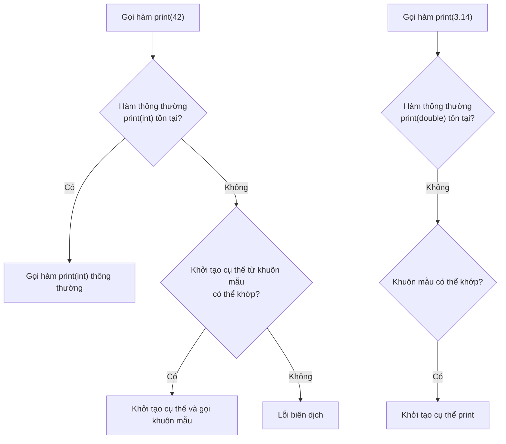
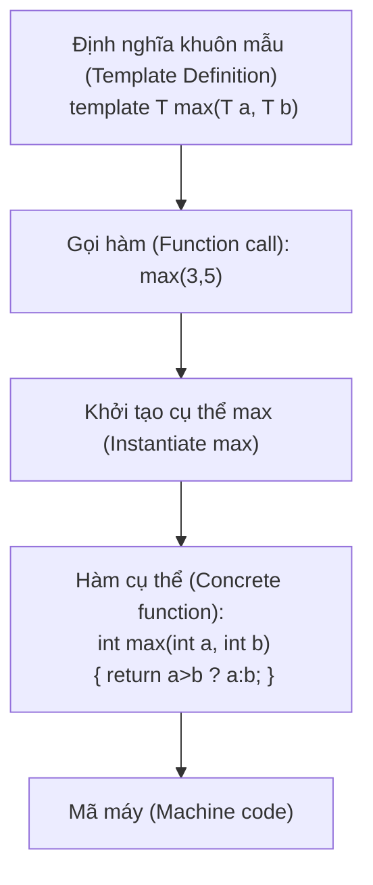

# Chương 8: Khuôn mẫu (Lập trình tổng quát) (Templates (Generic Programming))

Khuôn mẫu (Templates) hỗ trợ lập trình tổng quát (generic programming) bằng cách cho phép các hàm và lớp hoạt động với nhiều kiểu dữ liệu khác nhau mà không cần phải viết lại mã cho từng kiểu. Trình biên dịch tự động tạo ra mã nguồn tương thích với kiểu cụ thể từ định nghĩa khuôn mẫu, biến khuôn mẫu trở thành một dạng đa hình tại thời điểm biên dịch (compile‑time polymorphism).

## Khuôn mẫu hàm (Function Templates)

Một khuôn mẫu hàm (function template) định nghĩa một nhóm các hàm có hành vi giống nhau nhưng khác nhau về kiểu dữ liệu của các tham số hoặc giá trị trả về.

### Cú pháp và Suy luận kiểu (Syntax and Type Deduction)

```cpp
template <typename T>
T max(T a, T b) {
    return (a > b) ? a : b;
}
```

- Cú pháp `template <typename T>` dùng để khai báo một tham số khuôn mẫu (template parameter). Bạn cũng có thể viết là `template <class T>` (cả hai cách viết đều có ý nghĩa như nhau).
- Trình biên dịch tự động thực hiện suy luận kiểu (type deduction) `T` dựa trên các đối số được truyền vào hàm.

```cpp
int i = max(10, 20);      // T được suy luận là kiểu int
double d = max(3.14, 2.7); // T được suy luận là kiểu double
// max(10, 3.14); // Lỗi: mơ hồ (ambiguous), T có thể là int hoặc double
```

Bạn cũng có thể chỉ định kiểu dữ liệu một cách tường minh khi gọi hàm:

```cpp
double d = max<double>(10, 3.14); // Hợp lệ, ép kiểu T thành double
```

### Khởi tạo khuôn mẫu (Template Instantiation)

Quá trình tạo ra mã nguồn cụ thể tương thích với kiểu dữ liệu thực tế từ một khuôn mẫu được gọi là khởi tạo khuôn mẫu (template instantiation). Quá trình này diễn ra một cách ngầm định khi khuôn mẫu được sử dụng.

```cpp
template <typename T>
T square(T x) { return x * x; }

int main() {
    int a = square(5);      // Khởi tạo cụ thể hàm square<int>(int)
    double b = square(4.2); // Khởi tạo cụ thể hàm square<double>(double)
}
```

Mỗi tập hợp tham số khuôn mẫu khác nhau sẽ tạo ra một hàm quá tải (overload) riêng biệt trong tệp nhị phân đã biên dịch.

### Quá tải khuôn mẫu hàm (Overloading Function Templates)

Các khuôn mẫu hàm có thể được quá tải với các khuôn mẫu khác hoặc với các hàm thông thường. Khi cả hai lựa chọn đều khả thi, trình biên dịch sẽ ưu tiên chọn hàm thông thường nếu kiểu dữ liệu khớp hoàn toàn; ngược lại, nó sẽ chọn khuôn mẫu chuyên biệt nhất (most specialised template).

```cpp
template <typename T>
void print(T value) {
    std::cout << "Template: " << value << '\n';
}

void print(int value) {
    std::cout << "Ordinary: " << value << '\n';
}

int main() {
    print(42);      // Gọi phiên bản hàm thông thường (khớp hoàn toàn)
    print(3.14);    // Gọi phiên bản khuôn mẫu (không có hàm thông thường cho kiểu double)
    print<int>(42); // Ép buộc gọi phiên bản khuôn mẫu ngay cả khi tồn tại phiên bản hàm thông thường
}
```

Sơ đồ dưới đây minh họa quá trình phân giải quá tải (overload resolution):



## Khuôn mẫu lớp (Class Templates)

Khuôn mẫu lớp (class templates) định nghĩa các lớp tổng quát. Chúng thường được ứng dụng để xây dựng các bộ chứa tổng quát (generic containers).

### Định nghĩa một lớp tổng quát – `Stack<T>`

```cpp
template <typename T>
class Stack {
private:
    std::vector<T> data;
public:
    void push(const T& value) { data.push_back(value); }
    void pop() { if (!empty()) data.pop_back(); }
    T& top() { return data.back(); }
    const T& top() const { return data.back(); }
    bool empty() const { return data.empty(); }
    size_t size() const { return data.size(); }
};

// Cách sử dụng
Stack<int> intStack;
intStack.push(10);
Stack<std::string> stringStack;
stringStack.push("hello");
```

### Hàm thành viên định nghĩa bên ngoài khuôn mẫu lớp

Các định nghĩa hàm thành viên bên ngoài lớp phải được đặt trong cùng một tệp tiêu đề (header file) và phải sử dụng cùng một cú pháp khai báo khuôn mẫu.

```cpp
template <typename T>
class Stack {
public:
    void push(const T& value);
};

template <typename T>
void Stack<T>::push(const T& value) {
    // Triển khai logic hàm
}
```

Do trình biên dịch cần toàn bộ định nghĩa lớp và hàm để thực hiện quá trình khởi tạo cụ thể, việc triển khai mã nguồn hoàn toàn trong tệp tiêu đề (header-only implementation) là cách làm tiêu chuẩn trong C++.

### Chuyên biệt hóa khuôn mẫu (Toàn phần và Bán phần) (Template Specialisation (Full and Partial))

Đôi khi, giải pháp tổng quát không hoạt động hiệu quả hoặc không khả thi cho một kiểu dữ liệu cụ thể, hoặc một phiên bản chuyên biệt hóa có thể tối ưu hiệu năng tốt hơn.

**Chuyên biệt hóa toàn phần (Full specialisation)** – cung cấp một triển khai cụ thể hoàn chỉnh cho một kiểu dữ liệu duy nhất.

```cpp
template <>
class Stack<bool> {
private:
    std::vector<char> bits;
public:
    void push(bool value) {
        bits.push_back(value ? 1 : 0);
    }
    bool top() const { return bits.back() != 0; }
    // ...
};
```

**Chuyên biệt hóa bán phần (Partial specialisation)** – chỉ chuyên biệt hóa một phần các tham số khuôn mẫu (chỉ hỗ trợ đối với khuôn mẫu lớp, không áp dụng cho khuôn mẫu hàm).

```cpp
template <typename T>
class Stack<T*> {          // Chuyên biệt hóa dành cho kiểu con trỏ
private:
    std::vector<T*> data;
public:
    void push(T* ptr) { data.push_back(ptr); }
    T* top() const { return data.back(); }
};
```

Khi một lớp có nhiều tham số khuôn mẫu, bạn có thể chuyên biệt hóa một vài tham số trong số đó.

```cpp
template <typename Key, typename Value>
class Dictionary { /* Phiên bản tổng quát */ };

// Chuyên biệt hóa bán phần: Key cố định là int, Value vẫn để tự do
template <typename Value>
class Dictionary<int, Value> {
    // Được chuyên biệt hóa dành riêng cho các khóa có kiểu int
};
```

### Tham số khuôn mẫu phi kiểu (Non‑Type Template Parameters)

Tham số phi kiểu chấp nhận các giá trị (không phải kiểu dữ liệu) tại thời điểm biên dịch. Chúng thường được dùng để cấu trúc các bộ chứa có kích thước cố định.

```cpp
template <typename T, size_t N>
class Array {
    T data[N];
public:
    size_t size() const { return N; }
    T& operator[](size_t index) { return data[index]; }
    const T& operator[](size_t index) const { return data[index]; }
};

// Cách sử dụng
Array<int, 5> arr;   // N = 5
arr[0] = 42;
```

Tham số phi kiểu có thể là các số nguyên, con trỏ, tham chiếu hoặc kiểu `std::nullptr_t` (C++11). Các số dấu phẩy động (floating-point) và các kiểu lớp thông thường không được phép sử dụng làm tham số phi kiểu.

```cpp
template <int* Ptr> class Buffer {};   // Tham số con trỏ
int global;
Buffer<&global> buf;                   // Hợp lệ
```

## Khuôn mẫu số lượng tham số biến đổi (Variadic Templates) (C++11)

Khuôn mẫu số lượng tham số biến đổi cho phép nhận số lượng đối số khuôn mẫu tùy ý. Chúng đóng vai trò cốt lõi khi thiết kế các hàm tương tự `printf` nhưng an toàn kiểu (type-safe), `std::tuple`, hay các hàm nhà máy (factory functions).

### Toán tử `sizeof...`

Toán tử `sizeof...` trả về số lượng đối số có trong một gói tham số (parameter pack) tại thời điểm biên dịch.

```cpp
template <typename... Args>
void countArguments(Args... args) {
    std::cout << "Number of arguments: " << sizeof...(args) << '\n';
}

// Cách sử dụng
countArguments(1, 2.5, "hello"); // In ra: 3
```

### Khai triển đệ quy (Recursive Expansion) (C++11/14)

Song song với gói tham số biến đổi, mô hình lập trình phổ biến nhất là định nghĩa một trường hợp cơ sở (base case) kết hợp với một trường hợp đệ quy (recursive case).

```cpp
// Trường hợp cơ sở: không có đối số
void print() {}

// Trường hợp đệ quy: in một đối số trước rồi đệ quy xử lý các phần còn lại
template <typename T, typename... Rest>
void print(T first, Rest... rest) {
    std::cout << first;
    if constexpr (sizeof...(rest) > 0) {
        std::cout << ", ";
    }
    print(rest...);
}

// Cách sử dụng
print(10, 3.14, "hello"); // In ra: "10, 3.14, hello"
```

### Biểu thức cuộn (Fold Expressions) (C++17)

Biểu thức cuộn (Fold expressions) giúp đơn giản hóa đáng kể cấu trúc mã nguồn khi sử dụng khuôn mẫu số lượng tham số biến đổi. Chúng áp dụng một toán tử nhị phân lên toàn bộ các đối số trong một gói tham số.

```cpp
// Cuộn phải một ngôi (Unary right fold) đối với phép toán +
template <typename... Args>
auto sum(Args... args) {
    return (args + ...);   // Khai triển thành: arg1 + (arg2 + (arg3 + ...))
}

// Cuộn trái một ngôi (Unary left fold) đối với phép toán -
template <typename... Args>
auto subtract(Args... args) {
    return (... - args);   // Khai triển thành: ((arg1 - arg2) - arg3) - ...
}

// Biểu thức cuộn nhị phân (Binary fold) với giá trị khởi tạo
template <typename... Args>
auto product(Args... args) {
    return (1 * ... * args); // Giá trị khởi tạo là 1, sau đó nhân với các đối số trong args...
}

int main() {
    int s = sum(1, 2, 3, 4);     // 1 + 2 + 3 + 4 = 10
    int d = subtract(10, 3, 2);  // (10 - 3) - 2 = 5
    int p = product(2, 3, 4);    // 1 * 2 * 3 * 4 = 24
}
```

Bảng dưới đây tổng hợp cú pháp của các biểu thức cuộn:

| Cú pháp (Syntax) | Mô tả (Description) | Ví dụ khai triển (với pack = 1, 2, 3) |
|---|---|---|
| `( ... op pack )` | Cuộn trái một ngôi (Unary left fold) | `((1 op 2) op 3)` |
| `( pack op ... )` | Cuộn phải một ngôi (Unary right fold) | `(1 op (2 op 3))` |
| `( init op ... op pack )` | Cuộn trái hai ngôi (Binary left fold) | `((init op 1) op 2) op 3` |
| `( pack op ... op init )` | Cuộn phải hai ngôi (Binary right fold) | `1 op (2 op (3 op init))` |

## Siêu lập trình khuôn mẫu (Template Metaprogramming) (Khái niệm cơ bản)

Siêu lập trình khuôn mẫu (TMP - Template Metaprogramming) dịch chuyển các quá trình tính toán từ thời điểm chạy (runtime) sang thời điểm biên dịch (compile-time), giúp tối ưu hóa hiệu năng, ràng buộc kiểu (type constraints), và hiện thực hóa đa hình tĩnh (static polymorphism).

### Tính toán tại thời điểm biên dịch (Compile‑Time Computations)

Các khuôn mẫu C++ có tính đầy đủ Turing (Turing-complete). Bạn có thể tính toán các giá trị tại thời điểm biên dịch thông qua đệ quy khuôn mẫu.

```cpp
// Tính giai thừa tại thời điểm biên dịch
template <unsigned N>
struct Factorial {
    static constexpr unsigned value = N * Factorial<N-1>::value;
};

template <>
struct Factorial<0> {
    static constexpr unsigned value = 1;
};

int main() {
    constexpr unsigned result = Factorial<5>::value; // 120, được tính toán ngay khi biên dịch
}
```

Trong C++14 và các chuẩn mới hơn, các hàm `constexpr` thường trực quan và dễ đọc hơn, nhưng siêu lập trình khuôn mẫu vẫn giữ nguyên giá trị khi xử lý và biến đổi các kiểu dữ liệu.

```cpp
// Tìm giá trị nhỏ nhất tại thời điểm biên dịch bằng khuôn mẫu
template <int A, int B>
struct Min {
    static constexpr int value = (A < B) ? A : B;
};

// Cách sử dụng
static_assert(Min<10, 20>::value == 10, "min is 10");
```

### Câu lệnh `static_assert` dùng để kiểm tra tại thời điểm biên dịch

`static_assert` đánh giá một biểu thức hằng số tại thời điểm biên dịch và đưa ra thông báo lỗi biên dịch trực quan nếu điều kiện không được thỏa mãn.

```cpp
template <typename T>
void process(T value) {
    static_assert(std::is_integral<T>::value, "T must be integral type");
    // An toàn khi sử dụng các phép toán kiểu số nguyên
}
```

Các công cụ kiểm tra kiểu dữ liệu (type traits) phổ biến trong thư viện `<type_traits>`:

| Công cụ (Trait) | Mục đích (Purpose) |
|---|---|
| `std::is_integral<T>` | Kiểm tra xem T có phải là kiểu số nguyên (int, char, v.v.) không |
| `std::is_floating_point<T>` | Kiểm tra xem T có phải kiểu số dấu phẩy động (float, double) không |
| `std::is_pointer<T>` | Kiểm tra xem T có phải là một con trỏ không |
| `std::is_same<T, U>` | Kiểm tra xem T và U có cùng kiểu dữ liệu không |
| `std::enable_if<condition, T>` | Trả về kiểu T nếu điều kiện đúng, ngược lại gây ra lỗi thay thế (SFINAE) |

**Ví dụ – Sử dụng `enable_if` với khuôn mẫu hàm**:

```cpp
#include <type_traits>

template <typename T>
typename std::enable_if<std::is_integral<T>::value, T>::type
half(T value) {
    return value / 2;
}

template <typename T>
typename std::enable_if<!std::is_integral<T>::value, T>::type
half(T value) {
    return value / 2.0;
}
```

## Sơ đồ tổng kết – Khởi tạo khuôn mẫu (Template Instantiation)



## Các thực hành tốt nhất khi sử dụng Khuôn mẫu (Best Practices for Templates)

1. **Đặt các định nghĩa khuôn mẫu hoàn toàn trong tệp tiêu đề (headers)** – Trình biên dịch bắt buộc phải xem toàn bộ mã nguồn để thực hiện khởi tạo cụ thể.
2. **Sử dụng từ khóa `typename` thay vì `class`** – Giúp thể hiện rõ ràng rằng đối số truyền vào có thể là bất kỳ kiểu dữ liệu nào.
3. **Sử dụng tham chiếu hằng `const T&` làm tham số** – Tránh các chi phí sao chép không cần thiết, đặc biệt với các kiểu dữ liệu phức tạp và có kích thước lớn.
4. **Sử dụng `std::forward` để chuyển tiếp hoàn hảo (perfect forwarding)** – Cực kỳ hữu dụng khi viết các hàm bao bọc tổng quát (generic wrapper functions).
5. **Ưu tiên biểu thức cuộn (fold expressions) thay vì đệ quy** – Khi làm việc với khuôn mẫu số lượng tham số biến đổi (từ chuẩn C++17 trở về sau).
6. **Kết hợp `static_assert` với các type traits** – Giúp xuất ra các thông báo lỗi biên dịch rõ ràng và trực quan khi người dùng truyền kiểu dữ liệu không được hỗ trợ.
7. **Tránh chuyên biệt hóa khuôn mẫu không cần thiết** – Ưu tiên ứng dụng cơ chế SFINAE hoặc câu lệnh điều kiện `if constexpr` (C++17) khi có thể.

Khuôn mẫu là một trong những tính năng mạnh mẽ nhất của ngôn ngữ C++. Chúng là nền tảng cốt lõi của các thư viện tổng quát chuẩn mực như Thư viện Khuôn mẫu Tiêu chuẩn (Standard Template Library - Chương 9) và các kỹ thuật biên dịch nâng cao khác mà không làm suy giảm hiệu năng khi chương trình chạy.
