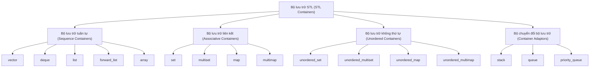
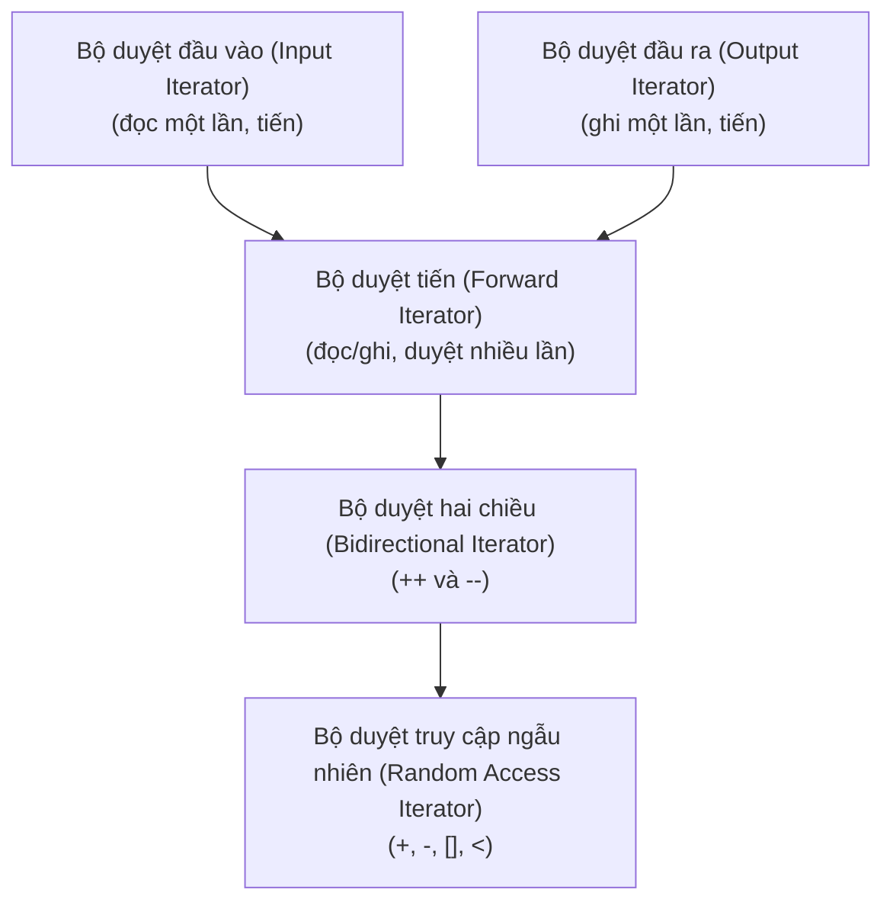
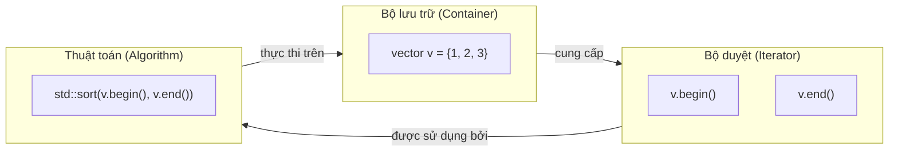

# Chương 9: Thư viện Khuôn mẫu Tiêu chuẩn (Standard Template Library - STL)

Thư viện Khuôn mẫu Tiêu chuẩn (Standard Template Library - STL) là một tập hợp mạnh mẽ các lớp khuôn mẫu và hàm trong C++, cung cấp các bộ lưu trữ tổng quát (generic containers), bộ duyệt (iterators), thuật toán (algorithms) và đối tượng hàm (functors). STL giúp tái sử dụng mã nguồn, tăng hiệu năng và làm cấu trúc chương trình trở nên rõ ràng hơn.

## Tổng quan (Overview)

STL được xây dựng dựa trên năm thành phần cơ bản:

- **Bộ lưu trữ (Containers)** – các cấu trúc dữ liệu lưu trữ tập hợp của các đối tượng.
- **Bộ duyệt (Iterators)** – các đối tượng hỗ trợ duyệt qua các phần tử bên trong bộ lưu trữ.
- **Thuật toán (Algorithms)** – các hàm thực thi các thao tác trên một phạm vi phần tử cụ thể.
- **Đối tượng hàm (Functors / Function Objects)** – các đối tượng hành xử giống như các hàm, thường được dùng kết hợp với thuật toán.
- **Bộ cấp phát (Allocators)** – các chính sách quản lý bộ nhớ (ít khi được sử dụng trực tiếp).

### Đảm bảo về độ phức tạp thuật toán (Complexity Guarantees)

Mỗi thao tác trong STL đều đi kèm với cam kết về độ phức tạp thời gian chạy, được biểu diễn bằng ký pháp Big O. Ví dụ:

| Bộ lưu trữ (Container) | Truy cập (Access) | Chèn vào giữa (Insertion (middle)) | Chèn vào cuối (Insertion (end)) | Tìm kiếm (Search) |
|---|---|---|---|---|
| `vector` | O(1) | O(n) | O(1)* | O(n) |
| `list` | O(n) | O(1) | O(1) | O(n) |
| `set` (cây cân bằng) | O(log n) | O(log n) | O(log n) | O(log n) |
| `unordered_set` (băm) | O(1) trung bình | O(1) trung bình | O(1) trung bình | O(1) trung bình |

*\*Thời gian hằng số khấu hao (Amortised constant time) (thỉnh thoảng có thể xảy ra việc tái cấp phát bộ nhớ).*

## Bộ lưu trữ (Containers)

Các bộ lưu trữ trong STL được chia làm nhiều danh mục khác nhau.

### Bộ lưu trữ tuần tự (Sequence Containers)

Lưu trữ các phần tử theo một thứ tự tuyến tính (linear order).

| Bộ lưu trữ (Container) | Mô tả (Description) |
|---|---|
| `vector` | Mảng động. Hỗ trợ truy cập ngẫu nhiên cực nhanh và chèn vào cuối với chi phí tối ưu. |
| `deque` | Hàng đợi hai đầu (double‑ended queue). Cho phép chèn/xóa cực nhanh ở cả hai đầu. |
| `list` | Danh sách liên kết kép (doubly‑linked list). Hỗ trợ chèn/xóa phần tử nhanh chóng tại bất kỳ vị trí nào. |
| `forward_list` | Danh sách liên kết đơn (singly‑linked list). Chi phí bộ nhớ thấp hơn so với `list`. |
| `array` (C++11) | Mảng kích thước cố định tích hợp giao diện chuẩn của STL. |

### Bộ lưu trữ liên kết (Associative Containers)

Lưu trữ các phần tử theo thứ tự được sắp xếp sẵn (thường dựa trên cấu trúc cây đỏ đen - red‑black trees).

| Bộ lưu trữ (Container) | Mô tả (Description) |
|---|---|
| `set` | Tập hợp các khóa duy nhất (unique keys) đã được sắp xếp. |
| `multiset` | Tập hợp các khóa đã được sắp xếp, cho phép trùng lặp khóa. |
| `map` | Tập hợp các cặp khóa-giá trị (key‑value pairs) duy nhất, được sắp xếp theo khóa. |
| `multimap` | Tập hợp các cặp khóa-giá trị, cho phép trùng lặp khóa. |

### Bộ lưu trữ không thứ tự (Unordered Containers) (C++11)

Lưu trữ các phần tử dựa trên cấu trúc bảng băm (hash tables). Các thao tác có thời gian xử lý trung bình là hằng số O(1).

| Bộ lưu trữ (Container) | Mô tả (Description) |
|---|---|
| `unordered_set` | Tập hợp các khóa duy nhất, sử dụng cơ chế băm. |
| `unordered_multiset` | Sử dụng cơ chế băm, cho phép trùng lặp khóa. |
| `unordered_map` | Các cặp khóa-giá trị duy nhất, sử dụng cơ chế băm. |
| `unordered_multimap` | Các cặp khóa-giá trị, cho phép trùng lặp khóa và băm. |

### Bộ chuyển đổi bộ lưu trữ (Container Adaptors)

Cung cấp giao diện hạn chế được xây dựng dựa trên các bộ lưu trữ nền tảng ở dưới.

| Bộ chuyển đổi (Adaptor) | Bộ lưu trữ nền tảng | Các thao tác chính |
|---|---|---|
| `stack` | `deque` (mặc định) | LIFO (Vào sau ra trước): `push`, `pop`, `top` |
| `queue` | `deque` | FIFO (Vào trước ra trước): `push`, `pop`, `front`, `back` |
| `priority_queue` | `vector` (mặc định) | Đống cực đại (Max‑heap): `push`, `pop`, `top` |

Sơ đồ dưới đây minh họa hệ thống cấp bậc của các bộ lưu trữ:



### Ví dụ – Cách sử dụng `vector` và `map`

```cpp
#include <iostream>
#include <vector>
#include <map>
#include <string>
#include <algorithm>

int main() {
    // Bộ lưu trữ tuần tự
    std::vector<int> numbers = {5, 2, 8, 1, 9};
    numbers.push_back(3);  // Thêm phần tử vào cuối
    std::sort(numbers.begin(), numbers.end()); // Sắp xếp tăng dần: 1, 2, 3, 5, 8, 9
    
    // Bộ lưu trữ liên kết
    std::map<std::string, int> ages;
    ages["Alice"] = 30;
    ages["Bob"] = 25;
    
    for (const auto& entry : ages) {
        std::cout << entry.first << ": " << entry.second << '\n';
    }
}
```

## Bộ duyệt (Iterators)

Bộ duyệt (Iterators) là cầu nối trung gian giữa bộ lưu trữ và thuật toán. Chúng cung cấp một cách thức thống nhất để duyệt qua các phần tử.

### Các phân loại bộ duyệt (Iterator Categories)

Mỗi phân loại bộ duyệt sẽ hỗ trợ một tập hợp các thao tác cụ thể.



| Phân loại | Các thao tác hỗ trợ | Ví dụ bộ lưu trữ |
|---|---|---|
| **Đầu vào (Input)** | `++`, `*` (đọc), `==`, `!=` | `istream_iterator` |
| **Đầu ra (Output)** | `++`, `*` (ghi) | `ostream_iterator` |
| **Tiến (Forward)** | Toàn bộ thao tác đầu vào + duyệt nhiều lần | `forward_list` |
| **Hai chiều (Bidirectional)** | Toàn bộ thao tác tiến + `--` | `list`, `set`, `map` |
| **Truy cập ngẫu nhiên (Random Access)** | Toàn bộ thao tác hai chiều + `+`, `-`, `[]`, `<` | `vector`, `deque`, `array` |

### Vô hiệu hóa bộ duyệt (Iterator Invalidation)

Một số thao tác sửa đổi dữ liệu có thể làm vô hiệu hóa các bộ duyệt hiện có. Điều này đặc biệt quan trọng khi làm việc với `vector`.

| Bộ lưu trữ | Thao tác thực thi | Tình trạng vô hiệu hóa bộ duyệt |
|---|---|---|
| `vector` | `push_back` | Vô hiệu hóa toàn bộ bộ duyệt nếu xảy ra hiện tượng tái cấp phát; nếu không thì chỉ vô hiệu hóa `end()` |
| `vector` | `insert` / `erase` ở giữa | Vô hiệu hóa toàn bộ bộ duyệt đứng sau vị trí chèn/xóa phần tử |
| `list` | `insert` / `erase` | Chỉ vô hiệu hóa bộ duyệt trỏ trực tiếp đến phần tử bị xóa |
| `set` / `map` | `insert` / `erase` | Chỉ vô hiệu hóa bộ duyệt trỏ đến phần tử bị xóa (không xảy ra băm lại) |
| `unordered_set` | `insert` / `erase` | Nếu xảy ra hiện tượng băm lại (rehash), toàn bộ bộ duyệt sẽ bị vô hiệu hóa |

**Ví dụ – Tránh vô hiệu hóa bộ duyệt trên `vector`**:

```cpp
std::vector<int> v = {1, 2, 3, 4, 5};
for (auto it = v.begin(); it != v.end(); ) {
    if (*it % 2 == 0)
        it = v.erase(it);   // Hàm erase trả về bộ duyệt hợp lệ tiếp theo
    else
        ++it;
}
```

### Bộ duyệt đảo (Reverse Iterators)

Bộ duyệt đảo (Reverse iterators) duyệt qua bộ lưu trữ theo chiều ngược lại thông qua phương thức `rbegin()` và `rend()`.

```cpp
std::vector<int> v = {1, 2, 3, 4, 5};
for (auto it = v.rbegin(); it != v.rend(); ++it) {
    std::cout << *it << ' '; // In ra: 5 4 3 2 1
}
```

Phương thức thành viên `base()` hỗ trợ chuyển đổi một bộ duyệt đảo về bộ duyệt tiến tương ứng.

## Các thuật toán phổ biến (`<algorithm>`)

Tiêu đề `<algorithm>` cung cấp hơn 100 thuật toán hoạt động trên các phạm vi bộ duyệt.

### Sắp xếp và Tìm kiếm (Sorting and Searching)

```cpp
#include <algorithm>
#include <vector>
#include <functional>

std::vector<int> v = {3, 1, 4, 1, 5, 9, 2};
std::sort(v.begin(), v.end());                    // Sắp xếp tăng dần
std::sort(v.begin(), v.end(), std::greater<int>()); // Sắp xếp giảm dần

bool exists = std::binary_search(v.begin(), v.end(), 5); // Yêu cầu phạm vi đã được sắp xếp
auto it = std::lower_bound(v.begin(), v.end(), 4);       // Phần tử đầu tiên >= 4
auto it2 = std::upper_bound(v.begin(), v.end(), 4);      // Phần tử đầu tiên > 4
```

### Phân vùng (Partitioning)

```cpp
auto pivot = std::partition(v.begin(), v.end(), 
                            [](int x) { return x % 2 == 0; });
// Các phần tử chẵn được xếp trước, biến pivot trỏ đến phần tử lẻ đầu tiên
```

### Thao tác trên Đống (Heap Operations)

```cpp
std::make_heap(v.begin(), v.end());
std::push_heap(v.begin(), v.end(), 7);
std::pop_heap(v.begin(), v.end()); // Di chuyển phần tử lớn nhất về cuối
v.pop_back();
```

### Giá trị nhỏ nhất/lớn nhất và Hoán vị

```cpp
int a = 5, b = 3;
int min_val = std::min(a, b);
int max_val = std::max(a, b);
auto [min_it, max_it] = std::minmax_element(v.begin(), v.end());

std::next_permutation(v.begin(), v.end()); // Hoán vị theo thứ tự từ điển tiếp theo
```

### Thuật toán số học (`<numeric>`)

```cpp
#include <numeric>
std::vector<int> v = {1, 2, 3, 4};
int sum = std::accumulate(v.begin(), v.end(), 0);        // Kết quả: 10
int product = std::accumulate(v.begin(), v.end(), 1, std::multiplies<int>()); // Kết quả: 24
std::partial_sum(v.begin(), v.end(), v.begin());        // Kết quả: 1, 3, 6, 10
```

## Đối tượng hàm (Functors / Function Objects)

Đối tượng hàm (Functor) là một đối tượng thuộc lớp có nạp chồng toán tử gọi hàm `operator()`. Chúng có thể được sử dụng thay thế cho con trỏ hàm trong các thuật toán và có ưu điểm là có khả năng lưu trữ trạng thái nội bộ.

### Các đối tượng hàm định nghĩa sẵn

Tiêu đề `<functional>` cung cấp nhiều đối tượng hàm tiện ích được thiết kế sẵn.

| Đối tượng hàm (Functor) | Phép toán thực thi |
|---|---|
| `std::plus<T>` | `a + b` |
| `std::minus<T>` | `a - b` |
| `std::multiplies<T>` | `a * b` |
| `std::divides<T>` | `a / b` |
| `std::greater<T>` | `a > b` |
| `std::less<T>` | `a < b` |
| `std::logical_and<T>` | `a && b` |

**Ví dụ**:

```cpp
std::vector<int> v = {3, 1, 4, 1, 5};
std::sort(v.begin(), v.end(), std::greater<int>()); // Sắp xếp giảm dần
```

### Biểu thức Lambda (Lambda Expressions) (C++11)

Biểu thức Lambda mang lại giải pháp ngắn gọn để khởi tạo trực tiếp các đối tượng hàm vô danh (anonymous function objects).

**Cú pháp cơ bản**: `[capture](parameters) -> return_type { body }`

- `capture` – mô tả cách thu nạp các biến nằm ngoài phạm vi hoạt động của Lambda.
- `parameters` – danh sách tham số đầu vào.
- `return_type` – kiểu dữ liệu trả về (tự động suy luận nếu lược bỏ).
- `body` – phần thân chứa logic thực thi của hàm.

**Các chế độ thu nạp (Capture modes)**:

| Cú pháp thu nạp | Tác động |
|---|---|
| `[]` | Không thu nạp bất kỳ biến nào |
| `[=]` | Thu nạp tất cả các biến theo giá trị (by value) |
| `[&]` | Thu nạp tất cả các biến theo tham chiếu (by reference) |
| `[x, &y]` | Thu nạp `x` theo giá trị, `y` theo tham chiếu |
| `[this]` | Thu nạp con trỏ `this` (theo giá trị) |

```cpp
std::vector<int> v = {1, 2, 3, 4, 5};
int factor = 3;
std::transform(v.begin(), v.end(), v.begin(),
               [factor](int x) { return x * factor; });
```

**Lambda có thể thay đổi (Mutable lambda)** – cho phép chỉnh sửa giá trị của các biến được thu nạp theo trị (tác động trên các bản sao cục bộ).

```cpp
int counter = 0;
auto inc = [counter]() mutable { return ++counter; };
inc(); // Kết quả: 1
inc(); // Kết quả: 2
// counter bên ngoài vẫn giữ nguyên giá trị ban đầu là 0
```

**Lambda tổng quát (Generic lambda)** (C++14): Sử dụng từ khóa `auto` cho các tham số.

```cpp
auto add = [](auto a, auto b) { return a + b; };
int i = add(3, 4);
double d = add(2.5, 1.5);
```

### `std::function` – Khái niệm xóa kiểu (Type Erasure) cho các thực thể có thể gọi

`std::function` có khả năng lưu trữ bất kỳ thực thể có thể gọi nào (như con trỏ hàm, functor, hoặc biểu thức lambda) có cùng chữ ký hàm (function signature).

```cpp
#include <functional>

void printInt(int x) { std::cout << x << '\n'; }

int main() {
    std::function<void(int)> f;
    
    f = printInt;           // Lưu trữ con trỏ hàm
    f(42);
    
    f = [](int x) { std::cout << x * 2 << '\n'; }; // Lưu trữ biểu thức lambda
    f(10); // In ra: 20
}
```

Mặc dù linh hoạt, `std::function` sẽ có một phần chi phí hiệu năng phát sinh do cơ chế xóa kiểu (type erasure). Đối với các phần mã nguồn yêu cầu tối ưu hóa tốc độ cực cao, hãy ưu tiên truyền trực tiếp khuôn mẫu hoặc biểu thức lambda.

## Con trỏ thông minh (Smart Pointers) (C++11)

Con trỏ thông minh giúp quản lý tự động vùng bộ nhớ được cấp phát động dựa theo triết lý RAII.

### `std::unique_ptr`

Cơ chế quản lý quyền sở hữu độc quyền (exclusive ownership). Không cho phép sao chép (copy), chỉ cho phép dịch chuyển (move).

```cpp
#include <memory>

std::unique_ptr<int> p1(new int(42));
std::unique_ptr<int> p2 = std::move(p1); // p1 bây giờ trở thành null

// Khuyến nghị sử dụng make_unique (C++14)
auto p3 = std::make_unique<int>(100);
```

Thường được sử dụng làm kiểu trả về cho các hàm nhà máy (factory functions) và quản lý các lớp cơ sở đa hình.

```cpp
class Base { public: virtual ~Base() = default; };
class Derived : public Base {};

std::unique_ptr<Base> create() {
    return std::make_unique<Derived>();
}
```

### `std::shared_ptr`

Cơ chế quyền sở hữu chia sẻ (shared ownership) hoạt động theo cơ chế đếm tham chiếu (reference counting). Đối tượng được quản lý sẽ tự động bị giải phóng khi con trỏ `shared_ptr` cuối cùng trỏ đến nó bị hủy.

```cpp
std::shared_ptr<int> sp1 = std::make_shared<int>(200);
std::shared_ptr<int> sp2 = sp1;   // Bộ đếm tham chiếu (reference count) = 2
sp1.reset();                      // Bộ đếm tham chiếu = 1
```

### `std::weak_ptr`

Là bộ quan sát không sở hữu tài nguyên trỏ đến từ `shared_ptr`. Thường được sử dụng để phá vỡ cấu trúc tham chiếu vòng (circular references).

```cpp
struct Node {
    std::shared_ptr<Node> next;
    std::weak_ptr<Node> prev;  // Phá vỡ tham chiếu vòng
};

std::shared_ptr<Node> n1 = std::make_shared<Node>();
std::shared_ptr<Node> n2 = std::make_shared<Node>();
n1->next = n2;
n2->prev = n1; // Không xảy ra tham chiếu vòng gây rò rỉ bộ nhớ
```

Để thao tác với đối tượng qua `weak_ptr`, bạn phải chuyển đổi nó thành `shared_ptr` bằng phương thức `lock()`:

```cpp
if (auto sp = weakPtr.lock()) {
    // Sử dụng sp một cách an toàn
} else {
    // Đối tượng đã bị hủy trước đó
}
```

### `std::make_unique` và `std::make_shared`

Các hàm này hỗ trợ khởi tạo con trỏ thông minh an toàn và tối ưu hiệu năng hơn (chỉ thực thi một lần cấp phát bộ nhớ duy nhất đối với `make_shared`).

```cpp
auto uptr = std::make_unique<MyClass>(arg1, arg2);
auto sptr = std::make_shared<MyClass>(arg1, arg2);
```

## Sơ đồ mối quan hệ giữa Bộ lưu trữ, Bộ duyệt và Thuật toán



## Bảng tổng kết các thành phần STL

| Thành phần | Mục đích chính | Ví dụ minh họa |
|---|---|---|
| **Bộ lưu trữ (Container)** | Lưu trữ dữ liệu | `std::vector<int>` |
| **Bộ duyệt (Iterator)** | Duyệt qua các phần tử | `v.begin()` |
| **Thuật toán (Algorithm)** | Xử lý phạm vi phần tử | `std::sort(v.begin(), v.end())` |
| **Đối tượng hàm (Functor)** | Tự biến đổi hành vi thuật toán | `std::greater<int>()` |
| **Lambda** | Đối tượng hàm khai báo trực tiếp | `[](int x){ return x > 0; }` |
| **`std::function`** | Lưu trữ thực thể có thể gọi xóa kiểu | Lưu trữ bất kỳ thực thể có thể gọi nào |
| **Con trỏ thông minh (Smart pointer)** | Quản lý bộ nhớ tự động | `std::unique_ptr<Widget>` |
| **Bộ cấp phát (Allocator)** | Cấp phát bộ nhớ cấp thấp | Cấp phát mặc định `std::allocator` |

STL là nền tảng cốt lõi của lập trình C++ hiện đại. Làm chủ các kiến thức này giúp bạn viết mã nguồn súc tích, tối ưu hiệu năng và an toàn cao. Để đi sâu hơn, hãy tìm hiểu tài liệu chi tiết của từng loại bộ lưu trữ và thuật toán, đồng thời luôn lưu ý về cam kết độ phức tạp thuật toán khi lựa chọn cấu trúc dữ liệu.
