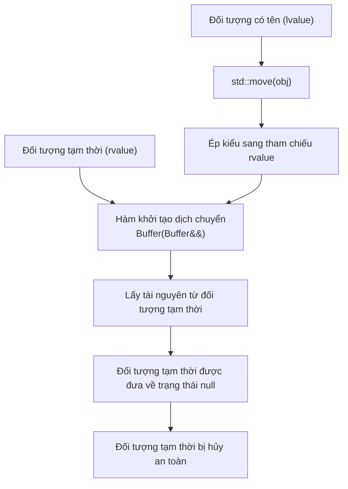
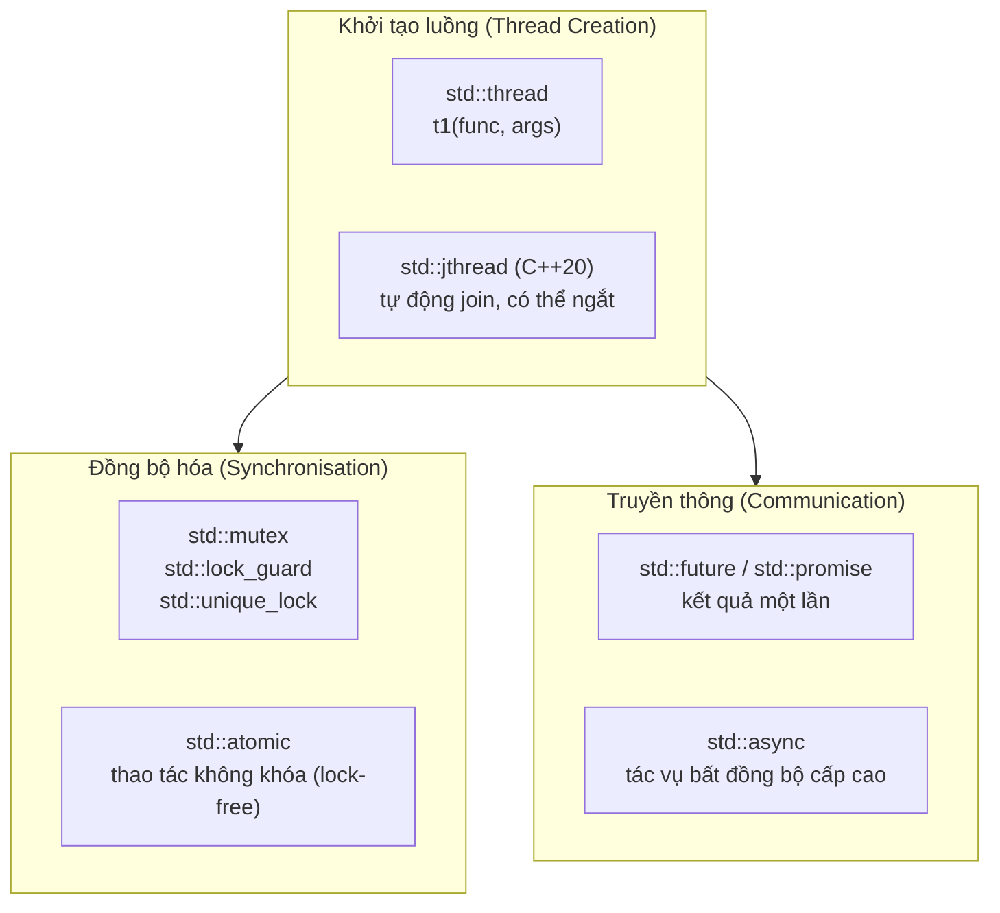

# Chương 10: Các tính năng C++ nâng cao (Advanced C++ Features)

Chương này trình bày các tính năng được giới thiệu từ chuẩn C++11 trở đi, giúp lập trình C++ hiện đại, hiệu quả và rõ ràng hơn: cơ chế dịch chuyển (move semantics), chuyển tiếp hoàn hảo (perfect forwarding), đặc tính kiểu (type traits), hằng tự định nghĩa (user‑defined literals) và lập trình đồng thời cơ bản (basic concurrency).

## Cơ chế dịch chuyển và Chuyển tiếp hoàn hảo (Move Semantics and Perfect Forwarding)

Cơ chế dịch chuyển (Move semantics) loại bỏ các thao tác sao chép không cần thiết bằng cách chuyển giao quyền sở hữu tài nguyên trực tiếp từ đối tượng này sang đối tượng khác. Cơ chế này cực kỳ hữu ích cho các kiểu dữ liệu quản lý bộ nhớ Heap, tệp tin (file handles), hoặc bất kỳ tài nguyên đắt đỏ nào khác khi sao chép.

### Tham chiếu trị trái và trị phải (`&&`) (Lvalue and Rvalue References)

- **Trị trái (Lvalue)** – một biểu thức có địa chỉ bộ nhớ xác định và có thể nhận dạng (ví dụ: biến, con trỏ giải tham chiếu `*ptr`, phần tử mảng `a[0]`).
- **Trị phải (Rvalue)** – một biểu thức tạm thời không có địa chỉ bộ nhớ cố định (ví dụ: hằng số `42`, kết quả phép toán `a + b`, hoặc hàm chuyển đổi `std::move(x)`).
- **Tham chiếu trị trái (`&`) (Lvalue reference)** – liên kết với các trị trái (lvalues).
- **Tham chiếu trị phải (`&&`) (Rvalue reference)** – liên kết với các trị phải (rvalues - các đối tượng tạm thời).

```cpp
int a = 5;          // a là trị trái (lvalue)
int& ref = a;       // tham chiếu trị trái (lvalue reference)
int&& rref = 42;    // tham chiếu trị phải (rvalue reference) liên kết với đối tượng tạm thời
```

Một hàm nạp chồng đồng thời cả tham chiếu trị trái và tham chiếu trị phải sẽ giúp chương trình tự phân biệt chính xác giữa thao tác sao chép (copy) và dịch chuyển (move).

### Hàm khởi tạo dịch chuyển và Toán tử gán dịch chuyển (Move Constructor and Move Assignment Operator)

Hàm khởi tạo dịch chuyển và toán tử gán dịch chuyển thực hiện chuyển giao trực tiếp tài nguyên thay vì sao chép sâu. Chúng thường đưa đối tượng nguồn về một trạng thái hợp lệ nhưng không xác định giá trị cụ thể (thường là gán về null).

```cpp
class Buffer {
    int* data;
    size_t size;
public:
    // Hàm khởi tạo thông thường
    Buffer(size_t sz) : size(sz), data(new int[sz]) {}
    
    // Hàm hủy
    ~Buffer() { delete[] data; }
    
    // Hàm khởi tạo sao chép (sao chép sâu - deep copy)
    Buffer(const Buffer& other) : size(other.size), data(new int[other.size]) {
        std::copy(other.data, other.data + size, data);
    }
    
    // Hàm khởi tạo dịch chuyển
    Buffer(Buffer&& other) noexcept 
        : data(other.data), size(other.size) {
        other.data = nullptr;
        other.size = 0;
    }
    
    // Toán tử gán dịch chuyển
    Buffer& operator=(Buffer&& other) noexcept {
        if (this != &other) {
            delete[] data;
            data = other.data;
            size = other.size;
            other.data = nullptr;
            other.size = 0;
        }
        return *this;
    }
};
```

Chỉ định `noexcept` giúp trình biên dịch thực thi các tối ưu hóa quan trọng (ví dụ: `std::vector` sẽ chỉ ưu tiên dùng dịch chuyển nếu thao tác dịch chuyển được khai báo `noexcept`).

### Quy tắc năm thành phần (Rule of Five)

Nếu một lớp chịu trách nhiệm tự quản lý tài nguyên, bạn cần cung cấp đầy đủ năm hàm thành viên đặc biệt sau:

| Hàm thành viên | Mục đích thực hiện |
|---|---|
| **Hàm hủy (Destructor)** | Giải phóng tài nguyên |
| **Hàm khởi tạo sao chép (Copy constructor)** | Sao bản tài nguyên sang đối tượng mới |
| **Toán tử gán sao chép (Copy assignment)** | Sao bản tài nguyên sang đối tượng hiện có |
| **Hàm khởi tạo dịch chuyển (Move constructor)** | Chuyển giao tài nguyên sang đối tượng mới |
| **Toán tử gán dịch chuyển (Move assignment)** | Chuyển giao tài nguyên sang đối tượng hiện có |

Ngược lại, **Quy tắc không thành phần (Rule of Zero)** khuyên bạn nên cố gắng thiết kế lớp tránh phải tự viết bất kỳ hàm nào ở trên – bằng cách sử dụng các bộ chứa RAII tiêu chuẩn như `std::vector`, `std::string`, hoặc các con trỏ thông minh (smart pointers).

### Cú pháp `std::move` và `std::forward`

- `std::move` – thực hiện ép kiểu đối số truyền vào thành một tham chiếu trị phải một cách vô điều kiện, kích hoạt cơ chế dịch chuyển.
- `std::forward` – thực hiện chuyển tiếp có điều kiện các đối số, giữ nguyên phân loại trị (value category) gốc của chúng (trị trái hoặc trị phải).

```cpp
std::vector<int> v1 = {1, 2, 3};
std::vector<int> v2 = std::move(v1);  // v1 bây giờ trở thành rỗng

template<typename T>
void wrapper(T&& arg) {
    // Chuyển tiếp arg dưới dạng trị trái hoặc trị phải tương ứng
    target(std::forward<T>(arg));
}
```

Bản thân `std::move` không tự dịch chuyển bất cứ thứ gì – nó thực chất chỉ là một phép ép kiểu (cast). Quá trình dịch chuyển thực tế sẽ diễn ra bên trong hàm khởi tạo hoặc toán tử gán nhận tham chiếu trị phải đó.

### Cơ chế sao chép và hoán đổi (Copy-and-Swap Idiom) (Xem lại)

Cơ chế sao chép và hoán đổi (Copy-and-swap) mang lại sự đảm bảo an toàn ngoại lệ mạnh mẽ (strong exception safety) cho các toán tử gán, đồng thời hỗ trợ tự nhiên cơ chế dịch chuyển khi kết hợp truyền tham số theo trị (pass-by-value).

```cpp
class String {
    char* data;
public:
    // ... các hàm khởi tạo, hàm hủy
    
    void swap(String& other) noexcept {
        std::swap(data, other.data);
    }
    
    // Toán tử gán hợp nhất: sao chép và hoán đổi
    String& operator=(String other) { // Truyền bằng trị (kích hoạt sao chép hoặc dịch chuyển)
        swap(other);   // Hoán đổi không thể ném ngoại lệ
        return *this;
    }
};
```

Nếu đối hạng bên phải là một trị trái (lvalue), tham số `other` sẽ được tạo ra bằng hàm khởi tạo sao chép. Nếu là một trị phải (rvalue), `other` sẽ được tạo ra bằng hàm khởi tạo dịch chuyển.

Sơ đồ dưới đây tổng kết luồng hoạt động của cơ chế dịch chuyển:



## Đặc tính kiểu và Tiêu đề `<type_traits>` (Type Traits and the `<type_traits>` Header)

Đặc tính kiểu (Type traits) cung cấp các thông tin hữu ích về kiểu dữ liệu tại thời điểm biên dịch. Chúng thường được ứng dụng trong siêu lập trình khuôn mẫu (template metaprogramming), cơ chế SFINAE, và câu lệnh `static_assert`.

### Các đặc tính kiểu phổ biến (Common Type Traits)

| Đặc tính kiểu (Trait) | Mô tả (Description) |
|---|---|
| `std::is_integral<T>` | Đúng nếu T là kiểu số nguyên (int, char, v.v.) |
| `std::is_floating_point<T>` | Đúng nếu T là kiểu số thực dấu phẩy động (float, double) |
| `std::is_class<T>` | Đúng nếu T là một lớp (class) hoặc cấu trúc (struct) |
| `std::is_pointer<T>` | Đúng nếu T là một con trỏ |
| `std::is_reference<T>` | Đúng nếu T là một tham chiếu |
| `std::is_same<T, U>` | Đúng nếu T và U có cùng một kiểu dữ liệu |
| `std::enable_if<B, T>` | Nếu B đúng, định nghĩa kiểu T; ngược lại gây lỗi thay thế |

```cpp
#include <type_traits>
#include <iostream>

template<typename T>
void printInteger(T x) {
    static_assert(std::is_integral<T>::value, "T must be integral");
    std::cout << x << '\n';
}
```

### Cơ chế SFINAE (Substitution Failure Is Not An Error)

SFINAE (Sự thất bại thay thế không phải là một lỗi) là một nguyên lý hoạt ứng dụng khi biên dịch: một khuôn mẫu ứng viên sẽ bị loại khỏi tập hợp nạp chồng hàm nếu việc thay thế các tham số khuôn mẫu dẫn đến mã nguồn không hợp lệ, thay vì phát sinh lỗi biên dịch ngay lập tức. Tính năng này giúp bật/tắt có điều kiện các hàm quá tải.

**Ví dụ – Sử dụng `enable_if`**:

```cpp
// Chỉ kích hoạt hàm này cho các kiểu số nguyên
template<typename T>
typename std::enable_if<std::is_integral<T>::value, T>::type
half(T value) {
    return value / 2;
}

// Chỉ kích hoạt hàm này cho các kiểu số thực
template<typename T>
typename std::enable_if<std::is_floating_point<T>::value, T>::type
half(T value) {
    return value / 2.0;
}
```

Từ chuẩn C++17 trở đi, câu lệnh điều kiện tại thời điểm biên dịch `if constexpr` được giới thiệu giúp đơn giản hóa đáng kể cấu trúc mã nguồn thay cho SFINAE trong nhiều tình huống:

```cpp
template<typename T>
auto half(T value) {
    if constexpr (std::is_integral<T>::value) {
        return value / 2;
    } else {
        return value / 2.0;
    }
}
```

### Suy luận kiểu với `decltype` và `auto` (decltype and auto Type Deduction)

- `auto` – tự động suy luận kiểu dữ liệu của một biến dựa trên giá trị khởi tạo của nó.
- `decltype(expr)` – trả về kiểu dữ liệu của một biểu thức mà không cần tính toán giá trị của biểu thức đó.

```cpp
int x = 5;
auto y = x;       // y có kiểu int
decltype(x) z = x; // z có kiểu int

// decltype giữ nguyên tính chất tham chiếu và thuộc tính const
const int& cr = x;
auto a = cr;      // a có kiểu int (bỏ thuộc tính const và tham chiếu)
decltype(cr) b = x; // b có kiểu const int&
```

**Kiểu trả về muộn (Trailing return type)** (C++11) cho phép kiểu trả về của một hàm phụ thuộc vào kiểu dữ liệu của các tham số truyền vào:

```cpp
template<typename T, typename U>
auto add(T t, U u) -> decltype(t + u) {
    return t + u;
}
```

Trong C++14, bạn có thể lược bỏ kiểu trả về muộn nếu phần thân hàm chỉ trả về một biểu thức đơn nhất:

```cpp
template<typename T, typename U>
auto add(T t, U u) {
    return t + u;   // Tự động suy luận kiểu trả về của hàm
}
```

## Hằng tự định nghĩa (User‑Defined Literals)

Hằng tự định nghĩa (UDLs - User-defined literals) cho phép định nghĩa các hậu tố (suffixes) tùy chỉnh cho các hằng số hoặc chuỗi ký tự bằng cách định nghĩa toán tử đặc biệt `operator"" X`.

### Cú pháp cơ bản

```cpp
ReturnType operator"" _suffix(unsigned long long);
ReturnType operator"" _suffix(long double);
ReturnType operator"" _suffix(const char*, size_t); // dành cho hằng chuỗi ký tự
```

### Ví dụ minh họa

```cpp
#include <chrono>
#include <string>

// Hằng tự định nghĩa cho kiểu std::chrono::seconds
std::chrono::seconds operator"" _s(unsigned long long val) {
    return std::chrono::seconds(val);
}

// Hằng tự định nghĩa cho kiểu std::string
std::string operator"" _s(const char* str, size_t len) {
    return std::string(str, len);
}

// Cách sử dụng
auto duration = 10_s;   // Trả về kiểu std::chrono::seconds
std::string greeting = "Hello"_s;
```

**Lưu ý**: Các hậu tố tự định nghĩa bắt buộc phải bắt đầu bằng ký tự dấu gạch dưới (`_`) để tránh xung đột tên gọi với các hằng số chuẩn được cập nhật trong tương lai.

## Lập trình đồng thời cơ bản (Concurrency Basics) (C++11 trở về sau)

C++ cung cấp một mô hình bộ nhớ (memory model) và một thư viện hỗ trợ luồng (thread support library) giúp viết mã đa luồng hoạt động độc lập trên nhiều nền tảng phần cứng khác nhau.

### Lớp quản lý luồng `std::thread`

Hỗ trợ khởi tạo và kiểm soát một luồng thực thi độc lập.

```cpp
#include <thread>
#include <iostream>

void worker(int id) {
    std::cout << "Thread " << id << " running\n";
}

int main() {
    std::thread t1(worker, 1);
    std::thread t2(worker, 2);
    
    t1.join(); // Đợi luồng t1 hoàn thành thực thi
    t2.join(); // Đợi luồng t2 hoàn thành thực thi
}
```

- `join()` – chặn luồng hiện tại cho tới khi luồng được gọi hoàn thành công việc của nó.
- `detach()` – tách luồng để nó chạy nền độc lập hoàn toàn (cần cực kỳ cẩn trọng với vòng đời tài nguyên).

### Lớp quản lý luồng tự động `std::jthread` (C++20)

`std::jthread` mang lại cải tiến vượt trội so với `std::thread` nhờ cơ chế tự động gọi `join()` khi đối tượng bị hủy (destructed) và hỗ trợ cơ chế ngắt hợp tác (cooperative interruption).

```cpp
#include <thread>
#include <chrono>

void sleeper(std::stop_token stoken) {
    while (!stoken.stop_requested()) {
        std::this_thread::sleep_for(std::chrono::milliseconds(100));
    }
}

int main() {
    std::jthread t(sleeper);  // Tự động gọi join() khi kết thúc khối lệnh chứa nó
    // ... luồng t sẽ tự động được gửi yêu cầu dừng và join khi ra khỏi phạm vi hoạt động
}
```

### Cơ chế loại trừ tương hỗ – `std::mutex`, `std::lock_guard`, `std::unique_lock`

Bảo vệ dữ liệu chia sẻ tránh khỏi việc truy cập đồng thời từ nhiều luồng khác nhau.

```cpp
#include <mutex>
#include <thread>
#include <vector>

std::mutex mtx;
int counter = 0;

void increment() {
    for (int i = 0; i < 100000; ++i) {
        std::lock_guard<std::mutex> lock(mtx);
        ++counter;
    }
}

int main() {
    std::thread t1(increment), t2(increment);
    t1.join(); t2.join();
    // Đảm bảo counter == 200000 (không xảy ra lỗi tranh chấp dữ liệu - data race)
}
```

- `std::lock_guard` – bộ khóa RAII cơ bản không cho phép sao chép, tự động mở khóa mutex khi ra khỏi phạm vi khối lệnh.
- `std::unique_lock` – linh hoạt hơn `lock_guard` (cho phép trì hoãn khóa, khóa có giới hạn thời gian, hoặc chủ động mở khóa trước hạn).

### Lớp bất đồng bộ `std::async` cùng cặp `std::future` / `std::promise`

`std::async` thực thi một hàm một cách bất đồng bộ và trả về một đối tượng `std::future` chứa kết quả của hàm đó khi hoàn thành.

```cpp
#include <future>
#include <iostream>

int compute(int x) {
    return x * x;
}

int main() {
    std::future<int> result = std::async(std::launch::async, compute, 5);
    std::cout << result.get() << '\n'; // In ra: 25 (chặn luồng cho tới khi kết quả sẵn sàng)
}
```

`std::promise` cho phép thiết lập thủ công một giá trị mà sau đó có thể được truy xuất thông qua đối tượng `std::future` tương ứng.

```cpp
std::promise<int> prom;
std::future<int> fut = prom.get_future();

std::thread t([&prom] {
    prom.set_value(42);
});

std::cout << fut.get() << '\n';
t.join();
```

### Các kiểu dữ liệu nguyên tử (`std::atomic`)

Các kiểu dữ liệu nguyên tử cung cấp các thao tác không khóa (lock-free) hoặc an toàn đồng thời trên các biến được chia sẻ giữa nhiều luồng.

```cpp
#include <atomic>

std::atomic<int> counter = 0;

void increment() {
    for (int i = 0; i < 100000; ++i) {
        ++counter; // Phép cộng nguyên tử (atomic increment)
    }
}
```

Các thao tác nguyên tử phổ biến bao gồm: `load()`, `store()`, `exchange()`, và các biến thể `compare_exchange_weak/strong`.

## Sơ đồ tổng quan về Lập trình đồng thời trong C++



## Bảng tổng kết các tính năng nâng cao

| Tính năng | Mục đích chính | Thực hành tốt nhất |
|---|---|---|
| **Cơ chế dịch chuyển** | Loại bỏ sao chép đắt đỏ | Khai báo các thao tác dịch chuyển là `noexcept` |
| **Chuyển tiếp hoàn hảo** | Giữ nguyên phân loại trị | Sử dụng `std::forward<T>` trong khuôn mẫu |
| **Đặc tính kiểu** | Kiểm tra kiểu khi biên dịch | Kết hợp với `if constexpr` hoặc `enable_if` |
| **SFINAE** | Bật/tắt khuôn mẫu có điều kiện | Ưu tiên dùng `if constexpr` (C++17) khi có thể |
| **`decltype`/`auto`** | Tự động suy luận kiểu | Dùng `auto` cho biến, `decltype` cho kiểu của biểu thức |
| **Hằng tự định nghĩa** | Hậu tố hằng số tự chọn | Luôn bắt đầu hậu tố bằng dấu gạch dưới (`_s`) |
| **`std::thread`** | Quản lý luồng cấp thấp | Nên sử dụng `std::jthread` (C++20) hoặc bao bọc RAII |
| **`std::async`** | Thực thi tác vụ bất đồng bộ | Thích hợp cho các tác vụ cần lấy kết quả sau đó |
| **`std::mutex`** | Bảo vệ vùng dữ liệu chung | Luôn đi kèm với `std::lock_guard`/`std::unique_lock` |
| **`std::atomic`** | Chia sẻ biến không cần khóa | Phù hợp cho các bộ đếm hoặc cờ trạng thái đơn giản |

Những tính năng nâng cao này tạo nên sự khác biệt cốt lõi giữa C++ hiện đại và các chuẩn C++ cũ trước đây. Làm chủ cơ chế dịch chuyển và lập trình đồng thời là chìa khóa để xây dựng các phần mềm hiệu năng cao, tối ưu hóa tài nguyên phần cứng tối đa.
