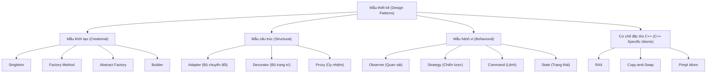

# Chương 11: Mẫu thiết kế trong C++ (Design Patterns in C++) (Tổng quan)

Mẫu thiết kế (Design patterns) là các giải pháp có thể tái sử dụng cho các vấn đề thường xuyên xảy ra trong thiết kế phần mềm. Chúng không phải là mã nguồn hoàn chỉnh mà là các khuôn mẫu thiết kế có thể điều chỉnh để thích ứng với các tình huống cụ thể. Chương này cung cấp một cái nhìn tổng quan về các mẫu thiết kế cốt lõi được triển khai cụ thể trong ngôn ngữ C++.

## Mẫu khởi tạo (Creational Patterns)

Các mẫu khởi tạo (Creational patterns) trừu tượng hóa quá trình khởi tạo đối tượng, giúp hệ thống hoạt động độc lập với cách thức các đối tượng được tạo ra.

### Singleton

Mẫu Singleton đảm bảo rằng một lớp chỉ có duy nhất một thực thể (instance) hoạt động và cung cấp một điểm truy cập toàn cục duy nhất đến thực thể đó.

**Mẫu Singleton an toàn đa luồng (Thread‑safe Singleton) (C++11 trở về sau)** – Chuẩn C++11 đảm bảo rằng các biến tĩnh cục bộ (static local variables) được khởi tạo một cách an toàn đa luồng (được gọi là cơ chế biến tĩnh ma thuật - magic statics).

```cpp
class Singleton {
private:
    Singleton() = default;  // Hàm khởi tạo private
    ~Singleton() = default;
    
    // Vô hiệu hóa sao chép và dịch chuyển
    Singleton(const Singleton&) = delete;
    Singleton& operator=(const Singleton&) = delete;
    Singleton(Singleton&&) = delete;
    Singleton& operator=(Singleton&&) = delete;

public:
    static Singleton& getInstance() {
        static Singleton instance;  // Khởi tạo an toàn đa luồng (C++11)
        return instance;
    }
    
    void doSomething() const {
        // ...
    }
};

// Cách sử dụng
Singleton::getInstance().doSomething();
```

**Giải pháp thay thế (Meyers Singleton)** – Phiên bản triển khai ở trên chính là Meyers Singleton. Đối với cơ chế khởi tạo lười (lazy initialization) cần kiểm soát tường minh hơn, bạn có thể ứng dụng hàm `std::call_once`.

```cpp
#include <mutex>
#include <memory>

class SingletonWithCallOnce {
    static std::unique_ptr<SingletonWithCallOnce> instance;
    static std::once_flag initFlag;
    
    SingletonWithCallOnce() = default;
    
public:
    static SingletonWithCallOnce& getInstance() {
        std::call_once(initFlag, []() {
            instance.reset(new SingletonWithCallOnce);
        });
        return *instance;
    }
};
```

### Phương thức nhà máy (Factory Method)

Mẫu Phương thức nhà máy (Factory Method) định nghĩa một giao diện chịu trách nhiệm khởi tạo một đối tượng, nhưng để các lớp con tự quyết định xem lớp cụ thể nào sẽ được khởi tạo.

```cpp
#include <string>
#include <memory>

class Product {
public:
    virtual ~Product() = default;
    virtual std::string operation() const = 0;
};

class ConcreteProductA : public Product {
public:
    std::string operation() const override { return "Result of Product A"; }
};

class ConcreteProductB : public Product {
public:
    std::string operation() const override { return "Result of Product B"; }
};

class Creator {
public:
    virtual ~Creator() = default;
    virtual std::unique_ptr<Product> factoryMethod() const = 0;
};

class ConcreteCreatorA : public Creator {
public:
    std::unique_ptr<Product> factoryMethod() const override {
        return std::make_unique<ConcreteProductA>();
    }
};

class ConcreteCreatorB : public Creator {
public:
    std::unique_ptr<Product> factoryMethod() const override {
        return std::make_unique<ConcreteProductB>();
    }
};

// Cách sử dụng
std::unique_ptr<Creator> creator = std::make_unique<ConcreteCreatorA>();
std::unique_ptr<Product> product = creator->factoryMethod();
```

### Nhà máy trừu tượng (Abstract Factory)

Mẫu Nhà máy trừu tượng (Abstract Factory) cung cấp một giao diện thiết kế chịu trách nhiệm tạo ra các nhóm đối tượng liên quan hoặc phụ thuộc lẫn nhau mà không cần chỉ rõ các lớp cụ thể của chúng.

```cpp
#include <memory>

// Các sản phẩm trừu tượng
class Button { public: virtual void paint() = 0; virtual ~Button() = default; };
class Checkbox { public: virtual void check() = 0; virtual ~Checkbox() = default; };

// Các sản phẩm cụ thể cho Windows
class WinButton : public Button { public: void paint() override { /* Vẽ kiểu Windows */ } };
class WinCheckbox : public Checkbox { public: void check() override { /* Chọn kiểu Windows */ } };

// Các sản phẩm cụ thể cho Mac
class MacButton : public Button { public: void paint() override { /* Vẽ kiểu Mac */ } };
class MacCheckbox : public Checkbox { public: void check() override { /* Chọn kiểu Mac */ } };

// Nhà máy trừu tượng
class GUIFactory {
public:
    virtual std::unique_ptr<Button> createButton() = 0;
    virtual std::unique_ptr<Checkbox> createCheckbox() = 0;
    virtual ~GUIFactory() = default;
};

class WinFactory : public GUIFactory {
public:
    std::unique_ptr<Button> createButton() override { return std::make_unique<WinButton>(); }
    std::unique_ptr<Checkbox> createCheckbox() override { return std::make_unique<WinCheckbox>(); }
};

class MacFactory : public GUIFactory {
public:
    std::unique_ptr<Button> createButton() override { return std::make_unique<MacButton>(); }
    std::unique_ptr<Checkbox> createCheckbox() override { return std::make_unique<MacCheckbox>(); }
};
```

### Builder (Người xây dựng)

Mẫu Builder tách biệt quá trình xây dựng một đối tượng phức tạp ra khỏi biểu diễn của nó, cho phép cùng một quá trình xây dựng có thể tạo ra các biểu diễn khác nhau.

```cpp
#include <string>
#include <memory>

class Product {
public:
    void setPartA(const std::string& a) { partA = a; }
    void setPartB(const std::string& b) { partB = b; }
    void setPartC(const std::string& c) { partC = c; }
    void show() const { /* ... */ }
private:
    std::string partA, partB, partC;
};

class Builder {
public:
    virtual ~Builder() = default;
    virtual void buildPartA() = 0;
    virtual void buildPartB() = 0;
    virtual void buildPartC() = 0;
    virtual Product getResult() = 0;
};

class ConcreteBuilder : public Builder {
    Product product;
public:
    void buildPartA() override { product.setPartA("A"); }
    void buildPartB() override { product.setPartB("B"); }
    void buildPartC() override { product.setPartC("C"); }
    Product getResult() override { return std::move(product); }
};

class Director {
    Builder* builder;
public:
    void setBuilder(Builder* b) { builder = b; }
    Product construct() {
        builder->buildPartA();
        builder->buildPartB();
        builder->buildPartC();
        return builder->getResult();
    }
};
```

## Mẫu cấu trúc (Structural Patterns)

Mẫu cấu trúc (Structural patterns) giải quyết vấn đề cấu thành đối tượng và tạo lập các cấu trúc lớn hơn từ các bộ phận đơn lẻ.

### Adapter (Bộ chuyển đổi) (Sử dụng Kế thừa và Thành phần)

Mẫu Adapter chuyển đổi giao diện của một lớp thành một giao diện khác mà khách hàng (clients) mong đợi.

**Bộ chuyển đổi lớp (Class Adapter) (Sử dụng kế thừa)** – kế thừa đồng thời cả giao diện đích (target interface) và lớp cần chuyển đổi (adaptee).

```cpp
// Lớp hiện có với giao diện khác biệt
class LegacyRectangle {
public:
    void draw(int x1, int y1, int x2, int y2) const {
        // Vẽ kiểu cũ
    }
};

// Giao diện đích mong muốn
class Shape {
public:
    virtual void draw(int x, int y, int width, int height) const = 0;
    virtual ~Shape() = default;
};

// Bộ chuyển đổi sử dụng đa kế thừa
class RectangleAdapter : public Shape, private LegacyRectangle {
public:
    void draw(int x, int y, int width, int height) const override {
        LegacyRectangle::draw(x, y, x + width, y + height);
    }
};
```

**Bộ chuyển đổi đối tượng (Object Adapter) (Sử dụng thành phần - composition)** – chứa một thực thể của lớp cần chuyển đổi.

```cpp
class RectangleAdapterObject : public Shape {
    LegacyRectangle adaptee;
public:
    void draw(int x, int y, int width, int height) const override {
        adaptee.draw(x, y, x + width, y + height);
    }
};
```

### Decorator (Bộ trang trí)

Mẫu Decorator gán thêm các trách nhiệm mới cho một đối tượng một cách động. Triển khai trong C++ thường kết hợp cả cơ chế kế thừa và thành phần.

```cpp
#include <string>
#include <memory>

class Component {
public:
    virtual std::string operation() const = 0;
    virtual ~Component() = default;
};

class ConcreteComponent : public Component {
public:
    std::string operation() const override { return "ConcreteComponent"; }
};

class Decorator : public Component {
protected:
    std::unique_ptr<Component> component;
public:
    Decorator(std::unique_ptr<Component> comp) : component(std::move(comp)) {}
    std::string operation() const override { return component->operation(); }
};

class ConcreteDecoratorA : public Decorator {
public:
    ConcreteDecoratorA(std::unique_ptr<Component> comp) : Decorator(std::move(comp)) {}
    std::string operation() const override {
        return "DecoratorA(" + Decorator::operation() + ")";
    }
};

class ConcreteDecoratorB : public Decorator {
public:
    ConcreteDecoratorB(std::unique_ptr<Component> comp) : Decorator(std::move(comp)) {}
    std::string operation() const override {
        return "DecoratorB(" + Decorator::operation() + ")";
    }
};

// Cách sử dụng
auto comp = std::make_unique<ConcreteComponent>();
auto decorated = std::make_unique<ConcreteDecoratorA>(std::make_unique<ConcreteDecoratorB>(std::move(comp)));
// decorated->operation() trả về: "DecoratorA(DecoratorB(ConcreteComponent))"
```

### Proxy (Ủy nhiệm)

Mẫu Proxy cung cấp một đối tượng đại diện hoặc thay thế cho một đối tượng khác để kiểm soát quyền truy cập, khởi tạo lười, ghi nhật ký (logging), lưu bộ nhớ đệm (caching), v.v.

```cpp
#include <memory>

class Subject {
public:
    virtual void request() const = 0;
    virtual ~Subject() = default;
};

class RealSubject : public Subject {
public:
    void request() const override { /* Thao tác tốn tài nguyên */ }
};

class Proxy : public Subject {
    mutable std::unique_ptr<RealSubject> realSubject;
public:
    void request() const override {
        if (!realSubject) {
            realSubject = std::make_unique<RealSubject>();
        }
        realSubject->request();
    }
};
```

## Mẫu hành vi (Behavioural Patterns)

Mẫu hành vi (Behavioural patterns) tập trung vào các thuật toán và việc phân bổ trách nhiệm giữa các đối tượng.

### Observer (Quan sát) (Sử dụng hàm gọi ngược `std::function`)

Mẫu Observer định nghĩa một mối quan hệ phụ thuộc một-nhiều giữa các đối tượng, sao cho khi một đối tượng thay đổi trạng thái, tất cả các đối tượng phụ thuộc của nó sẽ tự động nhận được thông báo. Triển khai trong C++ hiện đại có thể sử dụng `std::function` để lưu trữ các hàm gọi ngược (callbacks) linh hoạt.

```cpp
#include <functional>
#include <vector>
#include <iostream>
#include <memory>
#include <algorithm>

class Subject {
    std::vector<std::function<void(int)>> observers;
public:
    void attach(std::function<void(int)> observer) {
        observers.push_back(std::move(observer));
    }
    
    void notify(int value) {
        for (const auto& obs : observers) {
            obs(value);
        }
    }
};

// Cách sử dụng
Subject subject;
subject.attach([](int x) { std::cout << "Observer A: " << x << '\n'; });
subject.attach([](int x) { std::cout << "Observer B: " << x * 2 << '\n'; });
subject.notify(42);
```

Đối với các hệ thống yêu cầu cấu trúc chặt chẽ hơn, bạn có thể triển khai mẫu này theo cách cổ điển:

```cpp
class IObserver {
public:
    virtual void update(int message) = 0;
    virtual ~IObserver() = default;
};

class SubjectClassic {
    std::vector<std::weak_ptr<IObserver>> observers;
public:
    void addObserver(std::shared_ptr<IObserver> obs) {
        observers.push_back(obs);
    }
    void notify(int msg) {
        // Dọn dẹp các con trỏ weak_ptr đã hết hạn (expired) trước khi gửi thông báo
        observers.erase(std::remove_if(observers.begin(), observers.end(),
            [](const std::weak_ptr<IObserver>& wp) { return wp.expired(); }),
            observers.end());
        for (auto& wp : observers) {
            if (auto sp = wp.lock()) sp->update(msg);
        }
    }
};
```

### Strategy (Chiến lược)

Mẫu Strategy định nghĩa một nhóm các thuật toán, đóng gói từng thuật toán lại, và giúp chúng có thể dễ dàng thay thế cho nhau một cách linh hoạt.

```cpp
#include <memory>
#include <stdexcept>

class Strategy {
public:
    virtual int execute(int a, int b) const = 0;
    virtual ~Strategy() = default;
};

class AddStrategy : public Strategy {
public:
    int execute(int a, int b) const override { return a + b; }
};

class MultiplyStrategy : public Strategy {
public:
    int execute(int a, int b) const override { return a * b; }
};

class Context {
    std::unique_ptr<Strategy> strategy;
public:
    void setStrategy(std::unique_ptr<Strategy> s) { strategy = std::move(s); }
    int doOperation(int a, int b) const {
        if (!strategy) throw std::logic_error("no strategy set");
        return strategy->execute(a, b);
    }
};

// Cách sử dụng
Context ctx;
ctx.setStrategy(std::make_unique<AddStrategy>());
int result = ctx.doOperation(3, 4); // Kết quả: 7
ctx.setStrategy(std::make_unique<MultiplyStrategy>());
result = ctx.doOperation(3, 4); // Kết quả: 12
```

### Command (Lệnh)

Mẫu Command đóng gói một yêu cầu (request) dưới dạng một đối tượng, nhờ đó cho phép tham số hóa các yêu cầu khác nhau từ phía khách hàng như lập hàng đợi (queues), lưu trữ yêu cầu, và thực thi các thao tác.

```cpp
#include <iostream>
#include <vector>
#include <memory>

class Command {
public:
    virtual ~Command() = default;
    virtual void execute() = 0;
};

class Light {
public:
    void on() const { std::cout << "Light on\n"; }
    void off() const { std::cout << "Light off\n"; }
};

class LightOnCommand : public Command {
    Light& light;
public:
    LightOnCommand(Light& l) : light(l) {}
    void execute() override { light.on(); }
};

class LightOffCommand : public Command {
    Light& light;
public:
    LightOffCommand(Light& l) : light(l) {}
    void execute() override { light.off(); }
};

class RemoteControl {
    std::vector<std::unique_ptr<Command>> history;
public:
    void setAndExecute(Command& cmd) {
        cmd.execute();
        // history.push_back(std::make_unique<Command>(cmd)); // Đòi hỏi lớp Command hỗ trợ cơ chế nhân bản (cloning)
    }
};
```

### State (Trạng thái)

Mẫu State cho phép một đối tượng thay đổi hành vi của nó một cách linh hoạt khi trạng thái nội bộ của nó thay đổi. Đối tượng sẽ trông giống như đang thay đổi lớp của nó.

```cpp
#include <memory>

class State; // Khai báo trước lớp State

class Context {
    std::unique_ptr<State> state;
public:
    Context();
    void setState(std::unique_ptr<State> s);
    void request();
};

class State {
protected:
    Context* context;
public:
    virtual ~State() = default;
    void setContext(Context* ctx) { context = ctx; }
    virtual void handle() = 0;
};

class ConcreteStateB : public State {
public:
    void handle() override;
};

class ConcreteStateA : public State {
public:
    void handle() override {
        // Logic thực thi cho trạng thái A
        context->setState(std::make_unique<ConcreteStateB>());
    }
};

void ConcreteStateB::handle() {
    // Logic thực thi cho trạng thái B
    context->setState(std::make_unique<ConcreteStateA>());
}

Context::Context() : state(std::make_unique<ConcreteStateA>()) { state->setContext(this); }
void Context::setState(std::unique_ptr<State> s) { state = std::move(s); state->setContext(this); }
void Context::request() { state->handle(); }
```

## RAII đóng vai trò là một Mẫu Thiết kế – Quản lý Tài nguyên

**RAII** (Resource Acquisition Is Initialisation) là một cơ chế thiết kế nền tảng trong C++ liên kết chặt chẽ vòng đời của tài nguyên với vòng đời của đối tượng. Dù không nằm trong các mẫu thiết kế GoF cổ điển, nó là viên gạch nền móng để viết mã nguồn an toàn tài nguyên trong C++.

Đặc trưng cốt lõi của RAII:
- Tài nguyên (như bộ nhớ, tệp tin, mutex, cổng mạng) được cấp phát trực tiếp trong hàm khởi tạo (constructor).
- Tài nguyên được giải phóng tự động trong hàm hủy (destructor).
- Tài nguyên được thu hồi tự động khi đối tượng ra khỏi phạm vi hoạt động (out of scope), ngay cả khi chương trình ném ngoại lệ.

### Ví dụ về RAII với tài nguyên tự tùy biến

```cpp
#include <stdexcept>
#include <iostream>

class FileHandle {
    FILE* file;
public:
    FileHandle(const char* filename, const char* mode) {
        file = fopen(filename, mode);
        if (!file) throw std::runtime_error("cannot open file");
    }
    ~FileHandle() {
        if (file) fclose(file);
    }
    
    // Vô hiệu hóa sao chép
    FileHandle(const FileHandle&) = delete;
    FileHandle& operator=(const FileHandle&) = delete;
    
    // Hỗ trợ dịch chuyển (movable)
    FileHandle(FileHandle&& other) noexcept : file(other.file) {
        other.file = nullptr;
    }
    FileHandle& operator=(FileHandle&& other) noexcept {
        if (this != &other) {
            if (file) fclose(file);
            file = other.file;
            other.file = nullptr;
        }
        return *this;
    }
    FILE* get() const { return file; }
};
```

### Các lớp bọc RAII tiêu chuẩn trong STL

| Tài nguyên quản lý | Lớp bọc RAII tương ứng |
|---|---|
| Bộ nhớ động | `std::vector`, `std::string`, `std::unique_ptr`, `std::shared_ptr` |
| Khóa Mutex | `std::lock_guard`, `std::unique_lock` |
| Quản lý tệp | `std::fstream` (tự động đóng tệp khi hủy đối tượng) |
| Luồng thực thi | `std::jthread` (C++20, tự động gọi `join()`) |

## Sơ đồ tổng quan về Hệ thống Mẫu Thiết kế



## Bảng tổng hợp các Mẫu Thiết kế và Lưu ý triển khai trong C++

| Mẫu thiết kế | Phân loại | Tính năng C++ cốt lõi khi triển khai |
|---|---|---|
| **Singleton** | Khởi tạo | Biến tĩnh cục bộ (magic static), vô hiệu hóa sao chép/dịch chuyển |
| **Factory Method** | Khởi tạo | Khai báo hàm ảo, sử dụng con trỏ `std::unique_ptr` |
| **Abstract Factory** | Khởi tạo | Các lớp giao diện trừu tượng, quản lý nhóm đối tượng |
| **Builder** | Khởi tạo | Thích hợp với giao diện lưu loát (fluent interface), lớp Director điều phối |
| **Adapter** | Cấu trúc | Đa kế thừa (Class Adapter) hoặc quan hệ thành phần (Object Adapter) |
| **Decorator** | Cấu trúc | Thành phần, nạp chồng phương thức ảo để mở rộng hành vi |
| **Proxy** | Cấu trúc | Trì hoãn khởi tạo (lazy initialization), kiểm soát quyền truy cập |
| **Observer** | Hành vi | Dùng `std::function`, kết hợp `weak_ptr` để tránh tham chiếu vòng |
| **Strategy** | Hành vi | Tính đa hình động hoặc cơ chế `std::function` linh hoạt |
| **Command** | Hành vi | Đóng gói yêu cầu, hỗ trợ các thao tác hoàn tác (undo/redo) |
| **State** | Hành vi | Máy trạng thái (state machine), chuyển đổi ngữ cảnh |
| **RAII** | Cơ chế | Quản lý qua cặp hàm khởi tạo/hủy, bảo đảm an toàn ngoại lệ |

Hãy sử dụng các mẫu thiết kế này một cách thông minh và hợp lý – việc lạm dụng hoặc cố gắng phức tạp hóa vấn đề bằng các mẫu thiết kế (over-engineering) có thể khiến cấu trúc mã nguồn trở nên rối rắm không cần thiết. Luôn ưu tiên những giải pháp đơn giản nhất đáp ứng đầy đủ yêu cầu thiết kế.
