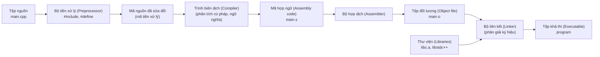
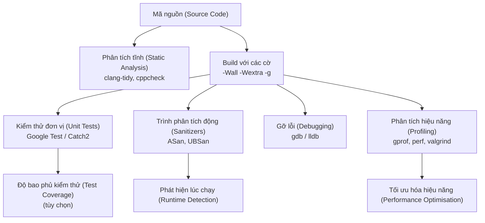

# Chương 13: Gỡ lỗi, Kiểm thử và Công cụ (Debugging, Testing, and Tools)

Phát triển ứng dụng C++ chuyên nghiệp đòi hỏi nhiều hơn kỹ năng viết mã đơn thuần – nó yêu cầu một cách tiếp cận có kỷ luật đối với công việc gỡ lỗi (debugging), kiểm thử (testing), và phân tích hiệu năng (performance analysis). Chương này giới thiệu các công cụ và kỹ thuật thiết yếu giúp chuyển đổi mã nguồn thông thường thành các phần mềm tin cậy và dễ bảo trì.

## Quy trình Biên dịch (Compilation Process)

Làm chủ các giai đoạn trong quy trình biên dịch giúp chẩn đoán hiệu quả các lỗi phát sinh khi build ứng dụng và tối ưu hóa tối đa thời gian build.



**Chi tiết các giai đoạn**:

| Giai đoạn | Đầu vào (Input) | Đầu ra (Output) | Thao tác cốt lõi |
|---|---|---|---|
| **Tiền xử lý (Preprocessing)** | `.cpp`, `.h` | Tệp tiền xử lý `.ii` hoặc `.i` | Khai triển macro (macro expansion), chèn nội dung `#include`, biên dịch có điều kiện (`#ifdef`) |
| **Biên dịch (Compilation)** | Mã nguồn tiền xử lý | Mã hợp ngữ `.s` | Phân tích từ vựng, phân tích cú pháp, phân tích ngữ nghĩa, tối ưu hóa, sinh mã nguồn |
| **Hợp dịch (Assembly)** | Mã hợp ngữ `.s` | Tệp đối tượng `.o` hoặc `.obj` | Chuyển đổi mã hợp ngữ thành mã máy (tệp đối tượng có thể tái định vị - relocatable object file) |
| **Liên kết (Linking)** | Các tệp đối tượng, thư viện | Tệp khả thi `.exe` hoặc `a.out` | Phân giải ký hiệu (symbol resolution), liên kết địa chỉ, tích hợp các thư viện tĩnh |

## Các cờ biên dịch phổ biến (Common Compiler Flags)

Trình biên dịch GCC và Clang chia sẻ chung hầu hết các cờ biên dịch. Dưới đây là các cờ thiết yếu khi phát triển phần mềm:

### Các cờ cảnh báo (Warning Flags)

| Cờ biên dịch | Ý nghĩa tác động |
|---|---|
| `-Wall` | Kích hoạt hầu hết các cảnh báo lỗi phổ biến (chưa bao gồm toàn bộ). |
| `-Wextra` | Kích hoạt thêm các cảnh báo bổ sung khác chưa có trong `-Wall`. |
| `-Werror` | Coi tất cả các cảnh báo như lỗi biên dịch (ngăn việc bỏ qua cảnh báo). |
| `-Wpedantic` | Đưa ra cảnh báo cho các phần mở rộng phi tiêu chuẩn của trình biên dịch. |
| `-Wshadow` | Cảnh báo khi một biến cục bộ trùng tên che khuất (shadow) biến khác ở ngoài. |
| `-Wconversion` | Cảnh báo về các chuyển đổi kiểu ngầm định có thể làm thay đổi giá trị. |

### Các cờ tối ưu hóa và quy chuẩn tiêu chuẩn

| Cờ biên dịch | Ý nghĩa tác động |
|---|---|
| `-std=c++17` | Biên dịch theo quy chuẩn tiêu chuẩn C++17. |
| `-std=c++20` | Biên dịch theo quy chuẩn tiêu chuẩn C++20. |
| `-O0` | Vô hiệu hóa mọi tối ưu hóa (mặc định, giúp biên dịch nhanh nhất). |
| `-O1`, `-O2`, `-O3` | Các cấp độ tối ưu hóa hiệu năng tăng dần khi thực thi. |
| `-Os` | Tối ưu hóa dung lượng tệp nhị phân đầu ra nhỏ gọn nhất. |
| `-g` | Sinh thông tin gỡ lỗi (bắt buộc phải có để sử dụng các công cụ gỡ lỗi). |
| `-DNDEBUG` | Vô hiệu hóa assert (các macro kiểm tra điều kiện phát triển). |

**Ví dụ về lệnh build hoàn chỉnh**:

```bash
g++ -std=c++17 -Wall -Wextra -Werror -O2 -g -o myprogram main.cpp
```

## Gỡ lỗi với GDB (GNU Debugger) hoặc LLDB

Các công cụ gỡ lỗi (debuggers) cho phép kiểm soát luồng thực thi chương trình, thiết lập điểm dừng (breakpoints), theo dõi giá trị biến số, và truy vết ngăn xếp cuộc gọi.

### Biên dịch ứng dụng hỗ trợ gỡ lỗi

```bash
g++ -g -O0 -o program main.cpp   # Cờ -O0 vô hiệu hóa tối ưu hóa để tránh làm rối thông tin gỡ lỗi
```

### Các lệnh GDB cơ bản

| Lệnh đầy đủ | Viết tắt | Mục đích sử dụng |
|---|---|---|
| `gdb ./program` | – | Khởi chạy công cụ gỡ lỗi |
| `break main` | `b main` | Thiết lập điểm dừng tại đầu một hàm |
| `break file.cpp:42` | `b file.cpp:42` | Thiết lập điểm dừng tại một dòng cụ thể trong tệp |
| `run` | `r` | Bắt đầu chạy chương trình |
| `next` | `n` | Bước qua dòng tiếp theo (thực thi dòng hiện tại, bỏ qua việc nhảy vào hàm) |
| `step` | `s` | Bước vào trong (nhảy vào bên trong hàm được gọi) |
| `continue` | `c` | Tiếp tục chạy chương trình cho đến khi gặp điểm dừng tiếp theo |
| `print expr` | `p expr` | In giá trị hiện tại của một biểu thức hoặc biến số |
| `display expr` | – | Tự động hiển thị lại giá trị biểu thức sau mỗi điểm dừng |
| `backtrace` | `bt` | Hiển thị toàn bộ ngăn xếp cuộc gọi (call stack) hiện tại |
| `info locals` | `i locals` | Hiển thị giá trị của toàn bộ biến cục bộ trong phạm vi hiện tại |
| `quit` | `q` | Thoát khỏi trình gỡ lỗi |

**Ví dụ minh họa một phiên gỡ lỗi GDB**:

```cpp
// buggy.cpp
#include <iostream>

int divide(int a, int b) {
    return a / b;   // Điểm có khả năng xảy ra lỗi chia cho 0
}

int main() {
    int x = 10, y = 0;
    int result = divide(x, y);
    std::cout << result << '\n';
}
```

```bash
$ g++ -g -O0 -o buggy buggy.cpp
$ gdb ./buggy
(gdb) break main
(gdb) run
(gdb) next
(gdb) next
(gdb) step         # Nhảy vào trong hàm divide
(gdb) print b      # In giá trị b, kết quả hiển thị là 0
(gdb) backtrace    # Hiển thị ngăn xếp cuộc gọi lỗi
(gdb) quit
```

### Gỡ lỗi với LLDB (Trình biên dịch Clang)

Cú pháp của LLDB rất tương đồng với GDB và chỉ có một vài khác biệt nhỏ. Một số lệnh chính: `breakpoint set --name main`, `run`, `next`, `step`, `print`, `backtrace`.

## Trình phân tích động (Sanitizers) (ASan, UBSan)

Các trình phân tích động (Sanitizers) là công cụ kiểm tra chất lượng mã nguồn tại thời điểm chạy được tích hợp trực tiếp từ lúc biên dịch. Chúng giúp phát hiện các lỗi bộ nhớ và các hành vi không xác định (undefined behavior) khi chương trình chạy với chi phí hiệu năng cực kỳ thấp.

### AddressSanitizer (ASan)

Hỗ trợ phát hiện nhanh: lỗi sử dụng bộ nhớ sau khi giải phóng (use‑after‑free), lỗi tràn bộ đệm Heap (heap buffer overflow), lỗi tràn bộ đệm Stack (stack buffer overflow), lỗi rò rỉ bộ nhớ (memory leaks), và giải phóng kép (double‑free).

```bash
g++ -fsanitize=address -g -O1 -fno-omit-frame-pointer -o program main.cpp
```

**Ví dụ**:

```cpp
int main() {
    int* arr = new int[10];
    arr[10] = 42;   // Lỗi truy cập vượt giới hạn mảng (out-of-bounds)
    delete[] arr;
}
```

Khi chạy, ASan sẽ xuất ra một báo cáo vô cùng chi tiết chỉ rõ vị trí truy cập bộ nhớ không hợp lệ, ngăn xếp cuộc gọi lúc cấp phát tài nguyên, và dòng mã nguồn chính xác gây ra lỗi.

### UndefinedBehaviorSanitizer (UBSan)

Hỗ trợ phát hiện nhanh: lỗi tràn số nguyên (integer overflow), chia cho 0 (division by zero), giải tham chiếu con trỏ null (null pointer dereference), lỗi vi phạm căn chỉnh dữ liệu (alignment violations), và ép kiểu không hợp lệ.

```bash
g++ -fsanitize=undefined -g -O1 -o program main.cpp
```

**Ví dụ**:

```cpp
#include <climits>
int main() {
    int x = INT_MAX;
    x++;   // Tràn số nguyên có dấu (signed integer overflow) – là một hành vi không xác định
}
```

### Kết hợp đồng thời các trình phân tích động

```bash
g++ -fsanitize=address,undefined -g -O1 -o program main.cpp
```

## Các khung kiểm thử đơn vị: Google Test và Catch2

Kiểm thử đơn vị (Unit testing) giúp kiểm chứng tính chính xác của các đơn vị mã nguồn nhỏ nhất (như hàm, lớp). Chúng đóng vai trò như tài liệu hướng dẫn trực quan hoạt động ổn định và giúp ngăn ngừa các lỗi tái phát (regressions).

### Google Test (GTest)

```cpp
// test.cpp
#include <gtest/gtest.h>

int add(int a, int b) { return a + b; }

TEST(AdditionTest, PositiveNumbers) {
    EXPECT_EQ(3, add(1, 2));
    EXPECT_EQ(10, add(5, 5));
}

TEST(AdditionTest, NegativeNumbers) {
    EXPECT_EQ(-3, add(-1, -2));
}

TEST(AdditionTest, WithZero) {
    EXPECT_EQ(5, add(5, 0));
}

int main(int argc, char** argv) {
    ::testing::InitGoogleTest(&argc, argv);
    return RUN_ALL_TESTS();
}
```

**Lệnh build và chạy thử nghiệm**:

```bash
g++ -std=c++17 -lgtest -lgtest_main -lpthread test.cpp -o test
./test
```

**Các câu lệnh kiểm chứng phổ biến**:

| Hàm kiểm chứng | Mục đích kiểm chứng |
|---|---|
| `EXPECT_EQ(expected, actual)` | Kiểm chứng hai giá trị bằng nhau (không gây dừng kiểm thử nếu sai) |
| `EXPECT_NE(val1, val2)` | Kiểm chứng hai giá trị khác nhau |
| `EXPECT_TRUE(condition)` | Kiểm chứng điều kiện logic đúng |
| `EXPECT_FALSE(condition)` | Kiểm chứng điều kiện logic sai |
| `EXPECT_THROW(statement, exception_type)` | Kiểm chứng đoạn mã ném ra đúng loại ngoại lệ mong muốn |
| `ASSERT_*` | Tương tự như `EXPECT_*` nhưng sẽ ngay lập tức hủy bỏ lượt test nếu sai |

### Catch2 (Khung kiểm thử chỉ yêu cầu tệp tiêu đề - Header‑only)

Catch2 vô cùng đơn giản khi thiết lập – chỉ yêu cầu bao hàm một tệp tiêu đề duy nhất.

```cpp
// test.cpp
#define CATCH_CONFIG_MAIN
#include <catch2/catch.hpp>

int add(int a, int b) { return a + b; }

TEST_CASE("Addition works", "[math]") {
    REQUIRE(add(1, 2) == 3);
    REQUIRE(add(-1, -2) == -3);
}

TEST_CASE("Addition with zero", "[math]") {
    CHECK(add(5, 0) == 5);
}
```

**Lệnh build**:

```bash
g++ -std=c++17 -o test test.cpp
./test
```

## Định dạng mã nguồn tự động với `clang-format`

`clang-format` tự động định dạng chuẩn hóa mã nguồn C++ theo một bộ quy tắc phong cách (như LLVM, Google, Chromium, Mozilla, WebKit, hoặc cấu hình tự định nghĩa).

**Lệnh cơ bản**:

```bash
clang-format -i main.cpp                     # Tự định dạng trực tiếp trên tệp hiện tại
clang-format --style=google -i main.cpp      # Sử dụng phong cách viết mã của Google
clang-format --dump-config > .clang-format   # Sinh tệp cấu hình mặc định
```

**Ví dụ về tệp `.clang-format` (Cấu hình theo Google style)**:

```yaml
BasedOnStyle: Google
IndentWidth: 2
ColumnLimit: 80
AllowShortFunctionsOnASingleLine: Inline
```

Tích hợp biên tập: Hầu hết các trình biên tập mã nguồn (IDEs) hiện nay đều hỗ trợ tự động chạy `clang-format` mỗi khi lưu tệp tin.

## Phân tích tĩnh: `clang-tidy` và `cppcheck`

Các công cụ phân tích tĩnh (static analysis tools) giúp dò tìm các lỗi logic tiềm ẩn, lỗi phong cách viết mã, và các vấn đề về hiệu năng mà không cần phải thực thi chương trình.

### `clang-tidy`

Kiểm tra: Các thực hành C++ hiện đại tốt nhất, hiệu năng mã nguồn, tính chính xác, tính dễ đọc, và kiểm chứng theo bộ quy chuẩn C++ Core Guidelines.

```bash
clang-tidy main.cpp -- -std=c++17 -Iinclude/
```

Các tính năng kiểm tra phổ biến:
- `modernize-use-auto` – Khuyên nghị sử dụng từ khóa `auto` khi kiểu dữ liệu quá phức tạp hoặc hiển nhiên.
- `modernize-use-nullptr` – Thay thế hoàn toàn `NULL` và hằng số `0` bằng `nullptr`.
- `performance-for-range-copy` – Cảnh báo các bản sao không mong muốn phát sinh trong vòng lặp `for` dựa trên phạm vi.

### `cppcheck`

`cppcheck` thực thi các phân tích ký hiệu (symbol analysis) ở tầng sâu để phát hiện rò rỉ bộ nhớ, giải tham chiếu con trỏ null, biến chưa khởi tạo, và lỗi lệch một đơn vị (off‑by‑one errors).

```bash
cppcheck --enable=all --inconclusive --std=c++17 main.cpp
```

**Ví dụ đầu ra của Cppcheck**:

```cpp
int* p = new int[10];
// ... thiếu câu lệnh delete[] giải phóng bộ nhớ
// Cppcheck sẽ báo cáo: Memory leak: p
```

Hãy tích hợp cả hai công cụ này vào quy trình CI (Tích hợp liên tục) để đảm bảo chất lượng phần mềm luôn ổn định.

## Phân tích hiệu năng với `gprof`, `perf`, và `valgrind`

Công cụ phân tích hiệu năng (profiling) hỗ trợ đo lường thời gian thực thi của từng hàm, qua đó chỉ ra chính xác các điểm nghẽn hiệu năng của chương trình.

### `gprof` (GNU Profiler)

Yêu cầu chương trình phải được biên dịch cùng với cờ hỗ trợ phân tích hiệu năng.

```bash
g++ -pg -O2 -o program main.cpp   # Cờ -pg tích hợp các đoạn mã đo lường vào tệp nhị phân
./program                         # Chạy chương trình để tự động sinh tệp đo lường gmon.out
gprof program gmon.out > analysis.txt
```

Kết quả của `gprof` cung cấp:
- **Flat profile** – Tổng thời gian thực thi cụ thể trên từng hàm.
- **Call graph** – Sơ đồ biểu diễn quan hệ gọi hàm (caller/callee) và thời gian tương ứng.

### `perf` (Hệ điều hành Linux)

`perf` là một công cụ phân tích hiệu năng lấy mẫu (sampling profiler) ở cấp độ nhân hệ điều hành (kernel-level) với chi phí phát sinh cực thấp. Lệnh này không yêu cầu bạn phải biên dịch lại mã nguồn.

```bash
perf record ./program              # Ghi lại toàn bộ dữ liệu hiệu năng khi chạy
perf report                        # Hiển thị báo cáo tương tác trực quan
```

Lệnh `perf top` hỗ trợ giám sát thời gian thực tỷ lệ sử dụng CPU trên từng hàm của hệ thống.

### `valgrind` (Memcheck và Cachegrind)

`valgrind` là một khung công cụ đo lường vô cùng mạnh mẽ. Công cụ Memcheck giúp phát hiện chi tiết lỗi bộ nhớ; công cụ Cachegrind mô phỏng và phân tích hoạt động của bộ nhớ đệm (cache).

**Kiểm tra an toàn bộ nhớ**:

```bash
valgrind --leak-check=full --show-leak-kinds=all ./program
```

**Phân tích bộ nhớ đệm (Cache profiling)**:

```bash
valgrind --tool=cachegrind ./program
cg_annotate cachegrind.out.xxxx   # Chú thích trực tiếp tỷ lệ trượt cache (cache misses) trên từng dòng mã nguồn
```

## Sơ đồ tích hợp các công cụ phát triển C++



## Quy trình phát triển phần mềm được khuyến nghị

1. **Viết mã nguồn** đồng thời tích hợp tính năng tự định dạng `clang-format` mỗi khi lưu tệp.
2. **Biên dịch thử nghiệm** với đầy đủ các cờ an toàn `-Wall -Wextra -Werror -g`.
3. **Thực thi phân tích tĩnh** (`clang-tidy`, `cppcheck`) trên mỗi lượt commit mã nguồn.
4. **Viết mã kiểm thử đơn vị** (Google Test hoặc Catch2) và chạy chúng thường xuyên.
5. **Chạy các trình phân tích động** (ASan, UBSan) trong các bản build gỡ lỗi (debug builds).
6. **Thực thi đo lường hiệu năng** (perf, valgrind) ở các giai đoạn đòi hỏi tối ưu hiệu năng cốt lõi.
7. **Gỡ lỗi chi tiết** với gdb/lldb khi phát sinh các lỗi logic phức tạp.

## Bảng tổng hợp các công cụ hỗ trợ

| Công cụ | Phân loại | Mục đích sử dụng chính | Ví dụ lệnh thực thi |
|---|---|---|---|
| **GDB** | Gỡ lỗi | Kiểm soát luồng chạy ứng dụng | `gdb ./program` |
| **ASan** | Phát hiện lỗi bộ nhớ | Tràn bộ đệm, lỗi use‑after‑free | Tích hợp cờ `-fsanitize=address` |
| **UBSan** | Hành vi không xác định | Tràn số nguyên, giải tham chiếu null | Tích hợp cờ `-fsanitize=undefined` |
| **Google Test** | Kiểm thử đơn vị | Khung viết các kịch bản kiểm thử | Hàm so sánh `EXPECT_EQ(a, b)` |
| **Catch2** | Kiểm thử đơn vị | Khung kiểm thử đơn giản chỉ cần header | Lệnh so sánh `REQUIRE(a == b)` |
| **clang-format** | Định dạng mã | Đồng bộ phong cách trình bày | `clang-format -i main.cpp` |
| **clang-tidy** | Phân tích tĩnh | Kiểm tra chất lượng mã nguồn | `clang-tidy main.cpp --` |
| **cppcheck** | Phân tích tĩnh | Dò lỗi logic sâu trong mã nguồn | `cppcheck --enable=all main.cpp` |
| **perf** | Đo lường hiệu năng | Trình đo hiệu năng lấy mẫu hệ điều hành | `perf record ./program` |
| **valgrind** | Đo lường / Dò lỗi | Phát hiện lỗi cache, lỗi rò rỉ bộ nhớ | `valgrind ./program` |

Đầu tư thời gian để làm chủ các công cụ này mang lại lợi ích cấp số nhân cho chất lượng, độ tin cậy và tính dễ bảo trì của các dự án phần mềm. Trở thành một lập trình viên C++ chuyên nghiệp đồng nghĩa với việc làm chủ thành thạo các công cụ đắc lực trong hệ sinh thái này.
