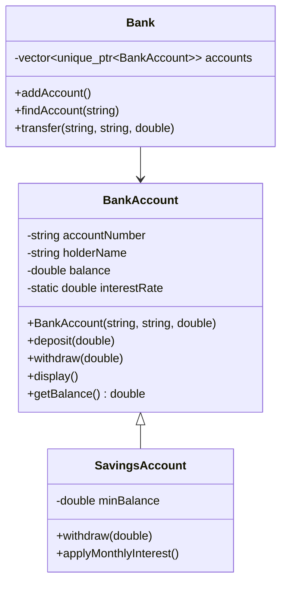
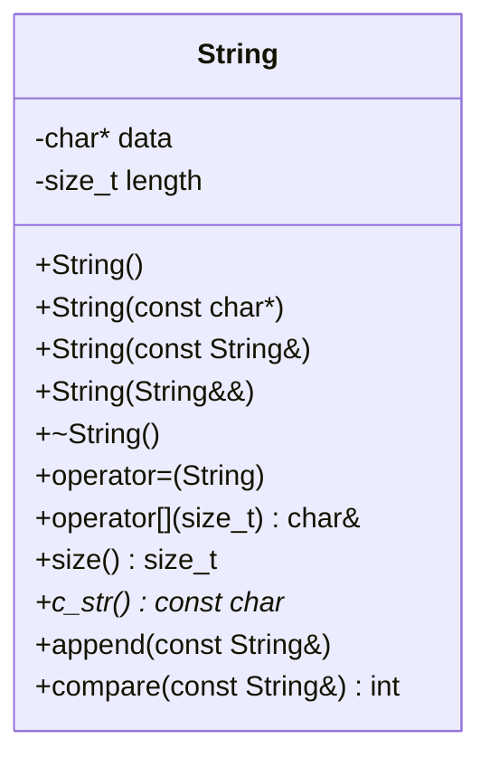
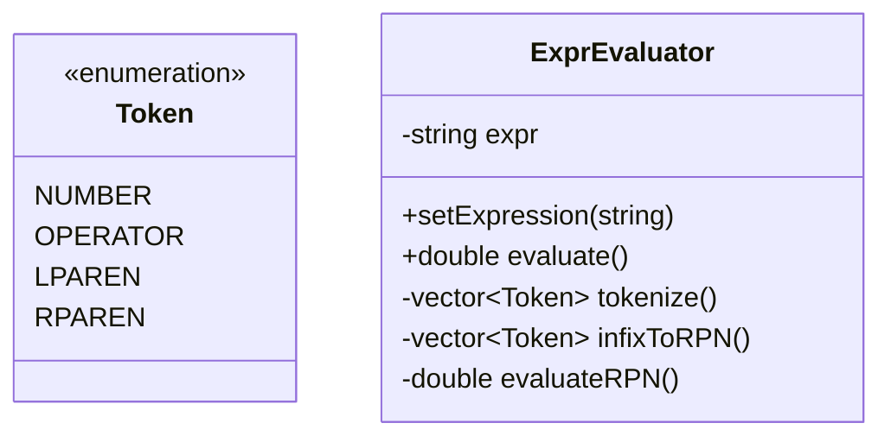
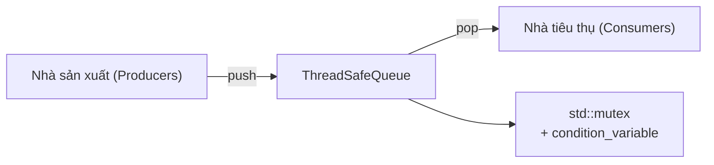

# Chương 14: Các Dự án Thực hành và Bộ Câu hỏi Bài tập (Hands‑on Projects and Problem Sets)

Chương này cung cấp các dự án thực hành (hands-on projects) thực tế được phân loại rõ ràng theo từng cấp độ kỹ năng. Mỗi dự án giúp củng cố sâu các khái niệm từ các chương trước đó và khuyến khích áp dụng các thực hành tốt nhất. Hãy hoàn thành các dự án này để rèn luyện sự tự tin và chứng minh năng lực lập trình chuyên nghiệp của bạn.

## Các dự án cấp độ Cơ bản (Beginner Projects)

### Dự án 1: Hệ thống Tài khoản Ngân hàng (Bank Account System)

**Mục tiêu**: Xây dựng một hệ thống quản lý tài khoản ngân hàng thực tế nhằm thể hiện các khái niệm về tính đóng gói (encapsulation), các hàm khởi tạo (constructors), và kiểm chứng dữ liệu hợp lệ (data validation).

**Yêu cầu chi tiết**:

1. Thiết kế một lớp `BankAccount` với các thuộc tính thành viên private:
   - `accountNumber` (chuỗi ký tự - string)
   - `accountHolderName` (chuỗi ký tự - string)
   - `balance` (số thực - double)
   - `interestRate` (biến tĩnh static double, chia sẻ chung trên toàn bộ tài khoản)

2. Cung cấp các hàm khởi tạo:
   - Hàm khởi tạo mặc định – khởi tạo tài khoản với số dư bằng 0.
   - Hàm khởi tạo có tham số – nhận số tài khoản, tên chủ sở hữu, và số dư ban đầu (yêu cầu số dư ban đầu phải là một số không âm).
   - Hàm khởi tạo sao chép – thực hiện sao chép sâu (vì số tài khoản phải là duy nhất, nên thao tác sao chép cần tự động tạo ra một số tài khoản mới hoặc ném ngoại lệ – cách đơn giản nhất là vô hiệu hóa hoàn toàn phép sao chép với `= delete`).

3. Triển khai các hàm thành viên:
   - `deposit(double amount)` – cộng thêm tiền vào số dư (số tiền gửi phải là số dương).
   - `withdraw(double amount)` – rút tiền khỏi số dư (không được vượt quá số dư hiện có).
   - `calculateInterest()` – trả về số tiền lãi tính theo công thức: balance * interestRate / 100.
   - Các hàm getter cho toàn bộ thuộc tính thành viên (không dùng hàm setter, ngoại trừ có thể cho việc đổi tên chủ tài khoản).
   - `display()` – xuất ra màn hình chi tiết thông tin tài khoản.

4. Minh họa tính đa hình (polymorphic behavior) bằng cách xây dựng lớp `SavingsAccount` (Tài khoản tiết kiệm) kế thừa từ lớp `BankAccount` thỏa mãn:
   - Yêu cầu duy trì một số dư tối thiểu (ví dụ: $500).
   - Nạp chồng (override) phương thức `withdraw()` để kiểm tra số dư tối thiểu sau khi rút tiền.
   - Bổ sung hàm `monthlyInterest()` để áp dụng cộng lãi suất hàng tháng.

5. Xây dựng một lớp điều phối `Bank` quản lý một danh sách các tài khoản ngân hàng `BankAccount*` (hoặc tối ưu hơn là `std::vector<std::unique_ptr<BankAccount>>`) cung cấp các tính năng:
   - `addAccount()` (Thêm tài khoản mới)
   - `findAccount()` (Tìm kiếm tài khoản)
   - `transfer()` (Chuyển khoản an toàn giữa hai tài khoản).

**Sơ đồ lớp (Class Diagram)**:



**Đoạn mã kiểm thử mẫu**:

```cpp
#include <iostream>
#include <memory>

int main() {
    Bank bank;
    bank.addAccount(std::make_unique<SavingsAccount>("SA001", "Alice", 1000.0));
    auto* acc = bank.findAccount("SA001");
    acc->deposit(200);
    acc->withdraw(1500);  // Thao tác này phải thất bại do vi phạm số dư tối thiểu
    acc->withdraw(300);   // Thành công
    acc->display();
}
```

**Thử thách nâng cao**: Sử dụng biểu thức chính quy `std::regex` để kiểm chứng định dạng của số tài khoản. Thiết kế các lớp ngoại lệ (exception classes) tự định nghĩa để ném lỗi khi không đủ số dư rút, số tiền không hợp lệ, v.v.

---

### Dự án 2: Lớp Đa thức tích hợp Quá tải Toán tử (Polynomial Class with Operator Overloading)

**Mục tiêu**: Xây dựng lớp đa thức `Polynomial` biểu diễn một đa thức toán học trong thực tế (ví dụ: $3x^2 + 2x + 1$). Thực hiện nạp chồng (overload) các toán tử tương ứng để hỗ trợ cú pháp viết tự nhiên giống như biểu thức toán học thông thường.

**Yêu cầu chi tiết**:

1. Biểu diễn đa thức bằng cách sử dụng một mảng các hệ số kiểu số thực `std::vector<double>` trong đó chỉ số phần tử (index) tương ứng với bậc lũy thừa của $x$ (ví dụ: mảng hệ số `[1, 2, 3]` tương đương biểu diễn đa thức $1 + 2x + 3x^2$).

2. Các hàm khởi tạo:
   - Mặc định – khởi tạo một đa thức bằng 0 (mảng hệ số rỗng).
   - Khởi tạo từ danh sách truyền trực tiếp `std::initializer_list<double>` – ví dụ: `Polynomial p{1, 2, 3}`.
   - Các hàm khởi tạo sao chép và dịch chuyển (chỉ cần dùng mặc định `= default` nếu dùng vector tiêu chuẩn, nhưng hãy tự viết để luyện tập).

3. Thực hiện nạp chồng các toán tử sau:

| Toán tử | Ý nghĩa toán học | Kiểu dữ liệu trả về |
|---|---|---|
| `+` (nhị phân) | Phép cộng hai đa thức | `Polynomial` |
| `-` (nhị phân) | Phép trừ hai đa thức | `Polynomial` |
| `*` (nhị phân) | Phép nhân hai đa thức | `Polynomial` |
| `+=`, `-=` | Phép gán kết hợp | `Polynomial&` |
| `==`, `!=` | Phép so sánh bằng | `bool` |
| `<<` | Xuất dữ liệu ra luồng (Stream output) | `std::ostream&` |
| `>>` | Nhập dữ liệu từ luồng (ví dụ nhập `2 3 4` tương đương $2 + 3x + 4x^2$) | `std::istream&` |
| `()` | Tính giá trị đa thức tại một điểm $x$ cụ thể: `p(2.5)` | `double` |

4. Cung cấp các hàm thành viên phụ trợ:
   - `degree()` – trả về bậc cao nhất có hệ số khác 0 của đa thức.
   - `derivative()` – trả về một đối tượng đa thức mới là đạo hàm của đa thức hiện tại.

5. Đảm bảo các phép toán thực thi chính xác trên các đa thức có bậc khác nhau (yêu cầu loại bỏ các hệ số 0 dư thừa ở cuối để đưa đa thức về dạng chuẩn).

**Ví dụ sử dụng**:

```cpp
Polynomial p1{1, 2, 3};  // 1 + 2x + 3x^2
Polynomial p2{2, 0, 1};  // 2 + x^2

Polynomial sum = p1 + p2;   // 3 + 2x + 4x^2
Polynomial diff = p1 - p2;  // -1 + 2x + 2x^2
Polynomial prod = p1 * p2;  // (1+2x+3x^2)*(2+x^2) = 2 + 4x + 7x^2 + 2x^3 + 3x^4

std::cout << prod << '\n';
double val = p1(2.5);   // 1 + 2*2.5 + 3*6.25 = 1 + 5 + 18.75 = 24.75
```

**Mẹo triển khai**:

- Phép nhân đa thức: Sử dụng các vòng lặp lồng nhau để nhân các cặp hệ số tương ứng và tích lũy kết quả vào một vector đích có kích thước ban đầu bằng `bậc_1 + bậc_2 + 1`.
- Đưa về dạng chuẩn (Canonical form): Sau mỗi phép toán, hãy chủ động xóa bỏ các hệ số bằng 0 ở cuối mảng `coefficients` (nhưng luôn giữ lại tối thiểu một phần tử).
- Khi so sánh hai đa thức, chỉ thực hiện so sánh hai mảng hệ số sau khi cả hai đã được đưa về dạng chuẩn.

**Các trường hợp kiểm thử**:

```cpp
Polynomial p;
assert(p.degree() == -1); // Định nghĩa bậc của đa thức rỗng bằng 0 là -1
Polynomial q{1, 0, 0};    // Phải được rút gọn về dạng {1} sau khi chuẩn hóa
assert(q.degree() == 0);
p += q;
assert(p == q);
```

---

### Dự án 3: Khuôn mẫu Lớp Mảng động Tổng quát (Generic Dynamic Array Template) (Tương tự `std::vector`)

**Mục tiêu**: Tự xây dựng một khuôn mẫu lớp mảng động `DynamicArray<T>` mô phỏng lại một tập hợp các tính năng cốt lõi của bộ chứa `std::vector`. Dự án này giúp củng cố kiến thức sâu sắc về khuôn mẫu (templates), quản lý bộ nhớ động cấp thấp, cơ chế sao chép/dịch chuyển, và thiết kế các bộ duyệt (iterators).

**Yêu cầu chi tiết**:

1. Khai báo khuôn mẫu lớp cụ thể:

```cpp
#include <cstddef>
#include <stdexcept>

template <typename T>
class DynamicArray {
private:
    T* data;
    size_t capacity_;
    size_t size_;
public:
    // Các hàm khởi tạo, hàm hủy, phép gán
    DynamicArray();
    explicit DynamicArray(size_t count);
    DynamicArray(const DynamicArray& other);
    DynamicArray(DynamicArray&& other) noexcept;
    DynamicArray& operator=(const DynamicArray& other);
    DynamicArray& operator=(DynamicArray&& other) noexcept;
    ~DynamicArray();
    
    // Truy cập phần tử
    T& operator[](size_t index);
    const T& operator[](size_t index) const;
    T& at(size_t index);              // Có kiểm tra giới hạn mảng
    const T& at(size_t index) const;
    
    // Các bộ duyệt (Iterators) cơ bản
    T* begin();
    T* end();
    const T* begin() const;
    const T* end() const;
    
    // Quản lý sức chứa
    size_t size() const;
    size_t capacity() const;
    bool empty() const;
    void reserve(size_t new_cap);
    void shrink_to_fit();
    
    // Các hàm sửa đổi bộ chứa
    void clear();
    void push_back(const T& value);
    void push_back(T&& value);
    void pop_back();
    void resize(size_t new_size, const T& value = T());
};
```

2. Chi tiết triển khai kỹ thuật:
   - Sử dụng cơ chế quản lý bộ nhớ thô bằng cặp toán tử `new T[]` và `delete[]`.
   - Khi dung lượng lưu trữ hiện tại bị đầy, hãy thực hiện cấp phát lại với hệ số nhân dung lượng tăng gấp đôi (hoặc 1.5).
   - Cung cấp sự đảm bảo an toàn ngoại lệ mạnh mẽ (strong exception guarantee) đối với các phương thức sửa đổi dữ liệu `push_back` và `resize` (sử dụng cơ chế sao chép và hoán đổi hoặc qua một vùng nhớ tạm thời).
   - Triển khai các bộ duyệt đơn giản sử dụng con trỏ thô – hoàn toàn đáp ứng các tiêu chuẩn duyệt tiến và truy cập ngẫu nhiên của STL.

3. Triển khai một lớp bộ duyệt tùy biến tích hợp đầy đủ các toán tử `operator*`, `operator++`, `operator!=`, v.v. (hoặc có thể dùng con trỏ thô làm bí danh kiểu như trên).

4. Thiết kế một hàm in phụ trợ sử dụng chính các bộ duyệt vừa thiết kế để xuất toàn bộ phần tử ra màn hình.

**Ví dụ sử dụng**:

```cpp
DynamicArray<int> arr;
arr.push_back(10);
arr.push_back(20);
arr.push_back(30);
for (auto it = arr.begin(); it != arr.end(); ++it) {
    std::cout << *it << ' ';
}
arr[1] = 25;
try {
    int val = arr.at(5);  // Ném ngoại lệ std::out_of_range
} catch (const std::out_of_range& e) {
    std::cerr << e.what() << '\n';
}
```

**Yêu cầu kiểm thử**:
- Kiểm chứng tính năng hoạt động ổn định trên cả các kiểu dữ liệu nguyên thủy (`int`, `double`) và các kiểu lớp phức tạp (ví dụ: `std::string`).
- Xác nhận cơ chế dịch chuyển (move semantics) được ưu tiên kích hoạt chuẩn xác khi push các đối tượng tạm thời.
- Kiểm tra tính năng tự động tái cấp phát vùng nhớ khi số phần tử vượt quá sức chứa ban đầu.

**Phần mở rộng nâng cao**:
- Bổ sung phương thức tạo trực tiếp phần tử `emplace_back` sử dụng khuôn mẫu số lượng tham số biến đổi (variadic templates).
- Bổ sung các phương thức chèn `insert` và xóa `erase` phần tử tại một vị trí bộ duyệt bất kỳ.

---

## Các dự án cấp độ Trung cấp (Intermediate Projects) (Tổng quan)

| Tên dự án | Khái niệm cốt lõi cần vận dụng |
|---|---|
| **Lớp chuỗi ký tự tự định nghĩa `String`** | Sao chép sâu (deep copy), cơ chế dịch chuyển, kỹ thuật đếm tham chiếu (tùy chọn) |
| **Hệ thống phân cấp hình học đa hình** | Các hàm ảo, lớp cơ sở trừu tượng, tránh lạm dụng RTTI |
| **Trình phân tích và tính toán biểu thức** | Cấu trúc dữ liệu Ngăn xếp (Stack), đối tượng hàm (functors), kế thừa |
| **Triển khai con trỏ thông minh `shared_ptr` đơn giản** | Khai báo khuôn mẫu lớp, kỹ thuật đếm tham chiếu, hỗ trợ weak pointer |

## Các dự án cấp độ Nâng cao (Advanced Projects) (Tổng quan)

| Tên dự án | Khái niệm cốt lõi cần vận dụng |
|---|---|
| **Hàng đợi an toàn đa luồng (Thread-safe Queue)** | Lập trình đồng thời, biến điều kiện (condition variables), `std::mutex` |
| **Bộ chứa nhỏ chuẩn STL tích hợp bộ cấp phát tự chọn** | Thiết kế bộ cấp phát (allocator-aware), đặc tính bộ duyệt (iterator traits) |
| **Hệ thống sự kiện dựa trên mẫu Observer** | Sử dụng lớp bao `std::function`, xóa kiểu (type erasure), các con trỏ `weak_ptr` |
| **Bộ cấp phát bể chứa bộ nhớ (Memory Pool)** | Toán tử new định vị (placement new), quá tải toán tử `new`/`delete`, căn chỉnh dữ liệu |

## Bộ câu hỏi bài tập – Cấp độ Cơ bản

### Bài tập 1: Tính Đóng gói và Khai báo Lớp

1. Xây dựng lớp phân số `Fraction` gồm tử số (numerator) và mẫu số (denominator). Triển khai:
   - Tự động rút gọn phân số về dạng tối giản ngay trong hàm khởi tạo.
   - Các toán tử số học `+`, `-`, `*`, `/` dưới dạng các hàm tự do (non-member functions).
   - Xuất dữ liệu ra luồng dưới định dạng trực quan: `tử_số/mẫu_số`.

2. Thiết kế lớp thời gian `Time` (bao gồm các thuộc tính: giờ, phút, giây). Nạp chồng toán tử `+` để cộng hai khoảng thời gian và toán tử `<<` để xuất dữ liệu ra luồng dưới định dạng chuẩn `HH:MM:SS`.

### Bài tập 2: Khuôn mẫu (Templates)

1. Viết một khuôn mẫu hàm `min` trả về giá trị nhỏ hơn trong hai giá trị truyền vào. Kiểm thử tính năng hoạt động với các kiểu `int`, `double`, và `std::string`.
2. Viết một khuôn mẫu lớp cặp dữ liệu `Pair<T, U>` chứa hai thuộc tính thành viên `first` và `second`. Cung cấp phương thức hoán đổi `swap`.

### Bài tập 3: Thực hành Thư viện Tiêu chuẩn STL

1. Viết một chương trình hoàn chỉnh đọc dữ liệu từ một tệp văn bản, tính toán tần suất xuất hiện của mỗi từ bằng cấu trúc `std::unordered_map`, và hiển thị danh sách các từ đã được sắp xếp theo thứ tự tần suất giảm dần bằng thuật toán `std::sort` với một bộ so sánh tùy biến.
2. Ứng dụng cấu trúc hàng đợi ưu tiên `std::priority_queue` để xây dựng một chương trình lập lịch công việc tự động trong đó mỗi công việc đi kèm với một độ ưu tiên cụ thể.

## Yêu cầu sản phẩm bàn giao cho mỗi Dự án

Đối với mỗi dự án thực hành, bạn cần chuẩn bị đầy đủ các tài liệu sau:
- Mã nguồn đầy đủ (bao gồm các tệp tiêu đề `.h` và tệp triển khai `.cpp`) đi kèm chú thích mã nguồn rõ ràng.
- Một tài liệu ngắn `README` mô tả chi tiết các quyết định thiết kế kiến trúc và giải pháp kỹ thuật.
- Các kịch bản kiểm thử đơn vị (sử dụng Google Test hoặc Catch2) bao quát toàn bộ các trường hợp biên.
- Tệp tin cấu hình hướng dẫn build ứng dụng tự động (CMakeLists.txt hoặc Makefile đơn giản).
- Kết quả đầu ra mẫu khi chương trình hoạt động.

---

## Các dự án cấp độ Trung cấp (Intermediate Projects)

### Dự án 4: Triển khai lớp chuỗi ký tự tự định nghĩa `String`

**Mục tiêu**: Tự thiết kế và triển khai một lớp chuỗi ký tự `String` có khả năng tự quản lý bộ nhớ động một cách hiệu quả, tích hợp đầy đủ tính năng sao chép sâu (deep copy), cơ chế dịch chuyển, và tùy chọn kỹ thuật đếm tham chiếu (sao chép khi ghi - copy-on-write). Dự án này giúp rèn luyện sâu kỹ năng quản lý bộ nhớ, quy tắc năm thành phần, và tối ưu hóa hiệu năng.

**Yêu cầu chi tiết**:

1. Cấu trúc lớp cụ thể:

```cpp
#include <iostream>

class String {
private:
    char* data;
    size_t length;
    
public:
    // Các hàm khởi tạo
    String();                         // Chuỗi rỗng
    String(const char* str);          // Khởi tạo từ chuỗi C-style
    String(const String& other);      // Hàm khởi tạo sao chép
    String(String&& other) noexcept;  // Hàm khởi tạo dịch chuyển
    
    // Các phép gán
    String& operator=(const String& other);   // Phép gán sao chép
    String& operator=(String&& other) noexcept; // Phép gán dịch chuyển
    
    // Hàm hủy
    ~String();
    
    // Truy cập phần tử
    char& operator[](size_t index);
    const char& operator[](size_t index) const;
    
    // Trạng thái sức chứa
    size_t size() const;
    bool empty() const;
    
    // Các hàm sửa đổi dữ liệu
    void push_back(char ch);
    void pop_back();
    void clear();
    void append(const String& other);
    void swap(String& other) noexcept;
    
    // Thao tác bổ trợ
    const char* c_str() const;
    int compare(const String& other) const;
    
    // Các hàm bạn nạp chồng toán tử
    friend String operator+(const String& lhs, const String& rhs);
    friend std::ostream& operator<<(std::ostream& os, const String& str);
    friend std::istream& operator>>(std::istream& is, String& str);
};
```

2. Các quy tắc triển khai bắt buộc:
   - Sử dụng cơ chế cấp phát bộ nhớ động bằng toán tử `new char[length+1]` và giải phóng bộ nhớ bằng `delete[]`.
   - Hàm khởi tạo sao chép bắt buộc phải thực hiện sao chép sâu toàn vẹn dữ liệu.
   - Hàm khởi tạo dịch chuyển thực hiện chuyển giao nhanh quyền sở hữu vùng nhớ và đưa đối tượng nguồn về trạng thái rỗng hợp lệ.
   - Nạp chồng đầy đủ toán tử nhập xuất dữ liệu từ luồng.

3. **Tính năng nâng cao tùy chọn (Đếm tham chiếu)**:
   - Cho phép các đối tượng sao chép chia sẻ chung một vùng đệm dữ liệu duy nhất cho tới khi có một đối tượng thực hiện sửa đổi nội dung chuỗi (cơ chế Sao chép khi ghi - copy‑on‑write).
   - Thiết kế một cấu trúc quản lý số đếm tham chiếu dùng chung liên kết với vùng đệm dữ liệu (ví dụ: `struct RefCounted { int count; char data[1]; }`).

**Sơ đồ lớp (Class Diagram)**:



**Ví dụ sử dụng**:

```cpp
String s1("Hello");
String s2 = s1;          // Sao chép sâu
String s3 = std::move(s1); // s1 chuyển giao tài nguyên và trở thành rỗng
s2.push_back('!');
std::cout << s2;         // In ra: Hello!
std::cout << (s2 == s3); // In ra: false (yêu cầu tự nạp chồng operator==)
```

**Các trường hợp kiểm thử**:
- Hàm khởi tạo mặc định phải tạo ra chuỗi rỗng hợp lệ (`size() == 0`, hàm `c_str()` trả về chuỗi rỗng `""`).
- Sửa đổi nội dung chuỗi sao chép không được làm ảnh hưởng đến chuỗi gốc ban đầu.
- Xử lý chính xác trường hợp tự gán đối tượng: `s = s`.
- Phép cộng chuỗi hoạt động chính xác: `s1 + s2`.

**Thử thách bổ sung**: Tự nạp chồng chuyên biệt hóa lớp `std::hash` dành riêng cho kiểu `String` vừa thiết kế để cho phép sử dụng chúng trực tiếp trong các bộ chứa không thứ tự như `std::unordered_map`.

---

### Dự án 5: Hệ thống Phân cấp Hình học (Đa hình Động lúc chạy)

**Mục tiêu**: Xây dựng lớp trừu tượng `Shape` (Hình học) chứa các phương thức thuần ảo (pure virtual functions) và một tập hợp các lớp dẫn xuất cụ thể (`Circle`, `Rectangle`, `Triangle`). Dự án này nhằm minh chứng năng lực thiết kế đa hình động tại thời điểm chạy (runtime polymorphism), sử dụng đúng cách hàm hủy ảo (virtual destructors), và thực hành thiết kế tránh lạm dụng RTTI (dynamic_cast).

**Yêu cầu chi tiết**:

1. Lớp cơ sở trừu tượng:

```cpp
class Shape {
public:
    virtual double area() const = 0;
    virtual double perimeter() const = 0;
    virtual void draw() const = 0;   // In ra mô tả chi tiết của hình
    virtual ~Shape() = default;      // Bắt buộc phải có hàm hủy ảo
};
```

2. Các lớp dẫn xuất cụ thể tích hợp các thuộc tính tương ứng:
   - `Circle` (Hình tròn): bán kính (radius), điểm tâm (centre point).
   - `Rectangle` (Hình chữ nhật): chiều rộng, chiều cao, tọa độ góc trên bên trái.
   - `Triangle` (Hình tam giác): tọa độ ba đỉnh hoặc chiều dài cạnh đáy + chiều cao tương ứng.

3. Xây dựng một lớp quản lý bản vẽ `Canvas` chứa danh sách các hình học `std::vector<std::unique_ptr<Shape>>` và cung cấp các tính năng:
   - `addShape(std::unique_ptr<Shape> shape)`
   - `drawAll() const` – gọi phương thức `draw()` trên từng hình học trong danh sách.
   - `totalArea() const` – tính tổng diện tích của toàn bộ các hình học.

4. Minh chứng tính đa hình hoàn chỉnh mà tuyệt đối không sử dụng phép ép kiểu động `dynamic_cast`: chỉ dựa vào cơ chế điều phối qua phương thức ảo.

**Ví dụ sử dụng**:

```cpp
Canvas canvas;
canvas.addShape(std::make_unique<Circle>(5.0));
canvas.addShape(std::make_unique<Rectangle>(4.0, 6.0));
canvas.addShape(std::make_unique<Triangle>(3.0, 4.0, 5.0));
canvas.drawAll();
std::cout << "Total area: " << canvas.totalArea() << '\n';
```

**Yêu cầu kiểm thử**:
- Xác thực tính chính xác của các công thức tính diện tích và chu vi.
- Kiểm tra tính an toàn bộ nhớ (không xảy ra rò rỉ bộ nhớ khi hủy danh sách hình học) bằng công cụ Valgrind.
- Thử nghiệm tạo thêm lớp hình vuông `Square` kế thừa từ lớp `Rectangle` – hãy đánh giá xem thiết kế này có vi phạm nguyên lý thay thế Liskov (Liskov substitution principle) không?

**Phần mở rộng nâng cao**:
- Bổ sung giao diện biến đổi hình học `Transform` hỗ trợ các thao tác phóng to/thu nhỏ, xoay hình học.
- Triển khai toán tử xuất dòng `operator<<` chuyên biệt cho `Shape` bằng cơ chế điều phối kép (double dispatch) (ứng dụng mẫu thiết kế Visitor pattern).

---

### Dự án 6: Trình Tính toán Giá trị Biểu thức (Thuật toán Ký pháp Ba Lan)

**Mục tiêu**: Xây dựng một chương trình phân tích và tính toán giá trị của các biểu thức số học phức tạp hỗ trợ các số nguyên, các toán tử `+`, `-`, `*`, `/`, cặp dấu ngoặc đơn, và toán tử một ngôi trừ (unary minus). Ứng dụng thuật toán ký pháp Shunting Yard (của nhà khoa học Dijkstra) để chuyển đổi biểu thức dạng trung tố (infix) sang dạng Ký pháp Ba Lan ngược (RPN - Reverse Polish Notation), sau đó tiến hành tính toán.

**Yêu cầu chi tiết**:

1. Quy trình xử lý gồm hai bước cốt lõi:
   - Phân tích từ vựng (Tokenisation): Cắt chuỗi biểu thức ban đầu thành một danh sách các mã từ vựng (tokens) hợp lệ (như số, toán tử, dấu ngoặc).
   - Thuật toán Shunting Yard: Chuyển đổi danh sách token trung tố sang dạng ký pháp RPN bằng cấu trúc ngăn xếp `std::stack`.
   - Tính toán giá trị: Thực hiện tính toán kết quả cuối cùng từ biểu thức RPN bằng `std::stack`.

2. Hỗ trợ đúng độ ưu tiên của các toán tử (toán tử `+`, `-`: ưu tiên cấp 1; toán tử `*`, `/`: ưu tiên cấp 2). Phép toán thực hiện liên kết từ trái qua phải (left-associative).

3. Sử dụng cấu trúc ánh xạ `std::map` hoặc một bảng tra cứu con trỏ hàm/đối tượng hàm nhằm liên kết nhanh mỗi ký tự toán tử với một thực thể xử lý tính toán tương ứng.

4. Xử lý lỗi ngoại lệ chặt chẽ: Phát hiện và ném lỗi khi gặp lỗi thiếu dấu ngoặc đơn đối xứng, lỗi chia cho 0, hoặc khi gặp các ký tự từ vựng không hợp lệ.

**Kiến trúc thiết kế (Class Design)**:



**Ví dụ sử dụng**:

```cpp
ExprEvaluator e("3 + 4 * (2 - 1)");
double result = e.evaluate(); // Kết quả: 7.0
```

**Mẹo triển khai**:
- Sử dụng hàm tiêu chuẩn `std::isdigit` để nhận diện các con số và xử lý chính xác các số có nhiều chữ số hoặc số thập phân.
- Đối với toán tử một ngôi trừ, hãy thiết kế bộ nhận diện phân biệt dựa trên vị trí: toán tử trừ sẽ được coi là một ngôi nếu nó xuất hiện ở ngay đầu biểu thức hoặc đứng ngay sau một toán tử khác hoặc sau một dấu ngoặc mở.

**Các trường hợp kiểm thử**:
- Biểu thức `(5+3)*2` → Kết quả trả về: 16
- Biểu thức `10/2` → Kết quả trả về: 5
- Biểu thức `(11+2)` và `11+2` phải trả về kết quả đồng nhất.
- Trường hợp chia cho 0 → Kích hoạt ném ngoại lệ `std::runtime_error`.

---

### Dự án 7: Tự triển khai con trỏ thông minh `shared_ptr` đơn giản

**Mục tiêu**: Tự xây dựng một lớp con trỏ thông minh đếm tham chiếu `SharedPtr<T>` mô phỏng lại các hành vi cốt lõi của con trỏ tiêu chuẩn `std::shared_ptr` (lược bỏ các thành phần phức tạp như weak pointer, cơ chế chuyển đổi kiểu aliasing, hoặc trình giải phóng tự chọn). Dự án này giúp thấu hiểu sâu sắc cơ chế khuôn mẫu lớp, triết lý RAII, và kiến trúc khối điều khiển liên kết (control blocks).

**Requirements**:

1. Thiết kế khuôn mẫu lớp tích hợp các tính năng:
   - Con trỏ quản lý đối tượng thực tế.
   - Con trỏ quản lý số đếm tham chiếu (được cấp phát động trên Heap).
   - Hàm khởi tạo nhận vào một con trỏ thô.
   - Hàm khởi tạo sao chép – tự động tăng số đếm tham chiếu.
   - Phép gán sao chép – xử lý an toàn tự gán đối tượng, tự động giảm số đếm tham chiếu của đối tượng cũ và tăng số đếm của đối tượng mới.
   - Hàm khởi tạo dịch chuyển – chuyển giao nhanh quyền sở hữu tài nguyên và gán đối tượng nguồn về null.
   - Hàm hủy – tự động giải phóng vùng nhớ dữ liệu và khối đếm tham chiếu khi số đếm tham chiếu giảm về 0.
   - Các phương thức `get()`, nạp chồng các toán tử giải tham chiếu `operator*` và toán tử truy cập thành viên `operator->`.
   - Phương thức `use_count()` trả về số lượng tham chiếu hiện tại trỏ đến đối tượng.

2. Lược bỏ các cơ chế nâng cao như weak pointer hoặc tối ưu hóa tích hợp của `make_shared` để tập trung vào luồng xử lý cơ bản.

**Khung mã nguồn tham khảo**:

```cpp
#include <cstddef>
#include <algorithm>

template <typename T>
class SharedPtr {
private:
    T* ptr;
    size_t* refCount;
    
public:
    SharedPtr(T* p = nullptr) : ptr(p), refCount(new size_t(1)) {}
    
    SharedPtr(const SharedPtr& other) : ptr(other.ptr), refCount(other.refCount) {
        if (refCount) ++(*refCount);
    }
    
    SharedPtr(SharedPtr&& other) noexcept : ptr(other.ptr), refCount(other.refCount) {
        other.ptr = nullptr;
        other.refCount = nullptr;
    }
    
    SharedPtr& operator=(SharedPtr other) {
        swap(other);
        return *this;
    }
    
    ~SharedPtr() {
        if (refCount && --(*refCount) == 0) {
            delete ptr;
            delete refCount;
        }
    }
    
    void swap(SharedPtr& other) noexcept {
        std::swap(ptr, other.ptr);
        std::swap(refCount, other.refCount);
    }
    
    T* get() const { return ptr; }
    T& operator*() const { return *ptr; }
    T* operator->() const { return ptr; }
    size_t use_count() const { return refCount ? *refCount : 0; }
};
```

**Yêu cầu kiểm thử**:
- Đảm bảo thuộc tính `use_count` tăng/giảm chính xác tuyệt đối sau các thao tác sao chép, gán, hoặc khi ra khỏi phạm vi hoạt động.
- Kiểm tra tính an toàn khi thực hiện tự gán đối tượng.
- Kiểm chứng khả năng hoạt động tương thích tốt trên các lớp có quan hệ kế thừa đa hình.
- Xác nhận không xảy ra các lỗi giải phóng bộ nhớ kép (double-free).

---

## Các dự án cấp độ Nâng cao (Advanced Projects)

### Dự án 8: Hàng đợi an toàn đa luồng cho mô hình Nhà sản xuất - Nhà tiêu thụ

**Mục tiêu**: Xây dựng một cấu trúc hàng đợi an toàn đa luồng (thread-safe queue) hỗ trợ đồng thời nhiều luồng sản xuất dữ liệu (producers) và nhiều luồng tiêu thụ dữ liệu (consumers) bằng cách sử dụng `std::mutex`, biến điều kiện `std::condition_variable`, và kết hợp tối ưu với các biến nguyên tử `std::atomic`. Dự án này giúp rèn luyện chuyên sâu kỹ năng lập trình đồng thời và kiểm soát tranh chấp tài nguyên.

**Yêu cầu chi tiết**:

1. Thiết kế lớp `ThreadSafeQueue<T>` tích hợp các phương thức:
   - `push(T value)` – chèn phần tử mới vào cuối hàng đợi và gửi tín hiệu thông báo cho một luồng đang chờ.
   - `pop()` – chặn luồng hiện tại cho tới khi hàng đợi có phần tử sẵn sàng, sau đó lấy và trả về phần tử ở đầu hàng đợi.
   - `try_pop(T& value)` – phương thức không chặn luồng (non-blocking), kiểm tra nhanh và trả về giá trị logic biểu thị trạng thái lấy dữ liệu thành công.
   - `empty()` – kiểm tra trạng thái hàng đợi rỗng (cần lưu ý bảo vệ an toàn khi gọi trong môi trường đa luồng).

2. Lựa chọn cấu trúc hàng đợi tiêu chuẩn `std::queue` làm bộ chứa lưu trữ cốt lõi ở bên dưới.

3. Sử dụng `std::mutex` bảo vệ vùng tranh chấp dữ liệu và `std::condition_variable` làm công cụ đồng bộ hóa tín hiệu giữa các luồng.

**Sơ đồ luồng hoạt động**:



**Triển khai chi tiết**:

```cpp
#include <queue>
#include <mutex>
#include <condition_variable>

template <typename T>
class ThreadSafeQueue {
private:
    std::queue<T> queue;
    mutable std::mutex mtx;
    std::condition_variable cv;
    
public:
    void push(T value) {
        {
            std::lock_guard<std::mutex> lock(mtx);
            queue.push(std::move(value));
        }
        cv.notify_one();
    }
    
    T pop() {
        std::unique_lock<std::mutex> lock(mtx);
        cv.wait(lock, [this] { return !queue.empty(); });
        T value = std::move(queue.front());
        queue.pop();
        return value;
    }
    
    bool try_pop(T& value) {
        std::lock_guard<std::mutex> lock(mtx);
        if (queue.empty()) return false;
        value = std::move(queue.front());
        queue.pop();
        return true;
    }
};
```

**Ví dụ sử dụng mô hình Nhà sản xuất - Nhà tiêu thụ**:

```cpp
#include <iostream>
#include <thread>
#include <vector>

int main() {
    ThreadSafeQueue<int> q;
    std::vector<std::thread> producers;
    std::vector<std::thread> consumers;

    for (int i = 0; i < 3; ++i) {
        producers.emplace_back([&q] {
            for (int j = 0; j < 10; ++j) q.push(j);
        });
    }
    for (int i = 0; i < 2; ++i) {
        consumers.emplace_back([&q] {
            for (int j = 0; j < 15; ++j)
                std::cout << q.pop() << '\n';
        });
    }
    for (auto& t : producers) t.join();
    for (auto& t : consumers) t.join();
}
```

**Phần mở rộng nâng cao**: Bổ sung phương thức dừng hàng đợi `stop()` kết hợp với cờ nguyên tử `std::atomic<bool>` để đánh thức toàn bộ các luồng tiêu thụ đang bị chặn khi cần dừng hệ thống một cách an toàn.

---

### Dự án 9: Bộ chứa chuẩn STL tùy biến tích hợp Bộ cấp phát bộ nhớ tự chọn

**Mục tiêu**: Xây dựng một khuôn mẫu lớp bộ chứa mảng động tùy biến (ví dụ: `SmallVector<T, Allocator = std::allocator<T>>`) tương thích tốt với giao diện của STL, hỗ trợ tích hợp bộ cấp phát bộ nhớ tùy chỉnh (custom allocators) và thiết kế đầy đủ các phân loại bộ duyệt tiêu chuẩn.

**Yêu cầu chi tiết**:

1. Hỗ trợ đầy đủ cơ chế quản lý qua bộ cấp phát (allocator-aware):
   - Sử dụng tham số `Allocator` để thực hiện mọi thao tác cấp phát và giải phóng vùng nhớ thô.
   - Ứng dụng lớp trung gian tiêu chuẩn `std::allocator_traits` nhằm đảm bảo tính tương thích và di động tối đa.
   - Cung cấp phương thức truy xuất bộ cấp phát `get_allocator()`.

2. Thiết kế các bộ duyệt `iterator` và `const_iterator` (hỗ trợ duyệt hai chiều hoặc truy cập ngẫu nhiên) tích hợp đầy đủ:
   - Các toán tử giải tham chiếu và duyệt dịch chuyển: `operator*`, `operator->`, `operator++`, `operator--`, `operator+`, `operator-`, `operator+=`.
   - Định nghĩa đầy đủ các định danh kiểu tiêu chuẩn: `value_type`, `difference_type`, `iterator_category`, `reference`, `pointer`.

3. Triển khai các phương thức giao diện cốt lõi: `push_back`, `pop_back`, `reserve`, `resize`, `clear`, `insert`, `erase`.

4. Tận dụng `Allocator` để thực hiện việc xây dựng và hủy bỏ đối tượng thông qua phương thức `std::allocator_traits::construct` và `std::allocator_traits::destroy` tương ứng.

**Sử dụng bộ cấp phát chuẩn xác**:

```cpp
Allocator alloc;
using traits = std::allocator_traits<Allocator>;
T* p = traits::allocate(alloc, capacity);
traits::construct(alloc, p + i, value);  // Xây dựng đối tượng trên vùng nhớ thô
traits::destroy(alloc, p + i);           // Hủy đối tượng
traits::deallocate(alloc, p, capacity);  // Giải phóng vùng nhớ thô
```

---

### Dự án 10: Hệ thống Sự kiện Loại trừ Cực bộ dựa trên mẫu thiết kế Observer

**Mục tiêu**: Xây dựng một hệ thống sự kiện (event system) an toàn kiểu, cho phép bất kỳ đối tượng lắng nghe (listener) nào đều có thể chủ động đăng ký nhận tin nhắn sự kiện và tự động nhận thông báo kèm theo các gói dữ liệu tùy ý.

**Yêu cầu chi tiết**:

1. Thiết kế khuôn mẫu lớp sự kiện `Event<Args...>` lưu trữ danh sách các thực thể có thể gọi (callables) có chữ ký hàm dạng `void(Args...)`.

2. Triển khai các phương thức cốt lõi:
   - `connect(std::function<void(Args...)> listener)` – Đăng ký một bộ lắng nghe mới vào hệ thống.
   - `disconnect(listener)` – Hủy đăng ký một bộ lắng nghe dựa trên mã định danh hoặc token.
   - `emit(Args... args)` – Kích hoạt sự kiện, tự động gọi và truyền các tham số tương ứng đến toàn bộ các bộ lắng nghe đang đăng ký.

3. Sử dụng `std::function` cho mục đích xóa kiểu (type erasure) và `std::vector` để lưu trữ danh sách các hàm gọi ngược.

4. Phương thức đăng ký trả về một đối tượng liên kết quản lý theo triết lý RAII `Connection` – tự động hủy đăng ký một cách an toàn khi đối tượng liên kết ra khỏi phạm vi hoạt động (ScopedConnection).

**Chi tiết triển khai tham khảo**:

```cpp
#include <vector>
#include <functional>
#include <algorithm>

template <typename... Args>
class Event {
private:
    using Callback = std::function<void(Args...)>;
    std::vector<Callback> callbacks;
    std::vector<size_t> ids;
    size_t nextId = 0;
    
public:
    size_t connect(Callback cb) {
        callbacks.push_back(std::move(cb));
        ids.push_back(nextId);
        return nextId++;
    }
    
    void disconnect(size_t id) {
        auto it = std::find(ids.begin(), ids.end(), id);
        if (it != ids.end()) {
            size_t index = std::distance(ids.begin(), it);
            callbacks.erase(callbacks.begin() + index);
            ids.erase(it);
        }
    }
    
    void emit(Args... args) const {
        for (const auto& cb : callbacks) {
            cb(args...);
        }
    }
};

// Quản lý liên kết theo cơ chế RAII
template <typename... Args>
class ScopedConnection {
    Event<Args...>& event;
    size_t id;
public:
    ScopedConnection(Event<Args...>& ev, std::function<void(Args...)> cb)
        : event(ev), id(ev.connect(std::move(cb))) {}
    ~ScopedConnection() { event.disconnect(id); }
};
```

---

### Dự án 11: Bộ cấp phát Bể chứa Bộ nhớ Tự tùy biến (Memory Pool Custom Allocator)

**Mục tiêu**: Xây dựng một bể chứa bộ nhớ (memory pool) hiệu năng cao thực hiện xin cấp phát trước một vùng nhớ lớn từ hệ điều hành, sau đó chủ động phân phối các vùng nhớ nhỏ có kích thước cố định với độ phức tạp $O(1)$. Tạo lớp bọc cho bể chứa này để hoạt động như một bộ cấp phát bộ nhớ chuẩn mực cho các bộ chứa tiêu chuẩn của STL.

**Yêu cầu chi tiết**:

1. Thiết kế lớp quản lý bể chứa `MemoryPool`:
   - Hàm khởi tạo nhận vào kích thước của một khối nhớ (chunk size) và tổng số lượng khối nhớ cần cấp phát trước.
   - Phương thức `allocate()` – Trả về một con trỏ trỏ tới một khối nhớ đang trống (đạt độ phức tạp lý tưởng là $O(1)$).
   - Phương thức `deallocate(void* p)` – Thu hồi khối nhớ trả lại cho bể chứa để tái sử dụng.
   - Quản lý danh sách các khối nhớ trống bằng cấu trúc danh sách liên kết trống (free-list).

2. Xây dựng khuôn mẫu lớp bộ cấp phát `PoolAllocator<T>` tuân thủ đầy đủ các tiêu chuẩn giao diện bộ cấp phát của C++:
   - `allocate(n)` – Trả về con trỏ `T*`.
   - `deallocate(T* p, n)` – Giải phóng bộ nhớ.
   - Cơ chế Rebinding kiểu: `template<typename U> struct rebind { using other = PoolAllocator<U>; };`

**Triển khai kỹ thuật tham khảo**:

```cpp
#include <cstddef>
#include <new>

struct Chunk {
    Chunk* next;
};

class MemoryPool {
    void* start;
    size_t chunkSize;
    size_t numChunks;
    Chunk* freeList;
    
public:
    MemoryPool(size_t chunkSize, size_t numChunks)
        : chunkSize(chunkSize), numChunks(numChunks) {
        start = ::operator new(chunkSize * numChunks);
        freeList = reinterpret_cast<Chunk*>(start);
        auto cur = freeList;
        for (size_t i = 0; i < numChunks - 1; ++i) {
            cur->next = reinterpret_cast<Chunk*>(
                reinterpret_cast<char*>(cur) + chunkSize);
            cur = cur->next;
        }
        cur->next = nullptr;
    }
    
    ~MemoryPool() { ::operator delete(start); }
    
    void* allocate() {
        if (!freeList) throw std::bad_alloc();
        void* p = freeList;
        freeList = freeList->next;
        return p;
    }
    
    void deallocate(void* p) {
        auto* chunk = static_cast<Chunk*>(p);
        chunk->next = freeList;
        freeList = chunk;
    }
};

template <typename T>
class PoolAllocator {
    static MemoryPool pool;
public:
    using value_type = T;
    PoolAllocator() = default;
    
    T* allocate(size_t n) {
        if (n != 1) return static_cast<T*>(::operator new(n * sizeof(T)));
        return static_cast<T*>(pool.allocate());
    }
    
    void deallocate(T* p, size_t n) {
        if (n != 1) { ::operator delete(p); return; }
        pool.deallocate(p);
    }
};
```

---

## Bảng tổng kết – Phân loại Dự án và Kỹ năng Cốt lõi đạt được

| Tên dự án | Cấp độ | Kỹ năng cốt lõi đạt được |
|---|---|---|
| **Tài khoản ngân hàng** | Cơ bản | Tính đóng gói, các hàm khởi tạo, kế thừa cơ bản |
| **Đa thức toán học** | Cơ bản | Nạp chồng toán tử, quản lý mảng động, kiểm thử đơn vị |
| **Mảng động tổng quát** | Cơ bản | Khuôn mẫu (templates), quản lý bộ nhớ Heap, sao chép/dịch chuyển |
| **Lớp chuỗi `String`** | Trung cấp | Quy tắc năm thành phần, sao chép sâu, cơ chế dịch chuyển |
| **Hệ thống phân cấp hình học** | Trung cấp | Cơ chế đa hình động, hàm ảo, lớp trừu tượng |
| **Tính toán biểu thức** | Trung cấp | Cấu trúc dữ liệu Ngăn xếp, phân tích từ vựng, xử lý ngoại lệ |
| **Lớp SharedPtr** | Trung cấp | Cơ chế quản lý đếm tham chiếu, triết lý RAII, khuôn mẫu lớp |
| **Hàng đợi an toàn đa luồng** | Nâng cao | Lập trình đa luồng, mutex, biến điều kiện |
| **Bộ chứa nhỏ chuẩn STL** | Nâng cao | Tự thiết kế bộ duyệt, bộ cấp phát bộ nhớ, an toàn ngoại lệ |
| **Hệ thống sự kiện** | Nâng cao | Mẫu thiết kế Observer, sử dụng `std::function`, kết nối RAII |
| **Bể chứa bộ nhớ** | Nâng cao | Tối ưu hóa cấp phát cấp thấp, free-list, giao diện bộ cấp phát |

Hãy chủ động lựa chọn và hoàn thành tối thiểu hai dự án ở mỗi cấp độ để tích lũy kinh nghiệm lập trình C++ thực tế toàn diện nhất. Toàn bộ mã nguồn dự án của bạn nên được viết theo chuẩn C++17 trở về sau và đi kèm đầy đủ các kịch bản kiểm thử đơn vị.
